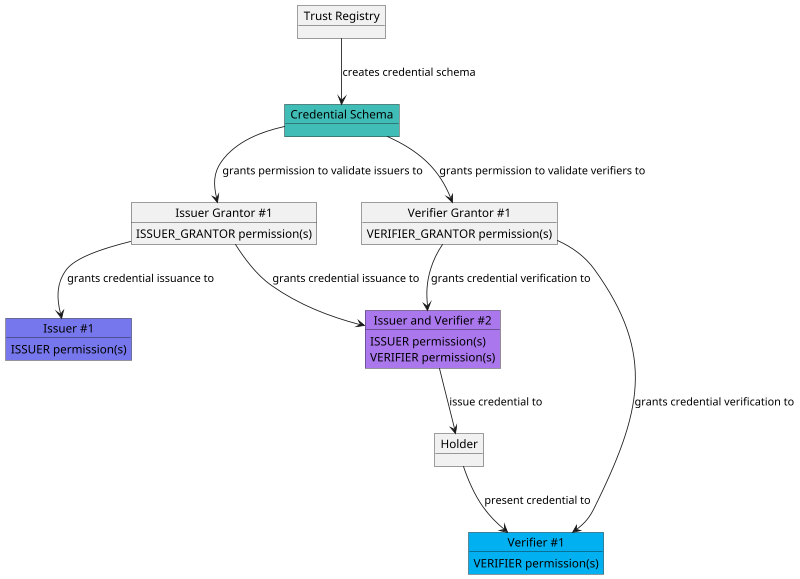
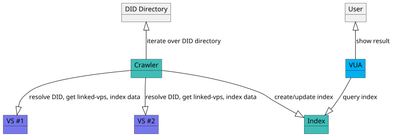
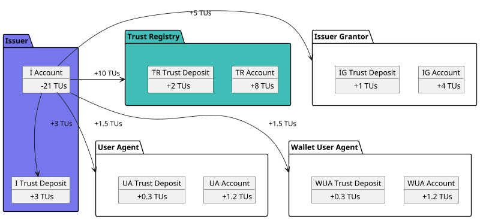
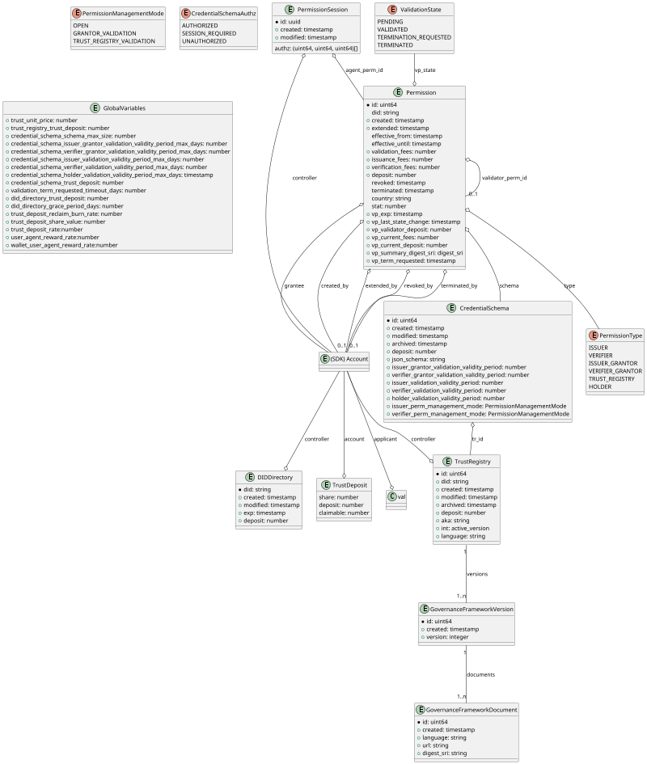
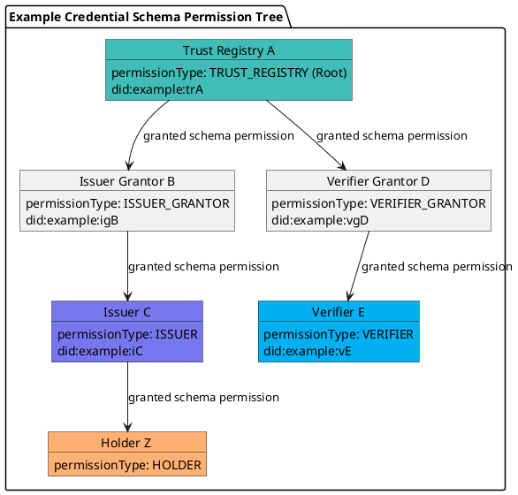
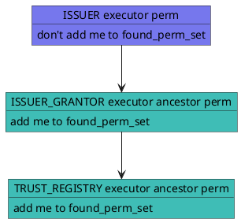
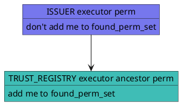

# Verifiable Public Registry v1 Specification

**Specification Status:** *Approved*

**Latest Draft:** [verana-labs/verifiable-trust-vpr-spec](https://github.com/verana-labs/verifiable-trust-vpr-spec)

**Editors:**

~ [Fabrice Rochette](https://www.linkedin.com/in/fabricerochette) ([The Verana Foundation](https://verana.foundation), [2060.io](https://verana.foundation))

**Contributors:**
<!-- -->

**Participate:**

~ [GitHub repo](https://github.com/verana-labs/verifiable-trust-vpr-spec)

~ [File a bug](https://github.com/verana-labs/verifiable-trust-vpr-spec/issues)

~ [Commit history](https://github.com/verana-labs/verifiable-trust-vpr-spec/commits/main)

---

## Abstract

The internet is broken. Existing communication channels are insecure and outdated. Because they rely on public identifiers — like email addresses, usernames, or phone numbers — anyone who knows your identifier can reach you, whether you invited them or not.

Worse, there’s no reliable way to verify the identity of either service providers or users. This leaves the door wide open to spam, phishing, fraud, and identity theft.

On the service side, each provider imposes its own fragmented registration process, often with complex password requirements or forced reliance on federated login systems—effectively handing control over to large third-party platforms.

Although the World Wide Web was originally built for openness and interoperability, dominant players have reshaped it into a closed, centralized system that most people and organizations now depend on. Privacy has become an afterthought, and personal data is routinely harvested, exploited, or leaked.

To rebuild a trustworthy internet, we need new communication channels — channels that are secure by design, based on mutual verification, and governed by decentralized trust. 

Connecting to a service, proving who you are, or creating an account should be as simple and safe as presenting a verifiable credential.

A universal, open trust layer is essential for this vision to succeed.

That’s the purpose of **Verifiable Trust**. The concept of **Verifiable Trust** is specified in the [Verifiable Trust spec](https://github.com/verana-labs/verifiable-trust-spec).

This specification deals with the Verifiable Public Registry (VPR), part of the Verifiable Trust concept.

## About this Document

In order to fully understand the concepts developed in this document, you should have some basic knowledge of [[ref:DID]], [[ref:DIDComm]], [[ref:VS]], [[ref:trust registry]], ledger-based applications, and more generally, all terms present in the [Terminology](#terminology) section.

## Introduction

### What is a Trust Registry?

*This section is non-normative.*

A trust registry, or verifiable data registry, is an approved list of [[ref: issuers]] and [[ref: verifiers]] that are authorized to issue/verify certain credentials in an ecosystem.

A trust registry typically expose APIs that are consumed by services that would like to [[ref: query]] its database, and take decisions based on the returned result:

- can [[ref: participant]] #1 issue credential for schema ABC?
- can [[ref: participant]] #2 request credential presentation of credential issued by issuer DEF from schema GHI?

### What is a Verifiable Public Registry?

*This section is non-normative.*

A Verifiable Public Registry ([[ref: VPR]]) is a public "registry of trust registries" service, which provides:

- trust registry features, that can be used by all its [[ref: participants]]: create trust registries, for each trust registry, define its credential schemas, who can issue, verify credential of a specific credential schema,...
- a tokenized business model(s), for charging [[ref: participants]] for [[ref: trust fees]], that are transferred to other [[ref: participants]], and/or locked into [[ref: trust deposits]].
- a query API, used by Verifiable Services, Verifiable User Agents, to enforce application of governance frameworks and rules of created trust registries.

### Conformance

As well as sections marked as non-normative, all authoring guidelines, diagrams, examples, and notes in this specification are non-normative. Everything else in this specification is normative.
The key words MAY, MUST, MUST NOT, OPTIONAL, RECOMMENDED, REQUIRED, SHOULD, and SHOULD NOT in this document are to be interpreted as described in [BCP 14](https://datatracker.ietf.org/doc/html/bcp14) [RFC2119](https://w3c.github.io/vc-data-model/#bib-rfc2119) [RFC8174](https://w3c.github.io/vc-data-model/#bib-rfc8174) when, and only when, they appear in all capitals, as shown here.

## Terminology

[[def: account, accounts]]:
~ A [[ref: verifiable public registry]] account. An account has one or more controller, that can be a user, groups...

[[def: applicant, applicants]]:
~ A [[ref: controller]] that starts a [[ref: validation process]].

[[def: controller, controllers]]:
~ An [[ref: account]] which is the controller of a specific resource in an [[ref: VPR]].

[[def: credential schema, credential schemas]]:
~ An [[ref: VPR]] resource which represents a verifiable credential definition and the associated permissions and business rules for issuing, verifying or holding a credential linked to this credential schema.

[[def: credential schema permission, credential schema permissions, CSP]]:
~ A permission, linked to a [[ref: credential schema]], that represent a grant for being [[ref: issuer]], [[ref: verifier]], [[ref: issuer grantor]], or [[ref: verifier grantor]] of a [[ref: credential schema]].

[[def: decentralized identifier, DID, DIDs]]:
~ A decentralized identifier, as specified in [[spec-norm:DID-CORE]].

[[def: decentralized identifier communication, DIDComm]]:
~ [DIDComm](https://identity.foundation/didcomm-messaging/spec/) uses [[ref: DIDs]] to establish confidential, ongoing connections.

[[def: decentralized identifier document, DID Document, DID Documents]]:
~ A DID Document, as specified in [[spec-norm:DID-CORE]].

[[def: verifiable public registry, VPR, VPRs]]:
~ a public, normally decentralized, ledger-based network, which provides: trust registry features, that can be used by all its [[ref: participants]]: create trust registries, for each trust registry, define its credential schemas, who can issue, verify credential of a specific credential schema,... and a tokenized business model for charging/rewarding [[ref: participants]].

[[def: verifiable service, VS, VSs]]:
~ A service, identified by a resolvable [[ref: DID]] that can be deployed anywhere by its owner, and that is conforming to this spec and has a resolvable [[ref: proof of trust]]. See [[ref: DT Spec]].

[[def: verifiable user agent, VUA, VUAs]]:
~ A user agent for accessing and using [[ref: VSs]]. To be considered a [[ref: VUA]], a user agent must conform and enforce this spec, such as presenting a proof of trust to end user before accepting connecting to [[ref: VS]] compliant services, and refuse connecting to not compliant services. See [[ref: DT Spec]].

[[def: Verifiable Trust Specification, DT Specs, DT Spec]]:
~ see [DT Spec](https://github.com/verana-labs/verifiable-trust-spec).

[[def: denom]]:
~ Native token of a [[ref: VPR]], example: VNA.

[[def: DID Directory, DID directory]]:
~ A repository of DIDs in an VPR.

[[def: entity, entities]]:
~ An [[ref: account]], a [[ref: group]], or the [[ref: governance authority]].

[[def: essential credential schema, essential credential schemas]]:
~ Default [[ref: credential schema]], created at genesis of an [[ref: VPR]], that provide the basis for a trust layer to exist in the ecosystem so that [[ref: VUA]] can generate a [[ref: proof of trust]].

[[def: estimated transaction fees]]:
~ Estimated fees required, in [[ref: denom]], that is passed when execute a [[ref: transaction]] in an [[ref: VPR]]. Usually, a estimated transaction fees are always slightly greater than [[ref: transaction fees]], to make sure the execution of the transaction will not be aborted for an out-of-gas situation. Unused gas is refunded to account.

[[def: governance framework, GF]]:
~ The governance framework (GF) of a [[ref: VPR]].

[[def: governance authority, GA]]:
~ The governance authority (GA) of a [[ref: VPR]].

[[def: group]]:
~ A group.

[[def: holder, holders]]:
~ A role an entity might perform by possessing one or more verifiable credentials and generating verifiable presentations from them. A holder is often, but not always, a [[ref: subject]] of the verifiable credentials they are holding. Holders store their credentials in credential repositories. Example holders include organizations, persons, things.

[[def: issuer, issuers]]:
~ A role an entity can perform by asserting claims about one or more [[ref: subjects]], creating a verifiable credential from these claims, and transmitting the verifiable credential to a [[ref: holder]]. Example issuers include corporations, non-profit organizations, trade associations, governments, and individuals.

[[def: issuer grantor, issuer grantors]]:
~ A role an entity can perform in a credential schema by adding or revoking issuers.

[[def: json schema, json schemas, Json Schema, Json Schemas]]
~ a Json Schema, as specified in [https://json-schema.org/specification](https://json-schema.org/specification).

[[def: keeper]]:
~ A storage map(key, value) in the ledger of an [[ref: VPR]].

[[def: linked-vp]]:
~ A presentation of a [[ref: verifiable credential]] as specified in [LINKED-VP](https://identity.foundation/linked-vp/).

[[def: participant, participants]]:
~ An entity that uses an [[ref: VPR]] and its trust layer to provide or use services.

[[def: proof of trust]]:
~ Visual representation using [[ref: essential credential schemas]] of a [[ref: trust resolution]] process of a [[ref: VS]], for identifying the [[ref: VS]], its owner, and the [[ref: issuer]] of the verifiable credential of its owner.

[[def: query]]:
~ A read-only action that perform some reading in an [[ref: VPR]] and returns value.

[[def: subject, subjects]]:
~ A thing about which claims are made. Example subjects include human beings, animals, things, and organization, a [[ref: DID]]...

[[def: transaction, transactions]]:
~ An action that modifies the ledger of an [[ref: VPR]] and which execution requires transaction fees.

[[def: transaction fees]]:
~ Fees required, in [[ref: denom]], to execute a [[ref: transaction]] in an [[ref: VPR]].

[[def: trust deposit, trust deposits]]:
~ A financial deposit that is used as a trust guarantee. For a given [[ref: controller]], its trust deposit is increased when running validation process (either as an [[ref: applicant]] or as a [[ref: validator]]), or when registering [[ref: DID]] in the DID directory.

[[def: trust fees]]:
~ Fees paid by an [[ref: applicant]] when running a validation process and/or when registering [[ref: DID]] in the DID directory.

[[def: trust registry governance framework, TRGF]]:
~ The ecosystem governance framework (EGF) of a [[ref: Trust Registry]].

[[def: trust unit, trust units]]:
~ Price, in [[ref: denom]], of one unit of trust.

[[def:trust registry, trust registries]]
~ An approved list of [[ref: issuers]] and [[ref: verifiers]] that are authorized to issue/verify certain credentials in an ecosystem.

[[def: trust resolution]]:
~ Process run by, for example a [[ref: VUA]] or a [[ref: VS]], which purpose is to recursively resolve [[ref: DID]] by digging into [[ref: DID Documents]] and look for [[ref: linked-vp]] entries and their [[ref: issuer]] [[ref: DIDs]], and trust-registry entries to gather whether the service provided by the [[ref: DID]] is trustable (and legitimate), or not.

[[def: URI, URIs]]
~ An Universal Resource Identifier, as specified in [rfc3986](https://datatracker.ietf.org/doc/html/rfc3986).

[[def: valid permission, valid permissions]]:
~ For a given country code, a credential schema permission of a given type, which (country attribute is null or equals to the given country code), and effective_from timestamp is lower than current timestamp, and (effective_until timestamp is null or greater than current timestamp), and revoked is null and terminated is null.

[[def: validation process]]:
~ A process run by [[ref: applicants]] that want to, for a specific [[ref: credential schema]], be a [[ref: issuer]], be a [[ref: verifier]], or simply hold a verifiable credential linked to the [[ref: credential schema]].

[[def: validator]]:
~ A role an [[ref: entity]] performs by participating in validation processes with [[ref: applicants]] in order to register them as [[ref: issuer]], or [[ref: verifier]] of a [[ref: credential schema]], or to deliver a verifiable credential to them.

[[def: verifier, verifiers]]:
~ A role an entity performs by receiving one or more verifiable credentials, optionally inside a verifiable presentation for processing. Example verifiers include service providers.

[[def: verifier grantor, verifier grantors]]:
~ A role an [[ref: entity]] can perform in a [[ref: credential schema]] by adding or revoking verifiers.

[[def: verifiable credential, verifiable credentials]]:
~ A verifiable credential as defined in [[spec-norm:VC-DATA-MODEL]].

## Naming Conventions

### In this spec

- For clarity, Camel Case is used for naming Modules, Entities, Objects, etc.

### In Implementations

- All APIs MUST return valid JSON.
- All JSON content MUST use Snake Case for object, attribute... names.
- Object attributes and Json Content in general can be returned in any order.

## High Level VPR Features

### Trust Registry Management

*This section is non-normative.*

In an [[ref: VPR]], any [[ref: account]] can create (and become the [[ref: controller]] of) a `TrustRegistry` entry that represents a [[ref: trust registry]]. `TrustRegistry` entry includes human readable [[ref: trust registry governance framework]] that defines the ecosystem rules that will be enforced by using the [[ref: VPR]] features.

### Credential Schema, Permissions, and Validation process

*This section is non-normative.*

Owner of a `TrustRegistry` entry can create [[ref: credential schema]](s).

A [[ref: credential schema]] contain information, such as the [[ref: json schema]] that issued credentials of this schema must conform to, and sets of permissions for controlling the use of the [[ref: credential schema]].

More specifically, [[ref: controller]] can configure, for a credential schema:

- if anyone can *issue* credentials of this schema, or if it is restricted to specific issuers. If restricted, how are issuers selected: directly by the trust registry, or through one or more *issuer grantors* by running a validation process.
- if anyone can *verify* credentials of this schema, or if it is restricted to specific verifiers. If restricted, how are verifiers selected: directly by the trust registry, or through one or more *verifier grantors* by running a validation process.

For being an issuer, issuer grantor, verifier, or verifier grantor, it is needed to have an account in the [[ref: VPR]] and run a validation process. A validation process is run between an *applicant* (the one that would like to obtain a permission for a given schema) and a *validator* (the one that has granted permission(s) for validating applicants and create them permissions). Running a validation process usually involve the payment of fees.

#### Issuers

*This section is non-normative.*

Let's dig into the possible cases for an [[ref: applicant]] that wishes to become an [[ref: issuer]] of a [[ref: credential schema]]. Here are some [[ref: credential schema]] configuration modes that can be set by the [[ref: controller]] of the schema, to define the rules for being an [[ref: issuer]]:

- OPEN: anyone can issue credentials of this schema, with no required validation of issuers.

- GRANTOR_VALIDATION: to be added as an [[ref: issuer]], [[ref: applicant]] must initiate a validation process with a [[ref: validator]] ([[ref: issuer grantor]]).

- TRUST_REGISTRY: to be added as an [[ref: issuer]], [[ref: applicant]] must initiate a validation process with the trust registry controller.

#### Verifiers

*This section is non-normative.*

Similar to issuer: Here are some [[ref: credential schema]] configuration modes that can be set by the [[ref: controller]] of the schema, to define the rules for being an [[ref: verifier]]:

- OPEN: anyone can verify credentials of this schema, with no required validation of verifiers.

- GRANTOR_VALIDATION: to be added as an [[ref: verifier]], [[ref: applicant]] must initiate a validation process with a [[ref: validator]] ([[ref: verifier grantor]]).

- TRUST_REGISTRY: to be added as an [[ref: verifier]], [[ref: applicant]] must initiate a validation process with the trust registry controller.

#### Issuer Grantors

*This section is non-normative.*

Based on the issuer configuration mode of the credential schema, issuer grantors are needed or not:

- OPEN: issuer grantors cannot exist.

- GRANTOR_VALIDATION: to be added as an [[ref: issuer grantor]], [[ref: applicant]] must initiate a validation process with the trust registry controller.

- TRUST_REGISTRY: issuer grantors cannot exist, as the trust registry directly selects the issuers of this schema.

#### Verifier Grantors

*This section is non-normative.*

Based on the verifier configuration mode of the credential schema, issuer grantors are needed or not:

- OPEN: verifier grantors cannot exist.

- GRANTOR_VALIDATION: to be added as an [[ref: verifier grantor]], [[ref: applicant]] must initiate a validation process with the trust registry controller.

- TRUST_REGISTRY: verifier grantors cannot exist, as the trust registry directly selects the verifiers of this schema.

#### Holders

*This section is non-normative.*

To get issued a verifiable credential from a given schema, it is usually not needed to have an [[ref: account]], because the finality of the operation is the delivery of a credential, not the creation of a permission in the [[ref: VPR]]. However, if the issuer would like to charge the holder for issuing the credential to it, an account is needed.

#### Examples

*Example with GRANTOR_VALIDATION mode for both issuer and verifier participants:*



*Example of a candidate [[ref: issuer]] ([[ref: applicant]]) that would like to be granted an ISSUER permission by a [[ref: validator]] that has a ISSUER_GRANTOR permission:*

```plantuml
scale max 800 width
actor "Applicant\n(issuer candidate)\nAccount" as ApplicantAccount 
actor "Applicant\n(issuer candidate)\nVS Browser" as ApplicantBrowser 

actor "Validator\n(issuer grantor)\nVS" as ValidatorVS
actor "Validator\n(issuer grantor)\nAccount" as ValidatorAccount

participant "Verifiable Public Registry" as VPR #3fbdb6

ApplicantAccount --> VPR: create new validation with Validator 
VPR <-- VPR: create validation entry.
ApplicantAccount <-- VPR: validation entry created
ApplicantBrowser --> ValidatorVS: connect to validator VS DID found in validation.perm\nby creating a DIDComm connection
ApplicantBrowser <-- ValidatorVS: DIDComm connection established.
ApplicantBrowser --> ValidatorVS: I want to proceed with validation.id=...
ValidatorVS --> ValidatorVS: load validation with id=...\nand verify the associated validation.perm is referring to me
ApplicantBrowser <-- ValidatorVS: request proof of control\nof validation.applicant account (blind sign)
ApplicantBrowser --> ValidatorVS: send blind sign proof of account
ApplicantBrowser <-- ValidatorVS: proof accepted, you are the controller\nof validation entry, I trust you.
ApplicantBrowser <-- ValidatorVS: which DID do you want to register as an issuer?
ApplicantBrowser --> ValidatorVS: send DID
ValidatorVS --> ValidatorVS: resolve DID and get pub keys
ApplicantBrowser <-- ValidatorVS: request proof of ownership\nof the DID to be registered in the ISSUER permission (blind sign)
ApplicantBrowser --> ValidatorVS: send blind sign proofs
ApplicantBrowser <-- ValidatorVS: proof accepted, you are the controller of this DID, I trust you.
note over ApplicantBrowser, ValidatorVS #EEEEEE: (*optional*) repeat the following until tasks completed
ApplicantBrowser <-- ValidatorVS: Are you a legitimate issuer?\nProve it, by filling forms, sending documents...
ApplicantBrowser --> ValidatorVS: perform requested tasks...
note over ApplicantBrowser, ValidatorVS #EEEEEE: tasks completed
ApplicantBrowser <-- ValidatorVS: Your are a legitimate candidate. I'll now create an ISSUER permission for your account and DID.
ValidatorAccount --> VPR #3fbdb6: set validation.state to VALIDATED\ncreate permission(s) for applicant.
VPR --> ValidatorAccount: Receive trust fees.
ApplicantBrowser <-- ValidatorVS: notify ISSUER permission created for your account and DID.\nDID can now issue credentials of this schema.
```

### DID Directory Management

*This section is non-normative.*

The [[ref: DID]] directory is a public database of [[ref: DID]] that can be used by crawlers to index the metadata of the [[ref: VS]] provided by these [[ref: DID]].

Search engines simply need to iterate over the [[ref: DID Directory]] and index [[ref: VSs]] based on [[ref: VS]] metadata (DID Document, presented credentials,...)
For example, the DID directory is essential to Verifiable User Agents (VUAs), such as social browsers, cdn browsers,... but can although be used by a general classic form-based **search engine** that would return simple link(s) for accessing [[ref: VSs]].

Any [[ref: participant]] can register a [[ref: DID]] in the DID directory by passing some [[ref: trust fees]] and/or [[ref: trust deposit]] .



### Business models

#### Trust Deposit

*This section is non-normative.*

In a [[ref: VPR]], each participant [[ref: account]] has a corresponding [[ref: trust deposit]].

This trust deposit is automatically funded when executing transactions that involve trust: creation of entities such as trust registries, credential schemas, did in did directory; fees transferred from one participant to other participant(s) for the execution of a service, presentation or issuance of a credential...

Fundamentally, the trust deposit enables the so called "Proof-of-Trust" (PoT) feature of the [[ref:VPR]]:

- the more you use the [[ref: VPR]], the more your [[ref: trust deposit]] grows.
- a trust deposit generates yield: in a VPR, block execution transaction fees are distributed not only to network validators, but to trust deposit owners as well.
- if you do not respect the governance framework of the [[ref: VPR]] (or run fraudulent activities) your deposit can be partially or fully slashed by the governance authority.
- if you do not respect the governance framework of the [[ref: trust registries]] you are interacting with (as issuer, verifier, holder, etc...) part of your deposit can be slashed by the governance authority of the corresponding trust registry.
- when your deposit has been slashed, you need to refill it in order to continue to use the services that generated the sanction.
- when you stop using a service, you can free its corresponding trust deposit.
- freed deposit can be reused in other service(s), or withdrawn (with penalties: part of the withdrawn tokens are burnt).

#### Entity creation

*This section is non-normative.*

The following network fees are not directly sent to a specific participant but are distributed using the normal distribution principle of a [[ref: VPR]].

Creating an instance of one of the following entities implies paying network fees and sending funds to the trust deposit:

- Trust Registries (once)
- Credential Schema (once)
- Did Directory (renewable subscription)

Other operations that just imply paying network fees:

- Updating governance frameworks of Trust Registries
- Removing a Did from the Did Directory
...

#### Pay per execution of the validation process

*This section is non-normative.*

The validation fees are partially sent to specific participant(s), the remaining fees are sent to trust deposits or treated as normal network fees and distributed using the normal distribution principle of a [[ref: VPR]].

| Payee → Payer ↓  | Trust Registry                      | Issuer Grantor                        | Verifier Grantor                    | Issuer                              | Verifier | Holder                                  |
|------------------|-------------------------------------|---------------------------------------|-------------------------------------|-------------------------------------|----------|-----------------------------------------|
| Issuer Grantor   | renewable subscription (1)          |                                       |                                     |                                     |          |                                         |
| Verifier Grantor | renewable subscription (2)          |                                       |                                     |                                     |          |                                         |
| Issuer           | renewable subscription (3)          | renewable subscription (1)            |                                     |                                     |          |                                         |
| Verifier         | renewable subscription (4)          |                                       | renewable subscription (2)          |                                     |          |                                         |
| Holder           |                                     |                                       |                                     | renewable subscription              |          |                                         |

- (1): if *issuer mode* is set to GRANTOR_VALIDATION.
- (2): if *verifier mode* is set to GRANTOR_VALIDATION.
- (3): if *issuer mode* is set to TRUST_REGISTRY.
- (4): if *verifier mode* is set to TRUST_REGISTRY.

#### Pay per issued credential

*This section is non-normative.*

The Pay per issued credential fees are partially sent to specific participant(s), the rest is sent to trust deposits or distributed using the normal distribution principle of a [[ref: VPR]].

- When a participant is granted an ISSUER permission for a given schema, trust registry and issuer grantor may define *issuance fees* for each issued credential. In this case, ISSUER must pay these fees in order to be able to deliver the credential to the holder.
- Wallet User Agent and User Agent are rewarded, too.
- Part of the fees are sent to trust deposits.

*Example:*



#### Pay per verified credential

*This section is non-normative.*

The Pay per issued credential fees are partially sent to specific participant(s), the rest is sent to trust deposits or distributed using the normal distribution principle of a [[ref: VPR]].

- When a participant is granted a VERIFIER permission for a given schema, trust registry, issuer grantor, issuer, verifier grantor may define *verification fees* for each verified credential. In this case, VERIFIER must pay these fees in order to be able to request presentation, for a specific issuer, of a credential of this schema to the holder.
- Wallet User Agent and User Agent are rewarded, too.
- Part of the fees are sent to trust deposits.

*Example:*


## Governance of a VPR

*This section is non-normative.*

A [[ref: governance framework]] must define the governance rules of an [[ref: VPR]]. A [[ref: governance authority]] will ensure the application of the [[ref: governance framework]] rules and if necessary apply some financial sanctions.

## Data model

For simplicity, data model is presented using a object relational model, which would not be always optimal depending on implementation choices, that may require organizing data differently. It's the role of implementors to adapt the data model so it will be suitable for a given implementation (for example, a keymap-like based storage would be probably a better choice for a ledger-based implementation).



### TrustRegistry

`TrustRegistry`:

- `id` (uint64) (*mandatory*): the id of the trust registry.
- `did` (string) (*mandatory*): the did of the trust registry.
- `controller` (account) (*mandatory*): [[ref: account]] that controls this entry.
- `created` (timestamp) (*mandatory*): timestamp this TrustRegistry has been created.
- `modified` (timestamp) (*mandatory*): timestamp this TrustRegistry has been modified.
- `archived` (timestamp) (*mandatory*): timestamp this TrustRegistry has been archived.
- `deposit` (number) (*mandatory*): [[ref: trust deposit]] (in `denom`)
- `aka` (string) (*optional*): optional additional URI of this trust registry.
- `language` (string(2)) (*mandatory*): primary language alpha-2 code (ISO 3166) of this trust registry.
- `active_version` (int): (*mandatory*) active governance framework version.

### GovernanceFrameworkVersion

`GovernanceFrameworkVersion`:

- `id` (uint64) (*mandatory*): the id of the schema.
- `tr_id` (uint64) (*mandatory*): the id of the trust registry that controls this `GovernanceFrameworkVersion` entry.
- `created` (timestamp) (*mandatory*): timestamp this GovernanceFrameworkVersion has been created.
- `version` (int) (*mandatory*): version of this GF. MUST Starts with 1.

### GovernanceFrameworkDocument

`GovernanceFrameworkDocument`

- `id` (uint64) (*mandatory*): the id of the schema.
- `gfv_id` (uint64) (*mandatory*): the id of the `GovernanceFrameworkVersion` entry.
- `created` (timestamp) (*mandatory*): timestamp this GovernanceFrameworkDocument has been created.
- `language` (string(2)) (*mandatory*): primary language alpha-2 code (ISO 3166) of this trust registry.
- `url` (string) (*mandatory*): URL where the document is published.
- `digest_sri` (string) (*mandatory*): digest_sri of the document.

### CredentialSchema

`CredentialSchema`:

**General Info**:

- `id` (uint64) (*mandatory*): the id of the schema.
- `tr_id` (uint64) (*mandatory*): the id of the trust registry that controls this `CredentialSchema` entry.
- `created` (timestamp) (*mandatory*): timestamp this CredentialSchema has been created.
- `modified` (timestamp) (*mandatory*): timestamp this CredentialSchema has been modified.
- `archived` (timestamp) (*mandatory*): timestamp this CredentialSchema has been archived.
- `deposit` (number) (*mandatory*): [[ref: trust deposit]] (in `denom`)
- `json_schema` (string) (*mandatory*): Json Schema used for issuing credentials based on this schema.
- `issuer_grantor_validation_validity_period` (number) (*mandatory*): number of days after which an issuer grantor validation process expires and must be renewed.
- `verifier_grantor_validation_validity_period` (number) (*mandatory*): number of days after which a verifier grantor validation process expires and must be renewed.
- `issuer_validation_validity_period` (number) (*mandatory*): number of days after which an issuer validation process expires and must be renewed.
- `verifier_validation_validity_period` (number) (*mandatory*): number of days after which a verifier validation process expires and must be renewed.
- `holder_validation_validity_period` (number) (*mandatory*): number of days after which an holder validation process expires and must be renewed.
- `issuer_perm_management_mode` (PermissionManagementMode) (*mandatory*): defines how permissions are managed for issuers of this `CredentialSchema`. OPEN means anyone can create its own ISSUER permission; GRANTOR_VALIDATION means a validation process MUST be run between a candidate ISSUER and an ISSUER_GRANTOR in order to create an ISSUER permission; TRUST_REGISTRY_VALIDATION means a validation process MUST be run between a candidate ISSUER and the trust registry owner of the `CredentialSchema` entry in order to create an ISSUER permission;
- `verifier_perm_management_mode` (PermissionManagementMode) (*mandatory*): defines how permissions are managed for verifiers of this `CredentialSchema`. OPEN means anyone can create its own VERIFIER permission; GRANTOR_VALIDATION means a validation process MUST be run between a candidate VERIFIER and an VERIFIER_GRANTOR in order to create a VERIFIER permission; TRUST_REGISTRY_VALIDATION means a validation process MUST be run between a candidate VERIFIER and the trust registry owner of the `CredentialSchema` entry in order to create an VERIFIER permission;

### Permission

`Permission`:

- `id` (uint64) (*mandatory*): the id of the perm.
- `schema_id` (uint64) (*mandatory*): the id of the related `CredentialSchema` entry.
- `type` (PermissionType): ISSUER, VERIFIER, ISSUER_GRANTOR, VERIFIER_GRANTOR, TRUST_REGISTRY, HOLDER
- `did` (string) (*optional*): [[ref: DID]] this permission refers to. MUST conform to [[spec-norm:RFC3986]].
- `grantee` (account) (*mandatory*): [[ref: account]] this permission refers to (account granted to act as `type` for schema `schema_id`).
- `created` (timestamp) (*mandatory*): timestamp this `Permission` has been created.
- `created_by` (account) (*mandatory*): [[ref: account]] that created this permission.
- `extended` (timestamp) (*mandatory*): timestamp this `Permission` has been extended.
- `extended_by` (account) (*mandatory*): [[ref: account]] that extended this permission.
- `effective_from` (timestamp) (*optional*): timestamp from which (inclusive) this `Permission` is effective.
- `effective_until` (timestamp) (*optional*): timestamp until when (exclusive) this `Permission` is effective, null if no time limit has been set for this permission.
- `modified` (timestamp) (*mandatory*): timestamp this Permission has been modified.
- `validation_fees` (number) (*mandatory*): price to pay by an applicant to a validator (grantee of this perm) for running a validation process for a given validation period, in trust unit. Default to 0.
- `issuance_fees` (number) (*mandatory*): fees requested by grantee of this perm when a credential is issued, in trust unit. Default to 0.
- `verification_fees` (number) (*mandatory*): fees requested by grantee of this perm when a credential is verified, in trust unit. Default to 0.
- `deposit` (number) (*mandatory*): accumulated *grantee* deposit in the context of the *use* of this permission (including the validation process), in `denom`. Usually, it is incremented when for example, for a ISSUER type `Permission` `perm`, issuer issues credentials that require paying issuance fees: an additional % of the fees is charged to issuer and sent to its deposit, corresponding deposit amount increases this `perm.deposit` value as well. If `perm` is, let's say revoked, then corresponding `perm.deposit` value is freed from `perm.grantee` Trust Deposit.
- `revoked` (timestamp) (*optional*): manual revocation timestamp of this Perm.
- `revoked_by` (account) (*mandatory*): [[ref: account]] that revoked this permission.
- `terminated` (timestamp) (*optional*): manual termination (by grantee) timestamp of this Perm.
- `terminated_by` (account) (*mandatory*): [[ref: account]] that terminated this permission.
- `country` (string) (*optional*): country, as an alpha-2 code (ISO 3166), this permission refers to. If null, it means permission is not linked to a specific country.
- `validator_perm_id` (uint64) (*optional*): permission of the validator assigned to the validation process of this permission, ie *parent node* in the `Permission` tree.
- `vp_state` (enum) (*mandatory*): one of PENDING, VALIDATED, TERMINATED, TERMINATION_REQUESTED.
- `vp_exp` (timestamp) (*optional*): validation expiration timestamp. This expiration timestamp is for the validation process itself, not for the issued credential or `Permission` expiration timestamp.
- `vp_last_state_change` (timestamp) (*mandatory*)
- `vp_validator_deposit`: number (*optional*): accumulated validator trust deposit, in [[ref: denom]].
- `vp_current_fees` (number) (*mandatory*): current action escrowed fees that will be paid to [[ref: validator]] upon validation process completion, in [[ref: denom]].
- `vp_current_deposit` (number) (*mandatory*): current action trust deposit, in [[ref: denom]].
- `vp_summary_digest_sri` (digest_sri) (*optional*): an optional digest_sri, set by [[ref: validator]], of a summary of the information, proofs... provided by the [[ref: applicant]].
- `vp_term_requested` (timestamp) (*optional*): set when [[ref: controller]] requests the termination of this entry.

### PermissionSession

`PermissionSession`:

- `id` (uuid) (*mandatory*): session uuid.
- `controller` (account) (*mandatory*): account that controls the entry.
- `agent_perm_id` (uint64) (*mandatory*): permission id of the agent.
- `modified` (timestamp) (*mandatory*): timestamp this PermissionSession has been modified.
- `created` (timestamp) (*mandatory*): timestamp this PermissionSession has been created.
- `authz` (uint64 (Permission id), uint64 (Permission id), uint64 (Permission id))[] (mandatory): permission(s) linked to this session (issuer, verifier, wallet_agent).

### DIDDirectory

`DidDirectory`:

- `did` (string) (*mandatory*) (key): the [[ref: DID]]. MUST conform to [[spec-norm:RFC3986]].
- `controller` (account) (*mandatory*): [[ref: account]] that created the [[ref: DID]].
- `created` (timestamp) (*mandatory*): timestamp this [[ref: DID]] has been added.
- `modified` (timestamp) (*mandatory*): timestamp this [[ref: DID]] has been modified.
- `exp` (timestamp) (*mandatory*): expiration timestamp.
- `deposit` (number) (*mandatory*): effective [[ref: trust deposit]] for this [[ref: DID]] (in `denom`)

### TrustDeposit

`TrustDeposit`:

- `share` (number) (*mandatory*): share of the module total deposit.
- `account` (account) (*mandatory*) (key): the [[ref: account]]
- `amount` (number) (*mandatory*): amount of deposit in `denom`.
- `claimable` (number) (*mandatory*): amount of claimable deposit in `denom`.

### GlobalVariables

`GlobalVariables`:

**Trust Unit:**

- `trust_unit_price` (number) (*mandatory*): [[ref: trust unit]] price, in [[ref: denom]].

**Credential Schema:**

- `credential_schema_trust_deposit` (number) (*mandatory*): default trust deposit value for creating a credential schema, in [[ref: trust units]].
- `credential_schema_schema_max_size` (number) (*mandatory*): maximum size of the `schema` string attribute for a `CredentialSchema`.
- `credential_schema_issuer_grantor_validation_validity_period_max_days` (number) (*mandatory*): maximum number of days an issuer grantor validation can be valid for.
- `credential_schema_verifier_grantor_validation_validity_period_max_days` (number) (*mandatory*): maximum number of days an verifier grantor validation can be valid for.
- `credential_schema_issuer_validation_validity_period_max_days` (number) (*mandatory*): maximum number of days an issuer validation can be valid for.
- `credential_schema_verifier_validation_validity_period_max_days` (number) (*mandatory*): maximum number of days an verifier validation can be valid for.
- `credential_schema_holder_validation_validity_period_max_days` (number) (*mandatory*): maximum number of days an [[ref: holder]] validation can be valid for.

**Validation:**

- `validation_term_requested_timeout_days` (number) (*mandatory*): after this number of days, validation applicant can confirm termination of a validation if [[ref: validator]] didn't do it.

**Trust Registry:**

- `trust_registry_trust_deposit` (number) (*mandatory*): default trust deposit value for creating a trust registry, in [[ref: trust units]].

**DID Directory:**

- `did_directory_trust_deposit` (number) (*mandatory*): default trust deposit value, in [[ref: trust units]].
- `did_directory_grace_period_days` (number) (*mandatory*): default grace period, in days.

**Trust Deposit:**

- `trust_deposit_reclaim_burn_rate` (number) (*mandatory*): percentage of burnt deposit when an account execute a reclaim of capital amount.
- `trust_deposit_share_value`(number) (*mandatory*): Value of one share of trust deposit, in `denom`. Default an initial value: 1. Increase over time, when yield is produced.
- `trust_deposit_rate`(number) (*mandatory*): Rate used for dynamically calculating trust deposits from trust fees. Default value: 20% (0.20)
- `wallet_user_agent_reward_rate`(number) (*mandatory*): Rate used for dynamically calculating wallet user agent rewards from trust fees. Default value: 20% (0.20)
- `user_agent_reward_rate`(number) (*mandatory*): Rate used for dynamically calculating user agent rewards from trust fees. Default value: 20% (0.20)

## Module Requirements

All [[ref: VPR]] modules MUST, at least, provide:

- A [[ref: keeper]](s), used to access the module's store(s) and update the state.
- A Msg service, used to process messages when they are routed to the module by BaseApp and trigger state-transitions.
- A [[ref: query]] service, used to process user queries.
- Interfaces, for end users to [[ref: query]] the subset of the state defined by the module and create messages of the custom types defined in the module.

Note about Query REST API:

- all query methods MUST return valid JSON.
- objects MUST be nested when needed, such as when returning a trust registry.
- JSON formatting MUST obey to data model regarding attribute names. A method that returns a Trust Registry entry MUST return an entry called "trust_registry". A method that returns a list of Trust Registries MUST return an entry called "trustRegistries" that contain a list of Trust Registry entries.

Examples:

Get a Trust Registry

```json
"trust_registry": {
  {
    "active_version": 0,
    "aka": "string",
    "controller": "string",
    "created": "2025-01-14T19:40:37.967Z",
    "deposit": "string",
    "did": "string",
    "id": "string",
    "language": "string",
    "modified": "2025-01-14T19:40:37.967Z",
    "versions": [
      {
        "active_since": "2025-01-14T19:40:37.967Z",
        "created": "2025-01-14T19:40:37.967Z",
        "id": "string",
        "tr_id": "string",
        "version": 0,
        "documents": [
          {
            "created": "2025-01-14T19:40:37.967Z",
            "gfv_id": "string",
            "digest_sri": "string",
            "id": "string",
            "language": "string",
            "url": "string"
          }
        ]
      }
    ]  
  }
```

```json
"trustRegistries": [ {
  {
    "active_version": 0,
    "aka": "string",
    "controller": "string",
    "created": "2025-01-14T19:40:37.967Z",
    "deposit": "string",
    "did": "string",
    "id": "string",
    "language": "string",
    "modified": "2025-01-14T19:40:37.967Z",
    "versions": [
      {
        "active_since": "2025-01-14T19:40:37.967Z",
        "created": "2025-01-14T19:40:37.967Z",
        "id": "string",
        "tr_id": "string",
        "version": 0,
        "documents": [
          {
            "created": "2025-01-14T19:40:37.967Z",
            "gfv_id": "string",
            "digest_sri": "string",
            "id": "string",
            "language": "string",
            "url": "string"
          }
        ]
      }
    ]  
  }, {
    "active_version": 0,
    "aka": "string",
    "controller": "string",
    "created": "2025-01-14T19:40:37.967Z",
    "deposit": "string",
    "did": "string",
    "id": "string",
    "language": "string",
    "modified": "2025-01-14T19:40:37.967Z",
    "versions": [
      {
        "active_since": "2025-01-14T19:40:37.967Z",
        "created": "2025-01-14T19:40:37.967Z",
        "id": "string",
        "tr_id": "string",
        "version": 0,
        "documents": [
          {
            "created": "2025-01-14T19:40:37.967Z",
            "gfv_id": "string",
            "digest_sri": "string",
            "id": "string",
            "language": "string",
            "url": "string"
          }
        ],
      }
    ]  
  }
]
```

:::warning
For Msg methods, all precondition checks MUST be verified first for accepting the Msg, and MUST be verified **again** upon method execution
:::

A VPR implementation MUST implement all the following requirements.

:::note
The relative REST path is the path suffix. Implementer can set any prefix, like http://1.2.3.4/verana/tr/v1/get.
:::

| Module                         | Method Name                             | Relative REST API path           | Type   |Requirements      |
|--------------------------------|-----------------------------------------|----------------------------------|--------|------------------|
| Trust Registry                 | Create a Trust Registry                 |                                  | Msg    | [[MOD-TR-MSG-1]](#mod-tr-msg-1-create-new-trust-registry)   |
|                                | Add Governance Framework Document       |                                  | Msg    | [[MOD-TR-MSG-2]](#mod-tr-msg-2-add-governance-framework-document)   |
|                                | Increase Active Version                 |                                  | Msg    | [[MOD-TR-MSG-3]](#mod-tr-msg-3-increase-active-governance-framework-version)   |
|                                | Update Trust Registry                   |                                  | Msg    | [[MOD-TR-MSG-4]](#mod-tr-msg-4-update-trust-registry)   |
|                                | Archive Trust Registry                  |                                  | Msg    | [[MOD-TR-MSG-5]](#mod-tr-msg-5-archive-trust-registry)   |
|                                | Update TR Module Parameters             |                                 | Msg    | [[MOD-TR-MSG-6]](#mod-tr-msg-6-update-module-parameters)   |
|                                | Get Trust Registry                      | /tr/v1/get                  | Query  | [[MOD-TR-QRY-1]](#mod-tr-qry-1-get-trust-registry)   |
|                                | List Trust Registries                   | /tr/v1/list                 | Query  | [[MOD-TR-QRY-2]](#mod-tr-qry-2-list-trust-registries)   |
|                                | List TR Module Parameters               | /tr/v1/params                 | Query  | [[MOD-TR-QRY-3]](#mod-tr-qry-3-list-module-parameters)   |
| Credential Schema              | Create a Credential Schema              |                                 | Msg    | [[MOD-CS-MSG-1]](#mod-cs-msg-1-create-new-credential-schema)   |
|                                | Update a Credential Schema              |                                 | Msg    | [[MOD-CS-MSG-2]](#mod-cs-msg-2-update-credential-schema)   |
|                                | Archive Credential Schema               |                                 | Msg    | [[MOD-CS-MSG-3]](#mod-cs-msg-3-archive-credential-schema)   |
|                                | Update CS Module Parameters             |                                 | Msg    | [[MOD-CS-MSG-4]](#mod-cs-msg-4-update-module-parameters)   |
|                                | List Credential Schemas                 | /cs/v1/list                 | Query  | [[MOD-CS-QRY-1]](#mod-cs-qry-1-list-credential-schemas)   |
|                                | Get a Credential Schema                 | /cs/v1/get                  | Query  | [[MOD-CS-QRY-2]](#mod-cs-qry-2-get-credential-schema)   |
|                                | Render Json Schema                      | /cs/v1/js                   | Query  | [[MOD-CS-QRY-3]](#mod-cs-qry-3-render-json-schema)   |
|                                | List CS Module Parameters               | /cs/v1/params                 | Query  | [[MOD-TR-QRY-3]](#mod-cs-qry-4-list-module-parameters)   |
| Permission                     | Start Permission VP                     |                                 | Msg    | [[MOD-PERM-MSG-1]](#mod-perm-msg-1-start-permission-vp)    |
|                                | Renew a Permission VP                   |                                 | Msg    | [[MOD-PERM-MSG-2]](#mod-perm-msg-2-renew-permission-vp)    |
|                                | Set Permission VP to Validated          |                                 | Msg    | [[MOD-PERM-MSG-3]](#mod-perm-msg-3-set-permission-vp-to-validated)    |
|                                | Request Permission VP Termination       |                               | Msg    | [[MOD-PERM-MSG-4]](#mod-perm-msg-4-request-permission-vp-termination)    |
|                                | Confirm Permission VP Termination       |                                 | Msg    | [[MOD-PERM-MSG-5]](#mod-perm-msg-5-confirm-permission-vp-termination)    |
|                                | Cancel Permission VP Last Request       |                                 | Msg    | [[MOD-PERM-MSG-6]](#mod-perm-msg-6-cancel-permission-vp-last-request)    |
|                                | Create Root Permission                  |                                 | Msg    | [[MOD-PERM-MSG-7]](#mod-perm-msg-7-create-root-permission)   |
|                                | Extend Permission                       |                                 | Msg    | [[MOD-PERM-MSG-8]](#mod-perm-msg-8-extend-permission)  |
|                                | Revoke Permission                       |                                 | Msg    | [[MOD-PERM-MSG-9]](#mod-perm-msg-9-revoke-permission)  |
|                                | Create or update Permission Session     |                                 | Msg    | [[MOD-PERM-MSG-10]](#mod-perm-msg-10-create-or-update-permission-session)  |
|                                | Update Permission Module Parameters     |                                 | Msg    | [[MOD-PERM-MSG-11]](#mod-perm-msg-11-update-permission-module-parameters) |
|                                | List Permissions                        | /perm/v1/list                | Query  | [[MOD-PERM-QRY-1]](#mod-perm-qry-1-list-permissions)    |
|                                | Get a Permission                        | /prem/v1/get                 | Query  | [[MOD-PERM-QRY-2]](#mod-perm-qry-2-get-permission)    |
|                                | Find Permissions With DID               | /perm/v1/find_with_did       | Query  | [[MOD-PERM-QRY-3]](#mod-perm-qry-3-find-permissions-with-did)  |
|                                | Find Beneficiaries                      | /perm/v1/beneficiaries       | Query  | [[MOD-PERM-QRY-4]](#mod-perm-qry-4-find-beneficiaries)  |
|                                | Get Permission Session                  | /perm/v1/get_session         | Query  | [[MOD-PERM-QRY-5]](#mod-perm-qry-5-get-permissionsession) |
|                                | List Permission Module Parameters     |                                 | Query    | [[MOD-PERM-QRY-6]](#mod-perm-qry-6-list-permission-module-parameters)   |
|                                | List Permission Sessions     |                                 | Query    | [[MOD-PERM-QRY-7]](#mod-perm-qry-7-list-permission-sessions)   |
| DID Directory                  | Add a DID                               |                                  | Msg    | [[MOD-DD-MSG-1]](#mod-dd-msg-1-add-a-did)   |
|                                | Renew a DID                             |                                  | Msg    | [[MOD-DD-MSG-2]](#mod-dd-msg-2-renew-a-did)   |
|                                | Remove a DID                            |                                  | Msg    | [[MOD-DD-MSG-3]](#mod-dd-msg-3-remove-a-did)   |
|                                | Touch a DID                             |                                  | Msg    | [[MOD-DD-MSG-4]](#mod-dd-msg-4-touch-a-did)   |
|                                | Update TD Module Parameters             |                                  | Msg    | [[MOD-DD-MSG-5]](#mod-dd-msg-5-update-module-parameters)   |
|                                | List DIDs                               | /dd/v1/list                 | Query  | [[MOD-DD-QRY-1]](#mod-dd-qry-1-list-dids)   |
|                                | Get a DID                               | /dd/v1/get                  | Query  | [[MOD-DD-QRY-2]](#mod-dd-qry-2-get-a-did)   |
|                                | List DD Module Parameters               | /dd/v1/params                 | Query  | [[MOD-DD-QRY-3]](#mod-dd-qry-3-list-module-parameters)   |
| Trust Deposit                  | Adjust Trust Deposit                    |                                  | Msg    | [[MOD-TD-MSG-1]](#mod-td-msg-1-adjust-trust-deposit)   |
|                                | Reclaim Trust Deposit Interests         |                                  | Msg    | [[MOD-TD-MSG-2]](#mod-td-msg-2-reclaim-trust-deposit-interests)   |
|                                | Reclaim Trust Deposit                   |                                  | Msg    | [[MOD-TD-MSG-3]](#mod-td-msg-3-reclaim-trust-deposit)   |
|                                | Update TD Module Parameters             |                               | Msg  | [[MOD-TD-MSG-4]](#mod-td-msg-4-update-module-parameters)   |
|                                | Get Trust Deposit                       | /td/v1/get                  | Query  | [[MOD-TD-QRY-1]](#mod-td-qry-1-get-trust-deposit)   |
|                                | List TD Module Parameters               | /td/v1/params                 | Query  | [[MOD-TD-QRY-2]](#mod-td-qry-2-list-module-parameters)   |

:::note
Any method failure in the precondition/basic checks SHOULD lead to a CLI ERROR / HTTP BAD REQUEST error with a human readable message giving a clue of the reason why method failed.
:::

### Trust Registry Module

#### [MOD-TR-MSG-1] Create New Trust Registry

Any [[ref: account]] CAN execute this method.

##### [MOD-TR-MSG-1-1] Create New Trust Registry parameters

An [[ref: account]] that would like to create a [[ref: trust registry]] MUST call this method by specifying:

- `did` (string) (*mandatory*): the did of the trust registry.
- `aka` (string) (*optional*): optional additional URI of this trust registry.
- `language` (string(17)) (*mandatory*): primary language tag ([rfc1766](https://www.ietf.org/rfc/rfc1766.txt)) of this trust registry.
- `doc_url` (string) (*mandatory*): URL where the document is published.
- `doc_digest_sri` (string) (*mandatory*): digest_sri of the document.

Provided document must be of the same language that the primary language of the trust registry.

##### [MOD-TR-MSG-1-2] Create New Trust Registry precondition checks

If any of these precondition checks fail, method MUST abort.

###### [MOD-TR-MSG-1-2-1] Create New Trust Registry basic checks

- if a mandatory parameter is not present, method MUST abort.

- `did` (string) (*mandatory*): MUST conform to the DID Syntax, as specified [[spec-norm:DID-CORE]].
- `aka` (string) (*optional*): optional additional URI of this trust registry. MUST be an [[ref: URI]].
- `language` (string(17)) (*mandatory*): MUST be a language tag ([rfc1766](https://www.ietf.org/rfc/rfc1766.txt)).
- `doc_url` (string) (*mandatory*): MUST be a valid URL .
- `doc_digest_sri` (string) (*mandatory*): MUST be a valid digest_sri as specified in [integrity of related resources spec](https://www.w3.org/TR/vc-data-model-2.0/#integrity-of-related-resources). Example: `sha384-MzNNbQTWCSUSi0bbz7dbua+RcENv7C6FvlmYJ1Y+I727HsPOHdzwELMYO9Mz68M26`.

:::note
It is not a problem if several Trust Registries are created with the same did. Identifier of a Trust Registry is its id, and the Verifiable Trust Spec includes the id of the Trust Registry in the DID Document. DID unique constraint is then not needed.
:::

###### [MOD-TR-MSG-1-2-2] Create New Trust Registry fee checks

Applicant MUST have an available balance in its [[ref: account]], to cover the following:

- the required [[ref: estimated transaction fees]] in its [[ref: account]].
- the required `trust_deposit_in_denom`: `GlobalVariables.trust_registry_trust_deposit` * `GlobalVariables.trust_unit_price`.

:::note
Trust Registry trust deposit is not reclaimable.
:::

##### [MOD-TR-MSG-1-3] Create New Trust Registry execution

If all precondition checks passed, method is executed.

Method execution MUST perform the following tasks in a [[ref: transaction]], and rollback if any error occurs.

- use [MOD-TD-MSG-1] to increase by `trust_deposit_in_denom`: `GlobalVariables.trust_registry_trust_deposit` * `GlobalVariables.trust_unit_price`
 the [[ref: trust deposit]] of account running the method and transfer the corresponding amount to `TrustDeposit` module.

- create and persist a new `TrustRegistry` entry `tr`:

- `tr.id` : auto-incremented uint64
- `tr.did`: `did`
- `tr.controller`: [[ref: account]] running the method
- `tr.created`: current timestamp
- `tr.modified`: `tr.created`
- `tr.aka`: `aka`
- `tr.language`: `language`
- `tr.active_version`: 1
- `tr.deposit`: `trust_deposit_in_denom`

- create and persist a new `GovernanceFrameworkVersion` entry `gfv`:

- `gfv.id`: auto-incremented uint64
- `gfv.tr_id`: `tr.id`
- `gfv.created`: current timestamp
- `gfv.version`: 1
- `gfv.active_since`: current timestamp

- create and persist a new `GovernanceFrameworkDocument` entry `gfd`:

- `gfd.id`: auto-incremented uint64
- `gfd.gfv_id`: `gfv.id`
- `gfd.created`: current timestamp
- `gfd.language`: `language`
- `gfd.url`: `doc_url`
- `gfd.digest_sri`: `doc_digest_sri`

#### [MOD-TR-MSG-2] Add Governance Framework Document

Any [[ref: account]] CAN execute this method.

##### [MOD-TR-MSG-2-1] Add Governance Framework Document parameters

An [[ref: account]] that would like to add a governance framework document MUST call this method by specifying:

- `tr_id` (uint64) (*mandatory*): the id of the trust registry.
- `doc_language` (string(2)) (*mandatory*): language tag ([rfc1766](https://www.ietf.org/rfc/rfc1766.txt)) of the [[ref: TRGF]] document.
- `doc_url` (string) (*mandatory*): URL where the document is published.
- `doc_digest_sri` (string) (*mandatory*): digest_sri of the document.
- `version` (int) (*mandatory*): targeted version.

If for a given language, a document already exists, the execution of this transaction would replace the corresponding entry. Else, a new entry is created.

##### [MOD-TR-MSG-2-2] Add Governance Framework Document precondition checks

If any of these precondition checks fail, method MUST abort.

###### [MOD-TR-MSG-2-2-1] Add Governance Framework Document basic checks

- if a mandatory parameter is not present, method MUST abort.

- `id` (uint64) (*mandatory*): a `TrustRegistry` entry with this id MUST exist and account executing the method MUST be the controller of the `TrustRegistry` entry.
- `version`: there MUST exist a `GovernanceFrameworkVersion` entry `gfv` where `gfv.tr_id` is equal to `id` and `gfv.version` = `version`, or `version` MUST be exactly equal to the biggest found `gfv.version` + 1 of all `GovernanceFrameworkVersion` entries found for this `gfv.tr_id` equal to `id`. `version` MUST be greater than the `tr.active_version`.
- `doc_language` (string(2)) (*mandatory*): MUST be a language tag ([rfc1766](https://www.ietf.org/rfc/rfc1766.txt)).
- `doc_url` (string) (*mandatory*): MUST be a valid URL.
- `doc_digest_sri` (string) (*mandatory*): MUST be a valid digest_sri as specified in [integrity of related resources spec](https://www.w3.org/TR/vc-data-model-2.0/#integrity-of-related-resources). Example: `sha384-MzNNbQTWCSUSi0bbz7dbua+RcENv7C6FvlmYJ1Y+I727HsPOHdzwELMYO9Mz68M26`.

###### [MOD-TR-MSG-2-2-2] Add Governance Framework Document fee checks

Account MUST have the required [[ref: estimated transaction fees]] in its [[ref: account]].

##### [MOD-TR-MSG-2-3] Add Governance Framework Document execution

If all precondition checks passed, method is executed.

Method execution MUST perform the following tasks in a [[ref: transaction]], and rollback if any error occurs.

load `GovernanceFrameworkVersion` entry `gfv` for the requested version, or create a new `GovernanceFrameworkVersion` `gfv` if required:

- `gfv.id`: auto-incremented uint64
- `gfv.tr_id`: `id`
- `gfv.created`: current timestamp
- `gfv.version`: 1
- `gfv.active_since`: null

- create and persist or (replace if already exist) a `GovernanceFrameworkDocument` entry `gfd`:

- `gfd.id`: auto-incremented uint64
- `gfd.gfv_id`: `gfv.id`
- `gfd.created`: current timestamp
- `gfd.language`: `doc_language`
- `gfd.url`: `doc_url`
- `gfd.digest_sri`: `doc_digest_sri`

#### [MOD-TR-MSG-3] Increase Active Governance Framework Version

Any [[ref: account]] CAN execute this method.

##### [MOD-TR-MSG-3-1] Increase Active Governance Framework Version parameters

An [[ref: account]] that would like to add a governance framework document MUST call this method by specifying:

- `id` (uint64) (*mandatory*): the id of the trust registry.

##### [MOD-TR-MSG-3-2] Increase Active Governance Framework Version precondition checks

If any of these precondition checks fail, method MUST abort.

###### [MOD-TR-MSG-3-2-1] Increase Active Governance Framework Version basic checks

- if a mandatory parameter is not present, method MUST abort.

- `id` (uint64) (*mandatory*): a `TrustRegistry` entry with this id MUST exist and account executing the method MUST be the controller of the `TrustRegistry` entry.
- load `TrustRegistry` entry `tr` from its `id`. Find a `GovernanceFrameworkVersion` entry `gfv` where version is equal to `tr.active_version` + 1. If none is found, transaction MUST abort.
- find `GovernanceFrameworkDocument` `gfd` for `gfd.gfv_id` = `gfv.id` and `gfd.language` = `tr.language`. If no document is found (and thus no document exist for the default language of this version for this trust registry), transaction MUST abort.

###### [MOD-TR-MSG-3-2-2] Increase Active Governance Framework Version fee checks

Account MUST have the required [[ref: estimated transaction fees]] in its [[ref: account]].

##### [MOD-TR-MSG-3-3] Increase Active Governance Framework Version execution

If all precondition checks passed, method is executed.

Method execution MUST perform the following tasks in a [[ref: transaction]], and rollback if any error occurs.

- load `TrustRegistry` entry `tr` from its `id`. Find a `GovernanceFrameworkVersion` entry `gfv` where version is equal to `tr.active_version` + 1. If none is found, transaction MUST abort. Else, update `tr.active_version` to `tr.active_version` + 1. Set `tr.modified` to current timestamp, and set `gfv.active_since` to current timestamp and persist changes.

#### [MOD-TR-MSG-4] Update Trust Registry

Any [[ref: account]] CAN execute this method.

##### [MOD-TR-MSG-4-1] Update Trust Registry parameters

An [[ref: account]] that would like to update a [[ref: trust registry]] MUST call this method by specifying:

- `id` (uint64) (*mandatory*): the id of the trust registry.
- `did` (string) (*mandatory*): the did of the trust registry.
- `aka` (string) (*optional*): optional additional URI of this trust registry. If null, it means replace existing value with null.

##### [MOD-TR-MSG-4-2] Update Trust Registry precondition checks

If any of these precondition checks fail, method MUST abort.

###### [MOD-TR-MSG-4-2-1] Update Trust Registry basic checks

- if a mandatory parameter is not present, method MUST abort.

- `id` (uint64) (*mandatory*): a `TrustRegistry` entry `tr` with id `id` MUST exist and account executing the method MUST be the controller of the `TrustRegistry` entry `tr`.
- `did` (string) (*mandatory*): MUST conform to the DID Syntax, as specified [[spec-norm:DID-CORE]].
- `aka` (string) (*optional*): optional additional URI of this trust registry. MUST be an [[ref: URI]] or null.

###### [MOD-TR-MSG-4-2-2] Update Trust Registry fee checks

Applicant MUST have an available balance in its [[ref: account]], to cover the required [[ref: transaction fees]].

##### [MOD-TR-MSG-4-3] Update Trust Registry execution

If all precondition checks passed, method is executed.

Method execution MUST perform the following tasks in a [[ref: transaction]], and rollback if any error occurs.

- load `TrustRegistry` entry `tr` from `id` and set:

- `tr.did`: `did`
- `tr.aka`: `aka`
- `tr.modified`: current timestamp

#### [MOD-TR-MSG-5] Archive Trust Registry

Any [[ref: account]] CAN execute this method.

##### [MOD-TR-MSG-5-1] Archive Trust Registry parameters

An [[ref: account]] that would like to archive or unarchive a [[ref: trust registry]] MUST call this method by specifying:

- `id` (uint64) (*mandatory*) id of the trust registry (*mandatory*);
- `archive` (boolean) (*mandatory*), true means archive, false means unarchive.

##### [MOD-TR-MSG-5-2] Archive Trust Registry precondition checks

If any of these precondition checks fail, method MUST abort.

###### [MOD-TR-MSG-5-2-1] Archive Trust Registry basic checks

- if a mandatory parameter is not present, method MUST abort.

- load `TrustRegistry` `tr` from `id`. `tr.controller` MUST be the account executing the method, else MUST abort.
- `archive` (boolean) (*mandatory*) MUST be a boolean.
  - If `archive` is true and `tr.archived` is not null, MUST abort as Trust Registry is already archived.
  - If `archive` is false and `tr.archived` is null, MUST abort as Trust Registry is already not archived.

###### [MOD-TR-MSG-5-2-2] Archive Trust Registry fee checks

Account MUST have an available balance in its [[ref: account]] to cover the required [[ref: transaction fees]].

##### [MOD-TR-MSG-5-3] Archive Trust Registry execution

If all precondition checks passed, method is executed.

Method execution MUST perform the following tasks in a [[ref: transaction]], and rollback if any error occurs.

- update `TrustRegistry` entry `tr` with `tr.id` equal to `id`:
- if `archived` is true: set `cs.archived` to current timestamp.
- if `archived` is false: set `cs.archived` to null.
- `tr.modified`: current timestamp

#### [MOD-TR-MSG-6] Update Module Parameters

Update Module Parameters.

Can only be executed through a governance proposal.

##### [MOD-TR-MSG-6-1] Update Module Parameters parameters

- `params` (KeySet<String, String>): the parameters to update and their values.

##### [MOD-TR-MSG-6-2] Update Module Parameters precondition checks

If any of these precondition checks fail, [[ref: transaction]] MUST abort.

###### [MOD-TR-MSG-6-2-1] Update Module Parameters basic checks

- `params`: size of `params` MUST be greater than 0. For each `param` <`key`, `value`> `key` MUST exist, else abort.

###### [MOD-TR-MSG-6-2-2] Update Module Parameters fee checks

provided transaction fees MUST be sufficient for execution

##### [MOD-TR-MSG-6-3] Update Module Parameters execution

If all precondition checks passed, [[ref: transaction]] is executed.

Method execution MUST perform the following tasks in a [[ref: transaction]], and rollback if any error occurs.

for each parameter `param` <`key`, `value`> in `parameters`:

- update parameter set value = `value` where key = `key`.

#### [MOD-TR-QRY-1] Get Trust Registry

Anyone CAN execute this method.

##### [MOD-TR-QRY-1-1] Get Trust Registry parameters

- `id` (uint64) (*mandatory*): id of the [[ref: trust registry]].
- `active_gf_only` (boolean) (*optional*): if true, include only current governance framework data. If false or null, returns everything.
- `preferred_language` (string) (*optional*): if set, return only one document per version, with language=`preferred_language` when possible, else if no document exist with this language, return language. If not set, return all documents of all languages.

##### [MOD-TR-QRY-1-2] Get Trust Registry checks

##### [MOD-TR-QRY-1-3] Get Trust Registry execution

return found `TrustRegistry` entry (if any), as well as *all its nested* `GovernanceFrameworkVersion` and `GovernanceFrameworkDocument` entries. If `latest_gf_only` is true, return only nested `GovernanceFrameworkVersion` and `GovernanceFrameworkDocument` entries for the active version.

#### [MOD-TR-QRY-2] List Trust Registries

This method is used to [[ref: query]] the [[ref: DID Directory]] [[ref: keeper]]. Returned result MUST be ordered by `TrustRegistry.modified` asc.

##### [MOD-TR-QRY-2-1] List Trust Registries query parameters

The following parameters are optional:

- `controller` (account) (*optional*): if specified, filter by controller.
- `modified_after` (timestamp) (*optional*): if specified, returns only `TrustRegistry` entries with `TrustRegistry.modified` greater than `modified`.
- `active_gf_only` (boolean) (*optional*): if true, include only current governance framework data. If false or null, returns everything.
- `preferred_language` (string) (*optional*): if set, return only one document per version, with language=`preferred_language` when possible, else if no document exist with this language, return language. If not set, return all documents of all languages.
- `response_max_size` (small number) (*optional*): default to 64. Max 1,024.

##### [MOD-TR-QRY-2-2] List Trust Registries query checks

If any of these checks fail, [[ref: query]] MUST fail.

- `response_max_size` must be between 1 and 1,024. Default to 64 if unspecified.

##### [MOD-TR-QRY-2-3] List Trust Registries execution of the query

If all precondition checks passed, [[ref: query]] is executed and result (may be empty) returned. If `modified_after` is specified, order by `modified_after` desc.

#### [MOD-TR-QRY-3] List Module Parameters

Anyone CAN run this [[ref: query]].

##### [MOD-TR-QRY-3-2] List Module Parameters parameters

##### [MOD-TR-QRY-3-2] List Module Parameters query checks

##### [MOD-TR-QRY-3-3] List Module Parameters execution of the query

Return the list of the existing parameters and their values.

##### [MOD-TR-QRY-3-4] List Module Parameters API result example

```json
{
  "params": {
    "key1": "value1",
    "key2": "value2",
    ...
    ...
  }
}
```

### Credential Schema Module

#### [MOD-CS-MSG-1] Create New Credential Schema

Any [[ref: account]] CAN execute this method.

##### [MOD-CS-MSG-1-1] Create New Credential Schema parameters

An [[ref: account]] that would like to create a [[ref: credential schema]] MUST call this method by specifying:

- `tr_id` id of the trust registry (*mandatory*);
- `json_schema` the [[ref: Json Schema]] of the credential (*mandatory*).
- `issuer_grantor_validation_validity_period` (*mandatory*), default to 0 (days).
- `verifier_grantor_validation_validity_period` (*mandatory*), default to 0 (days).
- `issuer_validation_validity_period` (*mandatory*), default to 0 (days).
- `verifier_validation_validity_period` (*mandatory*), default to 0 (days).
- `holder_validation_validity_period` (*mandatory*), default to 0 (days).
- `issuer_perm_management_mode` (PermissionManagementMode) (*mandatory*).
- `verifier_perm_management_mode` (PermissionManagementMode) (*mandatory*).

##### [MOD-CS-MSG-1-2] Create New Credential Schema precondition checks

If any of these precondition checks fail, method MUST abort.

###### [MOD-CS-MSG-1-2-1] Create New Credential Schema basic checks

- if a mandatory parameter is not present, method MUST abort.
- `tr_id` MUST represent an existing `TrustRegistry` entry `tr` and `tr.controller` MUST be the account executing the method.
- `json_schema` MUST be a valid [[ref: Json Schema]], and size must not be greater than `GlobalVariables.credential_schema_schema_max_size`. `$id` of the [[ref: Json Schema]] must be a valid https URL that terminates with string `/vpr/v1/cs/js/VPR_CREDENTIAL_SCHEMA_ID` as specified in [MOD-CS-QRY-3]. VPR_CREDENTIAL_SCHEMA_ID will be replaced during execution by the auto-generated id of this `CredentialSchema`.
- `issuer_grantor_validation_validity_period` must be between 0 (never expire) and `GlobalVariables.credential_schema_issuer_grantor_validation_validity_period_max_days` days.
- `verifier_grantor_validation_validity_period` must be between 0 (never expire) and `GlobalVariables.credential_schema_verifier_grantor_validation_validity_period_max_days` days.
- `issuer_validation_validity_period` must be between 0 (never expire) and `GlobalVariables.credential_schema_issuer_validation_validity_period_max_days` days.
- `verifier_validation_validity_period` must be between 0 (never expire) and `GlobalVariables.credential_schema_verifier_validation_validity_period_max_days` days.
- `holder_validation_validity_period` must be between 0 (never expire) and `GlobalVariables.credential_schema_holder_validation_validity_period_max_days` days.
- `issuer_perm_management_mode` (PermissionManagementMode) (*mandatory*) MUST be a valid PermissionManagementMode.
- `verifier_perm_management_mode` (PermissionManagementMode) (*mandatory*) MUST be a valid PermissionManagementMode.

###### [MOD-CS-MSG-1-2-2] Create New Credential Schema fee checks

Applicant MUST have an available balance in its [[ref: account]], to cover the following fees:

- the required [[ref: estimated transaction fees]] in its [[ref: account]].
- the required `trust_deposit_in_denom`: `GlobalVariables.credential_schema_trust_deposit` * `GlobalVariables.trust_unit_price`.

:::note
Credential Schema trust deposit is not reclaimable.
:::

##### [MOD-CS-MSG-1-3] Create New Credential Schema execution

If all precondition checks passed, method is executed.

Method execution MUST perform the following tasks in a [[ref: transaction]], and rollback if any error occurs.

- use [MOD-TD-MSG-1] to increase by `trust_deposit_in_denom`: `GlobalVariables.trust_registry_trust_deposit` * `GlobalVariables.trust_unit_price`
 the [[ref: trust deposit]] of account running the method and transfer the corresponding amount to `TrustDeposit` module.

- create and persist a new `CredentialSchema` entry `cs`:

  - `cs.id`: auto-incremented uint64.
  - `cs.tr_id`: id of the `TrustRegistry` entry that will be the owner of `cs`.
  - `cs.json_schema`: `json_schema`, with VPR_CREDENTIAL_SCHEMA_ID string replaced by generated `cs.id`.
  - `cs.issuer_grantor_validation_validity_period`: `issuer_grantor_validation_validity_period`
  - `cs.verifier_grantor_validation_validity_period`: `verifier_grantor_validation_validity_period`
  - `cs.issuer_validation_validity_period`: `issuer_validation_validity_period`
  - `cs.verifier_validation_validity_period`: `verifier_validation_validity_period`
  - `cs.holder_validation_validity_period`: `holder_validation_validity_period`
  - `cs.issuer_perm_management_mode`: `issuer_perm_management_mode`
  - `cs.verifier_perm_management_mode`: `verifier_perm_management_mode`
  - `cs.created`: current timestamp
  - `cs.modified`: `cs.created`.

:::note
If needed, depending on configuration mode, Trust Registry controller MAY need to create a TRUST_REGISTRY `Permission` so that validation processes can be run.
:::

#### [MOD-CS-MSG-2] Update Credential Schema

Any [[ref: account]] CAN execute this method.

##### [MOD-CS-MSG-2-1] Update Credential Schema parameters

An [[ref: account]] that would like to update a [[ref: credential schema]] MUST call this method by specifying:

- `id` id of the credential schema (*mandatory*);
- `issuer_grantor_validation_validity_period` (*mandatory*), default to 0 (days).
- `verifier_grantor_validation_validity_period` (*mandatory*), default to 0 (days).
- `issuer_validation_validity_period` (*mandatory*), default to 0 (days).
- `verifier_validation_validity_period` (*mandatory*), default to 0 (days).
- `holder_validation_validity_period` (*mandatory*), default to 0 (days).

other attributes are immutables and cannot be updated.

##### [MOD-CS-MSG-2-2] Update Credential Schema precondition checks

If any of these precondition checks fail, method MUST abort.

###### [MOD-CS-MSG-2-2-1] Update Credential Schema basic checks

- if a mandatory parameter is not present, method MUST abort.

- `id` MUST represent an existing `CredentialSchema` entry `cs`.
- load `TrustRegistry` `tr` from `cs.tr_id`. `tr.controller` MUST be the account executing the method, else MUST abort.
- `issuer_grantor_validation_validity_period` MUST be between 0 (never expire) and `GlobalVariables.credential_schema_issuer_grantor_validation_validity_period_max_days` days.
- `verifier_grantor_validation_validity_period` MUST be between 0 (never expire) and `GlobalVariables.credential_schema_verifier_grantor_validation_validity_period_max_days` days.
- `issuer_validation_validity_period` MUST be between 0 (never expire) and `GlobalVariables.credential_schema_issuer_validation_validity_period_max_days` days.
- `verifier_validation_validity_period` MUST be between 0 (never expire) and `GlobalVariables.credential_schema_verifier_validation_validity_period_max_days` days.
- `holder_validation_validity_period` MUST be between 0 (never expire) and `GlobalVariables.credential_schema_holder_validation_validity_period_max_days` days.

###### [MOD-CS-MSG-2-2-2] Update Credential Schema fee checks

Account MUST have an available balance in its [[ref: account]] to cover the required [[ref: transaction fees]].

##### [MOD-CS-MSG-2-3] Update Credential Schema execution

If all precondition checks passed, method is executed.

Method execution MUST perform the following tasks in a [[ref: transaction]], and rollback if any error occurs.

- update `CredentialSchema` entry `cs` with `cs.id` equal to `id`:

  - `cs.issuer_grantor_validation_validity_period`: `issuer_grantor_validation_validity_period`
  - `cs.verifier_grantor_validation_validity_period`: `verifier_grantor_validation_validity_period`
  - `cs.issuer_validation_validity_period`: `issuer_validation_validity_period`
  - `cs.verifier_validation_validity_period`: `verifier_validation_validity_period`
  - `cs.holder_validation_validity_period`: `holder_validation_validity_period`
  - `cs.updated`: current timestamp.

#### [MOD-CS-MSG-3] Archive Credential Schema

Any [[ref: account]] CAN execute this method.

##### [MOD-CS-MSG-3-1] Archive Credential Schema parameters

An [[ref: account]] that would like to archive or unarchive a [[ref: credential schema]] MUST call this method by specifying:

- `id` (uint64) (*mandatory*) id of the credential schema (*mandatory*);
- `archive` (boolean) (*mandatory*), true means archive, false means unarchive.

##### [MOD-CS-MSG-3-2] Archive Credential Schema precondition checks

If any of these precondition checks fail, method MUST abort.

###### [MOD-CS-MSG-3-2-1] Archive Credential Schema basic checks

- if a mandatory parameter is not present, method MUST abort.

- `id` MUST represent an existing `CredentialSchema` entry `cs`.
- load `TrustRegistry` `tr` from `cs.tr_id`. `tr.controller` MUST be the account executing the method, else MUST abort.
- `archive` (boolean) (*mandatory*) MUST be a boolean. 
  - If `archive` is true and `cs.archived` is not null, MUST abort as Credential Schema is already archived.
  - If `archive` is false and `cs.archived` is null, MUST abort as Credential Schema is already not archived.

###### [MOD-CS-MSG-3-2-2] Archive Credential Schema fee checks

Account MUST have an available balance in its [[ref: account]] to cover the required [[ref: transaction fees]].

##### [MOD-CS-MSG-3-3] Archive Credential Schema execution

If all precondition checks passed, method is executed.

Method execution MUST perform the following tasks in a [[ref: transaction]], and rollback if any error occurs.

- update `CredentialSchema` entry `cs` with `cs.id` equal to `id`:

- if `archived` is true: set `cs.archived` to current timestamp.
- if `archived` is false: set `cs.archived` to null.
- set `cs.modified` to current timestamp.

#### [MOD-CS-MSG-4] Update Module Parameters

Update Module Parameters.

Can only be executed through a governance proposal.

##### [MOD-CS-MSG-4-1] Update Module Parameters parameters

- `params` (KeySet<String, String>): the parameters to update and their values.

##### [MOD-CS-MSG-4-2] Update Module Parameters precondition checks

If any of these precondition checks fail, [[ref: transaction]] MUST abort.

###### [MOD-CS-MSG-4-2-1] Update Module Parameters basic checks

- `params`: size of `params` MUST be greater than 0. For each `param` <`key`, `value`> `key` MUST exist, else abort.

###### [MOD-CS-MSG-4-2-2] Update Module Parameters fee checks

provided transaction fees MUST be sufficient for execution

##### [MOD-CS-MSG-4-3] Update Module Parameters execution

If all precondition checks passed, [[ref: transaction]] is executed.

Method execution MUST perform the following tasks in a [[ref: transaction]], and rollback if any error occurs.

for each parameter `param` <`key`, `value`> in `parameters`:

- update parameter set value = `value` where key = `key`.

#### [MOD-CS-QRY-1] List Credential Schemas

Anyone CAN execute this method. Returned result MUST be ordered by `CredentialSchema.created` asc.

##### [MOD-CS-QRY-1-1] List Credential Schemas parameters

- `tr_id` (string) (*optional*): to filter by trust registry id.
- `modified_after` (timestamp) (*optional*): show schemas modified after this timestamp.
- `response_max_size` (small number) (*optional*): default to 64. Max 1,024.

##### [MOD-CS-QRY-1-2] List Credential Schemas checks

- `modified_after` must be a timestamp.
- `response_max_size` must be between 1 and 1,024.

##### [MOD-CS-QRY-1-3] List Credential Schemas execution

return a list of found entry, or an empty list if nothing found. Results MUST be ordered by `modified` ASC.

#### [MOD-CS-QRY-2] Get Credential Schema

Anyone CAN execute this method.

##### [MOD-CS-QRY-2-1] Get Credential Schema parameters

- `id` of the [[ref: credential schema]] (*mandatory*);

##### [MOD-CS-QRY-2-2] Get Credential Schema checks

- `id` must be a uint64.

##### [MOD-CS-QRY-2-3] Get Credential Schema execution

return found entry (if any).

#### [MOD-CS-QRY-3] Render Json Schema

Anyone CAN execute this method.

##### [MOD-CS-QRY-3-1] Render Json Schema parameters

- `id` of the [[ref: credential schema]] (*mandatory*);

##### [MOD-CS-QRY-3-2] Render Json Schema checks

- `id` must be a uint64.

##### [MOD-CS-QRY-3-3] Render Json Schema execution

Render found entry (if any). In case value is returned by a REST API, content type MUST be set to "application/schema+json".

#### [MOD-CS-QRY-4] List Module Parameters

Anyone CAN run this [[ref: query]].

##### [MOD-CS-QRY-4-2] List Module Parameters parameters

##### [MOD-CS-QRY-4-2] List Module Parameters query checks

##### [MOD-CS-QRY-4-3] List Module Parameters execution of the query

Return the list of the existing parameters and their values.

##### [MOD-CS-QRY-4-4] List Module Parameters API result example

```json
{
  "params": {
    "key1": "value1",
    "key2": "value2",
    ...
    ...
  }
}
```

### Permission Module

#### Permission Module Overview

*This section is non-normative.*

Permission are linked to a Credential Schema and representable as a tree.



The TRUST_REGISTRY type permissions are created by the Credential Schema owner. All other permissions are created by running a Validation Process.

A Validation Process (VP) is a process which involves an [[ref: applicant]] (which is the [[ref: controller]] of validation entry stored in a validation [[ref: keeper]]), a [[ref: validator]] permission, and optional fees plus transaction fees.

Validation is used by [[ref: applicants]] that want to:

- be an [[ref: issuer]] of a specific [[ref: credential schema]];
- be a [[ref: verifier]] of a specific [[ref: credential schema]];
- be an [[ref: issuer grantor]] of a specific [[ref: credential schema]];
- be a [[ref: verifier grantor]] of a specific [[ref: credential schema]];
- get issued a credential of a specific [[ref: credential schema]];
- optionally get created a HOLDER permission (HOLDER permission may be used in combination with credentials, example for User Agent credentials).

In all cases, the process is very similar. Example execution of a validation process:

1. Applicant starts a validation process by running the [start new validation] [[ref: transaction]]. Validation process may be subject to paying validation fees, as defined by validator.
2. Validation process usually requires that [[ref: applicant]] connects to a validation [[ref: VS]] identified by its [[ref: DID]], and execute a some validation steps, required for the validation process to conclude.
3. If [[ref: applicant]] qualifies, [[ref: validator]] updates the validation entry by running the [set to validated] [[ref: transaction]], and [[ref: applicant]] is granted new permissions, and/or gets issued a credential.

Validation is valid for a specific period, for example 365 days, as configured in the [[ref: credential schema]] for credential schema related validations, or set by trust registry for user-agent validation.

:::note
In some cases, even if the validation is valid for a period of time, the resulting created permission or issued credential might have a shorter expiration timestamp because the validated attribute(s) might expire before validation expiration: in this case, the [[ref: applicant]] must provide updated information to the [[ref: validator]] before attribute expiration, in order to get issued an updated new permission and/or an updated credential.
:::

If validation is set to expire, [[ref: applicant]] that wishes to extend the expiration timestamp must renew its validation.

At any time, [[ref: applicant]] can cancel the validation process.

Some special unexpected situation may arise and must be mitigated. Examples:

- if selected validator permission is revoked while applicant's validation is in PENDING state: Applicant CAN cancel the validation process [MOD-PERM-MSG-6].
- if selected validator permission is revoked while applicant is in VALIDATED state: Applicant CAN renew the validation process by choosing a new validator [MOD-PERM-MSG-2].
- if selected validator permission is revoked while applicant is in TERMINATION_REQUESTED state and validator action is required: applicant MUST be able to set the validation state to TERMINATED.

#### [MOD-PERM-MSG-1] Start Permission VP

Any [[ref: account]] CAN execute this method.

##### [MOD-PERM-MSG-1-1] Start Permission VP parameters

An Applicant that would like to start a permission validation process MUST execute this method by specifying:

- `type` (PermissionType) (*mandatory*): (ISSUER_GRANTOR, VERIFIER_GRANTOR, ISSUER, VERIFIER, HOLDER): the permission that the Applicant would like to get;
- `validator_perm_id` (uint64) (*mandatory*): the [[ref: validator]] permission (parent permission in the tree), chosen by the applicant.
- `country` (string) (*mandatory*): a country of residence, alpha-2 code (ISO 3166), where applicant is located.

Available compatible perms can be found by using [MOD-PERM-QRY-1] and presented in a front-end so applicant can choose its validator.

##### [MOD-PERM-MSG-1-2] Start Permission VP precondition checks

If any of these precondition checks fail, [[ref: transaction]] MUST abort.

###### [MOD-PERM-MSG-1-2-1] Start Permission VP basic checks

if a mandatory parameter is not present, [[ref: transaction]] MUST abort.

- `type` (PermissionType) (*mandatory*) MUST be a valid PermissionType: ISSUER_GRANTOR, VERIFIER_GRANTOR, ISSUER, VERIFIER, HOLDER.
- `validator_perm_id` (uint64) (*mandatory*): see [MOD-PERM-MSG-1-2-2](#mod-perm-msg-1-2-2-start-permission-vp-permission-checks).
- `country` (string) (*mandatory*) MUST be a valid alpha-2 code (ISO 3166).
- `did`, if specified, MUST conform to the DID Syntax, as specified [[spec-norm:DID-CORE]].

:::note
A holder MAY directly connect to the DID VS of an issuer in order to get issued a credential. It's up to the issuer to decide if running the validation process (for charging fees) is REQUIRED or not.
:::

###### [MOD-PERM-MSG-1-2-2] Start Permission VP permission checks

- Load `Permission` entry `validator_perm` from `validator_perm_id`. It MUST exist, and be a [[ref: valid permission]]. `validator_perm.country` MUST be equal to `country`, or `validator_perm.country` MUST be null, else transaction MUST abort.
- Load `CredentialSchema` entry `cs` from `validator_perm.schema_id`.

- if `type` (PermissionType) is equal to ISSUER:

  - if `cs.issuer_perm_management_mode` is equal to GRANTOR_VALIDATION: `validator_perm.type` MUST be ISSUER_GRANTOR, else MUST abort.
  
  - else if `cs.issuer_perm_management_mode` is equal to TRUST_REGISTRY: `validator_perm.type` MUST be TRUST_REGISTRY, else MUST abort.

  - else MUST abort.

- else if `type` (PermissionType) is equal to ISSUER_GRANTOR:

  - if `cs.issuer_perm_management_mode` is equal to GRANTOR_VALIDATION:  `validator_perm.type` MUST be TRUST_REGISTRY, else MUST abort.
  
  - else abort.

- else if `type` (PermissionType) is equal to VERIFIER:

  - if `cs.verifier_perm_management_mode` is equal to GRANTOR_VALIDATION: `validator_perm.type` MUST be VERIFIER_GRANTOR, else MUST abort.
  
  - else if `cs.verifier_perm_management_mode` is equal to TRUST_REGISTRY: `validator_perm.type` MUST be TRUST_REGISTRY, else MUST abort.

  - else abort.

- else if `type` (PermissionType) is equal to VERIFIER_GRANTOR:

  - if `cs.verifier_perm_management_mode` is equal to GRANTOR_VALIDATION: `validator_perm.type` MUST be TRUST_REGISTRY, else MUST abort.
  
  - else abort.

- else if `type` (PermissionType) is equal to HOLDER:

  - if `cs.verifier_perm_management_mode` is equal to GRANTOR_VALIDATION or TRUST_REGISTRY: `validator_perm.type` MUST be ISSUER, else MUST abort.
  
  - else abort.

At the end, if a [[ ref: valid permission]] `validator_perm` is not found, [[ref: transaction]] MUST abort.

###### [MOD-PERM-MSG-1-2-3] Start Permission VP fee checks

Load `Permission` entry `validator_perm` of the selected validator.

Applicant MUST have an available balance in its [[ref: account]], to cover the following fees:

- the required [[ref: estimated transaction fees]];
- the required `validation_fees_in_denom`: `validator_perm.validation_fees` * `GlobalVariables.trust_unit_price`.
- the required `validation_trust_deposit_in_denom`: `validation_fees_in_denom` * `GlobalVariables.trust_deposit_rate`.

##### [MOD-PERM-MSG-1-3] Start Permission VP execution

If all precondition checks passed, [[ref: transaction]] is executed.

Method execution MUST perform the following tasks in a [[ref: transaction]], and rollback if any error occurs.

- Load `Permission` entry `validator_perm` of the selected validator.
- calculate `validation_fees_in_denom`: `validator_perm.validation_fees` * `GlobalVariables.trust_unit_price`.
- calculate `validation_trust_deposit_in_denom`: `validation_fees_in_denom` * `GlobalVariables.trust_deposit_rate`.
- use [MOD-TD-MSG-1] to increase by `validation_trust_deposit_in_denom` the [[ref: trust deposit]] of account running the method and transfer the corresponding amount to `TrustDeposit` module.
- send `validation_fees_in_denom` to validation escrow [[ref: account]], if greater than 0.

- define `now`: current timestamp.

- create an persist a new permission entry `applicant_perm`:

  - `applicant_perm.id`: auto-incremented uint64.
  - `applicant_perm.grantee`: [[ref: applicant]]'s [[ref: account]].
  - `applicant_perm.type`: `type`.
  - `applicant_perm.created`: `now`
  - `applicant_perm.modified`: `now`
  - `applicant_perm.deposit`: `validation_trust_deposit_in_denom`.
  - `applicant_perm.validation_fees`: 0.
  - `applicant_perm.issuance_fees`: 0.
  - `applicant_perm.verification_fees`: 0.
  - `applicant_perm.validator_perm_id`: `validator_perm_id`.
  - `applicant_perm.vp_last_state_change`: `now`
  - `applicant_perm.vp_state`: PENDING.
  - `applicant_perm.vp_current_fees` (number): `validation_fees_in_denom`.
  - `applicant_perm.vp_current_deposit` (number): `validation_trust_deposit_in_denom`.
  - `applicant_perm.vp_summary_digest_sri`: null.
  - `applicant_perm.vp_term_requested`: null.
  - `applicant_perm.vp_validator_deposit`: 0.

#### Connecting to the VS of the Validator

*This section is non-normative, and provided for understanding only.*

This action can only be initiated by the [[ref: applicant]].

For a validation process, if the `validator_perm` associated has a specified `did`, [[ref: applicant]] should connect to the validation [[ref: VS]] of the [[ref: validator]] by using the [[ref: DIDComm]] protocol in order to continue with the validation process.

By connecting to the [[ref: VS]], [[ref: applicant]] might be required by [[ref: validator]] to perform some tasks, such as:

1. Prove to the [[ref: VS]] that it controls the [[ref: controller]] [[ref: account]] that started the validation process (ej blind sign).
2. Provide the information requested by the validation [[ref: VS]], by filling-in forms, sharing documents, ...
3. In case the requested permission includes a [[ref: VS]] DID, [[ref: applicant]] should prove to the validator [[ref: VS]] that it controls the [[ref: DID]].

When [[ref: validator]] considers process is finished, [[ref: validator]] can set the permission validation process as terminated, and configure the permission based on what has been agreed with the applicant, such as validation_fees, issuance_fees, verification_fees, country, and permission expiration. Validator can build a file with a summary of the process, exchanged information, proofs... and share it back to the [[ref: applicant]] using the [[ref: VS]] connection, or other means, and register a file digest_sri in `applicant_perm.vp_summary_digest_sri` for audit or governance purpose.

#### [MOD-PERM-MSG-2] Renew Permission VP

*This section is non-normative.*

- Requesting a renewal has no effect on permission expiration or issued credentials.
- Renewal is only possible with the same validator.
- If validator permission is not valid anymore, applicant MUST perform a new validation process with another validator.
- Renewal does not allow changing the `perm.country`, `perm.validation_fees`, `perm.issuance_fees`, `perm.verification_fees`. To change these values, applicant MUST start a new validation process.

##### [MOD-PERM-MSG-2-1] Renew Permission VP parameters

An [[ref: account]] [[ref: controller]] of a permission entry that would like to renew a validation process for this permission MUST execute this method by specifying:

- `id` (uint64) (*mandatory*): id of the permission for which applicant would like to renew the validation process;

##### [MOD-PERM-MSG-2-2] Renew Permission VP precondition checks

If any of these precondition checks fail, [[ref: transaction]] MUST abort.

###### [MOD-PERM-MSG-2-2-1] Renew Permission VP basic checks

if a mandatory parameter is not present, [[ref: transaction]] MUST abort.

- `id` MUST be a valid uint64 and a permission entry with the same id MUST exist.

###### [MOD-PERM-MSG-2-2-2] Renew Permission VP permission checks

- Load `Permission` entry `applicant_perm`. [[ref: account]] running the operation MUST be `applicant_perm.grantee`, else MUST abort.
- Load `Permission` entry `validator_perm` from `applicant_perm.validator_perm_id`. It MUST exist, and be a [[ref: valid permission]], else MUST abort.

###### [MOD-PERM-MSG-2-2-3] Renew Permission VP fee checks

- Load `Permission` entry `validator_perm` from `applicant_perm.validator_perm_id`.

Applicant MUST have an available balance in its [[ref: account]], to cover the following fees:

- the required [[ref: estimated transaction fees]];
- the required `validation_fees_in_denom`: `validator_perm.validation_fees` * `GlobalVariables.trust_unit_price`.
- the required `validation_trust_deposit_in_denom`: `validation_fees_in_denom` * `GlobalVariables.trust_deposit_rate`.

###### [MOD-PERM-MSG-2-3] Renew Permission VP execution

If all precondition checks passed, [[ref: transaction]] is executed.

Method execution MUST perform the following tasks in a [[ref: transaction]], and rollback if any error occurs.

- Load `Permission` entry `applicant_perm`. 
- Load `Permission` entry `validator_perm` from `applicant_perm.validator_perm_id`.
- calculate `validation_fees_in_denom`: `validator_perm.validation_fees` * `GlobalVariables.trust_unit_price`.
- calculate `validation_trust_deposit_in_denom`: `validation_fees_in_denom` * `GlobalVariables.trust_deposit_rate`.
- use [MOD-TD-MSG-1] to increase by `validation_trust_deposit_in_denom` the [[ref: trust deposit]] of account running the method and transfer the corresponding amount to `TrustDeposit` module.
- send `validation_fees_in_denom` to validation escrow [[ref: account]], if greater than 0.

- define `now`: current timestamp.

- update permission entry:

  - `applicant_perm.vp_state`: PENDING.
  - `applicant_perm.vp_last_state_change`: current timestamp.
  - `applicant_perm.deposit`: `applicant_perm.applicant_deposit` + `validation_trust_deposit_in_denom`.
  - `applicant_perm.vp_current_fees` (number): `validation_fees_in_denom`.
  - `applicant_perm.vp_current_deposit` (number): `validation_trust_deposit_in_denom`.
  - `applicant_perm.modified`: `now`

#### [MOD-PERM-MSG-3] Set Permission VP to Validated

Any [[ref: account]] CAN execute this method.

##### [MOD-PERM-MSG-3-1] Set Permission VP to Validated parameters

An [[ref: account]] that would like to set a validation entry to VALIDATED MUST execute this method by specifying:

- `id` (uint64) (*mandatory*): id of the validation process;
- `effective_until` (timestamp) (*optional*): timestamp until when (exclusive) this `Permission` is effective, null if no time limit should been set for this permission or if we want it to be aligned with the validation process expiration timestamp calculated by this method.
- `validation_fees` (number) (*optional*): Agreed validation_fees for this permission. Can be set only the first time this method is called (cannot be set for renewals).
- `issuance_fees` (number) (*optional*): Agreed issuance_fees for this permission. Can be set only the first time this method is called (cannot be set for renewals).
- `verification_fees` (number) (*optional*): Agreed verification_fees for this permission. Can be set only the first time this method is called (cannot be set for renewals).
- `country` (string) (*optional*): country, as an alpha-2 code (ISO 3166), this permission refers to. If null, it means permission is not linked to a specific country. Can be set only the first time this method is called (cannot be set for renewals).
- `vp_summary_digest_sri` (digest_sri) (*optional*): an optional digest_sri, set by [[ref: validator]], of a summary of the information, proofs... provided by the [[ref: applicant]].

##### [MOD-PERM-MSG-3-2] Set Permission VP to Validated precondition checks

If any of these precondition checks fail, [[ref: transaction]] MUST abort.

###### [MOD-PERM-MSG-3-2-1] Set Permission VP to Validated basic checks

if a mandatory parameter is not present, [[ref: transaction]] MUST abort.

- `id` MUST be a valid uint64.
- Load `Permission` entry `applicant_perm` from `id`. If no entry found, abort.
- `applicant_perm.vp_state` MUST be equal to PENDING, else abort.
- `validation_fees` (number) (*optional*): If specified, MUST be zero or a positive number. If `applicant_perm.effective_from` is not null (we are in renewal) `validation_fees` MUST be equal to `applicant_perm.validation_fees`, else abort.
- `issuance_fees` (number) (*optional*): If specified, MUST be zero or a positive number.  If `applicant_perm.effective_from` is not null (we are in renewal) `issuance_fees` MUST be equal to `applicant_perm.issuance_fees` or, else abort.
- `verification_fees` (number) (*optional*): If specified, MUST be zero or a positive number.  If `applicant_perm.effective_from` is not null (we are in renewal) `verification_fees` MUST be equal to `applicant_perm.verification_fees`, else abort.
- `country` (string) (*optional*): MUST be a valid alpha-2 code (ISO 3166), or null. If `applicant_perm.effective_from` is not null (we are in renewal) `country` MUST be equal to `applicant_perm.country`, else abort.
- `vp_summary_digest_sri` (digest_sri) (*optional*): MUST be null if `validation.type` is set to HOLDER (for HOLDER, proofs can be stored in credentials). Else, MUST be a valid digest_sri as specified in [integrity of related resources spec](https://www.w3.org/TR/vc-data-model-2.0/#integrity-of-related-resources). Example: `sha384-MzNNbQTWCSUSi0bbz7dbua+RcENv7C6FvlmYJ1Y+I727HsPOHdzwELMYO9Mz68M26`.

Calculation of `vp_exp`, the validation process expiration timestamp, required to verify provided `effective_until`:

- Load `CredentialSchema` `cs` from `applicant_perm.schema_id`.
- let's define `validity_period` = `cs.issuer_grantor_validation_validity_period` (if `applicant_perm.type` is ISSUER_GRANTOR), `cs.verifier_grantor_validation_validity_period` (if `applicant_perm.type` is VERIFIER_GRANTOR), `cs.issuer_validation_validity_period` (if `applicant_perm.type` is ISSUER), `cs.verifier_validation_validity_period` (if `applicant_perm.type` is VERIFIER), or `cs.holder_validation_validity_period` (if `applicant_perm.type` is HOLDER).

- if `validity_period` is NULL:  `vp_exp` = NULL.
- else if `applicant_perm.vp_exp` is null, `vp_exp` =  timestamp of now() plus `validity_period`.
- else `vp_exp` =  `applicant_perm.vp_exp` plus `validity_period`

Now, let's verify `effective_until`:

- if `effective_until` is NULL, no issue.
- else if `applicant_perm.effective_until` is NULL, `effective_until` MUST be greater than current current timestamp AND, if `vp_exp` is not null, lower or equal to `vp_exp`.
- else `effective_until` MUST be greater than `applicant_perm.effective_until` AND, if `vp_exp` is not null, lower or equal to `vp_exp`.

###### [MOD-PERM-MSG-3-2-2] Set Permission VP to Validated validator perms

- load `validator_perm` from `applicant_perm.validator_perm_id`. `validator_perm` MUST be a [[ref: valid permission]].
- [[ref: account]] running the method MUST be `validator_perm.grantee`.

*This section is non-normative.*

If `validator_perm` is not a [[ ref: valid permission]] (expired, revoked,...) then applicant should start a new validation process.

###### [MOD-PERM-MSG-3-2-3] Set Permission VP to Validated fee checks

Validator MUST have the required [[ref: estimated transaction fees]] in its [[ref: account]], else [[ref: transaction]] MUST abort.

##### [MOD-PERM-MSG-3-3] Set Permission VP to Validated execution

If all precondition checks passed, [[ref: transaction]] is executed.

Method execution MUST perform the following tasks in a [[ref: transaction]], and rollback if any error occurs.

- Load `Permission` entry `applicant_perm` from `id`.
- Load `Permission` entry `validator_perm` from `applicant_perm.validator_perm_id`.
- define `now` timestamp of now().

Calculate `vp_exp`:

- Load `CredentialSchema` `cs` from `applicant_perm.schema_id`.
- let's define `validity_period` = `cs.issuer_grantor_validation_validity_period` (if `applicant_perm.type` is ISSUER_GRANTOR), `cs.verifier_grantor_validation_validity_period` (if `applicant_perm.type` is VERIFIER_GRANTOR), `cs.issuer_validation_validity_period` (if `applicant_perm.type` is ISSUER), `cs.verifier_validation_validity_period` (if `applicant_perm.type` is VERIFIER), or `cs.holder_validation_validity_period` (if `applicant_perm.type` is HOLDER).

- if `validity_period` is NULL:  `vp_exp` = NULL.
- else if `applicant_perm.vp_exp` is null, `vp_exp` =  timestamp of now() plus `validity_period`.
- else `vp_exp` =  `applicant_perm.vp_exp` plus `validity_period`.

Change value of provided `effective_until` if needed, and abort if needed:

- if provided  `effective_until` is NULL:
  - change value of provided `effective_until` to `vp_exp`.

- else if `applicant_perm.effective_until` is NULL:
  - verify that provided `effective_until` is greater than `now` else MUST abort
  - if `vp_exp` is not null, verify that provided `effective_until` is lower or equal to `vp_exp` else MUST abort

- else:
  - `effective_until` MUST be greater than `applicant_perm.effective_until` else MUST abort
  - if `vp_exp` is not null, verify that provided `effective_until` is lower or equal to `vp_exp` else MUST abort.

Update `Permission` `applicant_perm`:

- set `applicant_perm.modified` to `now`.
- set `applicant_perm.vp_state` to VALIDATED.
- set `applicant_perm.vp_last_state_change` to `now`.
- set `applicant_perm.vp_current_fees` to 0;
- set `applicant_perm.vp_current_deposit` to 0;
- set `applicant_perm.vp_summary_digest_sri` to `vp_summary_digest_sri`.
- set `applicant_perm.vp_exp` to `vp_exp`.
- set `applicant_perm.effective_until` to `effective_until`.
- if `applicant_perm.effective_from` IS NULL (first time method is called for this perm, and thus we are not in a renewal):
  - set `applicant_perm.validation_fees` to `validation_fees`;
  - set `applicant_perm.issuance_fees` to `issuance_fees`;
  - set `applicant_perm.verification_fees` to `verification_fees`;
  - set `applicant_perm.country` to `country`;
  - set `applicant_perm.effective_from` to `now`.

Fees and Trust Deposits:

- transfer the full amount `applicant_perm.vp_current_fees` from escrow [[ref: account]] to validator [[ref: account]] `validator_perm.grantee`;
- Calculate `validator_trust_deposit` = `applicant_perm.vp_current_fees` * `GlobalVariables.trust_deposit_rate`;
- Increase validator perm trust deposit: use [MOD-TD-MSG-1] to increase by `validator_trust_deposit` the [[ref: trust deposit]] of account running the method and transfer the corresponding amount to `TrustDeposit` module. Set `applicant_perm.validator_deposit` to `applicant_perm.validator_deposit` + `validator_trust_deposit`.

#### [MOD-PERM-MSG-4] Request Permission VP Termination

*This section is non-normative.*

At any time, [[ref: applicant]] may request termination of the validation process *current action*.

Requesting termination of the validation process set permission entry to the TERMINATION_REQUESTED state so that corresponding permissions can be terminated. Then, the applicant or the validator (if type is not HOLDER) or the validator (if type is HOLDER) MUST confirm termination [[ref: transaction]] for the validation entry to be set to TERMINATED and trust deposits to be freed.

##### [MOD-PERM-MSG-4-1] Request Permission VP Termination parameters

An [[ref: account]] that would like to set a `Permission` entry to TERMINATION_REQUESTED MUST execute this method by specifying:

- `id` (uint64) (*mandatory*): id of the validation process;

##### [MOD-PERM-MSG-4-2] Request Permission VP Termination precondition checks

If any of these precondition checks fail, [[ref: transaction]] MUST abort.

###### [MOD-PERM-MSG-4-2-1] Request Permission VP Termination basic checks

if a mandatory parameter is not present, [[ref: transaction]] MUST abort.

- `id` MUST be a valid uint64.
- Load `Permission` entry `applicant_perm` with this id. It MUST exist.
- `applicant_perm.vp_state` must be VALIDATED.

If validation process already expired, either party can terminate the validation process to reclaim the deposit. Else, only the grantee can terminate the vp.

- if `applicant_perm.vp_exp` is lower than `now`:
  - Load `Permission` entry `validator_perm` with id equal to `applicant_perm.validator_perm_id`. [[ref: account]] running the [[ref: transaction]] MUST be either `applicant_perm.grantee` OR `validator_perm.grantee`.
- else [[ref: account]] running the [[ref: transaction]] MUST be `applicant_perm.grantee`.

###### [MOD-PERM-MSG-4-2-2] Request Permission VP Termination fee checks

Applicant MUST have the required [[ref: estimated transaction fees]] in its [[ref: account]], else [[ref: transaction]] MUST abort.

##### [MOD-PERM-MSG-4-3] Request Permission VP Termination execution

If all precondition checks passed, [[ref: transaction]] is executed.

Method execution MUST perform the following tasks in a [[ref: transaction]], and rollback if any error occurs.

Define vars:

- define `now`  current timestamp.

Update perm:

- set `applicant_perm.modified` to `now`.
- set `applicant_perm.vp_term_requested` to current timestamp.
- set `applicant_perm.vp_last_state_change` to `now`.
if `applicant_perm.type` is not HOLDER, or `applicant_perm.vp_exp` is lower than `now`:
- set `applicant_perm.vp_state` to TERMINATED.
- set `applicant_perm.terminated` to `now`
- set `applicant_perm.terminated_by` to account executing the method.
else
- set `applicant_perm.vp_state` to TERMINATION_REQUESTED.

Update deposits if state is TERMINATED:

If `applicant_perm.vp_state` has been set to TERMINATED:

- if `applicant_perm.deposit` > 0:
  - call [MOD-TD-MSG-1] to reduce `applicant_perm.grantee` trust deposit by `applicant_perm.deposit`.
  - set `applicant_perm.deposit` to 0.

- if `applicant_perm.validator_deposit` > 0:
  - load `Permission` `validator_perm` from `applicant_perm.validator_perm_id`. Call [MOD-TD-MSG-1] to reduce `validator_perm.grantee` trust deposit by `applicant_perm.validator_deposit`.
  - set `applicant_perm.validator_deposit` to 0.

:::note
if `applicant_perm.type` is HOLDER, then validator SHOULD revoke the corresponding credential and then call the confirm validation method to free the trust deposits.
:::

#### [MOD-PERM-MSG-5] Confirm Permission VP Termination

This method is called by a validator to confirm the termination of a vp when permission type is HOLDER, usually after revoking (or not) the verifiable credential of the holder. It can be although called by the grantee after a timeout, defined in `GlobalVariables.validation_term_requested_timeout_days`.

##### [MOD-PERM-MSG-5-1] Confirm Permission VP Termination parameters

An [[ref: account]] that would like to set confirm validation entry termination MUST execute this method by specifying:

- `id` (uint64) (*mandatory*): id of the validation process;

##### [MOD-PERM-MSG-5-2] Confirm Permission VP Termination precondition checks

If any of these precondition checks fail, [[ref: transaction]] MUST abort.

###### [MOD-PERM-MSG-5-2-1] Confirm Permission VP Termination basic checks

if a mandatory parameter is not present, [[ref: transaction]] MUST abort.

- `id` MUST be a valid uint64 and a validation entry with the same id MUST exist.
- `Permission` entry must be in state TERMINATION_REQUESTED.

###### [MOD-PERM-MSG-5-2-2] Confirm Permission VP Termination permission checks

- `id` MUST be a valid uint64.
- Load `Permission` entry `applicant_perm` with this id. It MUST exist.

Timeout not reached: only validator can call the method:

if `applicant_perm.term_requested` + `GlobalVariables.validation_term_requested_timeout_days` is after or equal to current timestamp:

- Load `Permission` entry `validator_perm` with id `applicant_perm.validator_perm_id`. It MUST exist, and `validator_perm.grantee` MUST be the account executing the method. Else MUST abort.

Timeout reached: either the validator or the applicant can call the method:

if `applicant_perm.term_requested` + `GlobalVariables.validation_term_requested_timeout_days` is before now:

- Load `Permission` entry `validator_perm` with id `applicant_perm.validator_perm_id`. It MUST exist, and `validator_perm.grantee` CAN be the account executing the method.
OR
`applicant_perm.grantee` CAN be the account executing the method.

Else MUST abort.
  
:::note
For HOLDER type validation, if validation has not expired, only the validator can terminate the validation, unless `GlobalVariables.validation_term_requested_timeout_days` have passed since termination request and validator did not answered.
:::

###### [MOD-PERM-MSG-5-2-3] Confirm Permission VP Termination fee checks

Account executing the method MUST have the required [[ref: estimated transaction fees]].

##### [MOD-PERM-MSG-5-3] Confirm Permission VP Termination execution

If all precondition checks passed, [[ref: transaction]] is executed.

Define vars:

- define `now`  current timestamp.

Update:

- set `applicant_perm.modified` to `now`.
- set validation entry `validation.state` to TERMINATED.
- set `validation.last_state_change`: `now`.

- if `applicant_perm.deposit` > 0:
  - call [MOD-TD-MSG-1] to reduce `applicant_perm.grantee` trust deposit by `applicant_perm.deposit`.
  - set `applicant_perm.deposit` to 0.

If account executing the method is the validator:

- if `applicant_perm.validator_deposit` > 0:
  - load `Permission` `validator_perm` from `applicant_perm.validator_perm_id`. Call [MOD-TD-MSG-1] to reduce `validator_perm.grantee` trust deposit by `applicant_perm.validator_deposit`.
  - set `applicant_perm.validator_deposit` to 0.

:::note
If account executing the method is the grantee (timeout), validator **is punished** and its trust deposit is not freed.
:::

#### [MOD-PERM-MSG-6] Cancel Permission VP Last Request

At any time, [[ref: applicant]] of a permission validation process may request cancellation of the process, provided state is PENDING. Upon method execution, the pending validation is cancelled and paid [[ref: trust fees]] are refunded. If `vp_exp` is not null, `vp_state` is set back to VALIDATED, else `vp_state` is set to TERMINATED.

##### [MOD-PERM-MSG-6-1] Cancel Permission VP Last Request parameters

An [[ref: account]] that would like to set cancel a validation entry MUST execute this method by specifying:

- `id` (uint64) (*mandatory*): id of the `Permission` entry;

##### [MOD-PERM-MSG-6-2] Cancel Permission VP Last Request precondition checks

If any of these precondition checks fail, [[ref: transaction]] MUST abort.

###### [MOD-PERM-MSG-6-2-1] Cancel Permission VP Last Request basic checks

if a mandatory parameter is not present, [[ref: transaction]] MUST abort.

- `id` MUST be a valid uint64.
- Load `Permission` entry `applicant_perm` with this id. It MUST exist.
- [[ref: account]] running the [[ref: transaction]] MUST be `applicant_perm.grantee`.
- `applicant_perm.vp_state` MUST be PENDING.

###### [MOD-PERM-MSG-6-2-2] Cancel Permission VP Last Request fee checks

Account executing the method MUST have the required [[ref: estimated transaction fees]] in its [[ref: account]], else [[ref: transaction]] MUST abort.

##### [MOD-PERM-MSG-6-3] Cancel Permission VP Last Request execution

If all precondition checks passed, [[ref: transaction]] is executed.

Method execution MUST perform the following tasks in a [[ref: transaction]], and rollback if any error occurs.

- Load `Permission` entry `applicant_perm` with `id`. It MUST exist.
- define `now`: current timestamp.

- set `applicant_perm.modified` to `now`.
- if `applicant_perm.vp_exp` is null (validation never completed), set `applicant_perm.vp_state` to TERMINATED, else set `applicant_perm.vp_state` to VALIDATED.
- set `applicant_perm.vp_last_state_change` to `now`.
- if `applicant_perm.vp_current_fees` > 0:
  - transfer `applicant_perm.vp_current_fees` back from escrow [[ref: account]] to [[ref: applicant]] [[ref: account]], `applicant_perm.grantee`.
  - set `applicant_perm.vp_current_fees` to 0;

- if `applicant_perm.vp_current_deposit` > 0:
  - call [MOD-TD-MSG-1] to reduce trust deposit of `applicant_perm.grantee` by `applicant_perm.vp_current_deposit`
  - set `applicant_perm.vp_current_deposit` to 0.

#### [MOD-PERM-MSG-7] Create Root Permission

This method is used by controllers of Trust Registries. When they create a Credential Schema, they need to create (a) permission(s) of type TRUST_REGISTRY so that other participants can run validation processes.

##### [MOD-PERM-MSG-7-1] Create Root Permission parameters

An [[ref: account]] that would like to create a `Permission` entry MUST call this method by specifying:

- `schema_id` (uint64) (*mandatory*)
- `did` (string) (*mandatory*): [[ref: DID]] of the VS grantee service.
- `country` (*optional*).
- `effective_from` (timestamp) (*optional*): timestamp from when (exclusive) this Perm is effective. MUST be in the future.
- `effective_until` (timestamp) (*optional*): timestamp until when (exclusive) this Perm is effective, null if it doesn't expire. If not null, MUST be greater than `effective_from`.
- `validation_fees` (number) (*mandatory*): price to pay by applicant to validator for running a validation process that uses this perm as validator, for a given validation period, in trust unit. Default to 0.
- `issuance_fees` (number) (*mandatory*): price to pay by the issuer of a credential of this schema to the grantee of this perm when a credential is issued, in trust unit. Default to 0.
- `verification_fees` (number) (*mandatory*): price to pay by the verifier of a credential of this schema to the grantee of this perm when a credential is verified, in trust unit. Default to 0.

##### [MOD-PERM-MSG-7-2] Create Root Permission precondition checks

If any of these precondition checks fail, [[ref: transaction]] MUST abort.

###### [MOD-PERM-MSG-7-2-1] Create Root Permission basic checks

if a mandatory parameter is not present, [[ref: transaction]] MUST abort.

- `schema_id` MUST be a valid uint64 and a [[ref: credential schema]] entry with this id MUST exist.
- `did`, if specified, MUST conform to the DID Syntax, as specified [[spec-norm:DID-CORE]].
- `effective_from` must be in the future.
- `effective_until`, if not null, must be greater than `effective_from`
- `country` if not null, MUST be a valid alpha-2 code (ISO 3166).
- `validation_fees` (number) (*mandatory*): MUST be >= 0.
- `issuance_fees` (number) (*mandatory*): MUST be >= 0.
- `verification_fees` (number) (*mandatory*): MUST be >= 0.

###### [MOD-PERM-MSG-7-2-2] Create Root Permission permission checks

To execute this method, [[ref: account]] MUST match at least one these rules, else [[ref: transaction]] MUST abort.

- The related `CredentialSchema` entry is loaded with `schema_id`, and will be named `cs` in this section.
- The related `TrustRegistry` entry `tr` is loaded from `cs.tr_id`.
- [[ref: account]] executing the method MUST be the [[ref: controller]] of `tr`.
- else MUST abort.

:::note
HOLDER permission are used so that it is possible to identify grantee account for paying rewards.
:::

###### [MOD-PERM-MSG-7-2-3] Create Root Permission fee checks

Account MUST have the required [[ref: estimated transaction fees]] available.

##### [MOD-PERM-MSG-7-3] Create Root Permission execution

If all precondition checks passed, method is executed.

Method execution MUST perform the following tasks in a [[ref: transaction]], and rollback if any error occurs.

- define `now`: current timestamp.

A new entry `Permission` `perm` MUST be created:

- `perm.id`: auto-incremented uint64.
- `perm.schema_id`: `schema_id`.
- `perm.modified` to `now`.
- `perm.type`: TRUST_REGISTRY.
- `perm.did`: `did`.
- `perm.grantee`: `account` executing the method.
- `perm.created`: `now`
- `perm.created_by`: `account` executing the method.
- `perm.effective_from`: `effective_from`
- `perm.effective_until`: `effective_until`
- `perm.country`: `country`
- `perm.validation_fees`: `validation_fees`
- `perm.issuance_fees`: `issuance_fees`
- `perm.verification_fees`: `verification_fees`
- `perm.deposit`: 0

#### [MOD-PERM-MSG-8] Extend Permission

This method can only be called by a validator.

##### [MOD-PERM-MSG-8-1] Extend Permission parameters

An [[ref: account]] that would like to extend the effective_until timestamp of a permission MUST call this methid by specifying:

- `id` (uint64) (*mandatory*): id of the permission;
- `effective_until` (timestamp) (*optional*): timestamp until when (exclusive) this `Permission` is effective.

##### [MOD-PERM-MSG-8-2] Extend Permission precondition checks

If any of these precondition checks fail, [[ref: transaction]] MUST abort.

###### [MOD-PERM-MSG-8-2-1] Extend Permission basic checks

if a mandatory parameter is not present, [[ref: transaction]] MUST abort.

- `id` MUST be a valid uint64.
- Load `Permission` entry `applicant_perm` from `id`. If no entry found, abort.
- `effective_until` MUST be greater than `applicant_perm.effective_until` else MUST abort.
- `effective_until` MUST be lower or equal to `applicant_perm.vp_exp` else MUST abort.

###### [MOD-PERM-MSG-8-2-2] Extend Permission validator perms

- if `applicant_perm.validator_perm_id` is null and `applicant_perm.type` is TRUST_REGISTRY, [[ref: account]] running the method MUST be `applicant_perm.grantee'.
- else load `validator_perm` from `applicant_perm.validator_perm_id`. `validator_perm` MUST be a [[ref: valid permission]]. [[ref: account]] running the method MUST be `validator_perm.grantee`.

###### [MOD-PERM-MSG-8-2-3] Extend Permission fee checks

Validator MUST have the required [[ref: estimated transaction fees]] in its [[ref: account]], else [[ref: transaction]] MUST abort.

##### [MOD-PERM-MSG-8-3] Extend Permission execution

If all precondition checks passed, [[ref: transaction]] is executed.

Method execution MUST perform the following tasks in a [[ref: transaction]], and rollback if any error occurs.

- define `now`: current timestamp.

- Load `Permission` entry `applicant_perm` from `id`.
- Load `Permission` entry `validator_perm` from `applicant_perm.validator_perm_id`.
- set `applicant_perm.effective_until` to `effective_until`
- set `applicant_perm.extended` to `now`
- set `applicant_perm.modified` to `now`
- set `applicant_perm.extended_by` to account executing the method.

#### [MOD-PERM-MSG-9] Revoke Permission

This method can only be called by a validator.

##### [MOD-PERM-MSG-9-1] Revoke Permission parameters

An [[ref: account]] that would like to extend the effective_until timestamp of a permission MUST call this methid by specifying:

- `id` (uint64) (*mandatory*): id of the permission;

##### [MOD-PERM-MSG-9-2] Revoke Permission precondition checks

If any of these precondition checks fail, [[ref: transaction]] MUST abort.

###### [MOD-PERM-MSG-9-2-1] Revoke Permission basic checks

if a mandatory parameter is not present, [[ref: transaction]] MUST abort.

- `id` MUST be a valid uint64.
- Load `Permission` entry `applicant_perm` from `id`. If no entry found, abort.

###### [MOD-PERM-MSG-9-2-2] Revoke Permission validator perms

- load `validator_perm` from `applicant_perm.validator_perm_id`. `validator_perm` MUST be a [[ref: valid permission]].
- [[ref: account]] running the method MUST be `validator_perm.grantee`.

###### [MOD-PERM-MSG-9-2-3] Revoke Permission fee checks

Validator MUST have the required [[ref: estimated transaction fees]] in its [[ref: account]], else [[ref: transaction]] MUST abort.

##### [MOD-PERM-MSG-9-3] Revoke Permission execution

If all precondition checks passed, [[ref: transaction]] is executed.

Method execution MUST perform the following tasks in a [[ref: transaction]], and rollback if any error occurs.

- define `now`: current timestamp.

- Load `Permission` entry `applicant_perm` from `id`.
- Load `Permission` entry `validator_perm` from `applicant_perm.validator_perm_id`.
- set `applicant_perm.revoked` to `now`
- set `applicant_perm.modified` to `now`
- set `applicant_perm.revoked_by` to account executing the method.

#### [MOD-PERM-MSG-10] Create or Update Permission Session

Any credential exchange that requires issuer or verifier to pay fees implies the creation of a `PermissionSession`.

The `agent`, the Verifiable User Agent or Verifiable Service that receive the request, MUST send to issuer/verifier:

If the peer wants to issue a credential, agent must send to peer:

- a `uuid` for session identification;
- the `wallet_agent_perm_id` permission id of the agent wallet that will store the credential.

If the peer wants to verify a credential, agent must send to peer:

- a `uuid` for session identification;
- a map of compatible found credentials in available wallets for the requested schema_id: Map<uint64: wallet_agent_perm_id, string[] issuer_dids>

`payer` MUST create a Permission Session using the above information, then, `agent` MUST check session has been created and is valid before accepting the action (receive and store issued credential, or accept a presentation request).

```plantuml
scale max 800 width
actor "Agent\nVUA" as Issued 
participant "Payer\nVS" as Issuer 
participant "VPR" as vpr 


Issued <-- Issuer: I want to issue a credential from schema id ... to you
Issued --> Issuer: Here is the session uuid and the wallet_agent_perm_id
Issuer --> vpr: create session
Issued <-- Issuer: session created, you can verify
Issued --> vpr: getSession(uuid)
Issued <-- vpr: session object
Issued --> Issuer: I verified the session it is OK, you can send the credential
Issued <-- Issuer: Send credential
Issued <-- Issued: Store credential to wallet agent

```

See [TR-RESOL] in [VS-SPECS].


##### [MOD-PERM-MSG-10-1] Create or Update Permission Session parameters

An [[ref: account]] that would like to create or update a `PermissionSession` entry MUST send a Msg by specifying:

- `id` (uuid) (*mandatory*): id of the `PermissionSession`.
- `issuer_perm_id` (uint64) (*optional*): the id of the perm od the issuer, if we are dealing with the issuance of a credential.
- `verifier_perm_id` (uint64) (*optional*): the id of the perm of the issuer, if we are dealing with the verification of a credential.
- `agent_perm_id` (uint64) (*mandatory*): the agent that received the request (credential offer for issuance, presentation request for verification).
- `wallet_agent_perm_id` (uint64) (*mandatory*): the wallet agent where the credential will be or is stored, if different than agent.

##### [MOD-PERM-MSG-10-2] Create or Update Permission Session precondition checks

If any of these precondition checks fail, [[ref: transaction]] MUST abort.

if `issuer_perm_id` is null AND `verifier_perm_id` is null, MUST abort.

- define `issuer_perm` as null.
- define `verifier_perm` as null.

if `issuer_perm_id` is no null:

- Load `issuer_perm` from `issuer_perm_id`.
- if `issuer_perm.type` is not ISSUER, abort.
- if `issuer_perm` is not a [[ref: valid permission]], abort.

if `verifier_perm_id` is no null:

- Load `verifier_perm` from `verifier_perm_id`.
- if `verifier_perm.type` is not VERIFIER, abort.
- if `verifier_perm` is not a [[ref: valid permission]], abort.

agent:

- Load `agent_perm` from `agent_perm_id`.
- if `agent_perm.type` is not ISSUER, abort.
- if `agent_perm` is not a [[ref: valid permission]], abort.

wallet_agent:

- Load `wallet_agent_perm` from `wallet_agent_perm_id`.
- if `wallet_agent_perm.type` is not ISSUER, abort.
- if `wallet_agent_perm` is not a [[ref: valid permission]], abort.

:::warn
we might want to check that credential schema of agent and wallet_agent perms is an ECS of type UserAgent. At the moment there is no way of doing it. We consider User Agent will not report a permission that is not controlled by its owner.
:::

###### [MOD-PERM-MSG-10-3] Create or Update Permission Session fee checks

Account MUST have sufficient available balance for:

- the required [[ref: estimated transaction fees]];
- the required beneficiary fees and its corresponding trust deposit `trust_fees` as explained below:

To calculate the required beneficiary fees, use "Find Beneficiaries" query method below to get the set of beneficiary permission `found_perm_set`. Now that we have the set with all ancestors, we can calculate the required fees:

- define `beneficiary_fees` = 0
- if `verifier_perm` is null: iterate over permissions `perm` of `found_perm_set` and set `beneficiary_fees` = `beneficiary_fees` + `perm.issuance_fees`.
- if `verifier_perm` is NOT null: iterate over permissions `perm` of `found_perm_set` and set `beneficiary_fees` = `beneficiary_fees` + `perm.verification_fees`.

Total required `trust_fees` to be paid by account executing the method, including Trust Deposit: (`beneficiary_fees` + percent fees for agents) \* trust deposit percent \* trust unit price:

`trust_fees` = `beneficiary_fees`  \* (1 + (`GlobalVariables.user_agent_reward_rate` + `GlobalVariables.wallet_user_agent_reward_rate`)) \* (1 + `GlobalVariables.trust_deposit_rate`) * `GlobalVariables.trust_unit_price`

See [Pay per issued credential](#pay-per-issued-credential) and [Pay per verified credential](#pay-per-verified-credential) above.

##### [MOD-PERM-MSG-10-4] Create or Update Permission Session execution

If all precondition checks passed, method is executed.

- Load all permissions as in basic checks.

- define `now`: current timestamp.

- use "Find Beneficiaries" above to build `found_perm_set`.

- if `verifier_perm` is null:
  - for each `Permission` `perm` from `found_perm_set`, if `perm.issuance_fees` > 0:
    - transfer `perm.issuance_fees` \* `GlobalVariables.trust_unit_price` \* (1 - `GlobalVariables.trust_deposit_rate`) to `perm.grantee`.
    - use [MOD-TD-MSG-1] to increase by `perm.issuance_fees` \* `GlobalVariables.trust_unit_price` \* `GlobalVariables.trust_deposit_rate` the [[ref: trust deposit]] of `perm.grantee`.
    - use [MOD-TD-MSG-1] to increase by `perm.issuance_fees` \* `GlobalVariables.trust_unit_price` \* `GlobalVariables.trust_deposit_rate` the [[ref: trust deposit]] of `account` executing the method.

- else :
  - for each `Permission` `perm` from `found_perm_set`, if `perm.verification_fees` > 0:
    - transfer `perm.verification_fees` \* `GlobalVariables.trust_unit_price` \* (1 - `GlobalVariables.trust_deposit_rate`) to `perm.grantee`.
    - use [MOD-TD-MSG-1] to increase by `perm.verification_fees` \* `GlobalVariables.trust_unit_price` \* `GlobalVariables.trust_deposit_rate` the [[ref: trust deposit]] of `perm.grantee`.
    - use [MOD-TD-MSG-1] to increase by `perm.verification_fees` \* `GlobalVariables.trust_unit_price` \* `GlobalVariables.trust_deposit_rate` the [[ref: trust deposit]] of `account` executing the method.

If new, create entry `PermissionSession` `session`:

- `session.id`: `id`
- `session.controller`: account running the method
- `session.agent_perm_id`: `agent_perm_id`
- `session.authz[]`: create and put  (`issuer_perm_id`, `verifier_perm_id`, `wallet_agent_perm_id`).
- `session.modified:` : `now`
- `session.created:` : `now`

Else update:

- add (`issuer_perm_id`, `verifier_perm_id`, `wallet_agent_perm_id`) to `session.authz[]`
- `session.modified:` : `now`

:::warning
`session.authz[]` can contain null `issuer_perm_id` OR `verifier_perm_id`
:::

#### [MOD-PERM-MSG-11] Update Permission Module Parameters

Update Permission Module Parameters.

Can only be executed through a governance proposal.

##### [MOD-PERM-MSG-11-1] Update Permission Module Parameters parameters

- `params` (KeySet<String, String>): the parameters to update and their values.

##### [MOD-PERM-MSG-11-2] Update Permission Module Parameters precondition checks

If any of these precondition checks fail, [[ref: transaction]] MUST abort.

###### [MOD-PERM-MSG-11-2-1] Update Permission Module Parameters basic checks

- `params`: size of `params` MUST be greater than 0. For each `param` <`key`, `value`> `key` MUST exist, else abort.

###### [MOD-PERM-MSG-11-2-2] Update Permission Module Parameters fee checks

provided transaction fees MUST be sufficient for execution

##### [MOD-PERM-MSG-11-3] Update Permission Module Parameters execution

If all precondition checks passed, [[ref: transaction]] is executed.

Method execution MUST perform the following tasks in a [[ref: transaction]], and rollback if any error occurs.

for each parameter `param` <`key`, `value`> in `parameters`:

- update parameter set value = `value` where key = `key`.

#### [MOD-PERM-QRY-1] List Permissions

Anyone CAN execute this method.

##### [MOD-PERM-QRY-1-1] List Permissions parameters

- `modified_after` (timestamp) (*optional*): show permissions modified after this timestamp.
- `response_max_size` (small number) (*optional*): default to 64. Min 1, max 1,024.

##### [MOD-PERM-QRY-1-2] List Permissions checks

- `modified_after` (timestamp) (*mandatory*): show permissions modified after this timestamp.
- `response_max_size` (small number) (*optional*): Must be min 1, max 1,024.

##### [MOD-PERM-QRY-1-3] List Permissions execution

return a list of found entries, or an empty list if nothing found. Ordered by last modified asc.

#### [MOD-PERM-QRY-2] Get Permission

Anyone CAN execute this method.

##### [MOD-PERM-QRY-2-1] Get Permission parameters

- `id` of the [[ref: credential schema permission]] (*mandatory*);

##### [MOD-PERM-QRY-2-2] Get Permission checks

- `id` must be a uint64.

##### [MOD-PERM-QRY-2-3] Get Permission execution

return found entry (if any).

#### [MOD-PERM-QRY-3] Find Permissions With DID

Usually, Verifiable Trust verification flow will work as in the example below. To simplify, we suppose VUAa is both a User Agent and a Verifiable Credential Wallet.

- a User of Verifiable User Agent A (VUAa) wants to connect to Verifiable Service S (VSs)
- VUAa verifies credentials of VSs, including presented Organization or Person credential. For this credential, VUAa calls the *Find Permissions With DID* to verify issuer was authorized and get the corresponding permission(s).
- If everything went well, VUAa connects to VSs and presents its VUA credential. For this credential, VSs calls the *Find Permissions With DID* to verify issuer was authorized to deliver this credential to VUAa and get the corresponding permission(s).
- Now, VSs wants to issue a credential to User of VUAa. VSs will request a session_id to VUAa, execute a transaction to create the session, and sends a driving license credential to VUAa.
- VUAa gets the PermissionSession and dereferences the linked permission Ids to verify issuer paid and is authorized for this session and this driving license schema.

##### [MOD-PERM-QRY-3-1] Find Permission With DID parameters

- `did` (string) (*mandatory*): did of the service that want to issue a credential.
- `type` (PermissionType) (*mandatory*): type of the permission.
- `schema_id` (uint64) (*mandatory*): the schema_id.
- `country` (string) (*optional*): a country code, to select Permission with this country code or with a null country code.
- `when` (timestamp) (*optional*): Find permission *at* `when`. When set, means find only valid permission *at* `when`, when unspecified, means find all permissions.

##### [MOD-PERM-QRY-3-2] Find Permission With DID checks

- `did` (string) (*mandatory*): MUST be a [[ref: DID]].
- `type` (PermissionType) (*mandatory*): MUST be a PermissionType.
- `schema_id` (uint64) (*mandatory*): an entry with `id` equal to `schema_id` must be present in `CredentialSchema`.
- `country` (string) (*optional*): if specified, MUST be a country code.
- `when` (timestamp) (*optional*): MUST be a timestamp.

##### [MOD-PERM-QRY-3-3] Find Permission With DID execution

This method should use an index per `cs.id` and insert any new entry hash(`perm.did`;`perm.type`) when `perm.effective_from` and `perm.did` are not null (updated when `perm` is modified). Index example:

SchemaId => hash(did;type) => Perm id list => (load perms one by one and filter other query attributes such as country, effective_from, effective_until, revoked, terminated)

- load `CredentialSchema` `cs` from `schema_id`.
- define `Permission[]` `found_perms` as empty list.

Using example index, calculate hash(`did`;`type`) to get the list of matching permissions `perms[]`.

- then for each `perm` in `perms[]`:
  - check if perm is matching  `country`: (if `country` is unspecified (`perm.country` IS NULL) else `country` is specified (`perm.country` IS NULL or `perm.country` is equal to `country`)), else ignore `perm`.
  - if `perm` is valid for requested `country`:
    - if time is unset, add `perm` to  `found_perms`.
    - else check perm validity: if `time` is greater or equal to `perm.effective_from` AND `time` is lower than `perm.effective_until` AND ((`perm.revoked` is NULL) OR (`perm.revoked` is greater than `time`)) AND ((`perm.terminated` is NULL) OR (`perm.terminated` is greater than `time`)), then the permission matches, add it to `found_perms`
  - end
- end

return `found_perms`.

#### [MOD-PERM-QRY-4] Find Beneficiaries

Anyone can execute this method.

To calculate the fees required for paying the beneficiaries, it is needed to recurse all involved perms until the root of the permission tree (which is the trust registry perm), starting from the 2 branches `issuer_perm` and `verifier_perm`. As both branches may have common ancestors, we can create a Set (unordered collection with no duplicates), and recurse over the 2 branches, adding found perms. If `verifier_perm` is null, `issuer_perm` is never added to the set. If `verifier_perm` is NOT null, `issuer_perm` is added to the set if it exists but `verifier_perm` is not added to the set.

Example 1: `verifier_perm`: is not set: it's a credential offer, schema configured to have Issuer Grantors.



Example 2: `verifier_perm`: is not set: it's a credential offer. Schema configured to NOT have Issuer Grantors.



Example 3: `verifier_perm` is set, it's a presentation request. Schema configured to have Verifier and Issuer Grantors.


##### [MOD-PERM-QRY-4-1] Find Beneficiaries parameters

- `issuer_perm_id` (uint64) (*optional*): id of issuer permission.
- `verifier_perm_id` (uint64) (*optional*): id of verifier permission.

##### [MOD-PERM-QRY-4-2] Find Beneficiaries checks

- if `issuer_perm_id` and `verifier_perm_id` are unset then MUST abort.
- if `issuer_perm_id` is specified, load `issuer_perm` from `issuer_perm_id`, Permission MUST exist and MUST be a [[ref: valid permission]].
- if `verifier_perm_id` is specified, load `verifier_perm` from `verifier_perm_id`, Permission MUST exist and MUST be a [[ref: valid permission]].

##### [MOD-PERM-QRY-4-3] Find Beneficiaries execution

Let's build the set. Revoked and terminated permissions will not be added to the set. Expired permissions, if not revoked/terminated, will be considered.

- create Set `found_perm_set`.

- define permission `current_perm` as null.

- load perms `issuer_perm` and optional `verifier_perm` as specified in basic checks above.

if `issuer_perm` is not null:

- set `current_perm` = `issuer_perm`
- while `current_perm.validator_perm_id` is not null:
  - set `current_perm` to loaded permission from  `current_perm.validator_perm_id`.
  - if `current_perm.revoked` AND `current_perm.terminated` is NULL, Add `current_perm` to `found_perm_set`.

Additionally, if `verifier_perm` is not null:

- if `issuer_perm` is not null, add `issuer_perm` to `found_perm_set`
- set `current_perm` = `verifier_perm`
- while `verifier_perm.validator_perm_id` is not null:
  - set `current_perm` to loaded permission from  `current_perm.validator_perm_id`.
  - if `current_perm.revoked` AND `current_perm.terminated` is NULL, Add `current_perm` to `found_perm_set`.

return `found_perms`.

:::note
This works even is schema is open to any issuer or open to any verifier.
:::

#### [MOD-PERM-QRY-5] Get PermissionSession

##### [MOD-PERM-QRY-5-1] Get PermissionSession parameters

- `id` (uuid) (*mandatory*): the id of the `PermissionSession`.

##### [MOD-PERM-QRY-5-2] Get PermissionSession checks

##### [MOD-PERM-QRY-5-3] Get PermissionSession execution

return `PermissionSession` entry if found, else return not found.

##### [MOD-PERM-QRY-6] List Permission Module Parameters

##### [MOD-PERM-QRY-6-2] List Permission Module Parameters parameters

##### [MOD-PERM-QRY-6-2] List Permission Module Parameters query checks

##### [MOD-PERM-QRY-6-3] List Permission Module Parameters execution of the query

Return the list of the existing parameters and their values.

##### [MOD-PERM-QRY-6-4] List Permission Module Parameters API result example

```json
{
  "params": {
    "key1": "value1",
    "key2": "value2",
    ...
    ...
  }
}
```

#### [MOD-PERM-QRY-7] List Permission Sessions

Anyone CAN execute this method.

##### [MOD-PERM-QRY-7-1] List Permission Sessions parameters

- `modified_after` (timestamp) (*optional*): show permissions modified after this timestamp.
- `response_max_size` (small number) (*optional*): default to 64. Min 1, max 1,024.

##### [MOD-PERM-QRY-7-2] List Permission Sessions checks

- `modified_after` (timestamp) (*mandatory*): show permissions modified after this timestamp.
- `response_max_size` (small number) (*optional*): Must be min 1, max 1,024.

##### [MOD-PERM-QRY-7-3] List Permission Sessions execution

return a list of found entries, or an empty list if nothing found, ordered by last modified asc.

#### Validation Examples

##### Getting a Credential from an Authorized Issuer

*This section is non-normative.*

Example of an Applicant that would like to get issued a credential (HOLDER):

```plantuml
scale max 800 width
actor "Applicant" as Applicant 
actor "Validator" as CE
participant "Verifiable Public Registry" as VPR #3fbdb6
autonumber "<font color='#7677ed'><b>(run start method)"
Applicant --> VPR #3fbdb6: Create Validation Entry (and pay required Trust Fees).
autonumber stop
VPR <-- VPR: Assign Validator (or use provided Validator).
autonumber "<font color='#7677ed'><b>(end start method)"
Applicant <-- VPR: Transaction completed and Validation entry created
autonumber stop
autonumber "<font color='#7677ed'><b>(connects to Certification Entity Validation VS)"
Applicant --> CE: share id of Permission
autonumber stop
Applicant <-- CE: Request proof of account and DID ownership (blind sign)
Applicant --> CE: send blind sign proofs 
note over Applicant, CE #EEEEEE: (*optional*) repeat the following until tasks completed
Applicant <-- CE: Form fill-ins, request proof documents
Applicant --> CE: fill-in forms, provides requested documents...
note over Applicant, CE #EEEEEE: tasks completed
autonumber stop
CE --> Applicant #3fbdb6: Issue Credential.
autonumber "<font color='#7677ed'><b>(run issued method)"
CE --> VPR #3fbdb6: Update Validation Entry. Applicant VALIDATED, Credential Issued, fees transferred to Validator.
autonumber stop
```

##### Add a DID to the List of Granted Issuers of a Credential Schema

*This section is non-normative.*

```plantuml
scale max 800 width
actor "Applicant\n(issuer candidate)\nAccount" as ApplicantAccount 
actor "Applicant\n(issuer candidate)\nVS Browser" as ApplicantBrowser 

actor "Validator\n(issuer grantor)\nVS" as ValidatorVS
actor "Validator\n(issuer grantor)\nAccount" as ValidatorAccount

participant "Verifiable Public Registry" as VPR #3fbdb6

ApplicantAccount --> VPR: Start Permission VP
VPR <-- VPR: create permission entry.
ApplicantAccount <-- VPR: permission entry created,\nassigned perm.validator_perm_id from ISSUER_GRANTOR permissions.
ApplicantBrowser --> ValidatorVS: connect to validator VS DID found in validator_perm.did\nby creating a DIDComm connection
ApplicantBrowser <-- ValidatorVS: DIDComm connection established.
ApplicantBrowser --> ValidatorVS: I want to proceed with perm.id=...
ValidatorVS --> ValidatorVS: load perm with id=...\nand verify the associated perm.validator_perm_id is referring to me
ApplicantBrowser <-- ValidatorVS: request proof of control\nof perm.applicant account (blind sign)
ApplicantBrowser --> ValidatorVS: send blind sign proof of account
ApplicantBrowser <-- ValidatorVS: proof accepted, you are the controller\nof validation entry, I trust you.
ApplicantBrowser <-- ValidatorVS: which DID do you want to register as an issuer?
ApplicantBrowser --> ValidatorVS: send DID
ValidatorVS --> ValidatorVS: resolve DID and get pub keys
ApplicantBrowser <-- ValidatorVS: request proof of ownership\nof the DID to be added in an ISSUER permission (blind sign)
ApplicantBrowser --> ValidatorVS: send blind sign proofs
ApplicantBrowser <-- ValidatorVS: proof accepted, you are the controller of the DID, I trust you.
note over ApplicantBrowser, ValidatorVS #EEEEEE: (*optional*) repeat the following until tasks completed
ApplicantBrowser <-- ValidatorVS: Are you a legitimate issuer?\nProve it, by filling forms, sending documents...
ApplicantBrowser --> ValidatorVS: perform requested tasks...
note over ApplicantBrowser, ValidatorVS #EEEEEE: tasks completed
ApplicantBrowser <-- ValidatorVS: Your are a legitimate issuer. I'll now create an ISSUER permission for your account and DID.
ValidatorAccount --> VPR #3fbdb6: Set Permission VP to Validated\nset validation.state to VALIDATED\n.
VPR --> ValidatorAccount: Receive trust fees.
ApplicantBrowser <-- ValidatorVS: notify permission added for your DID.\nDID can now issue credentials of this schema.
```

### DID Directory Module

The [[ref: DID Directory]] is a keystore of [[ref: DIDs]].

#### DID Directory Module Overview

*This section is non-normative.*

Registering a [[ref: DID]] in the [[ref: DID Directory]] makes the [[ref: DID]], its presented credentials and its related services, such as [[ref: VSs]], publicly "findable" by crawlers and then by users.
It is not mandatory to register a [[ref: DID]], nor needed for Trust Resolution, but it might desirable for some use cases. For example, a Social Browser will need the [[ref: DID Directory]] in order to crawl and index all the [[ref: DIDs]] that refers to Social Channel [[ref: VSs]], so that users will be able to search the indexed [[ref: VSs]] in the Social Browser App.

Anyone can register any [[ref: DID]]. That mean, as there are no way of verifying from an [[ref: VPR]] that the [[ref: account]] that registers a [[ref: DID]] *is the controller of the DID*, there might be some case of [[ref: DID]] registered by someone that is not the DID controller. This is inevitable, as an [[ref: VPR]] does not know how to resolve [[ref: DIDs]] and then cannot verify who is the controller.

To make sure a [[ref: VS]] provider will have the control and decide if a [[ref: DID]] and its related services, linked credentials... should be indexed or not, registering the [[ref: VS]] in the [[ref: DID Directory]] will not be enough for the information to be indexed by a crawler. DID Document will optionally include crawler rules (index, do not index...) so the indexation control reminds on hands of the DID controller, even if someone that does not control a [[ref: DID]] registers it in the [[ref: DID Directory]].

Note that it is possible to register any [[ref: DID]] from any method.

#### [MOD-DD-MSG-1] Add a DID

Add a [[ref: DID]] to the DID Directory, with expiration timestamp set to current timestamp + *years* years.

Any [[ref: account]] CAN run this method.

##### [MOD-DD-MSG-1-1] Add a DID transaction parameters

- `did` (string) (*mandatory*): the [[ref: DID]].
- `years` (tiny number) (*optional*): the number of years we want the entry to be valid for, 1-31 years. Default to 1 year.

##### [MOD-DD-MSG-1-2] Add a DID precondition checks

If any of these precondition checks fail, [[ref: transaction]] MUST abort.

###### [MOD-DD-MSG-1-2-1] Add a DID basic checks

- if a mandatory parameter is not present, [[ref: transaction]] MUST abort.
- `did`: the specified [[ref: DID]] format MUST conform to the DID Syntax, as specified [[spec-norm:DID-CORE]], and MUST NOT already exist in DID directory.
- `years`: can be null, but if specified, must be between 1 and 31 inclusive.

###### [MOD-DD-MSG-1-2-2] Add a DID fee checks

Applicant MUST have an available balance (not blocked by trust deposit nor staked) in its [[ref: account]], to cover the following fees:

- the required [[ref: estimated transaction fees]];
- the required `trust_deposit_in_denom`: `GlobalVariables.trust_unit_price` * `did_directory_trust_deposit` * `years`.

##### [MOD-DD-MSG-1-3] Add a DID execution

If all precondition checks passed, [[ref: transaction]] is executed.

Method execution MUST perform the following tasks in a [[ref: transaction]], and rollback if any error occurs.

- Recalculate `trust_deposit_in_denom`, as specified above.
- use [MOD-TD-MSG-1] to increase by `trust_deposit_in_denom` the [[ref: trust deposit]] of account running the method and transfer the corresponding amount to `TrustDeposit` module.

- Create DIDDirectory entry:

  - set `entry.did` to `did`;
  - set `entry.controller` to `account`;
  - set `entry.created` to timestamp of day;
  - set `entry.modified` to timestamp of day;
  - set `entry.exp` to timestamp of day + `years` years;
  - set `entry.deposit` to `trust_deposit_in_denom`

#### [MOD-DD-MSG-2] Renew a DID

Renew a [[ref: DID]], by adding *years* years to current expiration timestamp.

This method MUST be run by controller of the [[ref: DID]] entry.

##### [MOD-DD-MSG-2-1] Renew a DID transaction parameters

- `did` (string) (*mandatory*): the [[ref: DID]].
- `years` (tiny number) (*optional*): the number of years we want to ad to the current expiration timestamp, 1-31 years. Default to 1 year.

##### [MOD-DD-MSG-2-2] Renew a DID precondition checks

If any of these precondition checks fail, [[ref: transaction]] MUST abort.

###### [MOD-DD-MSG-2-2-1] Renew a DID basic checks

if any of the following conditions is not satisfied, [[ref: transaction]] MUST abort.

- `did`: the specified [[ref: DID]] format MUST conform to the DID Syntax, as specified [[spec-norm:DID-CORE]] and MUST exist in DID directory.
- `years`: can be null, but if specified, must be between 1 and 31 inclusive.
- [[ref: account]] executing the [[ref: transaction]] must be the `controller` of the DID.

###### [MOD-DD-MSG-2-2-2] Renew a DID fee checks

Applicant MUST have an available balance (not blocked by trust deposit nor staked) in its [[ref: account]], to cover the following fees:

- the required [[ref: estimated transaction fees]];
- the required `trust_deposit_in_denom`: `GlobalVariables.trust_unit_price` * `did_directory_trust_deposit` * `years`.

##### [MOD-DD-MSG-2-3] Renew a DID execution of the transaction

If all precondition checks passed, [[ref: transaction]] is executed.

Method execution MUST perform the following tasks in a [[ref: transaction]], and rollback if any error occurs.

Method execution MUST perform the following tasks in a [[ref: transaction]], and rollback if any error occurs.

- Recalculate `trust_deposit_in_denom`, as specified above.
- Recalculate `removal_gas_fees`, as specified above.
- use [MOD-TD-MSG-1] to increase by `trust_deposit_in_denom` the [[ref: trust deposit]] of account running the method and transfer the corresponding amount to `TrustDeposit` module.

- Update DIDDirectory entry:

  - set `entry.modified` to timestamp of day;
  - set `entry.exp` to entry.exp` + `years` years;
  - set `entry.deposit` to `entry.deposit` + `trust_deposit_in_denom`.

#### [MOD-DD-MSG-3] Remove a DID

Remove a [[ref: DID]] and unlock the corresponding [[ref: trust deposit]].

##### [MOD-DD-MSG-3-1] Remove a DID transaction parameters

- `did` (string) (*mandatory*): the [[ref: DID]].

##### [MOD-DD-MSG-3-2] Remove a DID precondition checks

If any of these precondition checks fail, [[ref: transaction]] MUST abort.

###### [MOD-DD-MSG-3-2-1] Remove a DID basic checks

if any of the following conditions is not satisfied, [[ref: transaction]] MUST abort.

- `did`: the specified [[ref: DID]] format MUST conform to the DID Syntax, as specified [[spec-norm:DID-CORE]], and MUST exist in DID directory.
- if now() < expireTs + `GlobalVariables.did_directory_grace_period_days` ; then [[ref: account]] running the [[ref: transaction]] MUST be equals to `controller`; else parameter [[ref: account]] CAN be any [[ref: account]].

###### [MOD-DD-MSG-3-2-2] Remove a DID fee checks

Account running the [[ref: transaction]] MUST have the required [[ref: estimated transaction fees]] in its [[ref: account]], else [[ref: transaction]] MUST abort.

##### [MOD-DD-MSG-3-3] Remove a DID execution of the transaction

If all precondition checks passed, [[ref: transaction]] is executed.

Method execution MUST perform the following tasks in a [[ref: transaction]], and rollback if any error occurs.

- load `DidDirectory` entry `dd`.

- use [MOD-TD-MSG-1] to decrease by `dd.deposit` the [[ref: trust deposit]] of `dd.controller` account.
- remove entry from `DIDDirectory`.

#### [MOD-DD-MSG-4] Touch a DID

This method is used to update the `modified` of a given entry so that crawlers will know [[ref: DID]] should be immediately reindexed.

##### [MOD-DD-MSG-4-1] touch a DID transaction parameters

- `did` (string) (*mandatory*): the [[ref: DID]].

##### [MOD-DD-MSG-4-2] Touch a DID precondition checks

If any of these precondition checks fail, [[ref: transaction]] MUST abort.

###### [MOD-DD-MSG-4-2-1] Touch a DID basic checks

- if a mandatory parameter is not present, [[ref: transaction]] MUST abort.
- `did`: the specified [[ref: DID]] format MUST conform to the DID Syntax, as specified [[spec-norm:DID-CORE]], and MUST exist in DID directory.

###### [MOD-DD-MSG-4-2-2] Touch a DID fee checks

Account running the [[ref: transaction]] MUST have the required [[ref: estimated transaction fees]] in its [[ref: account]], else [[ref: transaction]] MUST abort.

##### [MOD-DD-MSG-4-3] Touch a DID execution of the transaction

If all precondition checks passed, [[ref: transaction]] is executed.

Transaction execution MUST perform the following tasks, and rollback if any error occurs.

- update `modified` to timestamp of the day for the selected entry.

#### [MOD-DD-MSG-5] Update Module Parameters

Update Module Parameters.

Can only be executed through a governance proposal.

##### [MOD-DD-MSG-5-1] Update Module Parameters parameters

- `params` (KeySet<String, String>): the parameters to update and their values.

##### [MOD-DD-MSG-5-2] Update Module Parameters precondition checks

If any of these precondition checks fail, [[ref: transaction]] MUST abort.

###### [MOD-DD-MSG-5-2-1] Update Module Parameters basic checks

- `params`: size of `params` MUST be greater than 0. For each `param` <`key`, `value`> `key` MUST exist, else abort.

###### [MOD-DD-MSG-5-2-2] Update Module Parameters fee checks

provided transaction fees MUST be sufficient for execution

##### [MOD-DD-MSG-5-3] Update Module Parameters execution

If all precondition checks passed, [[ref: transaction]] is executed.

Method execution MUST perform the following tasks in a [[ref: transaction]], and rollback if any error occurs.

for each parameter `param` <`key`, `value`> in `parameters`:

- update parameter set value = `value` where key = `key`.


#### [MOD-DD-QRY-1] List DIDs

This method is used to [[ref: query]] the [[ref: DID Directory]] [[ref: keeper]]. Returned data MUST be ordered by `modified` asc.

##### [MOD-DD-QRY-1-1] List DIDs query parameters

The following parameters are optional:

- `account` (account): if specified, returns only [[ref: DIDs]] controlled by `account`.
- `modified` (timestamp): if specified, returns only [[ref: DIDs]] changed after `modified`.
- `expired` (boolean): if specified, show expired services, in and over grace period.
- `over_grace` (boolean): if specified, show expired services, over grace period.
- `response_max_size` (small number): default to 64. Max 1,024.

##### [MOD-DD-QRY-1-2] List DIDs query checks

If any of these checks fail, [[ref: query]] MUST fail.

- `response_max_size` must be between 1 and 1,024.

##### [MOD-DD-QRY-1-3] List DIDs execution of the query

If all precondition checks passed, [[ref: query]] is executed and result (may be empty) returned.

#### [MOD-DD-QRY-2] Get a DID

This method is used to read a [[ref: DID]] from the [[ref: DID Directory]] [[ref: keeper]]. As this method does not modify data, it does not require a [[ref: transaction]].

##### [MOD-DD-QRY-2-1] Get a DID query parameters

- `did` (string) (*mandatory*): the [[ref: DID]].

##### [MOD-DD-QRY-2-2] Get a DID query checks

`did` MUST conform to the DID Syntax, as specified [[spec-norm:DID-CORE]].

##### [MOD-DD-QRY-2-3] Get a DID execution of the query

If [[ref: DID]] is found, return the corresponding entry, else empty result is returned.

#### [MOD-DD-QRY-3] List Module Parameters

Anyone CAN run this [[ref: query]].

##### [MOD-DD-QRY-3-2] List Module Parameters parameters

##### [MOD-DD-QRY-3-2] List Module Parameters query checks

##### [MOD-DD-QRY-3-3] List Module Parameters execution of the query

Return the list of the existing parameters and their values.

##### [MOD-DD-QRY-3-4] List Module Parameters API result example

```json
{
  "params": {
    "key1": "value1",
    "key2": "value2",
    ...
    ...
  }
}
```

### Trust deposit module

#### Trust deposit module overview

*This section is non-normative.*

Concept: the [[ref: trust deposit]] is used to lock trust value as a stake. To process application messages that perform state changes, several modules methods are requiring a trust deposit to be sent, from the executing account, to the trust deposit module.

Example: an account wants to create a new DIDDirectory entry, to execute the transaction it will need:

- 10 `denom` (trust deposit) that will be sent to the trust deposit;
- 5 `denom` (transaction fees)

Execution of the method will perform the following (we ignore anything that does not have to do with the trust deposit, and we consider this account had no `TrustDeposit` entry yet):

- 10 `denom` are sent to the `TrustDeposit` module.
- a `TrustDeposit` entry `tt` is created for `account` running the service. Using the `share` exchange rate, (as explained [here](https://docs.cosmos.network/main/build/modules/staking#delegator-shares)) calculate the number of `share` equivalent to the 10 `denom`, and set it to `tt.share`. Set `tt.deposit` to 10.
- In the created `DIDDirectory` entry `dd`, set `dd.trust_deposit_share` to `tt.share`, and .

Fee distribution: let's suppose 70% of transaction fees are distributed to validators, and 30% of transaction fees are distributed to trust deposit holder. For this specific transaction:

- 30% * 5 = 1.5 `denom` will be sent to `trust–deposit`, which will increase the `GlobalVariables.trust_deposit_share_value`.

Now, `account` can reclaim the difference between the `GlobalVariables.trust_deposit_share_value` * `tt.share` minus `tt.denom`, which represents the trust (stake) gains.

#### [MOD-TD-MSG-1] Adjust Trust Deposit

This method is used to increase or decrease the [[ref: trust deposit]] of a specific [[ref: account]].

Only the following modules can call this method:

- the Validation module
- the Credential Schema Permission Module
- the [[ref: DID Directory]] module

##### [MOD-TD-MSG-1-1] Adjust Trust Deposit method parameters

- `account` (account) (*mandatory*): [[ref: account]] of the [[ref: trust deposit]] we want to adjust.
- `augend` (number) (*mandatory*): value to add to the deposit, in [[ref: denom]].

##### [MOD-TD-MSG-1-2] Adjust Trust Deposit precondition checks

If any of these precondition checks fail, [[ref: transaction]] MUST abort.

###### [MOD-TD-MSG-1-2-1] Adjust Trust Deposit basic checks

- if a mandatory parameter is not present, [[ref: transaction]] MUST abort.

Value checks:

- `augend` (number) (*mandatory*): MUST be strictly positive or strictly negative.

- load `TrustDeposit` entry `td` for `account` running the method.

  - if `td` does not exist:
    - if `augend` is negative, [[ref: transaction]] MUST abort.
  - else
    - if `augend` is negative and `td.claimable` - `augend` is greater than `td.deposit` transaction MUST abort.

###### [MOD-TD-MSG-1-2-2] Adjust Trust Deposit fee checks

- load `TrustDeposit` entry `td` for `account` running the method.
- if `td` exists:
  - if `augend` is positive, calculate `needed_deposit` = `augend` - `td.claimable`.
  - else `needed_deposit` = 0.
- else `needed_deposit` = `augend`.

Account running the [[ref: transaction]] MUST have the required [[ref: estimated transaction fees]] in its [[ref: account]] plus `needed_deposit`, else [[ref: transaction]] MUST abort.

##### [MOD-TD-MSG-1-3] Adjust Trust Deposit execution of the method

If all precondition checks passed, method is executed in a [[ref: transaction]].

Method execution MUST perform the following tasks in a [[ref: transaction]], and rollback if any error occurs.

- if a `TrustDeposit` entry `td` does not exist for this `account`, create entry `td`:

  - use bank? to transfer `augend` from `account` to `TrustDeposit` account.
  - calculate `augend_share` by using [a similar method than this one](https://docs.cosmos.network/main/build/modules/staking#delegator-shares) using `GlobalVariables.trust_deposit_share_value`.
  - set `td.account` to `account`;
  - set `td.deposit` to `augend`;
  - set `td.share` to `augend_share`;
  - set `td.claimable` to 0.

- else if `augend` > 0:
  
  - if `td.claimable` > 0:
    - if `td.claimable` >= `augend` :
      - set `td.claimable` to `td.claimable` - `augend`
    - else
      - use bank? to transfer `augend` - `td.claimable` from `account` to `TrustDeposit` account.
      - set `td.deposit` to `td.deposit` + `augend` - `td.claimable`
      - set `td.claimable` to 0
      - calculate `missing_augend_share` from missing tokens `augend` - `td.claimable`  by using [a similar method than this one](https://docs.cosmos.network/main/build/modules/staking#delegator-shares) using `GlobalVariables.trust_deposit_share_value`.
      - set `td.share` to `td.share` + `missing_augend_share`
  
  - else
    - use bank? to transfer `augend` from `account` to `TrustDeposit` account.
    - calculate `augend_share` by using [a similar method than this one](https://docs.cosmos.network/main/build/modules/staking#delegator-shares) using `GlobalVariables.trust_deposit_share_value`.
    - set `td.deposit` to `td.deposit` + `augend`
    - set `td.share` to `td.share` + `augend_share`

- else if `augend` < 0:
  - set `td.claimable` to `td.claimable` - `augend`

#### [MOD-TD-MSG-2] Reclaim Trust Deposit Interests

This method is used to reclaim interests.

Any account MAY call this method.

For a given `TrustDeposit` entry `td`, claimable interest is calculated like this:

`claimable_interest` = `td.share` * `GlobalVariables.trust_deposit_share_value` - `td.deposit`.

If `claimable_interest` is positive, they can be claimed.

##### [MOD-TD-MSG-2-1] Reclaim Trust Deposit Interests method parameters

N/A

##### [MOD-TD-MSG-2-2] Reclaim Trust Deposit Interests precondition checks

If any of these precondition checks fail, [[ref: transaction]] MUST abort.

###### [MOD-TD-MSG-2-2-1] Reclaim Trust Deposit Interests basic checks

- Load `TrustDeposit` entry `td` from `account` running the method.
- calculate `claimable_interest` = `td.share` * `GlobalVariables.trust_deposit_share_value` - `td.deposit`.
- if `claimable_interest` <= 0, [[ref: transaction]] MUST abort.

###### [MOD-TD-MSG-2-2-2] Reclaim Trust Deposit Interests fee checks

Account running the [[ref: transaction]] MUST have the required [[ref: estimated transaction fees]] in its [[ref: account]], else [[ref: transaction]] MUST abort.

##### [MOD-TD-MSG-2-3] Reclaim Trust Deposit Interests Value execution of the method

Method execution MUST perform the following tasks in a [[ref: transaction]], and rollback if any error occurs.

For the `TrustDeposit` entry `td` linked to `account`:

- Load `TrustDeposit` entry `td` from `account` running the method.
- calculate `claimable_interest` = `td.share` * `GlobalVariables.trust_deposit_share_value` - `td.deposit`.
- update `td.share` = `td.share` - `claimable_interest` / `GlobalVariables.trust_deposit_share_value`
- transfer `claimable_interest` from `TrustDeposit` account to `account`.

#### [MOD-TD-MSG-3] Reclaim Trust Deposit

This method is used to reclaim claimable trust deposit value, `td.claimable`.

Any account MAY call this method.

In order to discourage user from using this method:

- execution of the method will reduce value of `td.deposit` by subtracting `claimed` and set `td.claimable` to `td.claimable` - `claimed`;
- `GlobalVariables.trust_deposit_reclaim_burn_rate` * `claimed` will be burned from `account`.

##### [MOD-TD-MSG-3-1] Reclaim Trust Deposit method parameters

- `claimed` (number) (*mandatory*): value to reclaim, in [[ref: denom]].

##### [MOD-TD-MSG-3-2] Reclaim Trust Deposit precondition checks

If any of these precondition checks fail, [[ref: transaction]] MUST abort.

###### [MOD-TD-MSG-3-2-1] Reclaim Trust Deposit basic checks

if any of these conditions is not satisfied, [[ref: transaction]] MUST abort.

- `claimed` must be > 0.
- `TrustDeposit` entry `td` MUST exist for this `account`, and `td.claimable` MUST be greater or equal to `claimed`.
- calculate `required_minimum_deposit` = `td.share` * `GlobalVariables.trust_deposit_share_value`. `required_minimum_deposit` MUST be greater or equal to `td.deposit` - `claimed`, else method MUST abort.

###### [MOD-TD-MSG-3-2-2] Reclaim Trust Deposit fee checks

Account running the [[ref: transaction]] MUST have the required [[ref: estimated transaction fees]] in its [[ref: account]], else [[ref: transaction]] MUST abort.

##### [MOD-TD-MSG-3-3] Reclaim Trust Deposit execution of the method

Method execution MUST perform the following tasks in a [[ref: transaction]], and rollback if any error occurs.

For the `TrustDeposit` entry `td` linked to `account`:

- set `td.claimable` to `td.claimable` - `claimed`.
- set `td.deposit` to `td.deposit` - `claimed`.
- set `td.share` to `td.share` - `claimed` / `GlobalVariables.trust_deposit_share_value`
- calculate `to_burn` = `GlobalVariables.trust_deposit_reclaim_burn_rate` * `claimed` from account.
- calculate `to_transfer` = `claimed` - `to_burn`
- transfer `to_transfer` from `TrustDeposit` account to `account`.
- burn `to_burn` from `TrustDeposit` account to `account`.

#### [MOD-TD-MSG-4] Update Module Parameters

Update Module Parameters.

Can only be executed through a governance proposal.

##### [MOD-TD-MSG-4-1] Update Module Parameters parameters

- `params` (KeySet<String, String>): the parameters to update and their values.

##### [MOD-TD-MSG-4-2] Update Module Parameters precondition checks

If any of these precondition checks fail, [[ref: transaction]] MUST abort.

###### [MOD-TD-MSG-4-2-1] Update Module Parameters basic checks

- `params`: size of `params` MUST be greater than 0. For each `param` <`key`, `value`> `key` MUST exist, else abort.

###### [MOD-TD-MSG-4-2-2] Update Module Parameters fee checks

provided transaction fees MUST be sufficient for execution

##### [MOD-TD-MSG-4-3] Update Module Parameters execution

If all precondition checks passed, [[ref: transaction]] is executed.

Method execution MUST perform the following tasks in a [[ref: transaction]], and rollback if any error occurs.

for each parameter `param` <`key`, `value`> in `parameters`:

- update parameter set value = `value` where key = `key`.

#### [MOD-TD-QRY-1] Get Trust Deposit

Any [[ref: account]] CAN run this [[ref: query]]. As this method does not modify data, it does not require a [[ref: transaction]].

##### [MOD-TD-QRY-1-1] Get Trust Deposit query parameters

- `account` (account) (*mandatory*): the [[ref: account]] for which we want to get the [[ref: trust deposit]] value.

##### [MOD-TD-QRY-1-2] Get Trust Deposit query checks

If any of these checks fail, [[ref: query]] MUST fail.

- `account` must be a valid [[ref: account]].

##### [MOD-TD-QRY-1-3] Get Trust Deposit execution of the query

If found, returns [[ref: trust deposit]], else return not found.

#### [MOD-TD-QRY-2] List Module Parameters

Anyone CAN run this [[ref: query]].

##### [MOD-TD-QRY-2-2] List Module Parameters parameters

##### [MOD-TD-QRY-2-2] List Module Parameters query checks

##### [MOD-TD-QRY-2-3] List Module Parameters execution of the query

Return the list of the existing parameters and their values.

##### [MOD-TD-QRY-2-4] List Module Parameters API result example

```json
{
  "params": {
    "key1": "value1",
    "key2": "value2",
    ...
    ...
  }
}
```

### ToIP Trust Registry QueryProtocol version 2.0 (NOT TO BE IMPLEMENTED)

::: todo
Due to the pre-draft status of the trqp-2.0 spec, everything dealing with the trqp-2.0 MUST be ignored for now.
:::

The following requirements of the [ToIP Trust Registry QueryProtocol version 2.0](https://trustoverip.github.io/tswg-trust-registry-protocol/) MUST be implemented:

[TRQP-1], [TRQP-2], [TRQP-3], [TRQP-4], [TRQP-5].

Be aware that data answered by API MUST comply with data format defined in ToIP Trust Registry QueryProtocol version 2.0 which sometimes is different from data in VPR (at least for timestamp datatype).

Base API for QueryProtocol is `/${tr.did}/trqp-2.0` where tr_did is the `did` of the `TrustRegistry` entry. So to consume the /metadata service below, one MUST query `/${tr.did}/trqp-2.0/metadata`

[method documentation is available here](https://trustoverip.github.io/tswg-trust-registry-protocol/api/redoc-static.html):

| Method                                           | Requirement   |
|--------------------------------------------------|---------------|
| /entities/{entityId}                             | [MOD-TRQP-1]  |
| /entities/{entityVID}/authorization              | [MOD-TRQP-2]  |
| /entities/{entityVID}/authorizations             | [MOD-TRQP-3]  |
| /registries/recognized-registries                | [MOD-TRQP-4]  |
| /registries/{registryVID}/recognized-registries/ | [MOD-TRQP-5]  |
| /registries/{registryVID}/                       | [MOD-TRQP-6]  |
| /lookup/authorizations                           | [MOD-TRQP-7]  |
| /lookup/namespaces                               | [MOD-TRQP-8]  |
| /lookup/vidmethods                               | [MOD-TRQP-9]  |
| /lookup/assurancelevels                          | [MOD-TRQP-10] |
| /metadata                                        | [MOD-TRQP-11] |
| /offline/exportfile                              | [MOD-TRQP-12] |
| /offline/trustestablishmentdocument              | [MOD-TRQP-13] |

#### [MOD-TRQP-1] /entities/{entityId}

::: todo
This section MUST be ignored for now.
:::

- `TrustRegistry` entry `tr`.

`GET /${tr.did}/trqp-2.0/entities/{did}`

**Build response object, if found:**

- `entityVID`: `{did}`
- `governanceFrameworkVID`: `tr.vid`
- `primaryTrustRegistryVID`: `tr.vid`
- `secondaryTrustRegistries`: omit
- `entityDataValidity`: omit
- `registrationStatus`: { "status":"current",  "detail":"{did} is participating to " + `tr.vid` }

Find `Permission` entries where `did` matches the query.

**Building the authorizations array:**

for each `perm`, create an "authorization" object with:

- `entityID`: {did};
- `simplename`: `perm.type` + '-' `cs.id` + '-' + `tr.vid`;
- `description`: `perm.type` + ' granted permission on credential schema ' + `cs.id`;
- `authorizationUniqueString`: `perm.id`;
- `authorizationStatus`: if `perm.terminated` is not null: "terminated", else if `perm.revoked` is not null: "revoked", else if `perm.effective_until` is not null and lower than current timestamp: "expired", else "current" ([[ref: valid permission]]);
- `authorizationValidity`: present only if [[ref: valid permission]]:
  - `validFromDT`: `perm.effective_from`;
  - `validUntilDT`: `perm.effective_until`;

**Building the participatingNamespaces array:**

for each `CredentialSchema` `cs` with `cs.tr_vid` = `$tr.vid`, create a participatingNamespace object:

- `identifier`: `GlobalVariables.network_url` + `/cs/get/$cs.id`
- `canonicalString`: `GlobalVariables.network_name` + ":" + `$vid` + ":" +  `cs.id`
- `egfURI`: `tr.egfDid`

**Example:**

`GET /did:gf:abc/trqp-2.0/entities/did:example:123`

```json
{
   "entityVID":"did:example:123",
   "governanceFrameworkVID":"did:gf:abc",
   "primaryTrustRegistryVID":"did:gf:abc",
   "authorizations": [ {
      "entityId": "did:example:123",
      "simplename": "fr.77626adc-784c-4816-9249-834822263711.ISSUER",
      "description": "ISSUER granted permission for fr country on credential schema 77626adc-784c-4816-9249-834822263711 on trust registry did:gf:abc on public verifiable data registry Verana",
      "authorizationUniqueString":"8611f5fc-b243-4871-8e63-d44279b57c73",
      "authorizationStatus":"current",
      "authorizationValidity": {
          "validFromDT": "2024-08-24T14:15:22Z",
          "validUntilDT": "2025-08-24T14:15:22Z",
      }
   }
   ],
   "participatingNamepaces":[
      {
         "identifier":"did:example:123",
         "canonicalString":"verana:77626adc-784c-4816-9249-834822263711",
         "egfURI":"did:gf:abc",
         "description":"credential schema 77626adc-784c-4816-9249-834822263711 of trust registry did:gf:abc on public verifiable data registry Verana"
      }
   ],
   "registrationStatus":{
      "status":"current",
      "detail":"did:example:123 is participating to did:gf:abc"
   }
}
```

#### [MOD-TRQP-2] /entities/{entityVID}/authorization

- `TrustRegistry` entry `tr`.

`GET /{$tr.did}/trqp-2.0/entities/{did}/authorization?authorizationVID={authorizationVID}`

- `{did}`: the DID of the entity that we are querying fo authorization
- `{authorizationVID}`: the VID of the permission

For authorizationVID, we use the concatenation of the trust registry did, the credential schema full path, and a fragment that must be the concatenation of either ISSUER, VERIFIER, ISSUER_GRANTOR, VERIFIER_GRANTOR plus an optional -{countrycode}.

Example check if issuer `did:web:service-credential-issuer` is granted issuance of credential schema `f4524751-8617-40de-bbe6-b2e0fef63c7a` owned by trust registry `did:web:service-credential-issuer` for country `fr`:

`GET /did:web:trust-registry/trqp-2.0/entities/did:web:service-credential-issuer/authorization?authorizationVID=did:web:trust-registry/cs/js/f4524751-8617-40de-bbe6-b2e0fef63c7a#ISSUER-fr`

Response:

```json
{
  "entityId": "did:web:service-credential-issuer",
  "authorizationID": "did:web:trust-registry/cs/js/f4524751-8617-40de-bbe6-b2e0fef63c7a#ISSUER-fr",
  "description": "ISSUER granted permission for fr country on credential schema f4524751-8617-40de-bbe6-b2e0fef63c7a on trust registry did:web:trust-registry",
  "authorizationUniqueString":"8611f5fc-b243-4871-8e63-d44279b57c73",
  "authorizationStatus":"current",
  "authorizationValidity": {
     "validFromDT": "2024-08-24T14:15:22Z",
     "validUntilDT": "2025-08-24T14:15:22Z",
}

```

#### [MOD-TRQP-3] /entities/{entityVID}/authorizations

::: todo
This section MUST be ignored for now.
:::

#### [MOD-TRQP-4] /registries/recognized-registries

::: todo
This section MUST be ignored for now.
:::

#### [MOD-TRQP-5] /registries/{registryVID}/recognized-registries/

::: todo
This section MUST be ignored for now.
:::

#### [MOD-TRQP-6] /registries/{registryVID}/

::: todo
This section MUST be ignored for now.
:::

#### [MOD-TRQP-7] /lookup/authorizations

::: todo
This section MUST be ignored for now.
:::

#### [MOD-TRQP-8] /lookup/namespaces

::: todo
This section MUST be ignored for now.
:::

#### [MOD-TRQP-9] /lookup/vidmethods

::: todo
This section MUST be ignored for now.
:::

#### [MOD-TRQP-10] /lookup/assurancelevels

::: todo
This section MUST be ignored for now.
:::

#### [MOD-TRQP-11] /metadata

::: todo
This section MUST be ignored for now.
:::

`GET /trqp/$uint64/metadata` response:

```json
{
   "lastupdated":"2019-08-24T14:15:22Z",
   "primaryEGFURI":[
      "did:example:GlobalDriverLicenseDID"
   ],
   "additionalEGFURIs":[
      "http://example.com"
   ],
   "participatingNamepaces":[
      {
         "identifier":"did:example:123",
         "canonicalString":"ca.issuer.driverlicense",
         "egfURI":"did:example:GlobalDriverLicenseDID",
         "description":"string"
      }
   ],
   "languages":"en"
}
```

Definitions:

- `TrustRegistry entry`: `tr`

Mapping (unmentioned are omitted):

- `lastupdated`: load all `GovernanceFrameworkVersion` entries for `tr`. Get highest version named `highest`. Set `lastupdated` to `highest.created`.
- `primaryEGFURI`: `tr.egfDid`.
- `languages`: `tr.language`.


#### [MOD-TRQP-12] /offline/exportfile

::: todo
This section MUST be ignored for now.
:::

#### [MOD-TRQP-13] /offline/trustestablishmentdocument

::: todo
This section MUST be ignored for now.
:::

## Initial Data Requirements

### [GLO] Global Variables

Global variables CAN only be changed by the [[ref: governance authority]] through proposals.

Default values MUST be set at VPR initialization (genesis). Below you'll find some possible values. These values will have to be defined in the [[ref: governance framework]].

**Trust Unit:**

- `trust_unit_price` (number) (*mandatory*): 1.0 [[ref: denom]].

**Credential Schema:**

- `credential_schema_trust_deposit` (number) (*mandatory*): 10 [[ref: trust units]].
- `credential_schema_schema_max_size` (number) (*mandatory*): 8192.
- `credential_schema_issuer_grantor_validation_validity_period_max_days` (number) (*mandatory*): 3650.
- `credential_schema_verifier_grantor_validation_validity_period_max_days` (number) (*mandatory*): 3650.
- `credential_schema_issuer_validation_validity_period_max_days` (number) (*mandatory*): 3650.
- `credential_schema_verifier_validation_validity_period_max_days` (number) (*mandatory*): 3650.
- `credential_schema_holder_validation_validity_period_max_days` (number) (*mandatory*): 3650.

**Validation:**

- `validation_term_requested_timeout_days` (number) (*mandatory*): 7.

**Trust Registry:**

- `trust_registry_trust_deposit` (number) (*mandatory*): 10 [[ref: trust units]].

**DID Directory:**

- `did_directory_trust_deposit` (number) (*mandatory*): 5 [[ref: trust units]].
- `did_directory_grace_period_days` (number) (*mandatory*): 30.

**Trust Deposit:**

- `trust_deposit_reclaim_burn_rate` (number) (*mandatory*): 0.60.
- `trust_deposit_share_value`(number) (*mandatory*): 1.
- `trust_deposit_rate`(number) (*mandatory*): 0.20.
- `wallet_user_agent_reward_rate`(number) (*mandatory*): 0.20.
- `user_agent_reward_rate`(number) (*mandatory*): 0.20.

## [DISTRIB] Fee Distribution

*This section is non-normative.*

Fee must be distributed as follows:

- 45% to network validators
- 45% to trust deposit
- 10% to community pools

## References

### Normative References

[[spec-norm]]
