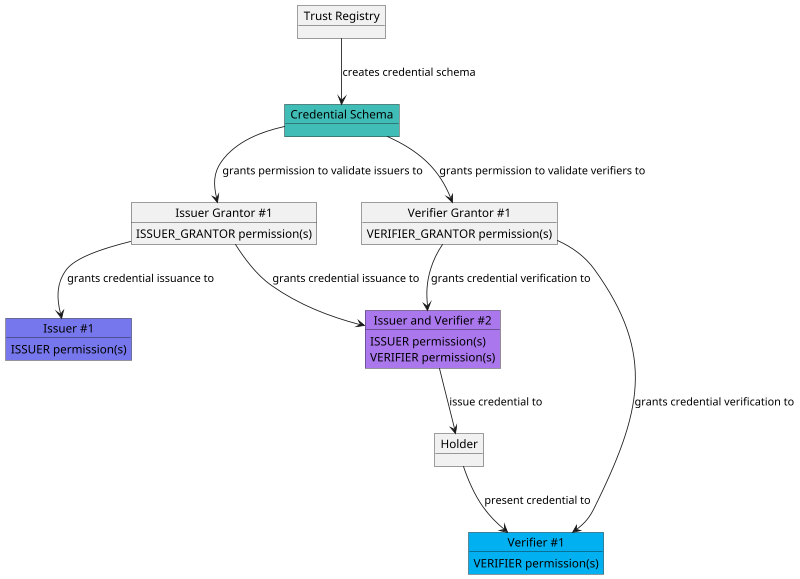
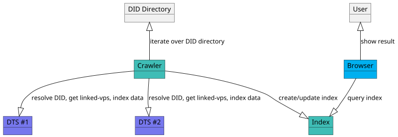
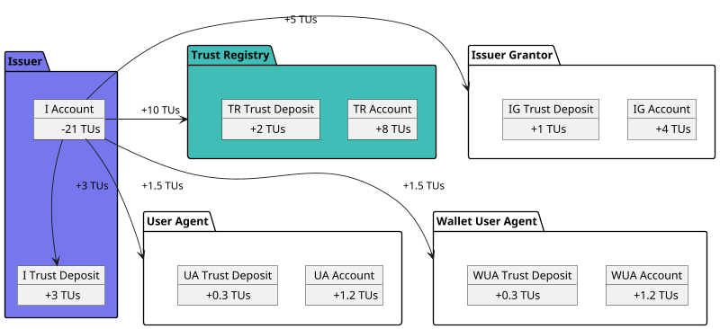
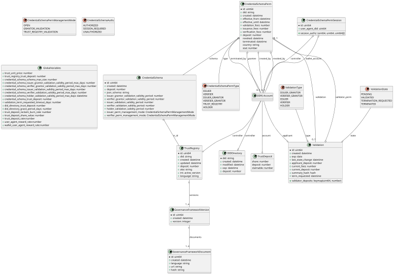
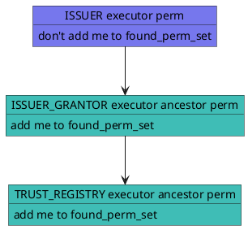
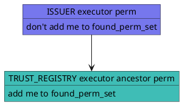

# Decentralized Trust Registry v1 Specification

**Specification Status:** *Draft*

**Latest Draft:** [verana-labs/decentralized-trust-registry-spec](https://github.com/verana-labs/decentralized-trust-registry-spec)

**Editors:**

~ [Fabrice Rochette](https://www.linkedin.com/in/fabricerochette) (2060.io)

<!-- -->

**Participate:**

~ [GitHub repo](https://github.com/verana-labs/decentralized-trust-registry-spec)

~ [File a bug](https://github.com/verana-labs/decentralized-trust-registry-spec/issues)

~ [Commit history](https://github.com/verana-labs/decentralized-trust-registry-spec/commits/main)

---

## Abstract

The Internet is broken. All existing communication channels are insecure, and obsolete. Because all existing communication channels rely on public identifiers, anyone that knows your identifier can reach you.

Furthermore, existing communication channel do not provide a sure-fire way of verifying service provider and end-user Identity. This is an open door to spam, phishing, fraud, identity theft...

Regarding service providers and services, each service has it own registration process, fastidious password rules... And/or they are usually using federated login, that makes you depend on a third party service for accessing your accounts.

If the World Wide Web was initially designed for interoperability, major companies have managed to transform it to a closed, centralized internet, that we all depend on.

Not to talk about privacy, and what's done with our data.

To build a new, trustable internet, we need new, trustable communication channels, where both ends can be clearly identified, and where providing a service, accessing a service, or creating a new account, should be as simple as presenting a credential.

A **trust layer**, open to any participant, is required for that. This is the purpose of a Decentralized Trust Registry.

## About this Document

In order to fully understand the concepts developed in this document, you should have some basic knowledge of [[ref:DID]], [[ref:DIDComm]], [[ref:DTS]], [[ref:trust registry]], ledger-based applications, and more generally, all terms present in the [Terminology](#terminology) section.

## Introduction

### What is a Trust Registry?

*This section is non-normative.*

A trust registry, or verifiable data registry, is an approved list of [[ref: issuers]] and [[ref: verifiers]] that are authorized to issue/verify certain credentials in an ecosystem.

A trust registry typically expose APIs that are consumed by services that would like to [[ref: query]] its database, and take decisions based on the returned result:

- can [[ref: participant]] #1 issue credential for schema ABC?
- can [[ref: participant]] #2 request credential presentation of credential issued by issuer DEF from schema GHI?

### What is a Decentralized Trust Registry?

*This section is non-normative.*

A Decentralized Trust Registry ([[ref: DTR]]) is a "registry of registries" public service, which provides:

- trust registry features, that can be used by all its [[ref: participants]]: create trust registries, credential schemas, define who can issue, verify credential of a specific schema,...
- a tokenized business model, for charging [[ref: participants]] for [[ref: trust fees]], that are transferred to other [[ref: participants]], and/or locked into [[ref: trust deposits]].
- a query API, used by Decentralized Trust Service browsers and apps, to enforce application of governance frameworks and rules of created trust registries.

### Conformance

As well as sections marked as non-normative, all authoring guidelines, diagrams, examples, and notes in this specification are non-normative. Everything else in this specification is normative.
The key words MAY, MUST, MUST NOT, OPTIONAL, RECOMMENDED, REQUIRED, SHOULD, and SHOULD NOT in this document are to be interpreted as described in [BCP 14](https://datatracker.ietf.org/doc/html/bcp14) [RFC2119](https://w3c.github.io/vc-data-model/#bib-rfc2119) [RFC8174](https://w3c.github.io/vc-data-model/#bib-rfc8174) when, and only when, they appear in all capitals, as shown here.

## Terminology

[[def: account, accounts]]:
~ A [[ref: decentralized trust registry]] account. An account has one or more controller, that can be a user, groups...

[[def: applicant, applicants]]:
~ A [[ref: controller]] that starts a [[ref: validation process]].

[[def: controller, controllers]]:
~ An [[ref: account]] which is the controller of a specific resource in an [[ref: DTR]].

[[def: credential schema, credential schemas]]:
~ An [[ref: DTR]] resource which represents a verifiable credential definition and the associated permissions and business rules for issuing, verifying or holding a credential linked to this credential schema.

[[def: credential schema permission, credential schema permissions, CSP]]:
~ A permission, linked to a [[ref: credential schema]], that represent a grant for being [[ref: issuer]], [[ref: verifier]], [[ref: issuer grantor]], or [[ref: verifier grantor]] of a [[ref: credential schema]].

[[def: decentralized identifier, DID, DIDs]]:
~ A decentralized identifier, as specified in [[spec-norm:DID-CORE]].

[[def: decentralized identifier communication, DIDComm]]:
~ [DIDComm](https://identity.foundation/didcomm-messaging/spec/) uses [[ref: DIDs]] to establish confidential, ongoing connections.

[[def: decentralized identifier document, DID Document, DID Documents]]:
~ A DID Document, as specified in [[spec-norm:DID-CORE]].

[[def: decentralized trust registry, DTR]]:
~ a decentralized, ledger-based network, which provides: trust registry features that can be used by all its [[ref: participants]], including credential schema management, issuer and verifier management; and a tokenized business model for  charging/rewarding [[ref: participants]].

[[def: decentralized trust service, DTS, DTSs]]:
~ A service, usually provided using [[ref: DIDComm]], that can be deployed anywhere by its owner, and that is using the decentralized trust layer provided by an [[ref: DTR]], and has a resolvable [[ref: proof of trust]].

[[def: Decentralized Trust Specification, DT Specs]]:
~ see [DT Specs](https://github.com/verana-labs/decentralized-trust-specs).

[[def: decentralized trust user agent, DTUA, DTUAs]]:
~ A user agent for accessing and using [[ref: DTSs]]. To be considered as a [[ref: DTUA]], a user agent must comply with [[ref: Decentralized Trust Specification]].

[[def: denom]]:
~ Native token of an [[ref: DTR]], example: ts.

[[def: DID Directory, DID directory]]:
~ A repository of DIDs in an DTR.

[[def: entity, entities]]:
~ An [[ref: account]], a [[ref: group]], or the [[ref: governance authority]].

[[def: essential credential schema, essential credential schemas]]:
~ Default [[ref: credential schema]], created at genesis of an [[ref: DTR]], that provide the basis for a trust layer to exist in the ecosystem so that [[ref: DTUA]] can generate a [[ref: proof of trust]].

[[def: estimated transaction fees]]:
~ Estimated fees required, in [[ref: denom]], that is passed when execute a [[ref: transaction]] in an [[ref: DTR]]. Usually, a estimated transaction fees are always slightly greater than [[ref: transaction fees]], to make sure the execution of the transaction will not be aborted for an out-of-gas situation. Unused gas is refunded to account.

[[def: governance framework, GF]]:
~ The governance framework (GF) of a [[ref: DTR]].

[[def: governance authority, GA]]:
~ The governance authority (GA) of a [[ref: DTR]].

[[def: group]]:
~ A group.

[[def: holder, holders]]:
~ A role an entity might perform by possessing one or more verifiable credentials and generating verifiable presentations from them. A holder is often, but not always, a [[ref: subject]] of the verifiable credentials they are holding. Holders store their credentials in credential repositories. Example holders include organizations, persons, things.

[[def: issuer, issuers]]:
~ A role an entity can perform by asserting claims about one or more [[ref: subjects]], creating a verifiable credential from these claims, and transmitting the verifiable credential to a [[ref: holder]]. Example issuers include corporations, non-profit organizations, trade associations, governments, and individuals.

[[def: issuer grantor, issuer grantors]]:
~ A role an entity can perform in a credential schema by adding or revoking issuers.

[[def: json schema, json schemas, Json Schema, Json Schemas]]
~ a Json Schema, as specified in [https://json-schema.org/specification](https://json-schema.org/specification).

[[def: keeper]]:
~ A storage map(key, value) in the ledger of an [[ref: DTR]].

[[def: linked-vp]]:
~ A presentation of a [[ref: verifiable credential]] as specified in [LINKED-VP](https://identity.foundation/linked-vp/).

[[def: participant, participants]]:
~ An entity that uses an [[ref: DTR]] and its trust layer to provide or use services.

[[def: proof of trust]]:
~ Visual representation using [[ref: essential credential schemas]] of a [[ref: trust resolution]] process of a [[ref: DTS]], for identifying the [[ref: DTS]], its owner, and the [[ref: issuer]] of the verifiable credential of its owner.

[[def: query]]:
~ A read-only action that perform some reading in an [[ref: DTR]] and returns value.

[[def: subject, subjects]]:
~ A thing about which claims are made. Example subjects include human beings, animals, things, and organization, a [[ref: DID]]...

[[def: transaction, transactions]]:
~ An action that modifies the ledger of an [[ref: DTR]] and which execution requires transaction fees.

[[def: transaction fees]]:
~ Fees required, in [[ref: denom]], to execute a [[ref: transaction]] in an [[ref: DTR]].

[[def: trust deposit, trust deposits]]:
~ A financial deposit that is used as a trust guarantee. For a given [[ref: controller]], its trust deposit is increased when running validation process (either as an [[ref: applicant]] or as a [[ref: validator]]), or when registering [[ref: DID]] in the DID directory.

[[def: trust fees]]:
~ Fees paid by an [[ref: applicant]] when running a validation process and/or when registering [[ref: DID]] in the DID directory.

[[def: trust registry governance framework, TRGF]]:
~ The ecosystem governance framework (EGF) of a [[ref: Trust Registry]].

[[def: trust unit, trust units]]:
~ Price, in [[ref: denom]], of one unit of trust.

[[def:trust registry, trust registries]]
~ An approved list of [[ref: issuers]] and [[ref: verifiers]] that are authorized to issue/verify certain credentials in an ecosystem.

[[def: trust resolution]]:
~ Process run by, for example a [[ref: DTUA]], which purpose is to recursively resolve [[ref: DID]] by digging into [[ref: DID Documents]] and look for [[ref: linked-vp]] entries and their [[ref: issuer]] [[ref: DIDs]], and [trust registry](https://trustoverip.github.io/tswg-trust-registry-protocol/) entries to gather whether the service provided by the [[ref: DID]] is trustable (and legitimate), or not.

[[def: URI, URIs]]
~ An Universal Resource Identifier, as specified in [rfc3986](https://datatracker.ietf.org/doc/html/rfc3986).

[[def: valid permission, valid permissions]]:
~ For a given country code, a credential schema permission of a given type, which (country attribute is null or equals to the given country code), and effective_from datetime is lower than current datetime, and (effective_until datetime is null or greater than current datetime), and revoked is null.

[[def: validation process]]:
~ A process run by [[ref: applicants]] that want to, for a specific [[ref: credential schema]], be a [[ref: issuer]], be a [[ref: verifier]], or simply hold a verifiable credential linked to the [[ref: credential schema]].

[[def: validator]]:
~ A role an [[ref: entity]] performs by participating in validation processes with [[ref: applicants]] in order to register them as [[ref: issuer]], or [[ref: verifier]] of a [[ref: credential schema]], or to deliver a verifiable credential to them.

[[def: verifier, verifiers]]:
~ A role an entity performs by receiving one or more verifiable credentials, optionally inside a verifiable presentation for processing. Example verifiers include service providers.

[[def: verifier grantor, verifier grantors]]:
~ A role an [[ref: entity]] can perform in a [[ref: credential schema]] by adding or revoking verifiers.

[[def: verifiable credential, verifiable credentials]]:
~ A verifiable credential as defined in [[spec-norm:VC-DATA-MODEL]].

## High Level DTR Features

### Trust Registry Management

*This section is non-normative.*

In an [[ref: DTR]], any [[ref: account]] can create (and become the [[ref: controller]] of) a `TrustRegistry` entry that represents a [[ref: trust registry]]. `TrustRegistry` entry includes human readable [[ref: trust registry governance framework]] that defines the ecosystem rules that will be enforced by using the [[ref: DTR]] features.

### Credential Schema, Permissions, and Validation process

*This section is non-normative.*

Owner of a `TrustRegistry` entry can create [[ref: credential schema]](s).

A [[ref: credential schema]] contain information, such as the [[ref: json schema]] that issued credentials of this schema must conform to, and sets of permissions for controlling the use of the [[ref: credential schema]].

More specifically, [[ref: controller]] can configure, for a credential schema:

- if anyone can *issue* credentials of this schema, or if it is restricted to specific issuers. If restricted, how are issuers selected: directly by the trust registry, or through one or more *issuer grantors* by running a validation process.
- if anyone can *verify* credentials of this schema, or if it is restricted to specific verifiers. If restricted, how are verifiers selected: directly by the trust registry, or through one or more *verifier grantors* by running a validation process.

For being an issuer, issuer grantor, verifier, or verifier grantor, it is needed to have an account in the [[ref: DTR]] and run a validation process. A validation process is run between an *applicant* (the one that would like to obtain a permission for a given schema) and a *validator* (the one that has granted permission(s) for validating applicants and create them permissions). Running a validation process usually involve the payment of fees.

#### Issuers

*This section is non-normative.*

Let's dig into the possible cases for an [[ref: applicant]] that wishes to become an [[ref: issuer]] of a [[ref: credential schema]]. Here are some [[ref: credential schema]] configuration modes that can be set by the [[ref: controller]] of the schema, to define the rules for being an [[ref: issuer]]:

- OPEN: anyone can issue credentials of this schema, with no required validation of issuers.

- GRANTOR_VALIDATION: to be added as an [[ref: issuer]], [[ref: applicant]] must initiate a validation process with a [[ref: validator]] ([[ref: issuer grantor]]).

- TRUST_REGISTRY: to be added as an [[ref: issuer]], [[ref: applicant]] must initiate a validation process with the trust registry controller.

#### Verifiers

*This section is non-normative.*

Similar to issuer: Here are some [[ref: credential schema]] configuration modes that can be set by the [[ref: controller]] of the schema, to define the rules for being an [[ref: verifier]]:

- OPEN: anyone can verify credentials of this schema, with no required validation of verifiers.

- GRANTOR_VALIDATION: to be added as an [[ref: verifier]], [[ref: applicant]] must initiate a validation process with a [[ref: validator]] ([[ref: verifier grantor]]).

- TRUST_REGISTRY: to be added as an [[ref: verifier]], [[ref: applicant]] must initiate a validation process with the trust registry controller.

#### Issuer Grantors

*This section is non-normative.*

Based on the issuer configuration mode of the credential schema, issuer grantors are needed or not:

- OPEN: issuer grantors cannot exist.

- GRANTOR_VALIDATION: to be added as an [[ref: issuer grantor]], [[ref: applicant]] must initiate a validation process with the trust registry controller.

- TRUST_REGISTRY: issuer grantors cannot exist, as the trust registry directly selects the issuers of this schema.

#### Verifier Grantors

*This section is non-normative.*

Based on the verifier configuration mode of the credential schema, issuer grantors are needed or not:

- OPEN: verifier grantors cannot exist.

- GRANTOR_VALIDATION: to be added as an [[ref: verifier grantor]], [[ref: applicant]] must initiate a validation process with the trust registry controller.

- TRUST_REGISTRY: verifier grantors cannot exist, as the trust registry directly selects the verifiers of this schema.

#### Holders

*This section is non-normative.*

To get issued a verifiable credential from a given schema, it is usually not needed to have an [[ref: account]], because the finality of the operation is the delivery of a credential, not the creation of a permission in the [[ref: DTR]]. However, if the issuer would like to charge the holder for issuing the credential to it, an account is needed.

#### Examples

*Example with GRANTOR_VALIDATION mode for both issuer and verifier participants:*



*Example of a candidate [[ref: issuer]] ([[ref: applicant]]) that would like to be granted an ISSUER permission by a [[ref: validator]] that has a ISSUER_GRANTOR permission:*

```plantuml
scale max 800 width
actor "Applicant\n(issuer candidate)\nAccount" as ApplicantAccount 
actor "Applicant\n(issuer candidate)\nDTS Browser" as ApplicantBrowser 

actor "Validator\n(issuer grantor)\nDTS" as ValidatorDTS
actor "Validator\n(issuer grantor)\nAccount" as ValidatorAccount

participant "Decentralized Trust Registry" as DTR #3fbdb6

ApplicantAccount --> DTR: create new validation with Validator 
DTR <-- DTR: create validation entry.
ApplicantAccount <-- DTR: validation entry created
ApplicantBrowser --> ValidatorDTS: connect to validator DTS DID found in validation.perm\nby creating a DIDComm connection
ApplicantBrowser <-- ValidatorDTS: DIDComm connection established.
ApplicantBrowser --> ValidatorDTS: I want to proceed with validation.id=...
ValidatorDTS --> ValidatorDTS: load validation with id=...\nand verify the associated validation.perm is referring to me
ApplicantBrowser <-- ValidatorDTS: request proof of control\nof validation.applicant account (blind sign)
ApplicantBrowser --> ValidatorDTS: send blind sign proof of account
ApplicantBrowser <-- ValidatorDTS: proof accepted, you are the controller\nof validation entry, I trust you.
ApplicantBrowser <-- ValidatorDTS: which DID do you want to register as an issuer?
ApplicantBrowser --> ValidatorDTS: send DID
ValidatorDTS --> ValidatorDTS: resolve DID and get pub keys
ApplicantBrowser <-- ValidatorDTS: request proof of ownership\nof the DID to be registered in the ISSUER permission (blind sign)
ApplicantBrowser --> ValidatorDTS: send blind sign proofs
ApplicantBrowser <-- ValidatorDTS: proof accepted, you are the controller of this DID, I trust you.
note over ApplicantBrowser, ValidatorDTS #EEEEEE: (*optional*) repeat the following until tasks completed
ApplicantBrowser <-- ValidatorDTS: Are you a legitimate issuer?\nProve it, by filling forms, sending documents...
ApplicantBrowser --> ValidatorDTS: perform requested tasks...
note over ApplicantBrowser, ValidatorDTS #EEEEEE: tasks completed
ApplicantBrowser <-- ValidatorDTS: Your are a legitimate candidate. I'll now create an ISSUER permission for your account and DID.
ValidatorAccount --> DTR #3fbdb6: set validation.state to VALIDATED\ncreate permission(s) for applicant.
DTR --> ValidatorAccount: Receive trust fees.
ApplicantBrowser <-- ValidatorDTS: notify ISSUER permission created for your account and DID.\nDID can now issue credentials of this schema.
```

### DID Directory Management

*This section is non-normative.*

The [[ref: DID]] directory is a public database of [[ref: DID]] that can be used by crawlers to index the metadata of the [[ref: DTS]] provided by these [[ref: DID]].

Search engines simply need to iterate over the [[ref: DID Directory]] and index [[ref: DTSs]] based on [[ref: DTS]] metadata (DID Document, presented credentials,...)
For example, the DID directory is essential to dts browsers, such as social dts browsers, cdn dts browsers,... but can although be used by a general classic form-based **search engine** that would return simple link(s) for accessing [[ref: DTSs]].

Any [[ref: participant]] can register a [[ref: DID]] in the DID directory by passing some [[ref: trust fees]] and/or [[ref: trust deposit]] .



### Business models

#### Trust Deposit

*This section is non-normative.*

In a [[ref: DTR]], each participant [[ref: account]] has a corresponding [[ref: trust deposit]].

This trust deposit is automatically funded when executing transactions that involve trust: creation of entities such as trust registries, credential schemas, did in did directory; fees transferred from one participant to other participant(s) for the execution of a service,...

Fundamentally, the trust deposit enables the so called "Proof-of-Trust" (PoT) feature of the [[ref:DTR]]:

- the more you use the [[ref: DTR]], the more your [[ref: trust deposit]] grows.
- a trust deposit generates yield: in a DTR, block execution transaction fees are distributed not only to network validators, but to trust deposit owners as well.
- if you do not respect the governance framework of the [[ref: DTR]] (or run fraudulent activities) your deposit can be partially or fully slashed by the governance authority.
- if you do not respect the governance framework of the [[ref: trust registries]] you are interacting with (as issuer, verifier, holder, etc...) part of your deposit can be slashed by the governance authority of the corresponding trust registry.
- when your deposit has been slashed, you need to refill it in order to continue to use the services that generated the sanction.
- when you stop using a service, you can free its corresponding trust deposit.
- freed deposit can be reused in other service(s), or withdrawn (with penalties: part of the withdrawn tokens are burnt).

#### Entity creation

*This section is non-normative.*

The following fees are not directly sent to a specific participant but are distributed using the normal distribution principle of a [[ref: DTR]].

Creating an instance of one of the following entities implies paying fees and sending funds to the trust deposit:

- Trust Registries (once)
- Credential Schema (once)
- Did Directory (renewable subscription)

Other operations that just imply paying fees:

- Updating governance frameworks of Trust Registries
- Removing a Did from the Did Directory
...

#### Pay per execution of the validation process

*This section is non-normative.*

The validation fees are partially sent to specific participant(s), the rest is sent to trust deposits or distributed using the normal distribution principle of a [[ref: DTR]].

| Payee → Payer ↓  | Trust Registry                      | Issuer Grantor                        | Verifier Grantor                    | Issuer                              | Verifier | Holder                                  |
|------------------|-------------------------------------|---------------------------------------|-------------------------------------|-------------------------------------|----------|-----------------------------------------|
| Issuer Grantor   | renewable subscription (1)          |                                       |                                     |                                     |          |                                         |
| Verifier Grantor | renewable subscription (2)          |                                       |                                     |                                     |          |                                         |
| Issuer           | renewable subscription (3)          | renewable subscription (1)            |                                     |                                     |          |                                         |
| Verifier         | renewable subscription (4)          |                                       | renewable subscription (2)          |                                     |          |                                         |
| Holder           |                                     |                                       |                                     | renewable subscription              |          |                                         |

- (1): if *issuer mode* is set to GRANTOR_VALIDATION.
- (2): if *verifier mode* is set to GRANTOR_VALIDATION.
- (3): if *issuer mode* is set to TRUST_REGISTRY.
- (4): if *verifier mode* is set to TRUST_REGISTRY.

#### Pay per issued credential

*This section is non-normative.*

The Pay per issued credential fees are partially sent to specific participant(s), the rest is sent to trust deposits or distributed using the normal distribution principle of a [[ref: DTR]].

- When a participant is granted an ISSUER permission for a given schema, trust registry and issuer grantor may define *issuance fees* for each issued credential. In this case, ISSUER must pay these fees in order to be able to deliver the credential to the holder.
- Wallet User Agent and User Agent are rewarded, too.
- Part of the fees are sent to trust deposits.

*Example:*



#### Pay per verified credential

*This section is non-normative.*

The Pay per issued credential fees are partially sent to specific participant(s), the rest is sent to trust deposits or distributed using the normal distribution principle of a [[ref: DTR]].

- When a participant is granted a VERIFIER permission for a given schema, trust registry, issuer grantor, issuer, verifier grantor may define *verification fees* for each verified credential. In this case, VERIFIER must pay these fees in order to be able to request presentation, for a specific issuer, of a credential of this schema to the holder.
- Wallet User Agent and User Agent are rewarded, too.
- Part of the fees are sent to trust deposits.

*Example:*


## Governance of a DTR

*This section is non-normative.*

A [[ref: governance framework]] must define the governance rules of an [[ref: DTR]]. A [[ref: governance authority]] will ensure the application of the [[ref: governance framework]] rules and if necessary apply some financial sanctions.

## Data model

For simplicity, data model is presented using a object relational model, which would not be always optimal depending on implementation choices, that may require organizing data differently. It's the role of implementors to adapt the data model so it will be suitable for a given implementation (for example, a keymap-like based storage would be probably a better choice for a ledger-based implementation).



### TrustRegistry

`TrustRegistry`:

- `id` (uint64) (*mandatory*): the id of the trust registry.
- `did` (string) (*mandatory*): the did of the trust registry.
- `controller` (account) (*mandatory*): [[ref: account]] that controls this entry.
- `created` (datetime) (*mandatory*): date this TrustRegistry has been created, in yyyyMMddHHmm format.
- `modified` (datetime) (*mandatory*): date this TrustRegistry has been modified, in yyyyMMddHHmm format.
- `deposit` (number) (*mandatory*): [[ref: trust deposit]] (in `denom`)
- `aka` (string) (*optional*): optional additional URI of this trust registry.
- `language` (string(2)) (*mandatory*): primary language alpha-2 code (ISO 3166) of this trust registry.
- `active_version` (int): (*mandatory*) active governance framework version.

### GovernanceFrameworkVersion

`GovernanceFrameworkVersion`:

- `id` (uint64) (*mandatory*): the id of the schema.
- `tr_id` (uint64) (*mandatory*): the id of the trust registry that controls this `GovernanceFrameworkVersion` entry.
- `created` (datetime) (*mandatory*): date this GovernanceFrameworkVersion has been created, in yyyyMMddHHmm format.
- `version` (int) (*mandatory*): version of this GF. MUST Starts with 1.

### GovernanceFrameworkDocument

`GovernanceFrameworkDocument`

- `id` (uint64) (*mandatory*): the id of the schema.
- `gfv_id` (uint64) (*mandatory*): the id of the `GovernanceFrameworkVersion` entry.
- `created` (datetime) (*mandatory*): date this GovernanceFrameworkDocument has been created, in yyyyMMddHHmm format.
- `language` (string(2)) (*mandatory*): primary language alpha-2 code (ISO 3166) of this trust registry.
- `url` (string) (*mandatory*): URL where the document is published.
- `hash` (string) (*mandatory*): hash of the document.

### CredentialSchema

`CredentialSchema`:

**General Info**:

- `id` (uint64) (*mandatory*): the id of the schema.
- `tr_id` (uint64) (*mandatory*): the id of the trust registry that controls this `CredentialSchema` entry.
- `created` (datetime) (*mandatory*): date this CredentialSchema has been created, in yyyyMMddHHmm format.
- `deposit` (number) (*mandatory*): [[ref: trust deposit]] (in `denom`)
- `type` (enum) (*mandatory*): type of schema. VC_JSON_SCHEMA or ANONCREDS.
- `json_schema` (string) (*mandatory*): Json Schema used for issuing credentials based on this schema.
- `issuer_grantor_validation_validity_period` (number) (*mandatory*): number of days after which an issuer grantor validation process expires and must be renewed.
- `verifier_grantor_validation_validity_period` (number) (*mandatory*): number of days after which a verifier grantor validation process expires and must be renewed.
- `issuer_validation_validity_period` (number) (*mandatory*): number of days after which an issuer validation process expires and must be renewed.
- `verifier_validation_validity_period` (number) (*mandatory*): number of days after which a verifier validation process expires and must be renewed.
- `holder_validation_validity_period` (number) (*mandatory*): number of days after which an holder validation process expires and must be renewed.
- `issuer_perm_management_mode` (CredentialSchemaPermManagementMode) (*mandatory*): defines how permission are managed for issuers of this `CredentialSchema`. OPEN means anyone can create its own ISSUER permission; GRANTOR_VALIDATION means a validation process MUST be run between a candidate ISSUER and an ISSUER_GRANTOR in order to create an ISSUER permission; TRUST_REGISTRY_VALIDATION means a validation process MUST be run between a candidate ISSUER and the trust registry owner of the `CredentialSchema` entry in order to create an ISSUER permission;
- `verifier_perm_management_mode` (CredentialSchemaPermManagementMode) (*mandatory*): defines how permission are managed for verifiers of this `CredentialSchema`. OPEN means anyone can create its own VERIFIER permission; GRANTOR_VALIDATION means a validation process MUST be run between a candidate VERIFIER and an VERIFIER_GRANTOR in order to create a VERIFIER permission; TRUST_REGISTRY_VALIDATION means a validation process MUST be run between a candidate VERIFIER and the trust registry owner of the `CredentialSchema` entry in order to create an VERIFIER permission;

### CredentialSchemaPerm

`CredentialSchemaPerm`:

- `id` (uint64) (*mandatory*): the id of the perm.
- `schema_id` (uint64) (*mandatory*): the id of the related `CredentialSchema` entry.
- `type` (CredentialSchemaPermType): ISSUER, VERIFIER, ISSUER_GRANTOR, VERIFIER_GRANTOR, TRUST_REGISTRY
- `did` (string) (*optional*): [[ref: DID]] this permission refers to. MUST conform to [[spec-norm:RFC3986]].
- `grantee` (account) (*mandatory*): [[ref: account]] this permission refers to (account granted to act as `type` for schema `schema_id`).
- `created` (datetime) (*mandatory*): datetime this Perm has been created, in yyyyMMddHHmm format.
- `created_by` (account) (*mandatory*): [[ref: account]] that created this permission.
- `effective_from` (datetime) (*mandatory*): date from which (inclusive) this Perm is effective, in yyyyMMddHHmm format.
- `effective_until` (datetime) (*optional*): date until when (exclusive) this Perm is effective, in yyyyMMddHHmm format, null if no time limit has been set for this permission.
- `validation_id` (uint64) (*optional*): the `Validation` entry this perm refers to, if created in the context of a validation process.
- `validation_fees` (number) (*mandatory*): price to pay by the applicant to validator for running a validation process for a given validation period, in trust unit. Default to 0.
- `issuance_fees` (number) (*mandatory*): fees requested by grantee of this perm when a credential is issued, in trust unit. Default to 0.
- `verification_fees` (number) (*mandatory*): fees requested by grantee of this perm when a credential is verified, in trust unit. Default to 0.
- `deposit` (number) (*mandatory*): accumulated deposit for the use of this permission, in `denom`. Usually, it is incremented when for example a issuer issues a credential using this perm, and issuing this credential requires paying issuance fees: an additional % of the fees is charged to issuer and sent to its deposit.
- `revoked` (datetime) (*optional*): manual revocation datetime of this Perm, in yyyyMMddHHmm format.
- `revoked_by` (account) (*mandatory*): [[ref: account]] that revoked this permission.
- `terminated` (datetime) (*optional*): manual termination (by grantee) datetime of this Perm, in yyyyMMddHHmm format.
- `terminated_by` (account) (*mandatory*): [[ref: account]] that terminated this permission.
- `country` (string) (*optional*): country, as an alpha-2 code (ISO 3166), this permission refers to. If null, it means permission is not linked to a specific country.

### CredentialSchemaPermSession

`CredentialSchemaPermSession`:

- `id` (uint64) (*mandatory*): session id.
- `user_agent_perm` (uint64) (*mandatory*): user agent permission.
- `controller` (account) (*mandatory*): account that controls the entry.
- `session_authz` (uint64 (CSP), uint64 (CSP), uint64 (UAP))[] (*mandatory*): permission(s) linked to this session.

### Validation

`Validation`:

- `id` (uint64) (*mandatory*): id of the validation entry, generated by [[ref: controller]].
- `applicant` (account) (*mandatory*): [[ref: controller]] that created this entry, the [[ref: applicant]].
- `type` (enum) (*mandatory*): ISSUER (if [[ref: applicant]] would like to become an [[ref: issuer]] of this [[ref: credential schema]]), VERIFIER (if [[ref: applicant]] would like to become a verifier of credentials of the schema), or HOLDER, if [[ref: applicant]] would like to get issued a credential of the schema.
- `created` (date) (*mandatory*): date of Validation creation, yyyyMMdd format.
- `validator_perm_id` (uint64) (*optional*): permission of the validator assigned to this validation process.
- `state` (enum) (*mandatory*): one of PENDING, VALIDATED, TERMINATED
- `exp` (datetime) (*optional*): validation expiration date, yyyyMMdd format. This expiration date is for the validation process itself, not for the issued credential or granted permission expiration date.
- `last_state_change` (datetime) (*mandatory*)
- `applicant_deposit` (number) (*mandatory*): accumulated [[ref: applicant]] [[ref: trust deposit]], in [[ref: denom]].
- `validator_deposits`: (keymap(uint64, number)) (*optional*): accumulated validator [[ref: trust deposits]], in [[ref: denom]].
- `current_fees` (number) (*mandatory*): current action escrowed fees that will be paid to [[ref: validator]] upon validation process completion, in [[ref: denom]].
- `current_deposit` (number) (*mandatory*): current action trust deposit, in [[ref: denom]].
- `summary_hash` (hash) (*optional*): an optional hash, set by [[ref: validator]], of a summary of the information, proofs... provided by the [[ref: applicant]].
- `term_requested` (datetime) (*optional*): set when [[ref: controller]] requests the termination of this entry.

### DIDDirectory

`DidDirectory`:

- `did` (string) (*mandatory*) (key): the [[ref: DID]]. MUST conform to [[spec-norm:RFC3986]].
- `controller` (account) (*mandatory*): [[ref: account]] that created the [[ref: DID]].
- `created` (date) (*mandatory*): date this [[ref: DID]] has been added, in yyyyMMdd format.
- `modified` (date) (*mandatory*): date this [[ref: DID]] has been modified, in yyyyMMdd format.
- `exp` (date) (*mandatory*): expiration date, in yyyyMMdd format.
- `deposit` (number) (*mandatory*): effective [[ref: trust deposit]] for this [[ref: DID]] (in `denom`)

### TrustDeposit

`TrustDeposit`:

- `share` (number) (*mandatory*): share of the module total deposit.
- `account` (account) (*mandatory*) (key): the [[ref: account]]
- `amount` (number) (*mandatory*): amount of deposit in `denom`.

### GlobalVariables

`GlobalVariables`:

**Trust Unit:**

- `trust_unit_price` (number) (*mandatory*): [[ref: trust unit]] price, in [[ref: denom]].

**Credential Schema:**

- `credential_schema_trust_deposit` (number) (*mandatory*): default trust deposit value for creating a credential schema, in [[ref: trust units]].
- `credential_schema_schema_max_size` (number) (*mandatory*): maximum size of the `schema` string attribute for a `CredentialSchema`.
- `credential_schema_issuer_grantor_validation_validity_period_max_days` (number) (*mandatory*): maximum number of days an issuer grantor validation can be valid for.
- `credential_schema_verifier_grantor_validation_validity_period_max_days` (number) (*mandatory*): maximum number of days an verifier grantor validation can be valid for.
- `credential_schema_issuer_validation_validity_period_max_days` (number) (*mandatory*): maximum number of days an issuer validation can be valid for.
- `credential_schema_verifier_validation_validity_period_max_days` (number) (*mandatory*): maximum number of days an verifier validation can be valid for.
- `credential_schema_holder_validation_validity_period_max_days` (number) (*mandatory*): maximum number of days an [[ref: holder]] validation can be valid for.

**Validation:**

- `validation_term_requested_timeout_days` (number) (*mandatory*): after this number of days, validation applicant can confirm termination of a validation if [[ref: validator]] didn't do it.

**Trust Registry:**

- `trust_registry_trust_deposit` (number) (*mandatory*): default trust deposit value for creating a trust registry, in [[ref: trust units]].

**DID Directory:**

- `did_directory_trust_deposit` (number) (*mandatory*): default trust deposit value, in [[ref: trust units]].
- `did_directory_grace_period_days` (number) (*mandatory*): default grace period, in days.

**Trust Deposit:**

- `trust_deposit_reclaim_burn_rate` (number) (*mandatory*): percentage of burnt deposit when an account execute a reclaim of capital amount.
- `trust_deposit_share_value`(number) (*mandatory*): Value of one share of trust deposit, in `denom`. Default an initial value: 1. Increase over time, when yield is produced.
- `trust_deposit_rate`(number) (*mandatory*): Rate used for dynamically calculating trust deposits from trust fees. Default value: 20% (0.20)
- `wallet_user_agent_reward_rate`(number) (*mandatory*): Rate used for dynamically calculating wallet user agent rewards from trust fees. Default value: 20% (0.20)
- `user_agent_reward_rate`(number) (*mandatory*): Rate used for dynamically calculating user agent rewards from trust fees. Default value: 20% (0.20)

## Module Requirements

All [[ref: DTR]] modules MUST, at least, provide:

- A [[ref: keeper]](s), used to access the module's store(s) and update the state.
- A Msg service, used to process messages when they are routed to the module by BaseApp and trigger state-transitions.
- A [[ref: query]] service, used to process user queries.
- Interfaces, for end users to [[ref: query]] the subset of the state defined by the module and create messages of the custom types defined in the module.

:::warning
For Msg methods, all precondition checks MUST be verified first for accepting the Msg, and MUST be verified **again** upon method execution
:::

A DTR implementation MUST implement all the following requirements.

| Module                         | Method Name                             | Relative REST API path           | Type   |Requirements      |
|--------------------------------|-----------------------------------------|----------------------------------|--------|------------------|
| Trust Registry                 | Create a Trust Registry                 |                                  | Msg    | [[MOD-TR-MSG-1]](#mod-tr-msg-1-create-new-trust-registry)   |
|                                | Add Governance Framework Document       |                                  | Msg    | [[MOD-TR-MSG-2]](#mod-tr-msg-2-add-governance-framework-document)   |
|                                | Increase Active Version                 |                                  | Msg    | [[MOD-TR-MSG-3]](#mod-tr-msg-3-increase-active-governance-framework-version)   |
|                                | Get Trust Registry                      | /dtr/v1/tr/get                  | Query  | [[MOD-TR-QRY-1]](#mod-tr-qry-1-get-trust-registry)   |
|                                | List Trust Registries                   | /dtr/v1/tr/list                 | Query  | [[MOD-TR-QRY-2]](#mod-tr-qry-2-list-trust-registries)   |
|                                | Get Trust Registry with DID             | /dtr/v1/tr/get_with_did         | Query  | [[MOD-TR-QRY-3]](#mod-tr-qry-3-get-trust-registry-with-did)   |
| Credential Schema              | Create a Credential Schema              |                                 | Msg    | [[MOD-CS-MSG-1]](#mod-cs-msg-1-create-new-credential-schema)   |
|                                | List Credential Schemas                 | /dtr/v1/cs/list                 | Query  | [[MOD-CS-QRY-1]](#mod-cs-qry-1-list-credential-schemas)   |
|                                | Get a Credential Schema                 | /dtr/v1/cs/get                  | Query  | [[MOD-CS-QRY-2]](#mod-cs-qry-2-get-credential-schema)   |
|                                | Render Json Schema                      | /dtr/v1/cs/js                   | Query  | [[MOD-CS-QRY-3]](#mod-cs-qry-3-render-json-schema)   |
| Credential Schema Permission   | Create new CSP                          |                                 | Msg    | [[MOD-CSP-MSG-1]](#mod-csp-msg-1-create-new-csp)  |
|                                | Revoke CSP                              |                                 | Msg    | [[MOD-CSP-MSG-2]](#mod-csp-msg-2-revoke-csp)  |
|                                | Terminate CSP                           |                                 | Msg    | [[MOD-CSP-MSG-3]](#mod-csp-msg-3-terminate-csp)  |
|                                | List CSPs                               | /dtr/v1/csp/list                | Query  | [[MOD-CSP-QRY-1]](#mod-csp-qry-1-list-csps)  |
|                                | Get CSP                                 | /dtr/v1/csp/get                 | Query  | [[MOD-CSP-QRY-2]](#mod-csp-qry-2-get-csp)  |
|                                | Is Authorized Issuer                    | /dtr/v1/csp/authorized_issuer   | Query  | [[MOD-CSP-QRY-3]](#mod-csp-qry-3-is-authorized-issuer)  |
|                                | Is Authorized Verifier                  | /dtr/v1/csp/authorized_verifier | Query  | [[MOD-CSP-QRY-4]](#mod-csp-qry-4-is-authorized-verifier)  |
| Credential Schema Perm Session | Create or update CSPS                   |                                 | Msg    | [[MOD-CSPS-MSG-1]](#mod-csps-msg-1-create-or-update-csps) |
|                                | Get CSPS                                | /dtr/v1/csps/get                | Query  | [[MOD-CSPS-QRY-1]](#mod-csps-qry-1-get-csps) |
| Validation                     | Create a Validation                     |                                 | Msg    | [[MOD-V-MSG-1]](#mod-v-msg-1-create-new-validation)    |
|                                | Renew a Validation                      |                                 | Msg    | [[MOD-V-MSG-2]](#mod-v-msg-2-renew-validation)    |
|                                | Set Validated                           |                                 | Msg    | [[MOD-V-MSG-3]](#mod-v-msg-3-set-validated)    |
|                                | Request Validation Termination          |                                 | Msg    | [[MOD-V-MSG-4]](#mod-v-msg-4-request-validation-termination)    |
|                                | Confirm Validation Termination          |                                 | Msg    | [[MOD-V-MSG-5]](#mod-v-msg-5-confirm-validation-termination)    |
|                                | Cancel Validation                       |                                 | Msg    | [[MOD-V-MSG-6]](#mod-v-msg-6-cancel-validation)    |
|                                | List Validations                        | /dtr/v1/val/list                | Query  | [[MOD-V-QRY-1]](#mod-v-qry-1-list-validations)    |
|                                | Get a Validation                        | /dtr/v1//val/get                | Query  | [[MOD-V-QRY-2]](#mod-v-qry-2-get-a-validation)    |
| DID Directory                  | Add a DID                               |                                  | Msg    | [[MOD-DD-MSG-1]](#mod-dd-msg-1-add-a-did)   |
|                                | Renew a DID                             |                                  | Msg    | [[MOD-DD-MSG-2]](#mod-dd-msg-2-renew-a-did)   |
|                                | Remove a DID                            |                                  | Msg    | [[MOD-DD-MSG-3]](#mod-dd-msg-3-remove-a-did)   |
|                                | Touch a DID                             |                                  | Msg    | [[MOD-DD-MSG-4]](#mod-dd-msg-4-touch-a-did)   |
|                                | List DIDs                               | /dtr/v1/dd/list                 | Query  | [[MOD-DD-QRY-1]](#mod-dd-qry-1-list-dids)   |
|                                | Get a DID                               | /dtr/v1/dd/get                  | Query  | [[MOD-DD-QRY-2]](#mod-dd-qry-2-get-a-did)   |
| Trust Deposit                  | Adjust Trust Deposit                    |                                  | Msg    | [[MOD-TD-MSG-1]](#mod-td-msg-1-adjust-trust-deposit)   |
|                                | Reclaim Trust Deposit Interests         |                                  | Msg    | [[MOD-TD-MSG-2]](#mod-td-msg-2-reclaim-trust-deposit-interests)   |
|                                | Reclaim Trust Deposit                   |                                  | Msg    | [[MOD-TD-MSG-3]](#mod-td-msg-3-reclaim-trust-deposit)   |
|                                | Get Trust Deposit                       | /dtr/v1/td/get                  | Query  | [[MOD-TD-QRY-1]](#mod-td-qry-1-get-trust-deposit)   |

### Trust Registry Module

#### [MOD-TR-MSG-1] Create New Trust Registry

Any [[ref: account]] CAN execute this method.

##### [MOD-TR-MSG-1-1] Create New Trust Registry parameters

An [[ref: account]] that would like to create a [[ref: trust registry]] MUST call this method by specifying:

- `did` (string) (*mandatory*): the did of the trust registry.
- `aka` (string) (*optional*): optional additional URI of this trust registry.
- `language` (string(17)) (*mandatory*): primary language tag ([rfc1766](https://www.ietf.org/rfc/rfc1766.txt)) of this trust registry.
- `doc_url` (string) (*mandatory*): URL where the document is published.
- `doc_hash` (string) (*mandatory*): hash of the document.

Provided document must be of the same language that the primary language of the trust registry.

##### [MOD-TR-MSG-1-2] Create New Trust Registry precondition checks

If any of these precondition checks fail, method MUST abort.

###### [MOD-TR-MSG-1-2-1] Create New Trust Registry basic checks

- if a mandatory parameter is not present, method MUST abort.

- `did` (string) (*mandatory*): MUST conform to the DID Syntax, as specified [[spec-norm:DID-CORE]]. A trust registry with this DID MUST NOT already exist.
- `aka` (string) (*optional*): optional additional URI of this trust registry. MUST be an [[ref: URI]].
- `language` (string(17)) (*mandatory*): MUST be a language tag ([rfc1766](https://www.ietf.org/rfc/rfc1766.txt)).
- `doc_url` (string) (*mandatory*): MUST be a valid URL .
- `doc_hash` (string) (*mandatory*): MUST be a valid hash.

###### [MOD-TR-MSG-1-2-2] Create New Trust Registry fee checks

Applicant MUST have an available balance in its [[ref: account]], to cover the following:

- the required [[ref: estimated transaction fees]] in its [[ref: account]].
- the required `trust_deposit_in_denom`: `GlobalVariables.trust_registry_trust_deposit` * `GlobalVariables.trust_unit_price`.

:::note
Trust Registry trust deposit is not reclaimable.
:::

##### [MOD-TR-MSG-1-3] Create New Trust Registry execution

If all precondition checks passed, method is executed.

Method execution MUST perform the following tasks in a [[ref: transaction]], and rollback if any error occurs.

- use [MOD-TD-MSG-1] to increase by `trust_deposit_in_denom`: `GlobalVariables.trust_registry_trust_deposit` * `GlobalVariables.trust_unit_price`
 the [[ref: trust deposit]] of account running the method and transfer the corresponding amount to `TrustDeposit` module.

- create and persist a new `TrustRegistry` entry `tr`:

- `tr.id` : auto-incremented uint64
- `tr.did`: `did`
- `tr.controller`: [[ref: account]] running the method
- `tr.created`: current datetime, in yyyyMMddHHmm format
- `tr.modified`: `tr.created`
- `tr.aka`: `aka`
- `tr.language`: `language`
- `tr.active_version`: 1
- `tr.deposit`: `trust_deposit_in_denom`

- create and persist a new `GovernanceFrameworkVersion` entry `gfv`:

- `gfv.id`: auto-incremented uint64
- `gfv.tr_id`: `tr.id`
- `gfv.created`: current datetime, in yyyyMMddHHmm format
- `gfv.version`: 1
- `gfv.active_since`: current datetime, in yyyyMMddHHmm format

- create and persist a new `GovernanceFrameworkDocument` entry `gfd`:

- `gfd.id`: auto-incremented uint64
- `gfd.gfv_id`: `gfv.id`
- `gfd.created`: current datetime, in yyyyMMddHHmm format
- `gfd.language`: `language`
- `gfd.url`: `doc_url`
- `gfd.hash`: `doc_hash`

#### [MOD-TR-MSG-2] Add Governance Framework Document

Any [[ref: account]] CAN execute this method.

##### [MOD-TR-MSG-2-1] Add Governance Framework Document parameters

An [[ref: account]] that would like to add a governance framework document MUST call this method by specifying:

- `tr_id` (uint64) (*mandatory*): the id of the trust registry.
- `doc_language` (string(2)) (*mandatory*): language tag ([rfc1766](https://www.ietf.org/rfc/rfc1766.txt)) of the [[ref: TRGF]] document.
- `doc_url` (string) (*mandatory*): URL where the document is published.
- `doc_hash` (string) (*mandatory*): hash of the document.
- `version` (int) (*mandatory*): targeted version.

##### [MOD-TR-MSG-2-2] Add Governance Framework Document precondition checks

If any of these precondition checks fail, method MUST abort.

###### [MOD-TR-MSG-2-2-1] Add Governance Framework Document basic checks

- if a mandatory parameter is not present, method MUST abort.

- `tr_id` (uint64) (*mandatory*): a `TrustRegistry` entry with this id MUST exist and account executing the method MUST be the controller of the `TrustRegistry` entry.
- `version`: there MUST exist a `GovernanceFrameworkVersion` entry `gfv` where `gfv.tr_id` is equal to `id` and `gfv.version` = `version`, or `version` MUST be exactly equal to the biggest found `gfv.version` + 1 of all `GovernanceFrameworkVersion` entries found for this `gfv.tr_id` equal to `id`. `version` MUST be greater than the `tr.active_version`.
- `doc_language` (string(2)) (*mandatory*): MUST be a language tag ([rfc1766](https://www.ietf.org/rfc/rfc1766.txt)).
- `doc_url` (string) (*mandatory*): MUST be a valid URL.
- `doc_hash` (string) (*mandatory*): MUST be a valid hash.

###### [MOD-TR-MSG-2-2-2] Add Governance Framework Document fee checks

Account MUST have the required [[ref: estimated transaction fees]] in its [[ref: account]].

##### [MOD-TR-MSG-2-3] Add Governance Framework Document execution

If all precondition checks passed, method is executed.

Method execution MUST perform the following tasks in a [[ref: transaction]], and rollback if any error occurs.

load `GovernanceFrameworkVersion` entry `gfv` for the requested version, or create a new `GovernanceFrameworkVersion` `gfv` if required:

- `gfv.id`: auto-incremented uint64
- `gfv.tr_id`: `tr_id`
- `gfv.created`: current datetime, in yyyyMMddHHmm format
- `gfv.version`: 1
- `gfv.active_since`: null

- create and persist a new `GovernanceFrameworkDocument` entry `gfd`:

- `gfd.id`: auto-incremented uint64
- `gfd.gfv_id`: `gfv.id`
- `gfd.created`: current datetime, in yyyyMMddHHmm format
- `gfd.language`: `doc_language`
- `gfd.url`: `doc_url`
- `gfd.hash`: `doc_hash`

#### [MOD-TR-MSG-3] Increase Active Governance Framework Version

Any [[ref: account]] CAN execute this method.

##### [MOD-TR-MSG-3-1] Increase Active Governance Framework Version parameters

An [[ref: account]] that would like to add a governance framework document MUST call this method by specifying:

- `tr_id` (uint64) (*mandatory*): the id of the trust registry.

##### [MOD-TR-MSG-3-2] Increase Active Governance Framework Version precondition checks

If any of these precondition checks fail, method MUST abort.

###### [MOD-TR-MSG-3-2-1] Increase Active Governance Framework Version basic checks

- if a mandatory parameter is not present, method MUST abort.

- `tr_id` (tr_id) (*mandatory*): a `TrustRegistry` entry with this id MUST exist and account executing the method MUST be the controller of the `TrustRegistry` entry.
- load `TrustRegistry` entry `tr` from its `tr_id`. Find a `GovernanceFrameworkVersion` entry `gfv` where version is equal to `tr.active_version` + 1. If none is found, transaction MUST abort.
- find `GovernanceFrameworkDocument` `gfd` for `gfd.gfv_id` = `gfv.id` and `gfd.language` = `tr.language`. If no document is found (and thus no document exist for the default language of this version for this trust registry), transaction MUST abort.

###### [MOD-TR-MSG-3-2-2] Increase Active Governance Framework Version fee checks

Account MUST have the required [[ref: estimated transaction fees]] in its [[ref: account]].

##### [MOD-TR-MSG-3-3] Increase Active Governance Framework Version execution

If all precondition checks passed, method is executed.

Method execution MUST perform the following tasks in a [[ref: transaction]], and rollback if any error occurs.

- load `TrustRegistry` entry `tr` from its `tr_id`. Find a `GovernanceFrameworkVersion` entry `gfv` where version is equal to `tr.active_version` + 1. If none is found, transaction MUST abort. Else, update `tr.active_version` to `tr.active_version` + 1. Set `tr.modified` to current datetime, and set `gfv.active_since` to current datetime and persist changes.

#### [MOD-TR-QRY-1] Get Trust Registry

Anyone CAN execute this method.

##### [MOD-TR-QRY-1-1] Get Trust Registry parameters

- `tr_id` (uint64) (*mandatory*): id of the [[ref: trust registry]].
- `active_gf_only` (boolean) (*optional*): if true, include only current governance framework data. If false or null, returns everything.
- `preferred_language` (string) (*optional*): if set, return only one document per version, with language=`preferred_language` when possible, else if no document exist with this language, return language. If not set, return all documents of all languages.

##### [MOD-TR-QRY-1-2] Get Trust Registry checks

##### [MOD-TR-QRY-1-3] Get Trust Registry execution

return found `TrustRegistry` entry (if any), as well as *all its nested* `GovernanceFrameworkVersion` and `GovernanceFrameworkDocument` entries. If `latest_gf_only` is true, return only nested `GovernanceFrameworkVersion` and `GovernanceFrameworkDocument` entries for the active version.

#### [MOD-TR-QRY-2] List Trust Registries

This method is used to [[ref: query]] the [[ref: DID Directory]] [[ref: keeper]]. Returned result MUST be ordered by `TrustRegistry.modified` asc.

##### [MOD-TR-QRY-2-1] List Trust Registries query parameters

The following parameters are optional:

- `controller` (account) (*optional*): if specified, filter by controller.
- `modified_after` (date) (*optional*): if specified, returns only `TrustRegistry` entries with `TrustRegistry.modified` greater than `modified`.
- `active_gf_only` (boolean) (*optional*): if true, include only current governance framework data. If false or null, returns everything.
- `preferred_language` (string) (*optional*): if set, return only one document per version, with language=`preferred_language` when possible, else if no document exist with this language, return language. If not set, return all documents of all languages.
- `response_max_size` (small number) (*optional*): default to 64. Max 1,024.

##### [MOD-TR-QRY-2-2] List Trust Registries query checks

If any of these checks fail, [[ref: query]] MUST fail.

- `response_max_size` must be between 1 and 1,024.

##### [MOD-TR-QRY-2-3] List Trust Registries execution of the query

If all precondition checks passed, [[ref: query]] is executed and result (may be empty) returned.

#### [MOD-TR-QRY-3] Get Trust Registry with DID

Anyone CAN execute this method.

##### [MOD-TR-QRY-3-1] Get Trust Registry with DID parameters

- `did` (string) (*mandatory*): DID of the [[ref: trust registry]].
- `active_gf_only` (boolean) (*optional*): if true, include only current governance framework data. If false or null, returns everything.
- `preferred_language` (string) (*optional*): if set, return only one document per version, with language=`preferred_language` when possible, else if no document exist with this language, return language. If not set, return all documents of all languages.

##### [MOD-TR-QRY-3-2] Get Trust Registry with DID checks

- `did` (string) MUST conform to the DID Syntax, as specified [[spec-norm:DID-CORE]].

##### [MOD-TR-QRY-3-3] Get Trust Registry with DID execution

return found `TrustRegistry` entry (if any), as well as *all its nested* `GovernanceFrameworkVersion` and `GovernanceFrameworkDocument` entries. If `latest_gf_only` is true, return only nested `GovernanceFrameworkVersion` and `GovernanceFrameworkDocument` entries for the active version.

### Credential Schema Module

#### [MOD-CS-MSG-1] Create New Credential Schema

Any [[ref: account]] CAN execute this method.

##### [MOD-CS-MSG-1-1] Create New Credential Schema parameters

An [[ref: account]] that would like to create a [[ref: credential schema]] MUST call this method by specifying:

- `id` of the credential schema (*mandatory*);
- `tr_id` id of the trust registry (*mandatory*);
- `json_schema` the [[ref: Json Schema]] of the credential (*mandatory*).
- `issuer_grantor_validation_validity_period` (*mandatory*), default to 0 (days).
- `verifier_grantor_validation_validity_period` (*mandatory*), default to 0 (days).
- `issuer_validation_validity_period` (*mandatory*), default to 0 (days).
- `verifier_validation_validity_period` (*mandatory*), default to 0 (days).
- `holder_validation_validity_period` (*mandatory*), default to 0 (days).
- `issuer_perm_management_mode` (CredentialSchemaPermManagementMode) (*mandatory*).
- `verifier_perm_management_mode` (CredentialSchemaPermManagementMode) (*mandatory*).

##### [MOD-CS-MSG-1-2] Create New Credential Schema precondition checks

If any of these precondition checks fail, method MUST abort.

###### [MOD-CS-MSG-1-2-1] Create New Credential Schema basic checks

- if a mandatory parameter is not present, method MUST abort.
- `id` MUST be a valid uint64 and a [[ref: credential schema]] entry with the same id MUST NOT exist.
- `tr_id` MUST represent an existing `TrustRegistry` entry `tr` and `tr.controller` MUST be the account executing the method.
- `country` MUST be a valid alpha-2 code (ISO 3166).
- `json_schema` MUST be a valid [[ref: Json Schema]], and size must not be greater than `GlobalVariables.credential_schema_schema_max_size`. `$id` of the [[ref: Json Schema]] must be exactly the same URL that is used to render the json schema using [MOD-CS-QRY-3].
- `issuer_grantor_validation_validity_period` must be between 0 (never expire) and `GlobalVariables.credential_schema_issuer_grantor_validation_validity_period_max_days` days.
- `verifier_grantor_validation_validity_period` must be between 0 (never expire) and `GlobalVariables.credential_schema_verifier_grantor_validation_validity_period_max_days` days.
- `issuer_validation_validity_period` must be between 0 (never expire) and `GlobalVariables.credential_schema_issuer_validation_validity_period_max_days` days.
- `verifier_validation_validity_period` must be between 0 (never expire) and `GlobalVariables.credential_schema_verifier_validation_validity_period_max_days` days.
- `holder_validation_validity_period` must be between 0 (never expire) and `GlobalVariables.credential_schema_holder_validation_validity_period_max_days` days.
- `issuer_perm_management_mode` (CredentialSchemaPermManagementMode) (*mandatory*) MUST be a valid CredentialSchemaPermManagementMode.
- `verifier_perm_management_mode` (CredentialSchemaPermManagementMode) (*mandatory*) MUST be a valid CredentialSchemaPermManagementMode.

###### [MOD-CS-MSG-1-2-2] Create New Credential Schema fee checks

Applicant MUST have an available balance (not blocked by trust deposit nor staked) in its [[ref: account]], to cover the following fees:

- the required [[ref: estimated transaction fees]] in its [[ref: account]].
- the required `trust_deposit_in_denom`: `GlobalVariables.credential_schema_trust_deposit` * `GlobalVariables.trust_unit_price`.

:::note
Credential Schema trust deposit is not reclaimable.
:::

##### [MOD-CS-MSG-1-3] Create New Credential Schema execution

If all precondition checks passed, method is executed.

Method execution MUST perform the following tasks in a [[ref: transaction]], and rollback if any error occurs.

- use [MOD-TD-MSG-1] to increase by `trust_deposit_in_denom`: `GlobalVariables.trust_registry_trust_deposit` * `GlobalVariables.trust_unit_price`
 the [[ref: trust deposit]] of account running the method and transfer the corresponding amount to `TrustDeposit` module.

- create and persist a new CredentialSchema entry `cs`:

  - `cs.id`: `id`.
  - `cs.tr_id`: id of the `TrustRegistry` entry that will be the owner of `cs`.
  - `cs.json_schema`: `json_schema`
  - `cs.issuer_grantor_validation_validity_period`: `issuer_grantor_validation_validity_period`
  - `cs.verifier_grantor_validation_validity_period`: `verifier_grantor_validation_validity_period`
  - `cs.issuer_validation_validity_period`: `issuer_validation_validity_period`
  - `cs.verifier_validation_validity_period`: `verifier_validation_validity_period`
  - `cs.holder_validation_validity_period`: `holder_validation_validity_period`
  - `cs.issuer_perm_management_mode`: `issuer_perm_management_mode`
  - `cs.verifier_perm_management_mode`: `verifier_perm_management_mode`

#### [MOD-CS-QRY-1] List Credential Schemas

Anyone CAN execute this method. Returned result MUST be ordered by `CredentialSchema.created` asc.

##### [MOD-CS-QRY-1-1] List Credential Schemas parameters

- `tr_id` (string) (*optional*): to filter by trust registry id.
- `created_after` (datetime) (*optional*): show schemas created after this datetime.
- `response_max_size` (small number) (*optional*): default to 64. Max 1,024.

##### [MOD-CS-QRY-1-2] List Credential Schemas checks

- `created_after` must be a datetime.
- `response_max_size` must be between 1 and 1,024.

##### [MOD-CS-QRY-1-3] List Credential Schemas execution

return a list of found entry, or an empty list if nothing found. Results MUST be ordered by created ASC.

#### [MOD-CS-QRY-2] Get Credential Schema

Anyone CAN execute this method.

##### [MOD-CS-QRY-2-1] Get Credential Schema parameters

- `id` of the [[ref: credential schema]] (*mandatory*);

##### [MOD-CS-QRY-2-2] Get Credential Schema checks

- `id` must be a uint64.

##### [MOD-CS-QRY-2-3] Get Credential Schema execution

return found entry (if any).

#### [MOD-CS-QRY-3] Render Json Schema

Anyone CAN execute this method.

##### [MOD-CS-QRY-3-1] Render Json Schema parameters

- `id` of the [[ref: credential schema]] (*mandatory*);

##### [MOD-CS-QRY-3-2] Render Json Schema checks

- `id` must be a uint64.

##### [MOD-CS-QRY-3-3] Render Json Schema execution

Render found entry (if any). In case value is returned by a REST API, content type MUST be set to "application/schema+json".

### Credential Schema Permission (CSP) Module

#### [MOD-CSP-MSG-1] Create New CSP

Any [[ref: account]] CAN execute this method.

##### [MOD-CSP-MSG-1-1] Create New CSP parameters

An [[ref: account]] that would like to create a `CredentialSchemaPerm` entry MUST call this method by specifying:

- `schema_id` (uint64) (*mandatory*)
- `type` (*mandatory*): a `CredentialSchemaPermType` (ISSUER, VERIFIER, ISSUER_GRANTOR, VERIFIER_GRANTOR)
- `did` (string) (*optional*): [[ref: DID]] of the validation service (that will be used to get a new permission or get issued a credential) this permission refers to.
- `grantee` (account) (*mandatory*): [[ref: account]] this permission refers to.
- `effective_from` (datetime) (*mandatory*): date from which (inclusive) this Perm is effective, in yyyyMMddHHmm format.
- `effective_until` (datetime) (*optional*): date until when (exclusive) this Perm is effective, in yyyyMMddHHmm format, null if it doesn't expire.
- `country` (string) (*optional*): country, as an alpha-2 code (ISO 3166), this permission refers to. If null, it means all countries.
- `validation_id` (uint64) (*optional*): required if account executing the method is not the controller of the trust registry the schema is referring to.
- `validation_fees` (number) (*mandatory*): price to pay by applicant to validator for running a validation process that uses this perm as validator, for a given validation period, in trust unit. Default to 0.
- `issuance_fees` (number) (*mandatory*): price to pay by the issuer of a credential of this schema to the grantee of this perm when a credential is issued, in trust unit. Default to 0.
- `verification_fees` (number) (*mandatory*): price to pay by the verifier of a credential of this schema to the grantee of this perm when a credential is verified, in trust unit. Default to 0.

##### [MOD-CSP-MSG-1-2] Create New CSP precondition checks

If any of these precondition checks fail, [[ref: transaction]] MUST abort.

###### [MOD-CSP-MSG-1-2-1] Create New CSP basic checks

if a mandatory parameter is not present, [[ref: transaction]] MUST abort.

- `schema_id` MUST be a valid uint64 and a [[ref: credential schema]] entry with this id MUST exist.
- `type` : must be a valid type
- `did`, if specified, MUST conform to the DID Syntax, as specified [[spec-norm:DID-CORE]].
- `effective_from` must be in the future.
- `effective_until`, if not null, must be greater than `effective_from`
- `country` if not null, MUST be a valid alpha-2 code (ISO 3166).
- `grantee` MUST be an [[ref: account]] (SHALL NOT check if it exists)
- `validation_id` (uint64) (*optional*): see below permission checks.
- `validation_fees` (number) (*mandatory*): MUST be >= 0.
- `issuance_fees` (number) (*mandatory*): MUST be >= 0.
- `verification_fees` (number) (*mandatory*): MUST be >= 0.

###### [MOD-CSP-MSG-1-2-2] Create New CSP permission checks

:::warning
Permission checks across CSP methods may look similar but they are different.
:::

To execute this method, [[ref: account]] MUST match at least one these rules, else [[ref: transaction]] MUST abort.

- The related `CredentialSchema` entry is loaded with `schema_id`, and will be named `cs` in this section.
- The related `TrustRegistry` entry `tr` is loaded from `cs.tr_id`.

if `type` is TRUST_REGISTRY:

- [[ref: account]] executing the method MUST be the [[ref: controller]] of `tr`, and `did` MUST be equal to `tr.did`.
- else MUST abort.

if `type` is ISSUER or ISSUER_GRANTOR:

- if `cs.issuer_perm_management_mode` is equal to OPEN, MUST abort (no need to create perm if issuing credentials of this schema  is open to anyone).
- if `validation_id` is unspecified, MUST abort.
- load `Validation` entry `val` with `validation_id`.
- `val.exp` MUST be greater or equal to `effective_until` if not null, or MUST be null if null, else abort.
- load `CredentialSchemaPerm` entry `csp_executor` from `val.validator_perm_id`.
- `csp_executor` MUST exist and be a [[ref: valid permission]], else abort.
- `csp_executor.grantee`: MUST be the `account` running the method, else abort.
- `csp_executor.type`: MUST be ISSUER_GRANTOR if `cs.issuer_perm_management_mode` is equal to GRANTOR_VALIDATION, or TRUST_REGISTRY if `cs.issuer_perm_management_mode` is equal to TRUST_REGISTRY, else abort.
- `csp_executor.country`: MUST be null, or if not null, MUST be equal to `csp.country`, else abort.

if `type` is VERIFIER or VERIFIER_GRANTOR:

- if `cs.verifier_perm_management_mode` is equal to OPEN, MUST abort (no need to create perm if verifying credentials of this schema is open to anyone).
- if `validation_id` is unspecified, MUST abort.
- load `Validation` entry `val` with `validation_id`.
- `val.exp` MUST be greater or equal to `effective_until` if not null, or MUST be null if null, else abort.
- load `CredentialSchemaPerm` entry `csp_executor` from `val.validator_perm_id`.
- `csp_executor` MUST exist and be a [[ref: valid permission]], else abort.
- `csp_executor.grantee`: MUST be the `account` running the method, else abort.
- `csp_executor.type`: MUST be VERIFIER_GRANTOR if `cs.verifier_perm_management_mode` is equal to GRANTOR_VALIDATION, or TRUST_REGISTRY if `cs.verifier_perm_management_mode` is equal to TRUST_REGISTRY, else abort.
- `csp_executor.country`: MUST be null, or if not null, MUST be equal to `csp.country`, else abort.

if `type` is HOLDER:

- if `cs.issuer_perm_management_mode` is equal to OPEN, MUST abort (no need to create perm if issuing credentials of this schema  is open to anyone).
- if `validation_id` is unspecified, MUST abort.
- load `Validation` entry `val` with `validation_id`.
- `val.exp` MUST be greater or equal to `effective_until` if not null, or MUST be null if null, else abort.
- load `CredentialSchemaPerm` entry `csp_executor` from `val.validator_perm_id`.
- `csp_executor` MUST exist and be a [[ref: valid permission]], else abort.
- `csp_executor.grantee`: MUST be the `account` running the method, else abort.
- `csp_executor.type`: MUST be ISSUER, else abort.
- `csp_executor.country`: MUST be null, or if not null, MUST be equal to `csp.country`, else abort.

:::note
HOLDER permission are used so that it is possible to identify grantee account for paying rewards.
:::

###### [MOD-CSP-MSG-1-2-3] Create New CSP overlap checks

Find all [[ref: valid permissions]] `perms[]` (existing not revoked, nor terminated) for `schema_id`, `type`, `country`, `grantee`.

for each `CredentialSchemaPerm` entry `p` from `perms[]`:

- if `p.effective_until` is greater than `effective_from`, method execution MUST abort.
- if `p.effective_from` is lower than `effective_until`, method execution MUST abort.
- if `p.effective_until` is NULL (never expire), creation of a new permission doesn't make any sense and method execution MUST abort.

:::note
In some cases it can be necessary for a validator (o trust registry) to revoke existing permissions for cleanup before creating new ones. Apps should make sure to use the best practices in order to prevent the ledger from growing too fast.
:::

###### [MOD-CSP-MSG-1-2-4] Create New CSP fee checks

Account MUST have the required [[ref: estimated transaction fees]] available.

##### [MOD-CSP-MSG-1-3] Create New CSP execution

If all precondition checks passed, method is executed.

Method execution MUST perform the following tasks in a [[ref: transaction]], and rollback if any error occurs.

A new entry `CredentialSchemaPerm` `perm` MUST be created:

- `perm.id`: auto-incremented uint64.
- `perm.schema_id`: `schema_id`.
- `perm.type`: `type`.
- `perm.did`: `did`.
- `perm.grantee`: `grantee`
- `perm.created`: datetime of day, yyyyMMddHHmm format.
- `perm.created_by`: `account` executing the method.
- `perm.effective_from`: `effective_from`
- `perm.effective_until`: `effective_until`
- `perm.country`: `country`
- `perm.validation_id`: `validation_id`
- `perm.validation_fees`: `validation_fees`
- `perm.issuance_fees`: `issuance_fees`
- `perm.verification_fees`: `verification_fees`
- `perm.deposit`: 0

#### [MOD-CSP-MSG-2] Revoke CSP

Method used by grantor of a permission to revoke the permission.

##### [MOD-CSP-MSG-2-1] Revoke CSP parameters

An [[ref: account]] that would like to revoke a `CredentialSchemaPerm` entry MUST run this method by specifying:

- `id` (uint64) (*mandatory*): `id` of the `CredentialSchemaPerm` entry (called `csp` below) it wants to revoke.

##### [MOD-CSP-MSG-2-2] Revoke CSP precondition checks

If any of these precondition checks fail, [[ref: transaction]] MUST abort.

###### [MOD-CSP-MSG-2-2-1] Revoke CSP basic checks

if a mandatory parameter is not present, [[ref: transaction]] MUST abort.

- `id` MUST be a valid uint64 and a `CredentialSchemaPerm` entry with the same id MUST exist.

###### [MOD-CSP-MSG-2-2-2] Revoke CSP permission checks

:::warning
Permission checks across CSP methods may look similar but they are different.
:::

To execute this method, [[ref: account]] MUST match at least one these rules, else [[ref: transaction]] MUST abort.

- Load `CredentialSchemaPerm` entry `csp`:
- The related `CredentialSchema` entry is loaded with `schema_id`, and will be named `cs` in this section.
- The related `TrustRegistry` entry `tr` is loaded from `cs.tr_id`.

if `csp.type` is TRUST_REGISTRY:

- [[ref: account]] executing the method MUST be the [[ref: controller]] of `tr`, else MUST abort.

if `csp.type` is ISSUER or ISSUER_GRANTOR:

- if `cs.issuer_perm_management_mode` is equal to OPEN, MUST abort.
- if `csp.validation_id` is unspecified, MUST abort.
- load `Validation` entry `val` with `csp.validation_id`.
- `val.exp` MUST be greater or equal to `effective_until` if not null, or MUST be null if null, else abort.
- load `CredentialSchemaPerm` entry `csp_executor` from `val.validator_perm_id`.
- `csp_executor` MUST exist and be a [[ref: valid permission]], else abort.
- `csp_executor.grantee`: MUST be the `account` running the method, else abort.
- `csp_executor.type`: MUST be ISSUER_GRANTOR if `cs.issuer_perm_management_mode` is equal to GRANTOR_VALIDATION, or TRUST_REGISTRY if `cs.issuer_perm_management_mode` is equal to TRUST_REGISTRY, else abort.
- `csp_executor.country`: MUST be null, or if not null, MUST be equal to `csp.country`, else abort.

if `csp.type` is VERIFIER or VERIFIER_GRANTOR:

- if `cs.verifier_perm_management_mode` is equal to OPEN, MUST abort (no need to create perm if verifying credentials of this schema is open to anyone).
- if `csp.validation_id` is unspecified, MUST abort.
- load `Validation` entry `val` with `csp.validation_id`.
- `val.exp` MUST be greater or equal to `effective_until` if not null, or MUST be null if null, else abort.
- load `CredentialSchemaPerm` entry `csp_executor` from `val.validator_perm_id`.
- `csp_executor` MUST exist and be a [[ref: valid permission]], else abort.
- `csp_executor.grantee`: MUST be the `account` running the method, else abort.
- `csp_executor.type`: MUST be VERIFIER_GRANTOR if `cs.verifier_perm_management_mode` is equal to GRANTOR_VALIDATION, or TRUST_REGISTRY if `cs.verifier_perm_management_mode` is equal to TRUST_REGISTRY, else abort.
- `csp_executor.country`: MUST be null, or if not null, MUST be equal to `csp.country`, else abort.

if `csp.type` is HOLDER:

- if `cs.issuer_perm_management_mode` is equal to OPEN, MUST abort.
- if `csp.validation_id` is unspecified, MUST abort.
- load `Validation` entry `val` with `csp.validation_id`.
- `val.exp` MUST be greater or equal to `effective_until` if not null, or MUST be null if null, else abort.
- load `CredentialSchemaPerm` entry `csp_executor` from `val.validator_perm_id`.
- `csp_executor` MUST exist and be a [[ref: valid permission]], else abort.
- `csp_executor.grantee`: MUST be the `account` running the method, else abort.
- `csp_executor.type`: MUST be ISSUER, else abort.
- `csp_executor.country`: MUST be null, or if not null, MUST be equal to `csp.country`, else abort.

###### [MOD-CSP-MSG-2-2-3] Revoke CSPs fee checks

Account MUST have the required [[ref: estimated transaction fees]] in its [[ref: account]].

##### [MOD-CSP-MSG-2-3] Revoke CSPs execution

If all precondition checks passed, [[ref: transaction]] is executed.

Method execution MUST perform the following tasks in a [[ref: transaction]], and rollback if any error occurs.

Load `CredentialSchemaPerm` entry `csp`:

- set `csp.revoked` to datetime of day, yyyyMMddHHmm format.
- set `csp.revoked_by` to [[ref: account]] executing the method.

if `csp.deposit` is greater than 0, use [MOD-TD-MSG-1] to decrease by `dd.deposit` the [[ref: trust deposit]] of account, and set `csp.deposit` to 0.

#### [MOD-CSP-MSG-3] Terminate CSP

Method used by grantee of a permission to self-terminate a permission.

##### [MOD-CSP-MSG-3-1] Terminate CSP parameters

An [[ref: account]] that would like to terminate a `CredentialSchemaPerm` entry MUST run this method by specifying:

- `id` (uint64) (*optional*): id of the `CredentialSchemaPerm` entry (called `csp` below) it wants to terminate.

##### [MOD-CSP-MSG-3-2] Terminate CSP precondition checks

If any of these precondition checks fail, [[ref: transaction]] MUST abort.

###### [MOD-CSP-MSG-3-2-1] Terminate CSP basic checks

if a mandatory parameter is not present, [[ref: transaction]] MUST abort.

- `id` MUST be a valid uint64 and a `CredentialSchemaPerm` entry `csp` with the same id MUST exist.

###### [MOD-CSP-MSG-3-2-2] Terminate CSP permission checks

:::warning
Permission checks across CSP methods may look similar but they are different.
:::

To execute this method, [[ref: account]] MUST match at least one these rules, else [[ref: transaction]] MUST abort.

- Load `CredentialSchemaPerm` entry `csp`:
- Load `Validation` entry `val` from `csp.validation_id`.
- `val.state` MUST be TERMINATION_REQUESTED.
- [[ref: account]] executing the method MUST be `csp.grantee`.

:::note
If there is a validation process and it is not in TERMINATED state, permissions cannot be terminated.
:::

###### [MOD-CSP-MSG-3-2-3] Terminate CSPs fee checks

Account MUST have the required [[ref: estimated transaction fees]] in its [[ref: account]].

##### [MOD-CSP-MSG-3-3] Terminate CSPs execution

If all precondition checks passed, [[ref: transaction]] is executed.

Method execution MUST perform the following tasks in a [[ref: transaction]], and rollback if any error occurs.

Load `CredentialSchemaPerm` entry `csp`:

- set `csp.terminated` to datetime of day, yyyyMMddHHmm format.
- set `csp.terminated_by` to [[ref: account]] executing the method.

if `csp.deposit` is greater than 0, use [MOD-TD-MSG-1] to decrease by `dd.deposit` the [[ref: trust deposit]] of account, and set `csp.deposit` to 0.

#### [MOD-CSP-QRY-1] List CSPs

Anyone CAN execute this method.

:::note
See [MOD-CSP-QRY-3] and [MOD-CSP-QRY-4] to gather required indexes. Added to these 2 methods, frontend will have to be able to filter at least by schema_id.
:::

##### [MOD-CSP-QRY-1-1] List CSPs parameters

- `schema_id` (uint64) (*mandatory*): to filter by credential schema.
- `creator` (account) (*optional*): to filter by creator.
- `grantee` (account) (*optional*): to filter by grantee.
- `did` (string) (*optional*): to filter by grantee did.
- `type` (CredentialSchemaPermissionType) (*optional*): to filter by type.
- `response_max_size` (small number) (*optional*): default to 64. Max 1,024.

##### [MOD-CSP-QRY-1-2] List CSPs checks

- `schema_id` is required and must be an uint64.
- `creator` must be an account.
- `grantee` must be an account.
- `did` must be a [[ref: DID]].
- `type` must be a valid CredentialSchemaPermissionType.
- `response_max_size` must be a number between 1 and 1,024.

##### [MOD-CSP-QRY-1-3] List CSPs execution

return a list of found entries, or an empty list if nothing found.

#### [MOD-CSP-QRY-2] Get CSP

Anyone CAN execute this method.

##### [MOD-CSP-QRY-2-1] Get CSP parameters

- `id` of the [[ref: credential schema permission]] (*mandatory*);

##### [MOD-CSP-QRY-2-2] Get CSP checks

- `id` must be a uint64.

##### [MOD-CSP-QRY-2-3] Get CSP execution

return found entry (if any).

#### [MOD-CSP-QRY-3] Is Authorized Issuer

This method is used to query if a DID is (or was) authorized to issue a credential of a given schema, country, user_agent, wallet_user_agent. Called by the browsers and apps to verify if they can accept the credential from this DID or not.
If the target wallet is a DTS, `user_agent_did` and `wallet_user_agent_did` will be equal to the DID of the DTS.

:::note
This method should use [MOD-CSP-QRY-1]. An index might be needed to optimize query, like using (schema_id, type, did).
:::

##### [MOD-CSP-QRY-3-1] Is Authorized Issuer parameters

- `issuer_did` (string) (*mandatory*): did of the service that want to issue a credential.
- `user_agent_did` (string) (*mandatory*): did of the user agent that received the presentation request.
- `wallet_user_agent_did` (string) (*mandatory*): did of the user agent wallet where the credential is stored.
- `schema_id` (uint64) (*mandatory*): the schema_id.
- `country` (string) (*optional*): a country code, to select CSP with this country code or with a null country code.
- `when` (datetime) (*optional*): if null, find permission *at* the current date. Else find permission *at* `when`.
- `session_id` (uint64) (*optional*): if a payment is required, specify the session_id to check if a `CredentialSchemaPermSession` entry exists.

##### [MOD-CSP-QRY-3-2] Is Authorized Issuer checks

- `issuer_did` (*mandatory*): (string): MUST be a [[ref: DID]].
- `user_agent_did` (string) (*mandatory*): MUST be a [[ref: DID]].
- `wallet_user_agent_did` (string) (*mandatory*): MUST be a [[ref: DID]].
- `schema_id` (uint64) (*mandatory*): an entry with `id` equal to `schema_id` must be present in `CredentialSchema`.
- `country` (string) (*optional*): if specified, MUST be a country code.
- `when` (datetime) (*optional*): if specified, MUST be a datetime.
- `session_id` (uint64) (*optional*): if specified, MUST be a uint64.

##### [MOD-CSP-QRY-3-3] Is Authorized Issuer execution

- load `CredentialSchema` `cs` from `schema_id`. If `cs.issuer_mode` is equal to OPEN, return AUTHORIZED.

- find `perms[]` with `perm.did` equal to `issuer_did` and `perm.schema_id` equal to `schema_id` and `perm.type` equal to ISSUER.
- for each `perm` in `perms[]`:
  - if `when` is specified, discard `perm` if `when` is lower than `perm.effective_from` or if `when` is greater than `perm.effective_until`. Else, if `when` is unspecified, discard `perm` if now() is lower than `perm.effective_from` or if now() is greater than `perm.effective_until`.

if a `perm` is not found, return FORBIDDEN. Else:

- use [MOD-CSPS-MSG-1-2-2] to calculate `found_perm_set`. Calculate, as in [MOD-CSPS-MSG-1-2-3], if some fees need to be paid. Let's call these fees `trust_fees`.

- if `trust_fees` is equal to 0, set `authzResult` to AUTHORIZED.
- else if `session_id` is undefined, set `authzResult` to SESSION_REQUIRED.
- else if `session_id` is defined, load `CredentialSchemaPermSession` `session` from `session_id`.
  - is `session.user_agent_did` is equal to `user_agent_did` and `session.session_authz[]` contains `(perm.id, null, wallet_user_agent_did)`, return to AUTHORIZED.
  - else set `authzResult` return SESSION_REQUIRED.

:::note
We do not need to verify if a HOLDER perm exists for user_agent_did and for wallet_user_agent_did, because at this point, trust layer already verified the existence of a user agent credential(s) for user_agent_did and for wallet_user_agent_did.
:::


#### [MOD-CSP-QRY-4] Is Authorized Verifier

This method is used to query if a DID is (or was) authorized to verify a credential of a given schema and country. Called by the browsers and apps to verify if they can accept the presentation request from this DID or not.

##### [MOD-CSP-QRY-4-1] Is Authorized Verifier parameters

- `verifier_did` (string) (*mandatory*): did of the service that want to verify a credential.
- `issuer_did` (string) (*mandatory*): did of the service that issued the credential that needs to be requested to holder.
- `user_agent_did` (string) (*mandatory*): did of the user agent that received the presentation request.
- `wallet_user_agent_did` (string) (*mandatory*): did of the user agent wallet where the credential is stored.
- `schema_id` (uint64) (*mandatory*): the schema_id.
- `country` (string) (*optional*): a country code, to select CSP with this country code or with a null country code.
- `when` (datetime) (*optional*): if null, find permission *at* the current date. Else find permission *at* `when`.
- `session_id` (uint64) (*optional*): if a payment is required, specify the session_id to check if a `CredentialSchemaPermSession` entry exists.

##### [MOD-CSP-QRY-4-2] Is Authorized Verifier checks

- `verifier_did` (*mandatory*): (string): MUST be a [[ref: DID]].
- `issuer_did` (*mandatory*): (string): MUST be a [[ref: DID]].
- `user_agent_did` (string) (*mandatory*): MUST be a [[ref: DID]].
- `wallet_user_agent_did` (string) (*mandatory*): MUST be a [[ref: DID]].
- `schema_id` (uint64) (*mandatory*): an entry with `id` equal to `schema_id` must be present in `CredentialSchema`.
- `country` (string) (*optional*): if specified, MUST be a country code.
- `when` (datetime) (*optional*): if specified, MUST be a datetime.
- `session_id` (uint64) (*optional*): if specified, MUST be a uint64.

##### [MOD-CSP-QRY-4-3] Is Authorized Verifier execution

- load `CredentialSchema` `cs` from `schema_id`. If `cs.verifier_mode` is equal to OPEN, return AUTHORIZED.

- find `verifier_perms[]` with `verifier_perm.did` equal to `verifier_did` and `perm.schema_id` equal to `schema_id` and `perm.type` equal to VERIFIER.
- for each `verifier_perm` in `verifier_perms[]`:
  - if `when` is specified, discard `verifier_perm` if `when` is lower than `verifier_perm.effective_from` or if `when` is greater than `verifier_perm.effective_until`. Else, if `when` is unspecified, discard `verifier_perm` if now() is lower than `verifier_perm.effective_from` or if now() is greater than `verifier_perm.effective_until`.

found perm will be named `verifier_perm`.

- find `issuer_perms[]` with `issuer_perm.did` equal to `issuer_did` and `perm.schema_id` equal to `schema_id` and `perm.type` equal to ISSUER.
- for each `issuer_perm` in `issuer_perms[]`:
  - if `when` is specified, discard `issuer_perm` if `when` is lower than `issuer_perm.effective_from` or if `when` is greater than `issuer_perm.effective_until`. Else, if `when` is unspecified, discard `issuer_perm` if now() is lower than `issuer_perm.effective_from` or if now() is greater than `issuer_perm.effective_until`.

found perm will be named `issuer_perm`.

- if `issuer_perm` or `verifier_perm` is null, return FORBIDDEN.
- use [MOD-CSPS-MSG-1-2-2] to calculate `found_perm_set`. Calculate, as in [MOD-CSPS-MSG-1-2-3], if some fees need to be paid. Let's call these fees `trust_fees`.

- if `trust_fees` is equal to 0, return AUTHORIZED.
- else if `session_id` is undefined, return SESSION_REQUIRED.
- else if `session_id` is defined, load `CredentialSchemaPermSession` `session` from `session_id`.
  - if `session.user_agent_did` is equal to `user_agent_did` and if `session.session_authz[]` contains `(verifier_perm.id, issuer_perm.id, wallet_user_agent_did)`: return AUTHORIZED.
  - else return SESSION_REQUIRED.

:::note
We do not need to verify if a HOLDER perm exists for user_agent_did and for wallet_user_agent_did, because at this point, trust layer already verified the existence of a user agent credential(s) for user_agent_did and for wallet_user_agent_did.
:::

### Credential Schema Permission Session Module

#### [MOD-CSPS-MSG-1] Create or Update CSPS

Any credential exchange that requires issuer or verifier `payer` paying fees involves action from the issued or verified `wallet` (credential recipient in case of credential issuance, received presentation request in case of verification). `wallet` can be a DTS, an app, a browser. `wallet` MUST send to `payer` an uint64 for session identification and creation, plus an `account` public key identifying the `wallet`. Then, `wallet` MUST check session has been created and is valid.

```plantuml
scale max 800 width
actor "Wallet\nDTS/App/Browser" as Issued 
participant "Payer\nDTS" as Issuer 
participant "DTR" as dtr 


Issued <-- Issuer: I want to issue a credential from schema id ... to you
Issued --> Issuer: Here is a session UUID
Issuer <-- dtr: create CSPS session
Issued <-- Issuer: session created, you can verify
Issued --> dtr: /dtr/v1/csp/authorized_issuer?...
Issued <-- dtr: AUTHORIZED
Issued --> Issuer: OK, you can send the credential
Issued <-- Issuer: Send credential

```

See [TR-RESOL] in [DTS-SPECS].

::: todo
Define how and when UUID is exchanged. (Not needed for implementing this spec). Verifier MUST be able to query holder and see for a given credential schema(s), if holder has a credential and who is the issuer, before creating the CSPS.
:::

##### [MOD-CSPS-MSG-1-1] Create or Update CSPS parameters

An [[ref: account]] that would like to create or update a `CredentialSchemaPermSession` entry MUST send a Msg by specifying:

- `id` (uuid) (*mandatory*): id of the `CredentialSchemaPermSession`.
- `executor_perm_id` (uint64) (*mandatory*): the id of the perm the [[ref: account]] executing the method is acting as (if I want to verify, I'll pass here the id of my VERIFIER perm that justifies I am authorized to verify credentials of `executor_perm_id.schema_id`)
- `beneficiary_perm_id` (uint64) (*MAY be mandatory*): the id of the perm the [[ref: account]] executing the method is referring to (if I want to verify, I'll pass here the id of the ISSUER perm I'm interested in). Mandatory parameter if `executor_perm.type` is equal to VERIFIER. MUST NOT be specified if `executor_perm.type` is equal to ISSUER.
- `user_agent_did` (account) (*mandatory*): the did of the user agent.
- `wallet_user_agent_did` (account) (*mandatory*): the did of the wallet user agent.

##### [MOD-CSPS-MSG-1-2] Create or Update CSPS precondition checks

If any of these precondition checks fail, [[ref: transaction]] MUST abort.

###### [MOD-CSPS-MSG-1-2-1] Create or Update CSPS checks

if a mandatory parameter is not present, [[ref: transaction]] MUST abort.

- `id` MUST be a valid uuid and a `CredentialSchemaPermSession` entry with the same id MUST NOT exist, or if it exists, account running the method MUST be the `session.controller` of the loaded `CredentialSchemaPermSession` entry `session`, else abort.
- if a `CredentialSchemaPermSession` entry `session` exist with this `id`, `session.perm_ids[]` MUST NOT already contain (`executor_perm_id`, `beneficiary_perm_id`), else method MUST abort.
- load `CredentialSchemaPerm` `executor_perm` from `executor_perm_id`.
- if `executor_perm` is not a [[ref: valid permission]], the method MUST abort.
- if [[ref: account]] running the method is not `executor_perm.grantee`, the method MUST abort.
- if `executor_perm.type` is different than ISSUER or VERIFIER, abort.
- if `executor_perm.type` is equal to ISSUER:
  - if `beneficiary_perm_id` is not null, MUST abort.
- else `executor_perm.type` is equal to VERIFIER:
  - load `CredentialSchemaPerm` `beneficiary_perm` from `beneficiary_perm_id`.
  - `beneficiary_perm.type` MUST be ISSUER, else the method MUST abort.
  - if `beneficiary_perm` is not a [[ref: valid permission]], the method MUST abort.
  - if `beneficiary_perm.schema_id` is different than `executor_perm.schema_id`, the method MUST abort.
  
###### [MOD-CSPS-MSG-1-2-2] Find Beneficiaries

To calculate the fees required for paying the beneficiaries, it is needed to recurse all involved perms until the root of the permission tree (which is the trust registry), starting from the 2 branches `executor_perm` and `beneficiary_perm`. As both branches may have common ancestors, we can create a Set (unordered collection with no duplicates), and recurse over the 2 branches, adding found perms. `executor_perm` is never added to the set.

Example 1: `executor_perm.type` is equal to ISSUER, and `cs.issuer_perm_management_mode` is equal to GRANTOR_VALIDATION:



Example 2: `executor_perm.type` is equal to ISSUER, and `cs.issuer_perm_management_mode` is equal to TRUST_REGISTRY:



Example 3: `executor_perm.type` is equal to VERIFIER, `beneficiary_perm.type` is equal to ISSUER, `cs.issuer_perm_management_mode` is equal to GRANTOR_VALIDATION, and `cs.verifier_perm_management_mode` is equal to GRANTOR_VALIDATION:


Now, let's build the set.

- create Set `found_perm_set`.

if `executor_perm.type` is equal to VERIFIER or ISSUER, we MUST process ancestors of `executor_perm`:

- load `CredentialSchemaPerm` `executor_perm` from `executor_perm_id`.
- while `executor_perm.validation_id` is not null:
  - load `Validation` `executor_val` from `executor_perm.validation_id`.
  - Add `executor_val.validator_perm_id` to `found_perm_set`.
  - load `CredentialSchemaPerm` `executor_perm` from `executor_val.validator_perm_id`.

Additionally, if `executor_perm.type` is equal to VERIFIER, we MUST add `beneficiary_perm_id` and process its ancestors (else omit):

- Add `beneficiary_perm_id` to `found_perm_set`.
- load `CredentialSchemaPerm` `beneficiary_perm` from `beneficiary_perm_id`.
- while `beneficiary_perm.validation_id` is not null:
  - load `Validation` `beneficiary_val` from `beneficiary_perm.validation_id`.
  - Add `beneficiary_val.validator_perm_id` to `found_perm_set`.
  - load `CredentialSchemaPerm` `beneficiary_perm` from `beneficiary.validator_perm_id`.

###### [MOD-CSPS-MSG-1-2-3] Create or Update CSPS fee checks

Account MUST have sufficient available balance for:

- the required [[ref: estimated transaction fees]];
- the required beneficiary fees and its corresponding trust deposit `trust_fees` as explained below:

To calculate the required beneficiary fees, use [MOD-CSPS-MSG-1-2-2] to create a Set with all beneficiary permission `found_perm_set`. Now that we have the set with all ancestors, we can calculate the required fees:

- define `beneficiary_fees` = 0
- load `CredentialSchemaPerm` `executor_perm` from `executor_perm_id`.

- if `executor_perm.type` is equal to VERIFIER: iterate over permissions `perm` of `found_perm_set` and set `beneficiary_fees` = `beneficiary_fees` + `perm.verification_fees`.
- else `executor_perm.type` is equal to ISSUER: iterate over permissions `perm` of `found_perm_set` and set `beneficiary_fees` = `beneficiary_fees` + `perm.issuance_fees`.

Required beneficiary fees, its corresponding trust deposit `trust_fees` = `beneficiary_fees` \* `GlobalVariables.trust_unit_price` \* (`GlobalVariables.trust_deposit_rate`), plus wallet and user agent rewards `rewards` = `beneficiary_fees` \* `GlobalVariables.trust_unit_price` \* (`GlobalVariables.user_agent_reward_rate` + `GlobalVariables.wallet_user_agent_reward_rate`).

##### [MOD-CSPS-MSG-1-3] Create or Update CSPS execution

If all precondition checks passed, method is executed.

- load `CredentialSchemaPerm` `executor_perm` from `executor_perm_id`.
- use [MOD-CSPS-MSG-1-2-2] to build `found_perm_set`.
- if `executor_perm.type` is equal to ISSUER:
  - for each `CredentialSchemaPerm` `perm` from `found_perm_set`, if `perm.issuance_fees` > 0:
    - transfer `perm.issuance_fees` \* `GlobalVariables.trust_unit_price` \* (1 - `GlobalVariables.trust_deposit_rate`) to `perm.grantee`.
    - use [MOD-TD-MSG-1] to increase by `perm.issuance_fees` \* `GlobalVariables.trust_unit_price` \* `GlobalVariables.trust_deposit_rate` the [[ref: trust deposit]] of `perm.grantee`.
    - use [MOD-TD-MSG-1] to increase by `perm.issuance_fees` \* `GlobalVariables.trust_unit_price` \* `GlobalVariables.trust_deposit_rate` the [[ref: trust deposit]] of `executor_perm.grantee`.

- else `executor_perm.type` is equal to VERIFIER:
  - for each `CredentialSchemaPerm` `perm` from `found_perm_set`, if `perm.verification_fees` > 0:
    - transfer `perm.verification_fees` \* `GlobalVariables.trust_unit_price` \* (1 - `GlobalVariables.trust_deposit_rate`) to `perm.grantee`.
    - use [MOD-TD-MSG-1] to increase by `perm.verification_fees` \* `GlobalVariables.trust_unit_price` \* `GlobalVariables.trust_deposit_rate` the [[ref: trust deposit]] of `perm.grantee`.
    - use [MOD-TD-MSG-1] to increase by `perm.verification_fees` \* `GlobalVariables.trust_unit_price` \* `GlobalVariables.trust_deposit_rate` the [[ref: trust deposit]] of `executor_perm.grantee`.

If new, create entry `CredentialSchemaPermSession` `session`:

- `session.id`: `id`
- `session.controller`: account running the method
- `session.perm_ids[]`: create and put  (`executor_perm_id`, `beneficiary_perm_id`).

Else update:

- add (`executor_perm_id`, `beneficiary_perm_id`) to `session.perm_ids[]`

#### [MOD-CSPS-QRY-1] Get CSPS

##### [MOD-CSPS-QRY-1-1] Get CSPS parameters

- `id` (uuid) (*mandatory*): the id of the `CredentialSchemaPermSession`.

##### [MOD-CSPS-QRY-1-2] Get CSPS checks

##### [MOD-CSPS-QRY-1-3] Get CSPS execution

return `CredentialSchemaPermSession` entry if found, else return not found.

### Validation Module

#### Validation Module Overview

*This section is non-normative.*

Validation is a process which involves an [[ref: applicant]] (which is the [[ref: controller]] of validation entry stored in a validation [[ref: keeper]]), a [[ref: validator]] permission, and optional fees plus transaction fees.

Validation is used by [[ref: applicants]] that want to:

- be an [[ref: issuer]] of a specific [[ref: credential schema]];
- be a [[ref: verifier]] of a specific [[ref: credential schema]];
- be an [[ref: issuer grantor]] of a specific [[ref: credential schema]];
- be a [[ref: verifier grantor]] of a specific [[ref: credential schema]];
- get issued a credential of a specific [[ref: credential schema]].

In all cases, the process is very similar. Example execution of a validation process:

1. Applicant starts a validation process by running the [start new validation] [[ref: transaction]]. Validation process may be subject to paying validation fees, as defined by validator.
2. Validation process usually requires that [[ref: applicant]] connects to a validation [[ref: DTS]] identified by its [[ref: DID]], and execute a some validation steps, required for the validation process to conclude.
3. If [[ref: applicant]] qualifies, [[ref: validator]] updates the validation entry by running the [set to validated] [[ref: transaction]], and [[ref: applicant]] is granted new permissions, and/or gets issued a credential.

Validation is valid for a specific period, for example 365 days, as configured in the [[ref: credential schema]] for credential schema related validations, or set by trust registry for user-agent validation.

:::note
In some cases, even if the validation is valid for a period of time, the resulting created permission or issued credential might have a shorter expiration date because the validated attribute(s) might expire before validation expiration: in this case, the [[ref: applicant]] must provide updated information to the [[ref: validator]] before attribute expiration, in order to get issued an updated new permission and/or an updated credential.
:::

If validation is set to expire, [[ref: applicant]] that wishes to extend the expiration date must renew its validation.

At any time, [[ref: applicant]] can cancel the validation process.

Some special unexpected situation may arise and must be mitigated. Examples:

- if selected validator permission is revoked while applicant's validation is in PENDING state: Applicant CAN cancel the validation process [MOD-V-MSG-6].
- if selected validator permission is revoked while applicant is in VALIDATED state: Applicant CAN renew the validation process by choosing a new validator [MOD-V-MSG-2].
- if selected validator permission is revoked while applicant is in TERMINATION_REQUESTED state and validator action is required: applicant MUST be able to set the validation state to TERMINATED.

#### [MOD-V-MSG-1] Create New Validation

Any [[ref: account]] CAN execute this method.

##### [MOD-V-MSG-1-1] Create New Validation parameters

An Applicant that would like to start a validation process MUST execute this method by specifying:

- `type` (ValidationType) (*mandatory*): (ISSUER_GRANTOR, VERIFIER_GRANTOR, ISSUER, VERIFIER, HOLDER);
- `validator_perm_id` (uint64) (*mandatory*): the [[ref: validator]], chosen by the applicant.
- `country` (string) (*mandatory*): a country of residence, alpha-2 code (ISO 3166), where applicant is located.

Available compatible perms can be found by using [MOD-CSP-QRY-3] and presented in a front-end so applicant can choose its validator.

##### [MOD-V-MSG-1-2] Create New Validation precondition checks

If any of these precondition checks fail, [[ref: transaction]] MUST abort.

###### [MOD-V-MSG-1-2-1] Create New Validation basic checks

if a mandatory parameter is not present, [[ref: transaction]] MUST abort.

- `type` (ValidationType) (*mandatory*) MUST be a valid ValidationType: ISSUER_GRANTOR, VERIFIER_GRANTOR, ISSUER, VERIFIER, HOLDER.
- `validator_perm_id` (uint64) (*mandatory*): see [[MOD-V-MSG-1-2-2]](#mod-v-msg-1-2-2-create-new-validation-permission-checks).
- `country` (string) (*mandatory*) MUST be a valid alpha-2 code (ISO 3166).

:::note
A holder CAN directly connect to the DID DTS of an issuer in order to get issued a credential. It's up to the issuer to decide if running the validation process is REQUIRED or not.
:::

###### [MOD-V-MSG-1-2-2] Create New Validation permission checks

- Load `CredentialSchemaPerm` entry `validator_perm` from `validator_perm_id`. It MUST exist, and be a [[ref: valid permission]]. `perm.country` MUST be equal to `country`, or `perm.country` MUST be null, else transaction MUST abort.
- Load `CredentialSchema` entry `cs` from `validator_perm.schema_id`.

- if `type` (ValidationType) is equal to ISSUER:

  - if `cs.issuer_perm_management_mode` is equal to GRANTOR_VALIDATION: `validator_perm.type` MUST be ISSUER_GRANTOR, else MUST abort.
  
  - else if `cs.issuer_perm_management_mode` is equal to TRUST_REGISTRY: `validator_perm.type` MUST be TRUST_REGISTRY, else MUST abort.

  - else MUST abort.

- else if `type` (ValidationType) is equal to ISSUER_GRANTOR:

  - if `cs.issuer_perm_management_mode` is equal to GRANTOR_VALIDATION:  `validator_perm.type` MUST be TRUST_REGISTRY, else MUST abort.
  
  - else abort.

- else if `type` (ValidationType) is equal to VERIFIER:

  - if `cs.verifier_perm_management_mode` is equal to GRANTOR_VALIDATION: `validator_perm.type` MUST be VERIFIER_GRANTOR, else MUST abort.
  
  - else if `cs.verifier_perm_management_mode` is equal to TRUST_REGISTRY: `validator_perm.type` MUST be TRUST_REGISTRY, else MUST abort.

  - else abort.

- else if `type` (ValidationType) is equal to VERIFIER_GRANTOR:

  - if `cs.verifier_perm_management_mode` is equal to GRANTOR_VALIDATION: `validator_perm.type` MUST be TRUST_REGISTRY, else MUST abort.
  
  - else abort.

- else if `type` (ValidationType) is equal to HOLDER:

  - if `cs.verifier_perm_management_mode` is equal to GRANTOR_VALIDATION or TRUST_REGISTRY: `validator_perm.type` MUST be ISSUER, else MUST abort.
  
  - else abort.

At the end, if a [[ ref: valid permission]] `validator_perm` is not found, [[ref: transaction]] MUST abort.

###### [MOD-V-MSG-1-2-3] Create New Validation fee checks

Load `CredentialSchemaPerm` entry `perm` of the selected validator.

Applicant MUST have an available balance in its [[ref: account]], to cover the following fees:

- the required [[ref: estimated transaction fees]];
- the required `validation_fees_in_denom`: `perm.validation_fees` * `GlobalVariables.trust_unit_price`.
- the required `validation_trust_deposit_in_denom`: `validation_fees_in_denom` * `GlobalVariables.trust_deposit_rate`.

##### [MOD-V-MSG-1-3] Create New Validation execution

If all precondition checks passed, [[ref: transaction]] is executed.

Method execution MUST perform the following tasks in a [[ref: transaction]], and rollback if any error occurs.

- Load `CredentialSchemaPerm` entry `perm` of the selected validator.
- calculate `validation_fees_in_denom`: `perm.validation_fees` * `GlobalVariables.trust_unit_price`.
- calculate `validation_trust_deposit_in_denom`: `validation_fees_in_denom` * `GlobalVariables.trust_deposit_rate`.
- use [MOD-TD-MSG-1] to increase by `validation_trust_deposit_in_denom` the [[ref: trust deposit]] of account running the method and transfer the corresponding amount to `TrustDeposit` module.
- send `validation_fees_in_denom` to validation escrow [[ref: account]], if greater than 0.

- create an persist a new validation entry:

  - `validation.id`: auto-incremented uint64.
  - `validation.applicant`: [[ref: applicant]]'s [[ref: account]].
  - `validation.type`: `type`.
  - `validation.created`: datetime of day, yyyyMMddHHmm format.
  - `validation.last_state_change`: datetime of day, yyyyMMddHHmm format.
  - `validation.validator_perm_id`: `validator_perm_id`.
  - `validation.state`: PENDING.
  - `validation.applicant_deposit`: `validation_trust_deposit_in_denom`.
  - `validation.current_fees` (number): `validation_fees_in_denom`.
  - `validation.current_deposit` (number): `validation_trust_deposit_in_denom`.
  - `validation.summary_hash`: null.
  - `validation.term_requested`: null.

#### Connecting to the DTS of the Validator

*This section is non-normative, and provided for understanding only.*

This action can only be initiated by the [[ref: applicant]].

If the `perm` associated to the validation has a specified `did`, [[ref: applicant]] should connect to the validation [[ref: DTS]] of the [[ref: validator]] by using the [[ref: DIDComm]] protocol in order to continue with the validation process.

By connecting to the [[ref: DTS]], [[ref: applicant]] might be required by [[ref: validator]] to perform some tasks, such as:

1. Prove to the [[ref: DTS]] that it controls the [[ref: controller]] [[ref: account]] that created the validation entry in the [[ref: keeper]]. (ej blind sign).
2. Provide the information requested by the validation [[ref: DTS]], by filling-in forms, sharing documents, ...
3. In case information includes sharing a [[ref: DID]] that is part of the granted permission, or present in the credential as a [[ref: subject]] or attribute directly linked to the [[ref: applicant]], [[ref: applicant]] should prove to the [[ref: DTS]] that it controls the [[ref: DID]].

When [[ref: validator]] considers process is finished, [[ref: validator]] can set the validation process as terminated. Validator can build a file with a summary of the process, exchanged information, proofs... and share it back to the [[ref: applicant]] using the [[ref: DTS]] connection, or other means, and register file hash in the validation entry.

#### [MOD-V-MSG-2] Renew Validation

*This section is non-normative.*

Requesting a renewal has no effect on existing granted perms or issued credentials.

##### [MOD-V-MSG-2-1] Renew Validation parameters

An [[ref: account]] [[ref: controller]] of a validation entry that would like to renew a validation MUST execute this method by specifying:

- `id` (uint64) (*mandatory*): id of the validation process;
- `validator_perm_id` (uint64)  (*optional*): the [[ref: validator]] chosen by the applicant.

##### [MOD-V-MSG-2-2] Renew Validation precondition checks

If any of these precondition checks fail, [[ref: transaction]] MUST abort.

###### [MOD-V-MSG-2-2-1] Renew Validation basic checks

if a mandatory parameter is not present, [[ref: transaction]] MUST abort.

- `id` MUST be a valid uint64 and a validation entry with the same id MUST NOT exist.

###### [MOD-V-MSG-2-2-2] Renew Validation permission checks

Load `Validation` entry `val`.

- [[ref: account]] running the operation MUST be `val.applicant`.
- apply permission checks from [MOD-V-MSG-1-2-2] for the renewal `validator_perm_id` provided by applicant .

At the end, if a [[ref: valid permission]] `perm` is not found, [[ref: transaction]] MUST abort.

###### [MOD-V-MSG-2-2-3] Renew Validation fee checks

Load `CredentialSchemaPerm` entry `perm` of the selected validator.

Applicant MUST have an available balance in its [[ref: account]], to cover the following fees:

- the required [[ref: estimated transaction fees]];
- the required `validation_fees_in_denom`: `perm.validation_fees` * `GlobalVariables.trust_unit_price`.
- the required `validation_trust_deposit_in_denom`: `validation_fees_in_denom` * `GlobalVariables.trust_deposit_rate`.

###### [MOD-V-MSG-2-3] Renew Validation execution

If all precondition checks passed, [[ref: transaction]] is executed.

Method execution MUST perform the following tasks in a [[ref: transaction]], and rollback if any error occurs.

- Load `CredentialSchemaPerm` entry `perm` from `validator_perm_id`.
- calculate `validation_fees_in_denom`: `perm.validation_fees` * `GlobalVariables.trust_unit_price`.
- calculate `validation_trust_deposit_in_denom`: `validation_fees_in_denom` * `GlobalVariables.trust_deposit_rate`.
- use [MOD-TD-MSG-1] to increase by `validation_trust_deposit_in_denom` the [[ref: trust deposit]] of account running the method and transfer the corresponding amount to `TrustDeposit` module.
- send `validation_fees_in_denom` to validation escrow [[ref: account]], if greater than 0.

- update validation entry:

  - `validation.state`: PENDING.
  - `validation.last_state_change`: datetime of day, yyyyMMddHHmm format.
  - `validation.applicant_deposit`: `validation.applicant_deposit` + `validation_trust_deposit_in_denom`.
  - `validation.current_fees` (number): `validation_fees_in_denom`.
  - `validation.current_deposit` (number): `validation_trust_deposit_in_denom`.
  - `validation.validation_perm_id`: `validation_perm_id`.

:::warning
starting a renewal process with a different validator implicitly transfer revocation control of existing permission to the new validator.
:::

#### [MOD-V-MSG-3] Set Validated

Any [[ref: account]] CAN execute this method.

##### [MOD-V-MSG-3-1] Set Validated parameters

An [[ref: account]] that would like to set a validation entry to VALIDATED MUST execute this method by specifying:

- `id` (uint64) (*mandatory*): id of the validation process;
- `summary_hash` (hash) (*optional*): an optional hash of a summary of exchanged information between [[ref: applicant]] and [[ref: validator]], used as a proof.

##### [MOD-V-MSG-3-2] Set Validated precondition checks

If any of these precondition checks fail, [[ref: transaction]] MUST abort.

###### [MOD-V-MSG-3-2-1] Set Validated basic checks

if a mandatory parameter is not present, [[ref: transaction]] MUST abort.

- `id` MUST be a valid uint64.
- load `Validation` entry `val` from `id`. If no entry found, abort.
- `val.state` MUST be PENDING.
- if `summary_hash` is not null, it MUST be a valid hash. MUST be null if `validation.type` is set to HOLDER (for HOLDER, proofs can be stored in credentials).

###### [MOD-V-MSG-3-2-2] Set Validated validator perms

- load `validator_perm` from `validation.validator_perm_id`. `validator_perm` MUST be a [[ref: valid permission]].
- [[ref: account]] running the method MUST be `validator_perm.grantee`.

*This section is non-normative.*

If `validation.validator_perm` is not a [[ ref: valid permission]] (expired, revoked,...) then `validation.applicant` should terminate the validation and start a new one. In [[ref: applicant]]'s frontend, a notification should be shown that the validation cannot continue and that it should be terminated.

###### [MOD-V-MSG-3-2-3] Set Validated fee checks

Validator MUST have the required [[ref: estimated transaction fees]] in its [[ref: account]], else [[ref: transaction]] MUST abort.

##### [MOD-V-MSG-3-3] Set Validated execution

If all precondition checks passed, [[ref: transaction]] is executed.

Method execution MUST perform the following tasks in a [[ref: transaction]], and rollback if any error occurs.

- set validation entry `validation.state` to VALIDATED.
- set `validation.last_state_change`: datetime of day, yyyyMMddHHmm format.
- transfer `validator_trust_fees` = `validation.current_fees` * (1 - `GlobalVariables.trust_deposit_rate`) from escrow [[ref: account]] to validator [[ref: account]] `validator_perm.grantee`;
- Increase validator perm trust deposit: use [MOD-TD-MSG-1] to increase by `validator_trust_deposit` = (`validation.current_fees` - `validator_trust_fees`) the [[ref: trust deposit]] of account running the method and transfer the corresponding amount to `TrustDeposit` module. Increase deposit for `validation.validator_perm_id` in `validation.applicant_deposits`: set `validation.applicant_deposits[validation.validator_perm_id]` to `applicant_deposits[validation.validator_perm_id]` + `validator_trust_deposit`, or set `applicant_deposits[validation.validator_perm_id]` to `validator_trust_deposit` if no entry were present for this perm.
- set `validation.current_fees` to 0;
- set `validation.current_deposit` to 0;
- set `validation.summary_hash`, if not null, to `summary_hash`, else set null.
- set `validation.exp` to:
  `validation.exp` (or datetime of now() if `validation.exp` is null) **plus** `issuer_grantor_validation_validity_period` (if `type` is ISSUER_GRANTOR), `verifier_grantor_validation_validity_period` (if `type` is VERIFIER_GRANTOR), `issuer_validation_validity_period` (if `type` is ISSUER), `verifier_validation_validity_period` (if `type` is VERIFIER), or `holder_validation_validity_period` (if `type` is HOLDER). Note that if `issuer_grantor_validation_validity_period` (if `type` is ISSUER_GRANTOR), `verifier_grantor_validation_validity_period` (if `type` is VERIFIER_GRANTOR), `issuer_validation_validity_period` (if `type` is ISSUER) or  `verifier_validation_validity_period` (if `type` is VERIFIER) or `holder_validation_validity_period` (if `type` is HOLDER) is null, `validation.exp` must be set to null (never expire).

:::note
If `type` of validation is ISSUER_GRANTOR, VERIFIER_GRANTOR, ISSUER, or VERIFIER, after setting the validation entry to VALIDATED, validator should create the granted permission(s) to the applicant. Permissions must always be created after setting the validation to VALIDATED, else transaction would fail because permission creation checks if a validation exists and its state MUST be VALIDATED.
:::

#### [MOD-V-MSG-4] Request Validation Termination

*This section is non-normative.*

At any time, [[ref: applicant]] may request termination of the validation process *current action*.

Requesting termination of the validation set validation entry to the TERMINATION_REQUESTED state so that corresponding permissions can be terminated. Then, the applicant or the validator (if type is not HOLDER) or the validator (if type is HOLDER) MUST confirm termination [[ref: transaction]] for the validation entry to be set to TERMINATED and trust deposits to be freed.

##### [MOD-V-MSG-4-1] Request Validation Termination parameters

An [[ref: account]] that would like to set a validation entry to TERMINATION_REQUESTED MUST execute this method by specifying:

- `id` (uint64) (*mandatory*): id of the validation process;

##### [MOD-V-MSG-4-2] Request Validation Termination precondition checks

If any of these precondition checks fail, [[ref: transaction]] MUST abort.

###### [MOD-V-MSG-4-2-1] Request Validation Termination basic checks

if a mandatory parameter is not present, [[ref: transaction]] MUST abort.

- `id` MUST be a valid uint64 and a `Validation` entry `val` with the same id MUST exist.
- [[ref: account]] running the [[ref: transaction]] MUST be `val.applicant`.
- `val.state` must be VALIDATED.

###### [MOD-V-MSG-4-2-2] Request Validation Termination fee checks

Applicant MUST have the required [[ref: estimated transaction fees]] in its [[ref: account]], else [[ref: transaction]] MUST abort.

##### [MOD-V-MSG-4-3] Request Validation Termination execution

If all precondition checks passed, [[ref: transaction]] is executed.

Method execution MUST perform the following tasks in a [[ref: transaction]], and rollback if any error occurs.

- set `validation.state` to TERMINATION_REQUESTED.
- set `validation.term_requested` to current datetime.
- set `validation.last_state_change`: datetime of day, yyyyMMddHHmm format.

#### [MOD-V-MSG-5] Confirm Validation Termination

This method CAN be run my any [[ref: account]], provided it has the proper permissions for the associated resources.

*This section is non-normative.*

Before executing this [[ref: transaction]], [[ref: validator]] should verify the implications of canceling this validation such as optional credential revocation, permission termination...

##### [MOD-V-MSG-5-1] Confirm Validation Termination parameters

An [[ref: account]] that would like to set confirm validation entry termination MUST execute this method by specifying:

- `id` (uint64) (*mandatory*): id of the validation process;

##### [MOD-V-MSG-5-2] Confirm Validation Termination precondition checks

If any of these precondition checks fail, [[ref: transaction]] MUST abort.

###### [MOD-V-MSG-5-2-1] Confirm Validation Termination basic checks

if a mandatory parameter is not present, [[ref: transaction]] MUST abort.

- `id` MUST be a valid uint64 and a validation entry with the same id MUST exist.
- validation entry must be in state TERMINATION_REQUESTED.

###### [MOD-V-MSG-5-2-2] Confirm Validation Termination permission checks

if `validation.type` is equal to HOLDER:

else:

- each existing `CredentialSchemaPerm` entries `perm` where `perm.validation_id` is equal to `id` MUST have either a not null `perm.revoked`, `perm.terminated`, or `perm.effective_until` MUST be lower than now().
- load `Validation` entry `val` from `id`.
- if `val.type` is different than HOLDER:
  - if `val.exp` is NULL (never expire), or  `val.exp` is after now(), [[ref: account]] executing the method MUST be `val.applicant`.
  - if `val.exp` is before now(), [[ref: account]] executing the method MUST be `val.applicant` OR load `CredentialSchemaPerm` `perm` from `val.validator_perm_id` [[ref: account]] running the [[ref: transaction]] MUST be `perm.grantee`. Else MUST abort.
- else `val.type` is HOLDER:
  - if `val.exp` is NULL (never expire), or  `val.exp` is after now(), load `CredentialSchemaPerm` `perm` from `val.validator_perm_id` [[ref: account]] running the [[ref: transaction]] MUST be `perm.grantee`.
  - if `val.exp` is before now(), [[ref: account]] executing the method MUST be `val.applicant` OR load `CredentialSchemaPerm` `perm` from `val.validator_perm_id` [[ref: account]] running the [[ref: transaction]] MUST be `perm.grantee`. Else MUST abort.
  - if `validation.term_requested` + `GlobalVariables.validation_term_requested_timeout_days` days is before now(), [[ref: account]] executing the method MUST be `val.applicant` OR load `CredentialSchemaPerm` `perm` from `val.validator_perm_id` [[ref: account]] running the [[ref: transaction]] MUST be `perm.grantee`. Else MUST abort.
  
:::note
For HOLDER type validation, if validation has not expired, only the validator can terminate the validation, unless `GlobalVariables.validation_term_requested_timeout_days` have passed since termination request and validator did not answered.
:::

###### [MOD-V-MSG-5-2-3] Confirm Validation Termination fee checks

Account executing the method MUST have the required [[ref: estimated transaction fees]].

##### [MOD-V-MSG-5-3] Confirm Validation Termination execution

If all precondition checks passed, [[ref: transaction]] is executed.

- set validation entry `validation.state` to TERMINATED.
- set `validation.last_state_change`: datetime of day, yyyyMMddHHmm format.

- if `validation.applicant_deposit` > 0:
  - call [MOD-TD-MSG-1] to reduce `validation.applicant` trust deposit by `validation.applicant_deposit`.
  - set `validation.applicant_deposit` to 0.

- for each (validator_deposit_perm_id, validator_deposit) from `validation.validator_deposits`: load `CredentialSchemaPerm` `validator_perm` from `validator_deposit_perm_id`. Call [MOD-TD-MSG-1] to reduce `validator_perm.grantee` trust deposit by `validator_deposit`. Remove entry (validator_deposit_perm_id, validator_deposit) from `validation.validator_deposits`.

:::note
if `validation.type` is not HOLDER, method will fail is permission linked to this validation are not revoked, terminated or are not expired. If `validation.type` is HOLDER, then validator SHOULD revoke the corresponding credential before calling this method.
:::

#### [MOD-V-MSG-6] Cancel Validation

*This section is non-normative.*

At any time, [[ref: controller]] of a validation may request cancellation of a validation.

Validation state must be PENDING. Upon method execution, the pending validation is cancelled and paid [[ref: trust fees]] are refunded. If `exp` is not null, validation state is set back to VALIDATED, else validation state is set to TERMINATED.

##### [MOD-V-MSG-6-1] Cancel Validation parameters

An [[ref: account]] that would like to set cancel a validation entry MUST execute this method by specifying:

- `id` (uint64) (*mandatory*): id of the validation process;

##### [MOD-V-MSG-6-2] Cancel Validation precondition checks

If any of these precondition checks fail, [[ref: transaction]] MUST abort.

###### [MOD-V-MSG-6-2-1] Cancel Validation basic checks

if a mandatory parameter is not present, [[ref: transaction]] MUST abort.

- `id` MUST be a valid uint64 and a `Validation` entry `val` with the same id MUST exist.
- [[ref: account]] running the [[ref: transaction]] MUST be `val.applicant`.
- `val.state` must be PENDING.

###### [MOD-V-MSG-6-2-2] Cancel Validation fee checks

Account executing the method MUST have the required [[ref: estimated transaction fees]] in its [[ref: account]], else [[ref: transaction]] MUST abort.

##### [MOD-V-MSG-6-3] Cancel Validation execution

If all precondition checks passed, [[ref: transaction]] is executed.

Method execution MUST perform the following tasks in a [[ref: transaction]], and rollback if any error occurs.

- if `validation.exp` is null (validation never completed), set validation entry `validation.state` to TERMINATED, else set `validation.state` to VALIDATED.
- set `validation.last_state_change`: datetime of day, yyyyMMddHHmm format.
- if `validation.current_fees` > 0:
  - transfer `validation.current_fees` back from escrow [[ref: account]] to [[ref: applicant]] [[ref: account]], `validation.applicant`.
  - set `validation.current_fees` to 0;

- if `validation.current_deposit` > 0:
  - call [MOD-TD-MSG-1] to reduce trust deposit of `validation.applicant` by `validation.current_deposit`
  - set `validation.current_deposit` to 0.

#### [MOD-V-QRY-1] List Validations

This method is used to [[ref: query]] the validation [[ref: keeper]] and return pending actions. Returned result MUST be ordered by `validation.pending_since` ASC.

:::note
indexes will be required based on frontend usage.
:::

##### [MOD-V-QRY-1-1] List Validations query parameters

The following parameters are optional:

- `controller` (account) (*optional): if specified, returns only `Validation` entries controlled by `controller`.
- `validator_perm_id` (uint64) (*optional): if specified, returns only `Validation` entries that match this `validator_perm_id`.
- `type` (ValidationType) (*optional): if specified, returns only `Validation` entries that match this `type`.
- `state` (ValidationState) (*optional): if specified, returns only `Validation` entries that match this `state`.
- `response_max_size` (small number): default to 64. Max 1,024.
- `exp_before` (datetime) (*optional): if specified, returns only `Validation` entries that expire before `exp_before` and order by `validation.exp` ASC. If unspecified, order by `validation.last_state_change` ASC.

##### [MOD-V-QRY-1-2] List Validations query checks

If any of these checks fail, [[ref: query]] MUST fail.

- `response_max_size` must be between 1 and 1,024.
- if `controller` is unspecified, AND `validator_perm_id` is unspecified.

##### [MOD-V-QRY-1-3] List Validations execution of the query

If all precondition checks passed, [[ref: query]] is executed and result (a list of Validations) (may be empty) returned.

#### [MOD-V-QRY-2] Get a Validation

This method is used to read a Validation. As this method does not modify data, it does not require a [[ref: transaction]].

##### [MOD-V-QRY-2-1] Get a Validation query parameters

- `id` (uint64) (*optional*): the uint64 of the validation.

##### [MOD-V-QRY-2-2] Get a Validation query checks

`id` MUST be a valid uint64.

##### [MOD-V-QRY-2-3] Get a Validation execution of the query

If `id` is found, return the corresponding entry, else empty result is returned.

#### Validation Examples

##### Getting a Credential from an Authorized Issuer

*This section is non-normative.*

Example of an Applicant that would like to get issued a credential (HOLDER):

```plantuml
scale max 800 width
actor "Applicant" as Applicant 
actor "Validator" as CE
participant "Decentralized Trust Registry" as DTR #3fbdb6
autonumber "<font color='#7677ed'><b>(run start method)"
Applicant --> DTR #3fbdb6: Create Validation Entry (and pay required Trust Fees).
autonumber stop
DTR <-- DTR: Assign Validator (or use provided Validator).
autonumber "<font color='#7677ed'><b>(end start method)"
Applicant <-- DTR: Transaction completed and Validation entry created
autonumber stop
autonumber "<font color='#7677ed'><b>(connects to Certification Entity Validation DTS)"
Applicant --> CE: share id of Validation Entry
autonumber stop
Applicant <-- CE: Request proof of account and DID ownership (blind sign)
Applicant --> CE: send blind sign proofs 
note over Applicant, CE #EEEEEE: (*optional*) repeat the following until tasks completed
Applicant <-- CE: Form fill-ins, request proof documents
Applicant --> CE: fill-in forms, provides requested documents...
note over Applicant, CE #EEEEEE: tasks completed
autonumber stop
CE --> Applicant #3fbdb6: Issue Credential.
autonumber "<font color='#7677ed'><b>(run issued method)"
CE --> DTR #3fbdb6: Update Validation Entry. Applicant VALIDATED, Credential Issued, fees transferred to Validator.
autonumber stop
```

##### Add a DID to the List of Granted Issuers of a Credential Schema

*This section is non-normative.*

```plantuml
scale max 800 width
actor "Applicant\n(issuer candidate)\nAccount" as ApplicantAccount 
actor "Applicant\n(issuer candidate)\nDTS Browser" as ApplicantBrowser 

actor "Validator\n(issuer grantor)\nDTS" as ValidatorDTS
actor "Validator\n(issuer grantor)\nAccount" as ValidatorAccount

participant "Decentralized Trust Registry" as DTR #3fbdb6

ApplicantAccount --> DTR: /validation/new
DTR <-- DTR: create validation entry.
ApplicantAccount <-- DTR: validation entry created,\nassigned validation.perm from ISSUER_GRANTOR permissions.
ApplicantBrowser --> ValidatorDTS: connect to validator DTS DID found in validation.perm\nby creating a DIDComm connection
ApplicantBrowser <-- ValidatorDTS: DIDComm connection established.
ApplicantBrowser --> ValidatorDTS: I want to proceed with validation.id=...
ValidatorDTS --> ValidatorDTS: load validation with id=...\nand verify the associated validation.perm is referring to me
ApplicantBrowser <-- ValidatorDTS: request proof of control\nof validation.applicant account (blind sign)
ApplicantBrowser --> ValidatorDTS: send blind sign proof of account
ApplicantBrowser <-- ValidatorDTS: proof accepted, you are the controller\nof validation entry, I trust you.
ApplicantBrowser <-- ValidatorDTS: which DID do you want to register as an issuer?
ApplicantBrowser --> ValidatorDTS: send DID
ValidatorDTS --> ValidatorDTS: resolve DID and get pub keys
ApplicantBrowser <-- ValidatorDTS: request proof of ownership\nof the DID to be added in an ISSUER permission (blind sign)
ApplicantBrowser --> ValidatorDTS: send blind sign proofs
ApplicantBrowser <-- ValidatorDTS: proof accepted, you are the controller of the DID, I trust you.
note over ApplicantBrowser, ValidatorDTS #EEEEEE: (*optional*) repeat the following until tasks completed
ApplicantBrowser <-- ValidatorDTS: Are you a legitimate issuer?\nProve it, by filling forms, sending documents...
ApplicantBrowser --> ValidatorDTS: perform requested tasks...
note over ApplicantBrowser, ValidatorDTS #EEEEEE: tasks completed
ApplicantBrowser <-- ValidatorDTS: Your are a legitimate issuer. I'll now create an ISSUER permission for your account and DID.
ValidatorAccount --> DTR #3fbdb6: /validation/set_validated\nset validation.state to VALIDATED\ncreate permission(s) for applicant.
DTR --> ValidatorAccount: Receive trust fees.
ApplicantBrowser <-- ValidatorDTS: notify permission added for your DID.\nDID can now issue credentials of this schema.
```

### DID Directory Module

The [[ref: DID Directory]] is a keystore of [[ref: DIDs]].

#### DID Directory Module Overview

*This section is non-normative.*

Registering a [[ref: DID]] in the [[ref: DID Directory]] makes the [[ref: DID]], its presented credentials and its related services, such as [[ref: DTSs]], publicly "findable" by crawlers and then by users.
It is not mandatory to register a [[ref: DID]], nor needed for Trust Resolution, but it might desirable for some use cases. For example, a Social Browser will need the [[ref: DID Directory]] in order to crawl and index all the [[ref: DIDs]] that refers to Social Channel [[ref: DTSs]], so that users will be able to search the indexed [[ref: DTSs]] in the Social Browser App.

Anyone can register any [[ref: DID]]. That mean, as there are no way of verifying from an [[ref: DTR]] that the [[ref: account]] that registers a [[ref: DID]] *is the controller of the DID*, there might be some case of [[ref: DID]] registered by someone that is not the DID controller. This is inevitable, as an [[ref: DTR]] does not know how to resolve [[ref: DIDs]] and then cannot verify who is the controller.

To make sure a [[ref: DTS]] provider will have the control and decide if a [[ref: DID]] and its related services, linked credentials... should be indexed or not, registering the [[ref: DTS]] in the [[ref: DID Directory]] will not be enough for the information to be indexed by a crawler. DID Document will optionally include crawler rules (index, do not index...) so the indexation control reminds on hands of the DID controller, even if someone that does not control a [[ref: DID]] registers it in the [[ref: DID Directory]].

Note that it is possible to register any [[ref: DID]] from any method.

#### [MOD-DD-MSG-1] Add a DID

Add a [[ref: DID]] to the DID Directory, with expiration date set to current date + *years* years.

Any [[ref: account]] CAN run this method.

##### [MOD-DD-MSG-1-1] Add a DID transaction parameters

- `did` (string) (*mandatory*): the [[ref: DID]].
- `years` (tiny number) (*optional*): the number of years we want the entry to be valid for, 1-31 years. Default to 1 year.

##### [MOD-DD-MSG-1-2] Add a DID precondition checks

If any of these precondition checks fail, [[ref: transaction]] MUST abort.

###### [MOD-DD-MSG-1-2-1] Add a DID basic checks

- if a mandatory parameter is not present, [[ref: transaction]] MUST abort.
- `did`: the specified [[ref: DID]] format MUST conform to the DID Syntax, as specified [[spec-norm:DID-CORE]], and MUST NOT already exist in DID directory.
- `years`: can be null, but if specified, must be between 1 and 31 inclusive.

###### [MOD-DD-MSG-1-2-2] Add a DID fee checks

Applicant MUST have an available balance (not blocked by trust deposit nor staked) in its [[ref: account]], to cover the following fees:

- the required [[ref: estimated transaction fees]];
- the required `trust_deposit_in_denom`: `GlobalVariables.trust_unit_price` * `did_directory_trust_deposit` * `years`.

##### [MOD-DD-MSG-1-3] Add a DID execution

If all precondition checks passed, [[ref: transaction]] is executed.

Method execution MUST perform the following tasks in a [[ref: transaction]], and rollback if any error occurs.

- Recalculate `trust_deposit_in_denom`, as specified above.
- use [MOD-TD-MSG-1] to increase by `trust_deposit_in_denom` the [[ref: trust deposit]] of account running the method and transfer the corresponding amount to `TrustDeposit` module.

- Create DIDDirectory entry:

  - set `entry.did` to `did`;
  - set `entry.controller` to `account`;
  - set `entry.created` to date of day;
  - set `entry.modified` to date of day;
  - set `entry.exp` to date of day + `years` years;
  - set `entry.deposit` to `trust_deposit_in_denom`

#### [MOD-DD-MSG-2] Renew a DID

Renew a [[ref: DID]], by adding *years* years no current expiration date.

This method MUST be run by controller of the [[ref: DID]] entry.

##### [MOD-DD-MSG-2-1] Renew a DID transaction parameters

- `did` (string) (*mandatory*): the [[ref: DID]].
- `years` (tiny number) (*optional*): the number of years we want to ad to the current expiration date, 1-31 years. Default to 1 year.

##### [MOD-DD-MSG-2-2] Renew a DID precondition checks

If any of these precondition checks fail, [[ref: transaction]] MUST abort.

###### [MOD-DD-MSG-2-2-1] Renew a DID basic checks

if any of the following conditions is not satisfied, [[ref: transaction]] MUST abort.

- `did`: the specified [[ref: DID]] format MUST conform to the DID Syntax, as specified [[spec-norm:DID-CORE]] and MUST exist in DID directory.
- `years`: can be null, but if specified, must be between 1 and 31 inclusive.
- [[ref: account]] executing the [[ref: transaction]] must be the `controller` of the DID.

###### [MOD-DD-MSG-2-2-2] Renew a DID fee checks

Applicant MUST have an available balance (not blocked by trust deposit nor staked) in its [[ref: account]], to cover the following fees:

- the required [[ref: estimated transaction fees]];
- the required `trust_deposit_in_denom`: `GlobalVariables.trust_unit_price` * `did_directory_trust_deposit` * `years`.

##### [MOD-DD-MSG-2-3] Renew a DID execution of the transaction

If all precondition checks passed, [[ref: transaction]] is executed.

Method execution MUST perform the following tasks in a [[ref: transaction]], and rollback if any error occurs.

Method execution MUST perform the following tasks in a [[ref: transaction]], and rollback if any error occurs.

- Recalculate `trust_deposit_in_denom`, as specified above.
- Recalculate `removal_gas_fees`, as specified above.
- use [MOD-TD-MSG-1] to increase by `trust_deposit_in_denom` the [[ref: trust deposit]] of account running the method and transfer the corresponding amount to `TrustDeposit` module.

- Update DIDDirectory entry:

  - set `entry.modified` to date of day;
  - set `entry.exp` to entry.exp` + `years` years;
  - set `entry.deposit` to `entry.deposit` + `trust_deposit_in_denom`.

#### [MOD-DD-MSG-3] Remove a DID

Remove a [[ref: DID]] and unlock the corresponding [[ref: trust deposit]].

##### [MOD-DD-MSG-3-1] Remove a DID transaction parameters

- `did` (string) (*mandatory*): the [[ref: DID]].

##### [MOD-DD-MSG-3-2] Remove a DID precondition checks

If any of these precondition checks fail, [[ref: transaction]] MUST abort.

###### [MOD-DD-MSG-3-2-1] Remove a DID basic checks

if any of the following conditions is not satisfied, [[ref: transaction]] MUST abort.

- `did`: the specified [[ref: DID]] format MUST conform to the DID Syntax, as specified [[spec-norm:DID-CORE]], and MUST exist in DID directory.
- if now() < expireTs + `GlobalVariables.did_directory_grace_period_days` ; then [[ref: account]] running the [[ref: transaction]] MUST be equals to `controller`; else parameter [[ref: account]] CAN be any [[ref: account]].

###### [MOD-DD-MSG-3-2-2] Remove a DID fee checks

Account running the [[ref: transaction]] MUST have the required [[ref: estimated transaction fees]] in its [[ref: account]], else [[ref: transaction]] MUST abort.

##### [MOD-DD-MSG-3-3] Remove a DID execution of the transaction

If all precondition checks passed, [[ref: transaction]] is executed.

Method execution MUST perform the following tasks in a [[ref: transaction]], and rollback if any error occurs.

- load `DidDirectory` entry `dd`.

- use [MOD-TD-MSG-1] to decrease by `dd.deposit` the [[ref: trust deposit]] of `dd.controller` account.
- remove entry from `DIDDirectory`.

#### [MOD-DD-MSG-4] Touch a DID

This method is used to update the `changed` of a given entry so that crawlers will know [[ref: DID]] should be immediately reindexed.

##### [MOD-DD-MSG-4-1] touch a DID transaction parameters

- `did` (string) (*mandatory*): the [[ref: DID]].

##### [MOD-DD-MSG-4-2] Touch a DID precondition checks

If any of these precondition checks fail, [[ref: transaction]] MUST abort.

###### [MOD-DD-MSG-4-2-1] Touch a DID basic checks

- if a mandatory parameter is not present, [[ref: transaction]] MUST abort.
- `did`: the specified [[ref: DID]] format MUST conform to the DID Syntax, as specified [[spec-norm:DID-CORE]], and MUST exist in DID directory.

###### [MOD-DD-MSG-4-2-2] Touch a DID fee checks

Account running the [[ref: transaction]] MUST have the required [[ref: estimated transaction fees]] in its [[ref: account]], else [[ref: transaction]] MUST abort.

##### [MOD-DD-MSG-4-3] Touch a DID execution of the transaction

If all precondition checks passed, [[ref: transaction]] is executed.

Transaction execution MUST perform the following tasks, and rollback if any error occurs.

- update `changed` to date of the day for the selected entry.

#### [MOD-DD-QRY-1] List DIDs

This method is used to [[ref: query]] the [[ref: DID Directory]] [[ref: keeper]]. Returned data MUST be ordered by `DidDirectory.changed` asc.

##### [MOD-DD-QRY-1-1] List DIDs query parameters

The following parameters are optional:

- `account` (account): if specified, returns only [[ref: DIDs]] controlled by `account`.
- `changed` (date): if specified, returns only [[ref: DIDs]] changed after `changed`.
- `expired` (boolean): if specified, show expired services, in and over grace period.
- `over_grace` (boolean): if specified, show expired services, over grace period.
- `response_max_size` (small number): default to 64. Max 1,024.

##### [MOD-DD-QRY-1-2] List DIDs query checks

If any of these checks fail, [[ref: query]] MUST fail.

- `response_max_size` must be between 1 and 1,024.

##### [MOD-DD-QRY-1-3] List DIDs execution of the query

If all precondition checks passed, [[ref: query]] is executed and result (may be empty) returned.

#### [MOD-DD-QRY-2] Get a DID

This method is used to read a [[ref: DID]] from the [[ref: DID Directory]] [[ref: keeper]]. As this method does not modify data, it does not require a [[ref: transaction]].

##### [MOD-DD-QRY-2-1] Get a DID query parameters

- `did` (string) (*mandatory*): the [[ref: DID]].

##### [MOD-DD-QRY-2-2] Get a DID query checks

`did` MUST conform to the DID Syntax, as specified [[spec-norm:DID-CORE]].

##### [MOD-DD-QRY-2-3] Get a DID execution of the query

If [[ref: DID]] is found, return the corresponding entry, else empty result is returned.

### Trust deposit module

#### Trust deposit module overview

*This section is non-normative.*

Concept: the [[ref: trust deposit]] is used to lock trust value as a stake. To process application messages that perform state changes, several modules methods are requiring a trust deposit to be sent, from the executing account, to the trust deposit module.

Example: an account wants to create a new DIDDirectory entry, to execute the transaction it will need:

- 10 `denom` (trust deposit) that will be sent to the trust deposit;
- 5 `denom` (transaction fees)

Execution of the method will perform the following (we ignore anything that does not have to do with the trust deposit, and we consider this account had no `TrustDeposit` entry yet):

- 10 `denom` are sent to the `TrustDeposit` module.
- a `TrustDeposit` entry `tt` is created for `account` running the service. Using the `share` exchange rate, (as explained [here](https://docs.cosmos.network/main/build/modules/staking#delegator-shares)) calculate the number of `share` equivalent to the 10 `denom`, and set it to `tt.share`. Set `tt.deposit` to 10.
- In the created `DIDDirectory` entry `dd`, set `dd.trust_deposit_share` to `tt.share`, and .

Fee distribution: let's suppose 70% of transaction fees are distributed to validators, and 30% of transaction fees are distributed to trust deposit holder. For this specific transaction:

- 30% * 5 = 1.5 `denom` will be sent to `trust–deposit`, which will increase the `GlobalVariables.trust_deposit_share_value`.

Now, `account` can reclaim the difference between the `GlobalVariables.trust_deposit_share_value` * `tt.share` minus `tt.denom`, which represents the trust (stake) gains.

#### [MOD-TD-MSG-1] Adjust Trust Deposit

This method is used to increase or decrease the [[ref: trust deposit]] of a specific [[ref: account]].

Only the following modules can call this method:

- the Validation module
- the Credential Schema Permission Module
- the [[ref: DID Directory]] module

##### [MOD-TD-MSG-1-1] Adjust Trust Deposit method parameters

- `account` (account) (*mandatory*): [[ref: account]] of the [[ref: trust deposit]] we want to adjust.
- `augend` (number) (*mandatory*): value to add to the deposit, in [[ref: denom]].

##### [MOD-TD-MSG-1-2] Adjust Trust Deposit precondition checks

If any of these precondition checks fail, [[ref: transaction]] MUST abort.

###### [MOD-TD-MSG-1-2-1] Adjust Trust Deposit basic checks

- if a mandatory parameter is not present, [[ref: transaction]] MUST abort.

Value checks:

- `augend` (number) (*mandatory*): MUST be strictly positive or strictly negative.

- load `TrustDeposit` entry `td` for `account` running the method.

  - if `td` does not exist:
    - if `augend` is negative, [[ref: transaction]] MUST abort.
  - else
    - if `augend` is negative and `td.claimable` - `augend` is greater than `td.deposit` transaction MUST abort.

###### [MOD-TD-MSG-1-2-2] Adjust Trust Deposit fee checks

- load `TrustDeposit` entry `td` for `account` running the method.
- if `augend` is positive, calculate `needed_deposit` = `augend` - `td.claimable`.
- else `needed_deposit` = 0.

Account running the [[ref: transaction]] MUST have the required [[ref: estimated transaction fees]] in its [[ref: account]] plus `needed_deposit`, else [[ref: transaction]] MUST abort.

##### [MOD-TD-MSG-1-3] Adjust Trust Deposit execution of the method

If all precondition checks passed, method is executed in a [[ref: transaction]].

Method execution MUST perform the following tasks in a [[ref: transaction]], and rollback if any error occurs.

- if a `TrustDeposit` entry `td` does not exist for this `account`, create entry `td`:

  - use bank? to transfer `augend` from `account` to `TrustDeposit` account.
  - calculate `augend_share` by using [a similar method than this one](https://docs.cosmos.network/main/build/modules/staking#delegator-shares) using `GlobalVariables.trust_deposit_share_value`.
  - set `td.account` to `account`;
  - set `td.deposit` to `augend`;
  - set `td.share` to `augend_share`;

- else if `augend` > 0:
  
  - if `td.claimable` > 0:
    - if `td.claimable` >= `augend` :
      - set `td.claimable` to `td.claimable` - `augend`
    - else
      - use bank? to transfer `augend` - `td.claimable` from `account` to `TrustDeposit` account.
      - set `td.deposit` to `td.deposit` + `augend` - `td.claimable`
      - set `td.claimable` to 0
      - calculate `missing_augend_share` from missing tokens `augend` - `td.claimable`  by using [a similar method than this one](https://docs.cosmos.network/main/build/modules/staking#delegator-shares) using `GlobalVariables.trust_deposit_share_value`.
      - set `td.share` to `td.share` + `missing_augend_share`
  
  - else
    - calculate `augend_share` by using [a similar method than this one](https://docs.cosmos.network/main/build/modules/staking#delegator-shares) using `GlobalVariables.trust_deposit_share_value`.
    - set `td.deposit` to `td.deposit` + `augend`
    - set `td.share` to `td.share` + `augend_share`

- else if `augend` < 0:
  - set `td.claimable` to `td.claimable` - `augend`

#### [MOD-TD-MSG-2] Reclaim Trust Deposit Interests

This method is used to reclaim interests.

Any account MAY call this method.

For a given `TrustDeposit` entry `td`, claimable interest is calculated like this:

`claimable_interest` = `td.share` * `GlobalVariables.trust_deposit_share_value` - `td.deposit`.

If `claimable_interest` is positive, they can be claimed.

##### [MOD-TD-MSG-2-1] Reclaim Trust Deposit Interests method parameters

N/A

##### [MOD-TD-MSG-2-2] Reclaim Trust Deposit Interests precondition checks

If any of these precondition checks fail, [[ref: transaction]] MUST abort.

###### [MOD-TD-MSG-2-2-1] Reclaim Trust Deposit Interests basic checks

- Load `TrustDeposit` entry `td` from `account` running the method.
- calculate `claimable_interest` = `td.share` * `GlobalVariables.trust_deposit_share_value` - `td.deposit`.
- if `claimable_interest` <= 0, [[ref: transaction]] MUST abort.

###### [MOD-TD-MSG-2-2-2] Reclaim Trust Deposit Interests fee checks

Account running the [[ref: transaction]] MUST have the required [[ref: estimated transaction fees]] in its [[ref: account]], else [[ref: transaction]] MUST abort.

##### [MOD-TD-MSG-2-3] Reclaim Trust Deposit Interests Value execution of the method

Method execution MUST perform the following tasks in a [[ref: transaction]], and rollback if any error occurs.

For the `TrustDeposit` entry `td` linked to `account`:

- Load `TrustDeposit` entry `td` from `account` running the method.
- calculate `claimable_interest` = `td.share` * `GlobalVariables.trust_deposit_share_value` - `td.deposit`.
- update `td.share` = `td.share` - `claimable_interest` / `GlobalVariables.trust_deposit_share_value`
- transfer `claimable_interest` from `TrustDeposit` account to `account`.

#### [MOD-TD-MSG-3] Reclaim Trust Deposit

This method is used to reclaim claimable trust deposit value, `td.claimable`.

Any account MAY call this method.

In order to discourage user from using this method:

- execution of the method will reduce value of `td.deposit` by subtracting `claimed` and set `td.claimable` to `td.claimable` - `claimed`;
- `GlobalVariables.trust_deposit_reclaim_burn_rate` * `claimed` will be burned from `account`.

##### [MOD-TD-MSG-3-1] Reclaim Trust Deposit method parameters

- `claimed` (number) (*mandatory*): value to reclaim, in [[ref: denom]].

##### [MOD-TD-MSG-3-2] Reclaim Trust Deposit precondition checks

If any of these precondition checks fail, [[ref: transaction]] MUST abort.

###### [MOD-TD-MSG-3-2-1] Reclaim Trust Deposit basic checks

if any of these conditions is not satisfied, [[ref: transaction]] MUST abort.

- `claimed` must be > 0.
- `TrustDeposit` entry `td` MUST exist for this `account`, and `td.claimable` MUST be greater or equal to `claimed`.
- calculate `required_minimum_deposit` = `td.share` * `GlobalVariables.trust_deposit_share_value`. `required_minimum_deposit` MUST be greater or equal to `td.deposit` - `claimed`, else method MUST abort.

###### [MOD-TD-MSG-3-2-2] Reclaim Trust Deposit fee checks

Account running the [[ref: transaction]] MUST have the required [[ref: estimated transaction fees]] in its [[ref: account]], else [[ref: transaction]] MUST abort.

##### [MOD-TD-MSG-3-3] Reclaim Trust Deposit execution of the method

Method execution MUST perform the following tasks in a [[ref: transaction]], and rollback if any error occurs.

For the `TrustDeposit` entry `td` linked to `account`:

- set `td.claimable` to `td.claimable` - `claimed`.
- set `td.deposit` to `td.deposit` - `claimed`.
- set `td.share` to `td.share` - `claimed` / `GlobalVariables.trust_deposit_share_value`
- calculate `to_burn` = `GlobalVariables.trust_deposit_reclaim_burn_rate` * `claimed` from account.
- calculate `to_transfer` = `claimed` - `to_burn`
- transfer `to_transfer` from `TrustDeposit` account to `account`.
- burn `to_burn` from `TrustDeposit` account to `account`.

#### [MOD-TD-QRY-1] Get Trust Deposit

Any [[ref: account]] CAN run this [[ref: query]]. As this method does not modify data, it does not require a [[ref: transaction]].

##### [MOD-TD-QRY-1-1] Get Trust Deposit query parameters

- `account` (account) (*mandatory*): the [[ref: account]] for which we want to get the [[ref: trust deposit]] value.

##### [MOD-TD-QRY-1-2] Get Trust Deposit query checks

If any of these checks fail, [[ref: query]] MUST fail.

- `account` must be a valid [[ref: account]].

##### [MOD-TD-QRY-1-3] Get Trust Deposit execution of the query

If found, returns [[ref: trust deposit]], else return 0.

### ToIP Trust Registry QueryProtocol version 2.0 (NOT TO BE IMPLEMENTED)

::: todo
Due to the pre-draft status of the trqp-2.0 spec, everything dealing with the trqp-2.0 MUST be ignored for now.
:::

The following requirements of the [ToIP Trust Registry QueryProtocol version 2.0](https://trustoverip.github.io/tswg-trust-registry-protocol/) MUST be implemented:

[TRQP-1], [TRQP-2], [TRQP-3], [TRQP-4], [TRQP-5].

Be aware that data answered by API MUST comply with data format defined in ToIP Trust Registry QueryProtocol version 2.0 which sometimes is different from data in DTR (at least for datetime datatype).

Base API for QueryProtocol is `/${tr.did}/trqp-2.0` where tr_did is the `did` of the `TrustRegistry` entry. So to consume the /metadata service below, one MUST query `/${tr.did}/trqp-2.0/metadata`

[method documentation is available here](https://trustoverip.github.io/tswg-trust-registry-protocol/api/redoc-static.html):

| Method                                           | Requirement   |
|--------------------------------------------------|---------------|
| /entities/{entityId}                             | [MOD-TRQP-1]  |
| /entities/{entityVID}/authorization              | [MOD-TRQP-2]  |
| /entities/{entityVID}/authorizations             | [MOD-TRQP-3]  |
| /registries/recognized-registries                | [MOD-TRQP-4]  |
| /registries/{registryVID}/recognized-registries/ | [MOD-TRQP-5]  |
| /registries/{registryVID}/                       | [MOD-TRQP-6]  |
| /lookup/authorizations                           | [MOD-TRQP-7]  |
| /lookup/namespaces                               | [MOD-TRQP-8]  |
| /lookup/vidmethods                               | [MOD-TRQP-9]  |
| /lookup/assurancelevels                          | [MOD-TRQP-10] |
| /metadata                                        | [MOD-TRQP-11] |
| /offline/exportfile                              | [MOD-TRQP-12] |
| /offline/trustestablishmentdocument              | [MOD-TRQP-13] |

#### [MOD-TRQP-1] /entities/{entityId}

::: todo
This section MUST be ignored for now.
:::

- `TrustRegistry` entry `tr`.

`GET /${tr.did}/trqp-2.0/entities/{did}`

**Build response object, if found:**

- `entityVID`: `{did}`
- `governanceFrameworkVID`: `tr.vid`
- `primaryTrustRegistryVID`: `tr.vid`
- `secondaryTrustRegistries`: omit
- `entityDataValidity`: omit
- `registrationStatus`: { "status":"current",  "detail":"{did} is participating to " + `tr.vid` }

Find `CredentialSchemaPerm` entries where `did` matches the query.

**Building the authorizations array:**

for each `perm`, create an "authorization" object with:

- `entityID`: {did};
- `simplename`: `perm.type` + '-' `cs.id` + '-' + `tr.vid`;
- `description`: `perm.type` + ' granted permission on credential schema ' + `cs.id`;
- `authorizationUniqueString`: `perm.id`;
- `authorizationStatus`: if `perm.terminated` is not null: "terminated", else if `perm.revoked` is not null: "revoked", else if `perm.effective_until` is not null and lower than current datetime: "expired", else "current" ([[ref: valid permission]]);
- `authorizationValidity`: present only if [[ref: valid permission]]:
  - `validFromDT`: `perm.effective_from`;
  - `validUntilDT`: `perm.effective_until`;

**Building the participatingNamespaces array:**

for each `CredentialSchema` `cs` with `cs.tr_vid` = `$tr.vid`, create a participatingNamespace object:

- `identifier`: `GlobalVariables.network_url` + `/cs/get/$cs.id`
- `canonicalString`: `GlobalVariables.network_name` + ":" + `$vid` + ":" +  `cs.id`
- `egfURI`: `tr.egfDid`

**Example:**

`GET /did:gf:abc/trqp-2.0/entities/did:example:123`

```json
{
   "entityVID":"did:example:123",
   "governanceFrameworkVID":"did:gf:abc",
   "primaryTrustRegistryVID":"did:gf:abc",
   "authorizations": [ {
      "entityId": "did:example:123",
      "simplename": "fr.77626adc-784c-4816-9249-834822263711.ISSUER",
      "description": "ISSUER granted permission for fr country on credential schema 77626adc-784c-4816-9249-834822263711 on trust registry did:gf:abc on public verifiable data registry Verana",
      "authorizationUniqueString":"8611f5fc-b243-4871-8e63-d44279b57c73",
      "authorizationStatus":"current",
      "authorizationValidity": {
          "validFromDT": "2024-08-24T14:15:22Z",
          "validUntilDT": "2025-08-24T14:15:22Z",
      }
   }
   ],
   "participatingNamepaces":[
      {
         "identifier":"did:example:123",
         "canonicalString":"verana:77626adc-784c-4816-9249-834822263711",
         "egfURI":"did:gf:abc",
         "description":"credential schema 77626adc-784c-4816-9249-834822263711 of trust registry did:gf:abc on public verifiable data registry Verana"
      }
   ],
   "registrationStatus":{
      "status":"current",
      "detail":"did:example:123 is participating to did:gf:abc"
   }
}
```

#### [MOD-TRQP-2] /entities/{entityVID}/authorization

- `TrustRegistry` entry `tr`.

`GET /{$tr.did}/trqp-2.0/entities/{did}/authorization?authorizationVID={authorizationVID}`

- `{did}`: the DID of the entity that we are querying fo authorization
- `{authorizationVID}`: the VID of the permission

For authorizationVID, we use the concatenation of the trust registry did, the credential schema full path, and a fragment that must be the concatenation of either ISSUER, VERIFIER, ISSUER_GRANTOR, VERIFIER_GRANTOR plus an optional -{countrycode}.

Example check if issuer `did:web:service-credential-issuer` is granted issuance of credential schema `f4524751-8617-40de-bbe6-b2e0fef63c7a` owned by trust registry `did:web:service-credential-issuer` for country `fr`:

`GET /did:web:trust-registry/trqp-2.0/entities/did:web:service-credential-issuer/authorization?authorizationVID=did:web:trust-registry/cs/js/f4524751-8617-40de-bbe6-b2e0fef63c7a#ISSUER-fr`

Response:

```json
{
  "entityId": "did:web:service-credential-issuer",
  "authorizationID": "did:web:trust-registry/cs/js/f4524751-8617-40de-bbe6-b2e0fef63c7a#ISSUER-fr",
  "description": "ISSUER granted permission for fr country on credential schema f4524751-8617-40de-bbe6-b2e0fef63c7a on trust registry did:web:trust-registry",
  "authorizationUniqueString":"8611f5fc-b243-4871-8e63-d44279b57c73",
  "authorizationStatus":"current",
  "authorizationValidity": {
     "validFromDT": "2024-08-24T14:15:22Z",
     "validUntilDT": "2025-08-24T14:15:22Z",
}

```

#### [MOD-TRQP-3] /entities/{entityVID}/authorizations

::: todo
This section MUST be ignored for now.
:::

#### [MOD-TRQP-4] /registries/recognized-registries

::: todo
This section MUST be ignored for now.
:::

#### [MOD-TRQP-5] /registries/{registryVID}/recognized-registries/

::: todo
This section MUST be ignored for now.
:::

#### [MOD-TRQP-6] /registries/{registryVID}/

::: todo
This section MUST be ignored for now.
:::

#### [MOD-TRQP-7] /lookup/authorizations

::: todo
This section MUST be ignored for now.
:::

#### [MOD-TRQP-8] /lookup/namespaces

::: todo
This section MUST be ignored for now.
:::

#### [MOD-TRQP-9] /lookup/vidmethods

::: todo
This section MUST be ignored for now.
:::

#### [MOD-TRQP-10] /lookup/assurancelevels

::: todo
This section MUST be ignored for now.
:::

#### [MOD-TRQP-11] /metadata

::: todo
This section MUST be ignored for now.
:::

`GET /trqp/$uint64/metadata` response:

```json
{
   "lastupdated":"2019-08-24T14:15:22Z",
   "primaryEGFURI":[
      "did:example:GlobalDriverLicenseDID"
   ],
   "additionalEGFURIs":[
      "http://example.com"
   ],
   "participatingNamepaces":[
      {
         "identifier":"did:example:123",
         "canonicalString":"ca.issuer.driverlicense",
         "egfURI":"did:example:GlobalDriverLicenseDID",
         "description":"string"
      }
   ],
   "languages":"en"
}
```

Definitions:

- `TrustRegistry entry`: `tr`

Mapping (unmentioned are omitted):

- `lastupdated`: load all `GovernanceFrameworkVersion` entries for `tr`. Get highest version named `highest`. Set `lastupdated` to `highest.created`.
- `primaryEGFURI`: `tr.egfDid`.
- `languages`: `tr.language`.


#### [MOD-TRQP-12] /offline/exportfile

::: todo
This section MUST be ignored for now.
:::

#### [MOD-TRQP-13] /offline/trustestablishmentdocument

::: todo
This section MUST be ignored for now.
:::

## Initial Data Requirements

### [GLO] Global Variables

Global variables CAN only be changed by the [[ref: governance authority]] through proposals.

Default values MUST be set at DTR initialization (genesis). Below you'll find some possible values. These values will have to be defined in the [[ref: governance framework]].

**Trust Unit:**

- `trust_unit_price` (number) (*mandatory*): 1.0 [[ref: denom]].

**Credential Schema:**

- `credential_schema_trust_deposit` (number) (*mandatory*): 10 [[ref: trust units]].
- `credential_schema_schema_max_size` (number) (*mandatory*): 8192.
- `credential_schema_issuer_grantor_validation_validity_period_max_days` (number) (*mandatory*): 3650.
- `credential_schema_verifier_grantor_validation_validity_period_max_days` (number) (*mandatory*): 3650.
- `credential_schema_issuer_validation_validity_period_max_days` (number) (*mandatory*): 3650.
- `credential_schema_verifier_validation_validity_period_max_days` (number) (*mandatory*): 3650.
- `credential_schema_holder_validation_validity_period_max_days` (number) (*mandatory*): 3650.

**Validation:**

- `validation_term_requested_timeout_days` (number) (*mandatory*): 7.

**Trust Registry:**

- `trust_registry_trust_deposit` (number) (*mandatory*): 10 [[ref: trust units]].

**DID Directory:**

- `did_directory_trust_deposit` (number) (*mandatory*): 5 [[ref: trust units]].
- `did_directory_grace_period_days` (number) (*mandatory*): 30.

**Trust Deposit:**

- `trust_deposit_reclaim_burn_rate` (number) (*mandatory*): 0.60.
- `trust_deposit_share_value`(number) (*mandatory*): 1.
- `trust_deposit_rate`(number) (*mandatory*): 0.20.
- `wallet_user_agent_reward_rate`(number) (*mandatory*): 0.20.
- `user_agent_reward_rate`(number) (*mandatory*): 0.20.

## [DISTRIB] Fee Distribution

*This section is non-normative.*

Fee must be distributed as follows:

- 45% to network validators
- 45% to trust deposit
- 10% to community pools

## References

### Normative References

[[spec-norm]]
