# Verifiable Public Registry v5 Specification

**Latest draft:** [spec v5-draft1](https://verana-labs.github.io/verifiable-trust-vpr-spec/)

**Latest stable:** [spec v4](https://verana-labs.github.io/verifiable-trust-vpr-spec/versions/v4/)

**Previous stable:** [spec v3](https://verana-labs.github.io/verifiable-trust-vpr-spec/index-v3.html)

**Editors:**

~ [Fabrice Rochette](https://www.linkedin.com/in/fabricerochette) ([The Verana Foundation](https://veranafoundation.org))

**Contributors:**

~ [Ariel Gentile](https://www.linkedin.com/in/aogentile/)
~ [Mathieu Gauthron](https://www.linkedin.com/in/mathieugauthron/)
~ [Pratik Kumar](https://www.linkedin.com/in/pratik-kumar-/)

**Participate:**

~ [GitHub repo](https://github.com/verana-labs/verifiable-trust-vpr-spec)

~ [File a bug](https://github.com/verana-labs/verifiable-trust-vpr-spec/issues)

~ [Commit history](https://github.com/verana-labs/verifiable-trust-vpr-spec/commits/main)

---

## Abstract

Decentralized trust ecosystems need shared infrastructure to answer a fundamental question: who is authorized to issue, verify, or govern credentials in a given context? Without a common registry layer, each ecosystem operates in isolation, trust decisions depend on ad hoc configurations, and there is no interoperable way for Verifiable Services and Verifiable User Agents to resolve the legitimacy of a credential or its issuer.

The **Verifiable Public Registry (VPR)** is a decentralized "registry of registries" that provides this foundational infrastructure. It allows ecosystems to create and manage their own ecosystems, define credential schemas with fine-grained permission policies, and assign roles — issuers, verifiers, grantors — through a transparent, on-chain governance model.

The VPR exposes a standardized query API that Verifiable Services and Verifiable User Agents use during trust resolution to confirm, in real time, whether a given participant is authorized to perform a specific action under a specific credential schema. This is what makes the trust in [Verifiable Trust](https://verana-labs.github.io/verifiable-trust-spec/) actually verifiable.

The VPR is DID-method-agnostic — it stores registrations, not validations — leaving trust decisions and cryptographic verification where they belong: with the relying parties. It supports flexible permission management modes (open, ecosystem-controlled, or grantor-delegated), enabling ecosystems to tailor governance to their specific requirements.

This specification defines the data model, API, and normative requirements for implementing and interacting with a Verifiable Public Registry.

## About this Document

In order to fully understand the concepts developed in this document, you should have some basic knowledge of [[ref:DID]], [[ref:DIDComm]], [[ref:VS]], [[ref:ecosystem]], ledger-based applications, and more generally, all terms present in the [Terminology](#terminology) section.

:::note
Before exploring this spec, it is highly recommended to **first read** the [Verifiable Trust Spec](https://verana-labs.github.io/verifiable-trust-spec/).
:::

## Introduction

### What is an Ecosystem?

*This section is non-normative.*

An ecosystem is an approved list of recognized participants, such as ecosystem operators, credential [[ref: issuers]] and [[ref: verifiers]], that are authorized to onboard ecosystem participants, and or issue/verify certain credentials in an ecosystem.

An ecosystem typically expose APIs that are consumed by services that would like to [[ref: query]] its database, and take decisions based on the returned result:

- can [[ref: participant]] #1 issue credential for `schema` ABC of `ecosystem` E1?
- can [[ref: participant]] #2 request credential presentation of credential issued by `issuer` DEF from `schema` GHI of `ecosystem` E2 in `context` CONTEXT?

### What is a Verifiable Public Registry?

*This section is non-normative.*

A Verifiable Public Registry (VPR) is a “registry of registries”, a public service that provides foundational infrastructure for decentralized trust ecosystems. It offers:

- [[ref: corporation]] lifecycle and directory:
  - corporation onboarding, with associated [[ref: DID]] and [[ref: corporation governance framework]] publication
  - multi-member governance through an on-chain `policy_address` (e.g., a Cosmos SDK group policy account)
  - a public corporation directory queryable by indexers, [[ref: verifiable services]], and [[ref: verifiable user agents]]
  - corporations are the foundational actors of the VPR: they control [[ref: participants]] and may themselves control [[ref: ecosystems]].

- ecosystem management:  
  - governance framework publication and versionning
  - [[ref: credential schemas]] publication
  - participant onboarding
  - custom business models and permission policies
  - and more.

- query API for trust resolution:  
  A standardized API used by [[ref: verifiable services]] (VSs) and [[ref: verifiable user agents]] (VUAs) to perform trust resolution, enabling them to query registry data and validate roles and permissions in real time.

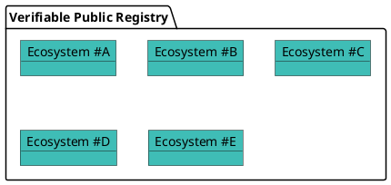
```plantuml

@startuml
scale max 800 width
 
package "Verifiable Public Registry" as vpr {

    object "Ecosystem #A" as tra #3fbdb6 {
    }

    object "Ecosystem #B" as trb #3fbdb6 {

    }

    object "Ecosystem #C" as trc #3fbdb6 {

    }

    object "Ecosystem #D" as trd #3fbdb6 {

    }
    object "Ecosystem #E" as tre #3fbdb6 {

    }
    
   
}


@enduml

```

Participant directory is intended to be **crawled by indexers**, which resolve the listed DIDs, identify associated [[ref: verifiable services]], and index them.

Indexers may expose this data through APIs for querying the indexed services or use it to build a search engine for querying the database of indexed [[ref: verifiable services]].

### Conformance

As well as sections marked as non-normative, all authoring guidelines, diagrams, examples, and notes in this specification are non-normative. Everything else in this specification is normative.
The key words MAY, MUST, MUST NOT, OPTIONAL, RECOMMENDED, REQUIRED, SHOULD, and SHOULD NOT in this document are to be interpreted as described in [BCP 14](https://datatracker.ietf.org/doc/html/bcp14) [RFC2119](https://w3c.github.io/vc-data-model/#bib-rfc2119) [RFC8174](https://w3c.github.io/vc-data-model/#bib-rfc8174) when, and only when, they appear in all capitals, as shown here.

## Terminology

[[def: account, accounts]]:
~ A [[ref: verifiable public registry]] account.

[[def: applicant, applicants]]:
~ A [[ref: account]] that starts a [[ref: onboarding process]].

[[def: corporation, corporations]]:
~ A legal/organizational entity that controls Participants in zero or more [[ref: ecosystems]] and may itself be the controller of zero or more [[ref: ecosystems]]. A `Corporation` is a VPR-level entity with VPR-specific attributes (DID, governance framework, lifecycle) anchored on-chain by a `policy_address` account that signs on its behalf.

[[def: corporation governance framework, CGF]]:
~ The governance framework (GF) of a [[ref: corporation]].

[[def: corporation governance authority, CGA]]:
~ The governance authority (GA) of a [[ref: corporation]].

[[def: credential schema, credential schemas]]:
~ An [[ref: VPR]] resource which represents a verifiable credential definition and the associated permissions and business rules for issuing, verifying or holding a credential linked to this credential schema.

[[def: credential schema participant, credential schema participants, CSP]]:
~ A `Participant` entry, linked to a [[ref: credential schema]], that represents, in a given [[ref: ecosystem]], a grant for being [[ref: issuer]], [[ref: verifier]], [[ref: issuer grantor]], or [[ref: verifier grantor]] of a [[ref: credential schema]].

[[def: decentralized identifier, DID, DIDs]]:
~ A decentralized identifier, as specified in [[spec-norm:DID-CORE]]. A DID is a type of [[ref: VID]].

[[def: verifiable identifier, VID, VIDs]]:
~ A digital identifier bound to cryptographic key material, such that another party can verify control of the identifier and resolve it to keys (and, when in public use, endpoint addresses), as specified in the [Trust Spanning Protocol (TSP) Specification](https://trustoverip.github.io/tswg-tsp-specification/). [[ref: DIDs]] are one **type** of VID; other examples include X.509-backed identifiers. Provided for reference: this specification currently uses [[ref: DIDs]] only. Note that KERI AIDs are [[ref: DIDs]] (e.g. `did:webs`, `did:keri`) and can therefore be used with this specification.

[[def: decentralized identifier communication, DIDComm]]:
~ [DIDComm](https://identity.foundation/didcomm-messaging/spec/) uses [[ref: DIDs]] to establish confidential, ongoing connections.

[[def: denom, denoms]]:
~ Token that has been configured and is recognized in a [[ref: VPR]], example: uvna, USDC.  

[[def: native denom]]:
~ Native token of a [[ref: VPR]], example: uvna.

[[def: ecosystem, ecosystems]]: a network of interacting entities, both technical and human, that work together to establish and maintain digital trust. It encompasses applications, credentials, governance frameworks, and the underlying technical infrastructure, all designed to facilitate trustworthy interactions.

[[def: ecosystem governance framework, EGF]]:
~ The governance framework (GF) of an ecosystem].

[[def: ecosystem governance authority, EGA]]:
~ The governance authority (GA) of an [[ref: ecosystem]].

[[def: entity, entities]]:
~ An [[ref: account]] controller.

[[def: estimated transaction fees]]:
~ Estimated fees required, in [[ref: denom]], that is passed when execute a [[ref: transaction]] in an [[ref: VPR]]. Usually, a estimated transaction fees are always slightly greater than [[ref: transaction fees]], to make sure the execution of the transaction will not be aborted for an out-of-gas situation. Unused gas is refunded to account.

[[def: governance framework, GF]]:
~ The governance framework (GF) of a [[ref: VPR]].

[[def: governance authority, GA]]:
~ The governance authority (GA) of a [[ref: VPR]].

[[def: grantor, grantors]]:
~ A role an [[ref: entity]] is granted by an [[ref: ecosystem]] for operating its [[ref: ecosystem]].

[[def: holder, holders]]:
~ A role an entity might perform by possessing one or more verifiable credentials and generating verifiable presentations from them. A holder is often, but not always, a [[ref: subject]] of the verifiable credentials they are holding. Holders store their credentials in credential repositories. Example holders include organizations, persons, things.

[[def: issuer, issuers]]:
~ A role an [[ref: entity]] is granted by an [[ref: ecosystem]] or an [[ref: issuer grantor]] for issuing credentials of a given [[ref: credential schema]] to [[ref: holders]].

[[def: issuer grantor, issuer grantors]]:
~ An ecosystem operator role an [[ref: entity]] is granted by an [[ref: ecosystem]] for a given [[ref: credential schema]] for adding or revoking issuers.

[[def: json schema, json schemas, Json Schema, Json Schemas]]
~ a Json Schema, as specified in [https://json-schema.org/specification](https://json-schema.org/specification).

[[def: keeper]]:
~ A storage map(key, value) in the ledger of an [[ref: VPR]].

[[def: linked-vp]]:
~ A presentation of a [[ref: verifiable credential]] as specified in [LINKED-VP](https://identity.foundation/linked-vp/).

[[def: participant, participants]]:
~ An entity that is recognized by one or several ecosystem(s) in a [[ref: VPR]].

[[def: query]]:
~ A read-only action that perform some reading in an [[ref: VPR]] and returns value.

[[def: subject, subjects]]:
~ A thing about which claims are made. Example subjects include human beings, animals, things, and organization, a [[ref: DID]]...

[[def: transaction, transactions]]:
~ An action that modifies the ledger of an [[ref: VPR]] and which execution requires transaction fees.

[[def: transaction fees]]:
~ Fees required, in [[ref: denom]], to execute a [[ref: transaction]] in an [[ref: VPR]].

[[def: trust deposit, trust deposits]]:
~ The [[ref: trust unit]] balance of a [[ref: corporation]], used as its trust guarantee and the basis of its trust score. A trust deposit grows through paid usage: whenever a deposit-bound amount of [[ref: native denom]] is spent by or for a corporation (onboarding processes, credential issuance, presentation,...), trust units are minted to its deposit at the current [[ref: trust unit peg value]]. Trust units in a deposit are non-transferable and non-convertible; a trust deposit can be slashed but never withdrawn.

[[def: trust fee, trust fees]]:
~ Fees paid by a [[ref: participant]] that are distributed to other [[ref: participants]].

[[def: network fee, network fees]]:
~ Fees paid by a [[ref: participant]] for transaction execution, routed to the [[ref: distribution pool]].

[[def: trust unit, trust units, TU, TUs]]:
~ A non-transferable, non-convertible accounting unit that is the only balance held in a [[ref: trust deposit]]. Trust units are minted when a deposit-bound amount of [[ref: native denom]] is spent: the [[ref: native denom]] amount is routed to the [[ref: distribution pool]] (never held in reserve) and the corresponding trust units are credited to the payer's [[ref: trust deposit]] at the current [[ref: trust unit peg value]]. Trust units are **not** a token and **not** a pricing asset: they cannot be transferred, cannot be redeemed for tokens, and cannot be used to define fees. Their sole use is the computation of trust scores, which decay over time through the declining [[ref: trust unit peg value]] index.

[[def: trust unit peg value, tu_peg_value]]:
~ The value of one [[ref: trust unit]] expressed in the [[ref: main fiat currency]]. Set at genesis and declining **deterministically** each [[ref: epoch]] by `tu_decay_rate` (a protocol schedule, **not** oracle-fed). Because trust units are minted at the current peg value, a static trust deposit balance loses fiat value at exactly `tu_decay_rate`: maintaining a trust score requires ongoing paid activity ("trust decay").

[[def: main fiat currency]]:
~ The ISO-4217 fiat currency, defined at network launch, used to denominate the [[ref: trust unit peg value]], distribution budgets, and slash obligations. Fee pricing MAY use other fiat currencies (multi-fiat), but protocol-level accounting uses the main fiat currency.

[[def: epoch, epochs]]:
~ A fixed-length period (`epoch_length`, e.g. 1 day) at whose boundary the [[ref: trust unit peg value]] index is updated and the [[ref: distribution pool]] is paid out.

[[def: distribution pool]]:
~ The module account that collects, each [[ref: epoch]], all deposit-bound [[ref: native denom]] amounts and [[ref: network fees]]. At epoch end it is paid out in a fixed order (validator budgets, council budget, foundation budget, capped yield to bonded native denom holders) and the **residual is burned**.

[[def: bonded tokens, bonded native denom]]:
~ [[ref: native denom]] bonded through the standard staking module (subject to `unbonding_period`) in order to accrue the capped, fee-funded, pro-rata yield from the [[ref: distribution pool]]. Bonding confers **no consensus power and no governance power**: it is reward accounting only.

[[def:ecosystem, ecosystems]]
~ An approved list of [[ref: participants]] that are authorized to issue/verify certain credentials in an ecosystem.

[[def: URI, URIs]]
~ An Universal Resource Identifier, as specified in [rfc3986](https://datatracker.ietf.org/doc/html/rfc3986).

[[def: active participant, active participants]]:
~ A participant of a given role, which effective_from timestamp is lower than current timestamp, and (effective_until timestamp is null or greater than current timestamp), and revoked is null and slashed is null.

[[def: future participant, future participants]]:
~ A participant of a given role, which effective_from timestamp is higher than current timestamp, and (effective_until timestamp is null or greater than effective_from timestamp), and revoked is null and slashed is null.

[[def: onboarding process]]:
~ A process run by [[ref: applicants]] that want to, for a specific [[ref: credential schema]], be a [[ref: issuer]], be a [[ref: verifier]], or simply hold a verifiable credential linked to the [[ref: credential schema]].

[[def: validator]]:
~ A role an [[ref: entity]] performs by participating in onboarding processes with [[ref: applicants]] in order to register them as [[ref: issuer]], or [[ref: verifier]] of a [[ref: credential schema]], or to deliver a verifiable credential to them.

[[def: verifiable public registry, VPR, VPRs]]:
~ a public, normally decentralized, ledger-based network, which provides: ecosystem features, that can be used by all its [[ref: participants]]: create ecosystems, for each ecosystem, define its credential schemas, who can issue, verify credential of a specific credential schema,... and a tokenized business model for charging/rewarding [[ref: participants]].

[[def: verifiable service, verifiable services, VS, VSs]]:
~ A service, identified by a resolvable [[ref: DID]] that can be deployed anywhere by its owner, and that is conforming to this spec and has a resolvable Proof-of-Trust. See [[ref: VT Spec]].

[[def: verifiable user agent, verifiable user agents, VUA, VUAs]]:
~ A user agent for accessing and using [[ref: VSs]]. To be considered a [[ref: VUA]], a user agent must conform and enforce this spec, such as presenting a proof of trust to end user before accepting connecting to [[ref: VS]] compliant services, and refuse connecting to not compliant services. See [[ref: VT Spec]].

[[def: Verifiable Trust Specification, Verifiable Trust Spec, VT Specs, VT Spec]]:
~ see [VT Spec](https://github.com/verana-labs/verifiable-trust-spec).

[[def: verifier, verifiers]]:
~ A role an [[ref: entity]] is granted by an [[ref: ecosystem]] or a [[ref: verifier grantor]] for verifying credentials of a given [[ref: credential schema]].

[[def: verifier grantor, verifier grantors]]:
~ An ecosystem operator role an [[ref: entity]] is granted by an [[ref: ecosystem]] for a given [[ref: credential schema]] for adding or revoking verifiers.

[[def: verifiable credential, verifiable credentials]]:
~ A verifiable credential as defined in [[spec-norm:VC-DATA-MODEL]].

## Naming Conventions

### In this spec

- For clarity, Camel Case is used for naming Modules, Entities, Objects, etc.

### In Implementations

- All APIs MUST return valid JSON.
- All JSON content MUST use Snake Case for object, attribute... names.
- Object attributes and Json Content in general can be returned in any order.

## Features of a Verifiable Public Registry (VPR)

### Ecosystem Management

*This section is non-normative.*

In an [[ref: VPR]], any [[ref: corporation]] can create an `Ecosystem` entry to represent an [[ref: ecosystem]] it controls. Each `Ecosystem` entry MUST provide, at a minimum:

- an ecosystem controlled resolvable [[ref: DID]];
- one or more [[ref: ecosystem governance framework]] document(s);
- zero or more [[ref: credential schemas]].

The Verifiable Public Registry (VPR) is agnostic to the specific DID methods used. Trust resolution is performed externally, outside the VPR, allowing flexibility and interoperability across ecosystems.

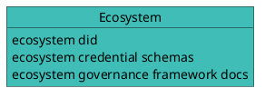
```plantuml

@startuml
scale max 800 width
 
object "Ecosystem" as tra #3fbdb6 {
    ecosystem did
    ecosystem credential schemas
    ecosystem governance framework docs
}

@enduml

```

### Credential Schemas and Participants

*This section is non-normative.*

[[ref: Credential schemas]] are created and managed by [[ref: ecosystems]] (i.e., by the [[ref: corporation]] controlling each [[ref: ecosystem]]). Each [[ref: Credential schema]] includes, at a minimum:

- A **Json Schema** that defines the structure of the corresponding [[ref: verifiable credential]].
- An **IssuerOnboardingMode** for **issuance policy**, which determines how `ISSUER` `Participant` entries are created. Modes include:
  - `OPEN`: `ISSUER` Participants can be self-created by any [[ref: corporation]].
  - `ECOSYSTEM_ONBOARDING_PROCESS`: `ISSUER` Participants are created directly by the controlling [[ref: ecosystem]] through an [[ref: onboarding process]].
  - `GRANTOR_ONBOARDING_PROCESS`: `ISSUER` Participants are created by one or several [[ref: issuer grantor]](s) — ecosystem operators responsible for onboarding issuers for the credential schema of this [[ref: ecosystem]] — selected by the [[ref: ecosystem]] through an [[ref: onboarding process]].
- A **VerifierOnboardingMode** for **verification policy**, which determines how `VERIFIER` `Participant` entries are created. Modes include:
  - `OPEN`: `VERIFIER` Participants can be self-created by any [[ref: corporation]].
  - `ECOSYSTEM_ONBOARDING_PROCESS`: `VERIFIER` Participants are created directly by the controlling [[ref: ecosystem]] through an [[ref: onboarding process]].
  - `GRANTOR_ONBOARDING_PROCESS`: `VERIFIER` Participants are created by one or several [[ref: verifier grantor]](s) — ecosystem operators responsible for onboarding verifiers for the credential schema of this [[ref: ecosystem]] — selected by the [[ref: ecosystem]] through an [[ref: onboarding process]].
- A **HolderOnboardingMode** for **holder policy**, which determines how `HOLDER` `Participant` entries are created. Modes include:
  - `ISSUER_ONBOARDING_PROCESS`: `HOLDER` Participants are created directly by [[ref: issuers]] for holders, through an [[ref: onboarding process]].
  - `PERMISSIONLESS`: a holder that wants to obtain credentials from an [[ref: issuer]] does not require a `Participant` entry in the VPR.
- A **Participant tree** that defines the roles and relationships involved in managing the schema’s lifecycle. Each `Participant` entry in the tree can define business rules; see [Business Models](#business-models) below.

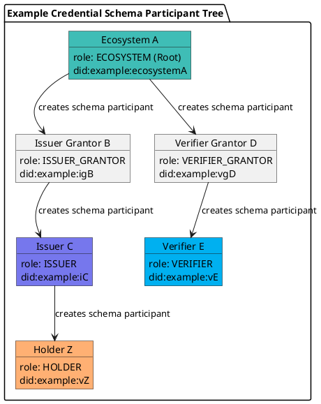
```plantuml

@startuml
scale max 800 width
 
package "Example Credential Schema Participant Tree" as cs {

    object "Ecosystem A" as tr #3fbdb6 {
        role: ECOSYSTEM (Root)
        did:example:ecosystemA
    }
    object "Issuer Grantor B" as ig {
        role: ISSUER_GRANTOR
        did:example:igB
    }
    object "Issuer C" as issuer #7677ed  {
        role: ISSUER
        did:example:iC
    }
    object "Verifier Grantor D" as vg {
        role: VERIFIER_GRANTOR
        did:example:vgD
    }
    object "Verifier E" as verifier #00b0f0 {
        role: VERIFIER
        did:example:vE
    }

    object "Holder Z " as holder #FFB073 {
        role: HOLDER
        did:example:vZ
    }
}


tr --> ig : creates schema participant
ig --> issuer : creates schema participant

tr --> vg : creates schema participant
vg --> verifier : creates schema participant

issuer --> holder: creates schema participant

@enduml

```

Participant roles are defined in the table below:

| **Participant Role**   | **Description**                                                  |
|-----------------------|------------------------------------------------------------------|
| **Ecosystem**    | Create and control [[ref: ecosystems]] and credential schemas. Recognize other participants by validating them onto the schema (creating their `Participant` entries).        |
| **Issuer Grantor**    | Ecosystem operator that creates `ISSUER` `Participant` entries for candidate issuers.                   |
| **Verifier Grantor**  | Ecosystem operator that creates `VERIFIER` `Participant` entries for candidate verifiers.               |
| **Issuer**            | Can issue credentials of this schema.                            |
| **Verifier**          | Can request presentation of credentials of this schema.          |
| **Holder**            | Holds a credential. `HOLDER` `Participant` entries carry credential status (active, revoked, ...). |

Example of a Json Schema credential schema:

```json
{
  "$id": "vpr:verana:mainnet:cs:VPR_CREDENTIAL_SCHEMA_ID", // ignored, will be generated
  "$schema": "https://json-schema.org/draft/2020-12/schema",
  "title": "ExampleCredential",
  "description": "ExampleCredential using JsonSchema",
  "type": "object",
  "properties": {
    "credentialSubject": {
      "type": "object",
      "properties": {
        "id": {
          "type": "string",
          "format": "uri"
        },
        "firstName": {
          "type": "string",
          "minLength": 0,
          "maxLength": 256
        },
        "lastName": {
          "type": "string",
          "minLength": 1,
          "maxLength": 256
        },
        "expirationDate": {
          "type": "string",
          "format": "date"
        },
        "countryOfResidence": {
          "type": "string",
          "minLength": 2,
          "maxLength": 2
        }
      },
      "required": [
        "id",
        "lastName",
        "birthDate",
        "expirationDate",
        "countryOfResidence"
      ]
    }
  }
}
```

To participate in an [[ref: ecosystem]] and assume a role associated with a specific [[ref: credential schema]]:

- if the schema is `OPEN` for issuance and/or verification: a [[ref: corporation]] MUST have a registered `Corporation` entry in the [[ref: VPR]] and self-create its `Participant` entry.

- if the schema is not `OPEN` for issuance and/or verification: a [[ref: corporation]] MUST have a registered `Corporation` entry in the [[ref: VPR]] and complete an [[ref: onboarding process]] to obtain its `Participant` entry.

The [[ref: onboarding process]] involves two parties:

- The [[ref: applicant]] — the [[ref: corporation]] requesting a `Participant` entry for a credential schema within the ecosystem.
- The [[ref: validator]] — a corporation that already holds a `Participant` entry for the same credential schema and has been delegated authority to validate applicants and create new `Participant` entries.

Running an [[ref: onboarding process]] **typically involves the payment of [[ref: trust fees]]**. The [[ref: trust fee]] amount to be paid by the [[ref: applicant]] is defined in the [[ref: validator]]'s `Participant` entry:

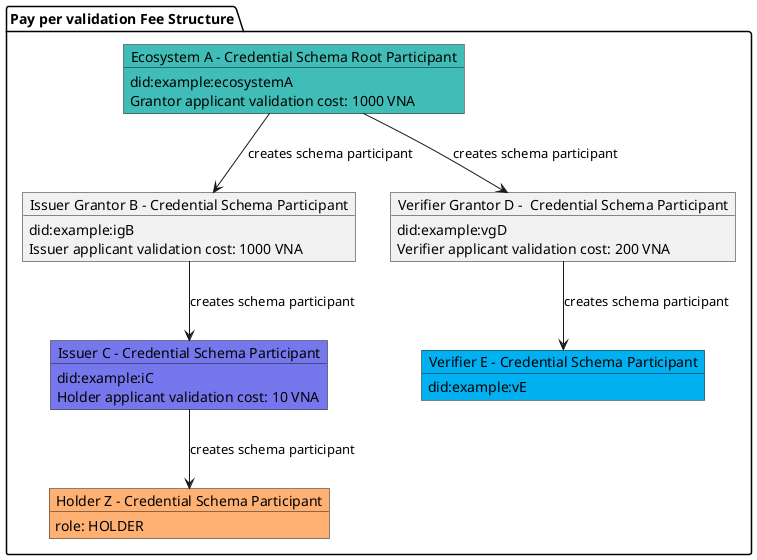
```plantuml

@startuml
scale max 800 width
 
package "Pay per validation Fee Structure" as cs {

    object "Ecosystem A - Credential Schema Root Participant" as tr #3fbdb6 {
        did:example:ecosystemA
        Grantor applicant validation cost: 1000 VNA
    }
    object "Issuer Grantor B - Credential Schema Participant" as ig {
        did:example:igB
        Issuer applicant validation cost: 1000 VNA
    }
    object "Issuer C - Credential Schema Participant" as issuer #7677ed  {
        did:example:iC
        Holder applicant validation cost: 10 VNA
    }
    object "Verifier Grantor D -  Credential Schema Participant" as vg {
        did:example:vgD
        Verifier applicant validation cost: 200 VNA
    }
    object "Verifier E - Credential Schema Participant" as verifier #00b0f0 {
        did:example:vE
    }

    object "Holder Z - Credential Schema Participant" as holder #FFB073 {
        role: HOLDER
    }
}

tr --> ig : creates schema participant
ig --> issuer : creates schema participant
issuer --> holder: creates schema participant
tr --> vg : creates schema participant
vg --> verifier : creates schema participant

@enduml

```

### Corporation Management

*This section is non-normative.*

A [[ref: corporation]] is the VPR-level entity that represents an authority acting in the registry. A `Corporation` carries VPR-specific attributes — a [[ref: DID]], a [[ref: corporation governance framework]] (CGF), and lifecycle metadata — and is anchored on-chain by a `policy_address` account that signs on its behalf. The `Corporation` entry has its own `id`, and every other VPR entity points to it through a `corporation_id` foreign key.

A corporation interacts with the VPR in two complementary ways:

- as the **controller** of zero or more [[ref: ecosystems]] — i.e., the corporation owns the corresponding `Ecosystem` entries. The controlling corporation manages each ecosystem's [[ref: EGF]], its [[ref: credential schemas]], and the root `ECOSYSTEM` `Participant` entries of those schemas.
- as the **owner of zero or more `Participant` entries** in zero or more [[ref: ecosystems]] — i.e., the corporation acts as `ISSUER`, `VERIFIER`, `ISSUER_GRANTOR`, `VERIFIER_GRANTOR`, `HOLDER`, or root `ECOSYSTEM` for [[ref: credential schemas]] of those ecosystems.

The two roles are **independent**: a corporation MAY control no ecosystem at all and only hold `Participant` entries in third-party ecosystems; or it MAY control several ecosystems and additionally hold `Participant` entries in others; or any combination of the two.

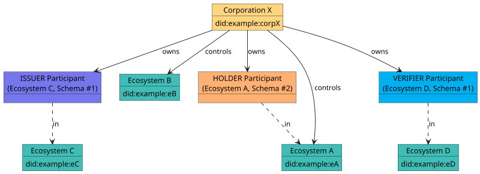
```plantuml

@startuml
scale max 800 width

object "Corporation X" as corpX #FFD580 {
  did:example:corpX
}

' Ecosystems controlled by Corporation X
object "Ecosystem A" as eA #3fbdb6 {
  did:example:eA
}
object "Ecosystem B" as eB #3fbdb6 {
  did:example:eB
}

' Ecosystems where Corporation X is just a participant
object "Ecosystem C" as eC #3fbdb6 {
  did:example:eC
}
object "Ecosystem D" as eD #3fbdb6 {
  did:example:eD
}

' Corporation X's Participant entries
object "ISSUER Participant\n(Ecosystem C, Schema #1)" as pC #7677ed
object "VERIFIER Participant\n(Ecosystem D, Schema #1)" as pD #00b0f0
object "HOLDER Participant\n(Ecosystem A, Schema #2)" as pA #FFB073

corpX --> eA : controls
corpX --> eB : controls

corpX --> pC : owns
corpX --> pD : owns
corpX --> pA : owns

pC ..> eC : in
pD ..> eD : in
pA ..> eA : in

@enduml

```

The same `Corporation` entry is the single entry point for the corporation's governance (the CGF), authorization delegation (via `OperatorAuthorization` to one or more `operator` accounts), and trust-deposit accounting (`TrustDeposit`). See the [Corporation Module](#corporation-module) for the methods that manage `Corporation` entries.

### DID Indexing

*This section is non-normative.*

The `Participant` registry is the foundation for building **searchable indexes of [[ref: verifiable services]] and the verifiable metadata they expose**. Crawlers iterate over `Participant` entries, resolve each service identifier (currently a [[ref: DID]], extensible in the future), verify that the service is a [[ref: verifiable service]], and extract its verifiable metadata — most notably the credentials presented through [[ref: linked-vp]] — together with the [[ref: ecosystem]] memberships, [[ref: credential schema]] permissions, and [[ref: trust deposit]] level associated with the controlling [[ref: corporation]].

Unlike a traditional web index, this index is **trust-typed**: every entry carries cryptographically verifiable claims about *what* the service is, *who* operates it, and *under which governance frameworks* it is accredited. This unlocks a class of discovery use cases that traditional search engines cannot serve.

#### AI agent discovery

AI agents are first-class consumers of the index. Before delegating a task or accepting a connection, an agent needs to find counterparts whose **presented credentials match the capabilities required for the interaction**. Querying the index, an AI agent can:

- find [[ref: verifiable services]] qualified for a specific task — for example, a payment processor accredited in a given jurisdiction, a KYC issuer recognized by a target [[ref: ecosystem]], or an MCP-style service whose operator holds a recognized organization credential;
- discover other AI agents whose credentials prove the right scope, authority, or operator;
- restrict the search to a specific [[ref: ecosystem]] or to services that comply with a chosen [[ref: credential schema]];
- rank candidates by [[ref: trust deposit]] size, accreditations held, slashing history, or credential freshness, in order to bias selection toward parties with stronger economic accountability.

Because every indexed claim is anchored in the [[ref: VPR]], an AI agent can verify a counterpart end-to-end *before* initiating the interaction, avoiding spoofed services and unaccredited issuers.

#### Verifiable User Agent content discovery

[[ref: Verifiable user agents]] (VUAs) — such as social browsers, agentic browsers, or CDN-aware clients — use the index to **find content and services that are compatible with the user's context**: the credentials the user holds, the [[ref: ecosystems]] the user trusts, the jurisdictions and languages that apply, and the schemas that the user's wallet can satisfy.

Typical VUA queries include:

- *"Show only services accredited under ecosystem X"* — filter by [[ref: ecosystem]] membership.
- *"Show services that accept the credentials currently in my wallet"* — match the holder's credentials against each [[ref: VS]]'s expected presentations.
- *"Show issuers of schema Y operating in jurisdiction Z"* — combine [[ref: credential schema]] permissions with corporation metadata.
- *"Show services my user has previously interacted with successfully"* — combine the index with the VUA's local history.

The result is a feed of [[ref: VSs]] for which a proof of trust can be displayed to the user *before* connection, in line with the VUA enforcement obligations defined in this spec and in the [[ref: VT Spec]].

#### Other consumers

The same index serves additional consumers:

- **Trust-aware and traditional, form-based search engines**, which can return ordinary links to [[ref: VSs]] enriched with verifiable trust signals (issuer accreditations, [[ref: ecosystem]] memberships, [[ref: trust deposit]] level).
- **Ecosystem operators and governance authorities**, which use the index to monitor accredited issuers, verifiers, and grantors, observe schema adoption across [[ref: ecosystems]], and detect rogue or expired participants.
- **Auditors, regulators, and compliance tools**, which rely on the index to map the supply chain of trust behind a given service or credential, and to verify that participants are still in good standing.
- **Analytics and reputation services**, which combine indexed metadata with on-chain history (trust-deposit movements, slashing events, session volumes) to produce reputational signals at the [[ref: corporation]] level.

#### Indexing pipeline


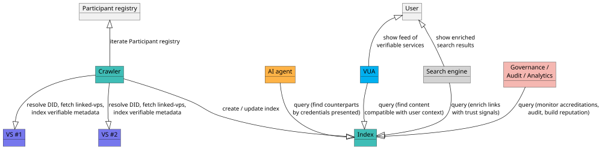
```plantuml

@startuml
scale max 1000 width

object "Participant registry" as didd
object "Crawler" as crawler #3fbdb6
object "Index" as index #3fbdb6

object "VS #1" as dts1 #7677ed
object "VS #2" as dts2 #7677ed

object "AI agent" as aiagent #ffb347
object "VUA" as browser #00b0f0
object "Search engine" as search #d3d3d3
object "Governance /\nAudit / Analytics" as gov #f5b7b1

object "User" as user

didd <|-- crawler : iterate Participant registry
crawler --|> dts1 : resolve DID, fetch linked-vps,\nindex verifiable metadata
crawler --|> dts2 : resolve DID, fetch linked-vps,\nindex verifiable metadata
crawler --|> index : create / update index

aiagent --|> index : query (find counterparts\nby credentials presented)
browser --|> index : query (find content\ncompatible with user context)
search --|> index : query (enrich links\nwith trust signals)
gov --|> index : query (monitor accreditations,\naudit, build reputation)

user <|-- browser : show feed of\nverifiable services
user <|-- search : show enriched\nsearch results
@enduml

```

### Business models

#### Trust Deposit

*This section is non-normative.*

In a [[ref: VPR]], each [[ref: corporation]] is associated with a [[ref: trust deposit]], which holds [[ref: trust units]] (TU).

The trust deposit is automatically funded through transactions involving **trust operations**, such as onboarding processes, credential issuance, or presentation: each time a deposit-bound amount of [[ref: native denom]] is spent, the [[ref: native denom]] is routed to the [[ref: distribution pool]] and the equivalent trust units, computed at the current [[ref: trust unit peg value]], are minted to the corporation's trust deposit. No [[ref: native denom]] is ever held in reserve: trust units are **not collateralized**.

The trust deposit is fundamental to the **"Proof-of-Trust" (PoT)** mechanism of the [[ref: Verifiable Trust Specification]], and it operates as follows:

- The more a [[ref: corporation]] uses the [[ref: VPR]], the more its [[ref: trust deposit]] grows.
- **Trust is a subscription**: because the [[ref: trust unit peg value]] declines each [[ref: epoch]] by `tu_decay_rate`, a static deposit loses fiat value over time. The trust score therefore reflects **recent** paid usage: earned, never bought, and gone if not maintained.
- **network-level penalties**: If a participant violates the [[ref: governance framework]] of the [[ref: VPR]] or engages in **fraudulent activity**, their **trust deposit may be partially or fully slashed** by the [[ref: VPR]]'s governance authority. The obligation is recorded in [[ref: main fiat currency]] **at slash time**: trust scores decay, **debts do not**.
- **ecosystem-level penalties**: If a participant operates within an ecosystem (e.g., as a [[ref: grantor]], [[ref: issuer]], [[ref: verifier]], or [[ref: holder]],...) and **fails to comply** with that ecosystem’s governance framework (EGF), the **portion of its trust deposit minted in the context of that ecosystem** can be slashed by the corresponding ecosystem governance authority.
- While a slash obligation is unrepaid, all the corporation's `Participant` entries are **non-trustable** and no new trust units can be minted to its deposit. Repayment is made in [[ref: native denom]] worth the fiat obligation at current rates: restoring trust costs **more tokens when the token is cheap**.
- Holding a large trust deposit **does not grant governance rights** in the [[ref: VPR]]: participants who generate high transaction volume **cannot gain control** over the governance of the [[ref: VPR]] solely through usage or deposit size.

This system ensures that participation in the trust ecosystem is backed by economic accountability, reinforcing the integrity, governability and verifiability of the [[ref: VPR]].

#### Why Trust Deposits Are Non-Withdrawable

*This section is non-normative.*

A [[ref: trust deposit]] cannot be withdrawn. This is structural, not merely a policy choice:

- **Trust units are not money.** Trust units are non-transferable and non-convertible; the [[ref: native denom]] spent to mint them was distributed or burned through the [[ref: distribution pool]] and is not held in reserve. There is no redemption path, and therefore **no run risk**.
- **Lasting accountability to the ecosystem.** A trust deposit is bound to the ecosystems it was accumulated in. Choosing to stop using an ecosystem does not release a participant from its obligations toward it — a participant cannot simply walk away and harm the ecosystem because they no longer need it. Since the accumulated trust units cannot be moved or cashed out, the participant remains economically accountable: any harmful behavior can still be slashed, lowering their trust score and creating a fiat-fixed repayment obligation.
- **Recurring demand instead of locked value.** Trust decay makes trust a subscription: keeping a trust score requires ongoing paid activity, which creates recurring demand for the token that scales with adoption — rather than a one-time locked amount that could be gamed through exit-and-rejoin timing.

#### Onboarding Process Trust Fees

*This section is non-normative.*

We've explained in the [Credential Schemas and Participants](#credential-schemas-and-participants) section above what is an onboarding process.

The table below summarizes the possible combinations of applicants and validators:

| Payee → Payer ↓  | Ecosystem                      | Issuer Grantor                        | Verifier Grantor                    | Issuer                              | Verifier | Holder                                  |
|------------------|-------------------------------------|---------------------------------------|-------------------------------------|-------------------------------------|----------|-----------------------------------------|
| Issuer Grantor   | renewable subscription (1)          |                                       |                                     |                                     |          |                                         |
| Verifier Grantor | renewable subscription (2)          |                                       |                                     |                                     |          |                                         |
| Issuer           | renewable subscription (3)          | renewable subscription (1)            |                                     |                                     |          |                                         |
| Verifier         | renewable subscription (4)          |                                       | renewable subscription (2)          |                                     |          |                                         |
| Holder           |                                     |                                       |                                     | renewable subscription  (5)         |          |                                         |

- (1): if *issuer onboarding mode* is set to GRANTOR_ONBOARDING_PROCESS.
- (2): if *verifier onboarding mode* is set to GRANTOR_ONBOARDING_PROCESS.
- (3): if *issuer onboarding mode* is set to ECOSYSTEM_ONBOARDING_PROCESS.
- (4): if *verifier onboarding mode* is set to ECOSYSTEM_ONBOARDING_PROCESS.
- (5): if *holder onboarding mode* is set to ISSUER_ONBOARDING_PROCESS.

Onboarding process is started by the applicant.

*Example of a candidate [[ref: issuer]] ([[ref: applicant]]) that would like to obtain an `ISSUER` `Participant` entry for a credential schema of an ecosystem, validated by a [[ref: validator]] that holds an `ISSUER_GRANTOR` `Participant` entry:*

```plantuml
scale max 800 width
actor "Applicant\n(issuer candidate)\nAccount" as ApplicantAccount 
actor "Applicant\n(issuer candidate)\nVUA" as ApplicantBrowser 

actor "Validator\n(issuer grantor)\nVS" as ValidatorVS
actor "Validator\n(issuer grantor)\nAccount" as ValidatorAccount

participant "Verifiable Public Registry" as VPR #3fbdb6

ApplicantAccount --> VPR: start onboarding process with Validator
VPR <-- VPR: create applicant Participant entry\n(op_state = PENDING)
ApplicantAccount <-- VPR: applicant Participant entry created
ApplicantBrowser --> ValidatorVS: connect to validator VS DID found in\napplicant_participant.validator_participant\nby creating a DIDComm connection
ApplicantBrowser <-- ValidatorVS: DIDComm connection established.
ApplicantBrowser --> ValidatorVS: I want to proceed with applicant_participant.id=...
ValidatorVS --> ValidatorVS: load applicant Participant with this id\nand verify validator_participant_id refers to me
ApplicantBrowser <-- ValidatorVS: request proof of control\nof applicant_participant.corporation_id account (blind sign)
ApplicantBrowser --> ValidatorVS: send blind sign proof of operator account
ApplicantBrowser <-- ValidatorVS: proof accepted, you are an operator\nof the applicant Participant, I trust you.
ApplicantBrowser <-- ValidatorVS: which DID do you want to register as an issuer?
ApplicantBrowser --> ValidatorVS: send DID
ValidatorVS --> ValidatorVS: resolve DID and get pub keys
ApplicantBrowser <-- ValidatorVS: request proof of ownership\nof the DID to be registered on your `ISSUER` `Participant` entry (blind sign)
ApplicantBrowser --> ValidatorVS: send blind sign proofs
ApplicantBrowser <-- ValidatorVS: proof accepted, you are the controller of this DID, I trust you.
note over ApplicantBrowser, ValidatorVS #EEEEEE: (*optional*) repeat the following until tasks completed
ApplicantBrowser <-- ValidatorVS: Are you a legitimate issuer?\nProve it, by filling forms, sending documents...
ApplicantBrowser --> ValidatorVS: perform requested tasks...
note over ApplicantBrowser, ValidatorVS #EEEEEE: tasks completed
ApplicantBrowser <-- ValidatorVS: You are a legitimate candidate. I'll now finalize your `ISSUER` `Participant` entry.
ValidatorAccount --> VPR #3fbdb6: set applicant_participant.op_state to VALIDATED\n(finalize the `ISSUER` `Participant` entry)
VPR --> ValidatorAccount: Receive trust fees.
ApplicantBrowser <-- ValidatorVS: notify `ISSUER` `Participant` entry validated for your corporation and DID.\nDID can now issue credentials of this schema.
```

The **total amount** paid by the applicant consists of:

- The validation [[ref: trust fees]] defined in the validator's `Participant` entry (the one acting as the validator in the onboarding process), **plus**
- an additional amount equal to the `trust_deposit_rate` of that validation [[ref: trust fees]] (the applicant's deposit-bound amount), **plus**
- [[ref: network fees]] (not part of the escrowed amount).

While the onboarding process is PENDING, both the validation fees **and** the deposit-bound amount are **held in the escrow account**: no trust units are minted and nothing enters the [[ref: distribution pool]]. If the process is cancelled, the escrowed amount is refunded as-is — this is the only refund path; trust deposits themselves are never freed.

Example, using 5% for `trust_deposit_rate` and validation fees of 1000 VNA:

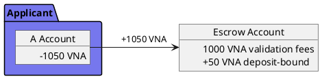
```plantuml

@startuml
scale max 1200 width
 


package "Applicant" as issuer #7677ed {
    object "A Account" as issuera {
         \t-1050 VNA
    }
}

object "Escrow Account" as escrow {
    \t1000 VNA validation fees
    \t+50 VNA deposit-bound
}

issuera -r-> escrow: \t+1050 VNA


@enduml

```

Upon completion of the onboarding process (VALIDATED), **the escrow is settled** as follows:

- the validator receives its validation fees minus their deposit-bound portion (`trust_deposit_rate`) **directly in its wallet**;
- the deposit-bound amounts — `trust_deposit_rate` of the validation fees for the validator, plus the applicant's surcharge — are converted: [[ref: trust units]] are minted to the validator's and the applicant's trust deposits at the current [[ref: trust unit peg value]], and the corresponding [[ref: native denom]] is routed to the [[ref: distribution pool]].

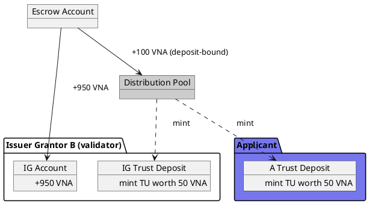
```plantuml

@startuml
scale max 1200 width

package "Issuer Grantor B (validator)" as ig {
    object "IG Account" as iga {
        \t+950 VNA
    }
    object "IG Trust Deposit" as igtd {
        \tmint TU worth 50 VNA
    }
}
package "Applicant" as a #7677ed {
    object "A Trust Deposit" as atd {
        \tmint TU worth 50 VNA
    }
}
object "Escrow Account" as escrow
object "Distribution Pool" as pool #cccccc


escrow -r-> iga: \t+950 VNA
escrow --> pool: \t+100 VNA (deposit-bound)
pool ..> igtd: \tmint
pool ..> atd: \tmint

@enduml

```

#### "Pay-Per" trust fees

*This section is non-normative.*

**Pay-per-issuance** and **pay-per-verification** [[ref: trust fees]] are defined **on each `Participant` entry** for each role within the ecosystem. Fees are priced in the credential schema's pricing asset — a COIN (e.g. the [[ref: native denom]] or a stablecoin) or a FIAT currency; [[ref: trust units]] are **not** a pricing asset. In the examples below, the schema prices fees in VNA (the native denom).

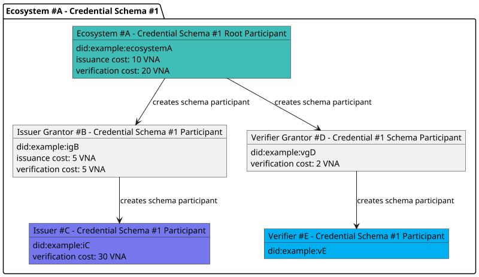
```plantuml

@startuml
scale max 800 width
 
package "Ecosystem #A - Credential Schema #1" as cs {

    object "Ecosystem #A - Credential Schema #1 Root Participant" as tr #3fbdb6 {
        did:example:ecosystemA
        issuance cost: 10 VNA
        verification cost: 20 VNA
    }
    object "Issuer Grantor #B - Credential Schema #1 Participant" as ig {
        did:example:igB
        issuance cost: 5 VNA
        verification cost: 5 VNA
    }
    object "Issuer #C - Credential Schema #1 Participant" as issuer #7677ed  {
        did:example:iC
        verification cost: 30 VNA
    }
    object "Verifier Grantor #D - Credential #1 Schema Participant" as vg {
        did:example:vgD
        verification cost: 2 VNA
    }
    object "Verifier #E - Credential Schema #1 Participant" as verifier #00b0f0 {
        did:example:vE
    }
}


tr --> ig : creates schema participant
ig --> issuer : creates schema participant

tr --> vg : creates schema participant
vg --> verifier : creates schema participant

@enduml

```

[[ref: Corporations]] acting as **issuers** or **verifiers** for a given credential schema **may be required to pay trust fees** based on the schema's configuration and `Participant` tree.

If trust fee payment is required, the entity **must execute a transaction** in the [[ref: VPR]] to pay the appropriate [[ref: trust fees]] **before issuing or verifying a credential**, else HOLDER agent will not accept the operation.

Key Points for "Pay-Per" Business Models

- For a given credential schema, the **ecosystem** and its participants may define **pay-per-issuance** (or **pay-per-verification**) [[ref: trust fees]] on their respective `Participant` entries.

- In such cases, an `ISSUER` (or `VERIFIER`) `Participant` **must pay**:
  - the corresponding **issuance** (or **verification**) trust fees for each involved `Participant` entry along the `Participant` tree;
  - an additional amount equal to the `trust_deposit_rate` of the calculated trust fees, which is deposit-bound: minted as [[ref: trust units]] to the **payer's [[ref: trust deposit]]**;
  - (optional) an amount equal to `wallet_user_agent_reward_rate` of the calculated trust fees, used to **reward the Wallet User Agent**;
  - (optional) an amount equal to `user_agent_reward_rate` of the calculated trust fees, used to **reward the User Agent**.

Fee Distribution Model

Trust fees are **consistently distributed** across participants:

- A portion defined by `trust_deposit_rate` of each payee's share is deposit-bound: it is minted as [[ref: trust units]] to the **payee's trust deposit** and the corresponding [[ref: native denom]] is routed to the [[ref: distribution pool]].
- The remaining portion is **transferred directly to the payee's wallet** — ordinary flow-through revenue, neither burned nor restricted.

:::note
Agents that implement the [[ref: VT spec]] **must verify** that the ISSUER or VERIFIER has fulfilled the required trust fee payment.  
If not, they **must reject** the issuance or verification request.

Note: The **User Agent** and **Wallet User Agent** may refer to the same implementation.
:::

Distribution example for the issuance by `ISSUER` #C of a credential, using the `Participant` tree above, 5% for `trust_deposit_rate`, 5% for `wallet_user_agent_reward_rate` and `user_agent_reward_rate`. Total fees along the tree: 10 + 5 = 15 VNA; the issuer pays 15 × (1 + 0.05 + 0.05 + 0.05) = 17.25 VNA. Deposit-bound amounts (payer surcharge and 5% of each payee share, agents included) total 1.575 VNA, routed to the [[ref: distribution pool]] with the equivalent trust units minted to each party's deposit.

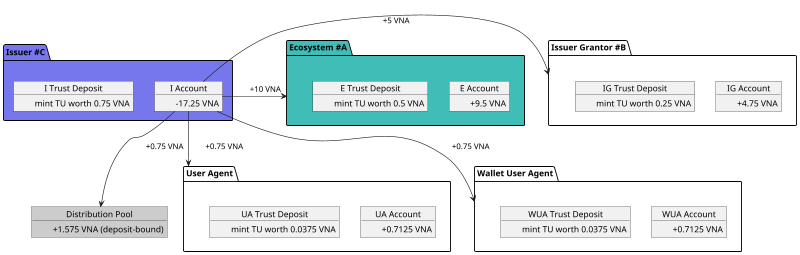
```plantuml

@startuml
scale max 800 width
 

package "Ecosystem #A" as tr #3fbdb6 {
    object "E Account" as tra {
         \t+9.5 VNA
    }
    object "E Trust Deposit" as trtd {
         \tmint TU worth 0.5 VNA
    }
}

package "Issuer Grantor #B" as ig {
    object "IG Account" as iga {
        \t+4.75 VNA
    }
    object "IG Trust Deposit" as igtd {
        \tmint TU worth 0.25 VNA
    }
}
package "Issuer #C" as issuer #7677ed {
    object "I Account" as issuera {
         \t-17.25 VNA
    }
    object "I Trust Deposit" as issuertd {
         \tmint TU worth 0.75 VNA
    }

}

package "User Agent" as ua {
    object "UA Account" as uaa {
         \t+0.7125 VNA
    }
    object "UA Trust Deposit" as uatd {
        \tmint TU worth 0.0375 VNA
    }

}
package "Wallet User Agent" as wua {
    object "WUA Account" as wuaa {
         \t+0.7125 VNA
    }
    object "WUA Trust Deposit" as wuatd {
        \tmint TU worth 0.0375 VNA
    }

}

object "Distribution Pool" as pool #cccccc {
    \t+1.575 VNA (deposit-bound)
}

issuera -r-> tr: \t+10 VNA

issuera -r-> ig: \t+5 VNA

issuera -d-> ua: \t+0.75 VNA

issuera -d-> wua: \t+0.75 VNA

issuera --> pool:  \t+0.75 VNA

@enduml

```

Distribution example for the verification by `VERIFIER` #E of a credential issued by `ISSUER` #C, using the `Participant` tree above, 5% for `trust_deposit_rate`, 5% for `wallet_user_agent_reward_rate` and `user_agent_reward_rate`. Total fees along the tree: 20 + 2 + 5 + 30 = 57 VNA; the verifier pays 57 × 1.15 = 65.55 VNA. Deposit-bound amounts total 5.985 VNA, routed to the [[ref: distribution pool]] with the equivalent trust units minted to each party's deposit.


```plantuml

@startuml
scale max 800 width
 

package "Ecosystem #A" as tr #3fbdb6 {
    object "E Account" as tra {
         \t+19 VNA
    }
    object "E Trust Deposit" as trtd {
         \tmint TU worth 1 VNA
    }
}

package "Issuer Grantor #B" as ig {
    object "IG Account" as iga {
        \t+4.75 VNA
    }
    object "IG Trust Deposit" as igtd {
        \tmint TU worth 0.25 VNA
    }
}
package "Issuer #C" as issuer #7677ed {
    object "I Account" as issuera {
         \t+28.5 VNA
    }
    object "I Trust Deposit" as issuertd {
         \tmint TU worth 1.5 VNA
    }

}
package "Verifier Grantor #D" as vg {
    object "VG Account" as vga {
        \t+1.9 VNA
    }
    object "VG Trust Deposit" as vgtd {
        \tmint TU worth 0.1 VNA
    }

}
package "Verifier #E" as verifier #00b0f0 {
    object "V Account" as verifiera {
        \t-65.55 VNA
    }
    object "V Trust Deposit" as verifiertd {
        \tmint TU worth 2.85 VNA
    }

}
package "User Agent" as ua {
    object "UA Account" as uaa {
         \t+2.7075 VNA
    }
    object "UA Trust Deposit" as uatd {
        \tmint TU worth 0.1425 VNA
    }

}
package "Wallet User Agent" as wua {
    object "WUA Account" as wuaa {
         \t+2.7075 VNA
    }
    object "WUA Trust Deposit" as wuatd {
        \tmint TU worth 0.1425 VNA
    }

}

object "Distribution Pool" as pool #cccccc {
    \t+5.985 VNA (deposit-bound)
}


verifiera -r-> tr: \t+20 VNA

verifiera -r-> vg: \t+2 VNA

verifiera -r-> ig: \t+5 VNA

verifiera -d-> issuer: \t+30 VNA

verifiera -d-> ua: \t+2.85 VNA

verifiera -d-> wua: \t+2.85 VNA

verifiera --> pool:  \t+2.85 VNA

@enduml

```

## Governance of a VPR

*This section is non-normative.*

A [[ref: governance framework]] must define the governance rules that apply to a [[ref: VPR]].

A designated [[ref: governance authority]] (aka a council) is responsible for **enforcing these rules** and, when necessary, **applying financial sanctions** to participants who violate the rules.

:::note
**Ecosystem Governance Frameworks (EGFs)** operate **independently** from the [[ref: VPR]] [[ref: governance framework]].

While the **VPR governance framework** defines the global rules for operating the Verifiable Public Registry (e.g., trust deposits, fee distribution, slashing conditions), each **ecosystem** must define its own **EGF** to govern roles, permissions, credential policies, and compliance within its specific domain.

This separation ensures that ecosystems remain autonomous and can tailor governance to their unique needs, without being constrained by the global rules of the VPR.
:::

## Data model

For simplicity, the data model is presented using an **object-relational structure**. However, this representation may not be optimal for all implementation scenarios.

Implementors are responsible for **adapting the data model** to suit their chosen architecture.  
For example, a **key-value store** may be more appropriate for a **ledger-based implementation** than a relational model.


```plantuml

@startuml
scale max 800 width

entity "Ecosystem" as tr {
  *id: uint64
  +did: string
  +created: timestamp
  +modified: timestamp
  +archived: boolean
  +active_version: int
  +language: string
}

entity "Corporation" as corp {
  *id: uint64
  +did: string
  +created: timestamp
  +modified: timestamp
  +active_version: int
  +language: string
}

entity "GovernanceFrameworkVersion" as gfv {
  *id: uint64
  +created: timestamp
  +version: integer
}

entity "GovernanceFrameworkDocument" as gfd {
  *id: uint64
  +created: timestamp
  +language: string
  +url: string
  +digest_sri: string
}


entity "CredentialSchema" as cs {
  *id: uint64
  +created: timestamp
  +modified: timestamp
  +archived: boolean
  +json_schema: string
  +issuer_grantor_validation_validity_period: number
  +verifier_grantor_validation_validity_period: number
  +issuer_validation_validity_period: number
  +verifier_validation_validity_period: number
  +holder_validation_validity_period: number
  +issuer_onboarding_mode: IssuerOnboardingMode
  +verifier_onboarding_mode: VerifierOnboardingMode
  +holder_onboarding_mode: HolderOnboardingMode
  +pricing_asset: string
  +digest_algorithm: string
}

enum "SchemaAuthorizationPolicyRole" as sapr {
  ISSUER
  VERIFIER
}


entity "SchemaAuthorizationPolicy" as sap {
  *id: uint64
  +created: timestamp
  +version: integer
  +role: sapr
  +url: string
  +digest_sri: string
  +revoked: boolean
  +effective_from: timestamp
  effective_until: timestamp
}


enum "IssuerOnboardingMode" as iom {
  OPEN
  GRANTOR_ONBOARDING_PROCESS
  ECOSYSTEM_ONBOARDING_PROCESS
}

enum "VerifierOnboardingMode" as vom {
  OPEN
  GRANTOR_ONBOARDING_PROCESS
  ECOSYSTEM_ONBOARDING_PROCESS
}

enum "HolderOnboardingMode" as hom {
  ISSUER_ONBOARDING_PROCESS
  PERMISSIONLESS
}


entity "(SDK) Account" as account {
}

entity "OperatorAuthorization" as oauthz {
   *id: uint64
   +msg_types: msg_type[]
   expiration: timestamp
   period: duration
}

entity "VSOperatorAuthorization" as vsoauthz {
   *id: uint64
}

entity "ParticipantAuthorizationRecord" as par {
   *participant_id: uint64
   +msg_types: msg_type[]
   +with_feegrant: boolean
   +expiration: timestamp
   period: duration
}

entity "DenomAmount" as da {
  denom: string
  amount: number
}

enum "PricingAssetType" as pricingassettype {
  COIN
  FIAT
}

entity "ExchangeRate" as xr {
  *id: uint64
  +base_asset: string
  +quote_asset: string
  +rate: string
  +rate_scale: uint32
  +updated: timestamp
  +expires: timestamp
  +validity_duration: duration
  +state: boolean
}

entity "FeeGrant" as fg {
  +msg_types: msg_type[]
  expiration: timestamp
  period: duration
}

entity "ExchangeRateAuthorization" as xrauthz {
   +expiration: timestamp
   min_interval: duration
   max_deviation_bps: uint32
}


entity "Participant" as csp {
  *id: uint64
  +did: string
  +created: timestamp
  +modified: timestamp
  adjusted: timestamp
  slashed: timestamp
  repaid: timestamp
  effective_from: timestamp
  effective_until: timestamp
  +validation_fees: number
  +issuance_fees: number
  +verification_fees: number
  +tu: decimal
  +slashed_amount: decimal
  +repaid_amount: decimal
  revoked: timestamp
  op_exp: timestamp
  +op_last_state_change: timestamp
  op_validator_tu: decimal
  +op_current_fees: number
  +op_current_deposit: number
  op_summary_digest: string
  +issuance_fee_discount: number
  +verification_fee_discount: number
}


enum "OnboardingState" as valstate {
  PENDING
  VALIDATED
  TERMINATED
}

entity "ParticipantSession" as csps {
  *id: uuid
  +created: timestamp
  +modified: timestamp
}

entity "ParticipantSessionRecord" as cspsr {
  *id: uint64
  +created: timestamp
}

entity "Digest" as digest {
  *digest: string
  +created: timestamp
}

enum "ParticipantRole" as cspt {
  ISSUER
  VERIFIER
  ISSUER_GRANTOR
  VERIFIER_GRANTOR
  ECOSYSTEM
  HOLDER
}


entity "GlobalVariables" as gv {
  +credential_schema_schema_max_size: number
  +credential_schema_issuer_grantor_validation_validity_period_max_days: number
  +credential_schema_verifier_grantor_validation_validity_period_max_days: number
  +credential_schema_issuer_validation_validity_period_max_days: number
  +credential_schema_verifier_validation_validity_period_max_days: number
  +credential_schema_holder_validation_validity_period_max_days: number
  +credential_schema_trust_deposit: number
  +trust_deposit_rate:number
  +main_fiat_currency: string
  +tu_peg_value_genesis: decimal
  +tu_decay_rate: decimal
  +epoch_length: duration
  +user_agent_reward_rate:number
  +wallet_user_agent_reward_rate:number
  +validator_node_budget: decimal
  +validator_target_uptime: decimal
  +validator_min_uptime: decimal
  +council_budget: decimal
  +foundation_budget: decimal
  +bonded_holder_max_yield_rate: decimal
  +unbonding_period: duration
}

entity "TrustDeposit" as td {
  +tu: decimal
  +ecosystem_tu: map<uint64, decimal>
  +slashed_amount: decimal
  +repaid_amount: decimal
  last_slashed: timestamp
  last_repaid: timestamp
  +slash_count: number
}

corp --o fg: grantor_corporation_id
account --o fg: grantee
fg "1" --- "0..n" da: spend_limit
fg "1" --- "0..n" da: remaining_spend

xrauthz o-- xr
xrauthz o-- account: operator

xr o-- pricingassettype: base_asset_type
xr o-- pricingassettype: quote_asset_type

cs o-- pricingassettype: pricing_asset_type 

corp --o oauthz: corporation_id
account --o oauthz: operator

corp --o vsoauthz: corporation_id
account --o vsoauthz: vs_operator
vsoauthz "1" --- "1..n" par: records
par o-- csp: participant_id

csp o-- cspt: role
csp o-- cs: schema_id
csp o-- "0..1" csp: validator_participant_id
cs o-- tr: ecosystem_id

cs o-- "0..n" sap: policies

csps --- "1..n" cspsr : session_records

cspsr  o-- "0..1" csp: issuer_participant_id
cspsr  o-- "0..1" csp: verifier_participant_id
cspsr  o-- "0..1" csp: wallet_agent_participant_id
cspsr  o-- "0..1" csp: agent_participant_id

oauthz "1" --- "0..n" da: spend_limit
oauthz "1" --- "0..n" da: remaining_spend

par "1" --- "0..n" da: spend_limit
par "1" --- "0..n" da: fee_spend_limit
par "1" --- "0..n" da: remaining_spend
par "1" --- "0..n" da: remaining_fee_spend

tr "1" --- "0..n" gfv: versions (ecosystem_id)
corp "1" --- "0..n" gfv: versions (corporation_id)
gfv "1" --- "1..n" gfd: documents

account "1" --- "1" corp : policy_address

corp --o tr: corporation_id
corp --o csp: corporation_id
corp --o csps: corporation_id

account --o csp: vs_operator

csps o-- account: vs_operator

valstate --o csp: op_state
corp --o td: corporation_id

@enduml

```

### Identifier conventions

Unless otherwise stated, every entity's `id` field is:

- a server-assigned, strictly monotonically increasing `uint64`;
- globally unique within the entity class (the entity's primary key);
- assigned at the entity's creation by the corresponding Create-* Msg, and immutable thereafter;
- never reused after deletion: if a new entry is later created for the same logical referent (e.g. the same `(corporation_id, operator)` pair after a revoke followed by a fresh grant), it is a brand-new entry with a brand-new `id`; the previous `id` is never re-issued.

Clients MAY rely on `id` ordering as a deterministic cursor for keyset pagination.

Several entities deviate from this convention and document their own key scheme explicitly: `Digest` (string PK on its `digest` content), `TrustDeposit` (single-field PK on `corporation_id`), `ParticipantAuthorizationRecord` (single-field PK on `participant_id`), `FeeGrant` (composite PK on `(grantor_corporation_id, grantee)`), and `ExchangeRateAuthorization` (composite PK on `(xr_id, operator)`). In every case the `(key)` annotation on a field marks the entity's primary key.

### Corporation

A `Corporation` is the VPR-level entity representing an authority that acts in the registry. It carries a DID, a governance framework, and lifecycle attributes, and is anchored on-chain by a `policy_address` account that signs on its behalf. A Corporation may control [[ref: participants]] in zero or more [[ref: ecosystems]] and may itself be the controller of zero or more [[ref: ecosystems]].

`Corporation`:

- `id` (uint64) (*mandatory*) (key): the id of the Corporation.
- `policy_address` (account) (*mandatory*): the on-chain account that signs on behalf of this Corporation. MUST be **globally unique** across all `Corporation` entries (1:1): at any block height, no two `Corporation` entries MAY share the same `policy_address`. (Can be, for example, a Cosmos SDK `group_policy_address`; see [[MOD-CO-MSG-1]](#mod-co-msg-1-create-new-corporation).)
- `did` (string) (*mandatory*): the DID of the Corporation. MUST be **globally unique** across all `Corporation` entries (per-Corporation `did` uniqueness invariant): at any block height, no two `Corporation` entries MAY share the same `did` value. Enforced at create time by [[MOD-CO-MSG-1-2-1]](#mod-co-msg-1-2-1-create-new-corporation-basic-checks) and at rotation time by [[MOD-CO-MSG-2-2-1]](#mod-co-msg-2-2-1-update-corporation-basic-checks).
- `created` (timestamp) (*mandatory*): timestamp this Corporation has been created.
- `modified` (timestamp) (*mandatory*): timestamp this Corporation has been modified.
- `language` (string) (*mandatory*): primary language tag ([BCP 47](https://www.rfc-editor.org/info/bcp47)) of this Corporation.
- `active_version` (int) (*mandatory*): active [[ref: CGF]] version.

> Note: every other VPR entity that points to a Corporation does so through `corporation_id` (uint64), the FK referencing `Corporation.id`. The `policy_address` is the on-chain identity that signs Msgs on behalf of the Corporation; how that account is provisioned (single key, multisig, Cosmos SDK group policy, …) is an implementation concern out of scope for the data model.

### Ecosystem

`Ecosystem`:

- `id` (uint64) (*mandatory*) (key): the id of the ecosystem.
- `did` (string) (*mandatory*): the did of the ecosystem. MAY be shared with other `Ecosystem` entries (a single DID MAY be the `did` of several ecosystems); per-Ecosystem DID uniqueness is NOT enforced because the `Ecosystem` identity is its `id`. However, per-Ecosystem `(did, corporation_id)` consistency IS enforced: at any block height, all `Ecosystem` entries with equal `did` MUST share the same `corporation_id`. Enforced at create time by [[MOD-ES-MSG-1-2-1]](#mod-es-msg-1-2-1-create-new-ecosystem-basic-checks) and at rotation time by [[MOD-ES-MSG-2-2-1]](#mod-es-msg-2-2-1-update-ecosystem-basic-checks).
- `corporation_id` (uint64) (*mandatory*): id of the [[ref: corporation]] that controls this entry. Constrained by the per-Ecosystem `(did, corporation_id)` consistency invariant above.
- `created` (timestamp) (*mandatory*): timestamp this Ecosystem has been created.
- `modified` (timestamp) (*mandatory*): timestamp this Ecosystem has been modified.
- `archived` (boolean) (*mandatory*): whether this Ecosystem is archived. Initialized to `false` at creation by [[MOD-ES-MSG-1-3]](#mod-es-msg-1-3-create-new-ecosystem-execution) and toggled by [[MOD-ES-MSG-3]](#mod-es-msg-3-archive-ecosystem). MUST never be null.
- `language` (string) (*mandatory*): primary language tag ([BCP 47](https://www.rfc-editor.org/info/bcp47)) of this ecosystem.
- `active_version` (int): (*mandatory*) active governance framework version.

### GovernanceFrameworkVersion

A `GovernanceFrameworkVersion` represents a single version of either an [[ref: EGF]] or a [[ref: CGF]]. Its owning subject is identified by exactly one of `ecosystem_id` or `corporation_id` (XOR).

`GovernanceFrameworkVersion`:

- `id` (uint64) (*mandatory*) (key): the id of the GFV.
- `ecosystem_id` (uint64) (*conditional*): the id of the [[ref: ecosystem]] that controls this `GovernanceFrameworkVersion` entry. MUST be set if `corporation_id` is null.
- `corporation_id` (uint64) (*conditional*): id of the [[ref: corporation]] that controls this `GovernanceFrameworkVersion` entry. MUST be set if `ecosystem_id` is null.
- `created` (timestamp) (*mandatory*): timestamp this GovernanceFrameworkVersion has been created.
- `version` (int) (*mandatory*): version of this GF. MUST Starts with 1.
- `active_since` (timestamp) (*optional*): the datetime from which this version is valid.

> Constraint: exactly one of `ecosystem_id` and `corporation_id` MUST be set.

### GovernanceFrameworkDocument

`GovernanceFrameworkDocument`

- `id` (uint64) (*mandatory*) (key): the id of the GFD.
- `gfv_id` (uint64) (*mandatory*): the id of the `GovernanceFrameworkVersion` entry.
- `created` (timestamp) (*mandatory*): timestamp this GovernanceFrameworkDocument has been created.
- `language` (string) (*mandatory*): primary language tag ([BCP 47](https://www.rfc-editor.org/info/bcp47)) of this governance framework document.
- `url` (string) (*mandatory*): URL where the document is published.
- `digest_sri` (string) (*mandatory*): digest_sri of the document.

### CredentialSchema

`CredentialSchema`:

**General Info**:

- `id` (uint64) (*mandatory*) (key): the id of the schema.
- `ecosystem_id` (uint64) (*mandatory*): the id of the ecosystem that controls this `CredentialSchema` entry.
- `created` (timestamp) (*mandatory*): timestamp this CredentialSchema has been created.
- `modified` (timestamp) (*mandatory*): timestamp this CredentialSchema has been modified.
- `archived` (boolean) (*mandatory*): whether this CredentialSchema is archived. Initialized to `false` at creation by [[MOD-CS-MSG-1-3]](#mod-cs-msg-1-3-create-new-credential-schema-execution) and toggled by [[MOD-CS-MSG-3]](#mod-cs-msg-3-archive-credential-schema). MUST never be null.
- `json_schema` (string) (*mandatory*): Json Schema used for issuing credentials based on this schema.
- `issuer_grantor_validation_validity_period` (number) (*mandatory*): number of days after which an issuer grantor onboarding process expires and must be renewed.
- `verifier_grantor_validation_validity_period` (number) (*mandatory*): number of days after which a verifier grantor onboarding process expires and must be renewed.
- `issuer_validation_validity_period` (number) (*mandatory*): number of days after which an issuer onboarding process expires and must be renewed.
- `verifier_validation_validity_period` (number) (*mandatory*): number of days after which a verifier onboarding process expires and must be renewed.
- `holder_validation_validity_period` (number) (*mandatory*): number of days after which an holder onboarding process expires and must be renewed.
- `issuer_onboarding_mode` (IssuerOnboardingMode) (*mandatory*): defines how permissions are managed for issuers of this `CredentialSchema`. OPEN means anyone can issue credential of this schema; GRANTOR_ONBOARDING_PROCESS means an onboarding process MUST be run between a candidate ISSUER and an ISSUER_GRANTOR in order to create an ISSUER permission; ECOSYSTEM_ONBOARDING_PROCESS means an onboarding process MUST be run between a candidate ISSUER and the ecosystem owner (ecosystem) of the `CredentialSchema` entry in order to create an ISSUER permission;
- `verifier_onboarding_mode` (VerifierOnboardingMode) (*mandatory*): defines how permissions are managed for verifiers of this `CredentialSchema`. OPEN means anyone can verify credentials of this schema (does not implies that a payment is not necessary); GRANTOR_ONBOARDING_PROCESS means an onboarding process MUST be run between a candidate VERIFIER and a VERIFIER_GRANTOR in order to create a VERIFIER permission; ECOSYSTEM_ONBOARDING_PROCESS means an onboarding process MUST be run between a candidate VERIFIER and the ecosystem owner (ecosystem) of the `CredentialSchema` entry in order to create a VERIFIER permission;
- `holder_onboarding_mode` (HolderOnboardingMode) (*mandatory*): defines how permissions are managed for holders of this `CredentialSchema`. ISSUER_ONBOARDING_PROCESS means an onboarding process MUST be run between a candidate HOLDER and an ISSUER in order to create a HOLDER permission. HOLDER permission is used to check credential revocation status; PERMISSIONLESS means no onboarding is required to take place on the VPR (and thus an ISSUER cannot use the VPR to charge validation fees to candidate holders);
- `pricing_asset_type` (PricingAssetType) (*mandatory*): used asset for pricing business fees. Can be COIN (a token available on the VPR chain) or FIAT (fees are priced in a fiat currency; the fee itself is settled off-chain, while deposit-bound amounts and agent rewards are settled on-chain in [[ref: native denom]] at the oracle rate). [[ref: Trust units]] are **not** a pricing asset: a decaying unit cannot label prices. Note that in all cases, deposit-bound amounts are always paid in [[ref: native denom]] and minted as [[ref: trust units]].
- `pricing_asset` (string) (*mandatory*): examples: COIN: `denom` `"uvna"`, `"ufoo"`, `"ibc/3A0F9C2E4E2A9B7D6F..."`, `"factory/verana1.../ueurv"`, FIAT: `"USD"`, `"GBP"`,... (multi-fiat pricing is supported; protocol-level accounting uses the [[ref: main fiat currency]]).
- `digest_algorithm` (string) (*mandatory*): algorithm used to compute the `digestSRI` for credentials issued under this schema. Valid values are defined in the [Verifiable Trust spec](https://verana-labs.github.io/verifiable-trust-spec/).

### SchemaAuthorizationPolicy

`SchemaAuthorizationPolicy`:

- `id` (uint64) (*mandatory*) (key): the id of this `SchemaAuthorizationPolicy`.
- `schema_id` (uint64) (*mandatory*): id of the `CredentialSchema` this policy applies to.
- `created` (timestamp) (*mandatory*): timestamp when this policy entry was created.
- `version` (integer) (*mandatory*): version number of this policy for the given `(schema_id, role)`.
- `role` (SchemaAuthorizationPolicyRole) (*mandatory*): role this policy applies to (`ISSUER` or `VERIFIER`).
- `url` (string) (*mandatory*): URL where the policy document is published.
- `digest_sri` (string) (*mandatory*): SRI hash of the policy document, used to guarantee integrity and immutability.
- `effective_from` (timestamp) (*mandatory*): timestamp from which this policy version is in force.
- `effective_until` (timestamp) (*optional*): timestamp until which this policy version is in force, if time-limited.
- `revoked` (boolean) (*mandatory*): indicates whether this policy version has been revoked and must no longer be used.

### Participant

`Participant`:

- `id` (uint64) (*mandatory*) (key): the id of the participant.
- `schema_id` (uint64) (*mandatory*): the id of the related `CredentialSchema` entry.
- `role` (ParticipantRole) (*mandatory*): ISSUER, VERIFIER, ISSUER_GRANTOR, VERIFIER_GRANTOR, ECOSYSTEM, HOLDER. Set at create time and never rotated thereafter.
- `did` (string) (*mandatory*): [[ref: DID]] this permission refers to. MUST conform to [[spec-norm:RFC3986]]. MAY be shared with other `Participant` entries (a single DID MAY be the `did` of several participants); per-Participant DID uniqueness is NOT enforced because the `Participant` identity is its `id`. However, per-Participant `(did, corporation_id)` consistency IS enforced: at any block height, all `Participant` entries with equal `did` MUST share the same `corporation_id`. Enforced by the create-time basic checks of [[MOD-PP-MSG-1-2-1]](#mod-pp-msg-1-2-1-start-participant-op-basic-checks), [[MOD-PP-MSG-7-2-1]](#mod-pp-msg-7-2-1-create-root-participant-basic-checks), and [[MOD-PP-MSG-14-2-1]](#mod-pp-msg-14-2-1-self-create-participant-basic-checks). `Participant.did` is set at create time and is not rotated thereafter.
- `corporation_id` (uint64) (*mandatory*): id of the [[ref: corporation]] that owns this permission. Constrained by the per-Participant `(did, corporation_id)` consistency invariant above.
- `vs_operator` (account) (*mandatory*): verifiable service agent account. This is the account that will have the right to create or update permission sessions.
- `created` (timestamp) (*mandatory*): timestamp this `Participant` has been created.
- `adjusted` (timestamp) (*optional*): timestamp this `Participant` has last been adjusted; null until the first adjustment.
- `slashed` (timestamp) (*optional*): timestamp this `Participant` has last been slashed; null until the first slash.
- `repaid` (timestamp) (*optional*): timestamp this `Participant` has last been repaid; null until the first repay.
- `effective_from` (timestamp) (*optional*): timestamp from which (inclusive) this `Participant` is effective.
- `effective_until` (timestamp) (*optional*): timestamp until when (exclusive) this `Participant` is effective, null if no time limit has been set for this permission.
- `modified` (timestamp) (*mandatory*): timestamp this Participant has been modified.
- `validation_fees` (number) (*mandatory*): price to pay by an applicant to a validator (`corporation` grantee of this perm) for running an onboarding process for a given validation period. Must be an integer. Default to 0. Considered unit depends on `pricing_asset_type` and `pricing_asset` configuration of related schema.
- `issuance_fees` (number) (*mandatory*): fees requested by grantee `corporation` of this perm when a credential is issued. Must be an integer. Default to 0. Considered unit depends on `pricing_asset_type` and `pricing_asset` configuration of related schema.
- `verification_fees` (number) (*mandatory*): fees requested by grantee `corporation` of this perm when a credential is verified. Must be an integer. Default to 0. Considered unit depends on `pricing_asset_type` and `pricing_asset` configuration of related schema.
- `tu` (decimal) (*mandatory*): accumulated [[ref: trust units]] minted to the grantee corporation's [[ref: trust deposit]] in the context of the *use* of this `Participant` entry (including its onboarding process). For example, for an ISSUER type `Participant` `perm`, when the issuer pays issuance fees, the deposit-bound portion is minted as trust units to the corporation's trust deposit and this `participant.tu` value is incremented by the same amount. Trust units are never freed on revocation or expiry; this value is only reduced by ecosystem-level slashing ([[MOD-PP-MSG-12]](#mod-pp-msg-12-slash-participant-trust-deposit)).
- `slashed_amount` (decimal) (*mandatory*): cumulative ecosystem-level slash obligation attached to this `Participant` entry, denominated in [[ref: main fiat currency]] and fixed at slash time.
- `repaid_amount` (decimal) (*mandatory*): part of `slashed_amount`, in [[ref: main fiat currency]], that has been repaid.
- `revoked` (timestamp) (*optional*): manual revocation timestamp of this Perm.
- `validator_participant_id` (uint64) (*optional*): permission of the validator assigned to the onboarding process of this permission, ie *parent node* in the `Participant` tree.
- `op_state` (enum) (*mandatory*): one of PENDING, VALIDATED, TERMINATED.
- `op_exp` (timestamp) (*optional*): validation expiration timestamp. This expiration timestamp is for the onboarding process itself, not for the issued credential or `Participant` expiration timestamp.
- `op_last_state_change` (timestamp) (*mandatory*)
- `op_validator_tu`: (decimal) (*optional*): accumulated [[ref: trust units]] minted to the validator's trust deposit in the context of onboarding processes of this `Participant` entry.
- `op_current_fees` (number) (*mandatory*): current action escrowed fees that will be paid to [[ref: validator]] upon onboarding process completion, in [[ref: denom]].
- `op_current_deposit` (number) (*mandatory*): current action deposit-bound amount, in [[ref: native denom]], **held in the escrow account** while the onboarding process is PENDING. No trust units are minted and nothing is routed to the [[ref: distribution pool]] while PENDING: upon completion (VALIDATED), this amount is converted to trust units (minted to the applicant's and validator's deposits) and the [[ref: native denom]] is routed to the [[ref: distribution pool]]; upon cancellation, it is refunded as-is from escrow.
- `op_summary_digest` (string) (*optional*): an optional digest SRI, set by [[ref: validator]], of a summary of the information, proofs... provided by the [[ref: applicant]].
- `issuance_fee_discount`: (number) (*mandatory*): default to 0 (no discount). Maximum 1 (100% discount). Can be set to an ISSUER_GRANTOR or ISSUER `Participant` entry (if GRANTOR_ONBOARDING_PROCESS mode) or to an ISSUER `Participant` entry (ECOSYSTEM_ONBOARDING_PROCESS mode) to reduce (or void) calculated issuance fees for the subtree of `Participant` entries. Note: this should generally not be used because it reduces or void commission of all related ecosystem participants.
- `verification_fee_discount`: (number) (*mandatory*): default to 0 (no discount). Maximum 1 (100% discount). Can be set to a VERIFIER_GRANTOR or VERIFIER `Participant` entry (if GRANTOR_ONBOARDING_PROCESS mode) and/or to a VERIFIER `Participant` entry (ECOSYSTEM_ONBOARDING_PROCESS mode) to reduce (or void) calculated fees for the subtree of `Participant` entries. Note: this should generally not be used because it reduces or void commission of all related ecosystem participants.

> Note: VS operator authorization settings (spend limits, feegrant, expiration, authorized message types) are no longer stored on `Participant`. They live in `ParticipantAuthorizationRecord` entries inside [VSOperatorAuthorization](#vsoperatorauthorization), keyed by `Participant.id`. See [[MOD-DE-MSG-5]](#mod-de-msg-5-grant-vs-operator-authorization) and [[AUTHZ-CHECK-3]](#authz-check-3-vs-operator-authorization-checks).

### ParticipantSession

`ParticipantSession`:

- `id` (uuid) (*mandatory*): session uuid.
- `corporation_id` (uint64) (*mandatory*): id of the [[ref: corporation]] that controls the entry.
- `vs_operator` (account) (*mandatory*): verifiable service agent account that controls the entry (agent crypto account).
- `created` (timestamp) (*mandatory*): timestamp this ParticipantSession has been created.
- `modified` (timestamp) (*mandatory*): timestamp this ParticipantSession has been modified.
- `session_records` (ParticipantSessionRecord[]) (*mandatory*): session records, for this session.

### ParticipantSessionRecord

`ParticipantSessionRecord`:

- `id` (uint64) (*mandatory*) (key): the id of this `ParticipantSessionRecord`.
- `created` (timestamp) (*mandatory*): timestamp this record has been created.
- `issuer_participant_id` (uint64) (*optional*): related issuer `Participant` id (if applicable).
- `verifier_participant_id` (uint64) (*optional*): related verifier `Participant` id (if applicable).
- `wallet_agent_participant_id` (uint64) (*optional*): related wallet agent `Participant` id (if applicable).
- `agent_participant_id` (uint64) (*optional*): permission id of the agent `Participant` id (if applicable).

### TrustDeposit

`TrustDeposit`:

- `corporation_id` (uint64) (*mandatory*) (key): id of the [[ref: corporation]] this trust deposit belongs to.
- `tu` (decimal) (*mandatory*): total [[ref: trust unit]] balance of this trust deposit. Increased only by minting ([[MOD-TD-MSG-1]](#mod-td-msg-1-mint-trust-units)); decreased only by slashing ([[MOD-TD-MSG-5]](#mod-td-msg-5-slash-trust-deposit), [[MOD-TD-MSG-7]](#mod-td-msg-7-remove-ecosystem-slashed-trust-units)). Because the [[ref: trust unit peg value]] declines each epoch, raw `tu` balances grow over time (~×1.4/year at an 18–24 month half-life): implementations MUST use 128-bit or arbitrary-precision decimal arithmetic.
- `ecosystem_tu` (map<uint64, decimal>) (*mandatory*): per-[[ref: ecosystem]] breakdown of `tu`: for each ecosystem id, the trust units minted in the context of that ecosystem. Invariant: the sum of all `ecosystem_tu` values MUST equal `tu`. Used to scope ecosystem-level slashing to the portion of the deposit that was created in that specific ecosystem.
- `slashed_amount` (decimal) (*mandatory*): cumulative slash obligation, denominated in [[ref: main fiat currency]] and **fixed at slash time** (`slashed_tu × tu_peg_value(t_slash)`); trust scores decay, **obligations do not**. Initialized to 0; incremented by [[MOD-TD-MSG-5]](#mod-td-msg-5-slash-trust-deposit). MUST never be null.
- `repaid_amount` (decimal) (*mandatory*): part of `slashed_amount`, in [[ref: main fiat currency]], that has been repaid. Initialized to 0; incremented by [[MOD-TD-MSG-6]](#mod-td-msg-6-repay-slashed-trust-deposit). While `slashed_amount` - `repaid_amount` > 0, all the corporation's `Participant` entries MUST be considered non-trustable and no trust units can be minted to this deposit.
- `last_slashed` (timestamp) (*optional*): last time this trust deposit has been slashed; null until the first slash.
- `last_repaid` (timestamp) (*optional*): last time this trust deposit has been repaid; null until the first repay.
- `slash_count` (number) (*mandatory*): number of times this account has been slashed. Initialized to 0; incremented by [[MOD-TD-MSG-5]](#mod-td-msg-5-slash-trust-deposit). MUST never be null.

### DenomAmount

- `denom` (string) (*mandatory*): token denomination, as explain in [[ref: denom]].
- `amount` (number) (*mandatory*): amount expressed in the given denomination.

### Digest

- `digest` (string) (*mandatory*) (key): digest to store. Globally unique across all `Digest` entries.
- `created` (timestamp) (*mandatory*): block execution timestamp at which this digest was first persisted.

### OperatorAuthorization

- `id` (uint64) (*mandatory*) (key): the id of this `OperatorAuthorization`. Re-granting the same `(corporation_id, operator)` pair on an entry that still exists preserves the `id` (in-place update via [[MOD-DE-MSG-3-4]](#mod-de-msg-3-4-grant-operator-authorization-execution-of-the-method)); after a full revoke that deletes the entry via [[MOD-DE-MSG-4-4]](#mod-de-msg-4-4-revoke-operator-authorization-execution-of-the-method), a later re-grant mints a fresh `id` per the [Identifier conventions](#identifier-conventions).
- `corporation_id` (uint64) (*mandatory*): id of the [[ref: corporation]] granting the authorization. The `(corporation_id, operator)` tuple MUST be **unique** across all `OperatorAuthorization` entries: at any block height, at most one entry MAY exist for a given `(corporation_id, operator)`.
- `operator` (account) (*mandatory*): the operator account receiving the authorization. See the `(corporation_id, operator)` uniqueness constraint above.
- `msg_types` (msg_type[]) (*mandatory*): list of module message types this authorization applies to.
- `spend_limit` (DenomAmount[]) (*optional*): maximum amount of funds that the grantee is allowed to spend
  as a direct consequence of executing authorized messages.
- `remaining_spend` (DenomAmount[]) (*conditional*): runtime balance for `spend_limit`. Present iff `spend_limit` is set. Initialized to `spend_limit` at create time. Decremented per matching `denom` after each authorized operation. Reset to `spend_limit` when the current cycle ends (see `expiration` and `period` below).
- `expiration` (timestamp) (*optional*): authorization window boundary. If `period` is unset, this is the absolute end-of-life: when `now() >= expiration`, the authorization is dead. If `period` is set, this is the end of the current cycle: when `now() >= expiration`, `remaining_spend` is reset to `spend_limit` and `expiration` is advanced to `now() + period` (the authorization auto-renews until the corporation revokes it).
- `period` (duration) (*optional*): reset period for `spend_limit`. If set, `expiration` MUST also be set.

### FeeGrant

`FeeGrant`:

- `grantor_corporation_id` (uint64) (*mandatory*) (key): id of the [[ref: corporation]] granting the fee allowance. Together with `grantee`, forms the composite key.
- `grantee` (account) (*mandatory*) (key): the account that receives the fee grant from the corporation referenced by `grantor_corporation_id`. Together with `grantor_corporation_id`, forms the composite key.
- `msg_types` (msg_type[]) (*mandatory*): list of VPR delegable message types for which the fee allowance applies.
- `spend_limit` (DenomAmount[]) (*optional*): maximum amount of fees that can be spent using this grant.
- `remaining_spend` (DenomAmount[]) (*conditional*): runtime balance for `spend_limit`. Present iff `spend_limit` is set. Initialized to `spend_limit` at create time. Decremented per matching `denom` after each authorized operation. Reset to `spend_limit` when the current cycle ends (see `expiration` and `period` below).
- `expiration` (timestamp) (*optional*): grant window boundary. If `period` is unset, this is the absolute end-of-life: when `now() >= expiration`, the grant is dead. If `period` is set, this is the end of the current cycle: when `now() >= expiration`, `remaining_spend` is reset to `spend_limit` and `expiration` is advanced to `now() + period` (the grant auto-renews until the grantor revokes it).
- `period` (duration) (*optional*): reset period for `spend_limit`. If set, `expiration` MUST also be set.

### VSOperatorAuthorization

A `VSOperatorAuthorization` groups all `ParticipantAuthorizationRecord` entries delegated by one `corporation` to one `vs_operator`. The `(corporation_id, vs_operator)` tuple MUST be **unique** across all `VSOperatorAuthorization` entries: at any block height, at most one entry MAY exist for a given `(corporation_id, vs_operator)`. The entry exists if, and only if, it has at least one record.

- `id` (uint64) (*mandatory*) (key): the id of this `VSOperatorAuthorization`. Appending further records to an existing `vsoa` via [[MOD-DE-MSG-5-4]](#mod-de-msg-5-4-grant-vs-operator-authorization-execution-of-the-method) (i.e., while `vsoa.records` remains non-empty) preserves the `id`; revoking the last record deletes the `vsoa` via [[MOD-DE-MSG-6-4]](#mod-de-msg-6-4-revoke-vs-operator-authorization-execution-of-the-method), and a later grant for the same `(corporation_id, vs_operator)` pair mints a fresh `id` per the [Identifier conventions](#identifier-conventions).
- `corporation_id` (uint64) (*mandatory*): id of the [[ref: corporation]] granting the authorization. See the `(corporation_id, vs_operator)` uniqueness constraint above.
- `vs_operator` (account) (*mandatory*): the operator account receiving the authorization. See the `(corporation_id, vs_operator)` uniqueness constraint above.
- `records` (ParticipantAuthorizationRecord[]) (*mandatory*): per-permission authorization records granted to `vs_operator` by `corporation_id`.

### ParticipantAuthorizationRecord

A `ParticipantAuthorizationRecord` carries the per-permission authorization configuration that was previously stored on `Participant.vs_operator_authz_*` fields. Each record is globally unique by `participant_id`: for any `Participant.id`, at most one record exists system-wide, so `(corporation, vs_operator)` can be derived from `participant_id` via a direct lookup.

- `participant_id` (uint64) (*mandatory*) (key): id of the `Participant` this authorization record applies to. Globally unique across all `ParticipantAuthorizationRecord` entries.
- `msg_types` (msg_type[]) (*mandatory*): list of delegable message types for which the `vs_operator` is authorized on behalf of `corporation` when acting in the context of `participant_id`. Declared by the applicant at record creation time (see [[MOD-PP-MSG-1]](#mod-pp-msg-1-start-participant-op) and [[MOD-PP-MSG-14]](#mod-pp-msg-14-self-create-participant)). Frozen after creation.
- `spend_limit` (DenomAmount[]) (*optional*): maximum amount the `vs_operator` is allowed to spend, in the context of this `Participant` entry, as a direct consequence of executing authorized messages.
- `remaining_spend` (DenomAmount[]) (*conditional*): runtime balance for `spend_limit`. Present iff `spend_limit` is set. Initialized to `spend_limit` at create time. Decremented per matching `denom` after each authorized operation. Reset to `spend_limit` when the current cycle ends (see `expiration` and `period` below).
- `fee_spend_limit` (DenomAmount[]) (*optional*): maximum total amount of transaction fees that can be spent by `vs_operator` (paid by `corporation` via fee grant) in the context of this `Participant` entry.
- `remaining_fee_spend` (DenomAmount[]) (*conditional*): runtime balance for `fee_spend_limit`. Present iff `fee_spend_limit` is set. Initialized, decremented and reset following the same rules as `remaining_spend`.
- `with_feegrant` (bool) (*mandatory*): if true, `corporation` pays the transaction fees for `vs_operator` when executing authorized messages in the context of this `Participant` entry, through an on-chain `FeeGrant`.
- `expiration` (timestamp) (*mandatory*): authorization window boundary. If `period` is unset, this is the absolute end-of-life: when `now() >= expiration`, the record is dead. If `period` is set, this is the end of the current cycle: when `now() >= expiration`, the runtime balances are reset to their original limits and `expiration` is advanced to `now() + period` (the record auto-renews until removed via [[MOD-DE-MSG-6]](#mod-de-msg-6-revoke-vs-operator-authorization)). Initially written to `now` at [[MOD-PP-MSG-1]](#mod-pp-msg-1-start-participant-op) (disabled until validation) and to `Participant.effective_until` at [[MOD-PP-MSG-3]](#mod-pp-msg-3-set-participant-op-to-validated) / [[MOD-PP-MSG-8]](#mod-pp-msg-8-set-participant-effective-until) / [[MOD-PP-MSG-14]](#mod-pp-msg-14-self-create-participant).
- `period` (duration) (*optional*): reset period for `spend_limit` and `fee_spend_limit` in the context of this `Participant` entry.

### ExchangeRate

Represents an on-chain exchange rate between two assets.

`ExchangeRate`:

- `id` (uint64) (*mandatory*) (key): the id of this `ExchangeRate`.
- `base_asset_type` (PricingAssetType) (*mandatory*): Type of the base asset.
- `base_asset` (string) (*mandatory*): Identifier of the base asset (a [[ref: denom]] for COIN, an ISO-4217 code for FIAT).
- `quote_asset_type` (PricingAssetType) (*mandatory*): Type of the quote asset.
- `quote_asset` (string) (*mandatory*): Identifier of the quote asset.
- `rate` (string) (*mandatory*): Fixed-point integer representing the exchange rate from base asset to quote asset.
- `rate_scale` (uint32) (*mandatory*): Number of decimal digits used to scale rate.
- `validity_duration` (duration) (*mandatory*): when updated, set `expires` to block time plus `validity_duration`.
- `updated` (timestamp) (*mandatory*): Timestamp of the last exchange rate update.
- `expires` (timestamp) (*mandatory*): Timestamp after which the exchange rate is considered invalid.
- `state` (boolean) (*mandatory*): true means enabled, false means disabled.

### ExchangeRateAuthorization

Represents the authorization granted by network governance to a specific operator account to execute [[MOD-XR-MSG-2]](#mod-xr-msg-2-update-exchange-rate) Update Exchange Rate on a given `ExchangeRate` entry.

Exchange rates are a *protocol-level oracle*: they are consumed by [[MOD-XR-QRY-3]](#mod-xr-qry-3-get-price) Get Price and used across the protocol (trust unit minting, fee settlement, distribution budgets, slash repayment). Therefore, ownership and update permission of an `ExchangeRate` is scoped to the network (governance), not to a corporation. `ExchangeRateAuthorization` is the on-chain record that designates which operator account is authorized to push fresh values for a given `ExchangeRate`, and under what runtime constraints.

`ExchangeRateAuthorization`:

- `xr_id` (uint64) (*mandatory*) (key): id of the `ExchangeRate` this authorization applies to. Together with `operator`, forms the composite key.
- `operator` (account) (*mandatory*) (key): account authorized to execute [[MOD-XR-MSG-2]](#mod-xr-msg-2-update-exchange-rate) on `xr_id`. Together with `xr_id`, forms the composite key.
- `expiration` (timestamp) (*mandatory*): authorization end-of-life. When `now() >= expiration`, the authorization is dead and [[MOD-XR-MSG-2]](#mod-xr-msg-2-update-exchange-rate) MUST be rejected.
- `min_interval` (duration) (*optional*): anti-spam guard. If set, two successive successful [[MOD-XR-MSG-2]](#mod-xr-msg-2-update-exchange-rate) calls under this authorization MUST be separated by at least `min_interval`.
- `max_deviation_bps` (uint32) (*optional*): circuit breaker, expressed in basis points (1 bps = 0.01%). If set, [[MOD-XR-MSG-2]](#mod-xr-msg-2-update-exchange-rate) MUST be rejected if the relative change between the new `rate` and the current `xr.rate` exceeds `max_deviation_bps / 10000`. A larger move requires a fresh governance proposal (typically a new [[MOD-XR-MSG-1]](#mod-xr-msg-1-create-exchange-rate) or an updated authorization).

### GlobalVariables

`GlobalVariables`:

**Credential Schema:**

- `credential_schema_schema_max_size` (number) (*mandatory*): maximum size of the `schema` string attribute for a `CredentialSchema`.
- `credential_schema_issuer_grantor_validation_validity_period_max_days` (number) (*mandatory*): maximum number of days an issuer grantor validation can be valid for.
- `credential_schema_verifier_grantor_validation_validity_period_max_days` (number) (*mandatory*): maximum number of days an verifier grantor validation can be valid for.
- `credential_schema_issuer_validation_validity_period_max_days` (number) (*mandatory*): maximum number of days an issuer validation can be valid for.
- `credential_schema_verifier_validation_validity_period_max_days` (number) (*mandatory*): maximum number of days an verifier validation can be valid for.
- `credential_schema_holder_validation_validity_period_max_days` (number) (*mandatory*): maximum number of days an [[ref: holder]] validation can be valid for.

**Trust Deposit and Trust Unit Index:**

- `trust_deposit_rate`(number) (*mandatory*): Rate used for dynamically calculating trust deposits from trust fees. Default value: 5% (0.05). Adjustable by governance proposal.
- `main_fiat_currency` (string) (*mandatory*): ISO-4217 code of the [[ref: main fiat currency]], defined at network launch. Used to denominate the trust unit peg value, distribution budgets, and slash obligations.
- `tu_peg_value_genesis` (decimal) (*mandatory*): value of one [[ref: trust unit]] in [[ref: main fiat currency]] at genesis (index start), e.g. 0.01. Immutable: the index only moves through decay.
- `tu_decay_rate` (decimal) (*mandatory*): per-[[ref: epoch]] decline of the [[ref: trust unit peg value]]. Default: a value giving the index a half-life of 18–24 months. A governance change is **prospective only**: it applies from the next epoch; the index path already elapsed, past mints, and fiat-fixed slash obligations are never recomputed.
- `epoch_length` (duration) (*mandatory*): trust unit index update / distribution payout period. Default value: 1 day.
- `wallet_user_agent_reward_rate`(number) (*mandatory*): Rate used for dynamically calculating wallet user agent rewards from trust fees. Default value: 5% (0.05). Adjustable by governance proposal.
- `user_agent_reward_rate`(number) (*mandatory*): Rate used for dynamically calculating user agent rewards from trust fees. Default value: 5% (0.05). Adjustable by governance proposal.

**Distribution:**

- `validator_node_budget` (decimal) (*mandatory*): target payment per active validator node per [[ref: epoch]], in [[ref: main fiat currency]] (sized to cover node operating costs). Docked by uptime, see the [Distribution section](#distribution).
- `validator_target_uptime` (decimal) (*mandatory*): signed-block ratio at or above which a node receives its full epoch payment. Example value: 0.99.
- `validator_min_uptime` (decimal) (*mandatory*): signed-block ratio below which the epoch payment is zero. Example value: 0.90.
- `council_budget` (decimal) (*mandatory*): council treasury budget per [[ref: epoch]], in [[ref: main fiat currency]]. Set and reviewed by the council through governance proposals.
- `foundation_budget` (decimal) (*mandatory*): foundation treasury budget per [[ref: epoch]], in [[ref: main fiat currency]]. Set and reviewed by the council through governance proposals.
- `bonded_holder_max_yield_rate` (decimal) (*mandatory*): yearly cap on the fee-funded yield paid to [[ref: bonded tokens]], expressed as a fraction of the bonded amount. No oracle needed.
- `unbonding_period` (duration) (*mandatory*): staking exit delay for [[ref: bonded tokens]]. Default value: 28 days.

## Module Requirements

All [[ref: VPR]] modules MUST, at least, provide:

- A [[ref: keeper]](s), used to access the module's store(s) and update the state.
- A Msg service, used to process messages when they are routed to the module by BaseApp and trigger state-transitions.
- A [[ref: query]] service, used to process user queries.
- Interfaces, for end users to [[ref: query]] the subset of the state defined by the module and create messages of the custom types defined in the module.

Note about Query REST API:

- all query methods MUST return valid JSON.
- objects MUST be nested when needed, such as when returning an ecosystem.
- JSON formatting MUST obey to data model regarding attribute names. A method that returns a `Ecosystem` entry MUST return an entry called "ecosystem". A method that returns a list of Ecosystems MUST return an entry called "ecosystems" that contain a list of `Ecosystem` entries.

Examples:

Get an `Ecosystem`

```json
"ecosystem": {
  {
    "active_version": 0,
    "corporation_id": 0,
    "created": "2025-01-14T19:40:37.967Z",
    "deposit": "string",
    "did": "string",
    "id": "string",
    "language": "string",
    "modified": "2025-01-14T19:40:37.967Z",
    "versions": [
      {
        "active_since": "2025-01-14T19:40:37.967Z",
        "created": "2025-01-14T19:40:37.967Z",
        "id": "string",
        "ecosystem_id": "string",
        "version": 0,
        "documents": [
          {
            "created": "2025-01-14T19:40:37.967Z",
            "gfv_id": "string",
            "digest_sri": "string",
            "id": "string",
            "language": "string",
            "url": "string"
          }
        ]
      }
    ]  
  }
```

```json
"ecosystems": [ {
  {
    "active_version": 0,
    "corporation_id": 0,
    "created": "2025-01-14T19:40:37.967Z",
    "deposit": "string",
    "did": "string",
    "id": "string",
    "language": "string",
    "modified": "2025-01-14T19:40:37.967Z",
    "versions": [
      {
        "active_since": "2025-01-14T19:40:37.967Z",
        "created": "2025-01-14T19:40:37.967Z",
        "id": "string",
        "ecosystem_id": "string",
        "version": 0,
        "documents": [
          {
            "created": "2025-01-14T19:40:37.967Z",
            "gfv_id": "string",
            "digest_sri": "string",
            "id": "string",
            "language": "string",
            "url": "string"
          }
        ]
      }
    ]  
  }, {
    "active_version": 0,
    "corporation_id": 0,
    "created": "2025-01-14T19:40:37.967Z",
    "deposit": "string",
    "did": "string",
    "id": "string",
    "language": "string",
    "modified": "2025-01-14T19:40:37.967Z",
    "versions": [
      {
        "active_since": "2025-01-14T19:40:37.967Z",
        "created": "2025-01-14T19:40:37.967Z",
        "id": "string",
        "ecosystem_id": "string",
        "version": 0,
        "documents": [
          {
            "created": "2025-01-14T19:40:37.967Z",
            "gfv_id": "string",
            "digest_sri": "string",
            "id": "string",
            "language": "string",
            "url": "string"
          }
        ],
      }
    ]  
  }
]
```

:::warning
For Msg methods, all precondition checks MUST be verified first for accepting the Msg, and MUST be verified **again** upon method execution
:::

A VPR implementation MUST implement all the following requirements.

:::note
The relative REST path is the path suffix. Implementer can set any prefix, like https://example/verana/ec/v1/get.
:::

### Authorization and Fee Grants

#### Delegable Module Messages

Most VPR module messages (Msg) **support delegation** and follow the pattern described below.

Delegable messages are defined as messages that can be executed by an `operator` account on behalf of a `corporation`, provided that the appropriate authorization has been granted.

Such messages conceptually involve **two roles**:

- `corporation` (account):  
  The `policy_address` of the `Corporation` that owns the created or manipulated resource. This account signs the Msg as the corporation; on-chain it MAY be backed by any signing primitive (single key, multisig, Cosmos SDK group policy, …).  
  The corporation is represented in the Msg through an authorization granted to an `operator` account.

- `operator` (account):  
  The `account` that executes the Msg on behalf of the `corporation`.  
  The operator MUST be explicitly authorized for the given message type.

When a delegable message is executed **directly by an operator account**, both roles are authenticated and enforced by the authorization system.

Using this model makes it possible to:

- identify, within the Msg, both the authenticated `corporation` and the executing `operator`,
- allow network fees to be paid either by the `operator` account or by the `corporation` account via a fee grant.

For the execution of delegable messages:

- the `operator` account MUST have a valid authorization from the `corporation` for the specific message type being executed.

A `corporation` is not required to delegate all message types to the same `operator`.  
It is entirely up to the `corporation` to decide **which accounts may execute which messages**.

- Authorizations MUST be granted to individual `account`s through corporation-level proposals (e.g., a Cosmos SDK group proposal when the `policy_address` is backed by a group policy).
- Authorizations MAY include an optional `spend_limit` and an optional `expiration` date.

#### Not Delegable Module Messages

Some module messages specify only a `corporation`:

- `corporation` (account):  
  The `policy_address` of the `Corporation` that owns the manipulated resource.

Such messages **cannot be delegated** and MUST be executed exclusively through a **corporation proposal**.

#### Governance-Signed Module Messages

Some module messages can be executed **only through a VPR council governance proposal**.

These messages do not support delegation and are not executable by accounts, whether directly or via group authorization.

#### Fee Grants

A `corporation` MAY allow its `operator`s to pay **network transaction fees** using the `corporation`’s funds.

Fee grants are **not created directly**.  
They are created, updated, and revoked **exclusively by Delegation module messages**.  
When an authorization is created or updated, it MAY optionally include an associated fee grant.

#### [AUTHZ-CHECK] Common Authorization and Fee Grant Checks

For any **delegable message** executed by an `operator` on behalf of a `corporation`, the following checks MUST hold; if any fails, the [[ref: transaction]] MUST abort. The authorization checks ([[AUTHZ-CHECK-1]](#authz-check-1-operator-authorization-checks), [[AUTHZ-CHECK-3]](#authz-check-3-vs-operator-authorization-checks), [[AUTHZ-CHECK-5]](#authz-check-5-corporation-registration-check) — existence, message-type membership, cycle reset, corporation registration, and the operation `spend_limit`) are **preconditions** verified by the VPR method before any method-specific checks. The fee-grant checks ([[AUTHZ-CHECK-2]](#authz-check-2-fee-grant-checks) and the fee-payment part of [[AUTHZ-CHECK-4]](#authz-check-4-vs-operator-fee-grant-checks)) are instead realized at **transaction-fee-processing time** (see the note below), not as VPR preconditions.

> Note: the grantee elects corporation-paid fees by setting the transaction's fee `granter` to the corporation's `policy_address`; the corporation's `x/feegrant` allowance then performs the fee-grant checks ([[AUTHZ-CHECK-2]](#authz-check-2-fee-grant-checks), and the fee-payment part of [[AUTHZ-CHECK-4]](#authz-check-4-vs-operator-fee-grant-checks)) during fee processing — see the [Delegation Module](#delegation-module) note. The VPR method does not re-check or deduct those fees.

##### [AUTHZ-CHECK-1] Operator Authorization checks

1. An `OperatorAuthorization` `oauthz` MUST exist where `oauthz.corporation_id` = `co.id` (where `co` is the `Corporation` entry resolved from the signing `corporation` account by [[AUTHZ-CHECK-5]](#authz-check-5-corporation-registration-check)), `oauthz.operator` = `operator`, and `oauthz.msg_types` includes the current message type.
2. If `oauthz.expiration` is set:
   - if `oauthz.period` is set and `now() >= oauthz.expiration`:
     - if `oauthz.spend_limit` is set, set `oauthz.remaining_spend := oauthz.spend_limit`.
     - set `oauthz.expiration := now() + oauthz.period`.
   - else, `oauthz.expiration` MUST be strictly greater than `now()`. Abort otherwise.
3. If `oauthz.spend_limit` is set, `oauthz.remaining_spend` MUST be sufficient for the operation. After successful execution, the consumed amount MUST be deducted from `oauthz.remaining_spend` (per matching `denom` entry).

##### [AUTHZ-CHECK-2] Fee Grant checks

If the transaction fees are paid by the `corporation` account (via fee grant) instead of the `operator` account:

> Realization: this check is performed by the corporation's `x/feegrant` allowance during standard transaction-fee processing (see the [Delegation Module](#delegation-module) note), not by the VPR message handler. The allowance enforces steps 1–3 below — existence + message-type filter (step 1), cycle reset (step 2), and sufficiency (step 3) — and the standard fee-deduction path performs the debit from the corporation's account. Steps 1–3 therefore specify the behaviour the allowance MUST realize, not separate handler logic; `fg.remaining_spend` reflects the allowance's running balance (see the [FeeGrant](#feegrant) entity).

1. A `FeeGrant` `fg` MUST exist where `fg.grantor_corporation_id` = `co.id` (where `co` is the `Corporation` entry resolved from the signing `corporation` account by [[AUTHZ-CHECK-5]](#authz-check-5-corporation-registration-check)), `fg.grantee` = `operator`, and `fg.msg_types` includes the current message type.
2. If `fg.expiration` is set:
   - if `fg.period` is set and `now() >= fg.expiration`:
     - if `fg.spend_limit` is set, set `fg.remaining_spend := fg.spend_limit`.
     - set `fg.expiration := now() + fg.period`.
   - else, `fg.expiration` MUST be strictly greater than `now()`. Abort otherwise.
3. If `fg.spend_limit` is set, `fg.remaining_spend` MUST be sufficient for the [[ref: estimated transaction fees]]. The fee is then deducted from `fg.remaining_spend` (per matching `denom`) **by the `x/feegrant` allowance during fee processing — the VPR method MUST NOT deduct it again** (a second, handler-side deduction would double-charge the corporation).

##### [AUTHZ-CHECK-3] VS Operator Authorization checks

A second authorization grant mode exists for vs-agents. It is used when a corporation delegates a specific permission (and a specific set of message types, scoped to that permission) to a `vs_operator` account. The authorization model differs from other delegable messages: it relies on [VSOperatorAuthorization](#vsoperatorauthorization) / [ParticipantAuthorizationRecord](#participantauthorizationrecord) instead of `OperatorAuthorization`.

> Note: the set of messages a `vs_operator` is authorized to execute in the context of a permission is declared by the applicant at permission creation time (see [[MOD-PP-MSG-1-1]](#mod-pp-msg-1-1-start-participant-op-parameters) and [[MOD-PP-MSG-14-1]](#mod-pp-msg-14-1-self-create-participant-parameters)) and stored in `record.msg_types`. It is frozen for the lifetime of the record and can only be changed by revoking the permission and starting a new one.

Given a `corporation`, an `operator` (the `vs_operator`), a **primary permission id** `participant_id` (determined by the calling method), and the current message type `msg_type`:

1. A `ParticipantAuthorizationRecord` `record` MUST exist for `participant_id`. Abort if not found.
2. `record` MUST belong to `VSOperatorAuthorization[co.id, operator]` (where `co` is the `Corporation` entry resolved from the signing `corporation` account by [[AUTHZ-CHECK-5]](#authz-check-5-corporation-registration-check)), that is: the containing `VSOperatorAuthorization` MUST have `co.id` as its `corporation_id` and `operator` as its `vs_operator`. Abort otherwise.
3. `msg_type` MUST be in `record.msg_types`. Abort otherwise.
4. Cycle / expiration check:
   - if `record.period` is set and `now() >= record.expiration`:
     - if `record.spend_limit` is set, set `record.remaining_spend := record.spend_limit`.
     - if `record.fee_spend_limit` is set, set `record.remaining_fee_spend := record.fee_spend_limit`.
     - set `record.expiration := now() + record.period`.
   - else, `record.expiration` MUST be strictly greater than `now()`. Abort otherwise.
5. If `record.spend_limit` is set, `record.remaining_spend` MUST be sufficient for the operation. After successful execution, the consumed amount MUST be deducted from `record.remaining_spend` (per matching `denom` entry).

##### [AUTHZ-CHECK-4] VS Operator Fee Grant checks

If the [[ref: transaction]] fees are paid by the `corporation` account (via fee grant) instead of the `operator` account, using the same `ParticipantAuthorizationRecord` `record` looked up in [[AUTHZ-CHECK-3]](#authz-check-3-vs-operator-authorization-checks):

> Realization: the corporation's fee **payment** is handled by the same `x/feegrant` allowance as [[AUTHZ-CHECK-2]](#authz-check-2-fee-grant-checks) — here the **aggregate** VS-operator `FeeGrant`, which carries the union of the records' `msg_types` and **no** aggregate spend limit (see [[MOD-DE-MSG-5-5]](#mod-de-msg-5-5-recompute-vs-operator-fee-allowance)). The **per-record** `fee_spend_limit` in step 3 is NOT expressible in that aggregate allowance and is therefore enforced by the VPR method as an additional, record-scoped cap on top of the payment.

1. `record.with_feegrant` MUST be true, else abort.
2. The cycle / expiration check from [[AUTHZ-CHECK-3]](#authz-check-3-vs-operator-authorization-checks) step 4 has already been performed against the same `record`; `record.remaining_fee_spend` is therefore current.
3. If `record.fee_spend_limit` is set, the VPR method MUST abort when `record.remaining_fee_spend` is insufficient for the [[ref: estimated transaction fees]], and MUST deduct the consumed fee from `record.remaining_fee_spend` (per matching `denom`) after successful execution. Unlike [[AUTHZ-CHECK-2]](#authz-check-2-fee-grant-checks), this per-record balance is a **separate ledger maintained by the VPR method** (not the `x/feegrant` allowance, which carries no aggregate spend limit on the `vs_operator` path), so there is no double counting.

> Ordering caveat: the corporation's fee is paid by the `x/feegrant` allowance **during fee processing, before** this per-record check runs in the VPR method. If `record.fee_spend_limit` is exceeded and the transaction reverts, the already-paid fee is **NOT** refunded (the reverted transaction still consumed gas). Applicants SHOULD size `record.fee_spend_limit` accordingly.

##### [AUTHZ-CHECK-5] Corporation Registration check

A `Corporation` entry `co` MUST exist whose `co.policy_address` equals the signing `corporation` account. If none exists, the [[ref: transaction]] MUST abort with an error indicating that the signing account has not yet been registered as the `policy_address` of a [[ref: corporation]] (see [[MOD-CO-MSG-1]](#mod-co-msg-1-create-new-corporation)). The resolved `co.id` is the `corporation_id` used by the message.

> Exception: this check MUST NOT be applied for [[MOD-CO-MSG-1]](#mod-co-msg-1-create-new-corporation), whose explicit purpose is to register a new `Corporation` and bind a `policy_address` to it. That method enforces the inverse precondition (no `Corporation` entry MUST yet exist for that `policy_address`) in its own basic checks.

This check applies to every delegable message that invokes [[AUTHZ-CHECK]](#authz-check-common-authorization-and-fee-grant-checks). As a result, all Create-* methods (and every other delegable Msg) implicitly require the signing `corporation` account to be the `policy_address` of a registered `Corporation`.

#### Example

A corporation `corporationABC` wants to authorize an operator account `accountABC` to execute the  
[`mod-pp-msg-10-create-or-update-participant-session`](#mod-pp-msg-10-create-or-update-participant-session),
[`mod-pp-msg-3-set-participant-op-to-validated`](#mod-pp-msg-3-set-participant-op-to-validated), and
[`mod-pp-msg-15-trigger-resolver`](#mod-pp-msg-15-trigger-resolver)
 messages.

Additionally, the corporation wants `accountABC` to pay the transaction fees for this message using the corporation's funds.

To achieve this, `corporationABC` MUST:

- create an **authorization** from `corporationABC` to `accountABC` for the  
  [`mod-pp-msg-10-create-or-update-participant-session`](#mod-pp-msg-10-create-or-update-participant-session),
[`mod-pp-msg-3-set-participant-op-to-validated`](#mod-pp-msg-3-set-participant-op-to-validated), and
[`mod-pp-msg-15-trigger-resolver`](#mod-pp-msg-15-trigger-resolver) message types, optionally enabling an associated fee grant.

As a result, `accountABC` is authorized to:

- execute the specified messages type on behalf of `corporationABC`, including any state changes and fund movements that are a direct consequence of that message, and
- pay the network transaction fees for that message using the funds of `corporationABC`, via the associated fee grant.

### Method List

| Module                         | Method Name                             | Relative REST API path           | Type   |Requirements      | Signers |
|--------------------------------|-----------------------------------------|----------------------------------|--------|------------------|---|
| Corporation               | Create New Corporation                       | N/A (Tx)                         | Msg    | [[MOD-CO-MSG-1]](#mod-co-msg-1-create-new-corporation)   | any account |
|                                | Update Corporation                           | N/A (Tx)                         | Msg    | [[MOD-CO-MSG-2]](#mod-co-msg-2-update-corporation)   | corporation + operator |
|                                | Update Corporation Module Parameters         | N/A (Tx)                         | Msg    | [[MOD-CO-MSG-3]](#mod-co-msg-3-update-module-parameters)   | governance proposal |
|                                | Get Corporation                              | /co/v1/get                       | Query  | [[MOD-CO-QRY-1]](#mod-co-qry-1-get-corporation)   | N/A |
|                                | List Corporations                            | /co/v1/list                      | Query  | [[MOD-CO-QRY-2]](#mod-co-qry-2-list-corporations)   | N/A |
|                                | List Corporation Module Parameters           | /co/v1/params                    | Query  | [[MOD-CO-QRY-3]](#mod-co-qry-3-list-module-parameters)   | N/A |
| Ecosystem                 | Create an Ecosystem                 |    N/A (Tx)                    | Msg    | [[MOD-ES-MSG-1]](#mod-es-msg-1-create-new-ecosystem)   | corporation + operator |
|                                | Update Ecosystem                   |       N/A (Tx)                   | Msg    | [[MOD-ES-MSG-2]](#mod-es-msg-2-update-ecosystem)   |corporation + operator |
|                                | Archive Ecosystem                  |        N/A (Tx)                 | Msg    | [[MOD-ES-MSG-3]](#mod-es-msg-3-archive-ecosystem)   |corporation + operator |
|                                | Update Ecosystem Module Parameters             |         N/A (Tx)                 | Msg    | [[MOD-ES-MSG-4]](#mod-es-msg-4-update-module-parameters)   |governance proposal |
|                                | Get Ecosystem                      | /ec/v1/get                  | Query  | [[MOD-ES-QRY-1]](#mod-es-qry-1-get-ecosystem)   |N/A |
|                                | List Ecosystems                   | /ec/v1/list                 | Query  | [[MOD-ES-QRY-2]](#mod-es-qry-2-list-ecosystems)   |N/A |
|                                | List Ecosystem Module Parameters               | /ec/v1/params                 | Query  | [[MOD-ES-QRY-3]](#mod-es-qry-3-list-module-parameters)   |N/A |
| Governance Framework      | Add Governance Framework Document            | N/A (Tx)                         | Msg    | [[MOD-GF-MSG-1]](#mod-gf-msg-1-add-governance-framework-document)   | corporation + operator |
|                                | Increase Active Governance Framework Version | N/A (Tx)                         | Msg    | [[MOD-GF-MSG-2]](#mod-gf-msg-2-increase-active-governance-framework-version)   | corporation + operator |
|                                | Get Governance Framework Version             | /gf/v1/get                       | Query  | [[MOD-GF-QRY-1]](#mod-gf-qry-1-get-governance-framework-version)   | N/A |
|                                | List Governance Framework Versions           | /gf/v1/list                      | Query  | [[MOD-GF-QRY-2]](#mod-gf-qry-2-list-governance-framework-versions)   | N/A |
| Credential Schema              | Create a Credential Schema              |       N/A (Tx)                   | Msg    | [[MOD-CS-MSG-1]](#mod-cs-msg-1-create-new-credential-schema)   |corporation + operator |
|                                | Update a Credential Schema              |      N/A (Tx)                     | Msg    | [[MOD-CS-MSG-2]](#mod-cs-msg-2-update-credential-schema)   |corporation + operator |
|                                | Archive Credential Schema               |       N/A (Tx)                      | Msg    | [[MOD-CS-MSG-3]](#mod-cs-msg-3-archive-credential-schema)   |corporation + operator |
|                                | Update CS Module Parameters             |       N/A (Tx)                      | Msg    | [[MOD-CS-MSG-4]](#mod-cs-msg-4-update-module-parameters)   |governance proposal |
|                  | Create Schema Authorization Policy                  | N/A (Tx)               | Msg  | [[MOD-CS-MSG-5]](#mod-cs-msg-5-create-schema-authorization-policy) | corporation + operator |
|                  | Increase Active Schema Authorization Policy Version | N/A (Tx)               | Msg  | [[MOD-CS-MSG-6]](#mod-cs-msg-6-increase-active-schema-authorization-policy-version) | corporation + operator |
|                  | Revoke Schema Authorization Policy                  | N/A (Tx)               | Msg  | [[MOD-CS-MSG-7]](#mod-cs-msg-7-revoke-schema-authorization-policy) | corporation + operator |
|                                | List Credential Schemas                 | /cs/v1/list                 | Query  | [[MOD-CS-QRY-1]](#mod-cs-qry-1-list-credential-schemas)   |N/A  |
|                                | Get a Credential Schema                 | /cs/v1/get                  | Query  | [[MOD-CS-QRY-2]](#mod-cs-qry-2-get-credential-schema)   |N/A  |
|                                | Render Json Schema                      | /cs/v1/js/{id}               | Query  | [[MOD-CS-QRY-3]](#mod-cs-qry-3-render-json-schema)   |N/A  |
|                                | List CS Module Parameters               | /cs/v1/params                 | Query  | [[MOD-CS-QRY-4]](#mod-cs-qry-4-list-module-parameters)   |N/A  |
|                  | Get Schema Authorization Policy                         | /cs/v1/sap/get         | Query | [[MOD-CS-QRY-5]](#mod-cs-qry-5-get-schema-authorization-policy) | N/A |
|                  | List Schema Authorization Policies                      | /cs/v1/sap/list        | Query | [[MOD-CS-QRY-6]](#mod-cs-qry-6-list-schema-authorization-policies) | N/A |
| Participant                    | Start Participant OP                     |     N/A (Tx)                       | Msg    | [[MOD-PP-MSG-1]](#mod-pp-msg-1-start-participant-op)    |corporation + operator |
|                                | Renew a Participant OP                   |       N/A (Tx)                     | Msg    | [[MOD-PP-MSG-2]](#mod-pp-msg-2-renew-participant-op)    |corporation + operator |
|                                | Set Participant OP to Validated          |        N/A (Tx)                     | Msg    | [[MOD-PP-MSG-3]](#mod-pp-msg-3-set-participant-op-to-validated)    |corporation + operator |
|                                | Cancel Participant OP Last Request       |         N/A (Tx)                    | Msg    | [[MOD-PP-MSG-6]](#mod-pp-msg-6-cancel-participant-op-last-request)    |corporation + operator |
|                                | Create Root Participant                  |         N/A (Tx)                | Msg    | [[MOD-PP-MSG-7]](#mod-pp-msg-7-create-root-participant)   |corporation + operator |
|                                | Set Participant Effective Until                       |         N/A (Tx)            | Msg    | [[MOD-PP-MSG-8]](#mod-pp-msg-8-set-participant-effective-until)  |corporation + operator |
|                                | Revoke Participant                       |          N/A (Tx)              | Msg    | [[MOD-PP-MSG-9]](#mod-pp-msg-9-revoke-participant)  |corporation + operator |
|                                | Create or update Participant Session     |           N/A (Tx)              | Msg    | [[MOD-PP-MSG-10]](#mod-pp-msg-10-create-or-update-participant-session)  |corporation + operator |
|                                | Update Participant Module Parameters     |           N/A (Tx)             | Msg    | [[MOD-PP-MSG-11]](#mod-pp-msg-11-update-participant-module-parameters) |governance proposal |
|                                | Slash Participant Trust Deposit          |                N/A (Tx)       | Msg    | [[MOD-PP-MSG-12]](#mod-pp-msg-12-slash-participant-trust-deposit) |corporation + operator |
|                                | Repay Participant Slashed Trust Deposit  |     N/A (Tx)                | Msg    | [[MOD-PP-MSG-13]](#mod-pp-msg-13-repay-participant-slashed-trust-deposit) |corporation + operator |
|                                | Self Create Participant (OPEN mode)      |         N/A (Tx)              | Msg    | [[MOD-PP-MSG-14]](#mod-pp-msg-14-self-create-participant) |corporation + operator  |
|                                | Trigger Resolver                        |         N/A (Tx)              | Msg    | [[MOD-PP-MSG-15]](#mod-pp-msg-15-trigger-resolver) |corporation + operator |
|                                | List Participants                        | /pp/v1/list                | Query  | [[MOD-PP-QRY-1]](#mod-pp-qry-1-list-participants)    |N/A |
|                                | Get a Participant                        | /pp/v1/get                 | Query  | [[MOD-PP-QRY-2]](#mod-pp-qry-2-get-participant)    |N/A |
|                                | Find Beneficiaries                      | /pp/v1/beneficiaries       | Query  | [[MOD-PP-QRY-4]](#mod-pp-qry-4-find-beneficiaries)  |N/A |
|                                | Get Participant Session                  | /pp/v1/session/get         | Query  | [[MOD-PP-QRY-5]](#mod-pp-qry-5-get-participantsession) |N/A |
|                                | List Participant Module Parameters     |  /pp/v1/params         | Query    | [[MOD-PP-QRY-6]](#mod-pp-qry-6-list-participant-module-parameters)   |N/A |
| Trust Deposit                  | Mint Trust Units                    |   N/A (Tx)                       | Msg    | [[MOD-TD-MSG-1]](#mod-td-msg-1-mint-trust-units)   | module call |
|                                | Update TD Module Parameters             |      N/A (Tx)               | Msg  | [[MOD-TD-MSG-4]](#mod-td-msg-4-update-module-parameters)   |governance proposal |
|                                | Slash Trust Deposit             |           N/A (Tx)               | Msg  | [[MOD-TD-MSG-5]](#mod-td-msg-5-slash-trust-deposit)   |governance proposal |
|                                | Repay Slashed Trust Deposit          |         N/A (Tx)                    | Msg  | [[MOD-TD-MSG-6]](#mod-td-msg-6-repay-slashed-trust-deposit)   |corporation + operator |
|                                | Remove Ecosystem Slashed Trust Units          |     N/A (Tx)               | Msg  | [[MOD-TD-MSG-7]](#mod-td-msg-7-remove-ecosystem-slashed-trust-units)   | module call|
|                                | Get Trust Deposit                       | /td/v1/get                  | Query  | [[MOD-TD-QRY-1]](#mod-td-qry-1-get-trust-deposit)   |N/A |
|                                | List TD Module Parameters               | /td/v1/params                 | Query  | [[MOD-TD-QRY-2]](#mod-td-qry-2-list-module-parameters)   |N/A |
| Delegation  | Grant Fee Allowance         |   N/A (Tx)  | Msg  | [[MOD-DE-MSG-1]](#mod-de-msg-1-grant-fee-allowance)   |module call|
|             | Revoke Fee Allowance        |    N/A (Tx)  | Msg  | [[MOD-DE-MSG-2]](#mod-de-msg-2-revoke-fee-allowance)   |module call|
|             | Grant Operator Authorization         |     N/A (Tx)| Msg  | [[MOD-DE-MSG-3]](#mod-de-msg-3-grant-operator-authorization)   |corporation (group proposal) OR corporation + operator OR module call|
|             | Revoke Operator Authorization        |     N/A (Tx) | Msg  | [[MOD-DE-MSG-4]](#mod-de-msg-4-revoke-operator-authorization)   |corporation (group proposal) OR corporation + operator OR module call|
|             | Grant VS Operator Authorization         |     N/A (Tx)| Msg  | [[MOD-DE-MSG-5]](#mod-de-msg-5-grant-vs-operator-authorization)   |module call|
|             | Revoke VS Operator Authorization        |     N/A (Tx) | Msg  | [[MOD-DE-MSG-6]](#mod-de-msg-6-revoke-vs-operator-authorization)   |module call|
|             | Update VS Operator Authorization Expiration | N/A (Tx) | Msg | [[MOD-DE-MSG-9]](#mod-de-msg-9-update-vs-operator-authorization-expiration) |module call|
|             | List Operator Authorizations              | /de/v1/authz/list | Query  | [[MOD-DE-QRY-1]](#mod-de-qry-1-list-operator-authorizations)   |N/A |
|             | List VS Operator Authorizations           | /de/v1/vs-authz/list | Query  | [[MOD-DE-QRY-2]](#mod-de-qry-2-list-vs-operator-authorizations)   |N/A |
|             | Get Operator Authorization                | /de/v1/authz/get | Query  | [[MOD-DE-QRY-3]](#mod-de-qry-3-get-operator-authorization)   |N/A |
|             | Get VS Operator Authorization             | /de/v1/vs-authz/get | Query  | [[MOD-DE-QRY-4]](#mod-de-qry-4-get-vs-operator-authorization)   |N/A |
| Digests  | Store Digest         |   N/A (Tx) | Msg  | [[MOD-DI-MSG-1]](#mod-di-msg-1-store-digest)   |corporation + operator OR module call|
|          | Get Digest           | /di/v1/get | Query  | [[MOD-DI-QRY-1]](#mod-di-qry-1-get-digest)   |N/A |
| Exchange Rate     | Create Exchange Rate              | N/A (Tx)                         | Msg    | [[MOD-XR-MSG-1]](#mod-xr-msg-1-create-exchange-rate)   | governance proposal|
|                   | Update Exchange Rate              | N/A (Tx)                         | Msg    | [[MOD-XR-MSG-2]](#mod-xr-msg-2-update-exchange-rate)   | operator |
|                   | Set Exchange Rate State           | N/A (Tx)                         | Msg    | [[MOD-XR-MSG-3]](#mod-xr-msg-3-set-exchange-rate-state)   |governance proposal|
|                   | Grant Exchange Rate Authorization |     N/A (Tx)                     | Msg    | [[MOD-XR-MSG-4]](#mod-xr-msg-4-grant-exchange-rate-authorization)   |governance proposal|
|                   | Revoke Exchange Rate Authorization|     N/A (Tx)                     | Msg    | [[MOD-XR-MSG-5]](#mod-xr-msg-5-revoke-exchange-rate-authorization)   |governance proposal|
|                   | Get Exchange Rate                 | /xr/v1/get                  | Query  | [[MOD-XR-QRY-1]](#mod-xr-qry-1-get-exchange-rate)   |N/A |
|                   | List Exchange Rates               | /xr/v1/list                 | Query  | [[MOD-XR-QRY-2]](#mod-xr-qry-2-list-exchange-rates)   |N/A |
|                   | Get Price               | /xr/v1/price                 | Query  | [[MOD-XR-QRY-3]](#mod-xr-qry-3-get-price)   |N/A |

:::note
Any method failure in the precondition/basic checks SHOULD lead to a CLI ERROR / HTTP BAD REQUEST error with a human readable message giving a clue of the reason why method failed.
:::

### Corporation Module

This module manages [[ref: corporation]] entries — the VPR-level entity that carries a DID, a governance framework, and lifecycle attributes, and is anchored on-chain by a `policy_address` account that signs on its behalf. A `Corporation` entry MUST exist before its `policy_address` can sign as the `corporation` in any other VPR Create-* method, and before its `id` can be referenced as `corporation_id` (see [[MOD-CO-MSG-1]](#mod-co-msg-1-create-new-corporation)).

**Group lifecycle operations:** Membership management (adding/removing members), proposal submission, voting, and proposal execution are handled directly via the Cosmos SDK `x/group` module. VPR does not wrap these operations. Implementations MUST refer to the `x/group` specification for `MsgUpdateGroupMembers`, `MsgSubmitProposal`, `MsgVote`, `MsgWithdrawProposal`, and `MsgExec`. Discovery queries (`GroupsByMember`, `ProposalsByGroupPolicy`, `VotesByProposal`) from `x/group` apply directly. Because `group_policy_as_admin` is always `true` (see [[MOD-CO-MSG-1]](#mod-co-msg-1-create-new-corporation)), the group policy address is the admin of the group — not the account that created it. Therefore all group lifecycle operations, including member updates, MUST go through the group's own proposal and voting process (`MsgSubmitProposal` → `MsgVote` → `MsgExec`); no account can bypass this by calling group admin messages directly.

#### [MOD-CO-MSG-1] Create New Corporation

Any [[ref: account]] CAN execute this method to atomically create a new on-chain `policy_address` account (in this implementation, a Cosmos SDK [[ref: group]] policy account) and register a `Corporation` VPR entry bound to it, in a single [[ref: transaction]]. This eliminates any window between policy-address creation and VPR registration, ensuring [[AUTHZ-CHECK-5]](#authz-check-5-corporation-registration-check) can never observe an unregistered `policy_address`.

There is no special "admin" role required to create a corporation: the signer is just the [[ref: account]] that submits the transaction, and that account holds no ongoing privileges over the resulting Corporation, group, or group policy.

##### [MOD-CO-MSG-1-1] Create New Corporation parameters

An [[ref: account]] that would like to create a new [[ref: corporation]] MUST call this method by specifying:

- `signer` (account): (Signer) the account that submits this transaction. Any [[ref: account]] MAY play this role; no pre-existing privilege is required. This value is forwarded as the `admin` field of the underlying `MsgCreateGroupWithPolicy`. After creation, `signer` holds no ongoing admin privileges over the group, group policy, or Corporation — the `group_policy_address` becomes the admin of both the group and the group policy immediately, and the Corporation is governed exclusively through that group policy.
- `members` (list of MemberRequest): (*mandatory*) initial members of the group; each entry specifies `address`, `weight` (non-zero decimal string, e.g. `"1"`), and optional `metadata`. MUST contain at least one member.
- `group_metadata` (string): (*optional*) opaque metadata for the Cosmos SDK group.
- `group_policy_metadata` (string): (*optional*) opaque metadata for the Cosmos SDK group policy.
- `decision_policy` (DecisionPolicy): (*mandatory*) the decision policy for the group policy. MUST be either a `ThresholdDecisionPolicy` (minimum weighted sum of YES votes) or a `PercentageDecisionPolicy` (minimum percentage of total weight).

> `group_policy_as_admin` is not a caller parameter — it is always set to `true` by the implementation. The group policy address becomes the admin of both the group and the group policy immediately upon creation; the `signer` account retains no admin rights thereafter.
- `did` (string) (*mandatory*): the DID of the Corporation.
- `language` (string) (*mandatory*): primary language tag ([BCP 47](https://www.rfc-editor.org/info/bcp47)) of this Corporation.
- `doc_url` (string) (*mandatory*): URL where the v1 [[ref: CGF]] document is published.
- `doc_digest_sri` (string) (*mandatory*): digest_sri of the v1 [[ref: CGF]] document.

Provided document MUST be of the same language as the primary `language` of the Corporation.

##### [MOD-CO-MSG-1-2] Create New Corporation precondition checks

If any of these precondition checks fail, method MUST abort.

###### [MOD-CO-MSG-1-2-1] Create New Corporation basic checks

- if a mandatory parameter is not present, method MUST abort.

- `signer` (account): (Signer) signature must be verified. No further restriction — any [[ref: account]] MAY be the signer.
- `members`: MUST contain at least one entry. Each entry's `address` MUST be a valid account address. Each entry's `weight` MUST be a non-zero decimal string representing a positive number (e.g. `"1"`, `"10"`).
- `decision_policy`: MUST be a valid `ThresholdDecisionPolicy` or `PercentageDecisionPolicy`.
- `did` (string) (*mandatory*): MUST conform to the DID Syntax, as specified [[spec-norm:DID-CORE]].
- `did` MUST NOT already be the `did` of any existing `Corporation` entry; if some `Corporation` entry already holds this `did`, method MUST abort (per-Corporation `did` uniqueness invariant: a DID is the `did` of at most one `Corporation`).
- `language` (string(17)) (*mandatory*): MUST be a language tag ([BCP 47](https://www.rfc-editor.org/info/bcp47)).
- `doc_url` (string) (*mandatory*): MUST be a valid URL.
- `doc_digest_sri` (string) (*mandatory*): MUST be a valid digest_sri as specified in [integrity of related resources spec](https://www.w3.org/TR/vc-data-model-2.0/#integrity-of-related-resources). Example: `sha384-MzNNbQTWCSUSi0bbz7dbua+RcENv7C6FvlmYJ1Y+I727HsPOHdzwELMYO9Mz68M26`.

###### [MOD-CO-MSG-1-2-2] Create New Corporation fee checks

Fee payer MUST have the required [[ref: estimated transaction fees]] in its [[ref: account]].

##### [MOD-CO-MSG-1-3] Create New Corporation execution

If all precondition checks passed, method is executed.

Method execution MUST perform the following tasks in a [[ref: transaction]], and rollback if any error occurs.

- create a new Cosmos SDK [[ref: group]] and group policy via `MsgCreateGroupWithPolicy` with `admin = signer`, `members`, `group_metadata`, `group_policy_metadata`, and `decision_policy`, with `group_policy_as_admin` hardcoded to `true`; let `group_policy_address` be the `group_policy_address` returned in `MsgCreateGroupWithPolicyResponse`. The `group_policy_address` becomes the admin of both the group and the group policy, and is the on-chain account that subsequently signs as `corporation` for all VPR messages.

- create and persist a new `Corporation` entry `co`:

- `co.id`: auto-incremented uint64
- `co.policy_address`: `group_policy_address`
- `co.did`: `did`
- `co.created`: current timestamp
- `co.modified`: `co.created`
- `co.language`: `language`
- `co.active_version`: 1

- create and persist a new `GovernanceFrameworkVersion` entry `gfv`:

- `gfv.id`: auto-incremented uint64
- `gfv.ecosystem_id`: null
- `gfv.corporation_id`: `co.id`
- `gfv.created`: current timestamp
- `gfv.version`: 1
- `gfv.active_since`: current timestamp

- create and persist a new `GovernanceFrameworkDocument` entry `gfd`:

- `gfd.id`: auto-incremented uint64
- `gfd.gfv_id`: `gfv.id`
- `gfd.created`: current timestamp
- `gfd.language`: `language`
- `gfd.url`: `doc_url`
- `gfd.digest_sri`: `doc_digest_sri`

> Subsequent governance framework documents and version activations for this `Corporation` MUST be managed through [[MOD-GF-MSG-1]](#mod-gf-msg-1-add-governance-framework-document) and [[MOD-GF-MSG-2]](#mod-gf-msg-2-increase-active-governance-framework-version).

#### [MOD-CO-MSG-2] Update Corporation

Any authorized `operator` CAN execute this method on behalf of a `corporation`.

##### [MOD-CO-MSG-2-1] Update Corporation parameters

- `corporation` (account): (Signer) the `policy_address` of the corporation on whose behalf this message is executed.
- `operator` (account): (Signer) the account authorized by the `corporation` to run this Msg.
- `did` (string) (*mandatory*): the new DID of the Corporation.

> Note: `language` is set at creation time by [[MOD-CO-MSG-1]](#mod-co-msg-1-create-new-corporation) and is **immutable** thereafter; it cannot be updated through this method.

##### [MOD-CO-MSG-2-2] Update Corporation precondition checks

If any of these precondition checks fail, method MUST abort.

###### [MOD-CO-MSG-2-2-1] Update Corporation basic checks

- if a mandatory parameter is not present, method MUST abort.

- `corporation` (account): (Signer) signature must be verified.
- `operator` (account): (Signer) signature must be verified.
- [[AUTHZ-CHECK]](#authz-check-common-authorization-and-fee-grant-checks) MUST pass for this (`corporation`, `operator`) pair and this message type.
- A `Corporation` entry `co` whose `co.policy_address` equals the signing `corporation` account MUST exist; if none exists, method MUST abort.
- `did` (string) (*mandatory*): MUST conform to the DID Syntax, as specified [[spec-norm:DID-CORE]].
- `did` MUST NOT already be the `did` of any **other** `Corporation` entry (i.e., any `Corporation` entry whose `id` differs from `co.id`); if some other `Corporation` entry already holds this `did`, method MUST abort (per-Corporation `did` uniqueness invariant). Rotating to the same value `co.did` already holds is a no-op and MUST be allowed.

###### [MOD-CO-MSG-2-2-2] Update Corporation fee checks

Fee payer MUST have available balance in its [[ref: account]] to cover the required [[ref: transaction fees]].

##### [MOD-CO-MSG-2-3] Update Corporation execution

If all precondition checks passed, method is executed.

Method execution MUST perform the following tasks in a [[ref: transaction]], and rollback if any error occurs.

- load `Corporation` entry `co` whose `co.policy_address` equals the signing `corporation` account and set:

- `co.did`: `did`
- `co.modified`: current timestamp

#### [MOD-CO-MSG-3] Update Module Parameters

Update Module Parameters.

Can only be executed through a governance proposal.

##### [MOD-CO-MSG-3-1] Update Module Parameters parameters

- `params` (KeySet<String, String>): the parameters to update and their values.

##### [MOD-CO-MSG-3-2] Update Module Parameters precondition checks

If any of these precondition checks fail, [[ref: transaction]] MUST abort.

###### [MOD-CO-MSG-3-2-1] Update Module Parameters basic checks

- `params`: size of `params` MUST be greater than 0. For each `param` <`key`, `value`>, `key` MUST exist, else abort.

###### [MOD-CO-MSG-3-2-2] Update Module Parameters fee checks

provided transaction fees MUST be sufficient for execution.

##### [MOD-CO-MSG-3-3] Update Module Parameters execution

If all precondition checks passed, [[ref: transaction]] is executed.

Method execution MUST perform the following tasks in a [[ref: transaction]], and rollback if any error occurs.

for each parameter `param` <`key`, `value`> in `parameters`:

- update parameter set value = `value` where key = `key`.

#### [MOD-CO-QRY-1] Get Corporation

Anyone CAN execute this method.

##### [MOD-CO-QRY-1-1] Get Corporation query parameters

- `corporation_id` (uint64) (*mandatory*): id of the [[ref: corporation]] to fetch.
- `active_gf_only` (boolean) (*optional*): if true, include only current governance framework data. If false or null, returns everything.
- `preferred_language` (string) (*optional*): if set, return only one document per version, preferring `preferred_language`.

##### [MOD-CO-QRY-1-2] Get Corporation query checks

If any of these checks fail, [[ref: query]] MUST fail.

- `corporation_id` (uint64) (*mandatory*): MUST be a valid uint64.

##### [MOD-CO-QRY-1-3] Get Corporation execution

Return the `Corporation` entry whose `id` equals `corporation_id` (if any), as well as *all its nested* `GovernanceFrameworkVersion` and `GovernanceFrameworkDocument` entries. If `active_gf_only` is true, return only nested `GovernanceFrameworkVersion` and `GovernanceFrameworkDocument` entries for the active version.

#### [MOD-CO-QRY-2] List Corporations

##### [MOD-CO-QRY-2-1] List Corporations query parameters

The following parameters are optional:

- `modified_after` (timestamp) (*optional*): if specified, returns only `Corporation` entries with `Corporation.modified` greater than `modified_after`.
- `active_gf_only` (boolean) (*optional*): if true, include only current governance framework data. If false or null, returns everything.
- `preferred_language` (string) (*optional*): if set, return only one document per version, preferring `preferred_language`.
- `response_max_size` (small number) (*optional*): default to 64. Max 1,024.

##### [MOD-CO-QRY-2-2] List Corporations query checks

If any of these checks fail, [[ref: query]] MUST fail.

- `response_max_size` must be between 1 and 1,024. Default to 64 if unspecified.

##### [MOD-CO-QRY-2-3] List Corporations execution

If all precondition checks passed, [[ref: query]] is executed and result (may be empty) returned. If `modified_after` is specified, order by `modified` desc.

#### [MOD-CO-QRY-3] List Module Parameters

Anyone CAN run this [[ref: query]].

##### [MOD-CO-QRY-3-3] List Module Parameters execution

Return the list of parameters of this module as a json file:

```json
{
  "params": {
    "key1": "value1",
    "key2": "value2",
    ...
    ...
  }
}
```

### Ecosystem Module

#### [MOD-ES-MSG-1] Create New Ecosystem

Any authorized `operator` CAN execute this method on behalf of a `corporation`.

##### [MOD-ES-MSG-1-1] Create New Ecosystem parameters

An authorized `operator` that would like to create a [[ref: ecosystem]] MUST call this method by specifying:

- `corporation` (account): (Signer) the `policy_address` of the corporation on whose behalf this message is executed.
- `operator` (account): (Signer) the account authorized by the `corporation` to run this Msg.
- `did` (string) (*mandatory*): the did of the ecosystem that is creating the ecosystem.
- `language` (string) (*mandatory*): primary language tag ([BCP 47](https://www.rfc-editor.org/info/bcp47)) of this ecosystem.
- `doc_url` (string) (*mandatory*): URL where the document is published.
- `doc_digest_sri` (string) (*mandatory*): digest_sri of the document.

Provided document must be of the same language that the primary language of the ecosystem.

##### [MOD-ES-MSG-1-2] Create New Ecosystem precondition checks

If any of these precondition checks fail, method MUST abort.

###### [MOD-ES-MSG-1-2-1] Create New Ecosystem basic checks

- if a mandatory parameter is not present, method MUST abort.

- `corporation` (account): (Signer) signature must be verified.
- `operator` (account): (Signer) signature must be verified.
- [[AUTHZ-CHECK]](#authz-check-common-authorization-and-fee-grant-checks) MUST pass for this (`corporation`, `operator`) pair and this message type.
- `did` (string) (*mandatory*): MUST conform to the DID Syntax, as specified [[spec-norm:DID-CORE]].
- if any existing `Ecosystem` entry has `did` equal to the provided `did`, its `corporation_id` MUST equal `co.id` (where `co` is the `Corporation` entry resolved from the signing `corporation` account by [[AUTHZ-CHECK-5]](#authz-check-5-corporation-registration-check)); else method MUST abort (per-Ecosystem `(did, corporation_id)` consistency invariant: at any block height, all `Ecosystem` entries sharing a `did` are controlled by the same `Corporation`).
- `language` (string(17)) (*mandatory*): MUST be a language tag ([BCP 47](https://www.rfc-editor.org/info/bcp47)).
- `doc_url` (string) (*mandatory*): MUST be a valid URL .
- `doc_digest_sri` (string) (*mandatory*): MUST be a valid digest_sri as specified in [integrity of related resources spec](https://www.w3.org/TR/vc-data-model-2.0/#integrity-of-related-resources). Example: `sha384-MzNNbQTWCSUSi0bbz7dbua+RcENv7C6FvlmYJ1Y+I727HsPOHdzwELMYO9Mz68M26`.

:::note
Several `Ecosystem` entries MAY share the same ecosystem DID. The identifier of an `Ecosystem` is its `id`, and the Verifiable Trust Spec includes the `id` of the `Ecosystem` in the DID Document. Per-Ecosystem DID uniqueness is therefore NOT required: proof of control of the DID is verified by resolving the DID outside of the context of the VPR. However, **all `Ecosystem` entries sharing the same `did` MUST be controlled by the same `Corporation`** — see the basic-check bullet above. Proof of control of the shared DID is, by construction, held by that single controlling `Corporation`, and the corresponding `Corporation` entry (if any whose own `did` equals this value) is unique by the per-Corporation `did` uniqueness invariant (although the Corporation that *owns* the DID per Corp.did and the Corporation that *controls* the Ecosystems claiming it need not coincide).
:::

###### [MOD-ES-MSG-1-2-2] Create New Ecosystem fee checks

Fee payer MUST have an available balance to cover the [[ref: estimated transaction fees]].

##### [MOD-ES-MSG-1-3] Create New Ecosystem execution

If all precondition checks passed, method is executed.

Method execution MUST perform the following tasks in a [[ref: transaction]], and rollback if any error occurs.

- create and persist a new `Ecosystem` entry `ecosystem`:

- `ecosystem.id` : auto-incremented uint64
- `ecosystem.did`: `did`
- `ecosystem.corporation_id`: `co.id` (where `co` is the `Corporation` entry resolved from the signing `corporation` account)
- `ecosystem.created`: current timestamp
- `ecosystem.modified`: `ecosystem.created`
- `ecosystem.archived`: false
- `ecosystem.language`: `language`
- `ecosystem.active_version`: 1

- create and persist a new `GovernanceFrameworkVersion` entry `gfv`:

- `gfv.id`: auto-incremented uint64
- `gfv.ecosystem_id`: `ecosystem.id`
- `gfv.corporation_id`: null
- `gfv.created`: current timestamp
- `gfv.version`: 1
- `gfv.active_since`: current timestamp

- create and persist a new `GovernanceFrameworkDocument` entry `gfd`:

- `gfd.id`: auto-incremented uint64
- `gfd.gfv_id`: `gfv.id`
- `gfd.created`: current timestamp
- `gfd.language`: `language`
- `gfd.url`: `doc_url`
- `gfd.digest_sri`: `doc_digest_sri`

> Subsequent governance framework documents and version activations for this ecosystem MUST be managed through [[MOD-GF-MSG-1]](#mod-gf-msg-1-add-governance-framework-document) and [[MOD-GF-MSG-2]](#mod-gf-msg-2-increase-active-governance-framework-version).

#### [MOD-ES-MSG-2] Update Ecosystem

Any authorized `operator` CAN execute this method on behalf of a `corporation`.

##### [MOD-ES-MSG-2-1] Update Ecosystem parameters

- `corporation` (account): (Signer) the `policy_address` of the corporation on whose behalf this message is executed.
- `operator` (account): (Signer) the account authorized by the `corporation` to run this Msg.
- `id` (uint64) (*mandatory*): the id of the ecosystem.
- `did` (string) (*mandatory*): the did of the ecosystem.

##### [MOD-ES-MSG-2-2] Update Ecosystem precondition checks

If any of these precondition checks fail, method MUST abort.

###### [MOD-ES-MSG-2-2-1] Update Ecosystem basic checks

- if a mandatory parameter is not present, method MUST abort.

- `corporation` (account): (Signer) signature must be verified.
- `operator` (account): (Signer) signature must be verified.
- [[AUTHZ-CHECK]](#authz-check-common-authorization-and-fee-grant-checks) MUST pass for this (`corporation`, `operator`) pair and this message type.
- `id` (uint64) (*mandatory*): a `Ecosystem` entry `ecosystem` with id `id` MUST exist and `co.id` MUST equal `ecosystem.corporation_id` (where `co` is the `Corporation` entry resolved from the signing `corporation` account by [[AUTHZ-CHECK-5]](#authz-check-5-corporation-registration-check)).
- `did` (string) (*mandatory*): MUST conform to the DID Syntax, as specified [[spec-norm:DID-CORE]].
- if any **other** `Ecosystem` entry (i.e., any `Ecosystem` entry whose `id` differs from the supplied `id`) has `did` equal to the provided `did`, its `corporation_id` MUST equal `co.id`; else method MUST abort (per-Ecosystem `(did, corporation_id)` consistency invariant). Rotating `ecosystem.did` to a value already held by another `Ecosystem` controlled by a different `Corporation` is forbidden.

###### [MOD-ES-MSG-2-2-2] Update Ecosystem fee checks

Fee payer must have available balance in its [[ref: account]] to cover the required [[ref: transaction fees]].

##### [MOD-ES-MSG-2-3] Update Ecosystem execution

If all precondition checks passed, method is executed.

Method execution MUST perform the following tasks in a [[ref: transaction]], and rollback if any error occurs.

- load `Ecosystem` entry `ecosystem` from `id` and set:

- `ecosystem.did`: `did`
- `ecosystem.modified`: current timestamp

#### [MOD-ES-MSG-3] Archive Ecosystem

Any authorized `operator` CAN execute this method on behalf of a `corporation`.

##### [MOD-ES-MSG-3-1] Archive Ecosystem parameters

- `corporation` (account): (Signer) the `policy_address` of the corporation on whose behalf this message is executed.
- `operator` (account): (Signer) the account authorized by the `corporation` to run this Msg.
- `id` (uint64) (*mandatory*) id of the ecosystem (*mandatory*);
- `archive` (boolean) (*mandatory*), true means archive, false means unarchive.

##### [MOD-ES-MSG-3-2] Archive Ecosystem precondition checks

If any of these precondition checks fail, method MUST abort.

###### [MOD-ES-MSG-3-2-1] Archive Ecosystem basic checks

- if a mandatory parameter is not present, method MUST abort.

- `corporation` (account): (Signer) signature must be verified.
- `operator` (account): (Signer) signature must be verified.
- [[AUTHZ-CHECK]](#authz-check-common-authorization-and-fee-grant-checks) MUST pass for this (`corporation`, `operator`) pair and this message type.
- load `Ecosystem` `ecosystem` from `id`. `ecosystem.corporation_id` MUST equal `co.id` (where `co` is the `Corporation` entry resolved from the signing `corporation` account), else MUST abort.
- `archive` (boolean) (*mandatory*) MUST be a boolean.
  - If `archive` is true and `ecosystem.archived` is true, MUST abort as `Ecosystem` is already archived.
  - If `archive` is false and `ecosystem.archived` is false, MUST abort as `Ecosystem` is already not archived.

###### [MOD-ES-MSG-3-2-2] Archive Ecosystem fee checks

Fee payer MUST have an available balance in its [[ref: account]] to cover the required [[ref: transaction fees]].

##### [MOD-ES-MSG-3-3] Archive Ecosystem execution

If all precondition checks passed, method is executed.

Method execution MUST perform the following tasks in a [[ref: transaction]], and rollback if any error occurs.

- update `Ecosystem` entry `ecosystem` with `ecosystem.id` equal to `id`:
- set `ecosystem.archived` to `archive` (the boolean message parameter).
- `ecosystem.modified`: current timestamp

#### [MOD-ES-MSG-4] Update Module Parameters

Update Module Parameters.

Can only be executed through a governance proposal.

##### [MOD-ES-MSG-4-1] Update Module Parameters parameters

- `params` (KeySet<String, String>): the parameters to update and their values.

##### [MOD-ES-MSG-4-2] Update Module Parameters precondition checks

If any of these precondition checks fail, [[ref: transaction]] MUST abort.

###### [MOD-ES-MSG-4-2-1] Update Module Parameters basic checks

- `params`: size of `params` MUST be greater than 0. For each `param` <`key`, `value`> `key` MUST exist, else abort.

###### [MOD-ES-MSG-4-2-2] Update Module Parameters fee checks

provided transaction fees MUST be sufficient for execution

##### [MOD-ES-MSG-4-3] Update Module Parameters execution

If all precondition checks passed, [[ref: transaction]] is executed.

Method execution MUST perform the following tasks in a [[ref: transaction]], and rollback if any error occurs.

for each parameter `param` <`key`, `value`> in `parameters`:

- update parameter set value = `value` where key = `key`.

#### [MOD-ES-QRY-1] Get Ecosystem

Anyone CAN execute this method.

##### [MOD-ES-QRY-1-1] Get Ecosystem parameters

- `id` (uint64) (*mandatory*): id of the [[ref: ecosystem]].
- `active_gf_only` (boolean) (*optional*): if true, include only current governance framework data. If false or null, returns everything.
- `preferred_language` (string) (*optional*): if set, return only one document per version, with language=`preferred_language` when possible, else if no document exist with this language, return language. If not set, return all documents of all languages.

##### [MOD-ES-QRY-1-2] Get Ecosystem checks

##### [MOD-ES-QRY-1-3] Get Ecosystem execution

return found `Ecosystem` entry (if any), as well as *all its nested* `GovernanceFrameworkVersion` and `GovernanceFrameworkDocument` entries. If `active_gf_only` is true, return only nested `GovernanceFrameworkVersion` and `GovernanceFrameworkDocument` entries for the active version.

#### [MOD-ES-QRY-2] List Ecosystems

##### [MOD-ES-QRY-2-1] List Ecosystems query parameters

The following parameters are optional:

- `corporation_id` (uint64) (*optional*): if specified, filter by corporation.
- `modified_after` (timestamp) (*optional*): if specified, returns only `Ecosystem` entries with `Ecosystem.modified` greater than `modified`.
- `active_gf_only` (boolean) (*optional*): if true, include only current governance framework data. If false or null, returns everything.
- `preferred_language` (string) (*optional*): if set, return only one document per version, with language=`preferred_language` when possible, else if no document exist with this language, return language. If not set, return all documents of all languages.
- `response_max_size` (small number) (*optional*): default to 64. Max 1,024.

##### [MOD-ES-QRY-2-2] List Ecosystems query checks

If any of these checks fail, [[ref: query]] MUST fail.

- `response_max_size` must be between 1 and 1,024. Default to 64 if unspecified.

##### [MOD-ES-QRY-2-3] List Ecosystems execution of the query

If all precondition checks passed, [[ref: query]] is executed and result (may be empty) returned. If `modified_after` is specified, order by `modified` desc.

#### [MOD-ES-QRY-3] List Module Parameters

Anyone CAN run this [[ref: query]].

##### [MOD-ES-QRY-3-2] List Module Parameters parameters

##### [MOD-ES-QRY-3-2] List Module Parameters query checks

##### [MOD-ES-QRY-3-3] List Module Parameters execution of the query

Return the list of the existing parameters and their values.

##### [MOD-ES-QRY-3-4] List Module Parameters API result example

```json
{
  "params": {
    "key1": "value1",
    "key2": "value2",
    ...
    ...
  }
}
```

### Governance Framework Module

This module handles [[ref: governance framework]] documents and version activation for both [[ref: ecosystems]] and [[ref: corporations]]. Methods are polymorphic over the owning subject: every message takes an optional `ecosystem_id` parameter to designate whose governance framework is being modified — if set, the target subject is that `Ecosystem` (and the signing `corporation` MUST be its controller, i.e., the `Corporation` resolved from the signing account MUST equal `Ecosystem.corporation_id`); if not set, the target subject is the signing `corporation`'s own [[ref: CGF]] (a Corporation may only edit its own CGF, so no extra parameter is needed).

The initial `GovernanceFrameworkVersion` and its first `GovernanceFrameworkDocument` are created atomically by [Create New Ecosystem](#mod-es-msg-1-create-new-ecosystem) (and, by parallel construction, by [Create New Corporation](#mod-co-msg-1-create-new-corporation)). After that, subsequent versions and documents are added through this module.

#### [MOD-GF-MSG-1] Add Governance Framework Document

Any authorized `operator` CAN execute this method on behalf of a `corporation`.

##### [MOD-GF-MSG-1-1] Add Governance Framework Document parameters

- `corporation` (account): (Signer) the `policy_address` of the corporation on whose behalf this message is executed.
- `operator` (account): (Signer) the account authorized by the `corporation` to run this Msg.
- `ecosystem_id` (uint64) (*optional*): id of the target [[ref: ecosystem]] whose governance framework will be modified. If set, the signing `corporation` MUST be the controller of the target `Ecosystem`. If not set, the target subject is the signing `corporation`'s own [[ref: CGF]].
- `doc_language` (string) (*mandatory*): language tag ([BCP 47](https://www.rfc-editor.org/info/bcp47)) of the governance framework document.
- `doc_url` (string) (*mandatory*): URL where the document is published.
- `doc_digest_sri` (string) (*mandatory*): digest_sri of the document.
- `version` (int) (*mandatory*): targeted version.

If for a given language, a document already exists, the execution of this transaction will replace the corresponding entry. Else, a new entry is created. It is only possible to edit future versions. Active version cannot be modified.

##### [MOD-GF-MSG-1-2] Add Governance Framework Document precondition checks

If any of these precondition checks fail, method MUST abort.

###### [MOD-GF-MSG-1-2-1] Add Governance Framework Document basic checks

if a mandatory parameter is not present, method MUST abort.

- `corporation` (account): (Signer) signature must be verified.
- `operator` (account): (Signer) signature must be verified.
- [[AUTHZ-CHECK]](#authz-check-common-authorization-and-fee-grant-checks) MUST pass for this (`corporation`, `operator`) pair and this message type.
- Define `subject` as:
  - if `ecosystem_id` is set: the `Ecosystem` entry with this id. The entry MUST exist and `subject.corporation_id` MUST equal `co.id` (where `co` is the `Corporation` entry resolved from the signing `corporation` account).
  - if `ecosystem_id` is not set: the `Corporation` entry `co` whose `co.policy_address` equals the signing `corporation` account. The entry MUST exist (a Corporation may only edit its own governance framework, so no further check is required).
- `version`: there MUST exist a `GovernanceFrameworkVersion` entry `gfv` whose owner matches `subject` (i.e., `gfv.ecosystem_id = ecosystem_id` if subject is an Ecosystem, else `gfv.corporation_id = co.id`) and `gfv.version = version`, OR `version` MUST be exactly equal to the biggest `gfv.version` + 1 of all `GovernanceFrameworkVersion` entries owned by `subject`. `version` MUST be greater than `subject.active_version`.
- `doc_language` (string) (*mandatory*): MUST be a language tag ([BCP 47](https://www.rfc-editor.org/info/bcp47)).
- `doc_url` (string) (*mandatory*): MUST be a valid URL.
- `doc_digest_sri` (string) (*mandatory*): MUST be a valid digest_sri as specified in [integrity of related resources spec](https://www.w3.org/TR/vc-data-model-2.0/#integrity-of-related-resources). Example: `sha384-MzNNbQTWCSUSi0bbz7dbua+RcENv7C6FvlmYJ1Y+I727HsPOHdzwELMYO9Mz68M26`.

###### [MOD-GF-MSG-1-2-2] Add Governance Framework Document fee checks

Fee payer MUST have the required [[ref: estimated transaction fees]] in its [[ref: account]].

##### [MOD-GF-MSG-1-3] Add Governance Framework Document execution

If all precondition checks passed, method is executed.

Method execution MUST perform the following tasks in a [[ref: transaction]], and rollback if any error occurs.

- if a `GovernanceFrameworkVersion` entry `gfv` matching `subject` and `version` does not exist, create and persist a new one:
  - `gfv.id`: auto-incremented uint64
  - `gfv.ecosystem_id`: `ecosystem_id` (or null if subject is a Corporation)
  - `gfv.corporation_id`: `co.id` (where `co` is the `Corporation` entry resolved from the signing `corporation` account; null if subject is an Ecosystem)
  - `gfv.created`: current timestamp
  - `gfv.version`: `version`
  - `gfv.active_since`: null

- if a `GovernanceFrameworkDocument` entry `gfd` exists with `gfd.gfv_id = gfv.id` and `gfd.language = doc_language`, update it:
  - `gfd.url`: `doc_url`
  - `gfd.digest_sri`: `doc_digest_sri`

- else, create and persist a new `GovernanceFrameworkDocument` entry `gfd`:
  - `gfd.id`: auto-incremented uint64
  - `gfd.gfv_id`: `gfv.id`
  - `gfd.created`: current timestamp
  - `gfd.language`: `doc_language`
  - `gfd.url`: `doc_url`
  - `gfd.digest_sri`: `doc_digest_sri`

#### [MOD-GF-MSG-2] Increase Active Governance Framework Version

Any authorized `operator` CAN execute this method on behalf of a `corporation`.

##### [MOD-GF-MSG-2-1] Increase Active Governance Framework Version parameters

- `corporation` (account): (Signer) the `policy_address` of the corporation on whose behalf this message is executed.
- `operator` (account): (Signer) the account authorized by the `corporation` to run this Msg.
- `ecosystem_id` (uint64) (*optional*): id of the target [[ref: ecosystem]]. If set, the signing `corporation` MUST be its controller. If not set, the target subject is the signing `corporation`'s own [[ref: CGF]].

##### [MOD-GF-MSG-2-2] Increase Active Governance Framework Version precondition checks

If any of these precondition checks fail, method MUST abort.

###### [MOD-GF-MSG-2-2-1] Increase Active Governance Framework Version basic checks

- if a mandatory parameter is not present, method MUST abort.

- `corporation` (account): (Signer) signature must be verified.
- `operator` (account): (Signer) signature must be verified.
- [[AUTHZ-CHECK]](#authz-check-common-authorization-and-fee-grant-checks) MUST pass for this (`corporation`, `operator`) pair and this message type.
- Define `subject` as:
  - if `ecosystem_id` is set: the `Ecosystem` entry with this id. The entry MUST exist and `subject.corporation_id` MUST equal `co.id` (where `co` is the `Corporation` entry resolved from the signing `corporation` account).
  - if `ecosystem_id` is not set: the `Corporation` entry `co` whose `co.policy_address` equals the signing `corporation` account. The entry MUST exist.
- Find a `GovernanceFrameworkVersion` entry `gfv` owned by `subject` (matching `gfv.ecosystem_id` or `gfv.corporation_id` as appropriate) whose `gfv.version` is equal to `subject.active_version` + 1. If none is found, transaction MUST abort.
- Find a `GovernanceFrameworkDocument` `gfd` for `gfd.gfv_id` = `gfv.id` and `gfd.language` = `subject.language`. If no document is found (and thus no document exists for the default language of this version for this subject), transaction MUST abort.

###### [MOD-GF-MSG-2-2-2] Increase Active Governance Framework Version fee checks

Fee payer MUST have the required [[ref: estimated transaction fees]] in its [[ref: account]].

##### [MOD-GF-MSG-2-3] Increase Active Governance Framework Version execution

If all precondition checks passed, method is executed.

Method execution MUST perform the following tasks in a [[ref: transaction]], and rollback if any error occurs.

- Load `subject` (`Ecosystem` or `Corporation` as identified above).
- Find a `GovernanceFrameworkVersion` entry `gfv` owned by `subject` whose `gfv.version` is equal to `subject.active_version` + 1.
- Update `subject.active_version` to `subject.active_version` + 1.
- Set `subject.modified` to current timestamp.
- Set `gfv.active_since` to current timestamp.
- Persist changes.

#### [MOD-GF-QRY-1] Get Governance Framework Version

Anyone CAN execute this method.

##### [MOD-GF-QRY-1-1] Get Governance Framework Version query parameters

- `id` (uint64) (*mandatory*): the id of the `GovernanceFrameworkVersion`.
- `preferred_language` (string) (*optional*): if set, return only one document per version, preferring `preferred_language`. If not set, return all documents of all languages.

##### [MOD-GF-QRY-1-2] Get Governance Framework Version query checks

If any of these checks fail, [[ref: query]] MUST fail.

- `id` (uint64) (*mandatory*): MUST be a valid uint64.

##### [MOD-GF-QRY-1-3] Get Governance Framework Version execution

Return the `GovernanceFrameworkVersion` entry with `id`, including its owning subject reference (`ecosystem_id` or `corporation_id`) and its nested `GovernanceFrameworkDocument` entries (filtered by `preferred_language` if set).

#### [MOD-GF-QRY-2] List Governance Framework Versions

Anyone CAN execute this method.

##### [MOD-GF-QRY-2-1] List Governance Framework Versions query parameters

Exactly one of `ecosystem_id` and `corporation_id` MUST be set:

- `ecosystem_id` (uint64) (*conditional*): filter by ecosystem. MUST be set if `corporation_id` is null.
- `corporation_id` (uint64) (*conditional*): filter by corporation. MUST be set if `ecosystem_id` is null.
- `active_only` (boolean) (*optional*): if true, return only the entry corresponding to the subject's `active_version`.
- `preferred_language` (string) (*optional*): if set, return only one document per version, preferring `preferred_language`.
- `response_max_size` (small number) (*optional*): default to 64. Max 1,024.

##### [MOD-GF-QRY-2-2] List Governance Framework Versions query checks

If any of these checks fail, [[ref: query]] MUST fail.

- Exactly one of `ecosystem_id` and `corporation_id` MUST be set.
- `response_max_size` must be between 1 and 1,024. Default to 64 if unspecified.

##### [MOD-GF-QRY-2-3] List Governance Framework Versions execution

Return the list of `GovernanceFrameworkVersion` entries matching the filter, with their nested `GovernanceFrameworkDocument` entries (filtered as above). Entries MUST be ordered by ascending `version`.

### Credential Schema Module

#### [MOD-CS-MSG-1] Create New Credential Schema

Any authorized `operator` CAN execute this method on behalf of a `corporation`.

##### [MOD-CS-MSG-1-1] Create New Credential Schema parameters

An [[ref: account]] that would like to create a [[ref: credential schema]] MUST call this method by specifying:

- `corporation` (account): (Signer) the `policy_address` of the corporation on whose behalf this message is executed.
- `operator` (account): (Signer) the account authorized by the `corporation` to run this Msg.
- `ecosystem_id` id of the ecosystem (*mandatory*);
- `json_schema` the [[ref: Json Schema]] of the credential (*mandatory*).
- `issuer_grantor_validation_validity_period` (*mandatory*), default to 0 (days).
- `verifier_grantor_validation_validity_period` (*mandatory*), default to 0 (days).
- `issuer_validation_validity_period` (*mandatory*), default to 0 (days).
- `verifier_validation_validity_period` (*mandatory*), default to 0 (days).
- `holder_validation_validity_period` (*mandatory*), default to 0 (days).
- `issuer_onboarding_mode` (IssuerOnbpardingMode) (*mandatory*).
- `verifier_onboarding_mode` (VerifierOnboardingMode) (*mandatory*).
- `holder_onboarding_mode` (HolderOnboardingMode) (*mandatory*).
- `pricing_asset_type` (PricingAssetType) (*mandatory*).
- `pricing_asset` (string) (*mandatory*).
- `digest_algorithm` (string) (*mandatory*): valid values are defined in the [Verifiable Trust spec](https://verana-labs.github.io/verifiable-trust-spec/).

##### [MOD-CS-MSG-1-2] Create New Credential Schema precondition checks

If any of these precondition checks fail, method MUST abort.

###### [MOD-CS-MSG-1-2-1] Create New Credential Schema basic checks

- if a mandatory parameter is not present, method MUST abort.

- `corporation` (account): (Signer) signature must be verified.
- `operator` (account): (Signer) signature must be verified.
- [[AUTHZ-CHECK]](#authz-check-common-authorization-and-fee-grant-checks) MUST pass for this (`corporation`, `operator`) pair and this message type.
- `ecosystem_id` MUST represent an existing `Ecosystem` entry `ecosystem` and `ecosystem.corporation_id` MUST equal `co.id` (where `co` is the `Corporation` entry resolved from the signing `corporation` account).
- `json_schema` MUST be a valid [[ref: Json Schema]], and size must not be greater than `GlobalVariables.credential_schema_schema_max_size`. `$id` of the [[ref: Json Schema]] is ignored and will be replaced during execution by the auto-generated id of this `CredentialSchema`.
- `issuer_grantor_validation_validity_period` must be between 0 (never expire) and `GlobalVariables.credential_schema_issuer_grantor_validation_validity_period_max_days` days.
- `verifier_grantor_validation_validity_period` must be between 0 (never expire) and `GlobalVariables.credential_schema_verifier_grantor_validation_validity_period_max_days` days.
- `issuer_validation_validity_period` must be between 0 (never expire) and `GlobalVariables.credential_schema_issuer_validation_validity_period_max_days` days.
- `verifier_validation_validity_period` must be between 0 (never expire) and `GlobalVariables.credential_schema_verifier_validation_validity_period_max_days` days.
- `holder_validation_validity_period` must be between 0 (never expire) and `GlobalVariables.credential_schema_holder_validation_validity_period_max_days` days.
- `issuer_onboarding_mode` (IssuerOnbpardingMode) (*mandatory*). MUST be a valid IssuerOnboardingMode.
- `verifier_onboarding_mode` (VerifierOnboardingMode) (*mandatory*). MUST be a valid VerifierOnboardingMode.
- `holder_onboarding_mode` (HolderOnboardingMode) (*mandatory*). MUST be a valid HolderOnboardingMode.
- `digest_algorithm` (string) (*mandatory*) MUST be a valid digest algorithm as defined in the [Verifiable Trust spec](https://verana-labs.github.io/verifiable-trust-spec/).

- `pricing_asset_type` (PricingAssetType) (*mandatory*): used asset for pricing business fees. Can be COIN (a token available on the VPR chain) or FIAT (fees are settled off-chain; deposit-bound amounts and agent rewards are settled on-chain in [[ref: native denom]]). [[ref: Trust units]] are not a pricing asset. Note that in all cases, deposit-bound amounts are always paid in [[ref: native denom]] and minted as [[ref: trust units]].
- `pricing_asset` (string) (*mandatory*): examples: COIN: `denom` `"uvna"`, `"ufoo"`, `"ibc/3A0F9C2E4E2A9B7D6F..."`, `"factory/verana1.../ueurv"`, FIAT: `"EUR"`, `"GBP"`,...

:::note
When pricing_currency is set to FIAT, pricing_asset MUST be an ISO-4217 currency code.
The number of decimals and minor unit semantics MUST follow the ISO-4217 standard for that currency.
FIAT amounts MUST be expressed in minor units and MUST NOT be represented as on-chain coins.
FIAT metadata SHOULD be pulled from a standard library. It MUST NOT be stored on chain.
:::

###### [MOD-CS-MSG-1-2-2] Create New Credential Schema fee checks

Fee payer MUST have an available balance in its [[ref: account]], to cover the required [[ref: estimated transaction fees]].

##### [MOD-CS-MSG-1-3] Create New Credential Schema execution

If all precondition checks passed, method is executed.

Method execution MUST perform the following tasks in a [[ref: transaction]], and rollback if any error occurs.

- create and persist a new `CredentialSchema` entry `cs`:

  - `cs.id`: auto-incremented uint64.
  - `cs.ecosystem_id`: id of the `Ecosystem` entry that will be the owner of `cs`.
  - `cs.json_schema`: `json_schema`, with VPR_CREDENTIAL_SCHEMA_ID string replaced by generated `cs.id`, and then canonicalize it using the [JSON Canonicalization Scheme (JCS)](https://www.rfc-editor.org/rfc/rfc8785) as defined in RFC 8785. Schema MUST be saved canonized.
  - `cs.issuer_grantor_validation_validity_period`: `issuer_grantor_validation_validity_period`
  - `cs.verifier_grantor_validation_validity_period`: `verifier_grantor_validation_validity_period`
  - `cs.issuer_validation_validity_period`: `issuer_validation_validity_period`
  - `cs.verifier_validation_validity_period`: `verifier_validation_validity_period`
  - `cs.holder_validation_validity_period`: `holder_validation_validity_period`
  - `cs.issuer_onboarding_mode`: `issuer_onboarding_mode`
  - `cs.verifier_onboarding_mode`: `verifier_onboarding_mode`
  - `cs.holder_onboarding_mode`: `holder_onboarding_mode`
  - `cs.created`: current timestamp
  - `cs.modified`: `cs.created`.
  - `cs.archived`: false
  - `cs.pricing_asset_type`: `pricing_asset_type`
  - `cs.pricing_asset`: `pricing_asset`
  - `cs.digest_algorithm`: `digest_algorithm`

:::note
If needed, depending on configuration mode, Ecosystem controller MAY need to create a ECOSYSTEM `Participant` so that onboarding processes can be run.
:::

#### [MOD-CS-MSG-2] Update Credential Schema

Any authorized `operator` CAN execute this method on behalf of a `corporation`.

##### [MOD-CS-MSG-2-1] Update Credential Schema parameters

An [[ref: account]] that would like to update a [[ref: credential schema]] MUST call this method by specifying:

- `corporation` (account): (Signer) the `policy_address` of the corporation on whose behalf this message is executed.
- `operator` (account): (Signer) the account authorized by the `corporation` to run this Msg.
- `id` id of the credential schema (*mandatory*);
- `issuer_grantor_validation_validity_period` (*mandatory*), default to 0 (days).
- `verifier_grantor_validation_validity_period` (*mandatory*), default to 0 (days).
- `issuer_validation_validity_period` (*mandatory*), default to 0 (days).
- `verifier_validation_validity_period` (*mandatory*), default to 0 (days).
- `holder_validation_validity_period` (*mandatory*), default to 0 (days).

other attributes are immutables and cannot be updated.

##### [MOD-CS-MSG-2-2] Update Credential Schema precondition checks

If any of these precondition checks fail, method MUST abort.

###### [MOD-CS-MSG-2-2-1] Update Credential Schema basic checks

- if a mandatory parameter is not present, method MUST abort.

- `corporation` (account): (Signer) signature must be verified.
- `operator` (account): (Signer) signature must be verified.
- [[AUTHZ-CHECK]](#authz-check-common-authorization-and-fee-grant-checks) MUST pass for this (`corporation`, `operator`) pair and this message type.
- `id` MUST represent an existing `CredentialSchema` entry `cs`.
- load `Ecosystem` `ecosystem` from `cs.ecosystem_id`. `ecosystem.corporation_id` MUST equal `co.id` (where `co` is the `Corporation` entry resolved from the signing `corporation` account), else MUST abort.
- `issuer_grantor_validation_validity_period` MUST be between 0 (never expire) and `GlobalVariables.credential_schema_issuer_grantor_validation_validity_period_max_days` days.
- `verifier_grantor_validation_validity_period` MUST be between 0 (never expire) and `GlobalVariables.credential_schema_verifier_grantor_validation_validity_period_max_days` days.
- `issuer_validation_validity_period` MUST be between 0 (never expire) and `GlobalVariables.credential_schema_issuer_validation_validity_period_max_days` days.
- `verifier_validation_validity_period` MUST be between 0 (never expire) and `GlobalVariables.credential_schema_verifier_validation_validity_period_max_days` days.
- `holder_validation_validity_period` MUST be between 0 (never expire) and `GlobalVariables.credential_schema_holder_validation_validity_period_max_days` days.

###### [MOD-CS-MSG-2-2-2] Update Credential Schema fee checks

Fee payer MUST have an available balance in its [[ref: account]] to cover the required [[ref: transaction fees]].

##### [MOD-CS-MSG-2-3] Update Credential Schema execution

If all precondition checks passed, method is executed.

Method execution MUST perform the following tasks in a [[ref: transaction]], and rollback if any error occurs.

- update `CredentialSchema` entry `cs` with `cs.id` equal to `id`:

  - `cs.issuer_grantor_validation_validity_period`: `issuer_grantor_validation_validity_period`
  - `cs.verifier_grantor_validation_validity_period`: `verifier_grantor_validation_validity_period`
  - `cs.issuer_validation_validity_period`: `issuer_validation_validity_period`
  - `cs.verifier_validation_validity_period`: `verifier_validation_validity_period`
  - `cs.holder_validation_validity_period`: `holder_validation_validity_period`
  - `cs.modified`: current timestamp.

#### [MOD-CS-MSG-3] Archive Credential Schema

Any authorized `operator` CAN execute this method on behalf of a `corporation`.

##### [MOD-CS-MSG-3-1] Archive Credential Schema parameters

An [[ref: account]] that would like to archive or unarchive a [[ref: credential schema]] MUST call this method by specifying:

- `corporation` (account): (Signer) the `policy_address` of the corporation on whose behalf this message is executed.
- `operator` (account): (Signer) the account authorized by the `corporation` to run this Msg.
- `id` (uint64) (*mandatory*) id of the credential schema (*mandatory*);
- `archive` (boolean) (*mandatory*), true means archive, false means unarchive.

##### [MOD-CS-MSG-3-2] Archive Credential Schema precondition checks

If any of these precondition checks fail, method MUST abort.

###### [MOD-CS-MSG-3-2-1] Archive Credential Schema basic checks

- if a mandatory parameter is not present, method MUST abort.

- `corporation` (account): (Signer) signature must be verified.
- `operator` (account): (Signer) signature must be verified.
- [[AUTHZ-CHECK]](#authz-check-common-authorization-and-fee-grant-checks) MUST pass for this (`corporation`, `operator`) pair and this message type.
- `id` MUST represent an existing `CredentialSchema` entry `cs`.
- load `Ecosystem` `ecosystem` from `cs.ecosystem_id`. `ecosystem.corporation_id` MUST equal `co.id` (where `co` is the `Corporation` entry resolved from the signing `corporation` account), else MUST abort.
- `archive` (boolean) (*mandatory*) MUST be a boolean. 
  - If `archive` is true and `cs.archived` is true, MUST abort as Credential Schema is already archived.
  - If `archive` is false and `cs.archived` is false, MUST abort as Credential Schema is already not archived.

###### [MOD-CS-MSG-3-2-2] Archive Credential Schema fee checks

Fee payer MUST have an available balance in its [[ref: account]] to cover the required [[ref: transaction fees]].

##### [MOD-CS-MSG-3-3] Archive Credential Schema execution

If all precondition checks passed, method is executed.

Method execution MUST perform the following tasks in a [[ref: transaction]], and rollback if any error occurs.

- update `CredentialSchema` entry `cs` with `cs.id` equal to `id`:

- set `cs.archived` to `archive` (the boolean message parameter).
- set `cs.modified` to current timestamp.

#### [MOD-CS-MSG-4] Update Module Parameters

Update Module Parameters.

Can only be executed through a governance proposal.

##### [MOD-CS-MSG-4-1] Update Module Parameters parameters

- `params` (KeySet<String, String>): the parameters to update and their values.

##### [MOD-CS-MSG-4-2] Update Module Parameters precondition checks

If any of these precondition checks fail, [[ref: transaction]] MUST abort.

###### [MOD-CS-MSG-4-2-1] Update Module Parameters basic checks

- `params`: size of `params` MUST be greater than 0. For each `param` <`key`, `value`> `key` MUST exist, else abort.

###### [MOD-CS-MSG-4-2-2] Update Module Parameters fee checks

provided transaction fees MUST be sufficient for execution

##### [MOD-CS-MSG-4-3] Update Module Parameters execution

If all precondition checks passed, [[ref: transaction]] is executed.

Method execution MUST perform the following tasks in a [[ref: transaction]], and rollback if any error occurs.

for each parameter `param` <`key`, `value`> in `parameters`:

- update parameter set value = `value` where key = `key`.

#### [MOD-CS-MSG-5] Create Schema Authorization Policy

Any authorized `operator` CAN execute this method on behalf of a `corporation`.

This message creates a **draft** `SchemaAuthorizationPolicy` for a given `(schema_id, role)`, or overwrites the existing draft policy if one already exists.  
A draft policy is defined as a policy with `effective_from == null` and MUST NOT be revoked.

Accordingly, if a credential schema defines one or more active policies for the ISSUER or VERIFIER role, the corresponding corporation that grants the ISSUER or VERIFIER role for this schema (ISSUER_GRANTOR, VERIFIER_GRANTOR, or ECOSYSTEM, depending on how schema issuer and verifier modes have been configured) MUST issue an IAC or VAC credential to the candidate upon successful completion of the onboarding process. Refer to the [Verifiable Trust spec](https://github.com/verana-labs/verifiable-trust-spec) for more information.

##### [MOD-CS-MSG-5-1] Create Schema Authorization Policy parameters

- `corporation` (account): (Signer) the `policy_address` of the corporation on whose behalf this message is executed.
- `operator` (account): (Signer) the account authorized by the `corporation` to run this Msg.
- `schema_id` (uint64): id of the related `CredentialSchema` (*mandatory*).
- `role` (SchemaAuthorizationPolicyRole): `ISSUER` or `VERIFIER` (*mandatory*).
- `url` (string): URL where the policy document is published (*mandatory*).
- `digest_sri` (string): SRI digest of the policy document (*mandatory*).

##### [MOD-CS-MSG-5-2] Create Schema Authorization Policy precondition checks

If any of these precondition checks fail, method MUST abort.

###### [MOD-CS-MSG-5-2-1] Create Schema Authorization Policy basic checks

- if a mandatory parameter is not present, method MUST abort.
- `corporation` (account): (Signer) signature must be verified.
- `operator` (account): (Signer) signature must be verified.
- [[AUTHZ-CHECK]](#authz-check-common-authorization-and-fee-grant-checks) MUST pass for this (`corporation`, `operator`) pair and this message type.
- `schema_id` MUST reference an existing `CredentialSchema` entry controlled by `corporation`.
- `role` MUST be a valid `SchemaAuthorizationPolicyRole`.
- `url` MUST be a non-empty valid URI.
- `digest_sri` MUST be non-empty.
- there MUST NOT exist more than one policy for `(schema_id, role)` with `effective_from == null` and `revoked == false`.

###### [MOD-CS-MSG-5-2-2] Create Schema Authorization Policy fee checks

Fee payer MUST have an available balance in its [[ref: account]] to cover the required [[ref: estimated transaction fees]].

##### [MOD-CS-MSG-5-3] Create Schema Authorization Policy execution

If all precondition checks passed, method is executed.

Method execution MUST perform the following tasks in a [[ref: transaction]], and rollback if any error occurs:

- if a draft policy exists for `(schema_id, role)`:
  - update the existing policy by setting:
    - `url = url`
    - `digest_sri = digest_sri`
- otherwise, create and persist a new `SchemaAuthorizationPolicy` entry `sap`:
  - `sap.id`: auto-incremented uint64
  - `sap.schema_id`: `schema_id`
  - `sap.role`: `role`
  - `sap.version`: max existing version for `(schema_id, role)` + 1, or `1` if none exist
  - `sap.url`: `url`
  - `sap.digest_sri`: `digest_sri`
  - `sap.created`: current timestamp
  - `sap.effective_from`: `null`
  - `sap.effective_until`: `null`
  - `sap.revoked`: `false`

#### [MOD-CS-MSG-6] Increase Active Schema Authorization Policy Version

Any authorized `operator` CAN execute this method on behalf of a `corporation`.

This message activates the current draft `SchemaAuthorizationPolicy` for the given `(schema_id, role)` and deactivates any previously active version. Deactivation does not constitute revocation; credentials issued under earlier policies MAY continue to be considered valid.

##### [MOD-CS-MSG-6-1] Increase Active Schema Authorization Policy Version parameters

- `corporation` (account): (Signer) the `policy_address` of the corporation on whose behalf this message is executed.
- `operator` (account): (Signer) the account authorized by the `corporation` to run this Msg.
- `schema_id` (uint64): id of the related `CredentialSchema` (*mandatory*).
- `role` (SchemaAuthorizationPolicyRole): `ISSUER` or `VERIFIER` (*mandatory*).

##### [MOD-CS-MSG-6-2] Increase Active Schema Authorization Policy Version precondition checks

If any of these precondition checks fail, method MUST abort.

###### [MOD-CS-MSG-6-2-1] Basic checks

- if a mandatory parameter is not present, method MUST abort.
- `corporation` (account): (Signer) signature must be verified.
- `operator` (account): (Signer) signature must be verified.
- [[AUTHZ-CHECK]](#authz-check-common-authorization-and-fee-grant-checks) MUST pass for this (`corporation`, `operator`) pair and this message type.
- `schema_id` MUST reference an existing `CredentialSchema` entry controlled by `corporation`.
- exactly one draft policy MUST exist for `(schema_id, role)` with `effective_from == null` and `revoked == false`.
- the draft policy MUST have non-empty `url` and `digest_sri`.

###### [MOD-CS-MSG-6-2-2] Fee checks

Fee payer MUST have an available balance in its [[ref: account]] to cover the required [[ref: estimated transaction fees]].

##### [MOD-CS-MSG-6-3] Increase Active Schema Authorization Policy Version execution

If all precondition checks passed, method is executed.

Method execution MUST perform the following tasks atomically in a [[ref: transaction]]:

- let `draft` be the unique policy with `effective_from == null` and `revoked == false`.
- let `prev_active` be the active policy for `(schema_id, role)`, if any.
- set `draft.effective_from = now`.
- if `prev_active` exists:
  - set `prev_active.effective_until = now`.

#### [MOD-CS-MSG-7] Revoke Schema Authorization Policy

Any authorized `operator` CAN execute this method on behalf of a `corporation`.

This message revokes a previously enabled `SchemaAuthorizationPolicy` version. Revoked means previously issued credential that refer to this policy are automatically considered revoked.

##### [MOD-CS-MSG-7-1] Revoke Schema Authorization Policy parameters

- `corporation` (account): (Signer) the `policy_address` of the corporation on whose behalf this message is executed.
- `operator` (account): (Signer) the account authorized by the `corporation` to run this Msg.
- `schema_id` (uint64): id of the related `CredentialSchema` (*mandatory*).
- `role` (SchemaAuthorizationPolicyRole): `ISSUER` or `VERIFIER` (*mandatory*).
- `version` (integer): policy version to revoke (*mandatory*).

##### [MOD-CS-MSG-7-2] Revoke Schema Authorization Policy precondition checks

If any of these precondition checks fail, method MUST abort.

###### [MOD-CS-MSG-7-2-1] Basic checks

- if a mandatory parameter is not present, method MUST abort.
- `corporation` (account): (Signer) signature must be verified.
- `operator` (account): (Signer) signature must be verified.
- [[AUTHZ-CHECK]](#authz-check-common-authorization-and-fee-grant-checks) MUST pass for this (`corporation`, `operator`) pair and this message type.
- a policy MUST exist for `(schema_id, role, version)`.
- the targeted policy MUST have `effective_from != null` (a policy that has never been enabled MUST NOT be revoked).
- the targeted policy MUST NOT already be revoked.

###### [MOD-CS-MSG-7-2-2] Fee checks

Fee payer MUST have an available balance in its [[ref: account]] to cover the required [[ref: estimated transaction fees]].

##### [MOD-CS-MSG-7-3] Revoke Schema Authorization Policy execution

If all precondition checks passed, method is executed.

Method execution MUST perform the following task in a [[ref: transaction]]:

- set `revoked = true` on the targeted `SchemaAuthorizationPolicy` entry.

#### [MOD-CS-QRY-1] List Credential Schemas

##### [MOD-CS-QRY-1-1] List Credential Schemas parameters

- `ecosystem_id` (uint64) (*optional*): to filter by ecosystem id.
- `modified_after` (timestamp) (*optional*): show schemas modified after this timestamp.
- `response_max_size` (small number) (*optional*): default to 64. Max 1,024.
- `only_active` (boolean): if set to true, returns only not archived entries.
- `issuer_onboarding_mode` (IssuerOnboardingMode): if set, filter by `issuer_onboarding_mode`.
- `verifier_onboarding_mode` (VerifierOnboardingMode): if set, filter by `verifier_onboarding_mode`.
- `holder_onboarding_mode` (HolderOnboardingMode): if set, filter by `holder_onboarding_mode`.

##### [MOD-CS-QRY-1-2] List Credential Schemas checks

- `modified_after` must be a timestamp.
- `response_max_size` must be between 1 and 1,024.

##### [MOD-CS-QRY-1-3] List Credential Schemas execution

return a list of found entry, or an empty list if nothing found. Results MUST be ordered by `modified` DESC.

#### [MOD-CS-QRY-2] Get Credential Schema

Anyone CAN execute this method.

##### [MOD-CS-QRY-2-1] Get Credential Schema parameters

- `id` of the [[ref: credential schema]] (*mandatory*);

##### [MOD-CS-QRY-2-2] Get Credential Schema checks

- `id` must be a uint64.

##### [MOD-CS-QRY-2-3] Get Credential Schema execution

return found entry (if any).

#### [MOD-CS-QRY-3] Render Json Schema

Anyone CAN execute this method.

##### [MOD-CS-QRY-3-1] Render Json Schema parameters

- `id` of the [[ref: credential schema]] (*mandatory*);

##### [MOD-CS-QRY-3-2] Render Json Schema checks

- `id` must be a uint64.

##### [MOD-CS-QRY-3-3] Render Json Schema execution

Render found entry (if any). In case value is returned by a REST API, content type MUST be set to "application/schema+json".

Schema MUST be rendered cononized, even if it was not created canonized using the [JSON Canonicalization Scheme (JCS)](https://www.rfc-editor.org/rfc/rfc8785) as defined in RFC 8785.

#### [MOD-CS-QRY-4] List Module Parameters

Anyone CAN run this [[ref: query]].

##### [MOD-CS-QRY-4-2] List Module Parameters parameters

##### [MOD-CS-QRY-4-2] List Module Parameters query checks

##### [MOD-CS-QRY-4-3] List Module Parameters execution of the query

Return the list of the existing parameters and their values.

##### [MOD-CS-QRY-4-4] List Module Parameters API result example

```json
{
  "params": {
    "key1": "value1",
    "key2": "value2",
    ...
    ...
  }
}
```

#### [MOD-CS-QRY-5] Get Schema Authorization Policy

This query returns a single `SchemaAuthorizationPolicy` identified by its unique `id`.

##### [MOD-CS-QRY-5-1] Get Schema Authorization Policy parameters

- `id` (uint64): unique identifier of the `SchemaAuthorizationPolicy` (*mandatory*).

##### [MOD-CS-QRY-5-2] Get Schema Authorization Policy precondition checks

If any of these precondition checks fail, query MUST abort.

- `id` MUST be provided.
- a `SchemaAuthorizationPolicy` entry with the given `id` MUST exist.

##### [MOD-CS-QRY-5-3] Get Schema Authorization Policy execution

If all precondition checks pass, the query MUST return the corresponding
`SchemaAuthorizationPolicy` entry:

- `id`
- `schema_id`
- `role`
- `version`
- `url`
- `digest_sri`
- `created`
- `effective_from`
- `effective_until`
- `revoked`


#### [MOD-CS-QRY-6] List Schema Authorization Policies

This query returns the list of `SchemaAuthorizationPolicy` entries associated
with a given `(schema_id, role)` pair.

##### [MOD-CS-QRY-6-1] List Schema Authorization Policies parameters

- `schema_id` (uint64): id of the related `CredentialSchema` (*mandatory*).
- `role` (SchemaAuthorizationPolicyRole): `ISSUER` or `VERIFIER` (*mandatory*).

##### [MOD-CS-QRY-6-2] List Schema Authorization Policies precondition checks

If any of these precondition checks fail, query MUST abort.

- `schema_id` MUST be provided.
- `role` MUST be a valid `SchemaAuthorizationPolicyRole`.
- `schema_id` MUST reference an existing `CredentialSchema` entry.

##### [MOD-CS-QRY-6-3] List Schema Authorization Policies execution

If all precondition checks pass, the query MUST return the list of
`SchemaAuthorizationPolicy` entries matching `(schema_id, role)`.

Returned entries MUST include at least the following fields:

- `id`
- `schema_id`
- `role`
- `version`
- `url`
- `digest_sri`
- `created`
- `effective_from`
- `effective_until`
- `revoked`

Entries MUST be ordered by ascending `version`.

### Participant Module

#### Participant Module Overview

*This section is non-normative.*

Participants are linked to a Credential Schema and representable as a tree.

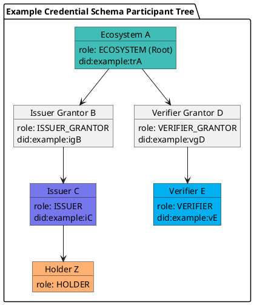
```plantuml

@startuml
scale max 800 width
 
package "Example Credential Schema Participant Tree" as cs {

    object "Ecosystem A" as tr #3fbdb6 {
        role: ECOSYSTEM (Root)
        did:example:trA
    }
    object "Issuer Grantor B" as ig {
        role: ISSUER_GRANTOR
        did:example:igB
    }
    object "Issuer C" as issuer #7677ed  {
        role: ISSUER
        did:example:iC
    }
    object "Verifier Grantor D" as vg {
        role: VERIFIER_GRANTOR
        did:example:vgD
    }
    object "Verifier E" as verifier #00b0f0 {
        role: VERIFIER
        did:example:vE
    }
    object "Holder Z " as holder #FFB073 {
        role: HOLDER
    }
}


tr --> ig 
ig --> issuer

tr --> vg
vg --> verifier

issuer --> holder

@enduml

```

`ECOSYSTEM` Participants are created directly by the [[ref: credential schema]] owner. All other Participants are created by running an [[ref: onboarding process]] — except when onboarding mode is set to `OPEN` for ISSUER and/or VERIFIER Participants, which any account CAN create directly:

- `ISSUER` Participants when `issuer_onboarding_mode` is `OPEN`;
- `VERIFIER` Participants when `verifier_onboarding_mode` is `OPEN`.

An [[ref: onboarding process]] (OP) involves an [[ref: applicant]] (the [[ref: corporation]] of a given Participant entry) and a [[ref: validator]] Participant. It MAY require the applicant to pay `validation_fees` in addition to [[ref: transaction fees]].

An [[ref: onboarding process]] is run by [[ref: applicants]] that want to:

- be an [[ref: issuer]] of a specific [[ref: credential schema]];
- be a [[ref: verifier]] of a specific [[ref: credential schema]];
- be an [[ref: issuer grantor]] of a specific [[ref: credential schema]];
- be a [[ref: verifier grantor]] of a specific [[ref: credential schema]];
- get issued a credential of a specific [[ref: credential schema]];
- obtain a `HOLDER` Participant entry from an [[ref: issuer]] of a specific [[ref: credential schema]] and be issued a verifiable credential of that schema (the `HOLDER` Participant entry carries credential status — revoked, etc.).

In all cases, the process is very similar. Example execution of an [[ref: onboarding process]]:

1. The [[ref: applicant]] starts an [[ref: onboarding process]] by running [[MOD-PP-MSG-1]](#mod-pp-msg-1-start-participant-op). The process MAY be subject to paying `validation_fees`, as defined in the [[ref: validator]]'s Participant entry.
2. The [[ref: applicant]] connects to the [[ref: validator]]'s [[ref: VS]] (identified by its [[ref: DID]]) and executes the validation steps required for the [[ref: onboarding process]] to conclude.
3. If the [[ref: applicant]] qualifies, the [[ref: validator]] runs [[MOD-PP-MSG-3]](#mod-pp-msg-3-set-participant-op-to-validated) to update the Participant entry; the [[ref: applicant]] is then granted the new `Participant` entries and/or issued a credential.

Once in the `VALIDATED` state, a Participant entry remains valid for a specific period (e.g., 365 days), configured in the [[ref: credential schema]] for credential-schema-related onboarding, or set by the [[ref: ecosystem]] for user-agent onboarding.

:::note
Even when the Participant entry remains in the `VALIDATED` state for the configured period, the resulting `Participant` entry or issued credential MAY have a shorter expiration timestamp because the validated attribute(s) might expire earlier. In this case, the [[ref: applicant]] MUST provide updated information to the [[ref: validator]] before attribute expiration in order to be issued an updated `Participant` entry and/or credential.
:::

If the `VALIDATED` state is set to expire, an [[ref: applicant]] that wishes to extend the expiration timestamp MUST renew its [[ref: onboarding process]] (see [[MOD-PP-MSG-2]](#mod-pp-msg-2-renew-participant-op)).

At any time, the [[ref: applicant]] CAN cancel the [[ref: onboarding process]] (see [[MOD-PP-MSG-6]](#mod-pp-msg-6-cancel-participant-op-last-request)).

Some unexpected situations may arise and MUST be mitigated. Examples:

- if the selected [[ref: validator]] Participant entry is revoked while the [[ref: applicant]] is in `PENDING` state: applicant CAN cancel the [[ref: onboarding process]] (see [[MOD-PP-MSG-6]](#mod-pp-msg-6-cancel-participant-op-last-request));
- if the selected [[ref: validator]] Participant entry is revoked while the [[ref: applicant]] is in `VALIDATED` state: applicant CAN renew the [[ref: onboarding process]] by choosing a new validator (see [[MOD-PP-MSG-2]](#mod-pp-msg-2-renew-participant-op)).

#### [MOD-PP-MSG-1] Start Participant OP

Any authorized `operator` CAN execute this method on behalf of a `corporation`.

##### [MOD-PP-MSG-1-1] Start Participant OP parameters

An Applicant that would like to start an onboarding process MUST execute this method by specifying:

- `corporation` (account): (Signer) the `policy_address` of the corporation on whose behalf this message is executed.
- `operator` (account): (Signer) the account authorized by the `corporation` to run this Msg.
- `vs_operator` (account) (*optional*): the account of the Veriable Service we want to authorize to create participant sessions linked to this participant. If not specified, Verifiable Service will not be able to use the payment delegation feature. **Required** to use the payment delegation feature.
- `role` (ParticipantRole) (*mandatory*): (ISSUER_GRANTOR, VERIFIER_GRANTOR, ISSUER, VERIFIER, HOLDER): the Participant role that the applicant would like to get;
- `validator_participant_id` (uint64) (*mandatory*): the [[ref: validator]] participant (parent participant in the tree), chosen by the applicant.
- `validation_fees` (number) (*optional*): Requested validation_fees for this participant (can be modified by validator).
- `issuance_fees` (number) (*optional*): Requested issuance_fees for this `Participant` entry (can be modified by validator).
- `verification_fees` (number) (*optional*): Requested verification_fees for this `Participant` entry (can be modified by validator).
- `did` (string) (*mandatory*): MUST conform to the DID Syntax, as specified [[spec-norm:DID-CORE]].

The following VS Operator Authorization parameters are **optional** and collectively define the initial [ParticipantAuthorizationRecord](#participantauthorizationrecord) that will be created for this `Participant` entry. Presence of `vs_operator_authz_msg_types` is the trigger: if it is not provided, no authorization record is created and the `Participant` entry operates in manual mode (the corporation signs and pays for its own `Participant`-related transactions directly). VSOA configuration is **frozen at creation time** and cannot be modified later; to change it, the `Participant` entry MUST be revoked and re-created.

- `vs_operator_authz_msg_types[]` (msg_type[]) (*optional*): list of VPR delegable message types `vs_operator` is authorized to execute on behalf of `corporation` in the context of this `Participant` entry. If provided, a `ParticipantAuthorizationRecord` is created (see execution below) and `vs_operator` MUST be specified. The permitted list of message types is provided below.
- `vs_operator_authz_spend_limit` (DenomAmount[]) (*optional*): maximum amount of funds `vs_operator` is allowed to spend in the context of this `Participant` entry as a direct consequence of executing authorized messages.
- `vs_operator_authz_with_feegrant` (bool) (*optional*, default: false): if true, `corporation` pays transaction fees for `vs_operator` via an on-chain `FeeGrant` when executing authorized messages in the context of this `Participant` entry.
- `vs_operator_authz_fee_spend_limit` (DenomAmount[]) (*optional*): maximum total amount of transaction fees that can be spent by `vs_operator` (paid by `corporation` via fee grant) in the context of this `Participant` entry.
- `vs_operator_authz_period` (duration) (*optional*): reset period for `vs_operator_authz_spend_limit` and `vs_operator_authz_fee_spend_limit` in the context of this `Participant` entry.

Permitted message types to be set in `vs_operator_authz_msg_types` depends on `role`.

|Participant role|Permitted Messages|
|-|-|
| HOLDER | TriggerResolver |
| ISSUER | CreateOrUpdateParticipantSession, SetParticipantOPtoValidated |
| VERIFIER | CreateOrUpdateParticipantSession |
| ISSUER_GRANTOR | SetParticipantOPtoValidated |
| VERIFIER_GRANTOR | SetParticipantOPtoValidated |
| ECOSYSTEM | SetParticipantOPtoValidated |
 

Available compatible perms can be found by using an indexer and presented in a front-end so applicant can choose its validator.

##### [MOD-PP-MSG-1-2] Start Participant OP precondition checks

If any of these precondition checks fail, [[ref: transaction]] MUST abort.

###### [MOD-PP-MSG-1-2-1] Start Participant OP basic checks

if a mandatory parameter is not present, [[ref: transaction]] MUST abort.

- `corporation` (account): (Signer) signature must be verified.
- `operator` (account): (Signer) signature must be verified.
- [[AUTHZ-CHECK]](#authz-check-common-authorization-and-fee-grant-checks) MUST pass for this (`corporation`, `operator`) pair and this message type.
- `role` (ParticipantRole) (*mandatory*) MUST be a valid ParticipantRole: ISSUER_GRANTOR, VERIFIER_GRANTOR, ISSUER, VERIFIER, HOLDER.
- `validator_participant_id` (uint64) (*mandatory*): see [MOD-PP-MSG-1-2-2](#mod-pp-msg-1-2-2-start-participant-op-permission-checks).
- `validation_fees` (number) (*optional*): Requested validation_fees for this `Participant` entry (can be modified by validator).
- `issuance_fees` (number) (*optional*): Requested issuance_fees for this `Participant` entry (can be modified by validator).
- `verification_fees` (number) (*optional*): Requested verification_fees for this `Participant` entry (can be modified by validator).
- `did` (string) (*mandatory*): MUST conform to the DID Syntax, as specified [[spec-norm:DID-CORE]].
- if any existing `Participant` entry has `did` equal to the provided `did`, its `corporation_id` MUST equal `co.id` (where `co` is the `Corporation` entry resolved from the signing `corporation` account); else method MUST abort (per-Participant `(did, corporation_id)` consistency invariant: at any block height, all `Participant` entries sharing a `did` are owned by the same `Corporation`).
- VS Operator Authorization parameters: if any of `vs_operator_authz_*` parameters is provided, `vs_operator_authz_msg_types` MUST also be provided and `vs_operator` MUST NOT be null, else abort. If `vs_operator_authz_msg_types` is provided, it MUST be a non-empty list of VPR delegable message types, and match the permitted messages defined in [MOD-PP-MSG-1-1](#mod-pp-msg-1-1-start-participant-op-parameters).

:::note
A holder MAY directly connect to the DID VS of an issuer in order to get issued a credential. It's up to the issuer to decide if running the onboarding process is REQUIRED or not.
:::

###### [MOD-PP-MSG-1-2-2] Start Participant OP permission checks

- Load `Participant` entry `validator_participant` from `validator_participant_id`. It MUST be a [[ref: active participant]] else transaction MUST abort.
- Load `CredentialSchema` entry `cs` from `validator_participant.schema_id`. It MUST exist.

- if `role` (ParticipantRole) is equal to ISSUER:

  - if `cs.issuer_onboarding_mode` is equal to GRANTOR_ONBOARDING_PROCESS: `validator_participant.role` MUST be ISSUER_GRANTOR, else MUST abort.
  
  - else if `cs.issuer_onboarding_mode` is equal to ECOSYSTEM_ONBOARDING_PROCESS: `validator_participant.role` MUST be ECOSYSTEM, else MUST abort.

  - else MUST abort.

- else if `role` (ParticipantRole) is equal to ISSUER_GRANTOR:

  - if `cs.issuer_onboarding_mode` is equal to GRANTOR_ONBOARDING_PROCESS:  `validator_participant.role` MUST be ECOSYSTEM, else MUST abort.
  
  - else abort.

- else if `role` (ParticipantRole) is equal to VERIFIER:

  - if `cs.verifier_onboarding_mode` is equal to GRANTOR_ONBOARDING_PROCESS: `validator_participant.role` MUST be VERIFIER_GRANTOR, else MUST abort.
  
  - else if `cs.verifier_onboarding_mode` is equal to ECOSYSTEM_ONBOARDING_PROCESS: `validator_participant.role` MUST be ECOSYSTEM, else MUST abort.

  - else abort.

- else if `role` (ParticipantRole) is equal to VERIFIER_GRANTOR:

  - if `cs.verifier_onboarding_mode` is equal to GRANTOR_ONBOARDING_PROCESS: `validator_participant.role` MUST be ECOSYSTEM, else MUST abort.
  
  - else abort.

- else if `role` (ParticipantRole) is equal to HOLDER:

  - if `cs.holder_onboarding_mode` is equal to ISSUER_ONBOARDING_PROCESS: `validator_participant.role` MUST be ISSUER, else MUST abort.
  
  - else abort.

At the end, if a [[ref: active participant]] `validator_participant` is not found, [[ref: transaction]] MUST abort.

###### [MOD-PP-MSG-1-2-3] Start Participant OP fee checks

- Load `Participant` entry `validator_participant` from `validator_participant_id`.
- Load `CredentialSchema` entry `cs` from `validator_participant.schema_id`.

- Fee payer MUST have an available balance in its [[ref: account]], to cover the [[ref: estimated transaction fees]];

> If a conversion is needed below, use [Get Price](#mod-xr-qry-3-get-price) to convert amounts to [[ref: native denom]]:

- For trust fees:

if `(cs.pricing_asset_type, cs.pricing_asset)` is set to `(COIN, [[ref: native denom]])`:

- `corporation` MUST have an available balance in its [[ref: account]], to cover the following trust fees.
  - the required `validation_fees_in_denom` = `validator_participant.validation_fees` in [[ref: native denom]].
  - the required `validation_trust_deposit_in_native_denom`: `validation_fees_in_denom` * `GlobalVariables.trust_deposit_rate` in [[ref: native denom]].

else if `(cs.pricing_asset_type, cs.pricing_asset)` is set to an arbitrary coin `(COIN, [[ref: denom]])`:

- `corporation` MUST have an available balance in its [[ref: account]], to cover the following trust fees.
  - the required `validation_fees_in_denom` = `validator_participant.validation_fees` in specified (cs.pricing_asset_type, cs.pricing_asset)
  - the required `validation_trust_deposit_in_native_denom`: getPrice(`cs.pricing_asset_type`, `cs.pricing_asset`, `COIN`, `[[ref: native denom]]`, `validation_fees_in_denom`) * `GlobalVariables.trust_deposit_rate` * 2 in [[ref: native denom]] (the applicant's surcharge **plus** the validator's deposit-bound portion, funded by the applicant since the validator receives a non-native asset that cannot be deposit-bound).

else if `(cs.pricing_asset_type, cs.pricing_asset)` is set to a fiat currency `(FIAT, <fiat_currency>)`:

- `corporation` MUST have an available balance in its [[ref: account]], to cover the following trust fees.
  - the required `validation_fees_in_denom` = 0 in [[ref: native denom]] (fiat-priced fees are settled off-chain).
  - the required `validation_trust_deposit_in_native_denom`: getPrice(`cs.pricing_asset_type`, `cs.pricing_asset`, `COIN`, `[[ref: native denom]]`, `validator_participant.validation_fees`) * `GlobalVariables.trust_deposit_rate` * 2 in [[ref: native denom]] (the applicant's surcharge **plus** the validator's deposit-bound portion, funded by the applicant since the fee itself is settled off-chain).

:::note
Deposit-bound amounts MUST always be paid in [[ref: native denom]]. While the onboarding process is PENDING, both the validation fees and the deposit-bound amount are **held in the escrow account**: no [[ref: trust units]] are minted and nothing is routed to the [[ref: distribution pool]] until validation (see [[MOD-PP-MSG-3]](#mod-pp-msg-3-set-participant-op-to-validated)); on cancellation the escrow is refunded as-is (see [[MOD-PP-MSG-6]](#mod-pp-msg-6-cancel-participant-op-last-request)).
:::

###### [MOD-PP-MSG-1-2-4] Start Participant OP overlap checks

We want to make sure that 2 onboarding processes cannot be active at the same time in the same context. This does not prevent a `corporation` from running different OP with differents validators for the same `schema_id`, `role`.

Find all `Participant` entries `participants[]` for `schema_id`, `role`, `validator_participant_id`, `corporation` with op_state = VALIDATED or PENDING.

if size of `participants[]` > 0, it means there is already an existing onboarding process in this context, so MUST abort.

> note: this check was not present in v3.

##### [MOD-PP-MSG-1-3] Start Participant OP execution

If all precondition checks passed, [[ref: transaction]] is executed.

Method execution MUST perform the following tasks in a [[ref: transaction]], and rollback if any error occurs.

- Load `Participant` entry `validator_participant` of the selected validator.

- calculate `validation_fees_in_denom` and `validation_trust_deposit_in_native_denom` as explained above in fee checks.
- send `validation_fees_in_denom` + `validation_trust_deposit_in_native_denom` to the validation escrow [[ref: account]], if greater than 0. No [[ref: trust units]] are minted at this stage (mint-at-validation, see [[MOD-PP-MSG-3]](#mod-pp-msg-3-set-participant-op-to-validated)).

- define `now`: current timestamp.

- create an persist a new `Participant` entry `applicant_participant`:

  - `applicant_participant.id`: auto-incremented uint64.
  - `applicant_participant.schema_id` = `validator_participant.schema_id`
  - `applicant_participant.corporation_id`: `co.id`.
  - `applicant_participant.vs_operator`: `vs_operator`.
  - `applicant_participant.role`: `role`.
  - `applicant_participant.created`: `now`
  - `applicant_participant.modified`: `now`
  - `applicant_participant.tu`: 0.
  - `applicant_participant.validation_fees`: `validation_fees`.
  - `applicant_participant.issuance_fees`: `issuance_fees`.
  - `applicant_participant.verification_fees`: `verification_fees`.
  - `applicant_participant.validator_participant_id`: `validator_participant_id`.
  - `applicant_participant.op_last_state_change`: `now`
  - `applicant_participant.op_state`: PENDING.
  - `applicant_participant.op_current_fees` (number): `validation_fees_in_denom`.
  - `applicant_participant.op_current_deposit` (number): `validation_trust_deposit_in_native_denom` (held in escrow).
  - `applicant_participant.op_summary_digest`: null.
  - `applicant_participant.op_validator_tu`: 0.

If `vs_operator_authz_msg_types` is provided, create the [ParticipantAuthorizationRecord](#participantauthorizationrecord) in **disabled** state (`expiration = now`) by calling [[MOD-DE-MSG-5]](#mod-de-msg-5-grant-vs-operator-authorization) Grant VS Operator Authorization with:

- `corporation`: `corporation`
- `vs_operator`: `vs_operator`
- `record`:
  - `record.participant_id`: `applicant_participant.id`
  - `record.msg_types`: `vs_operator_authz_msg_types`
  - `record.spend_limit`: `vs_operator_authz_spend_limit`
  - `record.fee_spend_limit`: `vs_operator_authz_fee_spend_limit`
  - `record.with_feegrant`: `vs_operator_authz_with_feegrant` (default: false)
  - `record.expiration`: `now`
  - `record.period`: `vs_operator_authz_period`

> Note: the record is created with `expiration = now` so authorization is **not yet active**. [[AUTHZ-CHECK-3]](#authz-check-3-vs-operator-authorization-checks) will reject any attempt to use it until [[MOD-PP-MSG-3]](#mod-pp-msg-3-set-participant-op-to-validated) updates `expiration` to `applicant_participant.effective_until`. No on-chain `FeeGrant` object is created at this stage even if `with_feegrant` is true (the recompute subroutine in [[MOD-DE-MSG-5-5]](#mod-de-msg-5-5-recompute-vs-operator-fee-allowance) requires `expiration > now`).

#### Connecting to the VS of the Validator

*This section is non-normative, and provided for understanding only.*

This action must be initiated by the [[ref: applicant]].

During an onboarding process, if the associated `validator_participant` includes a specific `did`, the [[ref: applicant]] should establish a secure connection with the validator's [[ref: VS]] (Verifiable Service) using a secure communication protocol such as [[ref: DIDComm]].

Upon connecting to the [[ref: VS]], the [[ref: applicant]] should be required by the [[ref: validator]] to complete one or more of the following tasks:

1. **Prove control** over the `vs_operator` [[ref: account]] specified in the `Participant` entry (e.g., via blind signature or cryptographic challenge).
2. **Provide requested information**, such as filling out forms, submitting documents, or other forms of disclosure as required by the validation [[ref: VS]].
3. If the requested `Participant` entry includes a [[ref: VS]] DID, the [[ref: applicant]] should prove control over the corresponding [[ref: DID]] to the validator's [[ref: VS]].

Once the [[ref: validator]] determines that the process is complete, they may terminate the onboarding process and create the `Participant` entry accordingly. This `Participant`-entry configuration usually includes:

- `validation_fees`  
- `issuance_fees`  
- `verification_fees`  
- `Participant` expiration

The [[ref: validator]] may compile a summary file of the onboarding process, documenting exchanged data, proofs, and decisions, and share it with the [[ref: applicant]] via the [[ref: VS]] connection or another secure channel.

For audit or governance purposes, the [[ref: validator]] should register a digest (e.g., hash or SRI) of this summary in `applicant_participant.op_summary_digest`.

#### [MOD-PP-MSG-2] Renew Participant OP

Any authorized `operator` CAN execute this method on behalf of a `corporation`.

*This section is non-normative.*

- Requesting a renewal has no effect on `Participant` expiration or issued credentials.
- Renewal is only possible with the same validator.
- If validator `Participant` is not valid anymore, applicant MUST perform a new onboarding process with another validator.
- Renewal does not allow changing the `participant.validation_fees`, `participant.issuance_fees`, `participant.verification_fees`. To change these values, applicant MUST start a new onboarding process.
- if `applicant_participant` is revoked, slashed, or repaid, method MUST fail.

##### [MOD-PP-MSG-2-1] Renew Participant OP parameters

- `corporation` (account): (Signer) the `policy_address` of the corporation on whose behalf this message is executed.
- `operator` (account): (Signer) the account authorized by the `corporation` to run this Msg.
- `id` (uint64) (*mandatory*): id of the `Participant` entry for which applicant would like to renew the onboarding process;

##### [MOD-PP-MSG-2-2] Renew Participant OP precondition checks

If any of these precondition checks fail, [[ref: transaction]] MUST abort.

###### [MOD-PP-MSG-2-2-1] Renew Participant OP basic checks

if a mandatory parameter is not present, [[ref: transaction]] MUST abort.

- `corporation` (account): (Signer) signature must be verified.
- `operator` (account): (Signer) signature must be verified.
- [[AUTHZ-CHECK]](#authz-check-common-authorization-and-fee-grant-checks) MUST pass for this (`corporation`, `operator`) pair and this message type.
- `id` MUST be a valid uint64 and a `Participant` entry with the same id MUST exist.

###### [MOD-PP-MSG-2-2-2] Renew Participant OP permission checks

- Load `Participant` entry `applicant_participant`. `co.id` MUST equal `applicant_participant.corporation_id` (where `co` is the `Corporation` entry resolved from the signing `corporation` account), else MUST abort. `applicant_participant` MUST be a [[ref: active participant]].
- Load `Participant` entry `validator_participant` from `applicant_participant.validator_participant_id`. It MUST exist, and be a [[ref: active participant]], else MUST abort.

###### [MOD-PP-MSG-2-2-3] Renew Participant OP fee checks

- Load `Participant` entry `validator_participant` from `applicant_participant.validator_participant_id`.
- Load `CredentialSchema` entry `cs` from `validator_participant.schema_id`.

- Fee payer MUST have an available balance in its [[ref: account]], to cover the [[ref: estimated transaction fees]];

> If a conversion is needed below, use [Get Price](#mod-xr-qry-3-get-price) to convert amounts to [[ref: native denom]]:

- For trust fees:

if `(cs.pricing_asset_type, cs.pricing_asset)` is set to `(COIN, [[ref: native denom]])`:

- `corporation` MUST have an available balance in its [[ref: account]], to cover the following trust fees.
  - the required `validation_fees_in_denom` = `validator_participant.validation_fees` in [[ref: native denom]].
  - the required `validation_trust_deposit_in_native_denom`: `validation_fees_in_denom` * `GlobalVariables.trust_deposit_rate` in [[ref: native denom]].

else if `(cs.pricing_asset_type, cs.pricing_asset)` is set to an arbitrary coin `(COIN, [[ref: denom]])`:

- `corporation` MUST have an available balance in its [[ref: account]], to cover the following trust fees.
  - the required `validation_fees_in_denom` = `validator_participant.validation_fees` in specified (cs.pricing_asset_type, cs.pricing_asset)
  - the required `validation_trust_deposit_in_native_denom`: getPrice(`cs.pricing_asset_type`, `cs.pricing_asset`, `COIN`, `[[ref: native denom]]`, `validation_fees_in_denom`) * `GlobalVariables.trust_deposit_rate` * 2 in [[ref: native denom]] (the applicant's surcharge **plus** the validator's deposit-bound portion, funded by the applicant since the validator receives a non-native asset that cannot be deposit-bound).

else if `(cs.pricing_asset_type, cs.pricing_asset)` is set to a fiat currency `(FIAT, <fiat_currency>)`:

- `corporation` MUST have an available balance in its [[ref: account]], to cover the following trust fees.
  - the required `validation_fees_in_denom` = 0 in [[ref: native denom]] (fiat-priced fees are settled off-chain).
  - the required `validation_trust_deposit_in_native_denom`: getPrice(`cs.pricing_asset_type`, `cs.pricing_asset`, `COIN`, `[[ref: native denom]]`, `validator_participant.validation_fees`) * `GlobalVariables.trust_deposit_rate` * 2 in [[ref: native denom]] (the applicant's surcharge **plus** the validator's deposit-bound portion, funded by the applicant since the fee itself is settled off-chain).

:::note
Deposit-bound amounts MUST always be paid in [[ref: native denom]]. While the renewal onboarding process is PENDING, both the validation fees and the deposit-bound amount are **held in the escrow account**: no [[ref: trust units]] are minted and nothing is routed to the [[ref: distribution pool]] until validation; on cancellation the escrow is refunded as-is.
:::

###### [MOD-PP-MSG-2-3] Renew Participant OP execution

If all precondition checks passed, [[ref: transaction]] is executed.

Method execution MUST perform the following tasks in a [[ref: transaction]], and rollback if any error occurs.

- Load `Participant` entry `applicant_participant`. 
- Load `Participant` entry `validator_participant` from `applicant_participant.validator_participant_id`.

- calculate `validation_fees_in_denom` and `validation_trust_deposit_in_native_denom` as explained above in fee checks.
- send `validation_fees_in_denom` + `validation_trust_deposit_in_native_denom` to the validation escrow [[ref: account]], if greater than 0. No [[ref: trust units]] are minted at this stage (mint-at-validation, see [[MOD-PP-MSG-3]](#mod-pp-msg-3-set-participant-op-to-validated)).

- define `now`: current timestamp.

- update `Participant` entry:

  - `applicant_participant.op_state`: PENDING.
  - `applicant_participant.op_last_state_change`: current timestamp.
  - `applicant_participant.op_current_fees` (number): `validation_fees_in_denom`.
  - `applicant_participant.op_current_deposit` (number): `validation_trust_deposit_in_native_denom` (held in escrow; `applicant_participant.tu` is only incremented at validation time).
  - `applicant_participant.modified`: `now`

#### [MOD-PP-MSG-3] Set Participant OP to Validated

Any authorized `operator` CAN execute this method on behalf of a `corporation`.

##### [MOD-PP-MSG-3-1] Set Participant OP to Validated parameters

An [[ref: account]] that would like to set a validation entry to VALIDATED MUST execute this method by specifying:

- `corporation` (account): (Signer) the `policy_address` of the corporation on whose behalf this message is executed.
- `operator` (account): (Signer) the account authorized by the `corporation` to run this Msg.
- `id` (uint64) (*mandatory*): id of the onboarding process;
- `effective_until` (timestamp) (*optional*): timestamp until when (exclusive) this `Participant` is effective, null if no time limit should been set for this `Participant` entry or if we want it to be aligned with the onboarding process expiration timestamp calculated by this method.
- `validation_fees` (number) (*mandatory*): Agreed validation_fees for this `Participant` entry. Can be set only the first time this method is called (cannot be set for renewals). Use 0 for no fees.
- `issuance_fees` (number) (*mandatory*): Agreed issuance_fees for this `Participant` entry. Can be set only the first time this method is called (cannot be set for renewals). Use 0 for no fees.
- `verification_fees` (number) (*mandatory*): Agreed verification_fees for this `Participant` entry. Can be set only the first time this method is called (cannot be set for renewals). Use 0 for no fees.
- `op_summary_digest` (string) (*optional*): an optional digest, set by [[ref: validator]], of a summary of the information, proofs... provided by the [[ref: applicant]].
- `issuance_fee_discount`: (number) (*mandatory*): use 0 for no discount. Maximum 1 (100% discount). Can be set to an ISSUER_GRANTOR or ISSUER `Participant` entry (if GRANTOR_ONBOARDING_PROCESS mode) or to an ISSUER `Participant` entry (ECOSYSTEM_ONBOARDING_PROCESS mode) to reduce (or void) calculated issuance fees for the subtree of `Participant` entries. Note: this should generally not be used because it reduces or void commission of all related ecosystem participants.
- `verification_fee_discount`: (number) (*mandatory*): use 0 for no discount. Maximum 1 (100% discount). Can be set to a VERIFIER_GRANTOR or VERIFIER `Participant` entry (if GRANTOR_ONBOARDING_PROCESS mode) and/or to a VERIFIER `Participant` entry (ECOSYSTEM_ONBOARDING_PROCESS mode) to reduce (or void) calculated fees for the subtree of `Participant` entries. Note: this should generally not be used because it reduces or void commission of all related ecosystem participants.

##### [MOD-PP-MSG-3-2] Set Participant OP to Validated precondition checks

If any of these precondition checks fail, [[ref: transaction]] MUST abort.

###### [MOD-PP-MSG-3-2-1] Set Participant OP to Validated basic checks

if a mandatory parameter is not present, [[ref: transaction]] MUST abort.

- `corporation` (account): (Signer) signature must be verified.
- `operator` (account): (Signer) signature must be verified.
- `id` MUST be a valid uint64.
- Load `Participant` entry `applicant_participant` from `id`. If no entry found, abort.
- Load `Participant` entry `validator_participant` from `applicant_participant_validator_participant_id`.
- Authorization:

either (executed by any operator of corporation):
[[AUTHZ-CHECK-1]](#authz-check-1-operator-authorization-checks) MUST pass for this (`corporation`, `operator`) tuple and `SetParticipantOPtoValidated` message.
[[AUTHZ-CHECK-2]](#authz-check-2-fee-grant-checks) MUST pass for this (`corporation`, `operator`) tuple and `SetParticipantOPtoValidated` message.
OR (executed by vs-agent account defined in validator `Participant`):
[[AUTHZ-CHECK-3]](#authz-check-3-vs-operator-authorization-checks) MUST pass for this (`corporation`, `operator`, `validator_participant`) tuple.
[[AUTHZ-CHECK-4]](#authz-check-4-vs-operator-fee-grant-checks) MUST pass for this (`corporation`, `operator`, `validator_participant`) tuple.
else MUST abort.

- `applicant_participant.op_state` MUST be equal to PENDING, else abort.
- `validation_fees` (number) (*mandatory*): MUST be zero or a positive integer. If `applicant_participant.effective_from` is not null (we are in renewal) `validation_fees` MUST be equal to `applicant_participant.validation_fees`, else abort.
- `issuance_fees` (number) (*mandatory*): MUST be zero or a positive integer.  If `applicant_participant.effective_from` is not null (we are in renewal) `issuance_fees` MUST be equal to `applicant_participant.issuance_fees` or, else abort.
- `verification_fees` (number) (*mandatory*): MUST be zero or a positive integer.  If `applicant_participant.effective_from` is not null (we are in renewal) `verification_fees` MUST be equal to `applicant_participant.verification_fees`, else abort.
- `op_summary_digest` (string) (*optional*): MUST be a valid digest. Example: `sha384-MzNNbQTWCSUSi0bbz7dbua+RcENv7C6FvlmYJ1Y+I727HsPOHdzwELMYO9Mz68M26`.

- Load `CredentialSchema` `cs` from `applicant_participant.schema_id`.
- Load `Participant` `validator_participant` from `applicant_participant.validator_participant_id`.

- `issuance_fee_discount` : (number) (*mandatory*):
  - if `applicant_participant.effective_from` is not null (renewal), then `issuance_fee_discount` must be equal to `applicant_participant.issuance_fee_discount` else MUST abort.
  - if `cs.issuer_onboarding_mode` is set to GRANTOR_ONBOARDING_PROCESS:
    - if `applicant_participant.role` == ISSUER_GRANTOR: `issuance_fee_discount` can be set between 0 (no discount) and 1 (100% discount) inclusive.
    - if `applicant_participant.role` == ISSUER: if `validator_participant.issuance_fee_discount` is defined,  `issuance_fee_discount` can be set between 0 (no discount) and `validator_participant.issuance_fee_discount` (100% discount) inclusive.
  - if `cs.issuer_onboarding_mode` is set to ECOSYSTEM_ONBOARDING_PROCESS:
    - if `applicant_participant.role` == ISSUER: `issuance_fee_discount` can be set between 0 (no discount) and 1 (100% discount) inclusive.
  - else MUST abort.

- `verification_fee_discount` : (number) (*mandatory*):
  - if `applicant_participant.effective_from` is not null (renewal), then `verification_fee_discount` must be equal to `applicant_participant.verification_fee_discount` else MUST abort.
  - if `cs.verifier_onboarding_mode` is set to GRANTOR_ONBOARDING_PROCESS:
    - if `applicant_participant.role` == VERIFIER_GRANTOR: `verification_fee_discount` can be set between 0 (no discount) and 1 (100% discount) inclusive.
    - if `applicant_participant.role` == VERIFIER: if `validator_participant.verification_fee_discount` is defined,  `verification_fee_discount` can be set between 0 (no discount) and `validator_participant.verification_fee_discount` (100% discount) inclusive.
  - if `cs.verifier_onboarding_mode` is set to ECOSYSTEM_ONBOARDING_PROCESS:
    - if `applicant_participant.role` == VERIFIER: `verification_fee_discount` can be set between 0 (no discount) and 1 (100% discount) inclusive.
  - else MUST abort.

Calculation of `op_exp`, the onboarding process expiration timestamp, required to verify provided `effective_until`:

- let's define `validity_period` = `cs.issuer_grantor_validation_validity_period` (if `applicant_participant.role` is ISSUER_GRANTOR), `cs.verifier_grantor_validation_validity_period` (if `applicant_participant.role` is VERIFIER_GRANTOR), `cs.issuer_validation_validity_period` (if `applicant_participant.role` is ISSUER), `cs.verifier_validation_validity_period` (if `applicant_participant.role` is VERIFIER), or `cs.holder_validation_validity_period` (if `applicant_participant.role` is HOLDER).

- if `validity_period` is NULL:  `op_exp` = NULL.
- else if `applicant_participant.op_exp` is null, `op_exp` =  timestamp of now() plus `validity_period`.
- else `op_exp` =  `applicant_participant.op_exp` plus `validity_period`

Now, let's verify `effective_until`:

- if `effective_until` is NULL, no issue.
- else if `applicant_participant.effective_until` is NULL, `effective_until` MUST be greater than current current timestamp AND, if `op_exp` is not null, lower or equal to `op_exp`.
- else `effective_until` MUST be greater than `applicant_participant.effective_until` AND, if `op_exp` is not null, lower or equal to `op_exp`.

###### [MOD-PP-MSG-3-2-2] Set Participant OP to Validated validator perms

- load `validator_participant` from `applicant_participant.validator_participant_id`. `validator_participant` MUST be a [[ref: active participant]].
- `co.id` MUST equal `validator_participant.corporation_id` (where `co` is the `Corporation` entry resolved from the signing `corporation` account).

If `validator_participant` is not a [[ref: active participant]] (expired, revoked, slashed...) then applicant MUST start a new onboarding process.

###### [MOD-PP-MSG-3-2-3] Set Participant OP to Validated fee checks

- Fee payer MUST have the required [[ref: estimated transaction fees]] in its [[ref: account]], else [[ref: transaction]] MUST abort.
- if `applicant_participant.op_current_fees` is not in [[ref: native denom]], `corporation` account MUST have `applicant_participant.op_current_deposit` available in [[ref: native denom]] on its account for paying the trust deposit.

###### [MOD-PP-MSG-3-2-4] Set Participant OP to Validated overlap checks

We want to make sure that 2 `Participant` entries cannot be active at the same time for the same `validator_participant_id`. That should not occur in this method, but better do the check anyway.

Find all [[ref: active participants]] `participants[]` (not revoked, not slashed, not repaid) for `schema_id`, `role`, `validator_participant_id`, `corporation`.

for each `Participant` entry `p` from `participants[]`:

- if `p.effective_until` is greater than `effective_from`, method execution MUST abort.
- if `p.effective_from` is lower than `effective_until`, method execution MUST abort.
- if `p.effective_until` is NULL (never expire), creation of a new `Participant` entry doesn't make any sense and method execution MUST abort.

> note: this check was not present in v3.

##### [MOD-PP-MSG-3-3] Set Participant OP to Validated execution

If all precondition checks passed, [[ref: transaction]] is executed.

Method execution MUST perform the following tasks in a [[ref: transaction]], and rollback if any error occurs.

- Load `Participant` entry `applicant_participant` from `id`.
- Load `Participant` entry `validator_participant` from `applicant_participant.validator_participant_id`.
- define `now` timestamp of now().

Calculate `op_exp`:

- Load `CredentialSchema` `cs` from `applicant_participant.schema_id`.
- let's define `validity_period` = `cs.issuer_grantor_validation_validity_period` (if `applicant_participant.role` is ISSUER_GRANTOR), `cs.verifier_grantor_validation_validity_period` (if `applicant_participant.role` is VERIFIER_GRANTOR), `cs.issuer_validation_validity_period` (if `applicant_participant.role` is ISSUER), `cs.verifier_validation_validity_period` (if `applicant_participant.role` is VERIFIER), or `cs.holder_validation_validity_period` (if `applicant_participant.role` is HOLDER).

- if `validity_period` is NULL:  `op_exp` = NULL.
- else if `applicant_participant.op_exp` is null, `op_exp` =  timestamp of now() plus `validity_period`.
- else `op_exp` =  `applicant_participant.op_exp` plus `validity_period`.

Change value of provided `effective_until` if needed, and abort if needed:

- if provided  `effective_until` is NULL:
  - change value of provided `effective_until` to `op_exp`.

- else if `applicant_participant.effective_until` is NULL:
  - verify that provided `effective_until` is greater than `now` else MUST abort
  - if `op_exp` is not null, verify that provided `effective_until` is lower or equal to `op_exp` else MUST abort

- else:
  - `effective_until` MUST be greater than `applicant_participant.effective_until` else MUST abort
  - if `op_exp` is not null, verify that provided `effective_until` is lower or equal to `op_exp` else MUST abort.

Fees and Trust Deposits — settle the escrow (mint-at-validation):

- define `ecosystem_id`: the id of the [[ref: ecosystem]] that owns `cs`.
- if `(cs.pricing_asset_type, cs.pricing_asset)` is `(COIN, [[ref: native denom]])`:
  - calculate `validator_deposit_bound` = `applicant_participant.op_current_fees` × `GlobalVariables.trust_deposit_rate`, and `applicant_deposit_bound` = `applicant_participant.op_current_deposit`;
  - transfer `applicant_participant.op_current_fees` − `validator_deposit_bound` from the escrow [[ref: account]] to the validator corporation account `Corporation[validator_participant.corporation_id].policy_address`.
- else (pricing in an arbitrary COIN or in FIAT):
  - calculate `validator_deposit_bound` = `applicant_participant.op_current_deposit` / 2 and `applicant_deposit_bound` = `applicant_participant.op_current_deposit` / 2 (the applicant escrowed both, see fee checks);
  - transfer the full amount `applicant_participant.op_current_fees` in the pricing [[ref: denom]] (0 if FIAT) from the escrow [[ref: account]] to the validator corporation account `Corporation[validator_participant.corporation_id].policy_address`.
- use [[MOD-TD-MSG-1]](#mod-td-msg-1-mint-trust-units) Mint Trust Units with (`corporation_id` = `validator_participant.corporation_id`, `ecosystem_id`, `source_account` = escrow account, `amount` = `validator_deposit_bound`); set `applicant_participant.op_validator_tu` to `applicant_participant.op_validator_tu` + the returned `minted_tu`.
- use [[MOD-TD-MSG-1]](#mod-td-msg-1-mint-trust-units) Mint Trust Units with (`corporation_id` = `applicant_participant.corporation_id`, `ecosystem_id`, `source_account` = escrow account, `amount` = `applicant_deposit_bound`); set `applicant_participant.tu` to `applicant_participant.tu` + the returned `minted_tu`.

Update `Participant` `applicant_participant`:

- set `applicant_participant.modified` to `now`.
- set `applicant_participant.op_state` to VALIDATED.
- set `applicant_participant.op_last_state_change` to `now`.
- set `applicant_participant.op_current_fees` to 0;
- set `applicant_participant.op_current_deposit` to 0;
- set `applicant_participant.op_summary_digest` to `op_summary_digest`.
- set `applicant_participant.op_exp` to `op_exp`.
- set `applicant_participant.effective_until` to `effective_until`.
- if `applicant_participant.effective_from` IS NULL (first time method is called for this perm, and thus we are not in a renewal):
  - set `applicant_participant.validation_fees` to `validation_fees`;
  - set `applicant_participant.issuance_fees` to `issuance_fees`;
  - set `applicant_participant.verification_fees` to `verification_fees`;
  - set `applicant_participant.effective_from` to `now`.
  - set `applicant_participant.issuance_fee_discount` to `issuance_fee_discount`.
  - set `applicant_participant.verification_fee_discount` to `verification_fee_discount`.

Activate VS Operator Authorization, if any. Call [[MOD-DE-MSG-9]](#mod-de-msg-9-update-vs-operator-authorization-expiration) Update VS Operator Authorization Expiration with:

- `participant_id`: `applicant_participant.id`
- `new_expiration`: `applicant_participant.effective_until`

This call is a no-op if no record was created at [[MOD-PP-MSG-1]](#mod-pp-msg-1-start-participant-op) (i.e., the applicant did not declare `vs_operator_authz_msg_types`). If a record exists, its `expiration` is updated from `now` (disabled) to `applicant_participant.effective_until`, and the on-chain `FeeGrant` for the containing VSOA is granted for the first time (or refreshed) via [[MOD-DE-MSG-5-5]](#mod-de-msg-5-5-recompute-vs-operator-fee-allowance).

#### [MOD-PP-MSG-4] Void

#### [MOD-PP-MSG-5] Void

#### [MOD-PP-MSG-6] Cancel Participant OP Last Request

Any authorized `operator` CAN execute this method on behalf of a `corporation`.

At any time, [[ref: applicant]] of an onboarding process may request cancellation of the process, provided state is PENDING. Upon method execution, the pending validation is cancelled and escrewed [[ref: trust fees]] are refunded. If `op_exp` is not null, `op_state` is set back to VALIDATED, else `op_state` is set to TERMINATED.

##### [MOD-PP-MSG-6-1] Cancel Participant OP Last Request parameters

- `corporation` (account): (Signer) the `policy_address` of the corporation on whose behalf this message is executed.
- `operator` (account): (Signer) the account authorized by the `corporation` to run this Msg.
- `id` (uint64) (*mandatory*): id of the `Participant` entry;

##### [MOD-PP-MSG-6-2] Cancel Participant OP Last Request precondition checks

If any of these precondition checks fail, [[ref: transaction]] MUST abort.

###### [MOD-PP-MSG-6-2-1] Cancel Participant OP Last Request basic checks

if a mandatory parameter is not present, [[ref: transaction]] MUST abort.

- `corporation` (account): (Signer) signature must be verified.
- `operator` (account): (Signer) signature must be verified.
- [[AUTHZ-CHECK]](#authz-check-common-authorization-and-fee-grant-checks) MUST pass for this (`corporation`, `operator`) pair and this message type.
- `id` MUST be a valid uint64.
- Load `Participant` entry `applicant_participant` with this id. It MUST exist.
- `co.id` MUST equal `applicant_participant.corporation_id` (where `co` is the `Corporation` entry resolved from the signing `corporation` account).
- `applicant_participant.op_state` MUST be PENDING.
- if `applicant_participant.deposit` has been slashed and not repaid, MUST abort

###### [MOD-PP-MSG-6-2-2] Cancel Participant OP Last Request fee checks

Fee payer MUST have the required [[ref: estimated transaction fees]] in its [[ref: account]], else [[ref: transaction]] MUST abort.

##### [MOD-PP-MSG-6-3] Cancel Participant OP Last Request execution

If all precondition checks passed, [[ref: transaction]] is executed.

Method execution MUST perform the following tasks in a [[ref: transaction]], and rollback if any error occurs.

- Load `Participant` entry `applicant_participant` with `id`. It MUST exist.
- define `now`: current timestamp.

- set `applicant_participant.modified` to `now`.
- if `applicant_participant.op_exp` is null (validation never completed), set `applicant_participant.op_state` to TERMINATED, else set `applicant_participant.op_state` to VALIDATED.
- set `applicant_participant.op_last_state_change` to `now`.
- if `applicant_participant.op_current_fees` > 0:
  - transfer `applicant_participant.op_current_fees` in proper [[ref: denom]] back from escrow [[ref: account]] to [[ref: applicant]] [[ref: account]], `applicant_participant.corporation_id`.
  - set `applicant_participant.op_current_fees` to 0;

- if `applicant_participant.op_current_deposit` > 0:
  - transfer `applicant_participant.op_current_deposit` in [[ref: native denom]] back from the escrow [[ref: account]] to the [[ref: applicant]] corporation account. No trust deposit adjustment is needed: nothing was minted while PENDING (mint-at-validation).
  - set `applicant_participant.op_current_deposit` to 0.

If `applicant_participant.op_state` was set to TERMINATED (i.e. `applicant_participant.op_exp` was null so validation never completed), call [[MOD-DE-MSG-6]](#mod-de-msg-6-revoke-vs-operator-authorization) Revoke VS Operator Authorization with `participant_id = applicant_participant.id` to remove any disabled authorization record created at [[MOD-PP-MSG-1]](#mod-pp-msg-1-start-participant-op). The call is a no-op if no record exists. If `applicant_participant.op_state` was set back to VALIDATED, no VSOA changes are needed (the existing record's `expiration` remains at the value set by the previous successful validation).

#### [MOD-PP-MSG-7] Create Root Participant

Any authorized `operator` CAN execute this method on behalf of a `corporation`.

This method is used by controller authorities of Ecosystems. When they create a Credential Schema, they need to create (a) `Participant` entry(ies) of role ECOSYSTEM so that other participants can run onboarding processes (if schema mode is ECOSYSTEM) or self create their `Participant` entries (schema mode set to OPEN).

##### [MOD-PP-MSG-7-1] Create Root Participant parameters

An [[ref: account]] that would like to create a `Participant` entry MUST call this method by specifying:

- `corporation` (account): (Signer) the `policy_address` of the corporation on whose behalf this message is executed.
- `operator` (account): (Signer) the account authorized by the `corporation` to run this Msg.
- `schema_id` (uint64) (*mandatory*)
- `vs_operator` (account) (*optional*): the account we want to authorize to act on behalf of `corporation` in the context of this `Participant` entry. **Required** for payment delegation.
- `did` (string) (*mandatory*): [[ref: DID]] of the VS.
- `effective_from` (timestamp) (*mandatory*): timestamp from when (exclusive) this Perm is effective. MUST be in the future.
- `effective_until` (timestamp) (*optional*): timestamp until when (exclusive) this Perm is effective, null if it doesn't expire. If not null, MUST be greater than `effective_from`.
- `validation_fees` (number) (*mandatory*): price to pay by applicant to validator for running an onboarding process that uses this perm as validator, for a given validation period, in the denom specified in the credential schema. Default to 0. Note that setting validation fees for OPEN schemas has no effect and does not mean an onboarding process must take place. For enabling onboarding processes, at least one of the two issuer, verifier mode must be different than OPEN.
- `issuance_fees` (number) (*mandatory*): price to pay by the issuer of a credential of this schema to the grantee of this perm when a credential is issued, in the denom specified in the credential schema. Default to 0.
- `verification_fees` (number) (*mandatory*): price to pay by the verifier of a credential of this schema to the grantee of this perm when a credential is verified, in the denom specified in the credential schema. Default to 0.

The following VS Operator Authorization parameters are **optional** and collectively define the initial [ParticipantAuthorizationRecord](#participantauthorizationrecord) for this `Participant` entry. Presence of `vs_operator_authz_msg_types` is the trigger: if it is not provided, no authorization record is created and the `Participant` entry operates in manual mode. VSOA configuration is **frozen at creation time** and cannot be modified later; to change it, the `Participant` entry MUST be revoked and re-created.

- `vs_operator_authz_msg_types[]` (msg_type[]) (*optional*): list of VPR delegable message types `vs_operator` is authorized to execute on behalf of `corporation` in the context of this `Participant` entry. If provided, a `ParticipantAuthorizationRecord` is created (see execution below) and `vs_operator` MUST be specified. The permitted list of message types is provided below.
- `vs_operator_authz_spend_limit` (DenomAmount[]) (*optional*): maximum amount of funds `vs_operator` is allowed to spend in the context of this `Participant` entry as a direct consequence of executing authorized messages.
- `vs_operator_authz_with_feegrant` (bool) (*optional*, default: false): if true, `corporation` pays transaction fees for `vs_operator` via an on-chain `FeeGrant` when executing authorized messages in the context of this `Participant` entry.
- `vs_operator_authz_fee_spend_limit` (DenomAmount[]) (*optional*): maximum total amount of transaction fees that can be spent by `vs_operator` (paid by `corporation` via fee grant) in the context of this `Participant` entry.
- `vs_operator_authz_period` (duration) (*optional*): reset period for `vs_operator_authz_spend_limit` and `vs_operator_authz_fee_spend_limit` in the context of this `Participant` entry.

Permitted message types to be set in `vs_operator_authz_msg_types` depends on `role`. Since [Create Root Participant](#mod-pp-msg-7-create-root-participant) always creates an ECOSYSTEM `Participant` entry, only the following is allowed:

|Participant role|Permitted Messages|
|-|-|
| ECOSYSTEM | SetParticipantOPtoValidated |

##### [MOD-PP-MSG-7-2] Create Root Participant precondition checks

If any of these precondition checks fail, [[ref: transaction]] MUST abort.

###### [MOD-PP-MSG-7-2-1] Create Root Participant basic checks

if a mandatory parameter is not present, [[ref: transaction]] MUST abort.

- `corporation` (account): (Signer) signature must be verified.
- `operator` (account): (Signer) signature must be verified.
- [[AUTHZ-CHECK]](#authz-check-common-authorization-and-fee-grant-checks) MUST pass for this (`corporation`, `operator`) pair and this message type.
- `schema_id` MUST be a valid uint64 and a [[ref: credential schema]] entry with this id MUST exist.
- `did` (string) (*mandatory*): MUST conform to the DID Syntax, as specified [[spec-norm:DID-CORE]].
- if any existing `Participant` entry has `did` equal to the provided `did`, its `corporation_id` MUST equal `co.id` (where `co` is the `Corporation` entry resolved from the signing `corporation` account); else method MUST abort (per-Participant `(did, corporation_id)` consistency invariant).
- `effective_from` must be in the future.
- `effective_until`, if not null, must be greater than `effective_from`
- `validation_fees` (number) (*mandatory*): MUST be >= 0.
- `issuance_fees` (number) (*mandatory*): MUST be >= 0.
- `verification_fees` (number) (*mandatory*): MUST be >= 0.
- VS Operator Authorization parameters: if any of `vs_operator_authz_*` parameters is provided, `vs_operator_authz_msg_types` MUST also be provided and `vs_operator` MUST NOT be null, else abort. If `vs_operator_authz_msg_types` is provided, it MUST be a non-empty list of VPR delegable message types, and match the permitted messages defined in [MOD-PP-MSG-7-1](#mod-pp-msg-7-1-create-root-participant-parameters).

###### [MOD-PP-MSG-7-2-2] Create Root Participant permission checks

To execute this method, [[ref: account]] MUST match at least one these rules, else [[ref: transaction]] MUST abort.

- The related `CredentialSchema` entry is loaded with `schema_id`, and will be named `cs` in this section.
- The related `Ecosystem` entry `ecosystem` is loaded from `cs.ecosystem_id`.
- `co.id` MUST equal `ecosystem.corporation_id` (where `co` is the `Corporation` entry resolved from the signing `corporation` account).
- else MUST abort.

###### [MOD-PP-MSG-7-2-3] Create Root Participant fee checks

Fee payer MUST have the required [[ref: estimated transaction fees]] available.

###### [MOD-PP-MSG-7-2-4] Create Root Participant overlap checks

We want to make sure that 2 `Participant` entries cannot be active at the same time. If `corporation` wishes to create a new `Participant` entry but the existing one never expires (or expires too far from now), `corporation` MUST use first the [Set Participant Effective Until](#mod-pp-msg-8-set-participant-effective-until) to set or adjust the `effective_until` value.

Find all [[ref: active participants]] `participants[]` (not revoked, not slashed, not repaid) for `schema_id`, ECOSYSTEM,  `corporation`.

> Note: unlike overlap checks from other methods, here we do not need to check for `validator_participant_id`, as for ECOSYSTEM-role `Participant` entries it is NULL.

for each `Participant` entry `p` from `participants[]`:

- if `p.effective_until` is greater than `effective_from`, method execution MUST abort.
- if `p.effective_from` is lower than `effective_until`, method execution MUST abort.
- if `p.effective_until` is NULL (never expire), creation of a new `Participant` entry doesn't make any sense and method execution MUST abort.

> note: this check was not present in v3.

##### [MOD-PP-MSG-7-3] Create Root Participant execution

If all precondition checks passed, method is executed.

Method execution MUST perform the following tasks in a [[ref: transaction]], and rollback if any error occurs.

- define `now`: current timestamp.

A new entry `Participant` `perm` MUST be created:

- `participant.id`: auto-incremented uint64.
- `participant.schema_id`: `schema_id`.
- `participant.modified` to `now`.
- `participant.role`: ECOSYSTEM.
- `participant.did`: `did`.
- `participant.corporation_id`: `co.id`.
- `participant.vs_operator`: `vs_operator`.
- `participant.created`: `now`
- `participant.effective_from`: `effective_from`
- `participant.effective_until`: `effective_until`
- `participant.validation_fees`: `validation_fees`
- `participant.issuance_fees`: `issuance_fees`
- `participant.verification_fees`: `verification_fees`
- `participant.tu`: 0

If `vs_operator_authz_msg_types` is provided, create the [ParticipantAuthorizationRecord](#participantauthorizationrecord) in **active** state by calling [[MOD-DE-MSG-5]](#mod-de-msg-5-grant-vs-operator-authorization) Grant VS Operator Authorization with:

- `corporation`: `corporation`
- `vs_operator`: `vs_operator`
- `record`:
  - `record.participant_id`: `participant.id`
  - `record.msg_types`: `vs_operator_authz_msg_types`
  - `record.spend_limit`: `vs_operator_authz_spend_limit`
  - `record.fee_spend_limit`: `vs_operator_authz_fee_spend_limit`
  - `record.with_feegrant`: `vs_operator_authz_with_feegrant` (default: false)
  - `record.expiration`: `participant.effective_until`
  - `record.period`: `vs_operator_authz_period`

> Note: like [[MOD-PP-MSG-14]](#mod-pp-msg-14-self-create-participant), the record is created with `expiration = participant.effective_until` and is therefore immediately active. If `with_feegrant` is true and `participant.effective_until > now`, [[MOD-DE-MSG-5-5]](#mod-de-msg-5-5-recompute-vs-operator-fee-allowance) grants the on-chain `FeeGrant` as part of this execution.

#### [MOD-PP-MSG-8] Set Participant Effective Until

Any authorized `operator` CAN execute this method on behalf of a `corporation`.

This method can be called:

- by the corporation that owns the `Participant` entry (i.e., `Corporation[participant.corporation_id]`), if the `Participant` entry has role ECOSYSTEM.
- by the corporation that owns the `Participant` entry (i.e., `Corporation[participant.corporation_id]`), if it is a self-created `Participant` entry (schema configuration is open).
- by the corporation of a validator `Participant`, if the `Participant` entry is managed by an OP.

##### [MOD-PP-MSG-8-1] Set Participant Effective Until parameters

- `corporation` (account): (Signer) the `policy_address` of the corporation on whose behalf this message is executed.
- `operator` (account): (Signer) the account authorized by the `corporation` to run this Msg.
- `id` (uint64) (*mandatory*): id of the `Participant` entry;
- `effective_until` (timestamp) (*mandatory*): timestamp until when (exclusive) this `Participant` will be effective.

##### [MOD-PP-MSG-8-2] Set Participant Effective Until precondition checks

If any of these precondition checks fail, [[ref: transaction]] MUST abort.

###### [MOD-PP-MSG-8-2-1] Set Participant Effective Until basic checks

if a mandatory parameter is not present, [[ref: transaction]] MUST abort.

- `corporation` (account): (Signer) signature must be verified.
- `operator` (account): (Signer) signature must be verified.
- [[AUTHZ-CHECK]](#authz-check-common-authorization-and-fee-grant-checks) MUST pass for this (`corporation`, `operator`) pair and this message type.
- `id` MUST be a valid uint64.
- Load `Participant` entry `applicant_participant` from `id`. If no entry found, abort.
- `applicant_participant` MUST be a [[ref: active participant]]
- `applicant_participant.effective_until` MUST be greater than now().
- else MUST abort.

> Note: This method can be used to both Extend or Reduce the `effective_until`, or set an `effective_until` if it was null,  which was not the case in spec v3.

###### [MOD-PP-MSG-8-2-2] Set Participant Effective Until advanced checks

1. ECOSYSTEM `Participant` entries

- if `applicant_participant.validator_participant_id` is null and `applicant_participant.role` is ECOSYSTEM, `co.id` MUST equal `applicant_participant.corporation_id` (where `co` is the `Corporation` entry resolved from the signing `corporation` account).

2. Self-created `Participant` entries

- load `validator_participant` from `applicant_participant.validator_participant_id`. `validator_participant` MUST be a [[ref: active participant]] of role ECOSYSTEM. `co.id` MUST equal `applicant_participant.corporation_id` (where `co` is the `Corporation` entry resolved from the signing `corporation` account).

3. OP-managed `Participant` entries

- `effective_until` MUST be lower or equal to `applicant_participant.op_exp` else MUST abort.
- load `validator_participant` from `applicant_participant.validator_participant_id`. `validator_participant` MUST be a [[ref: active participant]]. `co.id` MUST equal `validator_participant.corporation_id` (where `co` is the `Corporation` entry resolved from the signing `corporation` account).

###### [MOD-PP-MSG-8-2-3] Set Participant Effective Until fee checks

Fee payer MUST have the required [[ref: estimated transaction fees]] in its [[ref: account]], else [[ref: transaction]] MUST abort.

###### [MOD-PP-MSG-8-2-4] Set Participant Effective Until overlap checks

We want to make sure that 2 `Participant` entries cannot be active at the same time for the same `validator_participant_id`. If `corporation` wishes to create a new `Participant` entry but the existing one never expires (or expires too far from now), `corporation` MUST use first the [Set Participant Effective Until](#mod-pp-msg-8-set-participant-effective-until) to set or adjust the `effective_until` value.

Find all [[ref: active participants]] `participants[]` (not revoked, not slashed, not repaid) for `schema_id`, `role`, `validator_participant_id`, `corporation`.

for each `Participant` entry `p` from `participants[]`:

- if `p.effective_until` is greater than `effective_from`, method execution MUST abort.
- if `p.effective_from` is lower than `effective_until`, method execution MUST abort.
- if `p.effective_until` is NULL (never expire), creation of a new `Participant` entry doesn't make any sense and method execution MUST abort.

> note: this check was not present in v3.

##### [MOD-PP-MSG-8-3] Set Participant Effective Until execution

If all precondition checks passed, [[ref: transaction]] is executed.

Method execution MUST perform the following tasks in a [[ref: transaction]], and rollback if any error occurs.

- define `now`: current timestamp.

- Load `Participant` entry `applicant_participant` from `id`.
- set `applicant_participant.effective_until` to `effective_until`
- set `applicant_participant.adjusted` to `now`
- set `applicant_participant.modified` to `now`


Synchronise VS Operator Authorization expiration, if any. Call [[MOD-DE-MSG-9]](#mod-de-msg-9-update-vs-operator-authorization-expiration) Update VS Operator Authorization Expiration with:

- `participant_id`: `applicant_participant.id`
- `new_expiration`: `applicant_participant.effective_until`

This call is a no-op if no record exists for `applicant_participant.id`. If a record exists, its `expiration` is updated and the on-chain `FeeGrant` for the containing VSOA is refreshed via [[MOD-DE-MSG-5-5]](#mod-de-msg-5-5-recompute-vs-operator-fee-allowance). Set Participant Effective Until does **not** accept VSOA parameters and cannot modify any other field of the record; VSOA configuration is frozen at record creation (see [[MOD-PP-MSG-1]](#mod-pp-msg-1-start-participant-op) and [[MOD-PP-MSG-14]](#mod-pp-msg-14-self-create-participant)). This method also cannot create a record that does not already exist.

#### [MOD-PP-MSG-9] Revoke Participant

Any authorized `operator` CAN execute this method on behalf of a `corporation`.

This method can only be called:

- by an ancestor (`corporation` of a validator in the `Participant` branch until the root `Participant` entry (GRANTOR, ECOSYSTEM, OPEN schema mode)).
- by the grantee `corporation` (OPEN, GRANTOR, ECOSYSTEM schema mode).
- by the `Ecosystem` `corporation` (owner of the credential schema).

##### [MOD-PP-MSG-9-1] Revoke Participant parameters

- `corporation` (account): (Signer) the `policy_address` of the corporation on whose behalf this message is executed.
- `operator` (account): (Signer) the account authorized by the `corporation` to run this Msg.
- `id` (uint64) (*mandatory*): id of the `Participant` entry;

##### [MOD-PP-MSG-9-2] Revoke Participant precondition checks

If any of these precondition checks fail, [[ref: transaction]] MUST abort.

###### [MOD-PP-MSG-9-2-1] Revoke Participant basic checks

if a mandatory parameter is not present, [[ref: transaction]] MUST abort.

- `corporation` (account): (Signer) signature must be verified.
- `operator` (account): (Signer) signature must be verified.
- [[AUTHZ-CHECK]](#authz-check-common-authorization-and-fee-grant-checks) MUST pass for this (`corporation`, `operator`) pair and this message type.
- `id` MUST be a valid uint64.
- Load `Participant` entry `applicant_participant` from `id`. If no entry found, abort.
- `applicant_participant` MUST be a [[ref: active participant]]

###### [MOD-PP-MSG-9-2-2] Revoke Participant advanced checks

Either Option #1, #2 or #3 MUST return true, else abort.

*Option #1*: executed by a validator ancestor

if `applicant_participant.validator_participant_id` is defined:

- set `validator_participant` = `applicant_participant`
- while `validator_participant.validator_participant_id` is defined, 
  - load `validator_participant` from `validator_participant.validator_participant_id`.
  - if `validator_participant` is a [[ref: active participant]] and `validator_participant.corporation_id` equals `co.id` (where `co` is the `Corporation` entry resolved from the signing `corporation` account), => return true.
- end
- return false.

*Option #2*: executed by `Ecosystem` controller

- load `CredentialSchema` `cs` from `applicant_participant.schema_id`
- load `Ecosystem` `ecosystem` from `cs.ecosystem_id`
- if `co.id` equals `ecosystem.corporation_id` (where `co` is the `Corporation` entry resolved from the signing `corporation` account), return true.
- else return false.

*Option #3*: executed by the corporation that owns `applicant_participant` (i.e., `co.id` equals `applicant_participant.corporation_id`): return true.

Example:

In the following `Participant` tree, the "Verifier E" `Participant` entry can be revoked:

- by "Verifier E", if the corresponding `Participant` entry is a [[ref: active participant]];
- by "Verifier Grantor D", if the corresponding `Participant` entry is a [[ref: active participant]];
- by "Ecosystem A", if the corresponding root `Participant` entry is a [[ref: active participant]];
- by the `Ecosystem` object controller, obtained by resolving perm => credential schema => ecosystem.

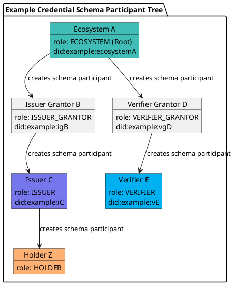
```plantuml

@startuml
scale max 800 width
 
package "Example Credential Schema Participant Tree" as cs {

    object "Ecosystem A" as tr #3fbdb6 {
        role: ECOSYSTEM (Root)
        did:example:ecosystemA
    }
    object "Issuer Grantor B" as ig {
        role: ISSUER_GRANTOR
        did:example:igB
    }
    object "Issuer C" as issuer #7677ed  {
        role: ISSUER
        did:example:iC
    }
    object "Verifier Grantor D" as vg {
        role: VERIFIER_GRANTOR
        did:example:vgD
    }
    object "Verifier E" as verifier #00b0f0 {
        role: VERIFIER
        did:example:vE
    }

    object "Holder Z " as holder #FFB073 {
        role: HOLDER
    }
}


tr --> ig : creates schema participant
ig --> issuer : creates schema participant

tr --> vg : creates schema participant
vg --> verifier : creates schema participant

issuer --> holder: creates schema participant

@enduml

```

###### [MOD-PP-MSG-9-2-3] Revoke Participant fee checks

Fee payer MUST have the required [[ref: estimated transaction fees]] in its [[ref: account]], else [[ref: transaction]] MUST abort.

##### [MOD-PP-MSG-9-3] Revoke Participant execution

If all precondition checks passed, [[ref: transaction]] is executed.

Method execution MUST perform the following tasks in a [[ref: transaction]], and rollback if any error occurs.

- define `now`: current timestamp.

- Load `Participant` entry `applicant_participant` from `id`.
- set `applicant_participant.revoked` to `now`
- set `applicant_participant.modified` to `now`

Call [[MOD-DE-MSG-6]](#mod-de-msg-6-revoke-vs-operator-authorization) Revoke VS Operator Authorization with `participant_id = applicant_participant.id` to remove any authorization record for this `Participant` entry. The call is a no-op if no record exists.

#### [MOD-PP-MSG-10] Create or Update Participant Session

Any authorized `operator` CAN execute this method on behalf of a `corporation`.

Any credential exchange that requires issuer or verifier to pay fees, register a digest_sri, or produce a proof implies the creation of a `ParticipantSession`.

If the peer wants to issue a credential, the `agent`, the Verifiable User Agent or Verifiable Service that receive the request MUST send to peer:

- a `uuid` for session identification;
- *optional*: the `agent_participant_id` `Participant` id of the agent that will receive the credential, if peer is a **Verifiable User Agent**. it MUST NOT be set if peer is a **Verifiable Service**.
- *optional*: the `wallet_agent_participant_id` `Participant` id of the agent wallet that will store the credential. If this is the same software than the agent, then it should be equal to `agent_participant_id`. It MUST NOT be set if peer is a **Verifiable Service**.

If the peer wants to verify a credential, agent must send to peer:

- a `uuid` for session identification;
- *optional*: the `agent_participant_id` `Participant` id of the agent that will receive the credential, if peer is a **Verifiable User Agent**. it MUST NOT be set if peer is a **Verifiable Service**.
- *optional*: a map of compatible found credentials in available wallets for the requested schema_id: Map<uint64[] issuer_participant_ids, uint64: wallet_agent_participant_id>. wallet_agent_participant_id MUST NOT be set if peer is a **Verifiable Service**.

In case peer is a **Verifiable Service** and illegaly set `agent_participant_id` and/or `wallet_agent_participant_id`, the other end MUST refuse the request.

`payer` MUST create a Participant Session using the above information, then, `agent` MUST check session has been created and is valid before accepting the action (receive and store issued credential, or accept a presentation request).

```plantuml
scale max 800 width
actor "Agent\nVUA or VS" as Issued 
participant "Payer\nVS" as Issuer 
participant "VPR" as vpr 


Issued <-- Issuer: I want to issue a credential from schema id ... to you
Issued --> Issuer: Here is the session uuid and the wallet_agent_participant_id
Issuer --> vpr: create session
Issued <-- Issuer: session created, you can verify
Issued --> vpr: getSession(uuid)
Issued <-- vpr: session object
Issued --> Issuer: I verified the session it is OK, you can send the credential
Issued <-- Issuer: Send credential
Issued <-- Issued: Store credential in wallet agent

```

See [[ref: VT spec]].

##### [MOD-PP-MSG-10-1] Create or Update Participant Session parameters

An [[ref: account]] that would like to create or update a `ParticipantSession` entry MUST send a Msg by specifying:

- `corporation` (account): (Signer) the `policy_address` of the corporation on whose behalf this message is executed.
- `operator` (account): (Signer) the account authorized by the `corporation` to run this Msg.
- `id` (uuid) (*mandatory*): id of the `ParticipantSession`.
- `issuer_participant_id` (uint64) (*optional*): the id of the perm of the issuer, if we are dealing with the issuance of a credential.
- `verifier_participant_id` (uint64) (*optional*): the id of the perm of the verifier, if we are dealing with the verification of a credential.
- `agent_participant_id` (uint64) (*optional*): the agent credential issuer `Participant` id (extracted from the agent credential that VUA has in its wallet) of the agent that received the request (credential offer for issuance, presentation request for verification). Only set by VUAs, MUST NOT be specified when peer is a VS.
- `wallet_agent_participant_id` (uint64) (*optional*): the wallet credential issuer `Participant` id of the VUA where the credential will be or is stored. Can be the same perm than `agent_participant_id` if agent and wallet_agent are the same agent. Only set by VUAs, MUST NOT be specified when peer is a VS.
- `digest` (string) (*optional*): digest derived from an issued or verified credential.

##### [MOD-PP-MSG-10-2] Create or Update Participant Session precondition checks

If any of these precondition checks fail, [[ref: transaction]] MUST abort.

- `corporation` (account): (Signer) signature must be verified.
- `operator` (account): (Signer) signature must be verified.
- `id` MUST be a valid uuid. If an entry `existing_entry` with `id` already exist, then `existing_entry.corporation_id` MUST equal `co.id` (where `co` is the `Corporation` entry resolved from the signing `corporation` account) AND `existing_entry.vs_operator` MUST be equal to `operator`, else abort.

if `issuer_participant_id` is null AND `verifier_participant_id` is null, MUST abort.

- define `issuer_participant` as null.
- define `verifier_participant` as null.

if `issuer_participant_id` is not null:

- Load `issuer_participant` from `issuer_participant_id`.
- if `issuer_participant.role` is not ISSUER, abort.
- if `issuer_participant` is not a [[ref: active participant]], abort.
- if `issuer_participant.vs_operator` is not equal to `operator`, abort.
- if `issuer_participant.corporation_id` is not equal to `co.id` (where `co` is the `Corporation` entry resolved from the signing `corporation` account), abort.
- if `digest_sri` is present but not a valid digest SRI, abort.

if `verifier_participant_id` is not null:

- Load `verifier_participant` from `verifier_participant_id`.
- if `verifier_participant.role` is not VERIFIER, abort.
- if `verifier_participant` is not a [[ref: active participant]], abort.
- if `verifier_participant.vs_operator` is not equal to `operator`, abort.
- if `verifier_participant.corporation_id` is not equal to `co.id` (where `co` is the `Corporation` entry resolved from the signing `corporation` account), abort.
- if `digest_sri` is present but not a valid digest SRI, abort.

Define the **primary `Participant`** `perm`: if `verifier_participant` is not null, `perm` = `verifier_participant` (the caller is the `vs_operator` of the verifier). Else, `perm` = `issuer_participant` (the caller is the `vs_operator` of the issuer).

[[AUTHZ-CHECK-3]](#authz-check-3-vs-operator-authorization-checks) MUST pass for this (`corporation`, `operator`, `perm`) tuple.
[[AUTHZ-CHECK-4]](#authz-check-4-vs-operator-fee-grant-checks) MUST pass for this (`corporation`, `operator`, `perm`) tuple.

agent:

- Load `agent_participant` from `agent_participant_id`.
- if `agent_participant.role` is not ISSUER, abort.
- if `agent_participant` is not a [[ref: active participant]], abort.

wallet_agent:

- Load `wallet_agent_participant` from `wallet_agent_participant_id`.
- if `wallet_agent_participant.role` is not ISSUER, abort.
- if `wallet_agent_participant` is not a [[ref: active participant]], abort.

:::warning
we might want to check that credential schema of agent and wallet_agent perms is an Essential Credential Schema of type UserAgent. At the moment there is no way of doing it. We consider User Agent will not report a `Participant` entry that is not controlled by its owner.
:::

###### [MOD-PP-MSG-10-3] Create or Update Participant Session fee checks

- Load `CredentialSchema` entry `cs` from `issuer_participant.schema_id` if `issuer_participant` is not null, else from `verifier_participant.schema_id`.
- Fee payer MUST have sufficient available balance for the required [[ref: estimated transaction fees]].

For trust fees, `corporation` account MUST have sufficient available balance as explained below.

**Step 1: Calculate total beneficiary fees in credential schema pricing asset**

Use "Find Beneficiaries" query method to get the set of beneficiary `Participant` entries `found_participant_set` (all ancestors in the `Participant` tree).

- define `total_beneficiary_fees` = 0

If **Credential Issuance** (`issuer_participant` is NOT null):

- for each `perm` in `found_participant_set`:
  - `total_beneficiary_fees` = `total_beneficiary_fees` + `participant.issuance_fees` × (1 - `issuer_participant.issuance_fee_discount`)

If **Credential Verification** (`verifier_participant` is NOT null):

- for each `perm` in `found_participant_set`:
  - `total_beneficiary_fees` = `total_beneficiary_fees` + `participant.verification_fees` × (1 - `verifier_participant.verification_fee_discount`)

> Note: `total_beneficiary_fees` is expressed in the credential schema pricing asset `(cs.pricing_asset_type, cs.pricing_asset)`.

**Step 2: Calculate amounts payer must have available**

Based on the credential schema pricing configuration, calculate the total amounts the payer (the signing `corporation` account) must have available.

Define the following variables:

| Variable | Description |
|----------|-------------|
| `total_fees_in_pricing_asset` | Total fees to be distributed to beneficiaries (in pricing asset) |
| `total_fees_in_native_denom` | Total fees converted to [[ref: native denom]] (if needed) |
| `total_payer_trust_deposit` | Trust deposit payer must stake for themselves |
| `total_payees_trust_deposit` | Trust deposit payer must stake on behalf of payees |
| `total_payees_fees_to_account` | Fees to be transferred to payees' accounts |
| `total_user_agent_reward` | Reward for user agent (in [[ref: native denom]]) |
| `total_wallet_agent_reward` | Reward for wallet agent (in [[ref: native denom]]) |

Initialize:

- `total_fees_in_pricing_asset` = `total_beneficiary_fees`
- `total_fees_in_native_denom` = 0
- `total_payer_trust_deposit` = 0
- `total_payees_trust_deposit` = 0
- `total_payees_fees_to_account` = 0
- `total_user_agent_reward` = 0
- `total_wallet_agent_reward` = 0

> If a conversion is needed below, use [Get Price](#mod-xr-qry-3-get-price) to convert amounts.

---

**Case A: `(cs.pricing_asset_type, cs.pricing_asset)` = `(COIN, [[ref: native denom]])`**

Pricing is in native token. No conversion needed.

Calculate:

- `total_fees_in_native_denom` = `total_fees_in_pricing_asset`
- `total_payer_trust_deposit` = `total_fees_in_native_denom` × `GlobalVariables.trust_deposit_rate`
- `total_payees_trust_deposit` = `total_payer_trust_deposit`
- `total_payees_fees_to_account` = `total_fees_in_native_denom` × (1 - `GlobalVariables.trust_deposit_rate`)

if `agent_participant_id` is set:

- `total_user_agent_reward` = `total_fees_in_native_denom` × `GlobalVariables.user_agent_reward_rate`

if `wallet_agent_participant_id` is set:

- `total_wallet_agent_reward` = `total_fees_in_native_denom` × `GlobalVariables.wallet_user_agent_reward_rate`

Required balance check:

- `corporation` MUST have available balance ≥ `total_fees_in_native_denom` + `total_payer_trust_deposit` + `total_user_agent_reward` + `total_wallet_agent_reward` in [[ref: native denom]].

---

**Case C: `(cs.pricing_asset_type, cs.pricing_asset)` = `(COIN, <arbitrary_denom>)`**

Pricing is in an arbitrary on-chain coin (e.g., USDC). Fees to payees are paid in that coin; deposits and agent rewards are converted to native denom.

Calculate:

- `total_fees_in_native_denom` = getPrice(`COIN`, `<arbitrary_denom>`, `COIN`, `[[ref: native denom]]`, `total_fees_in_pricing_asset`)
- `total_payer_trust_deposit` = `total_fees_in_native_denom` × `GlobalVariables.trust_deposit_rate`
- `total_payees_trust_deposit` = `total_payer_trust_deposit`
- `total_payees_fees_to_account` = `total_fees_in_pricing_asset` × (1 - `GlobalVariables.trust_deposit_rate`)

if `agent_participant_id` is set:

- `total_user_agent_reward` = `total_fees_in_native_denom` × `GlobalVariables.user_agent_reward_rate`

if `wallet_agent_participant_id` is set:

- `total_wallet_agent_reward` = `total_fees_in_native_denom` × `GlobalVariables.wallet_user_agent_reward_rate`

Required balance check:

- `corporation` MUST have available balance ≥ `total_payer_trust_deposit` + `total_payees_trust_deposit` + `total_user_agent_reward` + `total_wallet_agent_reward` in [[ref: native denom]].
- AND `corporation` MUST have available balance ≥ `total_payees_fees_to_account` in `<arbitrary_denom>`.

---

**Case D: `(cs.pricing_asset_type, cs.pricing_asset)` = `(FIAT, <fiat_denom>)`**

Pricing is in fiat currency (e.g., USD). Fiat fees are settled off-chain; only deposits and agent rewards are paid on-chain in native denom.

Calculate:

- `total_fees_in_native_denom` = getPrice(`FIAT`, `<fiat_denom>`, `COIN`, `[[ref: native denom]]`, `total_fees_in_pricing_asset`)
- `total_payer_trust_deposit` = `total_fees_in_native_denom` × `GlobalVariables.trust_deposit_rate`
- `total_payees_trust_deposit` = `total_payer_trust_deposit`
- `total_payees_fees_to_account` = 0 (FIAT payments are managed off-chain)

if `agent_participant_id` is set:

- `total_user_agent_reward` = `total_fees_in_native_denom` × `GlobalVariables.user_agent_reward_rate`

if `wallet_agent_participant_id` is set:

- `total_wallet_agent_reward` = `total_fees_in_native_denom` × `GlobalVariables.wallet_user_agent_reward_rate`

Required balance check:

- `corporation` MUST have available balance ≥ `total_payer_trust_deposit` + `total_payees_trust_deposit` + `total_user_agent_reward` + `total_wallet_agent_reward` in [[ref: native denom]].

---

:::warning
- Deposit-bound amounts MUST always be paid in [[ref: native denom]] (trust units are minted from native denom only).
- When paying with COIN ≠ [[ref: native denom]] or with FIAT, the payer pays the deposit-bound amounts on behalf of payees (since payees receive non-native assets that cannot be deposit-bound).
:::

##### [MOD-PP-MSG-10-4] Create or Update Participant Session execution

If all precondition checks passed, method is executed.

- Load all `Participant` entries as in basic checks.
- Load `CredentialSchema` entry `cs` from `issuer_participant.schema_id` if `issuer_participant` is not null, else from `verifier_participant.schema_id`.
- define `now`: current timestamp.
- use "Find Beneficiaries" to build `found_participant_set`.

> Note: All funds are transferred from the `corporation` account executing the method. The steps below describe what each recipient must receive. Implementation details (batching, order of transfers) are left to the implementer.

---

**Step 1: Process fee distribution to each beneficiary**

Initialize accumulators for agent rewards:

- `accumulated_user_agent_reward` = 0
- `accumulated_wallet_agent_reward` = 0

Determine the operation type and applicable discount:

- If **Credential Issuance** (`issuer_participant` is NOT null):
  - `fee_field` = `issuance_fees`
  - `discount` = `issuer_participant.issuance_fee_discount`
  - `payer_participant` = `issuer_participant`

- Else if **Credential Verification** (`verifier_participant` is NOT null):
  - `fee_field` = `verification_fees`
  - `discount` = `verifier_participant.verification_fee_discount`
  - `payer_participant` = `verifier_participant`

**For each beneficiary `Participant` `perm` in `found_participant_set`:**

If `participant.[fee_field]` > 0:

1. Calculate the discounted fee for this beneficiary:
   - `beneficiary_fee_in_pricing_asset` = `participant.[fee_field]` × (1 - `discount`)

2. Calculate amounts based on pricing configuration (same logic as fee checks):

   **Case A: `(cs.pricing_asset_type, cs.pricing_asset)` = `(COIN, [[ref: native denom]])`**
   
   - `fee_in_native_denom` = `beneficiary_fee_in_pricing_asset`
   - `payer_trust_deposit` = `fee_in_native_denom` × `GlobalVariables.trust_deposit_rate`
   - `payee_trust_deposit` = `payer_trust_deposit`
   - `payee_fees_to_account` = `fee_in_native_denom` × (1 - `GlobalVariables.trust_deposit_rate`)

  if `agent_participant_id` is set:
    - `user_agent_reward_portion` = `fee_in_native_denom` × `GlobalVariables.user_agent_reward_rate`

  if `wallet_agent_participant_id` is set:
    - `wallet_agent_reward_portion` = `fee_in_native_denom` × `GlobalVariables.wallet_user_agent_reward_rate`

  
   **Case C: `(cs.pricing_asset_type, cs.pricing_asset)` = `(COIN, <arbitrary_denom>)`**
   
   - `fee_in_native_denom` = getPrice(`COIN`, `<arbitrary_denom>`, `COIN`, `[[ref: native denom]]`, `beneficiary_fee_in_pricing_asset`)
   - `payer_trust_deposit` = `fee_in_native_denom` × `GlobalVariables.trust_deposit_rate`
   - `payee_trust_deposit` = `payer_trust_deposit`
   - `payee_fees_to_account` = `beneficiary_fee_in_pricing_asset` × (1 - `GlobalVariables.trust_deposit_rate`) *(in `<arbitrary_denom>`)*

  if `agent_participant_id` is set:
    - `user_agent_reward_portion` = `fee_in_native_denom` × `GlobalVariables.user_agent_reward_rate`

  if `wallet_agent_participant_id` is set:
    - `wallet_agent_reward_portion` = `fee_in_native_denom` × `GlobalVariables.wallet_user_agent_reward_rate`


   **Case D: `(cs.pricing_asset_type, cs.pricing_asset)` = `(FIAT, <fiat_denom>)`**
   
   - `fee_in_native_denom` = getPrice(`FIAT`, `<fiat_denom>`, `COIN`, `[[ref: native denom]]`, `beneficiary_fee_in_pricing_asset`)
   - `payer_trust_deposit` = `fee_in_native_denom` × `GlobalVariables.trust_deposit_rate`
   - `payee_trust_deposit` = `payer_trust_deposit`
   - `payee_fees_to_account` = 0 *(FIAT payments are managed off-chain)*

  if `agent_participant_id` is set:
    - `user_agent_reward_portion` = `fee_in_native_denom` × `GlobalVariables.user_agent_reward_rate`

  if `wallet_agent_participant_id` is set:
    - `wallet_agent_reward_portion` = `fee_in_native_denom` × `GlobalVariables.wallet_user_agent_reward_rate`

3. Execute transfers and mints for this beneficiary (`ecosystem_id` = the id of the [[ref: ecosystem]] that owns `cs`):

   - If `payee_fees_to_account` > 0: transfer `payee_fees_to_account` to `Corporation[participant.corporation_id].policy_address` (in the appropriate denom).
   - Use [[MOD-TD-MSG-1]](#mod-td-msg-1-mint-trust-units) Mint Trust Units with (`corporation_id` = `participant.corporation_id`, `ecosystem_id`, `source_account` = the payer `corporation` account, `amount` = `payee_trust_deposit`). Increase `participant.tu` by the returned `minted_tu`.
   - Use [[MOD-TD-MSG-1]](#mod-td-msg-1-mint-trust-units) Mint Trust Units with (`corporation_id` = `co.id` (where `co` is the `Corporation` entry resolved from the signing `corporation` account, the payer), `ecosystem_id`, `source_account` = the payer `corporation` account, `amount` = `payer_trust_deposit`). Increase `payer_participant.tu` by the returned `minted_tu`.

4. Accumulate agent rewards:

   - `accumulated_user_agent_reward` = `accumulated_user_agent_reward` + `user_agent_reward_portion`
   - `accumulated_wallet_agent_reward` = `accumulated_wallet_agent_reward` + `wallet_agent_reward_portion`

---

**Step 2: Process agent rewards**

After processing all beneficiaries, distribute accumulated rewards to agents.

**User Agent Reward:**

If `agent_participant_id` is set AND `accumulated_user_agent_reward` > 0:

- `agent_trust_deposit` = `accumulated_user_agent_reward` × `GlobalVariables.trust_deposit_rate`
- `agent_fees_to_account` = `accumulated_user_agent_reward` - `agent_trust_deposit`
- Transfer `agent_fees_to_account` to `agent_participant.corporation_id` in [[ref: native denom]].
- Use [[MOD-TD-MSG-1]](#mod-td-msg-1-mint-trust-units) Mint Trust Units with (`corporation_id` = `agent_participant.corporation_id`, `ecosystem_id`, `source_account` = the payer `corporation` account, `amount` = `agent_trust_deposit`). Increase `agent_participant.tu` by the returned `minted_tu`.

**Wallet Agent Reward:**

If `wallet_agent_participant_id` is set AND `accumulated_wallet_agent_reward` > 0:

- `wallet_agent_trust_deposit` = `accumulated_wallet_agent_reward` × `GlobalVariables.trust_deposit_rate`
- `wallet_agent_fees_to_account` = `accumulated_wallet_agent_reward` - `wallet_agent_trust_deposit`
- Transfer `wallet_agent_fees_to_account` to `wallet_agent_participant.corporation_id` in [[ref: native denom]].
- Use [[MOD-TD-MSG-1]](#mod-td-msg-1-mint-trust-units) Mint Trust Units with (`corporation_id` = `wallet_agent_participant.corporation_id`, `ecosystem_id`, `source_account` = the payer `corporation` account, `amount` = `wallet_agent_trust_deposit`). Increase `wallet_agent_participant.tu` by the returned `minted_tu`.

---

**Step 3: Create or update session records**

> Now that all transfers have been done, we can create the entries

Create a `ParticipantSessionRecord` `cspsr`:

- `cspsr.id`: auto-incremented uint64
- `cspsr.created`: `now`
- `cspsr.issuer_participant_id`: `issuer_participant_id`
- `cspsr.verifier_participant_id`: `verifier_participant_id`
- `cspsr.agent_participant_id`: `agent_participant_id`
- `cspsr.wallet_agent_participant_id`: `wallet_agent_participant_id`

If new, create entry `ParticipantSession` `session`:

- `session.id`: `id`
- `session.corporation_id`: `co.id`
- `session.vs_operator`: `operator`
- `session.modified:` : `now`
- `session.created:` : `now`

Else update:

- `session.modified:` : `now`

then, add the `cspsr` to `session.session_records`

if current transaction if for issuance of a credential, persist the digest SRI by calling [[MOD-DI-MSG-1]](#mod-di-msg-1-store-digest).

:::warning
`session.authz[]` can contain null `issuer_participant_id` OR `verifier_participant_id`
:::

#### [MOD-PP-MSG-11] Update Participant Module Parameters

Update Participant Module Parameters.

Can only be executed through a governance proposal.

##### [MOD-PP-MSG-11-1] Update Participant Module Parameters parameters

- `params` (KeySet<String, String>): the parameters to update and their values.

##### [MOD-PP-MSG-11-2] Update Participant Module Parameters precondition checks

If any of these precondition checks fail, [[ref: transaction]] MUST abort.

###### [MOD-PP-MSG-11-2-1] Update Participant Module Parameters basic checks

- `params`: size of `params` MUST be greater than 0. For each `param` <`key`, `value`> `key` MUST exist, else abort.

###### [MOD-PP-MSG-11-2-2] Update Participant Module Parameters fee checks

provided transaction fees MUST be sufficient for execution

##### [MOD-PP-MSG-11-3] Update Participant Module Parameters execution

If all precondition checks passed, [[ref: transaction]] is executed.

Method execution MUST perform the following tasks in a [[ref: transaction]], and rollback if any error occurs.

for each parameter `param` <`key`, `value`> in `parameters`:

- update parameter set value = `value` where key = `key`.

#### [MOD-PP-MSG-12] Slash Participant Trust Deposit

This method can only be called by either:

- a `corporation` ancestor validator of this `Participant` entry;
- the `corporation` controller of the `Ecosystem` object, owner of the corresponding credential schema.

##### [MOD-PP-MSG-12-1] Slash Participant Trust Deposit parameters

- `corporation` (account): (Signer) the `policy_address` of the corporation on whose behalf this message is executed.
- `operator` (account): (Signer) the account authorized by the `corporation` to run this Msg.
- `id` (uint64) (*mandatory*): id of the `Participant` entry;
- `tu_amount` (decimal) (*mandatory*): the amount of [[ref: trust units]] to slash

##### [MOD-PP-MSG-12-2] Slash Participant Trust Deposit precondition checks

If any of these precondition checks fail, [[ref: transaction]] MUST abort.

###### [MOD-PP-MSG-12-2-1] Slash Participant Trust Deposit basic checks

if a mandatory parameter is not present, [[ref: transaction]] MUST abort.

- `corporation` (account): (Signer) signature must be verified.
- `operator` (account): (Signer) signature must be verified.
- [[AUTHZ-CHECK]](#authz-check-common-authorization-and-fee-grant-checks) MUST pass for this (`corporation`, `operator`) pair and this message type.
- `id` MUST be a valid uint64.
- Load `Participant` entry `applicant_participant` from `id`. If no entry found, abort.
- `tu_amount` MUST be strictly positive and lower or equal to `applicant_participant.tu` else MUST abort (an ecosystem can only slash trust units accumulated in the context of its own `Participant` entries — never the rest of the corporation's deposit).

:::note
Even if the `Participant` entry has expired or is revoked, it is still possible to slash it.
:::

###### [MOD-PP-MSG-12-2-2] Slash Participant Trust Deposit validator perms

Either Option #1, or #2 MUST return true, else abort.

*Option #1*: executed by a validator ancestor

if `applicant_participant.validator_participant_id` is defined:

- set `validator_participant` = `applicant_participant`
- while `validator_participant.validator_participant_id` is defined, 
  - load `validator_participant` from `validator_participant.validator_participant_id`.
  - if `validator_participant` is a [[ref: active participant]] and `validator_participant.corporation_id` equals `co.id` (where `co` is the `Corporation` entry resolved from the signing `corporation` account), => return true.
- end
- return false.

*Option #2*: executed by `Ecosystem` controller

- load `CredentialSchema` `cs` from `applicant_participant.schema_id`
- load `Ecosystem` `ecosystem` from `cs.ecosystem_id`
- if `co.id` equals `ecosystem.corporation_id` (where `co` is the `Corporation` entry resolved from the signing `corporation` account), return true.
- else return false.

###### [MOD-PP-MSG-12-2-3] Slash Participant Trust Deposit fee checks

Fee payer MUST have the required [[ref: estimated transaction fees]] in its [[ref: account]], else [[ref: transaction]] MUST abort.

##### [MOD-PP-MSG-12-3] Slash Participant Trust Deposit execution

If all precondition checks passed, [[ref: transaction]] is executed.

Method execution MUST perform the following tasks in a [[ref: transaction]], and rollback if any error occurs.

- define `now`: current timestamp.

- Load `Participant` entry `applicant_participant` from `id`.
- Load `Participant` entry `validator_participant` from `applicant_participant.validator_participant_id`.
- Load `CredentialSchema` `cs` from `applicant_participant.schema_id` and define `ecosystem_id` = `cs.ecosystem_id`.
- set `applicant_participant.slashed` to `now`
- set `applicant_participant.modified` to `now`
- set `applicant_participant.tu` to `applicant_participant.tu` - `tu_amount`
- calculate `slashed_fiat` = `tu_amount` × `tu_peg_value(now)` — the obligation in [[ref: main fiat currency]], **fixed at slash time** (trust scores decay, debts do not).
- set `applicant_participant.slashed_amount` to `applicant_participant.slashed_amount` + `slashed_fiat`

use [[MOD-TD-MSG-7]](#mod-td-msg-7-remove-ecosystem-slashed-trust-units) Remove Ecosystem Slashed Trust Units with (`corporation_id` = `applicant_participant.corporation_id`, `ecosystem_id`, `tu_amount`) to remove the slashed trust units from the ecosystem-scoped portion of the corporation's trust deposit.

Call [[MOD-DE-MSG-6]](#mod-de-msg-6-revoke-vs-operator-authorization) Revoke VS Operator Authorization with `participant_id = applicant_participant.id` to remove any authorization record for this `Participant` entry. The call is a no-op if no record exists.

#### [MOD-PP-MSG-13] Repay Participant Slashed Trust Deposit

This method can only be called by the `corporation` that wants to repay the deposit of a slashed `Participant` entry they own. This won't make the `Participant` entry re-usable: it will be needed for the `corporation` associated to this `Participant` entry to request a new `Participant` entry, as slashed `Participant` entries cannot be revived (same happens for revoked, etc.).

Nevertheless, to get a new `Participant` entry for a given ecosystem, it is needed, using this method, to repay the deposit of a slashed `Participant` entry first.

##### [MOD-PP-MSG-13-1] Repay Participant Slashed Trust Deposit parameters

- `corporation` (account): (Signer) the `policy_address` of the corporation on whose behalf this message is executed.
- `operator` (account): (Signer) the account authorized by the `corporation` to run this Msg.
- `id` (uint64) (*mandatory*): id of the `Participant` entry

##### [MOD-PP-MSG-13-2] Repay Participant Slashed Trust Deposit precondition checks

If any of these precondition checks fail, [[ref: transaction]] MUST abort.

###### [MOD-PP-MSG-13-2-1] Repay Participant Slashed Trust Deposit basic checks

if a mandatory parameter is not present, [[ref: transaction]] MUST abort.

- `corporation` (account): (Signer) signature must be verified.
- `operator` (account): (Signer) signature must be verified.
- [[AUTHZ-CHECK]](#authz-check-common-authorization-and-fee-grant-checks) MUST pass for this (`corporation`, `operator`) pair and this message type.
- `id` MUST be a valid uint64.
- Load `Participant` entry `applicant_participant` from `id`. If no entry found, abort.
- if `applicant_participant.corporation_id` is not equal to `co.id` (where `co` is the `Corporation` entry resolved from the signing `corporation` account), abort.

###### [MOD-PP-MSG-13-2-2] Repay Participant Slashed Trust Deposit fee checks

- Fee payer MUST have the required [[ref: estimated transaction fees]] in its [[ref: account]];
- calculate `outstanding` = `applicant_participant.slashed_amount` - `applicant_participant.repaid_amount` (in [[ref: main fiat currency]]). `outstanding` MUST be strictly positive.
- a valid (non-expired) exchange rate between [[ref: native denom]] and [[ref: main fiat currency]] MUST be available through [Get Price](#mod-xr-qry-3-get-price).
- calculate `repay_amount` = `outstanding` / `P(now)` in [[ref: native denom]], where `P(now)` is the current [[ref: native denom]] price in [[ref: main fiat currency]]. `corporation` MUST have at least `repay_amount` in its account balance, else [[ref: transaction]] MUST abort.

##### [MOD-PP-MSG-13-3] Repay Participant Slashed Trust Deposit execution

If all precondition checks passed, [[ref: transaction]] is executed.

Method execution MUST perform the following tasks in a [[ref: transaction]], and rollback if any error occurs.

- define `now`: current timestamp.

- Load `Participant` entry `applicant_participant` from `id`.
- Load `CredentialSchema` `cs` from `applicant_participant.schema_id` and define `ecosystem_id` = `cs.ecosystem_id`.
- calculate `outstanding` and `repay_amount` as in fee checks.
- process the repayment as a fresh mint: use [[MOD-TD-MSG-1]](#mod-td-msg-1-mint-trust-units) Mint Trust Units with (`corporation_id` = `applicant_participant.corporation_id`, `ecosystem_id`, `source_account` = the `corporation` account, `amount` = `repay_amount`). The [[ref: native denom]] is routed to the [[ref: distribution pool]]; the trust units are minted at the **current** peg value — restoring trust costs more native denom when the token price is low.
- set `applicant_participant.repaid` to `now`
- set `applicant_participant.modified` to `now`
- set `applicant_participant.repaid_amount` to `applicant_participant.repaid_amount` + `outstanding`.

> Note: for the mint above, the "no outstanding obligation" precondition of [[MOD-TD-MSG-1]](#mod-td-msg-1-mint-trust-units) is evaluated **after** accounting for this repayment (the repayment itself is the path that clears the obligation).

#### [MOD-PP-MSG-14] Self Create Participant

Any authorized `operator` CAN execute this method on behalf of a `corporation`.

This simple `Participant`-creation method can be used to self-create an ISSUER (resp. VERIFIER) `Participant` entry if issuance mode (resp. verification mode) is set to `OPEN` for a given schema. As `Participant` entries are the anchor of ecosystem trust deposit operations, it is required for an issuer/verifier candidate to self-create a `Participant` entry for being issuer or verifier of a given schema.

:::note
Even if a schema is OPEN, candidate MUST make sure they comply with the EGF else their `Participant` entry may be revoked by ecosystem governance authority and their deposit slashed.
:::

##### [MOD-PP-MSG-14-1] Self Create Participant parameters

- `corporation` (account): (Signer) the `policy_address` of the corporation on whose behalf this message is executed.
- `operator` (account): (Signer) the account authorized by the `corporation` to run this Msg.
- `role` (ParticipantRole) (*mandatory*): ISSUER or VERIFIER.
- `validator_participant_id` (uint64) (*mandatory*): MUST be an ECOSYSTEM [[ref: active participant]] or [[ref: future participant]].
- `vs_operator` (account) (*optional*): the account we want to authorize to create `ParticipantSession` entries linked to this `Participant` entry. **Required** for payment delegation.
- `did` (string) (*mandatory*): [[ref: DID]] of the VS grantee service.
- `effective_from` (timestamp) (*optional*): timestamp from when (exclusive) this Perm is effective. MUST be in the future.
- `effective_until` (timestamp) (*optional*): timestamp until when (exclusive) this Perm is effective, null if it doesn't expire. If not null, MUST be greater than `effective_from`.
- `verification_fees` (number) (*optional*): price to pay by the verifier of a credential of this schema to the grantee of this ISSUER perm when a credential is verified, in the denom specified in the credential schema. Default to 0.
- `validation_fees` (number) (*optional*): price to pay by the holder of a credential of this schema to the issuer when executing an onboarding process to obtain a credential, in the denom specified in the credential schema. Default to 0.

The following VS Operator Authorization parameters are **optional** and collectively define the initial [ParticipantAuthorizationRecord](#participantauthorizationrecord) for this `Participant` entry. Presence of `vs_operator_authz_msg_types` is the trigger: if it is not provided, no authorization record is created and the `Participant` entry operates in manual mode. VSOA configuration is **frozen at creation time** and cannot be modified later; to change it, the `Participant` entry MUST be revoked and re-created.

- `vs_operator_authz_msg_types[]` (msg_type[]) (*optional*): list of VPR delegable message types `vs_operator` is authorized to execute on behalf of `corporation` in the context of this `Participant` entry. If provided, a `ParticipantAuthorizationRecord` is created (see execution below) and `vs_operator` MUST be specified.
- `vs_operator_authz_spend_limit` (DenomAmount[]) (*optional*): maximum amount of funds `vs_operator` is allowed to spend in the context of this `Participant` entry as a direct consequence of executing authorized messages.
- `vs_operator_authz_with_feegrant` (bool) (*optional*, default: false): if true, `corporation` pays transaction fees for `vs_operator` via an on-chain `FeeGrant` when executing authorized messages in the context of this `Participant` entry.
- `vs_operator_authz_fee_spend_limit` (DenomAmount[]) (*optional*): maximum total amount of transaction fees that can be spent by `vs_operator` (paid by `corporation` via fee grant) in the context of this `Participant` entry.
- `vs_operator_authz_period` (duration) (*optional*): reset period for `vs_operator_authz_spend_limit` and `vs_operator_authz_fee_spend_limit` in the context of this `Participant` entry.

Permitted message types to be set in `vs_operator_authz_msg_types` depends on `role`.

|Participant role|Permitted Messages|
|-|-|
| HOLDER | TriggerResolver |
| ISSUER | CreateOrUpdateParticipantSession, SetParticipantOPtoValidated |
| VERIFIER | CreateOrUpdateParticipantSession |
 
##### [MOD-PP-MSG-14-2] Self Create Participant precondition checks

If any of these precondition checks fail, [[ref: transaction]] MUST abort.

###### [MOD-PP-MSG-14-2-1] Self Create Participant basic checks

if a mandatory parameter is not present, [[ref: transaction]] MUST abort.

Load `Participant` `validator_participant` from `validator_participant_id`.

- `corporation` (account): (Signer) signature must be verified.
- `operator` (account): (Signer) signature must be verified.
- [[AUTHZ-CHECK]](#authz-check-common-authorization-and-fee-grant-checks) MUST pass for this (`corporation`, `operator`) pair and this message type.
- `role` (ParticipantRole) (*mandatory*): MUST be ISSUER or VERIFIER, else abort.
- `validator_participant_id` (uint64) (*mandatory*): `validator_participant` MUST be an ECOSYSTEM [[ref: active participant]] or [[ref: future participant]].
- `vs_operator` (account) (*optional*): no check required.
- `did` (string) (*mandatory*): MUST conform to the DID Syntax, as specified [[spec-norm:DID-CORE]].
- if any existing `Participant` entry has `did` equal to the provided `did`, its `corporation_id` MUST equal `co.id` (where `co` is the `Corporation` entry resolved from the signing `corporation` account); else method MUST abort (per-Participant `(did, corporation_id)` consistency invariant: at any block height, all `Participant` entries sharing a `did` are owned by the same `Corporation`).
- `effective_from` MUST be in the future AND
  - MUST be greater or equal to `validator_participant.effective_from` AND
  - if `validator_participant.effective_until` is not null, MUST be lower than `validator_participant.effective_until`
- `effective_until`:
  - if null, `validator_participant.effective_until` MUST be NULL
  - else if not null, must be greater than `effective_from` AND if `validator_participant.effective_until` is not null, MUST be lower or equal to `validator_participant.effective_until`
- `verification_fees` (number) (*optional*): If specified, MUST be >= 0 and the `Participant` entry MUST be an ISSUER.
- `validation_fees` (number) (*optional*): If specified, MUST be >= 0 and the `Participant` entry MUST be an ISSUER.
- VS Operator Authorization parameters: if any of `vs_operator_authz_*` parameters is provided, `vs_operator_authz_msg_types` MUST also be provided and `vs_operator` MUST NOT be null, else abort. If `vs_operator_authz_msg_types` is provided, it MUST be a non-empty list of VPR delegable message types, and match the permitted messages defined in [MOD-PP-MSG-14-1](#mod-pp-msg-14-1-self-create-participant-parameters).

###### [MOD-PP-MSG-14-2-2] Self Create Participant permission checks

To execute this method, [[ref: account]] MUST match at least one these rules, else [[ref: transaction]] MUST abort.

- The related `CredentialSchema` entry is loaded with `validator_participant.schema_id`, and will be named `cs` in this section.
- if `role` is equal to ISSUER: if `cs.issuer_onboarding_mode` is not equal to OPEN, MUST abort.
- if `role` is equal to VERIFIER: if `cs.verifier_onboarding_mode` is not equal to OPEN, MUST abort.
- if `role` is equal to VERIFIER and `validation_fees` is specified and different than 0, MUST abort.
- if `role` is equal to VERIFIER and `verification_fees` is specified and different than 0, MUST abort.

###### [MOD-PP-MSG-14-2-3] Self Create Participant fee checks

Fee payer MUST have the required [[ref: estimated transaction fees]] available.

###### [MOD-PP-MSG-14-2-4] Self Create Participant overlap checks

We want to make sure that 2 `Participant` entries cannot be active at the same time for the same `validator_participant_id`. If `corporation` wishes to create a new `Participant` entry but the existing one never expires (or expires too far from now), `corporation` MUST use first the [Set Participant Effective Until](#mod-pp-msg-8-set-participant-effective-until) to set or adjust the `effective_until` value.

Find all [[ref: active participants]] `participants[]` (not revoked, not slashed, not repaid) for `cs.id`, `role`, `validator_participant_id`, `corporation`.

for each `Participant` entry `p` from `participants[]`:

- if `p.effective_until` is greater than `effective_from`, method execution MUST abort.
- if `p.effective_from` is lower than `effective_until`, method execution MUST abort.
- if `p.effective_until` is NULL (never expire), creation of a new `Participant` entry doesn't make any sense and method execution MUST abort.

> note: this check was not present in v3.

##### [MOD-PP-MSG-14-3] Self Create Participant execution

If all precondition checks passed, method is executed.

Method execution MUST perform the following tasks in a [[ref: transaction]], and rollback if any error occurs.

- define `now`: current timestamp.
- Load `Participant` `validator_participant` from `validator_participant_id`.

A new entry `Participant` `perm` MUST be created:

- `participant.id`: auto-incremented uint64.
- `participant.validator_participant_id`: `validator_participant_id`
- `participant.schema_id`: `validator_participant.schema_id`
- `participant.modified` to `now`.
- `participant.role`: `role`.
- `participant.did`: `did`.
- `participant.corporation_id`: `co.id`.
- `participant.vs_operator`: `vs_operator`.
- `participant.created`: `now`
- `participant.effective_from`: `effective_from`
- `participant.effective_until`: `effective_until`
- `participant.validation_fees`: `validation_fees` if specified and `role` is ISSUER, else 0.
- `participant.issuance_fees`: 0
- `participant.verification_fees`: `verification_fees` if specified and `role` is ISSUER, else 0.
- `participant.tu`: 0

If `vs_operator_authz_msg_types` is provided, create the [ParticipantAuthorizationRecord](#participantauthorizationrecord) in **active** state by calling [[MOD-DE-MSG-5]](#mod-de-msg-5-grant-vs-operator-authorization) Grant VS Operator Authorization with:

- `corporation`: `corporation`
- `vs_operator`: `vs_operator`
- `record`:
  - `record.participant_id`: `participant.id`
  - `record.msg_types`: `vs_operator_authz_msg_types`
  - `record.spend_limit`: `vs_operator_authz_spend_limit`
  - `record.fee_spend_limit`: `vs_operator_authz_fee_spend_limit`
  - `record.with_feegrant`: `vs_operator_authz_with_feegrant` (default: false)
  - `record.expiration`: `participant.effective_until`
  - `record.period`: `vs_operator_authz_period`

> Note: unlike [[MOD-PP-MSG-1]](#mod-pp-msg-1-start-participant-op), the record is created with `expiration = participant.effective_until` and is therefore immediately active. If `with_feegrant` is true and `participant.effective_until > now`, [[MOD-DE-MSG-5-5]](#mod-de-msg-5-5-recompute-vs-operator-fee-allowance) grants the on-chain `FeeGrant` as part of this execution.

#### [MOD-PP-MSG-15] Trigger Resolver

This method CAN be executed by:

- the `vs_operator` of the `Participant` entry, acting on behalf of `Corporation[participant.corporation_id]`; or
- any ancestor validator of the `Participant` entry in the `Participant` tree (from the direct parent up to the root `Participant` entry). For an ancestor validator `v`, the method CAN be executed by the `vs_operator` defined in `v`, or by any `operator` authorized by `Corporation[v.corporation_id]` for this message type.

This method is intended to be used by external services (such as the Verana indexer) to be notified that a trust resolution must be performed for the `did` registered in the `Participant` entry. Typical use cases include:

- a new [[ref: verifiable service]] has been onboarded and its credentials are now present in the DID Document, so trust can be (re-)evaluated;
- an issuer has revoked a credential issued to a holder: the issuer (acting as the validator of the corresponding HOLDER `Participant` entry) notifies the trust resolver to re-evaluate trust for the revoked HOLDER `Participant` entry;
- an issuer is no longer operating: a parent issuer grantor or root ecosystem `Participant` entry triggers a re-evaluation.

The method does not modify the [[ref: VPR]] state; it only emits an event that off-chain components MAY consume.

##### [MOD-PP-MSG-15-1] Trigger Resolver parameters

- `corporation` (account): (Signer) the `policy_address` of the corporation on whose behalf this message is executed.
- `operator` (account): (Signer) the account authorized by the `corporation` to run this Msg.
- `id` (uint64) (*mandatory*): id of the `Participant` entry for which a trust resolution must be triggered.

##### [MOD-PP-MSG-15-2] Trigger Resolver precondition checks

If any of these precondition checks fail, [[ref: transaction]] MUST abort.

###### [MOD-PP-MSG-15-2-1] Trigger Resolver basic checks

if a mandatory parameter is not present, [[ref: transaction]] MUST abort.

- `corporation` (account): (Signer) signature must be verified.
- `operator` (account): (Signer) signature must be verified.
- `id` MUST be a valid uint64.
- Load `Participant` entry `perm` from `id`. If no entry found, abort.
- `perm` MUST be an [[ref: active participant]], else abort.

###### [MOD-PP-MSG-15-2-2] Trigger Resolver authorization checks

At least one of the two authorization paths below MUST pass, else [[ref: transaction]] MUST abort.

*Path 1 — vs_operator of the target `Participant` entry*

- `co.id` MUST equal `participant.corporation_id` (where `co` is the `Corporation` entry resolved from the signing `corporation` account).
- `operator` MUST be equal to `participant.vs_operator`.
- [[AUTHZ-CHECK-3]](#authz-check-3-vs-operator-authorization-checks) MUST pass for this (`corporation`, `operator`, `perm`) tuple.
- [[AUTHZ-CHECK-4]](#authz-check-4-vs-operator-fee-grant-checks) MUST pass for this (`corporation`, `operator`, `perm`) tuple.

*Path 2 — ancestor validator in the `Participant` tree*

The target `perm` itself is excluded from this walk; only its ancestors (from the direct parent up to the root) are considered. Walk the tree:

- set `v` = `perm`.
- while `v.validator_participant_id` is defined and != `participant.id` :
  - load `v` from `v.validator_participant_id`.
  - if `v` is not an [[ref: active participant]], continue with the next iteration.
  - if `co.id` != `v.corporation_id` (where `co` is the `Corporation` entry resolved from the signing `corporation` account), continue with the next iteration.
  - if [AUTHZ-CHECK-1](#authz-check-1-operator-authorization-checks) pass for this (`corporation`, `operator`) tuple and message `TriggerResolver` AND [AUTHZ-CHECK-2](#authz-check-2-fee-grant-checks) pass for this (`corporation`, `operator`) tuple and message `TriggerResolver`, then authorization is granted => match.

If the walk terminates without a match, Path 2 fails.

###### [MOD-PP-MSG-15-2-3] Trigger Resolver fee checks

Fee payer MUST have the required [[ref: estimated transaction fees]] in its [[ref: account]], else [[ref: transaction]] MUST abort.

##### [MOD-PP-MSG-15-3] Trigger Resolver execution

If all precondition checks passed, [[ref: transaction]] is executed.

This method does not modify the state of the [[ref: VPR]]. It MUST emit an event signaling that a trust resolution has been triggered for `perm`. The event MUST include at least:

- `participant_id`: equal to `id`.

> Note: the identity of the signers (`corporation`, `operator`), the fee payer, the block height and timestamp, and the full Msg payload are already observable from the transaction itself. Indexers MAY use the `Participant` entry queried by `participant_id` to resolve `did`, `corporation`, `vs_operator`, and ancestor chain without duplicating them in the event payload.

#### [MOD-PP-QRY-1] List Participants

Anyone CAN execute this method.

Generic query used for (at least):

- find all `Participant` entries (all or limit to active) of a given schema;
- for a given validator, get PENDING onboarding processes;
- find all `Participant` entries of a given grantee;
- find all `Participant` entries of a given did;
- find all ISSUER_GRANTOR active participants, so that I can apply to an ISSUER `Participant` entry;
...

##### [MOD-PP-QRY-1-1] List Participants parameters

- `schema_id` (number) (*optional*): the schema id.
- `grantee` (account) (*optional*): the grantee account.
- `did` (string) (*optional*): the did the `Participant` entry refers to.
- `participant_id` (number) (*optional*): limit to `Participant` entries where the `validator_participant_id` is `participant_id`.
- `role` (ParticipantRole) (*optional*): if we want to limit to a specific `Participant` role.
- `only_valid` (boolean) (*optional*): if set to true, only return active participants.
- `only_slashed` (boolean) (*optional*): if set to true, only return slashed `Participant` entries.
- `only_repaid` (boolean) (*optional*): if set to true, only return repaid slashed `Participant` entries.
- `modified_after` (timestamp) (*optional*): limit to `Participant` entries modified after (or equal to) `modified_after`.
- `op_state` (OnboardingState) (*optional*): limit to `Participant` entries with a `op_state` not null and equal to `op_state`.
- `response_max_size` (small number) (*optional*): limit to `response_max_size` results. Must be min 1, max 1,024. Default to 64.
- `when` (timestamp) (*optional*): if set, query *at* `when`, else query *at* now(). Used to query the VPR state at a previous datetime.

##### [MOD-PP-QRY-1-2] List Participants checks

Basic type check arg SHOULD be applied.

If any of these checks fail, [[ref: query]] MUST fail.

- `response_max_size` must be between 1 and 1,024. Default to 64 if unspecified.

##### [MOD-PP-QRY-1-3] List Participants execution

return a list of found entries, or an empty list if nothing found. Ordered by `modified` asc.

#### [MOD-PP-QRY-2] Get Participant

Anyone CAN execute this method.

##### [MOD-PP-QRY-2-1] Get Participant parameters

- `id` of the [[ref: credential schema participant]] (*mandatory*);

##### [MOD-PP-QRY-2-2] Get Participant checks

- `id` must be a uint64.

##### [MOD-PP-QRY-2-3] Get Participant execution

return found entry (if any).

#### [MOD-PP-QRY-3] Void

Obsoleted by [MOD-PP-QRY-1].

#### [MOD-PP-QRY-4] Find Beneficiaries

Anyone can execute this method.

To calculate the fees required for paying the beneficiaries, it is needed to recurse all involved perms until the root of the `Participant` tree (which is the ecosystem perm), starting from the 2 branches `issuer_participant` and `verifier_participant`. As both branches may have common ancestors, we can create a Set (unordered collection with no duplicates), and recurse over the 2 branches, adding found perms. If `verifier_participant` is null, `issuer_participant` is never added to the set. If `verifier_participant` is NOT null, `issuer_participant` is added to the set if it exists but `verifier_participant` is not added to the set.

Example 1: `verifier_participant`: is not set: it's a credential offer, schema configured to have Issuer Grantors.

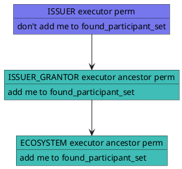
```plantuml

@startuml
scale max 800 width
object "ECOSYSTEM executor ancestor perm" as tr #3fbdb6 {
  add me to found_participant_set
}
object "ISSUER_GRANTOR executor ancestor perm" as ig #3fbdb6 {
  add me to found_participant_set
}
object "ISSUER executor perm" as i #7677ed {
  don't add me to found_participant_set
}

ig --> tr
i --> ig 
@enduml

```

Example 2: `verifier_participant`: is not set: it's a credential offer. Schema configured to NOT have Issuer Grantors.

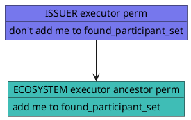
```plantuml

@startuml
scale max 800 width
object "ECOSYSTEM executor ancestor perm" as tr #3fbdb6 {
  add me to found_participant_set
}
object "ISSUER executor perm" as i #7677ed {
  don't add me to found_participant_set
}


i --> tr
@enduml

```

Example 3: `verifier_participant` is set, it's a presentation request. Schema configured to have Verifier and Issuer Grantors.

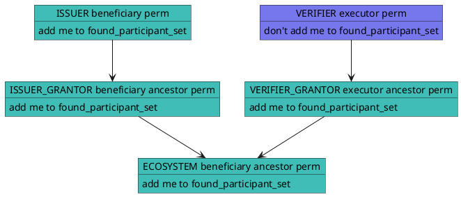
```plantuml

@startuml
scale max 800 width
object "ECOSYSTEM beneficiary ancestor perm" as tr #3fbdb6 {
  add me to found_participant_set
}
object "ISSUER_GRANTOR beneficiary ancestor perm" as ig #3fbdb6 {
  add me to found_participant_set
}
object "ISSUER beneficiary perm" as i #3fbdb6 {
  add me to found_participant_set
}

object "VERIFIER_GRANTOR executor ancestor perm" as vg #3fbdb6 {
  add me to found_participant_set
}
object "VERIFIER executor perm" as v #7677ed {
  don't add me to found_participant_set
}

ig --> tr
i --> ig 
vg --> tr
v --> vg 

@enduml

```

##### [MOD-PP-QRY-4-1] Find Beneficiaries parameters

- `issuer_participant_id` (uint64) (*optional*): id of issuer `Participant` entry.
- `verifier_participant_id` (uint64) (*optional*): id of verifier `Participant` entry.

##### [MOD-PP-QRY-4-2] Find Beneficiaries checks

- if `issuer_participant_id` and `verifier_participant_id` are unset then MUST abort.
- if `issuer_participant_id` is specified, load `issuer_participant` from `issuer_participant_id`, Participant MUST exist and MUST be a [[ref: active participant]].
- if `verifier_participant_id` is specified, load `verifier_participant` from `verifier_participant_id`, Participant MUST exist and MUST be a [[ref: active participant]].

##### [MOD-PP-QRY-4-3] Find Beneficiaries execution

Example: Let's build the set. Revoked and slashed `Participant` entries will not be added to the set. Expired `Participant` entries, if not revoked/slashed, will be considered.

- create Set `found_participant_set`.

- define `current_participant` as null.

- load perms `issuer_participant` and optional `verifier_participant` as specified in basic checks above.

if `issuer_participant` is not null:

- set `current_participant` = `issuer_participant`
- while `current_participant.validator_participant_id` is not null:
  - current_participant = load(`current_participant.validator_participant_id`)
  - if `current_participant.revoked` is NULL AND `current_participant.slashed` is NULL, Add `current_participant` to `found_participant_set`.

Additionally, if `verifier_participant` is not null:

- if `issuer_participant` is not null, add `issuer_participant` to `found_participant_set`
- set `current_participant` = `verifier_participant`
- while `current_participant.validator_participant_id` != null:
  - current_participant = load(`current_participant.validator_participant_id`)
  - if `current_participant.revoked` is NULL AND `current_participant.slashed` is NULL, Add `current_participant` to `found_participant_set`.

return `found_perms`.

:::note
This works even is schema is open to any issuer or open to any verifier.
:::

#### [MOD-PP-QRY-5] Get ParticipantSession

##### [MOD-PP-QRY-5-1] Get ParticipantSession parameters

- `id` (uuid) (*mandatory*): the id of the `ParticipantSession`.

##### [MOD-PP-QRY-5-2] Get ParticipantSession checks

##### [MOD-PP-QRY-5-3] Get ParticipantSession execution

return `ParticipantSession` entry if found, else return not found.

##### [MOD-PP-QRY-6] List Participant Module Parameters

##### [MOD-PP-QRY-6-2] List Participant Module Parameters parameters

##### [MOD-PP-QRY-6-2] List Participant Module Parameters query checks

##### [MOD-PP-QRY-6-3] List Participant Module Parameters execution of the query

Return the list of the existing parameters and their values.

##### [MOD-PP-QRY-6-4] List Participant Module Parameters API result example

```json
{
  "params": {
    "key1": "value1",
    "key2": "value2",
    ...
    ...
  }
}
```

#### Validation Examples

##### Getting a Credential from an Authorized Issuer

*This section is non-normative.*

Example of an Applicant that would like to get issued a credential (HOLDER):

```plantuml
scale max 800 width
actor "Applicant" as Applicant 
actor "Validator" as CE
participant "Verifiable Public Registry" as VPR #3fbdb6
autonumber "<font color='#7677ed'><b>(run start method)"
Applicant --> VPR #3fbdb6: Create Validation Entry (and pay required Trust Fees).
autonumber stop
VPR <-- VPR: Assign Validator (or use provided Validator).
autonumber "<font color='#7677ed'><b>(end start method)"
Applicant <-- VPR: Transaction completed and Validation entry created
autonumber stop
autonumber "<font color='#7677ed'><b>(connects to Certification Entity Validation VS)"
Applicant --> CE: share id of Participant
autonumber stop
Applicant <-- CE: Request proof of account and DID ownership (blind sign)
Applicant --> CE: send blind sign proofs 
note over Applicant, CE #EEEEEE: (*optional*) repeat the following until tasks completed
Applicant <-- CE: Form fill-ins, request proof documents
Applicant --> CE: fill-in forms, provides requested documents...
note over Applicant, CE #EEEEEE: tasks completed
autonumber stop
CE --> Applicant #3fbdb6: Issue Credential.
autonumber "<font color='#7677ed'><b>(run issued method)"
CE --> VPR #3fbdb6: Update Validation Entry. Applicant VALIDATED, Credential Issued, fees transferred to Validator.
autonumber stop
```

##### Add a DID to the List of Granted Issuers of a Credential Schema

*This section is non-normative.*

```plantuml
scale max 800 width
actor "Applicant\n(issuer candidate)\nAccount" as ApplicantAccount 
actor "Applicant\n(issuer candidate)\nVS Browser" as ApplicantBrowser 

actor "Validator\n(issuer grantor)\nVS" as ValidatorVS
actor "Validator\n(issuer grantor)\nAccount" as ValidatorAccount

participant "Verifiable Public Registry" as VPR #3fbdb6

ApplicantAccount --> VPR: Start Participant OP
VPR <-- VPR: create `Participant` entry.
ApplicantAccount <-- VPR: `Participant` entry created,\nassigned participant.validator_participant_id from ISSUER_GRANTOR `Participant` entries.
ApplicantBrowser --> ValidatorVS: connect to validator VS DID found in validator_participant.did\nby creating a DIDComm connection
ApplicantBrowser <-- ValidatorVS: DIDComm connection established.
ApplicantBrowser --> ValidatorVS: I want to proceed with participant.id=...
ValidatorVS --> ValidatorVS: load perm with id=...\nand verify the associated participant.validator_participant_id is referring to me
ApplicantBrowser <-- ValidatorVS: request proof of control\nof participant.applicant account (blind sign)
ApplicantBrowser --> ValidatorVS: send blind sign proof of account
ApplicantBrowser <-- ValidatorVS: proof accepted, you are the controller\nof validation entry, I trust you.
ApplicantBrowser <-- ValidatorVS: which DID do you want to register as an issuer?
ApplicantBrowser --> ValidatorVS: send DID
ValidatorVS --> ValidatorVS: resolve DID and get pub keys
ApplicantBrowser <-- ValidatorVS: request proof of ownership\nof the DID to be added in an ISSUER `Participant` entry (blind sign)
ApplicantBrowser --> ValidatorVS: send blind sign proofs
ApplicantBrowser <-- ValidatorVS: proof accepted, you are the controller of the DID, I trust you.
note over ApplicantBrowser, ValidatorVS #EEEEEE: (*optional*) repeat the following until tasks completed
ApplicantBrowser <-- ValidatorVS: Are you a legitimate issuer?\nProve it, by filling forms, sending documents...
ApplicantBrowser --> ValidatorVS: perform requested tasks...
note over ApplicantBrowser, ValidatorVS #EEEEEE: tasks completed
ApplicantBrowser <-- ValidatorVS: Your are a legitimate issuer. I'll now create an ISSUER `Participant` entry for your account and DID.
ValidatorAccount --> VPR #3fbdb6: Set Participant OP to Validated\nset validation.state to VALIDATED\n.
VPR --> ValidatorAccount: Receive trust fees.
ApplicantBrowser <-- ValidatorVS: notify `Participant` entry added for your DID.\nDID can now issue credentials of this schema.
```

### Trust Deposit Module

#### Trust Deposit Module Overview

*This section is non-normative.*

Concept: the [[ref: trust deposit]] holds the [[ref: trust units]] (TU) of a [[ref: corporation]] and is the basis of its trust score. Trust units are minted when deposit-bound [[ref: native denom]] amounts are spent: the module computes the trust units equivalent at the current [[ref: trust unit peg value]], credits them to the corporation's deposit (tracked per [[ref: ecosystem]]), and routes the full [[ref: native denom]] amount to the [[ref: distribution pool]]. **No [[ref: native denom]] is retained by this module**: trust units are not collateralized, non-transferable and non-convertible.

Because the [[ref: trust unit peg value]] declines each [[ref: epoch]], a deposit that is not fed by new paid activity loses fiat value at exactly `tu_decay_rate` ("trust decay"): trust is a subscription. Decay is implemented through the single global index — there are **no per-account updates**: a deposit's fiat value at time `T` is `td.tu × tu_peg_value(T)`, and relative rankings compare raw `td.tu` directly (the common factor cancels).

Trust deposits generate **no yield**: the fee-funded yield of the [[ref: VPR]] accrues to [[ref: bonded tokens]] through the [Distribution](#distribution) mechanism, not to trust deposit holders.

#### Trust Unit Index

The module maintains a single global index, the [[ref: trust unit peg value]] `tu_peg_value(t)`, expressed in [[ref: main fiat currency]] per trust unit:

- At genesis, `tu_peg_value` MUST be initialized to `GlobalVariables.tu_peg_value_genesis`.
- At each [[ref: epoch]] boundary (every `GlobalVariables.epoch_length`), the index MUST be updated: `tu_peg_value = tu_peg_value × (1 - GlobalVariables.tu_decay_rate)`.
- A governance change of `tu_decay_rate` is **prospective only**: it takes effect from the **next epoch**. The index path already elapsed MUST NOT be recomputed: past mints, scores, and fiat-fixed slash obligations are unaffected; only the future decline steepens or flattens.
- The price of one trust unit in [[ref: native denom]] is derived from the oracle: `price_tu_in_native_denom(t) = tu_peg_value(t) / P(t)`, where `P(t)` is the current [[ref: native denom]] price in [[ref: main fiat currency]] obtained through [Get Price](#mod-xr-qry-3-get-price). If no valid (non-expired) exchange rate is available, minting and repayment operations MUST abort.
- Implementations MUST use 128-bit or arbitrary-precision decimal arithmetic for `tu_peg_value` and all `tu` balances: raw balances grow as the index declines (~×1.4/year at an 18–24 month half-life). A redenomination MAY be performed at a chain upgrade.

#### [MOD-TD-MSG-1] Mint Trust Units

This method credits [[ref: trust units]] to the [[ref: trust deposit]] of a specific [[ref: corporation]] in exchange for a deposit-bound [[ref: native denom]] amount, and routes that amount to the [[ref: distribution pool]].

Only the modules that require trust deposit manipulation CAN call this method (it is not directly executable by an [[ref: account]]). Callers MUST only invoke it for amounts that are **final**: escrowed amounts of PENDING onboarding processes MUST NOT be minted (they are minted at validation time, or refunded on cancellation — see [[MOD-PP-MSG-3]](#mod-pp-msg-3-set-participant-op-to-validated) and [[MOD-PP-MSG-6]](#mod-pp-msg-6-cancel-participant-op-last-request)).

##### [MOD-TD-MSG-1-1] Mint Trust Units method parameters

- `corporation_id` (uint64) (*mandatory*): id of the corporation owner of the [[ref: trust deposit]].
- `ecosystem_id` (uint64) (*mandatory*): id of the [[ref: ecosystem]] in whose context the deposit-bound amount was spent. Used for the `ecosystem_tu` attribution.
- `source_account` (account) (*mandatory*): account funding the mint (payer account, or escrow account at validation time).
- `amount` (number) (*mandatory*): deposit-bound amount, in [[ref: native denom]].

##### [MOD-TD-MSG-1-2] Mint Trust Units precondition checks

If any of these precondition checks fail, [[ref: transaction]] MUST abort.

###### [MOD-TD-MSG-1-2-1] Mint Trust Units basic checks

- if a mandatory parameter is not present, [[ref: transaction]] MUST abort.
- `amount` MUST be strictly positive.
- load `TrustDeposit` entry `td` whose `td.corporation_id` equals the supplied `corporation_id`. If `td` exists and `td.slashed_amount` - `td.repaid_amount` > 0, the deposit has been slashed and not repaid: [[ref: transaction]] MUST abort.
- a valid (non-expired) exchange rate between [[ref: native denom]] and [[ref: main fiat currency]] MUST be available through [Get Price](#mod-xr-qry-3-get-price), else [[ref: transaction]] MUST abort.

###### [MOD-TD-MSG-1-2-2] Mint Trust Units fee checks

- `source_account` MUST have `amount` in its [[ref: account]], else [[ref: transaction]] MUST abort.

##### [MOD-TD-MSG-1-3] Mint Trust Units execution of the method

If all precondition checks passed, method is executed in a [[ref: transaction]].

Method execution MUST perform the following tasks in a [[ref: transaction]], and rollback if any error occurs.

- if a `TrustDeposit` entry `td` whose `td.corporation_id` equals the supplied `corporation_id` does not exist, create entry `td`:
  - set `td.corporation_id` to `corporation_id`;
  - set `td.tu` to 0; set `td.ecosystem_tu` to an empty map;
  - set `td.slashed_amount` to 0; set `td.repaid_amount` to 0; set `td.slash_count` to 0.
- calculate `minted_tu` = `amount` / `price_tu_in_native_denom(now)` (equivalently `amount` × `P(now)` / `tu_peg_value(now)`).
- set `td.tu` to `td.tu` + `minted_tu`.
- set `td.ecosystem_tu[ecosystem_id]` to `td.ecosystem_tu[ecosystem_id]` + `minted_tu` (0 if absent).
- transfer `amount` from `source_account` to the [[ref: distribution pool]] account.
- return `minted_tu` to the calling module (which records it on the relevant `Participant.tu` / `Participant.op_validator_tu`).

:::note
There is no negative adjustment path: trust units are never un-minted. Refunds only exist at the escrow level, **before** minting (Option: mint-at-validation). Trust units only decrease through slashing.
:::

#### [MOD-TD-MSG-2] Void

#### [MOD-TD-MSG-3] Void

#### [MOD-TD-MSG-4] Update Module Parameters

Update Module Parameters.

Can only be executed through a governance proposal.

##### [MOD-TD-MSG-4-1] Update Module Parameters parameters

- `params` (KeySet<String, String>): the parameters to update and their values.

##### [MOD-TD-MSG-4-2] Update Module Parameters precondition checks

If any of these precondition checks fail, [[ref: transaction]] MUST abort.

###### [MOD-TD-MSG-4-2-1] Update Module Parameters basic checks

- `params`: size of `params` MUST be greater than 0. For each `param` <`key`, `value`> `key` MUST exist, else abort.
- `tu_peg_value_genesis` MUST NOT be updatable: the index only moves through decay.
- an update of `tu_decay_rate` MUST be applied prospectively, from the next [[ref: epoch]] (see [Trust Unit Index](#trust-unit-index)).

###### [MOD-TD-MSG-4-2-2] Update Module Parameters fee checks

provided transaction fees MUST be sufficient for execution

##### [MOD-TD-MSG-4-3] Update Module Parameters execution

If all precondition checks passed, [[ref: transaction]] is executed.

Method execution MUST perform the following tasks in a [[ref: transaction]], and rollback if any error occurs.

for each parameter `param` <`key`, `value`> in `parameters`:

- update parameter set value = `value` where key = `key`.

#### [MOD-TD-MSG-5] Slash Trust Deposit

This method is used by the network governance authority to **globally slash** the trust deposit of a [[ref: corporation]].

This method can only be called by a governance proposal. Slashing removes [[ref: trust units]] and records an obligation denominated in [[ref: main fiat currency]], **fixed at slash time**: reputation decays, **debts do not**. A slashed corporation MUST repay the obligation in order to continue to use the services provided by the VPR. While the obligation is unrepaid, all the corporation's `Participant` entries MUST be considered non-trustable and no trust units can be minted to its deposit.

This method is for network governance authority slash. For ecosystem slash, see [Slash Participant Trust Deposit](#mod-pp-msg-12-slash-participant-trust-deposit).

##### [MOD-TD-MSG-5-1] Slash Trust Deposit method parameters

- `corporation_id` (uint64) (*mandatory*): id of the corporation we want to slash.
- `tu_amount` (decimal) (*mandatory*): amount of [[ref: trust units]] to slash.

##### [MOD-TD-MSG-5-2] Slash Trust Deposit precondition checks

If any of these precondition checks fail, [[ref: transaction]] MUST abort.

###### [MOD-TD-MSG-5-2-1] Slash Trust Deposit basic checks

if any of these conditions is not satisfied, [[ref: transaction]] MUST abort.

- `tu_amount` must be > 0.
- `TrustDeposit` entry `td` whose `td.corporation_id` equals the supplied `corporation_id` MUST exist, and `td.tu` MUST be greater or equal to `tu_amount`.

###### [MOD-TD-MSG-5-2-2] Slash Trust Deposit fee checks

Fee payer MUST have the required [[ref: estimated transaction fees]] in its [[ref: account]], else [[ref: transaction]] MUST abort.

##### [MOD-TD-MSG-5-3] Slash Trust Deposit execution of the method

Method execution MUST perform the following tasks in a [[ref: transaction]], and rollback if any error occurs.

- define `now`: current timestamp.

For the `TrustDeposit` entry `td` whose `td.corporation_id` equals the supplied `corporation_id`:

- set `td.tu` to `td.tu` - `tu_amount`.
- reduce the entries of `td.ecosystem_tu` **pro-rata** to their balances so that their sum equals the new `td.tu` (rounding differences assigned to the largest entry).
- calculate `slashed_fiat` = `tu_amount` × `tu_peg_value(now)` — the obligation in [[ref: main fiat currency]], fixed at slash time.
- set `td.slashed_amount` to `td.slashed_amount` + `slashed_fiat`.
- set `td.last_slashed` to `now`.
- set `td.slash_count` to `td.slash_count` + 1.

:::note
Nothing is burned here: [[ref: trust units]] are not a token. The economic penalty is the loss of trust score plus the fiat-fixed repayment obligation.
:::

#### [MOD-TD-MSG-6] Repay Slashed Trust Deposit

Any authorized `operator` CAN execute this method on behalf of a `corporation`. Repayment is made in [[ref: native denom]] worth the **outstanding fiat obligation at current rates**, and is processed as a fresh mint: the [[ref: native denom]] is routed to the [[ref: distribution pool]] and the equivalent [[ref: trust units]] (at the current peg value) are credited back to the deposit. Restoring trust therefore costs **more native denom when the token price is low**.

##### [MOD-TD-MSG-6-1] Repay Slashed Trust Deposit method parameters

- `corporation` (account): (Signer) the `policy_address` of the corporation on whose behalf this message is executed.
- `operator` (account): (Signer) the account authorized by the `corporation` to run this Msg.

##### [MOD-TD-MSG-6-2] Repay Slashed Trust Deposit precondition checks

If any of these precondition checks fail, [[ref: transaction]] MUST abort.

###### [MOD-TD-MSG-6-2-1] Repay Slashed Trust Deposit basic checks

if any of these conditions is not satisfied, [[ref: transaction]] MUST abort.

- `corporation` (account): (Signer) signature must be verified.
- `operator` (account): (Signer) signature must be verified.
- [[AUTHZ-CHECK]](#authz-check-common-authorization-and-fee-grant-checks) MUST pass for this (`corporation`, `operator`) pair and this message type.
- `TrustDeposit` entry `td` whose `td.corporation_id` equals `co.id` (where `co` is the `Corporation` entry resolved from the signing `corporation` account) MUST exist.
- calculate `outstanding` = `td.slashed_amount` - `td.repaid_amount`. `outstanding` MUST be strictly positive.
- a valid (non-expired) exchange rate between [[ref: native denom]] and [[ref: main fiat currency]] MUST be available through [Get Price](#mod-xr-qry-3-get-price).

###### [MOD-TD-MSG-6-2-2] Repay Slashed Trust Deposit fee checks

- Fee payer MUST have the required [[ref: estimated transaction fees]] in its [[ref: account]];
- calculate `repay_amount` = `outstanding` / `P(now)` in [[ref: native denom]], where `P(now)` is the current [[ref: native denom]] price in [[ref: main fiat currency]]. `co.policy_address` MUST have `repay_amount` in its account, else [[ref: transaction]] MUST abort.

##### [MOD-TD-MSG-6-3] Repay Slashed Trust Deposit execution of the method

Method execution MUST perform the following tasks in a [[ref: transaction]], and rollback if any error occurs.

- define `now`: current timestamp.

For the `TrustDeposit` entry `td` whose `td.corporation_id` equals `co.id` (where `co` is the `Corporation` entry resolved from the signing `corporation` account):

- calculate `repay_amount` = `outstanding` / `P(now)` as in fee checks.
- calculate `minted_tu` = `outstanding` / `tu_peg_value(now)`.
- set `td.tu` to `td.tu` + `minted_tu`.
- attribute `minted_tu` in `td.ecosystem_tu` **pro-rata** to the existing entries; if the deposit is empty, credit it under ecosystem id 0 (network).
- transfer `repay_amount` from `co.policy_address` to the [[ref: distribution pool]] account.
- set `td.repaid_amount` to `td.repaid_amount` + `outstanding`.
- set `td.last_repaid` to `now`.

#### [MOD-TD-MSG-7] Remove Ecosystem Slashed Trust Units

Remove [[ref: trust units]] minted in the context of a given [[ref: ecosystem]] from the trust deposit of a given [[ref: corporation]]. This method can only be called by the participant module when performing an ecosystem-level slash ([[MOD-PP-MSG-12]](#mod-pp-msg-12-slash-participant-trust-deposit)): an ecosystem governance authority can only slash the portion of a deposit that was **created in its own ecosystem** (`td.ecosystem_tu[ecosystem_id]`), never the rest of the deposit.

:::warning
Make sure to **properly protect access to the execution of this method** else it may lead to very destructive actions.
:::

##### [MOD-TD-MSG-7-1] Remove Ecosystem Slashed Trust Units method parameters

- `corporation_id` (uint64) (*mandatory*): id of the corporation of the [[ref: trust deposit]].
- `ecosystem_id` (uint64) (*mandatory*): id of the [[ref: ecosystem]] performing the slash.
- `tu_amount` (decimal) (*mandatory*): amount of [[ref: trust units]] to remove.

##### [MOD-TD-MSG-7-2] Remove Ecosystem Slashed Trust Units precondition checks

If any of these precondition checks fail, [[ref: transaction]] MUST abort.

###### [MOD-TD-MSG-7-2-1] Remove Ecosystem Slashed Trust Units basic checks

if any of these conditions is not satisfied, [[ref: transaction]] MUST abort.

- `tu_amount` must be > 0.
- `TrustDeposit` entry `td` whose `td.corporation_id` equals the supplied `corporation_id` MUST exist, and `td.ecosystem_tu[ecosystem_id]` MUST be greater or equal to `tu_amount`.

###### [MOD-TD-MSG-7-2-2] Remove Ecosystem Slashed Trust Units fee checks

Fee payer running the [[ref: transaction]] MUST have the required [[ref: estimated transaction fees]] in its [[ref: account]] else [[ref: transaction]] MUST abort.

##### [MOD-TD-MSG-7-3] Remove Ecosystem Slashed Trust Units execution of the method

Method execution MUST perform the following tasks in a [[ref: transaction]], and rollback if any error occurs.

For the `TrustDeposit` entry `td` whose `td.corporation_id` equals the supplied `corporation_id`:

- set `td.tu` to `td.tu` - `tu_amount`.
- set `td.ecosystem_tu[ecosystem_id]` to `td.ecosystem_tu[ecosystem_id]` - `tu_amount`.

The fiat-fixed obligation of an ecosystem-level slash is recorded on the corresponding `Participant` entry by [[MOD-PP-MSG-12]](#mod-pp-msg-12-slash-participant-trust-deposit).

#### [MOD-TD-QRY-1] Get Trust Deposit

Any [[ref: account]] CAN run this [[ref: query]]. As this method does not modify data, it does not require a [[ref: transaction]].

##### [MOD-TD-QRY-1-1] Get Trust Deposit query parameters

- `corporation_id` (uint64) (*mandatory*): id of the [[ref: corporation]] for which we want to get the [[ref: trust deposit]] value.

##### [MOD-TD-QRY-1-2] Get Trust Deposit query checks

If any of these checks fail, [[ref: query]] MUST fail.

- `corporation_id` must be a valid uint64.

##### [MOD-TD-QRY-1-3] Get Trust Deposit execution of the query

Return the `TrustDeposit` entry whose `corporation_id` equals the supplied `corporation_id`, if any, together with the current `tu_peg_value` (so consumers can derive the fiat score `tu × tu_peg_value`). If no entry exists, return not found.

#### [MOD-TD-QRY-2] List Module Parameters

Anyone CAN run this [[ref: query]].

##### [MOD-TD-QRY-2-2] List Module Parameters parameters

##### [MOD-TD-QRY-2-2] List Module Parameters query checks

##### [MOD-TD-QRY-2-3] List Module Parameters execution of the query

Return the list of the existing parameters and their values.

##### [MOD-TD-QRY-2-4] List Module Parameters API result example

```json
{
  "params": {
    "key1": "value1",
    "key2": "value2",
    ...
    ...
  }
}
```

### Distribution

#### Distribution Overview

*This section is non-normative.*

All deposit-bound [[ref: native denom]] (see [[MOD-TD-MSG-1]](#mod-td-msg-1-mint-trust-units)) and all [[ref: network fees]] flow into a single [[ref: distribution pool]]. At each [[ref: epoch]] boundary the pool is paid out in a fixed order — budgets first, then a capped yield, then **the residual is burned**. Structural sell pressure is therefore **bounded by construction** (operating budgets plus a capped yield), while the burn is the elastic residual that grows automatically with adoption. Because budgets and the burn are fiat-denominated, the burn is **self-damping** (price up → fewer tokens burned) and **countercyclical** (price down → more tokens burned).

#### [DIST-1] Epoch payout order

At each [[ref: epoch]] boundary, the [[ref: distribution pool]] balance MUST be paid out in the following order. Fiat-denominated amounts are converted to [[ref: native denom]] at the current oracle rate ([Get Price](#mod-xr-qry-3-get-price)); if no valid rate is available, the payout MUST be skipped and retried at the next epoch (amounts remain in the pool).

1. **Validators** — each active validator node receives `validator_node_budget` (in [[ref: main fiat currency]], oracle-converted), **docked by uptime**. The KPI is the node's signed-block ratio over the elapsed epoch, obtained from consensus signing info (objective, no oracle):
   - ratio ≥ `validator_target_uptime`: full payment;
   - `validator_min_uptime` ≤ ratio < `validator_target_uptime`: linear pro-ration between zero and full payment;
   - ratio < `validator_min_uptime`: zero.
   Docked amounts remain in the pool (they join the burn residual). Persistent under-performance escalates to the council's governance processes (term review) — separate from payment docking.
2. **Council treasury** — `council_budget` (oracle-converted).
3. **Foundation treasury** — `foundation_budget` (oracle-converted).
4. **Bonded token holders** — a **capped, fee-funded, pro-rata** yield: it accrues only to [[ref: native denom]] bonded through the standard staking module (subject to `unbonding_period`), pro-rata to the bonded amount, and hard-capped at `bonded_holder_max_yield_rate` per year (a fraction of the bonded amount — no oracle needed). Per epoch, the payout equals min(pool remainder after budgets, sum of per-holder caps).
5. **Residual → burned.** Whatever remains after 1–4 MUST be burned. Burn is not a parameter: it is the automatic pool residual.

If the pool balance is insufficient to cover items 1–3 (bootstrap phase), the available balance MUST be distributed in order (validators first) and the shortfall is covered off-protocol by treasuries or vesting grants — **never by token emission**: the [[ref: native denom]] supply is fixed at genesis and strictly non-increasing.

Payouts SHOULD stream linearly over the epoch rather than in a single burst; treasuries are expected to publish sale policies (e.g. TWAP-based).

#### [DIST-2] Bonding

Bonding uses the chain's standard staking module for reward accounting (O(1) distribution accumulator, yield follows time-in-bond, exit behind `unbonding_period`). **Bonding confers no consensus power and no governance power**: the network remains council-run Proof-of-Authority, one member one vote; bonded tokens are reward accounting only. Validators are ordinary holders too: they MAY bond their own tokens and earn the capped yield on top of the node budget, under exactly the same rules and cap as everyone else.

:::todo
**Open design question**: the exact integration between the PoA validator set and the staking module used for bonding (custom staking hooks vs. a dedicated bonding module reusing the distribution accumulator) is intentionally left open at this stage and will be specified later.
:::

:::note
**Pending legal review**: distribution of fee revenue to passive bonded holders is dividend-like and strengthens a securities analysis of the token. The cap, the fee funding (no emission), and the bonding requirement mitigate but do not settle this. This mechanism MUST NOT be activated before legal counsel has reviewed it.
:::

### Delegation Module

**Transaction-fee payment on behalf of a corporation (fee grants):** When a `corporation` pays the transaction fees for a grantee (an `operator` per [[AUTHZ-CHECK-2]](#authz-check-2-fee-grant-checks), or a `vs_operator` per [[AUTHZ-CHECK-4]](#authz-check-4-vs-operator-fee-grant-checks)), fee payment is handled directly via the Cosmos SDK `x/feegrant` module; VPR does not wrap the fee-deduction mechanism. Implementations MUST realize each on-chain `FeeGrant` as an `x/feegrant` allowance granted by the corporation's `policy_address` (the granter) to the `grantee`: an `AllowedMsgAllowance` (whose `allowed_messages` is the `FeeGrant.msg_types`) wrapping a `PeriodicAllowance` when both a `spend_limit` and a `period` are set — the operator path of [[MOD-DE-MSG-3]](#mod-de-msg-3-grant-operator-authorization) — otherwise a `BasicAllowance` (always the case for the `vs_operator` path, since [[MOD-DE-MSG-5-5]](#mod-de-msg-5-5-recompute-vs-operator-fee-allowance) grants an unlimited, message-type-filtered allowance). The allowance is created (or updated) when the `FeeGrant` is granted ([[MOD-DE-MSG-1]](#mod-de-msg-1-grant-fee-allowance)) and removed when it is revoked ([[MOD-DE-MSG-2]](#mod-de-msg-2-revoke-fee-allowance)). A grantee elects corporation-paid fees by setting the transaction fee's `granter` field (the `--fee-granter`) to the corporation's `policy_address`; `x/feegrant` then validates the draw and enforces the `spend_limit`, the periodic reset, and the message-type filter, while the auth fee ante handler performs the actual debit from the corporation's account.

Mapping of the auto-renewing `FeeGrant.expiration`: when `period` is set, the cycle boundary maps to the allowance's `period_reset` (the allowance carries NO absolute `x/feegrant` expiration, so it auto-renews until revoked, matching `FeeGrant.expiration`); when `period` is unset, `FeeGrant.expiration` maps to the allowance's absolute expiration. If multiple periods elapse with no activity, the `period_reset` skips ahead per the `x/feegrant` `PeriodicAllowance` rule rather than accumulating each skipped period. Accordingly, `FeeGrant.remaining_spend` MAY be sourced from the underlying allowance's running balance (it tracks the fees the allowance has paid) rather than persisted and decremented as a separate field; the normative requirement is the balance's behaviour (initialize at the limit, decrement per fee payment, reset at the end of each cycle), not its physical storage. It is queryable via the standard `x/feegrant` allowance query. Per-record fee limits (`ParticipantAuthorizationRecord.fee_spend_limit` / `remaining_fee_spend`) are NOT expressed by this aggregate allowance and remain enforced at [[AUTHZ-CHECK-4]](#authz-check-4-vs-operator-fee-grant-checks) time, as already required by [[MOD-DE-MSG-5-5]](#mod-de-msg-5-5-recompute-vs-operator-fee-allowance).

Authority and scope: the `x/feegrant` allowance is created and revoked by the VPR Delegation module **on the corporation's behalf** — from within [[MOD-DE-MSG-1]](#mod-de-msg-1-grant-fee-allowance) / [[MOD-DE-MSG-2]](#mod-de-msg-2-revoke-fee-allowance), which are module calls invoked only after the corporation has authorized the enclosing operation (e.g. the group proposal that authorizes [[MOD-DE-MSG-3]](#mod-de-msg-3-grant-operator-authorization)); no separate `MsgGrantAllowance` is submitted. Corporation-paid fees apply to **operator-signed** delegable transactions, where the signing `operator`/`vs_operator` sets `fee_granter` to the corporation's `policy_address`; operations executed through the corporation's group (`MsgSubmitProposal` → `MsgVote` → `MsgExec`) are paid by the proposer / policy account directly and do not use a fee grant. Because the allowance is an `AllowedMsgAllowance`, **every** message in a fee-granted transaction MUST be in `FeeGrant.msg_types`, or the fee draw is rejected.

#### [MOD-DE-MSG-1] Grant Fee Allowance

This method can only be called directly by the following methods:

- [Grant Operator Authorization](#mod-de-msg-3-grant-operator-authorization)
- the VS Operator Authorization feegrant subroutine [[MOD-DE-MSG-5-5]](#mod-de-msg-5-5-recompute-vs-operator-fee-allowance) (invoked by [[MOD-DE-MSG-5]](#mod-de-msg-5-grant-vs-operator-authorization), [[MOD-DE-MSG-6]](#mod-de-msg-6-revoke-vs-operator-authorization) and [[MOD-DE-MSG-9]](#mod-de-msg-9-update-vs-operator-authorization-expiration))

##### [MOD-DE-MSG-1-1] Grant Fee Allowance method parameters

- `grantor_corporation_id` (uint64) (*mandatory*): id of the corporation that grants the fees.
- `grantee` (account) (*mandatory*): the account that receives the fee grant from `grantor_corporation_id`.
- `msg_types` (Msg[]) (*mandatory*): the type of messages for which we want to grant the fee allowance.
- `expiration` (timestamp) (*optional*): when the grant expires.
- `spend_limit` (DenomAmount[]) (*optional*): maximum spendable
- `period` (duration) (*optional*): can be combined with `spend_limit`

##### [MOD-DE-MSG-1-2] Grant Fee Allowance basic checks

if any of these conditions is not satisfied, [[ref: transaction]] MUST abort.

- `msg_types` (Msg[]) (*mandatory*): MUST be a list of **VPR delegable messages only**.
- `expiration` (timestamp): if specified, MUST be in the future
- `spend_limit` (DenomAmount[]) if specified, MUST be a list of valid DenomAmounts
- `period` (duration): if specified MUST be a valid period.
- if `period` is specified, `expiration` MUST also be specified.

##### [MOD-DE-MSG-1-3] Grant Fee Allowance fee checks

- Fee payer MUST have the required [[ref: estimated transaction fees]] in its [[ref: account]];

##### [MOD-DE-MSG-1-4] Grant Fee Allowance execution of the method

Method execution MUST perform the following tasks in a [[ref: transaction]], and rollback if any error occurs.

Create (or update if it already exist) FeeGrant `feegrant`:

- set `feegrant.grantor_corporation_id` to `grantor_corporation_id`
- set `feegrant.grantee` to `grantee`
- set `feegrant.msg_types` to `msg_types`
- set `feegrant.expiration` to `expiration`
- set `feegrant.spend_limit` to `spend_limit`
- if `spend_limit` is set, set `feegrant.remaining_spend` to `spend_limit`
- set `feegrant.period` to `period`

Additionally, realize the on-chain allowance (see the [Delegation Module](#delegation-module) note): create (or update if one already exists) the `x/feegrant` allowance granted by the corporation's `policy_address` (resolved from `grantor_corporation_id`) to `grantee`, as an `AllowedMsgAllowance` over `msg_types` wrapping:

- a `PeriodicAllowance` (`period`; per-period limit `period_spend_limit = spend_limit`; initial `period_can_spend = spend_limit`; first `period_reset = expiration`; no absolute expiration, so it auto-renews until revoked) when both `spend_limit` and `period` are set; or
- a `BasicAllowance` (`spend_limit` when set, otherwise unlimited; `expiration` when set) otherwise.

#### [MOD-DE-MSG-2] Revoke Fee Allowance

This method can only be called directly by the following methods:

- [Grant Operator Authorization](#mod-de-msg-3-grant-operator-authorization)
- [Revoke Operator Authorization](#mod-de-msg-4-revoke-operator-authorization)
- the VS Operator Authorization feegrant subroutine [[MOD-DE-MSG-5-5]](#mod-de-msg-5-5-recompute-vs-operator-fee-allowance) (invoked by [[MOD-DE-MSG-5]](#mod-de-msg-5-grant-vs-operator-authorization), [[MOD-DE-MSG-6]](#mod-de-msg-6-revoke-vs-operator-authorization) and [[MOD-DE-MSG-9]](#mod-de-msg-9-update-vs-operator-authorization-expiration))

##### [MOD-DE-MSG-2-1] Revoke Fee Allowance method parameters

- `grantor_corporation_id` (uint64) (*mandatory*): id of the corporation that originally granted the fees.
- `grantee` (account) (*mandatory*): the grantee we want to revoke.

##### [MOD-DE-MSG-2-2] Revoke Fee Allowance basic checks

MUST abort if one of these conditions fails:

- `grantor_corporation_id` (uint64) (*mandatory*): MUST be specified.
- `grantee` (account) (*mandatory*): MUST be specified.

##### [MOD-DE-MSG-2-3] Revoke Fee Allowance fee checks

- Fee payer MUST have the required [[ref: estimated transaction fees]] in its [[ref: account]];

##### [MOD-DE-MSG-2-4] Revoke Fee Allowance execution of the method

If FeeGrant entry for this (`grantor_corporation_id`, `grantee`) exist, delete it, else do nothing.

In the same [[ref: transaction]], also revoke the corresponding `x/feegrant` allowance granted by the corporation's `policy_address` (resolved from `grantor_corporation_id`) to `grantee`, if one exists (see the [Delegation Module](#delegation-module) note).

#### [MOD-DE-MSG-3] Grant Operator Authorization

- Any authorized `operator` CAN execute this method on behalf of a `corporation`.
- `corporation` CAN execute this method alone through a group proposal

##### [MOD-DE-MSG-3-1] Grant Operator Authorization method parameters

- `corporation` (account) (*mandatory*): (Signer) the `policy_address` of the corporation on whose behalf this message is executed.
- `operator` (account) (*mandatory*): (Signer) the account authorized by the `corporation` to run this Msg.
- `grantee` (account) (*mandatory*): the account that receives the authorization from `corporation`.
- `msg_types` (Msg[]) (*mandatory*): the type of messages for which we want to grant the fee allowance.
- `expiration` (timestamp) (*optional*): when the authorization (and its optional feegrant) expires.
- `authz_spend_limit` (DenomAmount[]) (*optional*): maximum spendable
- `authz_spend_limit_period` (duration) (*optional*): can be combined with `spend_limit`
- `with_feegrant` (boolean) (*mandatory*): means this authorization grants feegrant, too
- `feegrant_spend_limit` (DenomAmount[]) (*optional*): maximum spendable
- `feegrant_spend_limit_period` (duration) (*optional*): can be combined with `feegrant_spend_limit`

##### [MOD-DE-MSG-3-2] Grant Operator Authorization basic checks

if any of these conditions is not satisfied, [[ref: transaction]] MUST abort.

- `corporation` (account): (Signer) signature must be verified.
- `operator` (account): (Signer) signature must be verified.
- [[AUTHZ-CHECK]](#authz-check-common-authorization-and-fee-grant-checks) MUST pass for this (`corporation`, `operator`) pair and this message type.
- `msg_types` (Msg[]) (*mandatory*): MUST be a list of **VPR delegable messages only**, excepted `CreateOrUpdateParticipantSession` which is not allowed.
- `expiration` (timestamp): if specified, MUST be in the future
- `authz_spend_limit` (DenomAmount[]) if specified, MUST be a list of valid DenomAmounts
- `authz_spend_limit_period` (duration): if specified MUST be a valid period. Ignored if `authz_spend_limit` is not set.
- `feegrant_spend_limit` (DenomAmount[]) if specified, MUST be a list of valid DenomAmounts. Ignored if `with_feegrant` is false.
- `feegrant_spend_limit_period` (duration): if specified MUST be a valid period. Ignored if `feegrant_spend_limit` is not set or if `with_feegrant` is false.
- if `authz_spend_limit_period` or `feegrant_spend_limit_period` is specified, `expiration` MUST also be specified.

- Check if a **VS Operator Authorization** exists for `corporation` and `grantee`. If this is the case, MUST abort.

::: warning
An **Operator Authorization** CAN be granted ONLY IF no **VS Operator Authorization** exists for `participant.corporation_id` and `participant.vs_operator`. **Operator Authorization** and **VS Operator Authorization** are mutually exclusive for a given grantee.
:::

##### [MOD-DE-MSG-3-3] Grant Operator Authorization fee checks

- Fee payer MUST have the required [[ref: estimated transaction fees]] in its [[ref: account]];

##### [MOD-DE-MSG-3-4] Grant Operator Authorization execution of the method

Method execution MUST perform the following tasks in a [[ref: transaction]], and rollback if any error occurs.

Look up an existing `OperatorAuthorization` `authz` whose `authz.corporation_id` equals `co.id` (where `co` is the `Corporation` entry resolved from the signing `corporation` account) AND `authz.operator` equals `grantee`.

If no such entry exists, create a new one with `authz.id = auto-incremented uint64`. If an entry already exists, reuse it and preserve `authz.id`.

Then set / overwrite the following fields on `authz`:

- set `authz.corporation_id` to `co.id`
- set `authz.operator` to `grantee`
- set `authz.msg_types` to `msg_types`
- set `authz.expiration` to `expiration`
- set `authz.spend_limit` to `authz_spend_limit`
- if `authz_spend_limit` is set, set `authz.remaining_spend` to `authz_spend_limit`
- set `authz.period` to `authz_spend_limit_period`

if `with_feegrant` is false:

- call Revoke Fee Allowance (`co.id`, `grantee`).

else if `with_feegrant` is true:

- grant Fee Allowance (`co.id`, `grantee`, `msg_types`, `expiration`, `feegrant_spend_limit`, `feegrant_spend_limit_period`).

#### [MOD-DE-MSG-4] Revoke Operator Authorization

- Any authorized `operator` CAN execute this method on behalf of a `corporation`.
- `corporation` CAN execute this method alone through a group proposal

##### [MOD-DE-MSG-4-1] Revoke Operator Authorization method parameters

- `corporation` (account) (*mandatory*): (Signer) the `policy_address` of the corporation on whose behalf this message is executed.
- `operator` (account) (*mandatory*): (Signer) the account authorized by the `corporation` to run this Msg.
- `grantee` (account) (*mandatory*): the account that will be revoked its authorization`.

##### [MOD-DE-MSG-4-2] Revoke Operator Authorization basic checks

MUST abort if one of these conditions fails:

- `corporation` (account): (Signer) signature must be verified.
- `operator` (account): (Signer) signature must be verified.
- [[AUTHZ-CHECK]](#authz-check-common-authorization-and-fee-grant-checks) MUST pass for this (`corporation`, `operator`) pair and this message type.
- An `OperatorAuthorization` entry MUST exist for this (`co.id`, `grantee`) (where `co` is the `Corporation` entry resolved from the signing `corporation` account by [[AUTHZ-CHECK-5]](#authz-check-5-corporation-registration-check)).

##### [MOD-DE-MSG-4-3] Revoke Operator Authorization fee checks

- Fee payer MUST have the required [[ref: estimated transaction fees]] in its [[ref: account]];

##### [MOD-DE-MSG-4-4] Revoke Operator Authorization execution of the method

- Delete the `OperatorAuthorization` entry for this (`co.id`, `grantee`).
- revoke Fee Allowance (`co.id`, `grantee`).

#### [MOD-DE-MSG-5] Grant VS Operator Authorization

This method can only be called directly by the following Participant module methods, with no signer check:

- [Start Participant OP](#mod-pp-msg-1-start-participant-op)
- [Self Create Participant](#mod-pp-msg-14-self-create-participant)

It creates a new [ParticipantAuthorizationRecord](#participantauthorizationrecord) inside `VSOperatorAuthorization[corporation_id, vs_operator]` and, if the record enables a fee grant and its `expiration` is in the future, synchronises the on-chain `FeeGrant` for the containing VSOA.

This method does NOT read `Participant` state. All authorization configuration is provided by the caller.

##### [MOD-DE-MSG-5-1] Grant VS Operator Authorization method parameters

- `corporation_id` (uint64) (*mandatory*): id of the corporation delegating the authorization.
- `vs_operator` (account) (*mandatory*): the account receiving the authorization.
- `record` ([ParticipantAuthorizationRecord](#participantauthorizationrecord)) (*mandatory*): the full record to store.

##### [MOD-DE-MSG-5-2] Grant VS Operator Authorization basic checks

If any of these conditions is not satisfied, [[ref: transaction]] MUST abort.

- `corporation_id` and `vs_operator` MUST NOT be null.
- `record.participant_id` MUST NOT match an existing `ParticipantAuthorizationRecord` anywhere in the store (each record is globally unique by `participant_id`).
- `record.msg_types` MUST be non-empty and MUST contain only VPR delegable message types.
- No `OperatorAuthorization` `oauthz` where `oauthz.corporation_id` = `corporation_id` and `oauthz.operator` = `vs_operator` MUST exist.
- No other `VSOperatorAuthorization` `vsoauthz'` where `vsoauthz'.vs_operator` = `vs_operator` AND `vsoauthz'.corporation_id` != `corporation_id` MUST exist. In other words, a vs-agent VPR account cannot be controlled by multiple corporations.

::: warning
A **VS Operator Authorization** record CAN be granted ONLY IF no **OperatorAuthorization** exists for the same `(corporation, vs_operator)` pair. **VS Operator Authorization** and **Operator Authorization** are mutually exclusive for a given grantee.
:::

##### [MOD-DE-MSG-5-3] Grant VS Operator Authorization fee checks

- Fee payer MUST have the required [[ref: estimated transaction fees]] in its [[ref: account]].

##### [MOD-DE-MSG-5-4] Grant VS Operator Authorization execution of the method

Method execution MUST perform the following tasks in a [[ref: transaction]], and rollback if any error occurs.

- Initialize the runtime balances on `record`:
  - if `record.spend_limit` is set, set `record.remaining_spend := record.spend_limit`.
  - if `record.fee_spend_limit` is set, set `record.remaining_fee_spend := record.fee_spend_limit`.
- Load the `VSOperatorAuthorization` `vsoa` whose `vsoa.corporation_id = corporation_id` AND `vsoa.vs_operator = vs_operator`. If it does not exist, create a new `vsoa` with `vsoa.id = auto-incremented uint64`, `vsoa.corporation_id = corporation_id`, `vsoa.vs_operator = vs_operator`, `vsoa.records = []`. If `vsoa` already exists, reuse it and preserve `vsoa.id`.
- Append `record` to `vsoa.records`.
- Call **[Recompute VS Operator Fee Allowance](#mod-de-msg-5-5-recompute-vs-operator-fee-allowance)** for `vsoa`.

##### [MOD-DE-MSG-5-5] Recompute VS Operator Fee Allowance

This is a shared subroutine invoked by [[MOD-DE-MSG-5]](#mod-de-msg-5-grant-vs-operator-authorization), [[MOD-DE-MSG-6]](#mod-de-msg-6-revoke-vs-operator-authorization) and [[MOD-DE-MSG-9]](#mod-de-msg-9-update-vs-operator-authorization-expiration) after they mutate `vsoa.records`.

- define `max_expire` = null.
- define `feegrant_msg_types` = empty set.
- for each `r` in `vsoa.records`:
  - if `r.with_feegrant` is true AND `r.expiration` > now():
    - if `max_expire` is null OR `r.expiration` > `max_expire`, set `max_expire` = `r.expiration`.
    - add all entries of `r.msg_types` to `feegrant_msg_types`.
- if `max_expire` is null (no active feegrant-enabled record remains): call [Revoke Fee Allowance](#mod-de-msg-2-revoke-fee-allowance)(`vsoa.corporation_id`, `vsoa.vs_operator`).
- else: call [Grant Fee Allowance](#mod-de-msg-1-grant-fee-allowance)(`vsoa.corporation_id`, `vsoa.vs_operator`, `feegrant_msg_types`, `max_expire`, null, null).

> Note: `max_expire` is bounded by the farthest `record.expiration` among feegrant-enabled records. The chain-level `FeeGrant` `msg_types` is the union of all such records' `msg_types`. Per-record spend limits are enforced at [[AUTHZ-CHECK-4]](#authz-check-4-vs-operator-fee-grant-checks) time; they are not replicated on the `FeeGrant` object.

#### [MOD-DE-MSG-6] Revoke VS Operator Authorization

This method can only be called directly by the following Participant module methods, with no signer check:

- [Cancel Participant OP Last Request](#mod-pp-msg-6-cancel-participant-op-last-request) (only when the cancellation terminates the permission)
- [Revoke Participant](#mod-pp-msg-9-revoke-participant)
- [Slash Participant Trust Deposit](#mod-pp-msg-12-slash-participant-trust-deposit)

It removes the unique [ParticipantAuthorizationRecord](#participantauthorizationrecord) identified by `participant_id` and recomputes the on-chain `FeeGrant` of its containing VSOA. No-op if no such record exists.

This method does NOT read `Participant` state.

##### [MOD-DE-MSG-6-1] Revoke VS Operator Authorization method parameters

- `participant_id` (uint64) (*mandatory*): id of the permission whose authorization record must be removed.

##### [MOD-DE-MSG-6-2] Revoke VS Operator Authorization basic checks

- `participant_id` MUST be a valid uint64.

> Note: absence of a record for `participant_id` is NOT an error. The method is a no-op in that case (the permission was never VS-operator-authorized, or was already revoked).

##### [MOD-DE-MSG-6-3] Revoke VS Operator Authorization fee checks

- Fee payer MUST have the required [[ref: estimated transaction fees]] in its [[ref: account]].

##### [MOD-DE-MSG-6-4] Revoke VS Operator Authorization execution of the method

- Locate the unique `ParticipantAuthorizationRecord` `record` with `record.participant_id = participant_id`. If none exists, EXIT (no-op).
- Let `vsoa` = the `VSOperatorAuthorization` that contains `record`.
- Remove `record` from `vsoa.records`.
- Call **[Recompute VS Operator Fee Allowance](#mod-de-msg-5-5-recompute-vs-operator-fee-allowance)** for `vsoa`.
- If `vsoa.records` is now empty, delete `vsoa`.

#### [MOD-DE-MSG-7] Void

#### [MOD-DE-MSG-8] Void

#### [MOD-DE-MSG-9] Update VS Operator Authorization Expiration

This method can only be called directly by the following Participant module methods, with no signer check:

- [Set Participant OP to Validated](#mod-pp-msg-3-set-participant-op-to-validated)
- [Set Participant Effective Until](#mod-pp-msg-8-set-participant-effective-until)

It updates the `expiration` of the unique record identified by `participant_id` and recomputes the on-chain `FeeGrant` of its containing VSOA. No-op if no record exists for `participant_id`.

This method does NOT read `Participant` state; the caller supplies the new expiration value directly.

##### [MOD-DE-MSG-9-1] Update VS Operator Authorization Expiration method parameters

- `participant_id` (uint64) (*mandatory*): id of the permission whose authorization record's `expiration` must be updated.
- `new_expiration` (timestamp) (*mandatory*): the new value of `record.expiration`.

##### [MOD-DE-MSG-9-2] Update VS Operator Authorization Expiration basic checks

- `participant_id` MUST be a valid uint64.
- `new_expiration` MUST be a valid timestamp.

> Note: absence of a record for `participant_id` is NOT an error. The method is a no-op in that case (the permission does not enable VS operator authorization).

##### [MOD-DE-MSG-9-3] Update VS Operator Authorization Expiration fee checks

- Fee payer MUST have the required [[ref: estimated transaction fees]] in its [[ref: account]].

##### [MOD-DE-MSG-9-4] Update VS Operator Authorization Expiration execution of the method

- Locate the unique `ParticipantAuthorizationRecord` `record` with `record.participant_id = participant_id`. If none exists, EXIT (no-op).
- Set `record.expiration = new_expiration`.
- Call **[Recompute VS Operator Fee Allowance](#mod-de-msg-5-5-recompute-vs-operator-fee-allowance)** for the VSOA containing `record`.

#### [MOD-DE-QRY-1] List Operator Authorizations

Anyone CAN execute this method.

##### [MOD-DE-QRY-1-1] List Operator Authorizations parameters

- `corporation_id` (uint64) (*optional*): filter by the id of the corporation that granted the authorization.
- `operator` (account) (*optional*): filter by the operator account that received the authorization.
- `response_max_size` (small number) (*optional*): limit to `response_max_size` results. Must be min 1, max 1,024. Default to 64.

##### [MOD-DE-QRY-1-2] List Operator Authorizations checks

Basic type check arg SHOULD be applied.

If any of these checks fail, [[ref: query]] MUST fail.

- `response_max_size` must be between 1 and 1,024. Default to 64 if unspecified.

##### [MOD-DE-QRY-1-3] List Operator Authorizations execution

Return a list of `OperatorAuthorization` entries matching the filter criteria, or an empty list if nothing found.

#### [MOD-DE-QRY-2] List VS Operator Authorizations

Anyone CAN execute this method.

##### [MOD-DE-QRY-2-1] List VS Operator Authorizations parameters

- `corporation_id` (uint64) (*optional*): filter by the id of the corporation that granted the authorization.
- `vs_operator` (account) (*optional*): filter by the VS operator account that received the authorization.
- `response_max_size` (small number) (*optional*): limit to `response_max_size` results. Must be min 1, max 1,024. Default to 64.

##### [MOD-DE-QRY-2-2] List VS Operator Authorizations checks

Basic type check arg SHOULD be applied.

If any of these checks fail, [[ref: query]] MUST fail.

- `response_max_size` must be between 1 and 1,024. Default to 64 if unspecified.

##### [MOD-DE-QRY-2-3] List VS Operator Authorizations execution

Return a list of `VSOperatorAuthorization` entries matching the filter criteria, or an empty list if nothing found.

#### [MOD-DE-QRY-3] Get Operator Authorization

Anyone CAN execute this method.

##### [MOD-DE-QRY-3-1] Get Operator Authorization parameters

- `id` (uint64) (*mandatory*): id of the `OperatorAuthorization` entry to retrieve.

##### [MOD-DE-QRY-3-2] Get Operator Authorization checks

If any of these checks fail, [[ref: query]] MUST fail.

- if a mandatory parameter is not present, [[ref: query]] MUST fail.
- `id` MUST refer to an existing `OperatorAuthorization` entry.

##### [MOD-DE-QRY-3-3] Get Operator Authorization execution

Return the `OperatorAuthorization` entry whose `id` matches the supplied `id`.

#### [MOD-DE-QRY-4] Get VS Operator Authorization

Anyone CAN execute this method.

##### [MOD-DE-QRY-4-1] Get VS Operator Authorization parameters

- `id` (uint64) (*mandatory*): id of the `VSOperatorAuthorization` entry to retrieve.

##### [MOD-DE-QRY-4-2] Get VS Operator Authorization checks

If any of these checks fail, [[ref: query]] MUST fail.

- if a mandatory parameter is not present, [[ref: query]] MUST fail.
- `id` MUST refer to an existing `VSOperatorAuthorization` entry.

##### [MOD-DE-QRY-4-3] Get VS Operator Authorization execution

Return the `VSOperatorAuthorization` entry whose `id` matches the supplied `id`, including its `records` (per-permission `ParticipantAuthorizationRecord` entries).

### Digests Module

#### [MOD-DI-MSG-1] Store Digest

- Any authorized `operator` CAN execute this method on behalf of a `corporation`.
- This method can be called directly by [Create or Update Participant Session](#mod-pp-msg-10-create-or-update-participant-session) module with no checks.

##### [MOD-DI-MSG-1-1] Store Digest method parameters

- `corporation` (account) (*mandatory*): (Signer) the `policy_address` of the corporation on whose behalf this message is executed.
- `operator` (account) (*mandatory*): (Signer) the account authorized by the `corporation` to run this Msg.
- `digest` (string) (*mandatory*): digest to store.

##### [MOD-DI-MSG-1-2] Store Digest precondition checks

If any of these precondition checks fail, [[ref: transaction]] MUST abort.

###### [MOD-DI-MSG-1-2-1] Store Digest basic checks

if any of these conditions is not satisfied, [[ref: transaction]] MUST abort.

- `corporation` (account): (Signer) signature must be verified.
- `operator` (account): (Signer) signature must be verified.
- [[AUTHZ-CHECK]](#authz-check-common-authorization-and-fee-grant-checks) MUST pass for this (`corporation`, `operator`) pair and this message type.
- if `digest` is not present, abort.

###### [MOD-DI-MSG-1-2-2] Store Digest fee checks

- Fee payer MUST have the required [[ref: estimated transaction fees]] in its [[ref: account]];

##### [MOD-DI-MSG-1-3] Store Digest execution of the method

Method execution MUST perform the following tasks in a [[ref: transaction]], and rollback if any error occurs.

- define `now`: current timestamp.
- if a `Digest` entry `d` already exists with `d.digest` = `digest`, the method is a no-op (idempotent): execution returns success without modifying state.
- else create `Digest` entry `d`:
  - set `d.digest` to `digest`.
  - set `d.created` to `now`.

#### [MOD-DI-QRY-1] Get Digest

Anyone CAN execute this method.

##### [MOD-DI-QRY-1-1] Get Digest parameters

- `digest` (string) (*mandatory*): the digest to look up.

##### [MOD-DI-QRY-1-2] Get Digest checks

If any of these checks fail, [[ref: query]] MUST fail.

- `digest` MUST not be empty.

##### [MOD-DI-QRY-1-3] Get Digest execution

If all checks passed, [[ref: query]] is executed.

Return found `Digest` entry (if any) matching `digest`.

##### [MOD-DI-QRY-1-4] Get Digest API result example

```json
{
  "digest": {
    "digest": "sha384-MzNNbQTWCSUSi0bbz7dbua+RcENv7C6FvlmYJ1Y+I727HsPOHdzwELMYO9Mz68M26",
    "created": "2025-01-14T19:40:37.967Z"
  }
}
```

### Exchange Rate Module

Exchange rates MAY be defined for multiple fiat currencies and coins (multi-fiat pricing is supported). A valid, non-expired rate between the [[ref: native denom]] and the [[ref: main fiat currency]] is REQUIRED for protocol-level operations (trust unit minting, distribution payouts, slash repayment): while it is expired, those operations MUST halt until a fresh rate is pushed.

#### [MOD-XR-MSG-1] Create Exchange Rate

The **Create Exchange Rate** method allows creating an `ExchangeRate` entry for a given `(base_asset_type, base_asset, quote_asset_type, quote_asset)` pair.

- Only a governance proposal CAN execute this method.

##### [MOD-XR-MSG-1-1] Create Exchange Rate method parameters

- `base_asset_type` (PricingAssetType) (*mandatory*)  
- `base_asset` (string) (*mandatory*)  
- `quote_asset_type` (PricingAssetType) (*mandatory*)  
- `quote_asset` (string) (*mandatory*)  
- `rate` (string) (*mandatory*)  
- `rate_scale` (uint32) (*mandatory*)  
- `validity_duration` (duration) (*mandatory*)

##### [MOD-XR-MSG-1-2] Create Exchange Rate precondition checks

If any of these precondition checks fail, [[ref: transaction]] MUST abort.

###### [MOD-XR-MSG-1-2-1] Create Exchange Rate basic checks

If any of the following conditions is not satisfied, [[ref: transaction]] MUST abort.

- if a mandatory parameter is not present, method MUST abort.
- **Asset type validity**
  - `base_asset_type` MUST be a valid `PricingAssetType` value.
  - `quote_asset_type` MUST be a valid `PricingAssetType` value.

- **Asset identifier basic validity**
  - `base_asset` MUST be non-empty.
  - `quote_asset` MUST be non-empty.
  
- **Asset type / identifier consistency**
  - If `base_asset_type = COIN`:
    - `base_asset` MUST be a valid Cosmos-SDK denom string.
    - `base_asset` MUST correspond to an asset that exists on-chain (i.e., denom is recognized by the chain and can be held in balances).
    - If `base_asset` starts with `ibc/`, a denom trace for this denom MUST exist in the IBC transfer module store.
    - If `base_asset` starts with `factory/`, the denom MUST be a valid tokenfactory denom and the corresponding token MUST exist.
  - If `quote_asset_type = COIN`:
    - `quote_asset` MUST be a valid Cosmos-SDK denom string.
    - `quote_asset` MUST correspond to an asset that exists on-chain.
    - If `quote_asset` starts with `ibc/`, a denom trace for this denom MUST exist in the IBC transfer module store.
    - If `quote_asset` starts with `factory/`, the denom MUST be a valid tokenfactory denom and the corresponding token MUST exist.

  - If `base_asset_type = FIAT`:
    - `base_asset` MUST be a valid ISO-4217 currency code.
  - If `quote_asset_type = FIAT`:
    - `quote_asset` MUST be a valid ISO-4217 currency code.

- **Pair validity**
  - The pair `(base_asset_type, base_asset, quote_asset_type, quote_asset)` MUST NOT be identical on both sides (base and quote MUST NOT represent the same asset).
  - The pair `(base_asset_type, base_asset, quote_asset_type, quote_asset)` MUST be unique in storage. If an entry already exists, execution MUST abort.

- **Rate validity**
  - `rate` MUST be a base-10 encoded unsigned integer string.
  - `rate` MUST be strictly greater than `"0"`.
  - `rate_scale` MUST be within protocol-defined limits (e.g., `rate_scale <= 18`).

- **validity_duration**
  - `validity_duration` MUST be greater or equal to `1 minute`.
  
###### [MOD-XR-MSG-1-2-2] Create Exchange Rate fee checks

Fee payer MUST have sufficient [[ref: estimated transaction fees]].

##### [MOD-XR-MSG-1-3] Create Exchange Rate execution of the method

Create `ExchangeRate` entry `xr`:

- `xr.id` = auto generated id
- `xr.base_asset_type` = `base_asset_type`
- `xr.base_asset` = `base_asset`
- `xr.quote_asset_type` = `quote_asset_type`
- `xr.quote_asset` = `quote_asset`
- `xr.rate` = `rate`
- `xr.rate_scale` = `rate_scale`
- `xr.validity_duration` = `validity_duration`
- `xr.expires` = block timestamp + `validity_duration`
- `xr.state` = false
- `xr.updated` = block timestamp

#### [MOD-XR-MSG-2] Update Exchange Rate

The **Update Exchange Rate** method allows an operator authorized by network governance (via an `ExchangeRateAuthorization`) to push a fresh `rate` for a given `ExchangeRate` entry.

- Only the `operator` designated in an `ExchangeRateAuthorization` matching the target `ExchangeRate` CAN execute this method.

##### [MOD-XR-MSG-2-1] Update Exchange Rate method parameters

- `operator` (account) (*mandatory*): (Signer) the account pushing the new rate.
- `id` (uint64) (*mandatory*): id of the target `ExchangeRate` entry.
- `rate` (string) (*mandatory*): the new fixed-point integer rate value.

##### [MOD-XR-MSG-2-2] Update Exchange Rate precondition checks

If any of these precondition checks fail, [[ref: transaction]] MUST abort.

###### [MOD-XR-MSG-2-2-1] Update Exchange Rate basic checks

If any of the following conditions is not satisfied, [[ref: transaction]] MUST abort.

- if a mandatory parameter is not present, method MUST abort.
- `operator` (account): (Signer) signature must be verified.
- `id` MUST refer to an existing `ExchangeRate` entry `xr` with `xr.state` = true.
- `rate` MUST be strictly greater than `"0"`.
- **Authorization**:
  - An `ExchangeRateAuthorization` `xrauthz` MUST exist where `xrauthz.xr_id` = `id` and `xrauthz.operator` = `operator`.
  - `xrauthz.expiration` MUST be in the future (`now() < xrauthz.expiration`).
  - If `xrauthz.min_interval` is set, then `now() - xr.updated` MUST be greater than or equal to `xrauthz.min_interval`.
  - If `xrauthz.max_deviation_bps` is set, then `|rate - xr.rate| * 10000` MUST be less than or equal to `xrauthz.max_deviation_bps * xr.rate` (i.e., the relative change between the new `rate` and `xr.rate` MUST NOT exceed `xrauthz.max_deviation_bps` basis points). Both values share the same `xr.rate_scale`, since `MOD-XR-MSG-2` does not update the scale.

###### [MOD-XR-MSG-2-2-2] Update Exchange Rate fee checks

Fee payer MUST have sufficient [[ref: estimated transaction fees]].

##### [MOD-XR-MSG-2-3] Update Exchange Rate execution of the method

Load `ExchangeRate` `xr`.

- `xr.rate` = `rate`
- `xr.expires` = block time + `xr.validity_duration`
- `xr.updated` = block time

#### [MOD-XR-MSG-3] Set Exchange Rate State

The **Set Exchange Rate State** method allows an authorized actor to enable or disable an exchange rate.

##### [MOD-XR-MSG-3-1] Set Exchange Rate State method parameters

- `id` (uint64) (*mandatory*): id of the exchange rate.
- `state` (boolean) (*mandatory*): true to set enabled, false to set disabled.

##### [MOD-XR-MSG-3-2] Set Exchange Rate State precondition checks

If any of these precondition checks fail, [[ref: transaction]] MUST abort.

###### [MOD-XR-MSG-3-2-1] Set Exchange Rate State basic checks

If any of the following conditions is not satisfied, [[ref: transaction]] MUST abort.

- if a mandatory parameter is not present, method MUST abort.
- **Authorization**
  - Only a governance proposal can enable or disable an exchange rate.
- `id` MUST refer to an existing `ExchangeRate` entry.

###### [MOD-XR-MSG-3-2-2] Set Exchange Rate State fee checks

Fee payer MUST have sufficient [[ref: estimated transaction fees]].

##### [MOD-XR-MSG-3-3] Set Exchange Rate State execution of the method

Load `ExchangeRate` `xr`.

- set `xr.state` to `state`.
- set `xr.updated` to block time.

#### [MOD-XR-MSG-4] Grant Exchange Rate Authorization

The **Grant Exchange Rate Authorization** method creates (or updates) an `ExchangeRateAuthorization` record designating a network-level operator allowed to push fresh rates for a given `ExchangeRate` via [[MOD-XR-MSG-2]](#mod-xr-msg-2-update-exchange-rate).

- Only a governance proposal CAN execute this method.

##### [MOD-XR-MSG-4-1] Grant Exchange Rate Authorization method parameters

- `xr_id` (uint64) (*mandatory*): id of the target `ExchangeRate`.
- `operator` (account) (*mandatory*): the account receiving the authorization.
- `expiration` (timestamp) (*mandatory*): authorization end-of-life.
- `min_interval` (duration) (*optional*): minimum time between two successive [[MOD-XR-MSG-2]](#mod-xr-msg-2-update-exchange-rate) calls under this authorization.
- `max_deviation_bps` (uint32) (*optional*): maximum relative change per update, in basis points.

##### [MOD-XR-MSG-4-2] Grant Exchange Rate Authorization precondition checks

If any of these precondition checks fail, [[ref: transaction]] MUST abort.

###### [MOD-XR-MSG-4-2-1] Grant Exchange Rate Authorization basic checks

If any of the following conditions is not satisfied, [[ref: transaction]] MUST abort.

- if a mandatory parameter is not present, method MUST abort.
- **Authorization**
  - Only a governance proposal can grant an `ExchangeRateAuthorization`.
- `xr_id` MUST refer to an existing `ExchangeRate` entry.
- `operator` MUST be a valid account.
- `expiration` MUST be in the future.
- `min_interval`, if specified, MUST be a valid, strictly positive duration.
- `max_deviation_bps`, if specified, MUST be strictly greater than `0` and less than or equal to `10000`.

###### [MOD-XR-MSG-4-2-2] Grant Exchange Rate Authorization fee checks

Fee payer MUST have sufficient [[ref: estimated transaction fees]].

##### [MOD-XR-MSG-4-3] Grant Exchange Rate Authorization execution of the method

Create (or update if it already exists) `ExchangeRateAuthorization` `xrauthz` keyed by (`xr_id`, `operator`):

- `xrauthz.xr_id` = `xr_id`
- `xrauthz.operator` = `operator`
- `xrauthz.expiration` = `expiration`
- `xrauthz.min_interval` = `min_interval` (if provided, else unset)
- `xrauthz.max_deviation_bps` = `max_deviation_bps` (if provided, else unset)

#### [MOD-XR-MSG-5] Revoke Exchange Rate Authorization

The **Revoke Exchange Rate Authorization** method deletes an existing `ExchangeRateAuthorization` record, immediately preventing the designated operator from executing further [[MOD-XR-MSG-2]](#mod-xr-msg-2-update-exchange-rate) calls on the target `ExchangeRate`.

- Only a governance proposal CAN execute this method.

##### [MOD-XR-MSG-5-1] Revoke Exchange Rate Authorization method parameters

- `xr_id` (uint64) (*mandatory*): id of the target `ExchangeRate`.
- `operator` (account) (*mandatory*): the account whose authorization is revoked.

##### [MOD-XR-MSG-5-2] Revoke Exchange Rate Authorization precondition checks

If any of these precondition checks fail, [[ref: transaction]] MUST abort.

###### [MOD-XR-MSG-5-2-1] Revoke Exchange Rate Authorization basic checks

If any of the following conditions is not satisfied, [[ref: transaction]] MUST abort.

- if a mandatory parameter is not present, method MUST abort.
- **Authorization**
  - Only a governance proposal can revoke an `ExchangeRateAuthorization`.
- An `ExchangeRateAuthorization` entry MUST exist for (`xr_id`, `operator`).

###### [MOD-XR-MSG-5-2-2] Revoke Exchange Rate Authorization fee checks

Fee payer MUST have sufficient [[ref: estimated transaction fees]].

##### [MOD-XR-MSG-5-3] Revoke Exchange Rate Authorization execution of the method

- Delete `ExchangeRateAuthorization` entry for (`xr_id`, `operator`).

#### [MOD-XR-QRY-1] Get Exchange Rate

Any [[ref: account]] CAN run this [[ref: query]].

##### [MOD-XR-QRY-1-1] Get Exchange Rate query parameters

- `state` (boolean) (*optional*): to force state, enabled or disabled.
- `expires` (timestamp) (*optional*): only return entries whose `xr.expires` is strictly greater than `expires` (i.e., entries still valid at this timestamp).

AND:

(

- `id` (uint64) (*mandatory*): the id of the exchange rate to get

OR:

- `base_asset_type` (PricingAssetType) (*mandatory*)  
- `base_asset` (string) (*mandatory*)  
- `quote_asset_type` (PricingAssetType) (*mandatory*)  
- `quote_asset` (string) (*mandatory*)  
)

##### [MOD-XR-QRY-1-2] Get Exchange Rate query checks

If any of these checks fail, [[ref: query]] MUST fail.

- `id` (uint64) (*mandatory*): MUST exist,

OR

an ExchangeRate entry with `base_asset_type`, `base_asset`, `quote_asset_type`, `quote_asset` MUST exist.

##### [MOD-XR-QRY-1-3] Get Exchange Rate execution of the query

If found, returns ExchangeRate entry, else return not found.

#### [MOD-XR-QRY-2] List Exchange Rates

Any [[ref: account]] CAN run this [[ref: query]]. As this method does not modify data, it does not require a [[ref: transaction]].

##### [MOD-XR-QRY-2-1] List Exchange Rates query parameters

- `base_asset_type` (PricingAssetType) (*optional*)  
- `base_asset` (string) (*optional*)  
- `quote_asset_type` (PricingAssetType) (*optional*)  
- `quote_asset` (string) (*optional*)  
- `state` (boolean) (*optional*): to force state, enabled or disabled.
- `expires` (timestamp) (*optional*): only return entries whose `xr.expires` is strictly greater than `expires` (i.e., entries still valid at this timestamp).
- `response_max_size` (uint32) (*optional*): maximum number of entries returned. Default 64, MUST be between 1 and 1024.

##### [MOD-XR-QRY-2-2] List Exchange Rates query checks

If any of these checks fail, [[ref: query]] MUST fail.

- if `base_asset_type` is set to `COIN` or `FIAT` and `base_asset` is set, `base_asset` MUST be a non-empty string.
- if `quote_asset_type` is set to `COIN` or `FIAT` and `quote_asset` is set, `quote_asset` MUST be a non-empty string.
- if `expires` is set, it MUST be a valid timestamp.
- `response_max_size` MUST be between 1 and 1024 if set; default to 64 if unspecified.

##### [MOD-XR-QRY-2-3] List Exchange Rates execution of the query

If found, returns a list of found ExchangeRates, else return an empty list.

#### [MOD-XR-QRY-3] Get Price

Anyone CAN run this [[ref: query]], through module call or using the API.

##### Get Price Example

```text
base_asset_type  = FIAT
base_asset       = "USD"
quote_asset_type = COIN
quote_asset      = "uvna"
rate             = R
rate_scale       = S
```

If a valid `ExchangeRate` entry exists with:

- `base_asset_type = FIAT`
- `base_asset = "USD"`
- `quote_asset_type = COIN`
- `quote_asset = "uvna"`

then the price of **`amount` USD expressed in uvna** MUST be computed using the following formula:

```text
price_uvna = floor(amount * rate / 10^rate_scale)
```

Where:

- `rate` and `rate_scale` are the values stored in the corresponding `ExchangeRate` entry.
- `price_uvna` is expressed in **micro-denominated VNA units (`uvna`)**.
- Rounding MUST always be performed **downwards**.

If the corresponding `ExchangeRate` entry is expired or missing, the conversion MUST fail.

##### [MOD-XR-QRY-3-1] Get Price parameters

- `base_asset_type` (PricingAssetType) (*mandatory*): type of the base asset.
- `base_asset` (string) (*mandatory*): identifier of the base asset (a [[ref: denom]] for COIN, an ISO-4217 code for FIAT).
- `quote_asset_type` (PricingAssetType) (*mandatory*): type of the quote asset.
- `quote_asset` (string) (*mandatory*): identifier of the quote asset (a [[ref: denom]] for COIN, an ISO-4217 code for FIAT).
- `amount` (number) (*mandatory*): amount in base-asset units to convert into quote-asset units.

##### [MOD-XR-QRY-3-2] Get Price query checks

If the corresponding `ExchangeRate` entry is expired or missing, the conversion MUST fail and an error is returned

##### [MOD-XR-QRY-3-3] Get Price execution of the query

- if (base_asset_type, base_asset) == (quote_asset_type, quote_asset): `price` = `amount`.
- else load (base_asset_type, base_asset, quote_asset_type, quote_asset).
  - if entry doesn't exist or is not active or expired, abort and generate an error.
  - else return `price` = floor(amount * rate / 10^rate_scale)

::: warning

- Conversions use base units only.
- Integer arithmetic MUST be used.
- `quote_amount = floor(base_amount × rate / 10^rate_scale)`.
- Expired rates MUST NOT be used.

:::

## Initial Data Requirements

### [GLO] Global Variables

Global variables CAN only be changed by the [[ref: governance authority]] through proposals.

Default values MUST be set at VPR initialization (genesis). Below you'll find some possible values. These values will have to be defined in the [[ref: governance framework]].

**Credential Schema:**

- `credential_schema_schema_max_size` (number) (*mandatory*): 8192.
- `credential_schema_issuer_grantor_validation_validity_period_max_days` (number) (*mandatory*): 3650.
- `credential_schema_verifier_grantor_validation_validity_period_max_days` (number) (*mandatory*): 3650.
- `credential_schema_issuer_validation_validity_period_max_days` (number) (*mandatory*): 3650.
- `credential_schema_verifier_validation_validity_period_max_days` (number) (*mandatory*): 3650.
- `credential_schema_holder_validation_validity_period_max_days` (number) (*mandatory*): 3650.

**Trust Deposit and Trust Unit Index:**

- `trust_deposit_rate`(number) (*mandatory*): 0.05.
- `main_fiat_currency` (string) (*mandatory*): to be defined at network launch (ISO-4217 code).
- `tu_peg_value_genesis` (decimal) (*mandatory*): 0.01.
- `tu_decay_rate` (decimal) (*mandatory*): value giving an index half-life of 18–24 months.
- `epoch_length` (duration) (*mandatory*): 1 day.
- `wallet_user_agent_reward_rate`(number) (*mandatory*): 0.05.
- `user_agent_reward_rate`(number) (*mandatory*): 0.05.

**Distribution:**

- `validator_node_budget` (decimal) (*mandatory*): to be defined in the governance framework, in [[ref: main fiat currency]].
- `validator_target_uptime` (decimal) (*mandatory*): 0.99.
- `validator_min_uptime` (decimal) (*mandatory*): 0.90.
- `council_budget` (decimal) (*mandatory*): to be defined in the governance framework, in [[ref: main fiat currency]].
- `foundation_budget` (decimal) (*mandatory*): to be defined in the governance framework, in [[ref: main fiat currency]].
- `bonded_holder_max_yield_rate` (decimal) (*mandatory*): to be defined in the governance framework.
- `unbonding_period` (duration) (*mandatory*): 28 days.

## References

### Normative References

[[spec-norm]]
