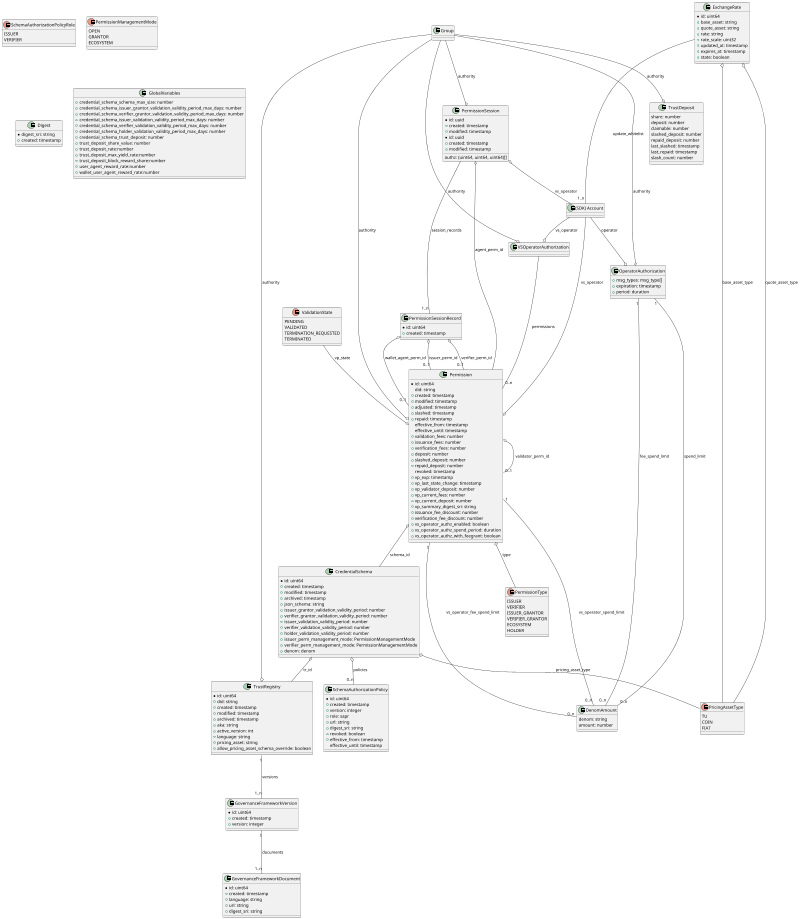

# Verifiable Public Registry v4 Specification

**Latest draft:** [spec v4-draft2](https://verana-labs.github.io/verifiable-trust-vpr-spec/)

**Latest stable:** [spec v3](https://verana-labs.github.io/verifiable-trust-vpr-spec/index-v3.html)

**Editors:**

~ [Fabrice Rochette](https://www.linkedin.com/in/fabricerochette) ([The Verana Foundation](https://verana.io))

**Contributors:**

~ [Ariel Gentile](https://www.linkedin.com/in/aogentile/)
~ [Mathieu Gauthron](https://www.linkedin.com/in/mathieugauthron/)
~ [Pratik Kumar](https://www.linkedin.com/in/pratik-kumar-/)

**Participate:**

~ [GitHub repo](https://github.com/verana-labs/verifiable-trust-vpr-spec)

~ [File a bug](https://github.com/verana-labs/verifiable-trust-vpr-spec/issues)

~ [Commit history](https://github.com/verana-labs/verifiable-trust-vpr-spec/commits/main)

---

## Abstract

The internet is broken. Existing communication channels are insecure and outdated. Because they rely on public identifiers - like email addresses, usernames, or phone numbers - anyone who knows your identifier can reach you, whether you invited them or not.

Worse, there’s no reliable way to verify the identity of either service providers or users. This leaves the door wide open to spam, phishing, fraud, and identity theft.

On the service side, each provider imposes its own fragmented registration process, often with complex password requirements or forced reliance on federated login systems, effectively handing control over to large third-party platforms.

Although the World Wide Web was originally built for openness and interoperability, dominant players have reshaped it into a closed, centralized system that most people and organizations now depend on. Privacy has become an afterthought, and personal data is routinely harvested, exploited, or leaked.

To rebuild a trustworthy internet, we need new communication channels - channels that are secure by design, based on mutual verification, and governed by decentralized trust.

Connecting to a service, proving who you are, or creating an account should be as simple and safe as presenting a verifiable credential.

A universal, open trust layer is essential for this vision to succeed.

That’s the purpose of **Verifiable Trust**. The concept of **Verifiable Trust** is specified in the [Verifiable Trust spec](https://github.com/verana-labs/verifiable-trust-spec).

This specification deals with the Verifiable Public Registry (VPR), a decentralized registry of registries, part of the Verifiable Trust concept.

## About this Document

In order to fully understand the concepts developed in this document, you should have some basic knowledge of [[ref:DID]], [[ref:DIDComm]], [[ref:VS]], [[ref:trust registry]], ledger-based applications, and more generally, all terms present in the [Terminology](#terminology) section.

:::note
Before exploring this spec, it is highly recommended to **first read** the [Verifiable Trust Spec](https://verana-labs.github.io/verifiable-trust-spec/).
:::

## Introduction

### What is a Trust Registry?

*This section is non-normative.*

A trust registry is an approved list of recognized ecosystem participants, such as trust registry operators, credential [[ref: issuers]] and [[ref: verifiers]] that are authorized to onboard ecosystem participants, and or issue/verify certain credentials in an ecosystem.

A trust registry typically expose APIs that are consumed by services that would like to [[ref: query]] its database, and take decisions based on the returned result:

- can [[ref: participant]] #1 issue credential for `schema` ABC of `ecosystem` E1?
- can [[ref: participant]] #2 request credential presentation of credential issued by `issuer` DEF from `schema` GHI of `ecosystem` E2, for `jurisdiction` France in `context` CONTEXT?

### What is a Verifiable Public Registry?

*This section is non-normative.*

A Verifiable Public Registry (VPR) is a “registry of registries”, a public service that provides foundational infrastructure for decentralized trust ecosystems. It offers:

- trust registry management:  
  ecosystems can create and manage their own trust registries, each with:
  - defined [[ref: credential schemas]]
  - assigned roles for [[ref: issuers]], [[ref: verifiers]], and [[ref: grantors]] (trust registry operators)
  - custom business models and permission policies

- query API for trust resolution:  
  A standardized API used by [[ref: verifiable services]] (VSs) and [[ref: verifiable user agents]] (VUAs) to perform trust resolution, enabling them to query registry data and validate roles and permissions in real time.


Permission directory is intended to be **crawled by indexers**, which resolve the listed DIDs, identify associated [[ref: verifiable services]], and index them.

Indexers may expose this data through APIs for querying the indexed services or use it to build a search engine for querying the database of indexed [[ref: verifiable services]].

### Conformance

As well as sections marked as non-normative, all authoring guidelines, diagrams, examples, and notes in this specification are non-normative. Everything else in this specification is normative.
The key words MAY, MUST, MUST NOT, OPTIONAL, RECOMMENDED, REQUIRED, SHOULD, and SHOULD NOT in this document are to be interpreted as described in [BCP 14](https://datatracker.ietf.org/doc/html/bcp14) [RFC2119](https://w3c.github.io/vc-data-model/#bib-rfc2119) [RFC8174](https://w3c.github.io/vc-data-model/#bib-rfc8174) when, and only when, they appear in all capitals, as shown here.

## Terminology

[[def: account, accounts]]:
~ A [[ref: verifiable public registry]] account.

[[def: applicant, applicants]]:
~ A [[ref: account]] that starts a [[ref: validation process]].

[[def: authority, authorities]]:
~ An [[ref: group]] which is the owner of a specific resource in an [[ref: VPR]].

[[def: credential schema, credential schemas]]:
~ An [[ref: VPR]] resource which represents a verifiable credential definition and the associated permissions and business rules for issuing, verifying or holding a credential linked to this credential schema.

[[def: credential schema permission, credential schema permissions, CSP]]:
~ A permission, linked to a [[ref: credential schema]], that represent, in a given [[ref: ecosystem]], a grant for being [[ref: issuer]], [[ref: verifier]], [[ref: issuer grantor]], or [[ref: verifier grantor]] of a [[ref: credential schema]].

[[def: decentralized identifier, DID, DIDs]]:
~ A decentralized identifier, as specified in [[spec-norm:DID-CORE]].

[[def: decentralized identifier communication, DIDComm]]:
~ [DIDComm](https://identity.foundation/didcomm-messaging/spec/) uses [[ref: DIDs]] to establish confidential, ongoing connections.

[[def: denom, denoms]]:
~ Token that has been configured and is recognized in a [[ref: VPR]], example: uvna, USDC.  

[[def: native denom]]:
~ Native token of a [[ref: VPR]], example: uvna.

[[def: ecosystem, ecosystems]]: a network of interacting entities, both technical and human, that work together to establish and maintain digital trust. It encompasses applications, credentials, governance frameworks, and the underlying technical infrastructure, all designed to facilitate trustworthy interactions.

[[def: ecosystem governance framework, EGF]]:
~ The governance framework (GF) of an ecosystem].

[[def: ecosystem governance authority, EGA]]:
~ The governance authority (GA) of an [[ref: ecosystem]].

[[def: entity, entities]]:
~ An [[ref: account]] controller.

[[def: estimated transaction fees]]:
~ Estimated fees required, in [[ref: denom]], that is passed when execute a [[ref: transaction]] in an [[ref: VPR]]. Usually, a estimated transaction fees are always slightly greater than [[ref: transaction fees]], to make sure the execution of the transaction will not be aborted for an out-of-gas situation. Unused gas is refunded to account.

[[def: governance framework, GF]]:
~ The governance framework (GF) of a [[ref: VPR]].

[[def: governance authority, GA]]:
~ The governance authority (GA) of a [[ref: VPR]].

[[def: grantor, grantors]]:
~ A role an [[ref: entity]] is granted by an [[ref: ecosystem]] for operating its [[ref: trust registry]].

[[def: group, groups]]:
~ A [[ref: verifiable public registry]] group.

[[def: holder, holders]]:
~ A role an entity might perform by possessing one or more verifiable credentials and generating verifiable presentations from them. A holder is often, but not always, a [[ref: subject]] of the verifiable credentials they are holding. Holders store their credentials in credential repositories. Example holders include organizations, persons, things.

[[def: issuer, issuers]]:
~ A role an [[ref: entity]] is granted by an [[ref: ecosystem]] or an [[ref: issuer grantor]] for issuing credentials of a given [[ref: credential schema]] to [[ref: holders]].

[[def: issuer grantor, issuer grantors]]:
~ A trust registry operator role an [[ref: entity]] is granted by an [[ref: ecosystem]] for a given [[ref: credential schema]] for adding or revoking issuers.

[[def: json schema, json schemas, Json Schema, Json Schemas]]
~ a Json Schema, as specified in [https://json-schema.org/specification](https://json-schema.org/specification).

[[def: keeper]]:
~ A storage map(key, value) in the ledger of an [[ref: VPR]].

[[def: linked-vp]]:
~ A presentation of a [[ref: verifiable credential]] as specified in [LINKED-VP](https://identity.foundation/linked-vp/).

[[def: participant, participants]]:
~ An entity that is recognized by one or several ecosystem(s) in a [[ref: VPR]].

[[def: query]]:
~ A read-only action that perform some reading in an [[ref: VPR]] and returns value.

[[def: subject, subjects]]:
~ A thing about which claims are made. Example subjects include human beings, animals, things, and organization, a [[ref: DID]]...

[[def: transaction, transactions]]:
~ An action that modifies the ledger of an [[ref: VPR]] and which execution requires transaction fees.

[[def: transaction fees]]:
~ Fees required, in [[ref: denom]], to execute a [[ref: transaction]] in an [[ref: VPR]].

[[def: trust deposit, trust deposits]]:
~ A financial deposit that is used as a trust guarantee. For a given [[ref: authority]], its trust deposit is increased when running validation process (either as an [[ref: applicant]] or as a [[ref: validator]]).

[[def: trust fee, trust fees]]:
~ Fees paid by a [[ref: participant]] that are distributed to other [[ref: participants]].

[[def: network fee, network fees]]:
~ Fees paid by a [[ref: participant]] that are distributed to network validators and trust deposit holders.

[[def: trust unit, trust units, TU, TUs]]:
~ A fake denom that is not usable as a token (cannot be transferred, or used for paying in transactions). Trust unit is used to define fees in Permissions. Fees defined in trust units are automatically converted to [[ref: native denom]] when a transaction is executed, using an exchange rate `TU/[[ref: native denom]]`. Trust unit is used to compensate [[ref: native denom]] fluctuation.

[[def:trust registry, trust registries]]
~ An approved list of [[ref: issuers]] and [[ref: verifiers]] that are authorized to issue/verify certain credentials in an ecosystem.

[[def: URI, URIs]]
~ An Universal Resource Identifier, as specified in [rfc3986](https://datatracker.ietf.org/doc/html/rfc3986).

[[def: active permission, active permissions]]:
~ A credential schema permission of a given type, which effective_from timestamp is lower than current timestamp, and (effective_until timestamp is null or greater than current timestamp), and revoked is null and slashed is null.

[[def: future permission, future permissions]]:
~ A credential schema permission of a given type, which effective_from timestamp is higher than current timestamp, and (effective_until timestamp is null or greater than effective_from timestamp), and revoked is null and slashed is null.

[[def: validation process]]:
~ A process run by [[ref: applicants]] that want to, for a specific [[ref: credential schema]], be a [[ref: issuer]], be a [[ref: verifier]], or simply hold a verifiable credential linked to the [[ref: credential schema]].

[[def: validator]]:
~ A role an [[ref: entity]] performs by participating in validation processes with [[ref: applicants]] in order to register them as [[ref: issuer]], or [[ref: verifier]] of a [[ref: credential schema]], or to deliver a verifiable credential to them.

[[def: verifiable public registry, VPR, VPRs]]:
~ a public, normally decentralized, ledger-based network, which provides: trust registry features, that can be used by all its [[ref: participants]]: create trust registries, for each trust registry, define its credential schemas, who can issue, verify credential of a specific credential schema,... and a tokenized business model for charging/rewarding [[ref: participants]].

[[def: verifiable service, verifiable services, VS, VSs]]:
~ A service, identified by a resolvable [[ref: DID]] that can be deployed anywhere by its owner, and that is conforming to this spec and has a resolvable Proof-of-Trust. See [[ref: VT Spec]].

[[def: verifiable user agent, verifiable user agents, VUA, VUAs]]:
~ A user agent for accessing and using [[ref: VSs]]. To be considered a [[ref: VUA]], a user agent must conform and enforce this spec, such as presenting a proof of trust to end user before accepting connecting to [[ref: VS]] compliant services, and refuse connecting to not compliant services. See [[ref: VT Spec]].

[[def: Verifiable Trust Specification, Verifiable Trust Spec, VT Specs, VT Spec]]:
~ see [VT Spec](https://github.com/verana-labs/verifiable-trust-spec).

[[def: verifier, verifiers]]:
~ A role an [[ref: entity]] is granted by an [[ref: ecosystem]] or a [[ref: verifier grantor]] for verifying credentials of a given [[ref: credential schema]].

[[def: verifier grantor, verifier grantors]]:
~ A trust registry operator role an [[ref: entity]] is granted by an [[ref: ecosystem]] for a given [[ref: credential schema]] for adding or revoking verifiers.

[[def: verifiable credential, verifiable credentials]]:
~ A verifiable credential as defined in [[spec-norm:VC-DATA-MODEL]].

## Naming Conventions

### In this spec

- For clarity, Camel Case is used for naming Modules, Entities, Objects, etc.

### In Implementations

- All APIs MUST return valid JSON.
- All JSON content MUST use Snake Case for object, attribute... names.
- Object attributes and Json Content in general can be returned in any order.

## Features of a Verifiable Public Registry (VPR)

### Trust Registry Management

*This section is non-normative.*

In an [[ref: VPR]], any [[ref: authority]] can create a `TrustRegistry` entry that represents a [[ref: trust registry]] of an ecosystem. Each `TrustRegistry` entry must provide, at a minimum:

- an ecosystem controlled resolvable [[ref: DID]];
- one or more [[ref: ecosystem governance framework]] document(s);
- zero or more [[ref: credential schemas]].

The Verifiable Public Registry (VPR) is agnostic to the specific DID methods used. Trust resolution is performed externally, outside the VPR, allowing flexibility and interoperability across ecosystems.


### Credential Schemas and Permissions

*This section is non-normative.*

[[ref: Credential schemas]] are created and managed by trust registry authority ([[ref: ecosystems]]). Each [[ref: Credential schema]] includes, at a minimum:

- A **Json Schema** that defines the structure of the corresponding [[ref: verifiable credential]]
- A **PermissionManagementMode** for **issuance policy**, which determines how `ISSUER` permissions are granted. Modes include:
  - `OPEN`: `ISSUER` permissions can be created by anyone.
  - `ECOSYSTEM`: `ISSUER` permissions are granted directly by the [[ref: ecosystem]], the trust registry authority
  - `GRANTOR`: `ISSUER` permissions are granted by one or several [[ref: issuer grantor]](s) (trust registry operator(s) responsible for selecting issuers for the credential schema of this [[ref: ecosystem]]), selected by the [[ref: ecosystem]].
- A **PermissionManagementMode** for **verification policy**, which determines how `VERIFIER` permissions are granted. Modes include:
  - `OPEN`: `VERIFIER` permissions can be created by anyone.
  - `ECOSYSTEM`: `VERIFIER` permissions are granted directly by the [[ref: ecosystem]], the Trust Registry authority
  - `GRANTOR`: `VERIFIER` permissions are granted by one or several [[ref: verifier grantor]](s) (trust registry operator(s) responsible for selecting verifiers for the credential schema of this [[ref: ecosystem]]), selected by the [[ref: ecosystem]].
- A **Permission tree** that defines the roles and relationships involved in managing the schema’s lifecycle. Each created permission in the tree can define business rules, see below [Business Models](#business-models).


Participant roles are defined in the table below:

| **Participant Role**   | **Description**                                                  |
|-----------------------|------------------------------------------------------------------|
| **Ecosystem**    | Create and control trust registries and credential Schemas. Recognize other participants by granting permission(s) to them.        |
| **Issuer Grantor**    | Trust Registry operator that grants Issuer permissions to candidate issuers.                   |
| **Verifier Grantor**  | Trust Registry operator that grants Verifier permissions to candidate verifiers.               |
| **Issuer**            | Can issue credentials of this schema.                            |
| **Verifier**          | Can request presentation of credentials of this schema.          |
| **Holder**            | Holds a credential.   |

Example of a Json Schema credential schema:

```json
{
  "$id": "vpr:verana:mainnet/cs/v1/js/VPR_CREDENTIAL_SCHEMA_ID", // ignored, will be generated
  "$schema": "https://json-schema.org/draft/2020-12/schema",
  "title": "ExampleCredential",
  "description": "ExampleCredential using JsonSchema",
  "type": "object",
  "properties": {
    "credentialSubject": {
      "type": "object",
      "properties": {
        "id": {
          "type": "string",
          "format": "uri"
        },
        "firstName": {
          "type": "string",
          "minLength": 0,
          "maxLength": 256
        },
        "lastName": {
          "type": "string",
          "minLength": 1,
          "maxLength": 256
        },
        "expirationDate": {
          "type": "string",
          "format": "date"
        },
        "countryOfResidence": {
          "type": "string",
          "minLength": 2,
          "maxLength": 2
        }
      },
      "required": [
        "id",
        "lastName",
        "birthDate",
        "expirationDate",
        "countryOfResidence"
      ]
    }
  }
}
```

To participate in an [[ref: ecosystem]] and assume a role associated with a specific [[ref: credential schema]]:

- if schema is `OPEN` for issuance and/or verification: an entity must have an [[ref: account]] in the [[ref: VPR]] and self-create its permission.

- if schema is not `OPEN` for issuance and/or verification: an entity must have an [[ref: account]] in the [[ref: VPR]] and complete a [[ref: validation process]] to obtain the required permission.

The [[ref: validation process]] involves two parties:

- The [[ref: applicant]] — the entity requesting permission for a credential schema within the ecosystem.  
- The [[ref: validator]] — an entity that already holds permission for the same credential schema and has been delegated authority to validate applicants and issue permissions.

Running a validation process **typically involves the payment of [[ref: trust fees]]**. [[ref: Trust fee]] amount to be paid by the [[ref: applicant]] is defined in the permission of the [[ref: validator]] involved in the [[ref: validation process]]:


### DID Indexing

*This section is non-normative.*

The Permission registry is a can be used by crawlers to index the metadata associated with [[ref: verifiable services]].

Search engines can iterate over the permissions, and index [[ref: VSs]] by resolving the service identifier (at the moment a [[ref: DID]], that could be extended in the future), verify if service is a [[ref: verifiable service]], and in such a case extracting their verifiable metadata, such as [[ref: linked-vp]] presented credentials.

The index is particularly important for [[ref: verifiable user agents]], such as social browsers, CDN enabled browsers... However, it can also be leveraged by **traditional, form-based search engines**, which may return simple links for accessing [[ref: VSs]].


### Business models

#### Trust Deposit

*This section is non-normative.*

In a [[ref: VPR]], each [[ref: account]] is associated with a [[ref: trust deposit]].

This [[ref: trust deposit]] is automatically funded through transactions involving **trust operations**, such as:

- Paying trust fees between participants when enforcing ecosystem governance rules for services, credential issuance, or presentation...

The trust deposit is fundamental to the **"Proof-of-Trust" (PoT)** mechanism of the [[ref: Verifiable Trust Specification]], and it operates as follows:

- The more you use the [[ref: VPR]], the more your [[ref: trust deposit]] grows.
- Trust deposits **generate yield**: block execution fees are distributed not only to network validators, but also to **trust deposit holders**.
- **network-level penalties**: If a participant violates the [[ref: governance framework]] of the [[ref: VPR]] or engages in **fraudulent activity**, their **trust deposit may be partially or fully slashed** by the [[ref: VPR]]'s governance authority.
- **ecosystem-level penalties**: If a participant operates within an ecosystem (e.g., as a [[ref: grantor]], [[ref: issuer]], [[ref: verifier]], or [[ref: holder]],...) and **fails to comply** with that ecosystem’s governance framework (EGF), their **ecosystem-specific trust deposit can be slashed** by the corresponding ecosystem governance authority.
- A slashed deposit must be **refilled** to continue using the services that triggered the penalty.
- When a participant **withdraws from an ecosystem**, the associated accumulated trust deposit **may be released**.
- Released deposits can be **reused** in other services or **withdrawn**, however, withdrawals incur penalties, and **a portion of the withdrawn amount is burned**.
- Holding a large trust deposit **does not grant governance rights** in the [[ref: VPR]]: participants who generate high transaction volume **cannot gain control** over the governance of the [[ref: VPR]] solely through usage or deposit size.

This system ensures that participation in the trust ecosystem is backed by economic accountability, reinforcing the integrity, governability and verifiability of the [[ref: VPR]].

#### Object creation

*This section is non-normative.*

The following operations **only require payment of network fees** (no trust deposit is involved):

- **Trust Registries**: requires paying only [[ref: network fees]]  
- **Credential Schemas**: requires paying only [[ref: network fees]]  


- Updating the **governance framework documents** of an ecosystem trust registry  
- Updating a Credential Schema
- Updating a Trust Registry
- ...

#### Validation process trust fees

*This section is non-normative.*

We've explained in the [Credential Schemas and Permissions](#credential-schemas-and-permissions) section above what is a validation process.

The table below summarizes the possible combinations of applicants and validators:

| Payee → Payer ↓  | Ecosystem                      | Issuer Grantor                        | Verifier Grantor                    | Issuer                              | Verifier | Holder                                  |
|------------------|-------------------------------------|---------------------------------------|-------------------------------------|-------------------------------------|----------|-----------------------------------------|
| Issuer Grantor   | renewable subscription (1)          |                                       |                                     |                                     |          |                                         |
| Verifier Grantor | renewable subscription (2)          |                                       |                                     |                                     |          |                                         |
| Issuer           | renewable subscription (3)          | renewable subscription (1)            |                                     |                                     |          |                                         |
| Verifier         | renewable subscription (4)          |                                       | renewable subscription (2)          |                                     |          |                                         |
| Holder           |                                     |                                       |                                     | renewable subscription              |          |                                         |

- (1): if *issuer mode* is set to GRANTOR.
- (2): if *verifier mode* is set to GRANTOR.
- (3): if *issuer mode* is set to ECOSYSTEM.
- (4): if *verifier mode* is set to ECOSYSTEM.

Validation process is started by the applicant.

*Example of a candidate [[ref: issuer]] ([[ref: applicant]]) that would like to be granted an ISSUER permission for a credential schema of an ecosystem, by a [[ref: validator]] that has a ISSUER_GRANTOR permission:*

```plantuml
scale max 800 width
actor "Applicant\n(issuer candidate)\nAccount" as ApplicantAccount 
actor "Applicant\n(issuer candidate)\nVUA" as ApplicantBrowser 

actor "Validator\n(issuer grantor)\nVS" as ValidatorVS
actor "Validator\n(issuer grantor)\nAccount" as ValidatorAccount

participant "Verifiable Public Registry" as VPR #3fbdb6

ApplicantAccount --> VPR: create new validation with Validator 
VPR <-- VPR: create validation entry.
ApplicantAccount <-- VPR: validation entry created
ApplicantBrowser --> ValidatorVS: connect to validator VS DID found in validation.perm\nby creating a DIDComm connection
ApplicantBrowser <-- ValidatorVS: DIDComm connection established.
ApplicantBrowser --> ValidatorVS: I want to proceed with validation.id=...
ValidatorVS --> ValidatorVS: load validation with id=...\nand verify the associated validation.perm is referring to me
ApplicantBrowser <-- ValidatorVS: request proof of control\nof validation.applicant account (blind sign)
ApplicantBrowser --> ValidatorVS: send blind sign proof of operator account
ApplicantBrowser <-- ValidatorVS: proof accepted, you are the operator\nof validation entry, I trust you.
ApplicantBrowser <-- ValidatorVS: which DID do you want to register as an issuer?
ApplicantBrowser --> ValidatorVS: send DID
ValidatorVS --> ValidatorVS: resolve DID and get pub keys
ApplicantBrowser <-- ValidatorVS: request proof of ownership\nof the DID to be registered in the ISSUER permission (blind sign)
ApplicantBrowser --> ValidatorVS: send blind sign proofs
ApplicantBrowser <-- ValidatorVS: proof accepted, you are the controller of this DID, I trust you.
note over ApplicantBrowser, ValidatorVS #EEEEEE: (*optional*) repeat the following until tasks completed
ApplicantBrowser <-- ValidatorVS: Are you a legitimate issuer?\nProve it, by filling forms, sending documents...
ApplicantBrowser --> ValidatorVS: perform requested tasks...
note over ApplicantBrowser, ValidatorVS #EEEEEE: tasks completed
ApplicantBrowser <-- ValidatorVS: Your are a legitimate candidate. I'll now create an ISSUER permission for your account and DID.
ValidatorAccount --> VPR #3fbdb6: set validation.state to VALIDATED\ncreate permission(s) for applicant.
VPR --> ValidatorAccount: Receive trust fees.
ApplicantBrowser <-- ValidatorVS: notify ISSUER permission created for your account and DID.\nDID can now issue credentials of this schema.
```

The **total fees** paid by the applicant consists of:

- The validation [[ref: trust fees]] defined in the permission of the validator participating in the validation process, **plus**
- An additional amount equal to the `trust_deposit_rate` of that validation [[ref: trust fees]], which is **allocated to the applicant’s trust deposit** when the validation process begins.
- [[ref: network fees]] (not part of the escrowed amount).

Example, using 20% for `trust_deposit_rate`:


Upon completion of the validation process, **escrowed trust fees are distributed to the validator** as follows:

- A portion defined by `trust_deposit_rate` is allocated to the **validator’s trust deposit**.  
- The remaining amount is **transferred directly to the validator’s wallet**.


#### "Pay-Per" trust fees

*This section is non-normative.*

**Pay-per-issuance** and **pay-per-verification** [[ref: trust fees]] are defined **at the permission level** for each role within the ecosystem.


Entities acting as **issuers** or **verifiers** for a given credential schema **may be required to pay trust fees** based on the schema's configuration and permission tree.

If trust fee payment is required, the entity **must execute a transaction** in the [[ref: VPR]] to pay the appropriate [[ref: trust fees]] **before issuing or verifying a credential**.

Key Points for "Pay-Per" Business Models

- For a given credential schema, **ecosystem** and their participants may define **pay-per-issuance** (or **pay-per-verification**) [[ref: trust fees]] in their respective permissions.

- In such cases, a participant ISSUER (or VERIFIER) **must pay**:
  - The corresponding **issuance** (or **verification**) trust fees for each involved permission;
  - An additional amount equal to the `trust_deposit_rate` of the calculated trust fees, allocated to the **applicant’s trust deposit**;
  - An amount equal to `wallet_user_agent_reward_rate` of the calculated trust fees, used to **reward the Wallet User Agent**;
  - An amount equal to `user_agent_reward_rate` of the calculated trust fees, used to **reward the User Agent**.

Fee Distribution Model

Trust fees are **consistently distributed** across participants:

- A portion defined by `trust_deposit_rate` is allocated to the **participant’s trust deposit**.  
- The remaining portion is **transferred directly to the participant’s wallet**.

:::note
**Wallet User Agents** and **User Agents** that implement the [[ref: VT spec]] **must verify** that the ISSUER or VERIFIER has fulfilled the required trust fee payment.  
If not, they **must reject** the issuance or verification request.

Note: The **User Agent** and **Wallet User Agent** may refer to the same implementation.
:::

Distribution example for the issuance by ISSUER #C of a credential, using the permission tree above, 20% for `trust_deposit_rate`, 10% for `wallet_user_agent_reward_rate` and `user_agent_reward_rate`.


Distribution example for the verification by VERIFIER #E of a credential issued by ISSUER #C, using the permission tree above, 20% for `trust_deposit_rate`, 10% for `wallet_user_agent_reward_rate` and `user_agent_reward_rate`.


## Governance of a VPR

*This section is non-normative.*

A [[ref: governance framework]] must define the governance rules that apply to a [[ref: VPR]].

A designated [[ref: governance authority]] is responsible for **enforcing these rules** and, when necessary, **applying financial sanctions** to participants who violate the rules.

:::note
**Ecosystem Governance Frameworks (EGFs)** operate **independently** from the [[ref: VPR]] [[ref: governance framework]].

While the **VPR governance framework** defines the global rules for operating the Verifiable Public Registry (e.g., trust deposits, fee distribution, slashing conditions), each **ecosystem** must define its own **EGF** to govern roles, permissions, credential policies, and compliance within its specific domain.

This separation ensures that ecosystems remain autonomous and can tailor governance to their unique needs, without being constrained by the global rules of the VPR.
:::

## Data model

For simplicity, the data model is presented using an **object-relational structure**. However, this representation may not be optimal for all implementation scenarios.

Implementors are responsible for **adapting the data model** to suit their chosen architecture.  
For example, a **key-value store** may be more appropriate for a **ledger-based implementation** than a relational model.



### TrustRegistry

`TrustRegistry`:

- `id` (uint64) (*mandatory*): the id of the trust registry.
- `did` (string) (*mandatory*): the did of the ecosystem.
- `authority` (group) (*mandatory*): [[ref: group]] that controls this entry.
- `created` (timestamp) (*mandatory*): timestamp this TrustRegistry has been created.
- `modified` (timestamp) (*mandatory*): timestamp this TrustRegistry has been modified.
- `archived` (timestamp) (*mandatory*): timestamp this TrustRegistry has been archived.
- `aka` (string) (*optional*): optional additional URI of this trust registry.
- `language` (string) (*mandatory*): primary language tag ([rfc1766](https://www.ietf.org/rfc/rfc1766.txt)) of this trust registry.
- `active_version` (int): (*mandatory*) active governance framework version.

### GovernanceFrameworkVersion

`GovernanceFrameworkVersion`:

- `id` (uint64) (*mandatory*): the id of the schema.
- `tr_id` (uint64) (*mandatory*): the id of the trust registry that controls this `GovernanceFrameworkVersion` entry.
- `created` (timestamp) (*mandatory*): timestamp this GovernanceFrameworkVersion has been created.
- `version` (int) (*mandatory*): version of this GF. MUST Starts with 1.

### GovernanceFrameworkDocument

`GovernanceFrameworkDocument`

- `id` (uint64) (*mandatory*): the id of the schema.
- `gfv_id` (uint64) (*mandatory*): the id of the `GovernanceFrameworkVersion` entry.
- `created` (timestamp) (*mandatory*): timestamp this GovernanceFrameworkDocument has been created.
- `language` (string) (*mandatory*): primary language tag ([rfc1766](https://www.ietf.org/rfc/rfc1766.txt)) of this trust registry.
- `url` (string) (*mandatory*): URL where the document is published.
- `digest_sri` (string) (*mandatory*): digest_sri of the document.

### CredentialSchema

`CredentialSchema`:

**General Info**:

- `id` (uint64) (*mandatory*): the id of the schema.
- `tr_id` (uint64) (*mandatory*): the id of the trust registry that controls this `CredentialSchema` entry.
- `created` (timestamp) (*mandatory*): timestamp this CredentialSchema has been created.
- `modified` (timestamp) (*mandatory*): timestamp this CredentialSchema has been modified.
- `archived` (timestamp) (*mandatory*): timestamp this CredentialSchema has been archived.
- `json_schema` (string) (*mandatory*): Json Schema used for issuing credentials based on this schema.
- `issuer_grantor_validation_validity_period` (number) (*mandatory*): number of days after which an issuer grantor validation process expires and must be renewed.
- `verifier_grantor_validation_validity_period` (number) (*mandatory*): number of days after which a verifier grantor validation process expires and must be renewed.
- `issuer_validation_validity_period` (number) (*mandatory*): number of days after which an issuer validation process expires and must be renewed.
- `verifier_validation_validity_period` (number) (*mandatory*): number of days after which a verifier validation process expires and must be renewed.
- `holder_validation_validity_period` (number) (*mandatory*): number of days after which an holder validation process expires and must be renewed.
- `issuer_perm_management_mode` (PermissionManagementMode) (*mandatory*): defines how permissions are managed for issuers of this `CredentialSchema`. OPEN means anyone can issue credential of this schema; GRANTOR means a validation process MUST be run between a candidate ISSUER and an ISSUER_GRANTOR in order to create an ISSUER permission; ECOSYSTEM means a validation process MUST be run between a candidate ISSUER and the trust registry owner (ecosystem) of the `CredentialSchema` entry in order to create an ISSUER permission;
- `verifier_perm_management_mode` (PermissionManagementMode) (*mandatory*): defines how permissions are managed for verifiers of this `CredentialSchema`. OPEN means anyone can verify credentials of this schema (does not implies that a payment is not necessary); GRANTOR means a validation process MUST be run between a candidate VERIFIER and a VERIFIER_GRANTOR in order to create a VERIFIER permission; ECOSYSTEM means a validation process MUST be run between a candidate VERIFIER and the trust registry owner (ecosystem) of the `CredentialSchema` entry in order to create a VERIFIER permission;
- `pricing_asset_type` (PricingAssetType) (*mandatory*): used asset for paying business fees. Can be TU (Trust Unit),  COIN (a token available on the VPR chain), FIAT (means chain is used for settlement only and payment is done off-chain). Not that in all cases, trust deposits are always handled in `denom`.
- `pricing_asset` (string) (*mandatory*): `"tu"` if `pricing_asset_type` is set to TU, else examples: COIN: `denom` `"uvna"`, `"ufoo"`, `"ibc/3A0F9C2E4E2A9B7D6F..."`, `"factory/verana1.../ueurv"`, FIAT: `"USD"`, `"GBP"`,...

### SchemaAuthorizationPolicy

`SchemaAuthorizationPolicy`:

- `id` (uint64) (*mandatory*): unique identifier of this authorization policy.
- `schema_id` (uint64) (*mandatory*): id of the `CredentialSchema` this policy applies to.
- `created` (timestamp) (*mandatory*): timestamp when this policy entry was created.
- `version` (integer) (*mandatory*): version number of this policy for the given `(schema_id, role)`.
- `role` (SchemaAuthorizationPolicyRole) (*mandatory*): role this policy applies to (`ISSUER` or `VERIFIER`).
- `url` (string) (*mandatory*): URL where the policy document is published.
- `digest_sri` (string) (*mandatory*): SRI hash of the policy document, used to guarantee integrity and immutability.
- `effective_from` (timestamp) (*mandatory*): timestamp from which this policy version is in force.
- `effective_until` (timestamp) (*optional*): timestamp until which this policy version is in force, if time-limited.
- `revoked` (boolean) (*mandatory*): indicates whether this policy version has been revoked and must no longer be used.

### Permission

`Permission`:

- `id` (uint64) (*mandatory*): the id of the perm.
- `schema_id` (uint64) (*mandatory*): the id of the related `CredentialSchema` entry.
- `type` (PermissionType): ISSUER, VERIFIER, ISSUER_GRANTOR, VERIFIER_GRANTOR, ECOSYSTEM, HOLDER
- `did` (string) (*optional*): [[ref: DID]] this permission refers to. MUST conform to [[spec-norm:RFC3986]].
- `authority` (group) (*mandatory*): [[ref: group]] that owns this permission.
- `vs_operator` (account) (*mandatory*): verifiable service agent account. This is the account that will have the right to create or update permission sessions.
- `created` (timestamp) (*mandatory*): timestamp this `Permission` has been created.
- `adjusted` (timestamp) (*mandatory*): timestamp this `Permission` has been adjusted.
- `slashed` (timestamp) (*mandatory*): timestamp this `Permission` has been slashed.
- `repaid` (timestamp) (*mandatory*): timestamp this `Permission` has been repaid.
- `effective_from` (timestamp) (*optional*): timestamp from which (inclusive) this `Permission` is effective.
- `effective_until` (timestamp) (*optional*): timestamp until when (exclusive) this `Permission` is effective, null if no time limit has been set for this permission.
- `modified` (timestamp) (*mandatory*): timestamp this Permission has been modified.
- `validation_fees` (number) (*mandatory*): price to pay by an applicant to a validator (`authority` grantee of this perm) for running a validation process for a given validation period. Must be an integer. Default to 0. Considered unit depends on `pricing_asset_type` and `pricing_asset` configuration of related schema.
- `issuance_fees` (number) (*mandatory*): fees requested by grantee `authority` of this perm when a credential is issued. Must be an integer. Default to 0. Considered unit depends on `pricing_asset_type` and `pricing_asset` configuration of related schema.
- `verification_fees` (number) (*mandatory*): fees requested by grantee `authority` of this perm when a credential is verified. Must be an integer. Default to 0. Considered unit depends on `pricing_asset_type` and `pricing_asset` configuration of related schema.
- `deposit` (number) (*mandatory*): accumulated *grantee* deposit in the context of the *use* of this permission (including the validation process), in [[ ref: native denom ]]. Usually, it is incremented when for example, for a ISSUER type `Permission` `perm`, issuer issues credentials that require paying issuance fees: an additional % of the fees is charged to issuer and sent to its deposit, corresponding deposit amount increases this `perm.deposit` value as well. If `perm` is, let's say revoked, then corresponding `perm.deposit` value is freed from `perm.grantee` Trust Deposit.
- `slashed_deposit` (number) (*mandatory*): part of the deposit in [[ ref: native denom ]] that has been slashed.
- `repaid_deposit` (number) (*mandatory*): part of the slashed deposit in [[ ref: native denom ]] that has been repaid.
- `revoked` (timestamp) (*optional*): manual revocation timestamp of this Perm.
- `validator_perm_id` (uint64) (*optional*): permission of the validator assigned to the validation process of this permission, ie *parent node* in the `Permission` tree.
- `vp_state` (enum) (*mandatory*): one of PENDING, VALIDATED, TERMINATED, TERMINATION_REQUESTED.
- `vp_exp` (timestamp) (*optional*): validation expiration timestamp. This expiration timestamp is for the validation process itself, not for the issued credential or `Permission` expiration timestamp.
- `vp_last_state_change` (timestamp) (*mandatory*)
- `vp_validator_deposit`: number (*optional*): accumulated validator trust deposit, in [[ref: denom]].
- `vp_current_fees` (number) (*mandatory*): current action escrowed fees that will be paid to [[ref: validator]] upon validation process completion, in [[ref: denom]].
- `vp_current_deposit` (number) (*mandatory*): current action trust deposit, in [[ref: denom]].
- `vp_summary_digest_sri` (string) (*optional*): an optional digest SRI, set by [[ref: validator]], of a summary of the information, proofs... provided by the [[ref: applicant]].
- `issuance_fee_discount`: (number) (*mandatory*): default to 0 (no discount). Maximum 1 (100% discount). Can be set to an ISSUER_GRANTOR, ISSUER permission (if GRANTOR mode) or an ISSUER permission (ECOSYSTEM mode) to reduce (or void) calculated issuance fees for subtree of permissions. Note: this should generally not be used because it reduces or void commission of all related ecosystem participants.
- `verification_fee_discount`: (number) (*mandatory*): default to 0 (no discount). Maximum 1 (100% discount). Can be set to a VERIFIER_GRANTOR, VERIFIER permission (if GRANTOR mode) and/or a VERIFIER permission (ECOSYSTEM mode) to reduce (or void) calculated fees for subtree of permissions. Note: this should generally not be used because it reduces or void commission of all related ecosystem participants.
- `vs_operator_authz_enabled`: boolean (*mandatory*): if set to true, authorize this vs_operator to execute CreateOrUpdatePermissionSession *on behalf* of `authority` account (trust fees will be paid by authority account)
- `vs_operator_authz_spend_limit` (DenomAmount[]) (*optional*): maximum amount of funds that the vs_operator is allowed to spend in the context of this permission as a direct consequence of executing authorized messages.
- `vs_operator_authz_with_feegrant`: boolean (*mandatory*): if set to true, enable feegrant for this permission so vs_operator can pay the fees for CreateOrUpdatePermissionSession with `authority` account.
- `vs_operator_authz_fee_spend_limit` (DenomAmount[]) (*optional*): maximum total amount of fees that can be spent by vs_operator in the context of this permission.
- `vs_operator_authz_spend_period`: (period) (*optional*): reset period for vs_operator_authz_spend_limit and vs_operator_authz_fee_spend_limit in the context of this permission.

### PermissionSession

`PermissionSession`:

- `id` (uuid) (*mandatory*): session uuid.
- `authority` (group) (*mandatory*): authority that controls the entry.
- `vs_operator` (account) (*mandatory*): verifiable service agent account that controls the entry (agent crypto account).
- `agent_perm_id` (uint64) (*mandatory*): permission id of the agent.
- `created` (timestamp) (*mandatory*): timestamp this PermissionSession has been created.
- `modified` (timestamp) (*mandatory*): timestamp this PermissionSession has been modified.
- `session_records` (PermissionSessionRecord[]) (*mandatory*): session records, for this session.

### PermissionSessionRecord

`PermissionSessionRecord`:

- `created` (timestamp) (*mandatory*): timestamp this record has been created.
- `issuer_perm_id` (uint64) (*optional*): related issuer `Permission` id (if applicable).
- `verifier_perm_id` (uint64) (*optional*): related verifier `Permission` id (if applicable).
- `wallet_agent_perm_id` (uint64) (*optional*): related wallet agent `Permission` id (if applicable).

### TrustDeposit

`TrustDeposit`:

- `share` (number) (*mandatory*): share of the module total deposit.
- `authority` (group) (*mandatory*) (key): the [[ref: group]]
- `deposit` (number) (*mandatory*): amount of deposit in `denom`.
- `claimable` (number) (*mandatory*): amount of claimable deposit in `denom`.
- `slashed_deposit` (number) (*optional*): amount of slashed deposit in `denom`.
- `repaid_deposit` (number) (*optional*): amount of slashed deposit in `denom`.
- `last_slashed` (timestamp) (*optional*): last time this trust deposit has been slashed.
- `last_repaid` (timestamp) (*optional*): last time this trust deposit has been slashed.
- `slash_count` (number) (*optional*): number of times this account has been slashed.

### DenomAmount

- `denom` (string) (*mandatory*): token denomination, as explain in [[ref: denom]].
- `amount` (number) (*mandatory*): amount expressed in the given denomination.

### Digest

- `digest_sri` (string) (*mandatory*): digestSRI to store.
- `created` (timestamp) (*mandatory*): block execution date of when it was persisted.

### OperatorAuthorization

- `authority` (group) (*mandatory*): the authority group granting the authorization.
- `operator` (account) (*mandatory*): the operator account receiving the authorization.
- `msg_types` (msg_type[]) (*mandatory*): list of module message types this authorization applies to.
- `spend_limit` (DenomAmount[]) (*optional*): maximum amount of funds that the grantee is allowed to spend
  as a direct consequence of executing authorized messages.
- `fee_spend_limit` (DenomAmount[]) (*optional*): maximum total amount of fees that can be paid using this authorization.
- `expiration` (timestamp) (*optional*): timestamp after which the authorization is no longer valid.
- `period` (duration) (*optional*): reset period for spend_limit and fee_spend_limit.

### VSOperatorAuthorization

- `authority` (group) (*mandatory*): the authority group granting the authorization.
- `vs_operator` (account) (*mandatory*): the operator account receiving the authorization.
- `permissions[]` (uint64[]) (*mandatory*): permission ids for which we grant this authorization.

### GlobalVariables

`GlobalVariables`:

**Credential Schema:**

- `credential_schema_schema_max_size` (number) (*mandatory*): maximum size of the `schema` string attribute for a `CredentialSchema`.
- `credential_schema_issuer_grantor_validation_validity_period_max_days` (number) (*mandatory*): maximum number of days an issuer grantor validation can be valid for.
- `credential_schema_verifier_grantor_validation_validity_period_max_days` (number) (*mandatory*): maximum number of days an verifier grantor validation can be valid for.
- `credential_schema_issuer_validation_validity_period_max_days` (number) (*mandatory*): maximum number of days an issuer validation can be valid for.
- `credential_schema_verifier_validation_validity_period_max_days` (number) (*mandatory*): maximum number of days an verifier validation can be valid for.
- `credential_schema_holder_validation_validity_period_max_days` (number) (*mandatory*): maximum number of days an [[ref: holder]] validation can be valid for.

**Trust Deposit:**

- `trust_deposit_share_value`(number) (*mandatory*): Value of one share of trust deposit, in [[ref: native denom]]. Default an initial value: 1. Increase over time, when yield is produced.
- `trust_deposit_rate`(number) (*mandatory*): Rate used for dynamically calculating trust deposits from trust fees. Default value: 20% (0.20)
- `trust_deposit_max_yield_rate`(number) (*mandatory*): Maximum yearly yield, in percent, that a trust deposit holder can obtain by receiving block rewards.
- `trust_deposit_block_reward_share`(number) (*mandatory*): Percentage of block reward that must be distributed to trust deposit holders. Default value: 20% (0.20)
- `wallet_user_agent_reward_rate`(number) (*mandatory*): Rate used for dynamically calculating wallet user agent rewards from trust fees. Default value: 20% (0.20)
- `user_agent_reward_rate`(number) (*mandatory*): Rate used for dynamically calculating user agent rewards from trust fees. Default value: 20% (0.20)

## Module Requirements

All [[ref: VPR]] modules MUST, at least, provide:

- A [[ref: keeper]](s), used to access the module's store(s) and update the state.
- A Msg service, used to process messages when they are routed to the module by BaseApp and trigger state-transitions.
- A [[ref: query]] service, used to process user queries.
- Interfaces, for end users to [[ref: query]] the subset of the state defined by the module and create messages of the custom types defined in the module.

Note about Query REST API:

- all query methods MUST return valid JSON.
- objects MUST be nested when needed, such as when returning a trust registry.
- JSON formatting MUST obey to data model regarding attribute names. A method that returns a `TrustRegistry` entry MUST return an entry called "trust_registry". A method that returns a list of Trust Registries MUST return an entry called "trustRegistries" that contain a list of `TrustRegistry` entries.

Examples:

Get a `TrustRegistry`

```json
"trust_registry": {
  {
    "active_version": 0,
    "aka": "string",
    "authority": "string",
    "created": "2025-01-14T19:40:37.967Z",
    "deposit": "string",
    "did": "string",
    "id": "string",
    "language": "string",
    "modified": "2025-01-14T19:40:37.967Z",
    "versions": [
      {
        "active_since": "2025-01-14T19:40:37.967Z",
        "created": "2025-01-14T19:40:37.967Z",
        "id": "string",
        "tr_id": "string",
        "version": 0,
        "documents": [
          {
            "created": "2025-01-14T19:40:37.967Z",
            "gfv_id": "string",
            "digest_sri": "string",
            "id": "string",
            "language": "string",
            "url": "string"
          }
        ]
      }
    ]  
  }
```

```json
"trustRegistries": [ {
  {
    "active_version": 0,
    "aka": "string",
    "authority": "string",
    "created": "2025-01-14T19:40:37.967Z",
    "deposit": "string",
    "did": "string",
    "id": "string",
    "language": "string",
    "modified": "2025-01-14T19:40:37.967Z",
    "versions": [
      {
        "active_since": "2025-01-14T19:40:37.967Z",
        "created": "2025-01-14T19:40:37.967Z",
        "id": "string",
        "tr_id": "string",
        "version": 0,
        "documents": [
          {
            "created": "2025-01-14T19:40:37.967Z",
            "gfv_id": "string",
            "digest_sri": "string",
            "id": "string",
            "language": "string",
            "url": "string"
          }
        ]
      }
    ]  
  }, {
    "active_version": 0,
    "aka": "string",
    "authority": "string",
    "created": "2025-01-14T19:40:37.967Z",
    "deposit": "string",
    "did": "string",
    "id": "string",
    "language": "string",
    "modified": "2025-01-14T19:40:37.967Z",
    "versions": [
      {
        "active_since": "2025-01-14T19:40:37.967Z",
        "created": "2025-01-14T19:40:37.967Z",
        "id": "string",
        "tr_id": "string",
        "version": 0,
        "documents": [
          {
            "created": "2025-01-14T19:40:37.967Z",
            "gfv_id": "string",
            "digest_sri": "string",
            "id": "string",
            "language": "string",
            "url": "string"
          }
        ],
      }
    ]  
  }
]
```

:::warning
For Msg methods, all precondition checks MUST be verified first for accepting the Msg, and MUST be verified **again** upon method execution
:::

A VPR implementation MUST implement all the following requirements.

:::note
The relative REST path is the path suffix. Implementer can set any prefix, like https://example/verana/tr/v1/get.
:::

### Authorization and Fee Grants

#### Delegable Module Messages

Most VPR module messages (Msg) **support delegation** and follow the pattern described below.

Delegable messages are defined as messages that can be executed by an `operator` account on behalf of an `authority` group, provided that the appropriate authorization has been granted.

Such messages conceptually involve **two roles**:

- `authority` (group):  
  The `group` that owns the created or manipulated resource.  
  The authority is represented in the Msg through an authorization granted to an `operator` account.

- `operator` (account):  
  The `account` that executes the Msg on behalf of the `authority`.  
  The operator MUST be explicitly authorized for the given message type.

When a delegable message is executed **directly by an operator account**, both roles are authenticated and enforced by the authorization system.

Using this model makes it possible to:
vs_operator_authz_spend_limit
- identify, within the Msg, both the authenticated `authority` and the executing `operator`,
- allow network fees to be paid either by the `operator` account or by the `authority` account via a fee grant.

For the execution of delegable messages:

- the `operator` account MUST have a valid authorization from the `authority` group for the specific message type being executed.

An `authority` group is not required to delegate all message types to the same `operator`.  
It is entirely up to the `authority` group to decide **which accounts may execute which messages**.

- Authorizations MUST be granted to individual `account`s through **group proposals**.
- Authorizations MAY include an optional `spend_limit` and an optional `expiration` date.

#### Not Delegable Module Messages

Some module messages specify only an `authority`:

- `authority` (group):  
  The `group` that owns the manipulated resource.

Such messages **cannot be delegated** and MUST be executed exclusively through a **group proposal**.

#### Governance-Signed Module Messages

Some module messages can be executed **only through a governance proposal**.

These messages do not support delegation and are not executable by accounts, whether directly or via group authorization.

#### Fee Grants

An `authority` group MAY allow its `operator`s to pay **network transaction fees** using the `authority`’s funds.

Fee grants are **not created directly**.  
They are created, updated, and revoked **exclusively by Authorization module messages**.  
When an authorization is created or updated, it MAY optionally include an associated fee grant.

#### Example

An authority group `authorityABC` wants to authorize an operator account `accountABC` to execute the  
[`mod-perm-msg-10-create-or-update-permission-session`](#mod-perm-msg-10-create-or-update-permission-session) message.

Additionally, the authority wants `accountABC` to pay the transaction fees for this message using the authority’s funds.

To achieve this, `authorityABC` MUST:

- create an **authorization** from `authorityABC` to `accountABC` for the  
  [`mod-perm-msg-10-create-or-update-permission-session`](#mod-perm-msg-10-create-or-update-permission-session) message type,  
  optionally enabling an associated fee grant.

As a result, `accountABC` is authorized to:

- execute the specified message type on behalf of `authorityABC`, including any state changes and fund movements that are a direct consequence of that message, and
- pay the network transaction fees for that message using the funds of `authorityABC`, via the associated fee grant.

### Method List

| Module                         | Method Name                             | Relative REST API path           | Type   |Requirements      | Signers |
|--------------------------------|-----------------------------------------|----------------------------------|--------|------------------|---|
| Trust Registry                 | Create a Trust Registry                 |    N/A (Tx)                    | Msg    | [[MOD-TR-MSG-1]](#mod-tr-msg-1-create-new-trust-registry)   | authority + operator |
|                                | Add Governance Framework Document       |     N/A (Tx)                      | Msg    | [[MOD-TR-MSG-2]](#mod-tr-msg-2-add-governance-framework-document)   |authority + operator |
|                                | Increase Active Governance Framework Version |      N/A (Tx)                   | Msg    | [[MOD-TR-MSG-3]](#mod-tr-msg-3-increase-active-governance-framework-version)   |authority + operator |
|                                | Update Trust Registry                   |       N/A (Tx)                   | Msg    | [[MOD-TR-MSG-4]](#mod-tr-msg-4-update-trust-registry)   |authority + operator |
|                                | Archive Trust Registry                  |        N/A (Tx)                 | Msg    | [[MOD-TR-MSG-5]](#mod-tr-msg-5-archive-trust-registry)   |authority + operator |
|                                | Update TR Module Parameters             |         N/A (Tx)                 | Msg    | [[MOD-TR-MSG-6]](#mod-tr-msg-6-update-module-parameters)   |governance proposal |
|                                | Get Trust Registry                      | /tr/v1/get                  | Query  | [[MOD-TR-QRY-1]](#mod-tr-qry-1-get-trust-registry)   |N/A |
|                                | List Trust Registries                   | /tr/v1/list                 | Query  | [[MOD-TR-QRY-2]](#mod-tr-qry-2-list-trust-registries)   |N/A |
|                                | List TR Module Parameters               | /tr/v1/params                 | Query  | [[MOD-TR-QRY-3]](#mod-tr-qry-3-list-module-parameters)   |N/A |
| Credential Schema              | Create a Credential Schema              |       N/A (Tx)                   | Msg    | [[MOD-CS-MSG-1]](#mod-cs-msg-1-create-new-credential-schema)   |authority + operator |
|                                | Update a Credential Schema              |      N/A (Tx)                     | Msg    | [[MOD-CS-MSG-2]](#mod-cs-msg-2-update-credential-schema)   |authority + operator |
|                                | Archive Credential Schema               |       N/A (Tx)                      | Msg    | [[MOD-CS-MSG-3]](#mod-cs-msg-3-archive-credential-schema)   |authority + operator |
|                                | Update CS Module Parameters             |       N/A (Tx)                      | Msg    | [[MOD-CS-MSG-4]](#mod-cs-msg-4-update-module-parameters)   |governance proposal |
|                  | Create Schema Authorization Policy                  | N/A (Tx)               | Msg  | [[MOD-CS-MSG-5]](#mod-cs-msg-5-create-schema-authorization-policy) | authority + operator |
|                  | Increase Active Schema Authorization Policy Version | N/A (Tx)               | Msg  | [[MOD-CS-MSG-6]](#mod-cs-msg-6-increase-active-schema-authorization-policy-version) | authority + operator |
|                  | Revoke Schema Authorization Policy                  | N/A (Tx)               | Msg  | [[MOD-CS-MSG-7]](#mod-cs-msg-7-revoke-schema-authorization-policy) | authority + operator |
|                                | List Credential Schemas                 | /cs/v1/list                 | Query  | [[MOD-CS-QRY-1]](#mod-cs-qry-1-list-credential-schemas)   |N/A  |
|                                | Get a Credential Schema                 | /cs/v1/get                  | Query  | [[MOD-CS-QRY-2]](#mod-cs-qry-2-get-credential-schema)   |N/A  |
|                                | Render Json Schema                      | /cs/v1/js/{id}               | Query  | [[MOD-CS-QRY-3]](#mod-cs-qry-3-render-json-schema)   |N/A  |
|                                | List CS Module Parameters               | /cs/v1/params                 | Query  | [[MOD-CS-QRY-4]](#mod-cs-qry-4-list-module-parameters)   |N/A  |
|                  | Get Schema Authorization Policy                         | /cs/v1/sap/get         | Query | [[MOD-CS-QRY-5]](#mod-cs-qry-5-get-schema-authorization-policy) | N/A |
|                  | List Schema Authorization Policies                      | /cs/v1/sap/list        | Query | [[MOD-CS-QRY-6]](#mod-cs-qry-6-list-schema-authorization-policies) | N/A |
| Permission                     | Start Permission VP                     |     N/A (Tx)                       | Msg    | [[MOD-PERM-MSG-1]](#mod-perm-msg-1-start-permission-vp)    |authority + operator |
|                                | Renew a Permission VP                   |       N/A (Tx)                     | Msg    | [[MOD-PERM-MSG-2]](#mod-perm-msg-2-renew-permission-vp)    |authority + operator |
|                                | Set Permission VP to Validated          |        N/A (Tx)                     | Msg    | [[MOD-PERM-MSG-3]](#mod-perm-msg-3-set-permission-vp-to-validated)    |authority + operator |
|                                | Cancel Permission VP Last Request       |         N/A (Tx)                    | Msg    | [[MOD-PERM-MSG-6]](#mod-perm-msg-6-cancel-permission-vp-last-request)    |authority + operator |
|                                | Create Root Permission                  |         N/A (Tx)                | Msg    | [[MOD-PERM-MSG-7]](#mod-perm-msg-7-create-root-permission)   |authority + operator |
|                                | Adjust Permission                       |         N/A (Tx)            | Msg    | [[MOD-PERM-MSG-8]](#mod-perm-msg-8-adjust-permission)  |authority + operator |
|                                | Revoke Permission                       |          N/A (Tx)              | Msg    | [[MOD-PERM-MSG-9]](#mod-perm-msg-9-revoke-permission)  |authority + operator |
|                                | Create or update Permission Session     |           N/A (Tx)              | Msg    | [[MOD-PERM-MSG-10]](#mod-perm-msg-10-create-or-update-permission-session)  |authority + operator |
|                                | Update Permission Module Parameters     |           N/A (Tx)             | Msg    | [[MOD-PERM-MSG-11]](#mod-perm-msg-11-update-permission-module-parameters) |governance proposal |
|                                | Slash Permission Trust Deposit          |                N/A (Tx)       | Msg    | [[MOD-PERM-MSG-12]](#mod-perm-msg-12-slash-permission-trust-deposit) |authority + operator |
|                                | Repay Permission Slashed Trust Deposit  |     N/A (Tx)                | Msg    | [[MOD-PERM-MSG-13]](#mod-perm-msg-13-repay-permission-slashed-trust-deposit) |authority + operator |
|                                | Self Create Permission (OPEN mode)      |         N/A (Tx)              | Msg    | [[MOD-PERM-MSG-14]](#mod-perm-msg-14-self-create-permission) |authority + operator  |
|                                | List Permissions                        | /perm/v1/list                | Query  | [[MOD-PERM-QRY-1]](#mod-perm-qry-1-list-permissions)    |N/A |
|                                | Get a Permission                        | /perm/v1/get                 | Query  | [[MOD-PERM-QRY-2]](#mod-perm-qry-2-get-permission)    |N/A |
|                                | Find Beneficiaries                      | /perm/v1/beneficiaries       | Query  | [[MOD-PERM-QRY-4]](#mod-perm-qry-4-find-beneficiaries)  |N/A |
|                                | Get Permission Session                  | /perm/v1/session/get         | Query  | [[MOD-PERM-QRY-5]](#mod-perm-qry-5-get-permissionsession) |N/A |
|                                | List Permission Module Parameters     |  /perm/v1/params         | Query    | [[MOD-PERM-QRY-6]](#mod-perm-qry-6-list-permission-module-parameters)   |N/A |
| Trust Deposit                  | Adjust Trust Deposit                    |   N/A (Tx)                       | Msg    | [[MOD-TD-MSG-1]](#mod-td-msg-1-adjust-trust-deposit)   | module call |
|                                | Reclaim Trust Deposit Yield         |     N/A (Tx)           | Msg    | [[MOD-TD-MSG-2]](#mod-td-msg-2-reclaim-trust-deposit-yield)   |authority + operator |
|                                | Update TD Module Parameters             |      N/A (Tx)               | Msg  | [[MOD-TD-MSG-4]](#mod-td-msg-4-update-module-parameters)   |governance proposal |
|                                | Slash Trust Deposit             |           N/A (Tx)               | Msg  | [[MOD-TD-MSG-5]](#mod-td-msg-5-slash-trust-deposit)   |governance proposal |
|                                | Repay Slashed Trust Deposit          |         N/A (Tx)                    | Msg  | [[MOD-TD-MSG-6]](#mod-td-msg-6-repay-slashed-trust-deposit)   |authority + operator |
|                                | Burn Ecosystem Slashed Trust Deposit          |     N/A (Tx)               | Msg  | [[MOD-TD-MSG-7]](#mod-td-msg-7-burn-ecosystem-slashed-trust-deposit)   | module call|
|                                | Get Trust Deposit                       | /td/v1/get                  | Query  | [[MOD-TD-QRY-1]](#mod-td-qry-1-get-trust-deposit)   |N/A |
|                                | List TD Module Parameters               | /td/v1/params                 | Query  | [[MOD-TD-QRY-2]](#mod-td-qry-2-list-module-parameters)   |N/A |
| Delegation  | Grant Fee Allowance         |   N/A (Tx)  | Msg  | [[MOD-DE-MSG-1]](#mod-de-msg-1-grant-fee-allowance)   |module call|
|             | Revoke Fee Allowance        |    N/A (Tx)  | Msg  | [[MOD-DE-MSG-2]](#mod-de-msg-2-revoke-fee-allowance)   |module call|
|             | Grant Operator Authorization         |     N/A (Tx)| Msg  | [[MOD-DE-MSG-3]](#mod-de-msg-3-grant-operator-authorization)   |authority (group proposal) OR authority + operator OR module call|
|             | Revoke Operator Authorization        |     N/A (Tx) | Msg  | [[MOD-DE-MSG-4]](#mod-de-msg-4-revoke-operator-authorization)   |authority (group proposal) OR authority + operator OR module call|
|             | Grant VS Operator Authorization         |     N/A (Tx)| Msg  | [[MOD-DE-MSG-5]](#mod-de-msg-5-grant-vs-operator-authorization)   |module call|
|             | Revoke VS Operator Authorization        |     N/A (Tx) | Msg  | [[MOD-DE-MSG-6]](#mod-de-msg-6-revoke-vs-operator-authorization)   |module call|
| Digests  | Store Digest         |   N/A (Tx) | Msg  | [[MOD-DI-MSG-1]](#mod-di-msg-1-store-digest)   |authority + operator OR module call|
| Exchange Rate                  | Update Exchange Rate                   |                                  | Msg    | [[MOD-XR-MSG-1]](#mod-xr-msg-1-update-exchange-rate)   |
|                   | Toggle Exchange Rate State                  |                                  | Msg    | [[MOD-XR-MSG-2]](#mod-xr-msg-2-toggle-exchange-rate-state)   |
|                   | Update Exchange Rate Update Whitelist                  |                                  | Msg    | [[MOD-XR-MSG-3]](#mod-xr-msg-3-update-exchange-rate-update-whitelist)   |
|                                | Get Trust Deposit                       | /xr/v1/get                  | Query  | [[MOD-XR-QRY-1]](#mod-xr-qry-1-get-exchange-rate)   |N/A |
|                                | List TD Module Parameters               | /xr/v1/list                 | Query  | [[MOD-XR-QRY-2]](#mod-xr-qry-2-list-exchange-rates)   |N/A |
|                                | List TD Module Parameters               | /xr/v1/list                 | Query  | [[MOD-XR-QRY-3]](#mod-xr-qry-3-list-module-parameters)   |N/A |

:::note
Any method failure in the precondition/basic checks SHOULD lead to a CLI ERROR / HTTP BAD REQUEST error with a human readable message giving a clue of the reason why method failed.
:::

### Trust Registry Module

#### [MOD-TR-MSG-1] Create New Trust Registry

Any authorized `operator` CAN execute this method on behalf of an `authority`.

##### [MOD-TR-MSG-1-1] Create New Trust Registry parameters

An authorized `operator` that would like to create a [[ref: trust registry]] MUST call this method by specifying:

- `authority` (group): (Signer) the signing authority on whose behalf this message is executed.
- `operator` (account): (Signer) the account authorized by the `authority` to run this Msg.
- `did` (string) (*mandatory*): the did of the ecosystem that is creating the trust registry.
- `aka` (string) (*optional*): optional additional URI of this trust registry.
- `language` (string) (*mandatory*): primary language tag ([rfc1766](https://www.ietf.org/rfc/rfc1766.txt)) of this trust registry.
- `doc_url` (string) (*mandatory*): URL where the document is published.
- `doc_digest_sri` (string) (*mandatory*): digest_sri of the document.

Provided document must be of the same language that the primary language of the trust registry.

##### [MOD-TR-MSG-1-2] Create New Trust Registry precondition checks

If any of these precondition checks fail, method MUST abort.

###### [MOD-TR-MSG-1-2-1] Create New Trust Registry basic checks

- if a mandatory parameter is not present, method MUST abort.

- `authority` (group): (Signer) signature must be verified.
- `operator` (account): (Signer) signature must be verified.
- `did` (string) (*mandatory*): MUST conform to the DID Syntax, as specified [[spec-norm:DID-CORE]].
- `aka` (string) (*optional*): optional additional URI of this trust registry. MUST be an [[ref: URI]].
- `language` (string(17)) (*mandatory*): MUST be a language tag ([rfc1766](https://www.ietf.org/rfc/rfc1766.txt)).
- `doc_url` (string) (*mandatory*): MUST be a valid URL .
- `doc_digest_sri` (string) (*mandatory*): MUST be a valid digest_sri as specified in [integrity of related resources spec](https://www.w3.org/TR/vc-data-model-2.0/#integrity-of-related-resources). Example: `sha384-MzNNbQTWCSUSi0bbz7dbua+RcENv7C6FvlmYJ1Y+I727HsPOHdzwELMYO9Mz68M26`.

:::note
It is not a problem if several trust registries are created with the same ecosystem DID. Identifier of a `TrustRegistry` is its id, and the Verifiable Trust Spec includes the id of the `TrustRegistry` in the DID Document. DID unique constraint is then not needed: proof of control of the DID is verified by resolving the DID outside of the context of the VPR.
:::

###### [MOD-TR-MSG-1-2-2] Create New Trust Registry fee checks

Fee payer MUST have an available balance to cover the [[ref: estimated transaction fees]].

##### [MOD-TR-MSG-1-3] Create New Trust Registry execution

If all precondition checks passed, method is executed.

Method execution MUST perform the following tasks in a [[ref: transaction]], and rollback if any error occurs.

- create and persist a new `TrustRegistry` entry `tr`:

- `tr.id` : auto-incremented uint64
- `tr.did`: `did`
- `tr.authority`: `authority`
- `tr.created`: current timestamp
- `tr.modified`: `tr.created`
- `tr.aka`: `aka`
- `tr.language`: `language`
- `tr.active_version`: 1

- create and persist a new `GovernanceFrameworkVersion` entry `gfv`:

- `gfv.id`: auto-incremented uint64
- `gfv.tr_id`: `tr.id`
- `gfv.created`: current timestamp
- `gfv.version`: 1
- `gfv.active_since`: current timestamp

- create and persist a new `GovernanceFrameworkDocument` entry `gfd`:

- `gfd.id`: auto-incremented uint64
- `gfd.gfv_id`: `gfv.id`
- `gfd.created`: current timestamp
- `gfd.language`: `language`
- `gfd.url`: `doc_url`
- `gfd.digest_sri`: `doc_digest_sri`

#### [MOD-TR-MSG-2] Add Governance Framework Document

Any authorized `operator` CAN execute this method on behalf of an `authority`.

##### [MOD-TR-MSG-2-1] Add Governance Framework Document parameters

- `authority` (group): (Signer) the signing authority on whose behalf this message is executed.
- `operator` (account): (Signer) the account authorized by the `authority` to run this Msg.
- `id` (uint64) (*mandatory*): the id of the trust registry.
- `doc_language` (string) (*mandatory*): language tag ([rfc1766](https://www.ietf.org/rfc/rfc1766.txt)) of the [[ref: EGF]] document, provided by the [[ref: EGA]].
- `doc_url` (string) (*mandatory*): URL where the document is published.
- `doc_digest_sri` (string) (*mandatory*): digest_sri of the document.
- `version` (int) (*mandatory*): targeted version.

If for a given language, a document already exists, the execution of this transaction will replace the corresponding entry. Else, a new entry is created. It is only possible to edit future versions. Active version cannot be modified.

##### [MOD-TR-MSG-2-2] Add Governance Framework Document precondition checks

If any of these precondition checks fail, method MUST abort.

###### [MOD-TR-MSG-2-2-1] Add Governance Framework Document basic checks

if a mandatory parameter is not present, method MUST abort.

- `authority` (group): (Signer) signature must be verified.
- `operator` (account): (Signer) signature must be verified.
- `id` (uint64) (*mandatory*): a `TrustRegistry` entry with this id MUST exist and `authority` executing the method MUST be the `authority` of the `TrustRegistry` entry.
- `version`: there MUST exist a `GovernanceFrameworkVersion` entry `gfv` where `gfv.tr_id` is equal to `id` and `gfv.version` = `version`, or `version` MUST be exactly equal to the biggest found `gfv.version` + 1 of all `GovernanceFrameworkVersion` entries found for this `gfv.tr_id` equal to `id`. `version` MUST be greater than the `tr.active_version`.
- `doc_language` (string) (*mandatory*): MUST be a language tag ([rfc1766](https://www.ietf.org/rfc/rfc1766.txt)).
- `doc_url` (string) (*mandatory*): MUST be a valid URL.
- `doc_digest_sri` (string) (*mandatory*): MUST be a valid digest_sri as specified in [integrity of related resources spec](https://www.w3.org/TR/vc-data-model-2.0/#integrity-of-related-resources). Example: `sha384-MzNNbQTWCSUSi0bbz7dbua+RcENv7C6FvlmYJ1Y+I727HsPOHdzwELMYO9Mz68M26`.

###### [MOD-TR-MSG-2-2-2] Add Governance Framework Document fee checks

Fee payer MUST have the required [[ref: estimated transaction fees]] in its [[ref: account]].

##### [MOD-TR-MSG-2-3] Add Governance Framework Document execution

If all precondition checks passed, method is executed.

Method execution MUST perform the following tasks in a [[ref: transaction]], and rollback if any error occurs.

load `GovernanceFrameworkVersion` entry `gfv` for the requested version, or create a new `GovernanceFrameworkVersion` `gfv` if required:

- `gfv.id`: auto-incremented uint64
- `gfv.tr_id`: `id`
- `gfv.created`: current timestamp
- `gfv.version`: `version`
- `gfv.active_since`: null

- create and persist or (replace if already exist) a `GovernanceFrameworkDocument` entry `gfd`:

- `gfd.id`: auto-incremented uint64
- `gfd.gfv_id`: `gfv.id`
- `gfd.created`: current timestamp
- `gfd.language`: `doc_language`
- `gfd.url`: `doc_url`
- `gfd.digest_sri`: `doc_digest_sri`

#### [MOD-TR-MSG-3] Increase Active Governance Framework Version

Any authorized `operator` CAN execute this method on behalf of an `authority`.

##### [MOD-TR-MSG-3-1] Increase Active Governance Framework Version parameters

- `authority` (group): (Signer) the signing authority on whose behalf this message is executed.
- `operator` (account): (Signer) the account authorized by the `authority` to run this Msg.
- `id` (uint64) (*mandatory*): the id of the trust registry.

##### [MOD-TR-MSG-3-2] Increase Active Governance Framework Version precondition checks

If any of these precondition checks fail, method MUST abort.

###### [MOD-TR-MSG-3-2-1] Increase Active Governance Framework Version basic checks

- if a mandatory parameter is not present, method MUST abort.

- `authority` (group): (Signer) signature must be verified.
- `operator` (account): (Signer) signature must be verified.
- `id` (uint64) (*mandatory*): a `TrustRegistry` entry with this id MUST exist and `authority` executing the method MUST be the `authority` of the `TrustRegistry` entry.
- load `TrustRegistry` entry `tr` from its `id`. Find a `GovernanceFrameworkVersion` entry `gfv` where version is equal to `tr.active_version` + 1. If none is found, transaction MUST abort.
- find `GovernanceFrameworkDocument` `gfd` for `gfd.gfv_id` = `gfv.id` and `gfd.language` = `tr.language`. If no document is found (and thus no document exist for the default language of this version for this trust registry), transaction MUST abort.

###### [MOD-TR-MSG-3-2-2] Increase Active Governance Framework Version fee checks

Fee payer MUST have the required [[ref: estimated transaction fees]] in its [[ref: account]].

##### [MOD-TR-MSG-3-3] Increase Active Governance Framework Version execution

If all precondition checks passed, method is executed.

Method execution MUST perform the following tasks in a [[ref: transaction]], and rollback if any error occurs.

- load `TrustRegistry` entry `tr` from its `id`. Find a `GovernanceFrameworkVersion` entry `gfv` where version is equal to `tr.active_version` + 1. If none is found, transaction MUST abort. Else, update `tr.active_version` to `tr.active_version` + 1. Set `tr.modified` to current timestamp, and set `gfv.active_since` to current timestamp and persist changes.

#### [MOD-TR-MSG-4] Update Trust Registry

Any authorized `operator` CAN execute this method on behalf of an `authority`.

##### [MOD-TR-MSG-4-1] Update Trust Registry parameters

- `authority` (group): (Signer) the signing authority on whose behalf this message is executed.
- `operator` (account): (Signer) the account authorized by the `authority` to run this Msg.
- `id` (uint64) (*mandatory*): the id of the trust registry.
- `did` (string) (*mandatory*): the did of the trust registry.
- `aka` (string) (*optional*): optional additional URI of this trust registry. If null, it means replace existing value with null.

##### [MOD-TR-MSG-4-2] Update Trust Registry precondition checks

If any of these precondition checks fail, method MUST abort.

###### [MOD-TR-MSG-4-2-1] Update Trust Registry basic checks

- if a mandatory parameter is not present, method MUST abort.

- `authority` (group): (Signer) signature must be verified.
- `operator` (account): (Signer) signature must be verified.
- `id` (uint64) (*mandatory*): a `TrustRegistry` entry `tr` with id `id` MUST exist and `authority` executing the method MUST be the `authority` of the `TrustRegistry` entry `tr`.
- `did` (string) (*mandatory*): MUST conform to the DID Syntax, as specified [[spec-norm:DID-CORE]].
- `aka` (string) (*optional*): optional additional URI of this trust registry. MUST be an [[ref: URI]] or null.

###### [MOD-TR-MSG-4-2-2] Update Trust Registry fee checks

Fee payer must have available balance in its [[ref: account]] to cover the required [[ref: transaction fees]].

##### [MOD-TR-MSG-4-3] Update Trust Registry execution

If all precondition checks passed, method is executed.

Method execution MUST perform the following tasks in a [[ref: transaction]], and rollback if any error occurs.

- load `TrustRegistry` entry `tr` from `id` and set:

- `tr.did`: `did`
- `tr.aka`: `aka`
- `tr.modified`: current timestamp

#### [MOD-TR-MSG-5] Archive Trust Registry

Any authorized `operator` CAN execute this method on behalf of an `authority`.

##### [MOD-TR-MSG-5-1] Archive Trust Registry parameters

- `authority` (group): (Signer) the signing authority on whose behalf this message is executed.
- `operator` (account): (Signer) the account authorized by the `authority` to run this Msg.
- `id` (uint64) (*mandatory*) id of the trust registry (*mandatory*);
- `archive` (boolean) (*mandatory*), true means archive, false means unarchive.

##### [MOD-TR-MSG-5-2] Archive Trust Registry precondition checks

If any of these precondition checks fail, method MUST abort.

###### [MOD-TR-MSG-5-2-1] Archive Trust Registry basic checks

- if a mandatory parameter is not present, method MUST abort.

- `authority` (group): (Signer) signature must be verified.
- `operator` (account): (Signer) signature must be verified.
- load `TrustRegistry` `tr` from `id`. `tr.authority` MUST be the authority executing the method, else MUST abort.
- `archive` (boolean) (*mandatory*) MUST be a boolean.
  - If `archive` is true and `tr.archived` is not null, MUST abort as `TrustRegistry` is already archived.
  - If `archive` is false and `tr.archived` is null, MUST abort as `TrustRegistry` is already not archived.

###### [MOD-TR-MSG-5-2-2] Archive Trust Registry fee checks

Fee payer MUST have an available balance in its [[ref: account]] to cover the required [[ref: transaction fees]].

##### [MOD-TR-MSG-5-3] Archive Trust Registry execution

If all precondition checks passed, method is executed.

Method execution MUST perform the following tasks in a [[ref: transaction]], and rollback if any error occurs.

- update `TrustRegistry` entry `tr` with `tr.id` equal to `id`:
- if `archived` is true: set `tr.archived` to current timestamp.
- if `archived` is false: set `tr.archived` to null.
- `tr.modified`: current timestamp

#### [MOD-TR-MSG-6] Update Module Parameters

Update Module Parameters.

Can only be executed through a governance proposal.

##### [MOD-TR-MSG-6-1] Update Module Parameters parameters

- `params` (KeySet<String, String>): the parameters to update and their values.

##### [MOD-TR-MSG-6-2] Update Module Parameters precondition checks

If any of these precondition checks fail, [[ref: transaction]] MUST abort.

###### [MOD-TR-MSG-6-2-1] Update Module Parameters basic checks

- `params`: size of `params` MUST be greater than 0. For each `param` <`key`, `value`> `key` MUST exist, else abort.

###### [MOD-TR-MSG-6-2-2] Update Module Parameters fee checks

provided transaction fees MUST be sufficient for execution

##### [MOD-TR-MSG-6-3] Update Module Parameters execution

If all precondition checks passed, [[ref: transaction]] is executed.

Method execution MUST perform the following tasks in a [[ref: transaction]], and rollback if any error occurs.

for each parameter `param` <`key`, `value`> in `parameters`:

- update parameter set value = `value` where key = `key`.

#### [MOD-TR-QRY-1] Get Trust Registry

Anyone CAN execute this method.

##### [MOD-TR-QRY-1-1] Get Trust Registry parameters

- `id` (uint64) (*mandatory*): id of the [[ref: trust registry]].
- `active_gf_only` (boolean) (*optional*): if true, include only current governance framework data. If false or null, returns everything.
- `preferred_language` (string) (*optional*): if set, return only one document per version, with language=`preferred_language` when possible, else if no document exist with this language, return language. If not set, return all documents of all languages.

##### [MOD-TR-QRY-1-2] Get Trust Registry checks

##### [MOD-TR-QRY-1-3] Get Trust Registry execution

return found `TrustRegistry` entry (if any), as well as *all its nested* `GovernanceFrameworkVersion` and `GovernanceFrameworkDocument` entries. If `active_gf_only` is true, return only nested `GovernanceFrameworkVersion` and `GovernanceFrameworkDocument` entries for the active version.

#### [MOD-TR-QRY-2] List Trust Registries

##### [MOD-TR-QRY-2-1] List Trust Registries query parameters

The following parameters are optional:

- `authority` (group) (*optional*): if specified, filter by authority.
- `modified_after` (timestamp) (*optional*): if specified, returns only `TrustRegistry` entries with `TrustRegistry.modified` greater than `modified`.
- `active_gf_only` (boolean) (*optional*): if true, include only current governance framework data. If false or null, returns everything.
- `preferred_language` (string) (*optional*): if set, return only one document per version, with language=`preferred_language` when possible, else if no document exist with this language, return language. If not set, return all documents of all languages.
- `response_max_size` (small number) (*optional*): default to 64. Max 1,024.

##### [MOD-TR-QRY-2-2] List Trust Registries query checks

If any of these checks fail, [[ref: query]] MUST fail.

- `response_max_size` must be between 1 and 1,024. Default to 64 if unspecified.

##### [MOD-TR-QRY-2-3] List Trust Registries execution of the query

If all precondition checks passed, [[ref: query]] is executed and result (may be empty) returned. If `modified_after` is specified, order by `modified` desc.

#### [MOD-TR-QRY-3] List Module Parameters

Anyone CAN run this [[ref: query]].

##### [MOD-TR-QRY-3-2] List Module Parameters parameters

##### [MOD-TR-QRY-3-2] List Module Parameters query checks

##### [MOD-TR-QRY-3-3] List Module Parameters execution of the query

Return the list of the existing parameters and their values.

##### [MOD-TR-QRY-3-4] List Module Parameters API result example

```json
{
  "params": {
    "key1": "value1",
    "key2": "value2",
    ...
    ...
  }
}
```

### Credential Schema Module

#### [MOD-CS-MSG-1] Create New Credential Schema

Any authorized `operator` CAN execute this method on behalf of an `authority`.

##### [MOD-CS-MSG-1-1] Create New Credential Schema parameters

An [[ref: account]] that would like to create a [[ref: credential schema]] MUST call this method by specifying:

- `authority` (group): (Signer) the signing authority on whose behalf this message is executed.
- `operator` (account): (Signer) the account authorized by the `authority` to run this Msg.
- `tr_id` id of the trust registry (*mandatory*);
- `json_schema` the [[ref: Json Schema]] of the credential (*mandatory*).
- `issuer_grantor_validation_validity_period` (*mandatory*), default to 0 (days).
- `verifier_grantor_validation_validity_period` (*mandatory*), default to 0 (days).
- `issuer_validation_validity_period` (*mandatory*), default to 0 (days).
- `verifier_validation_validity_period` (*mandatory*), default to 0 (days).
- `holder_validation_validity_period` (*mandatory*), default to 0 (days).
- `issuer_perm_management_mode` (PermissionManagementMode) (*mandatory*).
- `verifier_perm_management_mode` (PermissionManagementMode) (*mandatory*).
- `pricing_asset_type` (PricingAssetType) (*mandatory*).
- `pricing_asset` (string) (*mandatory*).

##### [MOD-CS-MSG-1-2] Create New Credential Schema precondition checks

If any of these precondition checks fail, method MUST abort.

###### [MOD-CS-MSG-1-2-1] Create New Credential Schema basic checks

- if a mandatory parameter is not present, method MUST abort.

- `authority` (group): (Signer) signature must be verified.
- `operator` (account): (Signer) signature must be verified.
- `tr_id` MUST represent an existing `TrustRegistry` entry `tr` and `tr.authority` MUST be the `authority` executing the method.
- `json_schema` MUST be a valid [[ref: Json Schema]], and size must not be greater than `GlobalVariables.credential_schema_schema_max_size`. `$id` of the [[ref: Json Schema]] is ignored and will be replaced during execution by the auto-generated id of this `CredentialSchema`.
- `issuer_grantor_validation_validity_period` must be between 0 (never expire) and `GlobalVariables.credential_schema_issuer_grantor_validation_validity_period_max_days` days.
- `verifier_grantor_validation_validity_period` must be between 0 (never expire) and `GlobalVariables.credential_schema_verifier_grantor_validation_validity_period_max_days` days.
- `issuer_validation_validity_period` must be between 0 (never expire) and `GlobalVariables.credential_schema_issuer_validation_validity_period_max_days` days.
- `verifier_validation_validity_period` must be between 0 (never expire) and `GlobalVariables.credential_schema_verifier_validation_validity_period_max_days` days.
- `holder_validation_validity_period` must be between 0 (never expire) and `GlobalVariables.credential_schema_holder_validation_validity_period_max_days` days.
- `issuer_perm_management_mode` (PermissionManagementMode) (*mandatory*) MUST be a valid PermissionManagementMode.
- `verifier_perm_management_mode` (PermissionManagementMode) (*mandatory*) MUST be a valid PermissionManagementMode.

- `pricing_asset_type` (PricingAssetType) (*mandatory*): used asset for paying business fees. Can be TU (Trust Unit),  COIN (a token available on the VPR chain), FIAT (means chain is used for settlement only and payment is done off-chain). Not that in all cases, trust deposits are always handled in `denom`.
- `pricing_asset` (string) (*mandatory*): `"tu"` if `pricing_asset_type` is set to TU, else examples: COIN: `denom` `"uvna"`, `"ufoo"`, `"ibc/3A0F9C2E4E2A9B7D6F..."`, `"factory/verana1.../ueurv"`, FIAT: `"EUR"`, `"GBP"`,...

:::note
When pricing_currency is set to FIAT, pricing_asset MUST be an ISO-4217 currency code.
The number of decimals and minor unit semantics MUST follow the ISO-4217 standard for that currency.
FIAT amounts MUST be expressed in minor units and MUST NOT be represented as on-chain coins.
FIAT metadata SHOULD be pulled from a standard library. It MUST NOT be stored on chain.
:::

###### [MOD-CS-MSG-1-2-2] Create New Credential Schema fee checks

Fee payer MUST have an available balance in its [[ref: account]], to cover the required [[ref: estimated transaction fees]].

##### [MOD-CS-MSG-1-3] Create New Credential Schema execution

If all precondition checks passed, method is executed.

Method execution MUST perform the following tasks in a [[ref: transaction]], and rollback if any error occurs.

- create and persist a new `CredentialSchema` entry `cs`:

  - `cs.id`: auto-incremented uint64.
  - `cs.tr_id`: id of the `TrustRegistry` entry that will be the owner of `cs`.
  - `cs.json_schema`: `json_schema`, with VPR_CREDENTIAL_SCHEMA_ID string replaced by generated `cs.id`.
  - `cs.issuer_grantor_validation_validity_period`: `issuer_grantor_validation_validity_period`
  - `cs.verifier_grantor_validation_validity_period`: `verifier_grantor_validation_validity_period`
  - `cs.issuer_validation_validity_period`: `issuer_validation_validity_period`
  - `cs.verifier_validation_validity_period`: `verifier_validation_validity_period`
  - `cs.holder_validation_validity_period`: `holder_validation_validity_period`
  - `cs.issuer_perm_management_mode`: `issuer_perm_management_mode`
  - `cs.verifier_perm_management_mode`: `verifier_perm_management_mode`
  - `cs.created`: current timestamp
  - `cs.modified`: `cs.created`.
  - `cs.pricing_asset_type`: `pricing_asset_type`
  - `cs.pricing_asset`: `pricing_asset`

:::note
If needed, depending on configuration mode, Trust Registry controller MAY need to create a ECOSYSTEM `Permission` so that validation processes can be run.
:::

#### [MOD-CS-MSG-2] Update Credential Schema

Any authorized `operator` CAN execute this method on behalf of an `authority`.

##### [MOD-CS-MSG-2-1] Update Credential Schema parameters

An [[ref: account]] that would like to update a [[ref: credential schema]] MUST call this method by specifying:

- `authority` (group): (Signer) the signing authority on whose behalf this message is executed.
- `operator` (account): (Signer) the account authorized by the `authority` to run this Msg.
- `id` id of the credential schema (*mandatory*);
- `issuer_grantor_validation_validity_period` (*mandatory*), default to 0 (days).
- `verifier_grantor_validation_validity_period` (*mandatory*), default to 0 (days).
- `issuer_validation_validity_period` (*mandatory*), default to 0 (days).
- `verifier_validation_validity_period` (*mandatory*), default to 0 (days).
- `holder_validation_validity_period` (*mandatory*), default to 0 (days).

other attributes are immutables and cannot be updated.

##### [MOD-CS-MSG-2-2] Update Credential Schema precondition checks

If any of these precondition checks fail, method MUST abort.

###### [MOD-CS-MSG-2-2-1] Update Credential Schema basic checks

- if a mandatory parameter is not present, method MUST abort.

- `authority` (group): (Signer) signature must be verified.
- `operator` (account): (Signer) signature must be verified.
- `id` MUST represent an existing `CredentialSchema` entry `cs`.
- load `TrustRegistry` `tr` from `cs.tr_id`. `tr.authority` MUST be the `authority` executing the method, else MUST abort.
- `issuer_grantor_validation_validity_period` MUST be between 0 (never expire) and `GlobalVariables.credential_schema_issuer_grantor_validation_validity_period_max_days` days.
- `verifier_grantor_validation_validity_period` MUST be between 0 (never expire) and `GlobalVariables.credential_schema_verifier_grantor_validation_validity_period_max_days` days.
- `issuer_validation_validity_period` MUST be between 0 (never expire) and `GlobalVariables.credential_schema_issuer_validation_validity_period_max_days` days.
- `verifier_validation_validity_period` MUST be between 0 (never expire) and `GlobalVariables.credential_schema_verifier_validation_validity_period_max_days` days.
- `holder_validation_validity_period` MUST be between 0 (never expire) and `GlobalVariables.credential_schema_holder_validation_validity_period_max_days` days.

###### [MOD-CS-MSG-2-2-2] Update Credential Schema fee checks

Fee payer MUST have an available balance in its [[ref: account]] to cover the required [[ref: transaction fees]].

##### [MOD-CS-MSG-2-3] Update Credential Schema execution

If all precondition checks passed, method is executed.

Method execution MUST perform the following tasks in a [[ref: transaction]], and rollback if any error occurs.

- update `CredentialSchema` entry `cs` with `cs.id` equal to `id`:

  - `cs.issuer_grantor_validation_validity_period`: `issuer_grantor_validation_validity_period`
  - `cs.verifier_grantor_validation_validity_period`: `verifier_grantor_validation_validity_period`
  - `cs.issuer_validation_validity_period`: `issuer_validation_validity_period`
  - `cs.verifier_validation_validity_period`: `verifier_validation_validity_period`
  - `cs.holder_validation_validity_period`: `holder_validation_validity_period`
  - `cs.modified`: current timestamp.

#### [MOD-CS-MSG-3] Archive Credential Schema

Any authorized `operator` CAN execute this method on behalf of an `authority`.

##### [MOD-CS-MSG-3-1] Archive Credential Schema parameters

An [[ref: account]] that would like to archive or unarchive a [[ref: credential schema]] MUST call this method by specifying:

- `authority` (group): (Signer) the signing authority on whose behalf this message is executed.
- `operator` (account): (Signer) the account authorized by the `authority` to run this Msg.
- `id` (uint64) (*mandatory*) id of the credential schema (*mandatory*);
- `archive` (boolean) (*mandatory*), true means archive, false means unarchive.

##### [MOD-CS-MSG-3-2] Archive Credential Schema precondition checks

If any of these precondition checks fail, method MUST abort.

###### [MOD-CS-MSG-3-2-1] Archive Credential Schema basic checks

- if a mandatory parameter is not present, method MUST abort.

- `authority` (group): (Signer) signature must be verified.
- `operator` (account): (Signer) signature must be verified.
- `id` MUST represent an existing `CredentialSchema` entry `cs`.
- load `TrustRegistry` `tr` from `cs.tr_id`. `tr.authority` MUST be the `authority` executing the method, else MUST abort.
- `archive` (boolean) (*mandatory*) MUST be a boolean. 
  - If `archive` is true and `cs.archived` is not null, MUST abort as Credential Schema is already archived.
  - If `archive` is false and `cs.archived` is null, MUST abort as Credential Schema is already not archived.

###### [MOD-CS-MSG-3-2-2] Archive Credential Schema fee checks

Fee payer MUST have an available balance in its [[ref: account]] to cover the required [[ref: transaction fees]].

##### [MOD-CS-MSG-3-3] Archive Credential Schema execution

If all precondition checks passed, method is executed.

Method execution MUST perform the following tasks in a [[ref: transaction]], and rollback if any error occurs.

- update `CredentialSchema` entry `cs` with `cs.id` equal to `id`:

- if `archived` is true: set `cs.archived` to current timestamp.
- if `archived` is false: set `cs.archived` to null.
- set `cs.modified` to current timestamp.

#### [MOD-CS-MSG-4] Update Module Parameters

Update Module Parameters.

Can only be executed through a governance proposal.

##### [MOD-CS-MSG-4-1] Update Module Parameters parameters

- `params` (KeySet<String, String>): the parameters to update and their values.

##### [MOD-CS-MSG-4-2] Update Module Parameters precondition checks

If any of these precondition checks fail, [[ref: transaction]] MUST abort.

###### [MOD-CS-MSG-4-2-1] Update Module Parameters basic checks

- `params`: size of `params` MUST be greater than 0. For each `param` <`key`, `value`> `key` MUST exist, else abort.

###### [MOD-CS-MSG-4-2-2] Update Module Parameters fee checks

provided transaction fees MUST be sufficient for execution

##### [MOD-CS-MSG-4-3] Update Module Parameters execution

If all precondition checks passed, [[ref: transaction]] is executed.

Method execution MUST perform the following tasks in a [[ref: transaction]], and rollback if any error occurs.

for each parameter `param` <`key`, `value`> in `parameters`:

- update parameter set value = `value` where key = `key`.

#### [MOD-CS-MSG-5] Create Schema Authorization Policy

Any authorized `operator` CAN execute this method on behalf of an `authority`.

This message creates a **draft** `SchemaAuthorizationPolicy` for a given `(schema_id, role)`, or overwrites the existing draft policy if one already exists.  
A draft policy is defined as a policy with `effective_from == null` and MUST NOT be revoked.

Accordingly, if a credential schema defines one or more active policies for the ISSUER or VERIFIER role, the corresponding authority that grants the ISSUER or VERIFIER role for this schema (ISSUER_GRANTOR, VERIFIER_GRANTOR, or ECOSYSTEM, depending on how schema issuer and verifier modes have been configured) MUST issue an IAC or VAC credential to the candidate upon successful completion of the validation process. Refer to the [Verifiable Trust spec](https://github.com/verana-labs/verifiable-trust-spec) for more information.

##### [MOD-CS-MSG-5-1] Create Schema Authorization Policy parameters

- `authority` (group): (Signer) the signing authority on whose behalf this message is executed.
- `operator` (account): (Signer) the account authorized by the `authority` to run this Msg.
- `schema_id` (uint64): id of the related `CredentialSchema` (*mandatory*).
- `role` (SchemaAuthorizationPolicyRole): `ISSUER` or `VERIFIER` (*mandatory*).
- `url` (string): URL where the policy document is published (*mandatory*).
- `digest_sri` (string): SRI digest of the policy document (*mandatory*).

##### [MOD-CS-MSG-5-2] Create Schema Authorization Policy precondition checks

If any of these precondition checks fail, method MUST abort.

###### [MOD-CS-MSG-5-2-1] Create Schema Authorization Policy basic checks

- if a mandatory parameter is not present, method MUST abort.
- `authority` (group): (Signer) signature must be verified.
- `operator` (account): (Signer) signature must be verified.
- `schema_id` MUST reference an existing `CredentialSchema` entry controlled by `authority`.
- `role` MUST be a valid `SchemaAuthorizationPolicyRole`.
- `url` MUST be a non-empty valid URI.
- `digest_sri` MUST be non-empty.
- there MUST NOT exist more than one policy for `(schema_id, role)` with `effective_from == null` and `revoked == false`.

###### [MOD-CS-MSG-5-2-2] Create Schema Authorization Policy fee checks

Fee payer MUST have an available balance in its [[ref: account]] to cover the required [[ref: estimated transaction fees]].

##### [MOD-CS-MSG-5-3] Create Schema Authorization Policy execution

If all precondition checks passed, method is executed.

Method execution MUST perform the following tasks in a [[ref: transaction]], and rollback if any error occurs:

- if a draft policy exists for `(schema_id, role)`:
  - update the existing policy by setting:
    - `url = url`
    - `digest_sri = digest_sri`
- otherwise, create and persist a new `SchemaAuthorizationPolicy` entry `sap`:
  - `sap.id`: auto-incremented uint64
  - `sap.schema_id`: `schema_id`
  - `sap.role`: `role`
  - `sap.version`: max existing version for `(schema_id, role)` + 1, or `1` if none exist
  - `sap.url`: `url`
  - `sap.digest_sri`: `digest_sri`
  - `sap.created`: current timestamp
  - `sap.effective_from`: `null`
  - `sap.effective_until`: `null`
  - `sap.revoked`: `false`

#### [MOD-CS-MSG-6] Increase Active Schema Authorization Policy Version

Any authorized `operator` CAN execute this method on behalf of an `authority`.

This message activates the current draft `SchemaAuthorizationPolicy` for the given `(schema_id, role)` and deactivates any previously active version. Deactivation does not constitute revocation; credentials issued under earlier policies MAY continue to be considered valid.

##### [MOD-CS-MSG-6-1] Increase Active Schema Authorization Policy Version parameters

- `authority` (group): (Signer) the signing authority on whose behalf this message is executed.
- `operator` (account): (Signer) the account authorized by the `authority` to run this Msg.
- `schema_id` (uint64): id of the related `CredentialSchema` (*mandatory*).
- `role` (SchemaAuthorizationPolicyRole): `ISSUER` or `VERIFIER` (*mandatory*).

##### [MOD-CS-MSG-6-2] Increase Active Schema Authorization Policy Version precondition checks

If any of these precondition checks fail, method MUST abort.

###### [MOD-CS-MSG-6-2-1] Basic checks

- if a mandatory parameter is not present, method MUST abort.
- `authority` (group): (Signer) signature must be verified.
- `operator` (account): (Signer) signature must be verified.
- `schema_id` MUST reference an existing `CredentialSchema` entry controlled by `authority`.
- exactly one draft policy MUST exist for `(schema_id, role)` with `effective_from == null` and `revoked == false`.
- the draft policy MUST have non-empty `url` and `digest_sri`.

###### [MOD-CS-MSG-6-2-2] Fee checks

Fee payer MUST have an available balance in its [[ref: account]] to cover the required [[ref: estimated transaction fees]].

##### [MOD-CS-MSG-6-3] Increase Active Schema Authorization Policy Version execution

If all precondition checks passed, method is executed.

Method execution MUST perform the following tasks atomically in a [[ref: transaction]]:

- let `draft` be the unique policy with `effective_from == null` and `revoked == false`.
- let `prev_active` be the active policy for `(schema_id, role)`, if any.
- set `draft.effective_from = now`.
- if `prev_active` exists:
  - set `prev_active.effective_until = now`.

#### [MOD-CS-MSG-7] Revoke Schema Authorization Policy

Any authorized `operator` CAN execute this method on behalf of an `authority`.

This message revokes a previously enabled `SchemaAuthorizationPolicy` version. Revoked means previously issued credential that refer to this policy are automatically considered revoked.

##### [MOD-CS-MSG-7-1] Revoke Schema Authorization Policy parameters

- `authority` (group): (Signer) the signing authority on whose behalf this message is executed.
- `operator` (account): (Signer) the account authorized by the `authority` to run this Msg.
- `schema_id` (uint64): id of the related `CredentialSchema` (*mandatory*).
- `role` (SchemaAuthorizationPolicyRole): `ISSUER` or `VERIFIER` (*mandatory*).
- `version` (integer): policy version to revoke (*mandatory*).

##### [MOD-CS-MSG-7-2] Revoke Schema Authorization Policy precondition checks

If any of these precondition checks fail, method MUST abort.

###### [MOD-CS-MSG-7-2-1] Basic checks

- if a mandatory parameter is not present, method MUST abort.
- `authority` (group): (Signer) signature must be verified.
- `operator` (account): (Signer) signature must be verified.
- a policy MUST exist for `(schema_id, role, version)`.
- the targeted policy MUST have `effective_from != null` (a policy that has never been enabled MUST NOT be revoked).
- the targeted policy MUST NOT already be revoked.

###### [MOD-CS-MSG-7-2-2] Fee checks

Fee payer MUST have an available balance in its [[ref: account]] to cover the required [[ref: estimated transaction fees]].

##### [MOD-CS-MSG-7-3] Revoke Schema Authorization Policy execution

If all precondition checks passed, method is executed.

Method execution MUST perform the following task in a [[ref: transaction]]:

- set `revoked = true` on the targeted `SchemaAuthorizationPolicy` entry.

#### [MOD-CS-QRY-1] List Credential Schemas

##### [MOD-CS-QRY-1-1] List Credential Schemas parameters

- `tr_id` (uint64) (*optional*): to filter by trust registry id.
- `modified_after` (timestamp) (*optional*): show schemas modified after this timestamp.
- `response_max_size` (small number) (*optional*): default to 64. Max 1,024.
- `only_active` (boolean): if set to true, returns only not archived entries.
- `issuer_perm_management_mode` (PermissionManagementMode): if set, filter by `issuer_perm_management_mode`.
- `verifier_perm_management_mode` (PermissionManagementMode): if set, filter by `verifier_perm_management_mode`.

##### [MOD-CS-QRY-1-2] List Credential Schemas checks

- `modified_after` must be a timestamp.
- `response_max_size` must be between 1 and 1,024.

##### [MOD-CS-QRY-1-3] List Credential Schemas execution

return a list of found entry, or an empty list if nothing found. Results MUST be ordered by `modified` DESC.

#### [MOD-CS-QRY-2] Get Credential Schema

Anyone CAN execute this method.

##### [MOD-CS-QRY-2-1] Get Credential Schema parameters

- `id` of the [[ref: credential schema]] (*mandatory*);

##### [MOD-CS-QRY-2-2] Get Credential Schema checks

- `id` must be a uint64.

##### [MOD-CS-QRY-2-3] Get Credential Schema execution

return found entry (if any).

#### [MOD-CS-QRY-3] Render Json Schema

Anyone CAN execute this method.

##### [MOD-CS-QRY-3-1] Render Json Schema parameters

- `id` of the [[ref: credential schema]] (*mandatory*);

##### [MOD-CS-QRY-3-2] Render Json Schema checks

- `id` must be a uint64.

##### [MOD-CS-QRY-3-3] Render Json Schema execution

Render found entry (if any). In case value is returned by a REST API, content type MUST be set to "application/schema+json".

#### [MOD-CS-QRY-4] List Module Parameters

Anyone CAN run this [[ref: query]].

##### [MOD-CS-QRY-4-2] List Module Parameters parameters

##### [MOD-CS-QRY-4-2] List Module Parameters query checks

##### [MOD-CS-QRY-4-3] List Module Parameters execution of the query

Return the list of the existing parameters and their values.

##### [MOD-CS-QRY-4-4] List Module Parameters API result example

```json
{
  "params": {
    "key1": "value1",
    "key2": "value2",
    ...
    ...
  }
}
```

#### [MOD-CS-QRY-5] Get Schema Authorization Policy

This query returns a single `SchemaAuthorizationPolicy` identified by its unique `id`.

##### [MOD-CS-QRY-5-1] Get Schema Authorization Policy parameters

- `id` (uint64): unique identifier of the `SchemaAuthorizationPolicy` (*mandatory*).

##### [MOD-CS-QRY-5-2] Get Schema Authorization Policy precondition checks

If any of these precondition checks fail, query MUST abort.

- `id` MUST be provided.
- a `SchemaAuthorizationPolicy` entry with the given `id` MUST exist.

##### [MOD-CS-QRY-5-3] Get Schema Authorization Policy execution

If all precondition checks pass, the query MUST return the corresponding
`SchemaAuthorizationPolicy` entry:

- `id`
- `schema_id`
- `role`
- `version`
- `url`
- `digest_sri`
- `created`
- `effective_from`
- `effective_until`
- `revoked`


#### [MOD-CS-QRY-6] List Schema Authorization Policies

This query returns the list of `SchemaAuthorizationPolicy` entries associated
with a given `(schema_id, role)` pair.

##### [MOD-CS-QRY-6-1] List Schema Authorization Policies parameters

- `schema_id` (uint64): id of the related `CredentialSchema` (*mandatory*).
- `role` (SchemaAuthorizationPolicyRole): `ISSUER` or `VERIFIER` (*mandatory*).

##### [MOD-CS-QRY-6-2] List Schema Authorization Policies precondition checks

If any of these precondition checks fail, query MUST abort.

- `schema_id` MUST be provided.
- `role` MUST be a valid `SchemaAuthorizationPolicyRole`.
- `schema_id` MUST reference an existing `CredentialSchema` entry.

##### [MOD-CS-QRY-6-3] List Schema Authorization Policies execution

If all precondition checks pass, the query MUST return the list of
`SchemaAuthorizationPolicy` entries matching `(schema_id, role)`.

Returned entries MUST include at least the following fields:

- `id`
- `schema_id`
- `role`
- `version`
- `url`
- `digest_sri`
- `created`
- `effective_from`
- `effective_until`
- `revoked`

Entries MUST be ordered by ascending `version`.

### Permission Module

#### Permission Module Overview

*This section is non-normative.*

Permission are linked to a Credential Schema and representable as a tree.


The ECOSYSTEM type permissions are created by the Credential Schema owner. All other permissions are created by running a Validation Process (or by any account: - for `ISSUER` permissions if issuer_perm_management_mode is equal to `OPEN`, - for `VERIFIER` permissions if verifier_perm_management_mode is equal to `OPEN`).

A Validation Process (VP) is a process which involves an [[ref: applicant]] (which is the [[ref: authority]] of validation entry stored in a validation [[ref: keeper]]), a [[ref: validator]] permission, and optional validation fees plus transaction fees.

Validation is used by [[ref: applicants]] that want to:

- be an [[ref: issuer]] of a specific [[ref: credential schema]];
- be a [[ref: verifier]] of a specific [[ref: credential schema]];
- be an [[ref: issuer grantor]] of a specific [[ref: credential schema]];
- be a [[ref: verifier grantor]] of a specific [[ref: credential schema]];
- get issued a credential of a specific [[ref: credential schema]];
- optionally get created a HOLDER permission (HOLDER permission may be used in combination with credentials, example for User Agent credentials).

In all cases, the process is very similar. Example execution of a validation process:

1. Applicant starts a validation process by running the [start new validation] [[ref: transaction]]. Validation process may be subject to paying validation fees, as defined by validator.
2. Validation process usually requires that [[ref: applicant]] connects to a validation [[ref: VS]] identified by its [[ref: DID]], and execute a some validation steps, required for the validation process to conclude.
3. If [[ref: applicant]] qualifies, [[ref: validator]] updates the validation entry by running the [set to validated] [[ref: transaction]], and [[ref: applicant]] is granted new permissions, and/or gets issued a credential.

Validation is valid for a specific period, for example 365 days, as configured in the [[ref: credential schema]] for credential schema related validations, or set by trust registry for user-agent validation.

:::note
In some cases, even if the validation is valid for a period of time, the resulting created permission or issued credential might have a shorter expiration timestamp because the validated attribute(s) might expire before validation expiration: in this case, the [[ref: applicant]] must provide updated information to the [[ref: validator]] before attribute expiration, in order to get issued an updated new permission and/or an updated credential.
:::

If validation is set to expire, [[ref: applicant]] that wishes to extend the expiration timestamp must renew its validation.

At any time, [[ref: applicant]] can cancel the validation process.

Some special unexpected situation may arise and must be mitigated. Examples:

- if selected validator permission is revoked while applicant's validation is in PENDING state: Applicant CAN cancel the validation process [MOD-PERM-MSG-6].
- if selected validator permission is revoked while applicant is in VALIDATED state: Applicant CAN renew the validation process by choosing a new validator [MOD-PERM-MSG-2].
- if selected validator permission is revoked while applicant is in TERMINATION_REQUESTED state and validator action is required: applicant MUST be able to set the validation state to TERMINATED.

#### [MOD-PERM-MSG-1] Start Permission VP

Any authorized `operator` CAN execute this method on behalf of an `authority`.

##### [MOD-PERM-MSG-1-1] Start Permission VP parameters

An Applicant that would like to start a permission validation process MUST execute this method by specifying:

- `authority` (group): (Signer) the signing authority on whose behalf this message is executed.
- `operator` (account): (Signer) the account authorized by the `authority` to run this Msg.
- `vs_operator` (account) (*optional*): the account of the Veriable Service we want to authorize to create permission sessions linked to this permission. If not specified, Verifiable Service will not be able to use the payment delegation feature. **Required** to use the payment delegation feature.
- `type` (PermissionType) (*mandatory*): (ISSUER_GRANTOR, VERIFIER_GRANTOR, ISSUER, VERIFIER, HOLDER): the permission that the applicant would like to get;
- `validator_perm_id` (uint64) (*mandatory*): the [[ref: validator]] permission (parent permission in the tree), chosen by the applicant.
- `validation_fees` (number) (*optional*): Requested validation_fees for this permission (can be modified by validator).
- `issuance_fees` (number) (*optional*): Requested issuance_fees for this permission (can be modified by validator).
- `verification_fees` (number) (*optional*): Requested verification_fees for this permission (can be modified by validator).
- `did` (string) (*required*): MUST conform to the DID Syntax, as specified [[spec-norm:DID-CORE]].
- `vs_operator_authz_enabled`: boolean (*mandatory*): if set to true authorize this vs_operator to execute CreateOrUpdatePermissionSession *on behalf* of `authority` account (trust fees will be paid by authority account)
- `vs_operator_authz_spend_limit` (DenomAmount[]) (*optional*): maximum amount of funds that the vs_operator is allowed to spend in the context of this permission.
  as a direct consequence of executing authorized messages.
- `vs_operator_authz_with_feegrant`: boolean (*mandatory*): if set to true, enable feegrant for this permission so vs_operator can pay the fees for CreateOrUpdatePermissionSession with `authority` account.
- `vs_operator_authz_fee_spend_limit` (DenomAmount[]) (*optional*): maximum total amount of fees that can be spent by vs_operator in the context of this permission.
- `vs_operator_authz_spend_period`: (period) (*optional*): reset period for vs_operator_authz_spend_limit and vs_operator_authz_fee_spend_limit in the context of this permission.

Available compatible perms can be found by using an indexer and presented in a front-end so applicant can choose its validator.

##### [MOD-PERM-MSG-1-2] Start Permission VP precondition checks

If any of these precondition checks fail, [[ref: transaction]] MUST abort.

###### [MOD-PERM-MSG-1-2-1] Start Permission VP basic checks

if a mandatory parameter is not present, [[ref: transaction]] MUST abort.

- `authority` (group): (Signer) signature must be verified.
- `operator` (account): (Signer) signature must be verified.
- `type` (PermissionType) (*mandatory*) MUST be a valid PermissionType: ISSUER_GRANTOR, VERIFIER_GRANTOR, ISSUER, VERIFIER, HOLDER.
- `validator_perm_id` (uint64) (*mandatory*): see [MOD-PERM-MSG-1-2-2](#mod-perm-msg-1-2-2-start-permission-vp-permission-checks).
- `validation_fees` (number) (*optional*): Requested validation_fees for this permission (can be modified by validator).
- `issuance_fees` (number) (*optional*): Requested issuance_fees for this permission (can be modified by validator).
- `verification_fees` (number) (*optional*): Requested verification_fees for this permission (can be modified by validator).
- `did`, if specified, MUST conform to the DID Syntax, as specified [[spec-norm:DID-CORE]].
- `vs_operator_authz_enabled`: boolean (*mandatory*): if set to true, `vs_operator` MUST NOT be null, else abort.
- `vs_operator_authz_spend_limit` (DenomAmount[]) (*optional*): maximum amount of funds that the vs_operator is allowed to spend in the context of this permission.
  as a direct consequence of executing authorized messages.
- `vs_operator_authz_with_feegrant`: boolean (*mandatory*): if set to true, `vs_operator` MUST NOT be null, else abort.
- `vs_operator_authz_fee_spend_limit` (DenomAmount[]) (*optional*): maximum total amount of fees that can be spent by vs_operator in the context of this permission.
- `vs_operator_authz_spend_period`: (period) (*optional*): if not null, `vs_operator` MUST NOT be null, else abort. Reset period for vs_operator_authz_spend_limit and vs_operator_authz_fee_spend_limit in the context of this permission.

:::note
A holder MAY directly connect to the DID VS of an issuer in order to get issued a credential. It's up to the issuer to decide if running the validation process is REQUIRED or not.
:::

###### [MOD-PERM-MSG-1-2-2] Start Permission VP permission checks

- Load `Permission` entry `validator_perm` from `validator_perm_id`. It MUST be a [[ref: active permission]] else transaction MUST abort.
- Load `CredentialSchema` entry `cs` from `validator_perm.schema_id`. It MUST exist.

- if `type` (PermissionType) is equal to ISSUER:

  - if `cs.issuer_perm_management_mode` is equal to GRANTOR: `validator_perm.type` MUST be ISSUER_GRANTOR, else MUST abort.
  
  - else if `cs.issuer_perm_management_mode` is equal to ECOSYSTEM: `validator_perm.type` MUST be ECOSYSTEM, else MUST abort.

  - else MUST abort.

- else if `type` (PermissionType) is equal to ISSUER_GRANTOR:

  - if `cs.issuer_perm_management_mode` is equal to GRANTOR:  `validator_perm.type` MUST be ECOSYSTEM, else MUST abort.
  
  - else abort.

- else if `type` (PermissionType) is equal to VERIFIER:

  - if `cs.verifier_perm_management_mode` is equal to GRANTOR: `validator_perm.type` MUST be VERIFIER_GRANTOR, else MUST abort.
  
  - else if `cs.verifier_perm_management_mode` is equal to ECOSYSTEM: `validator_perm.type` MUST be ECOSYSTEM, else MUST abort.

  - else abort.

- else if `type` (PermissionType) is equal to VERIFIER_GRANTOR:

  - if `cs.verifier_perm_management_mode` is equal to GRANTOR: `validator_perm.type` MUST be ECOSYSTEM, else MUST abort.
  
  - else abort.

- else if `type` (PermissionType) is equal to HOLDER:

  - if `cs.verifier_perm_management_mode` is equal to GRANTOR or ECOSYSTEM: `validator_perm.type` MUST be ISSUER, else MUST abort.
  
  - else abort.

At the end, if a [[ ref: active permission]] `validator_perm` is not found, [[ref: transaction]] MUST abort.

###### [MOD-PERM-MSG-1-2-3] Start Permission VP fee checks

- Load `Permission` entry `validator_perm` from `validator_perm_id`.

- Fee payer MUST have an available balance in its [[ref: account]], to cover the [[ref: estimated transaction fees]];
- `authority` MUST have an available balance in its [[ref: account]], to cover the following fees.

If `cs.

  - the required `validation_fees_in_denom`: `validator_perm.validation_fees` * `GlobalVariables.trust_unit_price`.
  - the required `validation_trust_deposit_in_denom`: `validation_fees_in_denom` * `GlobalVariables.trust_deposit_rate`.

###### [MOD-PERM-MSG-1-2-4] Start Permission VP overlap checks

We want to make sure that 2 validation processes cannot be active at the same time in the same context. This does not prevent an `authority` from running different VP with differents validators for the same `schema_id`, `type`.

Find all permission `perms[]` for `schema_id`, `type`, `validator_perm_id`, `authority` with vp_state = VALIDATED or PENDING.

if size of `perms[]` > 0, it means there is already an existing validation process in this context, so MUST abort.

> note: this check was not present in v3.

##### [MOD-PERM-MSG-1-3] Start Permission VP execution

If all precondition checks passed, [[ref: transaction]] is executed.

Method execution MUST perform the following tasks in a [[ref: transaction]], and rollback if any error occurs.

- Load `Permission` entry `validator_perm` of the selected validator.
- calculate `validation_fees_in_denom`: `validator_perm.validation_fees` * `GlobalVariables.trust_unit_price`.
- calculate `validation_trust_deposit_in_denom`: `validation_fees_in_denom` * `GlobalVariables.trust_deposit_rate`.
- use [MOD-TD-MSG-1] to increase by `validation_trust_deposit_in_denom` the [[ref: trust deposit]] of `authority` running the method and transfer the corresponding amount to `TrustDeposit` module.
- send `validation_fees_in_denom` to validation escrow [[ref: account]], if greater than 0.

- define `now`: current timestamp.

- create an persist a new permission entry `applicant_perm`:

  - `applicant_perm.id`: auto-incremented uint64.
  - `applicant_perm.schema_id` = `validator_perm.schema_id`
  - `applicant_perm.authority`: `authority`.
  - `applicant_perm.vs_operator`: `vs_operator`.
  - `applicant_perm.type`: `type`.
  - `applicant_perm.created`: `now`
  - `applicant_perm.modified`: `now`
  - `applicant_perm.deposit`: `validation_trust_deposit_in_denom`.
  - `applicant_perm.validation_fees`: `validation_fees`.
  - `applicant_perm.issuance_fees`: `issuance_fees`.
  - `applicant_perm.verification_fees`: `verification_fees`.
  - `applicant_perm.validator_perm_id`: `validator_perm_id`.
  - `applicant_perm.vp_last_state_change`: `now`
  - `applicant_perm.vp_state`: PENDING.
  - `applicant_perm.vp_current_fees` (number): `validation_fees_in_denom`.
  - `applicant_perm.vp_current_deposit` (number): `validation_trust_deposit_in_denom`.
  - `applicant_perm.vp_summary_digest_sri`: null.
  - `applicant_perm.vp_validator_deposit`: 0.
  - `applicant_perm.vs_operator_authz_enabled`: `vs_operator_authz_enabled`
  - `applicant_perm.vs_operator_authz_spend_limit`: `vs_operator_authz_spend_limit`
  - `applicant_perm.vs_operator_authz_with_feegrant`: `vs_operator_authz_with_feegrant`
  - `applicant_perm.vs_operator_authz_fee_spend_limit`: `vs_operator_authz_fee_spend_limit`
  - `applicant_perm.vs_operator_authz_spend_period`: `vs_operator_authz_spend_period`
  

#### Connecting to the VS of the Validator

*This section is non-normative, and provided for understanding only.*

This action must be initiated by the [[ref: applicant]].

During a validation process, if the associated `validator_perm` includes a specific `did`, the [[ref: applicant]] should establish a secure connection with the validator's [[ref: VS]] (Verifiable Service) using a secure communication protocol such as [[ref: DIDComm]].

Upon connecting to the [[ref: VS]], the [[ref: applicant]] should be required by the [[ref: validator]] to complete one or more of the following tasks:

1. **Prove control** over the `vs_operator` [[ref: account]] specifid in the permission (e.g., via blind signature or cryptographic challenge).
2. **Provide requested information**, such as filling out forms, submitting documents, or other forms of disclosure as required by the validation [[ref: VS]].
3. If the requested permission includes a [[ref: VS]] DID, the [[ref: applicant]] should prove control over the corresponding [[ref: DID]] to the validator's [[ref: VS]].

Once the [[ref: validator]] determines that the process is complete, they may terminate the validation process and create the permission accordingly. This permission configuration usually include:

- `validation_fees`  
- `issuance_fees`  
- `verification_fees`  
- `permission expiration`

The [[ref: validator]] may compile a summary file of the validation process, documenting exchanged data, proofs, and decisions, and share it with the [[ref: applicant]] via the [[ref: VS]] connection or another secure channel.

For audit or governance purposes, the [[ref: validator]] should register a digest (e.g., hash or SRI) of this summary in `applicant_perm.vp_summary_digest_sri`.

#### [MOD-PERM-MSG-2] Renew Permission VP

Any authorized `operator` CAN execute this method on behalf of an `authority`.

*This section is non-normative.*

- Requesting a renewal has no effect on permission expiration or issued credentials.
- Renewal is only possible with the same validator.
- If validator permission is not valid anymore, applicant MUST perform a new validation process with another validator.
- Renewal does not allow changing the `perm.validation_fees`, `perm.issuance_fees`, `perm.verification_fees`. To change these values, applicant MUST start a new validation process.

##### [MOD-PERM-MSG-2-1] Renew Permission VP parameters

- `authority` (group): (Signer) the signing authority on whose behalf this message is executed.
- `operator` (account): (Signer) the account authorized by the `authority` to run this Msg.
- `id` (uint64) (*mandatory*): id of the permission for which applicant would like to renew the validation process;

##### [MOD-PERM-MSG-2-2] Renew Permission VP precondition checks

If any of these precondition checks fail, [[ref: transaction]] MUST abort.

###### [MOD-PERM-MSG-2-2-1] Renew Permission VP basic checks

if a mandatory parameter is not present, [[ref: transaction]] MUST abort.

- `authority` (group): (Signer) signature must be verified.
- `operator` (account): (Signer) signature must be verified.
- `id` MUST be a valid uint64 and a permission entry with the same id MUST exist.

###### [MOD-PERM-MSG-2-2-2] Renew Permission VP permission checks

- Load `Permission` entry `applicant_perm`. `authority` running the operation MUST be `applicant_perm.authority`, else MUST abort. `applicant_perm` MUST be a [[ref: active permission]].
- Load `Permission` entry `validator_perm` from `applicant_perm.validator_perm_id`. It MUST exist, and be a [[ref: active permission]], else MUST abort.

###### [MOD-PERM-MSG-2-2-3] Renew Permission VP fee checks

- Load `Permission` entry `validator_perm` from `applicant_perm.validator_perm_id`.

- Fee payer MUST have an available balance in its [[ref: account]], to cover the [[ref: estimated transaction fees]];
- `authority` account MUST have  an available balance in its [[ref: account]], to cover:
  - the required `validation_fees_in_denom`: `validator_perm.validation_fees` * `GlobalVariables.trust_unit_price`.
  - the required `validation_trust_deposit_in_denom`: `validation_fees_in_denom` * `GlobalVariables.trust_deposit_rate`.

###### [MOD-PERM-MSG-2-3] Renew Permission VP execution

If all precondition checks passed, [[ref: transaction]] is executed.

Method execution MUST perform the following tasks in a [[ref: transaction]], and rollback if any error occurs.

- Load `Permission` entry `applicant_perm`. 
- Load `Permission` entry `validator_perm` from `applicant_perm.validator_perm_id`.
- calculate `validation_fees_in_denom`: `validator_perm.validation_fees` * `GlobalVariables.trust_unit_price`.
- calculate `validation_trust_deposit_in_denom`: `validation_fees_in_denom` * `GlobalVariables.trust_deposit_rate`.
- use [MOD-TD-MSG-1] to increase by `validation_trust_deposit_in_denom` the [[ref: trust deposit]] of `authority` running the method and transfer the corresponding amount to `TrustDeposit` module.
- send `validation_fees_in_denom` to validation escrow [[ref: account]], if greater than 0.

- define `now`: current timestamp.

- update permission entry:

  - `applicant_perm.vp_state`: PENDING.
  - `applicant_perm.vp_last_state_change`: current timestamp.
  - `applicant_perm.deposit`: `applicant_perm.deposit` + `validation_trust_deposit_in_denom`.
  - `applicant_perm.vp_current_fees` (number): `validation_fees_in_denom`.
  - `applicant_perm.vp_current_deposit` (number): `validation_trust_deposit_in_denom`.
  - `applicant_perm.modified`: `now`

#### [MOD-PERM-MSG-3] Set Permission VP to Validated

Any authorized `operator` CAN execute this method on behalf of an `authority`.

##### [MOD-PERM-MSG-3-1] Set Permission VP to Validated parameters

An [[ref: account]] that would like to set a validation entry to VALIDATED MUST execute this method by specifying:

- `authority` (group): (Signer) the signing authority on whose behalf this message is executed.
- `operator` (account): (Signer) the account authorized by the `authority` to run this Msg.
- `id` (uint64) (*mandatory*): id of the validation process;
- `effective_until` (timestamp) (*optional*): timestamp until when (exclusive) this `Permission` is effective, null if no time limit should been set for this permission or if we want it to be aligned with the validation process expiration timestamp calculated by this method.
- `validation_fees` (number) (*mandatory*): Agreed validation_fees for this permission. Can be set only the first time this method is called (cannot be set for renewals). Use 0 for no fees.
- `issuance_fees` (number) (*mandatory*): Agreed issuance_fees for this permission. Can be set only the first time this method is called (cannot be set for renewals). Use 0 for no fees.
- `verification_fees` (number) (*mandatory*): Agreed verification_fees for this permission. Can be set only the first time this method is called (cannot be set for renewals). Use 0 for no fees.
- `vp_summary_digest_sri` (string) (*optional*): an optional digest SRI, set by [[ref: validator]], of a summary of the information, proofs... provided by the [[ref: applicant]].
- `issuance_fee_discount`: (number) (*mandatory*): use 0 for no discount. Maximum 1 (100% discount). Can be set to an ISSUER_GRANTOR, ISSUER permission (if GRANTOR mode) or an ISSUER permission (ECOSYSTEM mode) to reduce (or void) calculated issuance fees for subtree of permissions. Note: this should generally not be used because it reduces or void commission of all related ecosystem participants.
- `verification_fee_discount`: (number) (*mandatory*): use 0 for no discount. Maximum 1 (100% discount). Can be set to a VERIFIER_GRANTOR, VERIFIER permission (if GRANTOR mode) and/or a VERIFIER permission (ECOSYSTEM mode) to reduce (or void) calculated fees for subtree of permissions. Note: this should generally not be used because it reduces or void commission of all related ecosystem participants.

##### [MOD-PERM-MSG-3-2] Set Permission VP to Validated precondition checks

If any of these precondition checks fail, [[ref: transaction]] MUST abort.

###### [MOD-PERM-MSG-3-2-1] Set Permission VP to Validated basic checks

if a mandatory parameter is not present, [[ref: transaction]] MUST abort.

- `authority` (group): (Signer) signature must be verified.
- `operator` (account): (Signer) signature must be verified.
- `id` MUST be a valid uint64.
- Load `Permission` entry `applicant_perm` from `id`. If no entry found, abort.
- `applicant_perm.vp_state` MUST be equal to PENDING, else abort.
- `validation_fees` (number) (*mandatory*): MUST be zero or a positive integer. If `applicant_perm.effective_from` is not null (we are in renewal) `validation_fees` MUST be equal to `applicant_perm.validation_fees`, else abort.
- `issuance_fees` (number) (*mandatory*): MUST be zero or a positive integer.  If `applicant_perm.effective_from` is not null (we are in renewal) `issuance_fees` MUST be equal to `applicant_perm.issuance_fees` or, else abort.
- `verification_fees` (number) (*mandatory*): MUST be zero or a positive integer.  If `applicant_perm.effective_from` is not null (we are in renewal) `verification_fees` MUST be equal to `applicant_perm.verification_fees`, else abort.
- `vp_summary_digest_sri` (string) (*optional*): MUST be null if `validation.type` is set to HOLDER (for HOLDER, proofs can be stored in credentials). Else, MUST be a valid digest_sri as specified in [integrity of related resources spec](https://www.w3.org/TR/vc-data-model-2.0/#integrity-of-related-resources). Example: `sha384-MzNNbQTWCSUSi0bbz7dbua+RcENv7C6FvlmYJ1Y+I727HsPOHdzwELMYO9Mz68M26`.

- Load `CredentialSchema` `cs` from `applicant_perm.schema_id`.
- Load `Permission` `validator_perm` from `applicant_perm.validator_perm_id`.

- `issuance_fee_discount` : (number) (*mandatory*):
  - if `applicant_perm.effective_from` is not null (renewal), then `issuance_fee_discount` must be equal to `applicant_perm.issuance_fee_discount` else MUST abort.
  - if `cs.issuer_perm_management_mode` is set to GRANTOR:
    - if `applicant_perm.type` == ISSUER_GRANTOR: `issuance_fee_discount` can be set between 0 (no discount) and 1 (100% discount) inclusive.
    - if `applicant_perm.type` == ISSUER: if `validator_perm.issuance_fee_discount` is defined,  `issuance_fee_discount` can be set between 0 (no discount) and `validator_perm.issuance_fee_discount` (100% discount) inclusive.
  - if `cs.issuer_perm_management_mode` is set to ECOSYSTEM:
    - if `applicant_perm.type` == ISSUER: `issuance_fee_discount` can be set between 0 (no discount) and 1 (100% discount) inclusive.
  - else MUST abort.

- `verification_fee_discount` : (number) (*mandatory*):
  - if `applicant_perm.effective_from` is not null (renewal), then `verification_fee_discount` must be equal to `applicant_perm.verification_fee_discount` else MUST abort.
  - if `cs.verifier_perm_management_mode` is set to GRANTOR:
    - if `applicant_perm.type` == VERIFIER_GRANTOR: `verification_fee_discount` can be set between 0 (no discount) and 1 (100% discount) inclusive.
    - if `applicant_perm.type` == VERIFIER: if `validator_perm.verification_fee_discount` is defined,  `verification_fee_discount` can be set between 0 (no discount) and `validator_perm.verification_fee_discount` (100% discount) inclusive.
  - if `cs.verifier_perm_management_mode` is set to ECOSYSTEM:
    - if `applicant_perm.type` == VERIFIER: `verification_fee_discount` can be set between 0 (no discount) and 1 (100% discount) inclusive.
  - else MUST abort.

Calculation of `vp_exp`, the validation process expiration timestamp, required to verify provided `effective_until`:

- let's define `validity_period` = `cs.issuer_grantor_validation_validity_period` (if `applicant_perm.type` is ISSUER_GRANTOR), `cs.verifier_grantor_validation_validity_period` (if `applicant_perm.type` is VERIFIER_GRANTOR), `cs.issuer_validation_validity_period` (if `applicant_perm.type` is ISSUER), `cs.verifier_validation_validity_period` (if `applicant_perm.type` is VERIFIER), or `cs.holder_validation_validity_period` (if `applicant_perm.type` is HOLDER).

- if `validity_period` is NULL:  `vp_exp` = NULL.
- else if `applicant_perm.vp_exp` is null, `vp_exp` =  timestamp of now() plus `validity_period`.
- else `vp_exp` =  `applicant_perm.vp_exp` plus `validity_period`

Now, let's verify `effective_until`:

- if `effective_until` is NULL, no issue.
- else if `applicant_perm.effective_until` is NULL, `effective_until` MUST be greater than current current timestamp AND, if `vp_exp` is not null, lower or equal to `vp_exp`.
- else `effective_until` MUST be greater than `applicant_perm.effective_until` AND, if `vp_exp` is not null, lower or equal to `vp_exp`.

###### [MOD-PERM-MSG-3-2-2] Set Permission VP to Validated validator perms

- load `validator_perm` from `applicant_perm.validator_perm_id`. `validator_perm` MUST be a [[ref: active permission]].
- `authority` running the method MUST be `validator_perm.authority`.

If `validator_perm` is not a [[ ref: active permission]] (expired, revoked, slashed...) then applicant MUST start a new validation process.

###### [MOD-PERM-MSG-3-2-3] Set Permission VP to Validated fee checks

Fee payer MUST have the required [[ref: estimated transaction fees]] in its [[ref: account]], else [[ref: transaction]] MUST abort.

###### [MOD-PERM-MSG-3-2-4] Set Permission VP to Validated overlap checks

We want to make sure that 2 permissions cannot be active at the same time for the same `validator_perm_id`. That should not occur in this method, but better do the check anyway.

Find all [[ref: active permissions]] `perms[]` (not revoked, not slashed, not repaid) for `schema_id`, `type`, `validator_perm_id`, `authority`.

for each `Permission` entry `p` from `perms[]`:

- if `p.effective_until` is greater than `effective_from`, method execution MUST abort.
- if `p.effective_from` is lower than `effective_until`, method execution MUST abort.
- if `p.effective_until` is NULL (never expire), creation of a new permission doesn't make any sense and method execution MUST abort.

> note: this check was not present in v3.

##### [MOD-PERM-MSG-3-3] Set Permission VP to Validated execution

If all precondition checks passed, [[ref: transaction]] is executed.

Method execution MUST perform the following tasks in a [[ref: transaction]], and rollback if any error occurs.

- Load `Permission` entry `applicant_perm` from `id`.
- Load `Permission` entry `validator_perm` from `applicant_perm.validator_perm_id`.
- define `now` timestamp of now().

Calculate `vp_exp`:

- Load `CredentialSchema` `cs` from `applicant_perm.schema_id`.
- let's define `validity_period` = `cs.issuer_grantor_validation_validity_period` (if `applicant_perm.type` is ISSUER_GRANTOR), `cs.verifier_grantor_validation_validity_period` (if `applicant_perm.type` is VERIFIER_GRANTOR), `cs.issuer_validation_validity_period` (if `applicant_perm.type` is ISSUER), `cs.verifier_validation_validity_period` (if `applicant_perm.type` is VERIFIER), or `cs.holder_validation_validity_period` (if `applicant_perm.type` is HOLDER).

- if `validity_period` is NULL:  `vp_exp` = NULL.
- else if `applicant_perm.vp_exp` is null, `vp_exp` =  timestamp of now() plus `validity_period`.
- else `vp_exp` =  `applicant_perm.vp_exp` plus `validity_period`.

Change value of provided `effective_until` if needed, and abort if needed:

- if provided  `effective_until` is NULL:
  - change value of provided `effective_until` to `vp_exp`.

- else if `applicant_perm.effective_until` is NULL:
  - verify that provided `effective_until` is greater than `now` else MUST abort
  - if `vp_exp` is not null, verify that provided `effective_until` is lower or equal to `vp_exp` else MUST abort

- else:
  - `effective_until` MUST be greater than `applicant_perm.effective_until` else MUST abort
  - if `vp_exp` is not null, verify that provided `effective_until` is lower or equal to `vp_exp` else MUST abort.

Update `Permission` `applicant_perm`:

- set `applicant_perm.modified` to `now`.
- set `applicant_perm.vp_state` to VALIDATED.
- set `applicant_perm.vp_last_state_change` to `now`.
- set `applicant_perm.vp_current_fees` to 0;
- set `applicant_perm.vp_current_deposit` to 0;
- set `applicant_perm.vp_summary_digest_sri` to `vp_summary_digest_sri`.
- set `applicant_perm.vp_exp` to `vp_exp`.
- set `applicant_perm.effective_until` to `effective_until`.
- if `applicant_perm.effective_from` IS NULL (first time method is called for this perm, and thus we are not in a renewal):
  - set `applicant_perm.validation_fees` to `validation_fees`;
  - set `applicant_perm.issuance_fees` to `issuance_fees`;
  - set `applicant_perm.verification_fees` to `verification_fees`;
  - set `applicant_perm.effective_from` to `now`.
  - set `applicant_perm.issuance_fee_discount` to `issuance_fee_discount`.
  - set `applicant_perm.verification_fee_discount` to `verification_fee_discount`.

Fees and Trust Deposits:

- transfer the full amount `applicant_perm.vp_current_fees` from escrow [[ref: account]] to validator `authority` [[ref: account]] `validator_perm.authority`;
- Calculate `validator_trust_deposit` = `applicant_perm.vp_current_fees` * `GlobalVariables.trust_deposit_rate`;
- Increase validator perm trust deposit: use [MOD-TD-MSG-1] to increase by `validator_trust_deposit` the [[ref: trust deposit]] of `authority` running the method and transfer the corresponding amount to `TrustDeposit` module. Set `applicant_perm.vp_validator_deposit` to `applicant_perm.vp_validator_deposit` + `validator_trust_deposit`.

If `applicant_perm.type` is ISSUER or VERIFIER: Create authorization for `applicant_perm.vs_operator` so that the Verifiable Service will be able to call CreateOrUpdatePermissionSession when issuing or verifying credentials:

- if `applicant_perm.vs_operator_authz_enabled` == true: call **Grant VS Operator Authorization(`applicant_perm.id`)**.


#### [MOD-PERM-MSG-4] Void

#### [MOD-PERM-MSG-5] Void

#### [MOD-PERM-MSG-6] Cancel Permission VP Last Request

Any authorized `operator` CAN execute this method on behalf of an `authority`.

At any time, [[ref: applicant]] of a permission validation process may request cancellation of the process, provided state is PENDING. Upon method execution, the pending validation is cancelled and escrewed [[ref: trust fees]] are refunded. If `vp_exp` is not null, `vp_state` is set back to VALIDATED, else `vp_state` is set to TERMINATED.

##### [MOD-PERM-MSG-6-1] Cancel Permission VP Last Request parameters

- `authority` (group): (Signer) the signing authority on whose behalf this message is executed.
- `operator` (account): (Signer) the account authorized by the `authority` to run this Msg.
- `id` (uint64) (*mandatory*): id of the `Permission` entry;

##### [MOD-PERM-MSG-6-2] Cancel Permission VP Last Request precondition checks

If any of these precondition checks fail, [[ref: transaction]] MUST abort.

###### [MOD-PERM-MSG-6-2-1] Cancel Permission VP Last Request basic checks

if a mandatory parameter is not present, [[ref: transaction]] MUST abort.

- `authority` (group): (Signer) signature must be verified.
- `operator` (account): (Signer) signature must be verified.
- `id` MUST be a valid uint64.
- Load `Permission` entry `applicant_perm` with this id. It MUST exist.
- `authority` running the [[ref: transaction]] MUST be `applicant_perm.authority`.
- `applicant_perm.vp_state` MUST be PENDING.
- if `applicant_perm.deposit` has been slashed and not repaid, MUST abort

###### [MOD-PERM-MSG-6-2-2] Cancel Permission VP Last Request fee checks

Fee payer MUST have the required [[ref: estimated transaction fees]] in its [[ref: account]], else [[ref: transaction]] MUST abort.

##### [MOD-PERM-MSG-6-3] Cancel Permission VP Last Request execution

If all precondition checks passed, [[ref: transaction]] is executed.

Method execution MUST perform the following tasks in a [[ref: transaction]], and rollback if any error occurs.

- Load `Permission` entry `applicant_perm` with `id`. It MUST exist.
- define `now`: current timestamp.

- set `applicant_perm.modified` to `now`.
- if `applicant_perm.vp_exp` is null (validation never completed), set `applicant_perm.vp_state` to TERMINATED, else set `applicant_perm.vp_state` to VALIDATED.
- set `applicant_perm.vp_last_state_change` to `now`.
- if `applicant_perm.vp_current_fees` > 0:
  - transfer `applicant_perm.vp_current_fees` back from escrow [[ref: account]] to [[ref: applicant]] [[ref: account]], `applicant_perm.authority`.
  - set `applicant_perm.vp_current_fees` to 0;

- if `applicant_perm.vp_current_deposit` > 0:
  - call [MOD-TD-MSG-1] to reduce trust deposit of `applicant_perm.authority` by `applicant_perm.vp_current_deposit`
  - set `applicant_perm.vp_current_deposit` to 0.

#### [MOD-PERM-MSG-7] Create Root Permission

Any authorized `operator` CAN execute this method on behalf of an `authority`.

This method is used by controller authorities of Trust Registries. When they create a Credential Schema, they need to create (a) permission(s) of type ECOSYSTEM so that other participants can run validation processes (if schema mode is ECOSYSTEM) or self create their permissions (schema mode set to OPEN).

##### [MOD-PERM-MSG-7-1] Create Root Permission parameters

An [[ref: account]] that would like to create a `Permission` entry MUST call this method by specifying:

- `authority` (group): (Signer) the signing authority on whose behalf this message is executed.
- `operator` (account): (Signer) the account authorized by the `authority` to run this Msg.
- `schema_id` (uint64) (*mandatory*)
- `did` (string) (*mandatory*): [[ref: DID]] of the VS.
- `effective_from` (timestamp) (*mandatory*): timestamp from when (exclusive) this Perm is effective. MUST be in the future.
- `effective_until` (timestamp) (*optional*): timestamp until when (exclusive) this Perm is effective, null if it doesn't expire. If not null, MUST be greater than `effective_from`.
- `validation_fees` (number) (*mandatory*): price to pay by applicant to validator for running a validation process that uses this perm as validator, for a given validation period, in the denom specified in the credential schema. Default to 0. Note that setting validation fees for OPEN schemas has no effect and does not mean a validation process must take place. For enabling validation processes, at least one of the two issuer, verifier mode must be different than OPEN.
- `issuance_fees` (number) (*mandatory*): price to pay by the issuer of a credential of this schema to the grantee of this perm when a credential is issued, in the denom specified in the credential schema. Default to 0.
- `verification_fees` (number) (*mandatory*): price to pay by the verifier of a credential of this schema to the grantee of this perm when a credential is verified, in the denom specified in the credential schema. Default to 0.

##### [MOD-PERM-MSG-7-2] Create Root Permission precondition checks

If any of these precondition checks fail, [[ref: transaction]] MUST abort.

###### [MOD-PERM-MSG-7-2-1] Create Root Permission basic checks

if a mandatory parameter is not present, [[ref: transaction]] MUST abort.

- `authority` (group): (Signer) signature must be verified.
- `operator` (account): (Signer) signature must be verified.
- `schema_id` MUST be a valid uint64 and a [[ref: credential schema]] entry with this id MUST exist.
- `did`, if specified, MUST conform to the DID Syntax, as specified [[spec-norm:DID-CORE]].
- `effective_from` must be in the future.
- `effective_until`, if not null, must be greater than `effective_from`
- `validation_fees` (number) (*mandatory*): MUST be >= 0.
- `issuance_fees` (number) (*mandatory*): MUST be >= 0.
- `verification_fees` (number) (*mandatory*): MUST be >= 0.

###### [MOD-PERM-MSG-7-2-2] Create Root Permission permission checks

To execute this method, [[ref: account]] MUST match at least one these rules, else [[ref: transaction]] MUST abort.

- The related `CredentialSchema` entry is loaded with `schema_id`, and will be named `cs` in this section.
- The related `TrustRegistry` entry `tr` is loaded from `cs.tr_id`.
- `authority` executing the method MUST be `tr.authority`.
- else MUST abort.

###### [MOD-PERM-MSG-7-2-3] Create Root Permission fee checks

Fee payer MUST have the required [[ref: estimated transaction fees]] available.

###### [MOD-PERM-MSG-7-2-4] Create Root Permission overlap checks

We want to make sure that 2 permissions cannot be active at the same time. If `authority` wishes to create a new permission but existing active one never expires (or expire too far from now), `authority` MUST use first the [Extend Perm Msg](#mod-perm-msg-8-adjust-permission) to set or adjust the `effective_until` value.

Find all [[ref: active permissions]] `perms[]` (not revoked, not slashed, not repaid) for `schema_id`, ECOSYSTEM,  `authority`.

> Note: unlike overlap checks from other methods, here we do not need to check for `validator_perm_id`, as for ECOSYSTEM type permissions it is NULL.

for each `Permission` entry `p` from `perms[]`:

- if `p.effective_until` is greater than `effective_from`, method execution MUST abort.
- if `p.effective_from` is lower than `effective_until`, method execution MUST abort.
- if `p.effective_until` is NULL (never expire), creation of a new permission doesn't make any sense and method execution MUST abort.

> note: this check was not present in v3.

##### [MOD-PERM-MSG-7-3] Create Root Permission execution

If all precondition checks passed, method is executed.

Method execution MUST perform the following tasks in a [[ref: transaction]], and rollback if any error occurs.

- define `now`: current timestamp.

A new entry `Permission` `perm` MUST be created:

- `perm.id`: auto-incremented uint64.
- `perm.schema_id`: `schema_id`.
- `perm.modified` to `now`.
- `perm.type`: ECOSYSTEM.
- `perm.did`: `did`.
- `perm.authority`: `authority`.
- `perm.created`: `now`
- `perm.effective_from`: `effective_from`
- `perm.effective_until`: `effective_until`
- `perm.validation_fees`: `validation_fees`
- `perm.issuance_fees`: `issuance_fees`
- `perm.verification_fees`: `verification_fees`
- `perm.deposit`: 0

#### [MOD-PERM-MSG-8] Adjust Permission

Any authorized `operator` CAN execute this method on behalf of an `authority`.

This method can be called:

- by `perm.authority`, if permission is of type ECOSYSTEM.
- by `perm.authority`, if it is a self-created permission (schema configuration is open)
- by an `authority` of a validator permission (if permission is managed by a VP).

##### [MOD-PERM-MSG-8-1] Adjust Permission parameters

- `authority` (group): (Signer) the signing authority on whose behalf this message is executed.
- `operator` (account): (Signer) the account authorized by the `authority` to run this Msg.
- `id` (uint64) (*mandatory*): id of the permission;
- `effective_until` (timestamp) (*mandatory*): timestamp until when (exclusive) this `Permission` will be effective.

##### [MOD-PERM-MSG-8-2] Adjust Permission precondition checks

If any of these precondition checks fail, [[ref: transaction]] MUST abort.

###### [MOD-PERM-MSG-8-2-1] Adjust Permission basic checks

if a mandatory parameter is not present, [[ref: transaction]] MUST abort.

- `authority` (group): (Signer) signature must be verified.
- `operator` (account): (Signer) signature must be verified.
- `id` MUST be a valid uint64.
- Load `Permission` entry `applicant_perm` from `id`. If no entry found, abort.
- `applicant_perm` MUST be a [[ref: active permission]]
- `applicant_perm.effective_until` MUST be greater than now().
- else MUST abort.

> Note: This method can be used to both Extend or Reduce the `effective_until`, or set an `effective_until` if it was null,  which was not the case in spec v3.

###### [MOD-PERM-MSG-8-2-2] Adjust Permission advanced checks

1. ECOSYSTEM permissions

- if `applicant_perm.validator_perm_id` is null and `applicant_perm.type` is ECOSYSTEM, `authority` running the method MUST be `applicant_perm.authority`.

2. Self-created permissions

- load `validator_perm` from `applicant_perm.validator_perm_id`. `validator_perm` MUST be a [[ref: active permission]] of type ECOSYSTEM. `authority` running the method MUST be `applicant_perm.authority`.

3. VP managed permissions

- `effective_until` MUST be lower or equal to `applicant_perm.vp_exp` else MUST abort.
- load `validator_perm` from `applicant_perm.validator_perm_id`. `validator_perm` MUST be a [[ref: active permission]]. `authority` running the method MUST be `validator_perm.authority`.

###### [MOD-PERM-MSG-8-2-3] Adjust Permission fee checks

Fee payer MUST have the required [[ref: estimated transaction fees]] in its [[ref: account]], else [[ref: transaction]] MUST abort.

###### [MOD-PERM-MSG-8-2-4] Adjust Permission overlap checks

We want to make sure that 2 permissions cannot be active at the same time for the same `validator_perm_id`. If `authority` wishes to create a new permission but existing active one never expires (or expire too far from now), `authority` MUST use first the [Extend Perm Msg](#mod-perm-msg-8-adjust-permission) to set or adjust the `effective_until` value.

Find all [[ref: active permissions]] `perms[]` (not revoked, not slashed, not repaid) for `schema_id`, `type`, `validator_perm_id`, `authority`.

for each `Permission` entry `p` from `perms[]`:

- if `p.effective_until` is greater than `effective_from`, method execution MUST abort.
- if `p.effective_from` is lower than `effective_until`, method execution MUST abort.
- if `p.effective_until` is NULL (never expire), creation of a new permission doesn't make any sense and method execution MUST abort.

> note: this check was not present in v3.

##### [MOD-PERM-MSG-8-3] Adjust Permission execution

If all precondition checks passed, [[ref: transaction]] is executed.

Method execution MUST perform the following tasks in a [[ref: transaction]], and rollback if any error occurs.

- define `now`: current timestamp.

- Load `Permission` entry `applicant_perm` from `id`.
- set `applicant_perm.effective_until` to `effective_until`
- set `applicant_perm.adjusted` to `now`
- set `applicant_perm.modified` to `now`


If `applicant_perm.type` is ISSUER or VERIFIER: Update authorization for `applicant_perm.vs_operator` so that the Verifiable Service will be able to call CreateOrUpdatePermissionSession when issuing or verifying credentials:

- if `applicant_perm.vs_operator_authz_enabled` == true: call **Grant VS Operator Authorization(`applicant_perm.id`)**.


#### [MOD-PERM-MSG-9] Revoke Permission

Any authorized `operator` CAN execute this method on behalf of an `authority`.

This method can only be called:

- by an ancestor (`authority` of a validator in the permission branch until the root permission (GRANTOR, ECOSYSTEM, OPEN schema mode)).
- by the grantee `authority` (OPEN, GRANTOR, ECOSYSTEM schema mode).
- by the `TrustRegistry` `authority` (owner of the credential schema).

##### [MOD-PERM-MSG-9-1] Revoke Permission parameters

- `authority` (group): (Signer) the signing authority on whose behalf this message is executed.
- `operator` (account): (Signer) the account authorized by the `authority` to run this Msg.
- `id` (uint64) (*mandatory*): id of the permission;

##### [MOD-PERM-MSG-9-2] Revoke Permission precondition checks

If any of these precondition checks fail, [[ref: transaction]] MUST abort.

###### [MOD-PERM-MSG-9-2-1] Revoke Permission basic checks

if a mandatory parameter is not present, [[ref: transaction]] MUST abort.

- `authority` (group): (Signer) signature must be verified.
- `operator` (account): (Signer) signature must be verified.
- `id` MUST be a valid uint64.
- Load `Permission` entry `applicant_perm` from `id`. If no entry found, abort.
- `applicant_perm` MUST be a [[ref: active permission]]

###### [MOD-PERM-MSG-9-2-2] Revoke Permission advanced checks

Either Option #1, #2 or #3 MUST return true, else abort.

*Option #1*: executed by a validator ancestor

if `applicant_perm.validator_perm_id` is defined:

- set `validator_perm` = `applicant_perm`
- while `validator_perm.validator_perm_id` is defined, 
  - load `validator_perm` from `validator_perm.validator_perm_id`.
  - if `validator_perm` is a [[ref: active permission]] and `validator_perm.authority` is who is running the method, => return true.
- end
- return false.

*Option #2*: executed by `TrustRegistry` controller

- load `CredentialSchema` `cs` from `applicant_perm.schema_id`
- load `TrustRegistry` `tr` from `cs.tr_id`
- if `authority` running the method is `tr.authority`, return true.
- else return false.

*Option #3*: executed by `applicant_perm.authority`: return true.

Example:

In the following permission tree, "Verifier E" permission can be revoked:

- by "Verifier E", if the corresponding permission is a [[ref: active permission]];
- by "Verifier Grantor D", if the corresponding permission is a [[ref: active permission]];
- by "Ecosystem A", if the corresponding root permission is a [[ref: active permission]];
- by the `TrustRegistry` object controller, obtained by resolving perm => credential schema => trust registry.


###### [MOD-PERM-MSG-9-2-3] Revoke Permission fee checks

Fee payer MUST have the required [[ref: estimated transaction fees]] in its [[ref: account]], else [[ref: transaction]] MUST abort.

##### [MOD-PERM-MSG-9-3] Revoke Permission execution

If all precondition checks passed, [[ref: transaction]] is executed.

Method execution MUST perform the following tasks in a [[ref: transaction]], and rollback if any error occurs.

- define `now`: current timestamp.

- Load `Permission` entry `applicant_perm` from `id`.
- set `applicant_perm.revoked` to `now`
- set `applicant_perm.modified` to `now`

If `applicant_perm.type` is ISSUER or VERIFIER: Delete authorization for `applicant_perm.vs_operator`:

- call **Revoke VS Operator Authorization(`applicant_perm.id`)**.

#### [MOD-PERM-MSG-10] Create or Update Permission Session

Any authorized `operator` CAN execute this method on behalf of an `authority`.

Any credential exchange that requires issuer or verifier to pay fees implies the creation of a `PermissionSession`.

If the peer wants to issue a credential, the `agent`, the Verifiable User Agent or Verifiable Service that receive the request MUST send to peer:

- a `uuid` for session identification;
- the `wallet_agent_perm_id` permission id of the agent wallet that will store the credential.

If the peer wants to verify a credential, agent must send to peer:

- a `uuid` for session identification;
- a map of compatible found credentials in available wallets for the requested schema_id: Map<uint64: wallet_agent_perm_id, uint64[] issuer_perm_ids>

`payer` MUST create a Permission Session using the above information, then, `agent` MUST check session has been created and is valid before accepting the action (receive and store issued credential, or accept a presentation request).

```plantuml
scale max 800 width
actor "Agent\nVUA" as Issued 
participant "Payer\nVS" as Issuer 
participant "VPR" as vpr 


Issued <-- Issuer: I want to issue a credential from schema id ... to you
Issued --> Issuer: Here is the session uuid and the wallet_agent_perm_id
Issuer --> vpr: create session
Issued <-- Issuer: session created, you can verify
Issued --> vpr: getSession(uuid)
Issued <-- vpr: session object
Issued --> Issuer: I verified the session it is OK, you can send the credential
Issued <-- Issuer: Send credential
Issued <-- Issued: Store credential in wallet agent

```

See [[ref: VT spec]].

##### [MOD-PERM-MSG-10-1] Create or Update Permission Session parameters

An [[ref: account]] that would like to create or update a `PermissionSession` entry MUST send a Msg by specifying:

- `authority` (group): (Signer) the signing authority on whose behalf this message is executed.
- `operator` (account): (Signer) the account authorized by the `authority` to run this Msg.
- `id` (uuid) (*mandatory*): id of the `PermissionSession`.
- `issuer_perm_id` (uint64) (*optional*): the id of the perm of the issuer, if we are dealing with the issuance of a credential.
- `verifier_perm_id` (uint64) (*optional*): the id of the perm of the verifier, if we are dealing with the verification of a credential.
- `agent_perm_id` (uint64) (*mandatory*): the agent credential issuer permission id (extracted from the agent credential that agent has in its wallet) of the agent that received the request (credential offer for issuance, presentation request for verification).
- `wallet_agent_perm_id` (uint64) (*mandatory*): the wallet credential issuer permission id of the agent where the credential will be or is stored. Can be the same perm than `agent_perm_id` if agent and wallet_agent are the same agent.
- `digest_sri` (string) (*optional*): digestSRI derived from an issued or verified credential.

##### [MOD-PERM-MSG-10-2] Create or Update Permission Session precondition checks

If any of these precondition checks fail, [[ref: transaction]] MUST abort.

- `authority` (group): (Signer) signature must be verified.
- `operator` (account): (Signer) signature must be verified.
- `id` MUST be a valid uuid. If an entry `existing_entry` with `id` already exist, then  `existing_entry.authority` MUST be equal to `authority` AND `existing_entry.vs_operator` MUST be equal to `operator`, else abort.

if `issuer_perm_id` is null AND `verifier_perm_id` is null, MUST abort.

- define `issuer_perm` as null.
- define `verifier_perm` as null.

if `issuer_perm_id` is no null:

- Load `issuer_perm` from `issuer_perm_id`.
- if `issuer_perm.type` is not ISSUER, abort.
- if `issuer_perm` is not a [[ref: active permission]], abort.
- if `issuer_perm.vs_operator` is not equal to `operator`, abort.
- if `issuer_perm.authority` is not equal to `authority`, abort.
- if `digest_sri` is present but not a valid digest SRI, abort.

if `verifier_perm_id` is no null:

- Load `verifier_perm` from `verifier_perm_id`.
- if `verifier_perm.type` is not VERIFIER, abort.
- if `verifier_perm` is not a [[ref: active permission]], abort.
- if `verifier_perm.vs_operator` is not equal to `operator`, abort.
- if `verifier_perm.authority` is not equal to `authority`, abort.
- if `digest_sri` is present but not a valid digest SRI, abort.

agent:

- Load `agent_perm` from `agent_perm_id`.
- if `agent_perm.type` is not ISSUER, abort.
- if `agent_perm` is not a [[ref: active permission]], abort.

wallet_agent:

- Load `wallet_agent_perm` from `wallet_agent_perm_id`.
- if `wallet_agent_perm.type` is not ISSUER, abort.
- if `wallet_agent_perm` is not a [[ref: active permission]], abort.

:::warning
we might want to check that credential schema of agent and wallet_agent perms is an Essential Credential Schema of type UserAgent. At the moment there is no way of doing it. We consider User Agent will not report a permission that is not controlled by its owner.
:::

###### [MOD-PERM-MSG-10-3] Create or Update Permission Session fee checks

- Fee payer MUST have sufficient available balance for the required [[ref: estimated transaction fees]];

- `authority` account MUST have sufficient available balance for the required beneficiary fees and its corresponding trust deposit `trust_fees` as explained below:

To calculate the required beneficiary fees, use "Find Beneficiaries" query method below to get the set of beneficiary permission `found_perm_set`. Now that we have the set with all ancestors, we can calculate the required fees:

- define `beneficiary_fees` = 0

**Credential Issuance**

- if `issuer_perm` is NOT null: iterate over permissions `perm` of `found_perm_set` and set `beneficiary_fees` = `beneficiary_fees` + `perm.issuance_fees`. Then use `issuer_perm.issuance_fee_discount` to adjust fees: `beneficiary_fees` = `beneficiary_fees` * (1 - `issuer_perm.issuance_fee_discount`)

**Credential Verification**

- if `verifier_perm` is NOT null: iterate over permissions `perm` of `found_perm_set` and set `beneficiary_fees` = `beneficiary_fees` + `perm.verification_fees`. Then use `verifier_perm.verification_fee_discount` to adjust fees: `beneficiary_fees` = `beneficiary_fees` * (1 - `verifier_perm.verification_fee_discount`)

Total required `trust_fees` to be paid by `authority` executing the method, including Trust Deposit and agent rewards:

`trust_fees` = `beneficiary_fees` \* (1 + `GlobalVariables.user_agent_reward_rate` + `GlobalVariables.wallet_user_agent_reward_rate` + `GlobalVariables.trust_deposit_rate`) \* `GlobalVariables.trust_unit_price`

See [Pay per trust fees](#pay-per-trust-fees) above.

##### [MOD-PERM-MSG-10-4] Create or Update Permission Session execution

If all precondition checks passed, method is executed.

- Load all permissions as in basic checks.

- define `now`: current timestamp.

- use "Find Beneficiaries" above to build `found_perm_set`.

define `user_agent_reward` = 0.
define `wallet_user_agent_reward` = 0.

> Note: All funds sent to accounts, trust deposits, etc are comming exclusively from `authority` account executing the method. Explanations below are to illustrate what must receive the target account, not how it should be done. It's up to implementer to decide how to calculate, which transfers are done, etc

**Credential Issuance**

- if `issuer_perm` is NOT null:
  - for each `Permission` `perm` from `found_perm_set`, if `perm.issuance_fees` > 0:
    - calculate `perm_total_trust_fees` = `perm.issuance_fees`  \* (1 - `issuer_perm.issuance_fee_discount`) \* `GlobalVariables.trust_unit_price`
    - calculate `perm_total_trust_fees_to_td` = `perm_total_trust_fees` \* `GlobalVariables.trust_deposit_rate`
    - calculate `perm_total_trust_fees_to_account` = `perm_total_trust_fees` - `perm_total_trust_fees_to_td`
    - update `user_agent_reward` set `user_agent_reward` = `user_agent_reward` + `perm_total_trust_fees` \* `GlobalVariables.user_agent_reward_rate`
    - update `wallet_user_agent_reward` set `wallet_user_agent_reward` = `wallet_user_agent_reward` + `perm_total_trust_fees` \* `GlobalVariables.wallet_user_agent_reward_rate`
    - transfer `perm_total_trust_fees_to_account` to `perm.authority`.
    - use [MOD-TD-MSG-1] to increase by `perm_total_trust_fees_to_td` the [[ref: trust deposit]] of `perm.authority`. Increase `perm.deposit` by the same value.
    - use [MOD-TD-MSG-1] to increase by `perm_total_trust_fees_to_td` the [[ref: trust deposit]] of `authority` executing the method. Add the same amount to `issuer_perm.deposit`.

  - if `user_agent_reward` > 0:
    - calculate `perm_total_trust_fees_ua_to_td` = `user_agent_reward`  \* `GlobalVariables.trust_deposit_rate`
    - calculate `perm_total_trust_fees_ua_to_account` = `user_agent_reward`  - `perm_total_trust_fees_ua_to_td`
    - transfer `perm_total_trust_fees_ua_to_account` to `agent_perm.authority`.
    - use [MOD-TD-MSG-1] to increase by `perm_total_trust_fees_ua_to_td` the [[ref: trust deposit]] of `agent_perm.authority`. Increase `agent_perm.deposit` by the same value.
  
  - if `wallet_user_agent_reward` > 0:
    - calculate `perm_total_trust_fees_wua_to_td` = `wallet_user_agent_reward`  \* `GlobalVariables.trust_deposit_rate`
    - calculate `perm_total_trust_fees_wua_to_account` = `wallet_user_agent_reward`  - `perm_total_trust_fees_wua_to_td`
    - transfer `perm_total_trust_fees_wua_to_account` to `wallet_agent_perm.authority`.
    - use [MOD-TD-MSG-1] to increase by `perm_total_trust_fees_wua_to_td` the [[ref: trust deposit]] of `wallet_agent_perm.authority`. Increase `wallet_agent_perm.deposit` by the same value.

**Credential Verification**

- else (`verifier_perm` is NOT null):
  - for each `Permission` `perm` from `found_perm_set`, if `perm.verification_fees` > 0:
    - calculate `perm_total_trust_fees` = `perm.verification_fees`  \* (1 - `verifier_perm.verification_fee_discount`) \* `GlobalVariables.trust_unit_price`
    - calculate `perm_total_trust_fees_to_td` = `perm_total_trust_fees` \* `GlobalVariables.trust_deposit_rate`
    - calculate `perm_total_trust_fees_to_account` = `perm_total_trust_fees` - `perm_total_trust_fees_to_td`
    - update `user_agent_reward` set `user_agent_reward` = `user_agent_reward` + `perm_total_trust_fees` \* `GlobalVariables.user_agent_reward_rate`
    - update `wallet_user_agent_reward` set `wallet_user_agent_reward` = `wallet_user_agent_reward` + `perm_total_trust_fees` \* `GlobalVariables.wallet_user_agent_reward_rate`
    - transfer `perm_total_trust_fees_to_account` to `perm.authority`.
    - use [MOD-TD-MSG-1] to increase by `perm_total_trust_fees_to_td` the [[ref: trust deposit]] of `perm.authority`. Increase `perm.deposit` by the same value.
    - use [MOD-TD-MSG-1] to increase by `perm_total_trust_fees_to_td` the [[ref: trust deposit]] of `authority` executing the method. Add the same amount to `verifier_perm.deposit`.

  - if `user_agent_reward` > 0:
    - calculate `perm_total_trust_fees_ua_to_td` = `user_agent_reward`  \* `GlobalVariables.trust_deposit_rate`
    - calculate `perm_total_trust_fees_ua_to_account` = `user_agent_reward`  - `perm_total_trust_fees_ua_to_td`
    - transfer `perm_total_trust_fees_ua_to_account` to `agent_perm.authority`.
    - use [MOD-TD-MSG-1] to increase by `perm_total_trust_fees_ua_to_td` the [[ref: trust deposit]] of `agent_perm.authority`. Increase `agent_perm.deposit` by the same value.
  
  - if `wallet_user_agent_reward` > 0:
    - calculate `perm_total_trust_fees_wua_to_td` = `wallet_user_agent_reward`  \* `GlobalVariables.trust_deposit_rate`
    - calculate `perm_total_trust_fees_wua_to_account` = `wallet_user_agent_reward`  - `perm_total_trust_fees_wua_to_td`
    - transfer `perm_total_trust_fees_wua_to_account` to `wallet_agent_perm.authority`.
    - use [MOD-TD-MSG-1] to increase by `perm_total_trust_fees_wua_to_td` the [[ref: trust deposit]] of `wallet_agent_perm.authority`. Increase `wallet_agent_perm.deposit` by the same value.


Create a `PermissionSessionRecord` `cspsr`:

- `cspsr.created`: `now`
- `cspsr.issuer_perm_id`: `issuer_perm_id`
- `cspsr.verifier_perm_id`: `verifier_perm_id`
- `cspsr.wallet_agent_perm_id`: `wallet_agent_perm_id`

If new, create entry `PermissionSession` `session`:

- `session.id`: `id`
- `session.authority`: `authority`
- `session.vs_operator`: `operator`
- `session.agent_perm_id`: `agent_perm_id`
- `session.modified:` : `now`
- `session.created:` : `now`

Else update:

- `session.modified:` : `now`

then, add the `cspsr` to `session.session_records`

if current transaction if for issuance of a credential, persist the digest SRI by calling [[MOD-DI-MSG-1]](#mod-di-msg-1-store-digest).

:::warning
`session.authz[]` can contain null `issuer_perm_id` OR `verifier_perm_id`
:::

#### [MOD-PERM-MSG-11] Update Permission Module Parameters

Update Permission Module Parameters.

Can only be executed through a governance proposal.

##### [MOD-PERM-MSG-11-1] Update Permission Module Parameters parameters

- `params` (KeySet<String, String>): the parameters to update and their values.

##### [MOD-PERM-MSG-11-2] Update Permission Module Parameters precondition checks

If any of these precondition checks fail, [[ref: transaction]] MUST abort.

###### [MOD-PERM-MSG-11-2-1] Update Permission Module Parameters basic checks

- `params`: size of `params` MUST be greater than 0. For each `param` <`key`, `value`> `key` MUST exist, else abort.

###### [MOD-PERM-MSG-11-2-2] Update Permission Module Parameters fee checks

provided transaction fees MUST be sufficient for execution

##### [MOD-PERM-MSG-11-3] Update Permission Module Parameters execution

If all precondition checks passed, [[ref: transaction]] is executed.

Method execution MUST perform the following tasks in a [[ref: transaction]], and rollback if any error occurs.

for each parameter `param` <`key`, `value`> in `parameters`:

- update parameter set value = `value` where key = `key`.

#### [MOD-PERM-MSG-12] Slash Permission Trust Deposit

This method can only be called by either:

- an `authority` ancestor validator of this permission;
- the `authority` controller of the `TrustRegistry` object, owner of the corresponding credential schema.

##### [MOD-PERM-MSG-12-1] Slash Permission Trust Deposit parameters

- `authority` (group): (Signer) the signing authority on whose behalf this message is executed.
- `operator` (account): (Signer) the account authorized by the `authority` to run this Msg.
- `id` (uint64) (*mandatory*): id of the permission;
- `amount` (number) (*mandatory*): the amount to slash

##### [MOD-PERM-MSG-12-2] Slash Permission Trust Deposit precondition checks

If any of these precondition checks fail, [[ref: transaction]] MUST abort.

###### [MOD-PERM-MSG-12-2-1] Slash Permission Trust Deposit basic checks

if a mandatory parameter is not present, [[ref: transaction]] MUST abort.

- `authority` (group): (Signer) signature must be verified.
- `operator` (account): (Signer) signature must be verified.
- `id` MUST be a valid uint64.
- Load `Permission` entry `applicant_perm` from `id`. If no entry found, abort.
- `amount` MUST be lower or equal to `applicant_perm.deposit` else MUST abort.

:::note
Even if the permission has expired or is revoked, it is still possible to slash it.
:::

###### [MOD-PERM-MSG-12-2-2] Slash Permission Trust Deposit validator perms

Either Option #1, or #2 MUST return true, else abort.

*Option #1*: executed by a validator ancestor

if `applicant_perm.validator_perm_id` is defined:

- set `validator_perm` = `applicant_perm`
- while `validator_perm.validator_perm_id` is defined, 
  - load `validator_perm` from `validator_perm.validator_perm_id`.
  - if `validator_perm` is a [[ref: active permission]] and `validator_perm.authority` is who is running the method, => return true.
- end
- return false.

*Option #2*: executed by `TrustRegistry` controller

- load `CredentialSchema` `cs` from `applicant_perm.schema_id`
- load `TrustRegistry` `tr` from `cs.tr_id`
- if `authority` running the method is `tr.authority`, return true.
- else return false.

###### [MOD-PERM-MSG-12-2-3] Slash Permission Trust Deposit fee checks

Fee payer MUST have the required [[ref: estimated transaction fees]] in its [[ref: account]], else [[ref: transaction]] MUST abort.

##### [MOD-PERM-MSG-12-3] Slash Permission Trust Deposit execution

If all precondition checks passed, [[ref: transaction]] is executed.

Method execution MUST perform the following tasks in a [[ref: transaction]], and rollback if any error occurs.

- define `now`: current timestamp.

- Load `Permission` entry `applicant_perm` from `id`.
- Load `Permission` entry `validator_perm` from `applicant_perm.validator_perm_id`.
- set `applicant_perm.slashed` to `now`
- set `applicant_perm.modified` to `now`
- set `applicant_perm.slashed_deposit` to `applicant_perm.slashed_deposit` + `amount`

use [MOD-TD-MSG-7](#mod-td-msg-7-burn-ecosystem-slashed-trust-deposit) to burn the slashed `amount` from the trust deposit of `applicant_perm.authority`.


If `applicant_perm.type` is ISSUER or VERIFIER: Delete authorization for `applicant_perm.vs_operator`:

- call **Revoke VS Operator Authorization(`applicant_perm.id`)** with the following parameters:

#### [MOD-PERM-MSG-13] Repay Permission Slashed Trust Deposit

This method can only be called by the `authority` that want to repay the deposit of a slashed perm they own. This won't make the perm re-usable: it will be needed for the `authority` associated to this permission to request a new permission, as slashed permissions cannot be revived (same happen for revoked, etc...).

Nevertheless, to get a new permission for a given ecosystem, it is needed, using this method, to repay the deposit of a slashed permission first.

##### [MOD-PERM-MSG-13-1] Repay Permission Slashed Trust Deposit parameters

- `authority` (group): (Signer) the signing authority on whose behalf this message is executed.
- `operator` (account): (Signer) the account authorized by the `authority` to run this Msg.
- `id` (uint64) (*mandatory*): id of the permission

##### [MOD-PERM-MSG-13-2] Repay Permission Slashed Trust Deposit precondition checks

If any of these precondition checks fail, [[ref: transaction]] MUST abort.

###### [MOD-PERM-MSG-13-2-1] Repay Permission Slashed Trust Deposit basic checks

if a mandatory parameter is not present, [[ref: transaction]] MUST abort.

- `authority` (group): (Signer) signature must be verified.
- `operator` (account): (Signer) signature must be verified.
- `id` MUST be a valid uint64.
- Load `Permission` entry `applicant_perm` from `id`. If no entry found, abort.
- if `applicant_perm.authority` is not equal to `authority`, abort.

###### [MOD-PERM-MSG-13-2-2] Repay Permission Slashed Trust Deposit fee checks

- Fee payer MUST have the required [[ref: estimated transaction fees]] in its [[ref: account]];
- `authority` MUST have at least `applicant_perm.slashed_deposit` in its account balance, else [[ref: transaction]] MUST abort.

##### [MOD-PERM-MSG-13-3] Repay Permission Slashed Trust Deposit execution

If all precondition checks passed, [[ref: transaction]] is executed.

Method execution MUST perform the following tasks in a [[ref: transaction]], and rollback if any error occurs.

- define `now`: current timestamp.

use [Adjust Trust Deposit](#mod-td-msg-1-adjust-trust-deposit) to transfer `applicant_perm.slashed_deposit` to trust deposit of `applicant_perm.authority`.

- Load `Permission` entry `applicant_perm` from `id`.
- set `applicant_perm.repaid` to `now`
- set `applicant_perm.modified` to `now`
- set `applicant_perm.repaid_deposit` to `applicant_perm.slashed_deposit`.

#### [MOD-PERM-MSG-14] Self Create Permission

Any authorized `operator` CAN execute this method on behalf of an `authority`.

This simple permission creation method can be used to self-create an ISSUER (resp. VERIFIER) permission if issuance mode (resp. verification mode) is set to `OPEN` for a given schema. As permissions are the anchor of ecosystem trust deposit operations, it is required for an issuer/verifier candidate to self-create a permission for being issuer or verifier of a given schema.

:::note
Even if a schema is OPEN, candidate MUST make sure they comply with the EGF else their permission may be revoked by ecosystem governance authority and their deposit slashed.
:::

##### [MOD-PERM-MSG-14-1] Self Create Permission parameters

- `authority` (group): (Signer) signature must be verified.
- `operator` (account): (Signer) signature must be verified.
- `type` (PermissionType) (*mandatory*): ISSUER or VERIFIER.
- `validator_perm_id` (uint64) (*mandatory*): MUST be an ECOSYSTEM [[ref: active permission]] or [[ref: future permission]] of the Credential Schema defined by `schema_id`
- `schema_id` (uint64) (*mandatory*)
- `vs_operator` (account) (*optional*): the account we want to authorize to create permission sessions linked to this permission. **Required** for payment delegation.
- `did` (string) (*mandatory*): [[ref: DID]] of the VS grantee service.
- `effective_from` (timestamp) (*optional*): timestamp from when (exclusive) this Perm is effective. MUST be in the future.
- `effective_until` (timestamp) (*optional*): timestamp until when (exclusive) this Perm is effective, null if it doesn't expire. If not null, MUST be greater than `effective_from`.
- `verification_fees` (number) (*optional*): price to pay by the verifier of a credential of this schema to the grantee of this ISSUER perm when a credential is verified, in the denom specified in the credential schema. Default to 0.
- `validation_fees` (number) (*optional*): price to pay by the holder of a credential of this schema to the issuer when executing a validation process to obtain a credential, in the denom specified in the credential schema. Default to 0.
- `vs_operator_authz_enabled`: boolean (*mandatory*): if set to true authorize this vs_operator to execute CreateOrUpdatePermissionSession *on behalf* of `authority` account (trust fees will be paid by authority account)
- `vs_operator_authz_spend_limit` (DenomAmount[]) (*optional*): maximum amount of funds that the vs_operator is allowed to spend in the context of this permission.
  as a direct consequence of executing authorized messages.
- `vs_operator_authz_with_feegrant`: boolean (*mandatory*): if set to true, enable feegrant for this permission so vs_operator can pay the fees for CreateOrUpdatePermissionSession with `authority` account.
- `vs_operator_authz_fee_spend_limit` (DenomAmount[]) (*optional*): maximum total amount of fees that can be spent by vs_operator in the context of this permission.
- `vs_operator_authz_spend_period`: (period) (*optional*): reset period for vs_operator_authz_spend_limit and vs_operator_authz_fee_spend_limit in the context of this permission.

##### [MOD-PERM-MSG-14-2] Self Create Permission precondition checks

If any of these precondition checks fail, [[ref: transaction]] MUST abort.

###### [MOD-PERM-MSG-14-2-1] Self Create Permission basic checks

if a mandatory parameter is not present, [[ref: transaction]] MUST abort.

Load `Permission` `validator_perm` from `validator_perm_id`.

- `authority` (group): (Signer) signature must be verified.
- `operator` (account): (Signer) signature must be verified.
- `type` (PermissionType) (*mandatory*): MUST be ISSUER or VERIFIER, else abort.
- `validator_perm_id` (uint64) (*mandatory*): `validator_perm` MUST be an ECOSYSTEM [[ref: active permission]] or [[ref: future permission]] of the Credential Schema defined by `schema_id`
- `schema_id` MUST be a valid uint64 and a [[ref: credential schema]] entry with this id MUST exist and MUST be the same than `validator_perm.schema_id`
- `vs_operator` (account) (*optional*): no check required.
- `did`, MUST conform to the DID Syntax, as specified [[spec-norm:DID-CORE]].
- `effective_from` MUST be in the future AND
  - MUST be greater or equal to `validator_perm.effective_from` AND
  - if `validator_perm.effective_until` is not null, MUST be lower than `validator_perm.effective_until`
- `effective_until`:
  - if null, `validator_perm.effective_until` MUST be NULL
  - else if not null, must be greater than `effective_from` AND if `validator_perm.effective_until` is not null, MUST be lower or equal to `validator_perm.effective_until`
- `verification_fees` (number) (*optional*): If specified, MUST be >= 0 and MUST be a ISSUER permission.
- `validation_fees` (number) (*optional*): If specified, MUST be >= 0 and MUST be a ISSUER permission.
- `vs_operator_authz_enabled`: boolean (*mandatory*): if set to true, `vs_operator` MUST NOT be null, else abort.
- `vs_operator_authz_spend_limit` (DenomAmount[]) (*optional*): maximum amount of funds that the vs_operator is allowed to spend in the context of this permission.
  as a direct consequence of executing authorized messages.
- `vs_operator_authz_with_feegrant`: boolean (*mandatory*): if set to true, `vs_operator` MUST NOT be null, else abort.
- `vs_operator_authz_fee_spend_limit` (DenomAmount[]) (*optional*): maximum total amount of fees that can be spent by vs_operator in the context of this permission.
- `vs_operator_authz_spend_period`: (period) (*optional*): if not null, `vs_operator` MUST NOT be null, else abort. Reset period for vs_operator_authz_spend_limit and vs_operator_authz_fee_spend_limit in the context of this permission.

###### [MOD-PERM-MSG-14-2-2] Self Create Permission permission checks

To execute this method, [[ref: account]] MUST match at least one these rules, else [[ref: transaction]] MUST abort.

- The related `CredentialSchema` entry is loaded with `schema_id`, and will be named `cs` in this section.
- if `type` is equal to ISSUER: if `cs.issuer_perm_management_mode` is not equal to OPEN, MUST abort.
- if `type` is equal to VERIFIER: if `cs.verifier_perm_management_mode` is not equal to OPEN, MUST abort.
- if `type` is equal to VERIFIER and `validation_fees` is specified and different than 0, MUST abort.
- if `type` is equal to VERIFIER and `verification_fees` is specified and different than 0, MUST abort.

###### [MOD-PERM-MSG-14-2-3] Self Create Permission fee checks

Fee payer MUST have the required [[ref: estimated transaction fees]] available.

###### [MOD-PERM-MSG-14-2-4] Self Create Permission overlap checks

We want to make sure that 2 permissions cannot be active at the same time for the same `validator_perm_id`. If `authority` wishes to create a new permission but existing active one never expires (or expire too far from now), `authority` MUST use first the [Extend Perm Msg](#mod-perm-msg-8-adjust-permission) to set or adjust the `effective_until` value.

Find all [[ref: active permissions]] `perms[]` (not revoked, not slashed, not repaid) for `schema_id`, `type`, `validator_perm_id`, `authority`.

for each `Permission` entry `p` from `perms[]`:

- if `p.effective_until` is greater than `effective_from`, method execution MUST abort.
- if `p.effective_from` is lower than `effective_until`, method execution MUST abort.
- if `p.effective_until` is NULL (never expire), creation of a new permission doesn't make any sense and method execution MUST abort.

> note: this check was not present in v3.

##### [MOD-PERM-MSG-14-3] Create Permission execution

If all precondition checks passed, method is executed.

Method execution MUST perform the following tasks in a [[ref: transaction]], and rollback if any error occurs.

- define `now`: current timestamp.

A new entry `Permission` `perm` MUST be created:

- `perm.id`: auto-incremented uint64.
- `perm.validator_perm_id`: `validator_perm_id`
- `perm.schema_id`: `schema_id`.
- `perm.modified` to `now`.
- `perm.type`: `type`.
- `perm.did`: `did`.
- `perm.authority`: `authority`.
- `perm.vs_operator`: `vs_operator`.
- `perm.created`: `now`
- `perm.effective_from`: `effective_from`
- `perm.effective_until`: `effective_until`
- `perm.validation_fees`: `validation_fees` if specified and `type` is ISSUER, else 0.
- `perm.issuance_fees`: 0
- `perm.verification_fees`: `verification_fees` if specified and `type` is ISSUER, else 0.
- `perm.deposit`: 0
- `perm.vs_operator_authz_enabled`: `vs_operator_authz_enabled`
- `perm.vs_operator_authz_spend_limit`: `vs_operator_authz_spend_limit`
- `perm.vs_operator_authz_with_feegrant`: `vs_operator_authz_with_feegrant`
- `perm.vs_operator_authz_fee_spend_limit`: `vs_operator_authz_fee_spend_limit`
- `perm.vs_operator_authz_spend_period`: `vs_operator_authz_spend_period`
  
Create authorization for `vs_operator` so that the Verifiable Service will be able to call CreateOrUpdatePermissionSession when issuing or verifying credentials:

- if `perm.vs_operator_authz_enabled` == true: call **Grant VS Operator Authorization(`perm.id`)**.

#### [MOD-PERM-QRY-1] List Permissions

Anyone CAN execute this method.

Generic query used for (at least):

- find all permissions (all or limit to active) of a given schema;
- for a given validator, get PENDING validation processes;
- find all permissions of a given grantee;
- find all permissions of a given did;
- find all ISSUER_GRANTOR active permission, so that I can apply to an ISSUER permission;
...

##### [MOD-PERM-QRY-1-1] List Permissions parameters

- `schema_id` (number) (*optional*): the schema id.
- `grantee` (account) (*optional*): the grantee account.
- `did` (string) (*optional*): the did the permission refers to.
- `perm_id` (number) (*optional*): limit to permissions where the `validator_perm_id` is `perm_id`.
- `type` (PermissionType) (*optional*): if we want to limit to a specific permission type.
- `only_valid` (boolean) (*optional*): if set to true, only return active permissions.
- `only_slashed` (boolean) (*optional*): if set to true, only return slashed permissions.
- `only_repaid` (boolean) (*optional*): if set to true, only return repaid slashed permissions.
- `modified_after` (timestamp) (*optional*): limit to permissions modified after (or equal to) `modified_after`.
- `vp_state` (ValidationState) (*optional*): limit to permissions with a `vp_state` not null and equal to `vp_state`.
- `response_max_size` (small number) (*optional*): limit to `response_max_size` results. Must be min 1, max 1,024. Default to 64.
- `when` (timestamp) (*optional*): if set, query *at* `when`, else query *at* now(). Used to query the VPR state at a previous datetime.

##### [MOD-PERM-QRY-1-2] List Permissions checks

Basic type check arg SHOULD be applied.

If any of these checks fail, [[ref: query]] MUST fail.

- `response_max_size` must be between 1 and 1,024. Default to 64 if unspecified.

##### [MOD-PERM-QRY-1-3] List Permissions execution

return a list of found entries, or an empty list if nothing found. Ordered by `modified` asc.

#### [MOD-PERM-QRY-2] Get Permission

Anyone CAN execute this method.

##### [MOD-PERM-QRY-2-1] Get Permission parameters

- `id` of the [[ref: credential schema permission]] (*mandatory*);

##### [MOD-PERM-QRY-2-2] Get Permission checks

- `id` must be a uint64.

##### [MOD-PERM-QRY-2-3] Get Permission execution

return found entry (if any).

#### [MOD-PERM-QRY-3] Void

Obsoleted by [MOD-PERM-QRY-1].

#### [MOD-PERM-QRY-4] Find Beneficiaries

Anyone can execute this method.

To calculate the fees required for paying the beneficiaries, it is needed to recurse all involved perms until the root of the permission tree (which is the trust registry perm), starting from the 2 branches `issuer_perm` and `verifier_perm`. As both branches may have common ancestors, we can create a Set (unordered collection with no duplicates), and recurse over the 2 branches, adding found perms. If `verifier_perm` is null, `issuer_perm` is never added to the set. If `verifier_perm` is NOT null, `issuer_perm` is added to the set if it exists but `verifier_perm` is not added to the set.

Example 1: `verifier_perm`: is not set: it's a credential offer, schema configured to have Issuer Grantors.


Example 2: `verifier_perm`: is not set: it's a credential offer. Schema configured to NOT have Issuer Grantors.


Example 3: `verifier_perm` is set, it's a presentation request. Schema configured to have Verifier and Issuer Grantors.


##### [MOD-PERM-QRY-4-1] Find Beneficiaries parameters

- `issuer_perm_id` (uint64) (*optional*): id of issuer permission.
- `verifier_perm_id` (uint64) (*optional*): id of verifier permission.

##### [MOD-PERM-QRY-4-2] Find Beneficiaries checks

- if `issuer_perm_id` and `verifier_perm_id` are unset then MUST abort.
- if `issuer_perm_id` is specified, load `issuer_perm` from `issuer_perm_id`, Permission MUST exist and MUST be a [[ref: active permission]].
- if `verifier_perm_id` is specified, load `verifier_perm` from `verifier_perm_id`, Permission MUST exist and MUST be a [[ref: active permission]].

##### [MOD-PERM-QRY-4-3] Find Beneficiaries execution

Example: Let's build the set. Revoked and slashed permissions will not be added to the set. Expired permissions, if not revoked/slashed, will be considered.

- create Set `found_perm_set`.

- define permission `current_perm` as null.

- load perms `issuer_perm` and optional `verifier_perm` as specified in basic checks above.

if `issuer_perm` is not null:

- set `current_perm` = `issuer_perm`
- while `current_perm.validator_perm_id` is not null:
  - current_perm = load(`current_perm.validator_perm_id`)
  - if `current_perm.revoked` is NULL AND `current_perm.slashed` is NULL, Add `current_perm` to `found_perm_set`.

Additionally, if `verifier_perm` is not null:

- if `issuer_perm` is not null, add `issuer_perm` to `found_perm_set`
- set `current_perm` = `verifier_perm`
- while `current_perm.validator_perm_id` != null:
  - current_perm = load(`current_perm.validator_perm_id`)
  - if `current_perm.revoked` is NULL AND `current_perm.slashed` is NULL, Add `current_perm` to `found_perm_set`.

return `found_perms`.

:::note
This works even is schema is open to any issuer or open to any verifier.
:::

#### [MOD-PERM-QRY-5] Get PermissionSession

##### [MOD-PERM-QRY-5-1] Get PermissionSession parameters

- `id` (uuid) (*mandatory*): the id of the `PermissionSession`.

##### [MOD-PERM-QRY-5-2] Get PermissionSession checks

##### [MOD-PERM-QRY-5-3] Get PermissionSession execution

return `PermissionSession` entry if found, else return not found.

##### [MOD-PERM-QRY-6] List Permission Module Parameters

##### [MOD-PERM-QRY-6-2] List Permission Module Parameters parameters

##### [MOD-PERM-QRY-6-2] List Permission Module Parameters query checks

##### [MOD-PERM-QRY-6-3] List Permission Module Parameters execution of the query

Return the list of the existing parameters and their values.

##### [MOD-PERM-QRY-6-4] List Permission Module Parameters API result example

```json
{
  "params": {
    "key1": "value1",
    "key2": "value2",
    ...
    ...
  }
}
```

#### Validation Examples

##### Getting a Credential from an Authorized Issuer

*This section is non-normative.*

Example of an Applicant that would like to get issued a credential (HOLDER):

```plantuml
scale max 800 width
actor "Applicant" as Applicant 
actor "Validator" as CE
participant "Verifiable Public Registry" as VPR #3fbdb6
autonumber "<font color='#7677ed'><b>(run start method)"
Applicant --> VPR #3fbdb6: Create Validation Entry (and pay required Trust Fees).
autonumber stop
VPR <-- VPR: Assign Validator (or use provided Validator).
autonumber "<font color='#7677ed'><b>(end start method)"
Applicant <-- VPR: Transaction completed and Validation entry created
autonumber stop
autonumber "<font color='#7677ed'><b>(connects to Certification Entity Validation VS)"
Applicant --> CE: share id of Permission
autonumber stop
Applicant <-- CE: Request proof of account and DID ownership (blind sign)
Applicant --> CE: send blind sign proofs 
note over Applicant, CE #EEEEEE: (*optional*) repeat the following until tasks completed
Applicant <-- CE: Form fill-ins, request proof documents
Applicant --> CE: fill-in forms, provides requested documents...
note over Applicant, CE #EEEEEE: tasks completed
autonumber stop
CE --> Applicant #3fbdb6: Issue Credential.
autonumber "<font color='#7677ed'><b>(run issued method)"
CE --> VPR #3fbdb6: Update Validation Entry. Applicant VALIDATED, Credential Issued, fees transferred to Validator.
autonumber stop
```

##### Add a DID to the List of Granted Issuers of a Credential Schema

*This section is non-normative.*

```plantuml
scale max 800 width
actor "Applicant\n(issuer candidate)\nAccount" as ApplicantAccount 
actor "Applicant\n(issuer candidate)\nVS Browser" as ApplicantBrowser 

actor "Validator\n(issuer grantor)\nVS" as ValidatorVS
actor "Validator\n(issuer grantor)\nAccount" as ValidatorAccount

participant "Verifiable Public Registry" as VPR #3fbdb6

ApplicantAccount --> VPR: Start Permission VP
VPR <-- VPR: create permission entry.
ApplicantAccount <-- VPR: permission entry created,\nassigned perm.validator_perm_id from ISSUER_GRANTOR permissions.
ApplicantBrowser --> ValidatorVS: connect to validator VS DID found in validator_perm.did\nby creating a DIDComm connection
ApplicantBrowser <-- ValidatorVS: DIDComm connection established.
ApplicantBrowser --> ValidatorVS: I want to proceed with perm.id=...
ValidatorVS --> ValidatorVS: load perm with id=...\nand verify the associated perm.validator_perm_id is referring to me
ApplicantBrowser <-- ValidatorVS: request proof of control\nof perm.applicant account (blind sign)
ApplicantBrowser --> ValidatorVS: send blind sign proof of account
ApplicantBrowser <-- ValidatorVS: proof accepted, you are the controller\nof validation entry, I trust you.
ApplicantBrowser <-- ValidatorVS: which DID do you want to register as an issuer?
ApplicantBrowser --> ValidatorVS: send DID
ValidatorVS --> ValidatorVS: resolve DID and get pub keys
ApplicantBrowser <-- ValidatorVS: request proof of ownership\nof the DID to be added in an ISSUER permission (blind sign)
ApplicantBrowser --> ValidatorVS: send blind sign proofs
ApplicantBrowser <-- ValidatorVS: proof accepted, you are the controller of the DID, I trust you.
note over ApplicantBrowser, ValidatorVS #EEEEEE: (*optional*) repeat the following until tasks completed
ApplicantBrowser <-- ValidatorVS: Are you a legitimate issuer?\nProve it, by filling forms, sending documents...
ApplicantBrowser --> ValidatorVS: perform requested tasks...
note over ApplicantBrowser, ValidatorVS #EEEEEE: tasks completed
ApplicantBrowser <-- ValidatorVS: Your are a legitimate issuer. I'll now create an ISSUER permission for your account and DID.
ValidatorAccount --> VPR #3fbdb6: Set Permission VP to Validated\nset validation.state to VALIDATED\n.
VPR --> ValidatorAccount: Receive trust fees.
ApplicantBrowser <-- ValidatorVS: notify permission added for your DID.\nDID can now issue credentials of this schema.
```

### Trust deposit module

#### Trust deposit module overview

*This section is non-normative.*

Concept: the [[ref: trust deposit]] is used to lock trust value as a stake. To process application messages that perform state changes, several modules methods are requiring a trust deposit to be sent, from the executing account, to the trust deposit module.

We will use a similar method [than the one described here](https://docs.cosmos.network/main/build/modules/staking#delegator-shares) to manage trust deposit and yield calculation and easy way.

*Example*:

In our example, we suppose a VPR is just starting and no trust transaction have taken place yet. For this reason:

- `TrustDeposit` module has a balance of `0`: `TrustDeposit.deposit` : `0`.
- `GlobalVariables.trust_deposit_share_value` has a value of `1`.

*Operation #1*:

an account `account1` wants to create a transaction that requires:

- 10 `denom` to be sent to the `account1` trust deposit;
- 5 `denom` for network fees.

*First, the Trust Deposit*: execution of the method will perform the following (we consider this account had no `TrustDeposit` entry yet):

- 10 `denom` are sent to the `TrustDeposit` module.
  - `TrustDeposit.deposit` = `TrustDeposit.deposit` + `10`

- a `TrustDeposit` entry `td1` is created for `account1` running the service with:
  - `td1.deposit` = `10`
  - `td1.shares` = `10` / `GlobalVariables.trust_deposit_share_value` = `10`

*Second, fee distribution*: let's suppose that `trust_deposit_block_reward_share` is set to `0.30` so that 70% of transaction fees are distributed to validators, and 30% of transaction fees are distributed to trust deposit holders. For this specific transaction:

- 30% * 5 = 1.5 `denom` will be sent to `TrustDeposit` module, which will increase the `GlobalVariables.trust_deposit_share_value`:

- `TrustDeposit.deposit` = `11.5`
- `GlobalVariables.trust_deposit_share_value` = `1.15`.

Now, `account1` can (optionally) reclaim the difference between the `GlobalVariables.trust_deposit_share_value` \* `tt.share` minus `tt.denom`, which represents the trust (yield) gains.

*Operation #2*:

Another account `account2` wants to create a transaction that requires:

- 20 `denom` to be sent to the `account2` trust deposit;
- 10 `denom` for network fees.

*First, Trust Deposit*:

- 20 `denom` are sent to the `TrustDeposit` module.
  - `TrustDeposit.deposit` = `31.5`

- a `TrustDeposit` entry `td2` is created for `account2`:
  - `td2.deposit` = `20`
  - `td2.shares` = `20` / `GlobalVariables.trust_deposit_share_value` = `20` / `1.15` ~=  `17.39...`

*Second, fee distribution*: let's suppose `trust_deposit_block_reward_share` is set to `0.30` so that 70% of transaction fees are distributed to validators, and 30% of transaction fees are distributed to trust deposit holders. For this specific transaction:

- 30% * 10 = 3 `denom` will be sent to `TrustDeposit` module, which will increase the `GlobalVariables.trust_deposit_share_value`:

- `TrustDeposit.deposit` = `34.5`
- `GlobalVariables.trust_deposit_share_value` = `1.15` * `34.5` / `31.5` ~= `1.2595...`

*After the 2 operations*:

- `account1` real deposit (based on share) is `account1.share` \* `GlobalVariables.trust_deposit_share_value` ~= `12.595...`, available withdrawable yield is `account1.share` \* `GlobalVariables.trust_deposit_share_value` - `account1.deposit` ~= `2.595...`
- `account2` real deposit (based on share) is `account2.share` \* `GlobalVariables.trust_deposit_share_value` ~= `21.90...`, available withdrawable yield is `account2.share` \* `GlobalVariables.trust_deposit_share_value` - `account2.deposit` ~= `1.90...`

#### Trust Deposit Yield

The following global parameters are used to tune the Trust Deposit yield generation, in case the VPR is implemented as a ledger:

- `trust_deposit_max_yield_rate`(number) (*mandatory*): Maximum yearly yield, in percent, that a trust deposit holder can obtain by receiving block rewards.
- `trust_deposit_block_reward_share`(number) (*mandatory*): Percentage of block reward that must be distributed to trust deposit holders. Default value: 20% (0.20)

Each time there is a block reward to be distributed, `trust_deposit_block_reward_share` percent MUST be directed to trust deposit holders, based on their trust deposit share.

Implementers MUST make sure, for each processed block reward, that the yearly effective yield is lower or equal than `trust_deposit_max_yield_rate`.

#### [MOD-TD-MSG-1] Adjust Trust Deposit

This method is used to increase or decrease the [[ref: trust deposit]] of a specific authority account.

Only the modules that require trust deposit manipulation CAN call this method. If trust deposit has been slashed and not repaid, method execution MUST abort.

##### [MOD-TD-MSG-1-1] Adjust Trust Deposit method parameters

- `authority` (group) (*mandatory*): authority owner of the [[ref: trust deposit]] we want to adjust.
- `augend` (number) (*mandatory*): value to add to the deposit, in [[ref: denom]].

##### [MOD-TD-MSG-1-2] Adjust Trust Deposit precondition checks

If any of these precondition checks fail, [[ref: transaction]] MUST abort.

###### [MOD-TD-MSG-1-2-1] Adjust Trust Deposit basic checks

- if a mandatory parameter is not present, [[ref: transaction]] MUST abort.

Value checks:

- `augend` (number) (*mandatory*): MUST be strictly positive or strictly negative.

- load `TrustDeposit` entry `td` for `authority`.

  - if `td` does not exist:
    - if `augend` is negative, [[ref: transaction]] MUST abort.
  - else
    - if `augend` is negative and `td.claimable` - `augend` is greater than `td.deposit` transaction MUST abort. (`td.claimable` trust deposit cannot be greater than `td.deposit`).

###### [MOD-TD-MSG-1-2-2] Adjust Trust Deposit fee checks

- Fee payer the [[ref: transaction]] MUST have the required [[ref: estimated transaction fees]] in its [[ref: account]]

Additionally:

- load `TrustDeposit` entry `td` for `authority`.
- if `td` exists:
  - if `augend` is positive:
    - calculate `needed_deposit` = `augend` - `td.claimable`. 
    - if `needed_deposit` < 0: `needed_deposit` = 0.
  - else `needed_deposit` = 0.
- else `needed_deposit` = `augend`.

- `authority` MUST have `needed_deposit` in its [[ref: account]], else [[ref: transaction]] MUST abort.

##### [MOD-TD-MSG-1-3] Adjust Trust Deposit execution of the method

If all precondition checks passed, method is executed in a [[ref: transaction]].

Method execution MUST perform the following tasks in a [[ref: transaction]], and rollback if any error occurs.

- if a `TrustDeposit` entry `td` does not exist for this `authority`, create entry `td`:

  - transfer `augend` from `authority` account to `TrustDeposit` account.
  - calculate `augend_share` = `augend` / `GlobalVariables.trust_deposit_share_value`.
  - set `td.authority` to `authority`;
  - set `td.deposit` to `augend`;
  - set `td.share` to `augend_share`;
  - set `td.claimable` to 0.
  - set `td.slashed_deposit` to 0.
  - set `td.repaid_deposit` to 0.
  - set `td.slash_count` to 0.

- else if `td.slashed_deposit` > 0 and `td.repaid_deposit` < `td.slashed_deposit` => deposit has been slashed and not repaid, so MUST abort.

- else if `augend` > 0:
  
  - if `td.claimable` > 0:
    - if `td.claimable` >= `augend` :
      - set `td.claimable` to `td.claimable` - `augend`
    - else
      - use bank? to transfer `augend` - `td.claimable` from authority account to authority `TrustDeposit` account.
      - set `td.deposit` to `td.deposit` + `augend` - `td.claimable`
      - set `td.claimable` to 0
      - calculate `missing_augend_share` from missing tokens :  `missing_augend_share` = (`augend` - `td.claimable`) / `GlobalVariables.trust_deposit_share_value`.
      - set `td.share` to `td.share` + `missing_augend_share`
  
  - else
    - use bank? to transfer `augend` from `account` to `TrustDeposit` account.
    - calculate `augend_share` = `augend` / `GlobalVariables.trust_deposit_share_value`.
    - set `td.deposit` to `td.deposit` + `augend`
    - set `td.share` to `td.share` + `augend_share`

- else if `augend` < 0:
  - set `td.claimable` to `td.claimable` - `augend`

The last case, `augend` < 0, is to free trust deposit (ej when canceling a validation process).

#### [MOD-TD-MSG-2] Reclaim Trust Deposit Yield

This method is used to reclaim yield. If trust deposit has been slashed and not repaid, method execution MUST abort.

For a given `TrustDeposit` entry `td`, claimable yield is calculated like this:

`claimable_yield` = `td.share` * `GlobalVariables.trust_deposit_share_value` - `td.deposit`.

If `claimable_yield` is positive, it can be claimed.

##### [MOD-TD-MSG-2-1] Reclaim Trust Deposit Yield method parameters

- `authority` (group): (Signer) the signing authority on whose behalf this message is executed.
- `operator` (account): (Signer) the account authorized by the `authority` to run this Msg.

##### [MOD-TD-MSG-2-2] Reclaim Trust Deposit Yield precondition checks

- `authority` (group): (Signer) signature must be verified.
- `operator` (account): (Signer) signature must be verified.

###### [MOD-TD-MSG-2-2-1] Reclaim Trust Deposit Yield basic checks

- Load `TrustDeposit` entry `td` from `authority`.
- if `td.slashed_deposit` > 0 and `td.repaid_deposit` < `td.slashed_deposit` => deposit has been slashed and not repaid, so MUST abort.
- calculate `claimable_yield` = `td.share` * `GlobalVariables.trust_deposit_share_value` - `td.deposit`.
- if `claimable_yield` <= 0, [[ref: transaction]] MUST abort.

###### [MOD-TD-MSG-2-2-2] Reclaim Trust Deposit Yield fee checks

Fee payer running the [[ref: transaction]] MUST have the required [[ref: estimated transaction fees]] in its [[ref: account]], else [[ref: transaction]] MUST abort.

##### [MOD-TD-MSG-2-3] Reclaim Trust Deposit Yield execution of the method

Method execution MUST perform the following tasks in a [[ref: transaction]], and rollback if any error occurs.

For the `TrustDeposit` entry `td` linked to `authority`:

- Load `TrustDeposit` entry `td` from `authority`.
- calculate `claimable_yield` = `td.share` * `GlobalVariables.trust_deposit_share_value` - `td.deposit`.
- update `td.share` = `td.share` - `claimable_yield` / `GlobalVariables.trust_deposit_share_value`
- transfer `claimable_yield` from `TrustDeposit` account to authority account.


#### [MOD-TD-MSG-3] Void

#### [MOD-TD-MSG-4] Update Module Parameters

Update Module Parameters.

Can only be executed through a governance proposal.

##### [MOD-TD-MSG-4-1] Update Module Parameters parameters

- `params` (KeySet<String, String>): the parameters to update and their values.

##### [MOD-TD-MSG-4-2] Update Module Parameters precondition checks

If any of these precondition checks fail, [[ref: transaction]] MUST abort.

###### [MOD-TD-MSG-4-2-1] Update Module Parameters basic checks

- `params`: size of `params` MUST be greater than 0. For each `param` <`key`, `value`> `key` MUST exist, else abort.

###### [MOD-TD-MSG-4-2-2] Update Module Parameters fee checks

provided transaction fees MUST be sufficient for execution

##### [MOD-TD-MSG-4-3] Update Module Parameters execution

If all precondition checks passed, [[ref: transaction]] is executed.

Method execution MUST perform the following tasks in a [[ref: transaction]], and rollback if any error occurs.

for each parameter `param` <`key`, `value`> in `parameters`:

- update parameter set value = `value` where key = `key`.

#### [MOD-TD-MSG-5] Slash Trust Deposit

This method is used by the network governance authority to **globally slash** an authority `account` trust deposit.

This method can only be called by a governance proposal. A globally slashed account MUST repay the slashed deposit in order to continue to use the services provided by the VPR. When and account is slashed, and while slashed deposit has not been repaid, all account linked permissions MUST be considered non trustable.

This method is for network governance authority slash. For ecosystem slash, see [Slash Permission Trust Deposit](#mod-perm-msg-12-slash-permission-trust-deposit).

##### [MOD-TD-MSG-5-1] Slash Trust Deposit method parameters

- `authority` (group) (*mandatory*): authority we want to slash.
- `amount` (number) (*mandatory*): value to slash, in [[ref: denom]].

##### [MOD-TD-MSG-5-2] Slash Trust Deposit precondition checks

If any of these precondition checks fail, [[ref: transaction]] MUST abort.

###### [MOD-TD-MSG-5-2-1] Slash Trust Deposit basic checks

if any of these conditions is not satisfied, [[ref: transaction]] MUST abort.

- `amount` must be > 0.
- `TrustDeposit` entry `td` MUST exist for this `authority`, and `td.deposit` MUST be greater or equal to `amount`.

###### [MOD-TD-MSG-5-2-2] Slash Trust Deposit fee checks

Fee payer MUST have the required [[ref: estimated transaction fees]] in its [[ref: account]], else [[ref: transaction]] MUST abort.

##### [MOD-TD-MSG-5-3] Slash Trust Deposit execution of the method

Method execution MUST perform the following tasks in a [[ref: transaction]], and rollback if any error occurs.

- define `now`: current timestamp.

For the `TrustDeposit` entry `td` linked to `authority`:

- set `td.deposit` to `td.deposit` - `amount`.
- set `td.share` to `td.share` - `amount` / `GlobalVariables.trust_deposit_share_value`
- burn `amount` from `TrustDeposit` account.
- set `td.slashed_deposit` to `td.slashed_deposit` + `amount`
- set `td.last_slashed` to now
- if `td.slash_count` is undefined, set it to `1`, else set it to `td.slash_count` + 1

#### [MOD-TD-MSG-6] Repay Slashed Trust Deposit

Any authorized `operator` CAN execute this method on behalf of an `authority`.

##### [MOD-TD-MSG-6-1] Repay Slashed Trust Deposit method parameters

- `authority` (group): (Signer) the signing authority on whose behalf this message is executed.
- `operator` (account): (Signer) the account authorized by the `authority` to run this Msg.
- `amount` (number) (*mandatory*): value to repay, in [[ref: denom]].

##### [MOD-TD-MSG-6-2] Repay Slashed Trust Deposit precondition checks

If any of these precondition checks fail, [[ref: transaction]] MUST abort.

###### [MOD-TD-MSG-6-2-1] Repay Slashed Trust Deposit basic checks

if any of these conditions is not satisfied, [[ref: transaction]] MUST abort.

- `authority` (group): (Signer) signature must be verified.
- `operator` (account): (Signer) signature must be verified.
- `amount` must be > 0.
- `TrustDeposit` entry `td` MUST exist for this `authority`, and `amount` MUST be exactly equal to `td.slashed_deposit` - `td.repaid_deposit`.

###### [MOD-TD-MSG-6-2-2] Repay Slashed Trust Deposit fee checks

- Fee payer MUST have the required [[ref: estimated transaction fees]] in its [[ref: account]];
- `authority` MUST have the required `amount` in its account, else [[ref: transaction]] MUST abort.

##### [MOD-TD-MSG-6-3] Repay Slashed Trust Deposit execution of the method

Method execution MUST perform the following tasks in a [[ref: transaction]], and rollback if any error occurs.

- define `now`: current timestamp.

For the `TrustDeposit` entry `td` linked to authority `account`:

- set `td.deposit` to `td.deposit` + `amount`.
- set `td.share` to `td.share` + `amount` / `GlobalVariables.trust_deposit_share_value`
- add `amount` to `TrustDeposit` account.
- set `td.repaid_deposit` to `td.repaid_deposit` + `amount`
- set `td.last_repaid` to now

#### [MOD-TD-MSG-7] Burn Ecosystem Slashed Trust Deposit

Burn the portion of the trust deposit of a given account. This method can only be called by the permission module when performing an ecosystem-related slash.

:::warning
Make sure to **properly protect access to the execution of this method** else it may lead to very destructive actions.
:::

##### [MOD-TD-MSG-7-1] Burn Ecosystem Slashed Trust Deposit method parameters

- `authority` (group) (*mandatory*): authority of the [[ref: trust deposit]] we want to burn.
- `amount` (number) (*mandatory*): value to burn, in [[ref: denom]].

:::warning
**Alternative approach**: For security and consistency, implementers MAY choose to reference the **ID of the slashed permission**, load it and use its defined `slashed_deposit` value as the slashing amount.
The decision between this method and specifying the amount directly is left to implementers.
:::

##### [MOD-TD-MSG-7-2] Burn Ecosystem Slashed Trust Deposit precondition checks

If any of these precondition checks fail, [[ref: transaction]] MUST abort.

###### [MOD-TD-MSG-7-2-1] Burn Ecosystem Slashed Trust Deposit basic checks

if any of these conditions is not satisfied, [[ref: transaction]] MUST abort.

- `amount` must be > 0.
- `TrustDeposit` entry `td` MUST exist for this `authority`, and `amount` MUST be lower or equal than `td.deposit`.

###### [MOD-TD-MSG-7-2-2] Burn Ecosystem Slashed Trust Deposit fee checks

Fee payer running the [[ref: transaction]] MUST have the required [[ref: estimated transaction fees]] in its [[ref: account]] else [[ref: transaction]] MUST abort.

##### [MOD-TD-MSG-7-3] Burn Ecosystem Slashed Trust Deposit execution of the method

Method execution MUST perform the following tasks in a [[ref: transaction]], and rollback if any error occurs.

- define `now`: current timestamp.

For the `TrustDeposit` entry `td` linked to `account`:

- set `td.deposit` to `td.deposit` - `amount`.
- set `td.share` to `td.share` - `amount` / `GlobalVariables.trust_deposit_share_value`
- burn `amount` from `TrustDeposit` account.

#### [MOD-TD-QRY-1] Get Trust Deposit

Any [[ref: account]] CAN run this [[ref: query]]. As this method does not modify data, it does not require a [[ref: transaction]].

##### [MOD-TD-QRY-1-1] Get Trust Deposit query parameters

- `account` (account) (*mandatory*): the [[ref: account]] for which we want to get the [[ref: trust deposit]] value.

##### [MOD-TD-QRY-1-2] Get Trust Deposit query checks

If any of these checks fail, [[ref: query]] MUST fail.

- `account` must be a valid [[ref: account]].

##### [MOD-TD-QRY-1-3] Get Trust Deposit execution of the query

If found, returns [[ref: trust deposit]], else return not found.

#### [MOD-TD-QRY-2] List Module Parameters

Anyone CAN run this [[ref: query]].

##### [MOD-TD-QRY-2-2] List Module Parameters parameters

##### [MOD-TD-QRY-2-2] List Module Parameters query checks

##### [MOD-TD-QRY-2-3] List Module Parameters execution of the query

Return the list of the existing parameters and their values.

##### [MOD-TD-QRY-2-4] List Module Parameters API result example

```json
{
  "params": {
    "key1": "value1",
    "key2": "value2",
    ...
    ...
  }
}
```

#### [MOD-DE-MSG-1] Grant Fee Allowance

This method can only be called directly by the following methods:

- Grant Operator Authorization
- Grant VS Operator Authorization
- Revoke VS Operator Authorization

##### [MOD-DE-MSG-1-1] Grant Fee Allowance method parameters

- `authority` (group) (*mandatory*): the authority that grants the fees.
- `grantee` (account) (*mandatory*): the account that receives the fee grant from `authority`.
- `msg_types` (Msg[]) (*mandatory*): the type of messages for which we want to grant the fee allowance.
- `expiration` (timestamp) (*optional*): when the grant expires.
- `spend_limit` (DenomAmount[]) (*optional*): maximum spendable
- `period` (duration) (*optional*): can be combined with `spend_limit`

##### [MOD-DE-MSG-1-2] Grant Fee Allowance basic checks

if any of these conditions is not satisfied, [[ref: transaction]] MUST abort.

- `msg_types` (Msg[]) (*mandatory*): MUST be a list of **VPR delegable messages only**.
- `expiration` (timestamp): if specified, MUST be in the future
- `spend_limit` (DenomAmount[]) if specified, MUST be a list of valid DenomAmounts
- `period` (duration): if specified MUST be a valid period.

##### [MOD-DE-MSG-1-3] Grant Fee Allowance fee checks

- Fee payer MUST have the required [[ref: estimated transaction fees]] in its [[ref: account]];

##### [MOD-DE-MSG-1-4] Grant Fee Allowance execution of the method

Method execution MUST perform the following tasks in a [[ref: transaction]], and rollback if any error occurs.

Create (or update if it already exist) FeeGrant `feegrant`:

- set `feegrant.grantor` to `authority`
- set `feegrant.grantee` to `grantee`
- set `feegrant.msg_types` to `msg_types`
- set `feegrant.expiration` to `expiration`
- set `feegrant.spend_limit` to `spend_limit`
- set `feegrant.period` to `period``

#### [MOD-DE-MSG-2] Revoke Fee Allowance

This method can only be called directly by the following methods:

- Grant Operator Authorization
- Revoke Operator Authorization
- Revoke VS Operator Authorization

##### [MOD-DE-MSG-2-1] Revoke Allowance method parameters

- `authority` (group) (*mandatory*): the authority.
- `grantee` (account) (*mandatory*): the grantee we want to revoke.

##### [MOD-DE-MSG-2-2] Revoke Fee Allowance basic checks

MUST abort if one of these conditions fails:

- `authority` (group) (*mandatory*): MUST be specified.
- `grantee` (account) (*mandatory*): MUST be specified.

##### [MOD-DE-MSG-2-3] Revoke Fee Allowance fee checks

- Fee payer MUST have the required [[ref: estimated transaction fees]] in its [[ref: account]];

##### [MOD-DE-MSG-2-4] Revoke Fee Allowance execution of the method

If FeeGrant entry for this (`authority`, `grantee`) exist, delete it, else do nothing.

#### [MOD-DE-MSG-3] Grant Operator Authorization

- Any authorized `operator` CAN execute this method on behalf of an `authority`.
- `authority` CAN execute this method alone through a group proposal

##### [MOD-DE-MSG-3-1] Grant Operator Authorization method parameters

- `authority` (group) (*mandatory*): (Signer) the signing authority on whose behalf this message is executed.
- `operator` (account) (*optional*): (Signer) the account authorized by the `authority` to run this Msg.
- `grantee` (account) (*mandatory*): the account that receives the authorization from `authority`.
- `msg_types` (Msg[]) (*mandatory*): the type of messages for which we want to grant the fee allowance.
- `expiration` (timestamp) (*optional*): when the authorization (and its optional feegrant) expires.
- `authz_spend_limit` (DenomAmount[]) (*optional*): maximum spendable
- `authz_spend_limit_period` (duration) (*optional*): can be combined with `spend_limit`
- `with_feegrant` (boolean) (*mandatory*): means this authorization grants feegrant, too
- `feegrant_spend_limit` (DenomAmount[]) (*optional*): maximum spendable
- `feegrant_spend_limit_period` (duration) (*optional*): can be combined with `feegrant_spend_limit`

##### [MOD-DE-MSG-3-2] Grant Operator Authorization basic checks

if any of these conditions is not satisfied, [[ref: transaction]] MUST abort.

- `authority` (group): (Signer) signature must be verified.
- `operator` (account): (Signer) signature must be verified.
- `msg_types` (Msg[]) (*mandatory*): MUST be a list of **VPR delegable messages only**, excepted `CreateOrUpdatePermissionSession` which is not allowed.
- `expiration` (timestamp): if specified, MUST be in the future
- `authz_spend_limit` (DenomAmount[]) if specified, MUST be a list of valid DenomAmounts
- `authz_spend_limit_period` (duration): if specified MUST be a valid period. Ignored if `authz_spend_limit` is not set.
- `feegrant_spend_limit` (DenomAmount[]) if specified, MUST be a list of valid DenomAmounts. Ignored if `with_feegrant` is false.
- `feegrant_spend_limit_period` (duration): if specified MUST be a valid period. Ignored if `feegrant_spend_limit` is not set or if `with_feegrant` is false.

- Check if a **VS Operator Authorization** exists for `authority` and `grantee`. If this is the case, MUST abort.

::: warning
An **Operator Authorization** CAN be granted ONLY IF no **VS Operator Authorization** exists for `perm.authority` and `perm.vs_operator`. **Operator Authorization** and **VS Operator Authorization** are mutually exclusive for a given grantee.
:::

##### [MOD-DE-MSG-3-3] Grant Operator Authorization fee checks

- Fee payer MUST have the required [[ref: estimated transaction fees]] in its [[ref: account]];

##### [MOD-DE-MSG-3-4] Grant Operator Authorization execution of the method

Method execution MUST perform the following tasks in a [[ref: transaction]], and rollback if any error occurs.

Create (or update if it already exist) Authorization `authz`:

- set `authz.authority` to `authority`
- set `authz.operator` to `grantee`
- set `authz.msg_types` to `msg_types`
- set `authz.expiration` to `expiration`
- set `authz.spend_limit` to `authz_spend_limit`
- set `authz.period` to `authz_spend_limit_period`

if `with_feegrant` is false:

- call Revoke Fee Allowance (`authority`, `grantee`).

else if `with_feegrant` is true:

- grant Fee Allowance (`authority`, `grantee`, `msg_types`, `expiration`, `feegrant_spend_limit`, `feegrant_spend_limit_period`).

#### [MOD-DE-MSG-4] Revoke Operator Authorization

- Any authorized `operator` CAN execute this method on behalf of an `authority`.
- `authority` CAN execute this method alone through a group proposal

##### [MOD-DE-MSG-4-1] Revoke Operator Authorization method parameters

- `authority` (group) (*mandatory*): (Signer) the signing authority on whose behalf this message is executed.
- `operator` (account) (*mandatory*): (Signer) the account authorized by the `authority` to run this Msg.
- `grantee` (account) (*mandatory*): the account that will be revoked its authorization`.

##### [MOD-DE-MSG-4-2] Revoke Operator Authorization basic checks

MUST abort if one of these conditions fails:

- `authority` (group): (Signer) signature must be verified.
- `operator` (account): (Signer) signature must be verified.
- An Authorization entry MUST exist for this (`authority`, `grantee`)

##### [MOD-DE-MSG-4-3] Revoke Operator Authorization fee checks

- Fee payer MUST have the required [[ref: estimated transaction fees]] in its [[ref: account]];

##### [MOD-DE-MSG-4-4] Revoke Operator Authorization execution of the method

- Delete Authorization entry for this (`authority`, `grantee`).
- revoke Fee Allowance (`authority`, `grantee`).

#### [MOD-DE-MSG-5] Grant VS Operator Authorization

This method can only be called directly by the following methods with no signer check:

- Self Create Permission
- Adjust Permission
- Set Permission VP to Validated

> Note: This methid can only grant authorization for the `CreateOrUpdatePermissionSession` Msg.

##### [MOD-DE-MSG-5-1] Grant VS Operator Authorization method parameters

- `perm_id` (uint64) (*mandatory*): the permission this authorization is referring to.

##### [MOD-DE-MSG-5-2] Grant VS Operator Authorization basic checks

if any of these conditions is not satisfied, [[ref: transaction]] MUST abort.

- `perm_id` (uint64) (*mandatory*): Permission MUST exist.
- load Permission `perm` with `perm_id`. `perm.authority` and `perm.vs_operator` MUST NOT be null.
- Check if a **Operator Authorization** exists for `perm.authority` and `perm.vs_operator`. If this is the case, MUST abort.

::: warning
A **VS Operator Authorization** CAN be granted ONLY IF no **Operator Authorization** exists for `perm.authority` and `perm.vs_operator`. **VS Operator Authorization** and **Operator Authorization** are mutually exclusive for a given grantee.
:::

##### [MOD-DE-MSG-5-3] Grant VS Operator Authorization fee checks

- Fee payer MUST have the required [[ref: estimated transaction fees]] in its [[ref: account]];

##### [MOD-DE-MSG-5-4] Grant VS Operator Authorization execution of the method

Method execution MUST perform the following tasks in a [[ref: transaction]], and rollback if any error occurs.

Load Permission `perm` with `perm_id`.

Create VSOperatorAuthorization `vs_operator_authz` if it doesn't exist yet:

- set `vs_operator_authz.grantor` to `perm.authority`
- set `vs_operator_authz.grantee` to `perm.vs_operator`

then, add the perm_id to the list of authorized permissions:

- Add `perm_id` to `vs_operator_authz.permissions`

Then check for feegrant:

- if `perm.vs_operator_authz_with_feegrant` is true:
  - set `max_expire` = `perm.effective_until`
  - if `max_expire` == null: call Grant Fee Allowance (`authority`, `grantee`, `CreateOrUpdatePermissionSession`, null, null, null) and EXIT.
  - else foreach `current_perm_id` of `vs_operator_authz.permissions`
    - load Permission `current_perm` from `current_perm_id`
    - if `current_perm.vs_operator_authz_with_feegrant` is true:
      - if `current_perm.effective_until` == null: call Grant Fee Allowance (`authority`, `grantee`, `CreateOrUpdatePermissionSession`, null, null, null) and EXIT.
      - else if `current_perm.effective_until` > `max_expire` => set `max_expire` = `current_perm.effective_until`
  - if `max_expire` > now, call Grant Fee Allowance (`authority`, `grantee`, `CreateOrUpdatePermissionSession`, `max_expire`, null, null).

::: note
We MUST align to the farthest effective_until for the feegrant, for the permissions that have `current_perm.effective_until` set.
:::

#### [MOD-DE-MSG-6] Revoke VS Operator Authorization

This method can only be called by the following methods with no signer check:

- Revoke Permission
- Slash Permission Trust Deposit

##### [MOD-DE-MSG-6-1] Revoke VS Operator Authorization method parameters

- `perm_id` (uint64) (*mandatory*): the permission this authorization is referring to.

##### [MOD-DE-MSG-6-2] Revoke VS Operator Authorization basic checks

MUST abort if one of these conditions fails:

- `perm_id` (uint64) (*mandatory*): Permission MUST exist.
- load Permission `perm` with `perm_id`. `perm.authority` and `perm.vs_operator` MUST NOT be null.

##### [MOD-DE-MSG-6-3] Revoke VS Operator Authorization fee checks

- Fee payer MUST have the required [[ref: estimated transaction fees]] in its [[ref: account]];

##### [MOD-DE-MSG-6-4] Revoke VS Operator Authorization execution of the method

- load Permission `perm` with `perm_id`.
- load VSOperatorAuthorization `vs_operator_authz` with `perm.authority` and `perm.vs_operator`.
- If `vs_operator_authz` is not null:
  - remove `perm_id` from `vs_operator_authz.permissions` if present.
  - if `perm.vs_operator_authz_with_feegrant` is true:
    - if size(vs_operator_authz.permissions) == 0 => call Revoke Fee Allowance (`perm.authority`, `perm.vs_operator`).
    - else define `max_expire` = null
    - foreach `current_perm_id` of `vs_operator_authz.permissions`
      - load Permission `current_perm` from `current_perm_id`
      - if `current_perm.vs_operator_authz_with_feegrant` is true:
        - if `current_perm.effective_until` == null set `max_expire` = null
        - else if `max_expire` == null set `max_expire` = `current_perm.effective_until`
        - else `max_expire` = max (`max_expire`, `current_perm.effective_until`)
    - if `max_expire` > now, call Grant Fee Allowance (`authority`, `grantee`, `CreateOrUpdatePermissionSession`, `max_expire`, null, null).

::: note
When a permission is removed from authorization, and the removed permission had a feegrant, new expire of the feegrant is the biggest effective_until of all associated permissions that have feegrant enabled.
:::

::: note
In the case of VS Operator Authorizations, spending limit are managed by the Permission module.
:::

#### [MOD-DI-MSG-1] Store Digest

- Any authorized `operator` CAN execute this method on behalf of an `authority`.
- This method can be called directly by [Create or Update Permission Session](#mod-perm-msg-10-create-or-update-permission-session) module with no checks.

##### [MOD-DI-MSG-1-1] Store Digest method parameters

- `authority` (group) (*mandatory*): (Signer) the signing authority on whose behalf this message is executed.
- `operator` (account) (*mandatory*): (Signer) the account authorized by the `authority` to run this Msg.
- `digest_sri` (string) (*mandatory*): digest_sri to store.

##### [MOD-DI-MSG-1-2] Store Digest precondition checks

If any of these precondition checks fail, [[ref: transaction]] MUST abort.

###### [MOD-DI-MSG-1-2-1] Store Digest basic checks

if any of these conditions is not satisfied, [[ref: transaction]] MUST abort.

- `authority` (group): (Signer) signature must be verified.
- `operator` (account): (Signer) signature must be verified.
- if `digest_sri` is not present or `digest_sri` is not a valid digestSRI, abort.

###### [MOD-DI-MSG-1-2-2] Store Digest fee checks

- Fee payer MUST have the required [[ref: estimated transaction fees]] in its [[ref: account]];

##### [MOD-DI-MSG-1-3] Store Digest execution of the method

Method execution MUST perform the following tasks in a [[ref: transaction]], and rollback if any error occurs.

- define `now`: current timestamp.

Create Digest `digest`:

- set `digest.digest_sri` to digest_sri
- set `digest.created` to now.

 #### [MOD-XR-MSG-1] Update Exchange Rate

The **Update Exchange Rate** method allows an authorized actor to create or update an `ExchangeRate` entry for a given `(base_asset_type, base_asset, quote_asset_type, quote_asset)` pair.

This method is used to store deterministic exchange rates on-chain, which MAY later be consumed by other modules to compute on-chain amounts (e.g. trust deposits) when pricing rules are expressed in a different asset.

##### [MOD-XR-MSG-1] Update Exchange Rate method parameters

- `base_asset_type` (PricingAssetType, *mandatory*)  
- `base_asset` (string, *mandatory*)  
- `quote_asset_type` (PricingAssetType, *mandatory*)  
- `quote_asset` (string, *mandatory*)  
- `rate` (string, *mandatory*)  
- `rate_scale` (uint32, *mandatory*)  
- `expires_at` (timestamp, *optional*)

##### [MOD-XR-MSG-1] Update Exchange Rate precondition checks

If any of these precondition checks fail, [[ref: transaction]] MUST abort.

###### [MOD-XR-MSG-1] Update Exchange Rate basic checks

If any of the following conditions is not satisfied, [[ref: transaction]] MUST abort.

- **Authorization**

Only a governance proposal can create a new ExchangeRate.

For updates, the caller MUST be authorized to **update** exchange rates. Caller can be can be:

- a governance proposal
- an account that is included in the `update_whitelist` for the corresponding ExchangeRate entry.

- **Asset type validity**
  - `base_asset_type` MUST be a valid `PricingAssetType` value.
  - `quote_asset_type` MUST be a valid `PricingAssetType` value.

- **Asset identifier basic validity**
  - `base_asset` MUST be non-empty.
  - `quote_asset` MUST be non-empty.

- **Asset type / identifier consistency**
  - If `base_asset_type = TRUST_UNIT`:
    - `base_asset` MUST equal `"TU"`.
  - If `quote_asset_type = TRUST_UNIT`:
    - `quote_asset` MUST equal `"TU"`.

  - If `base_asset_type = COIN`:
    - `base_asset` MUST be a valid Cosmos-SDK denom string.
    - `base_asset` MUST correspond to an asset that exists on-chain (i.e., denom is recognized by the chain and can be held in balances).
    - If `base_asset` starts with `ibc/`, a denom trace for this denom MUST exist in the IBC transfer module store.
    - If `base_asset` starts with `factory/`, the denom MUST be a valid tokenfactory denom and the corresponding token MUST exist.
  - If `quote_asset_type = COIN`:
    - `quote_asset` MUST be a valid Cosmos-SDK denom string.
    - `quote_asset` MUST correspond to an asset that exists on-chain.
    - If `quote_asset` starts with `ibc/`, a denom trace for this denom MUST exist in the IBC transfer module store.
    - If `quote_asset` starts with `factory/`, the denom MUST be a valid tokenfactory denom and the corresponding token MUST exist.

  - If `base_asset_type = FIAT`:
    - `base_asset` MUST be a valid ISO-4217 currency code.
  - If `quote_asset_type = FIAT`:
    - `quote_asset` MUST be a valid ISO-4217 currency code.

- **Pair validity**
  - The pair `(base_asset_type, base_asset, quote_asset_type, quote_asset)` MUST NOT be identical on both sides (base and quote MUST NOT represent the same asset).
  - The pair `(base_asset_type, base_asset, quote_asset_type, quote_asset)` MUST be unique in storage. If an entry exists, it MUST be updated; otherwise, it MUST be created.

- **Rate validity**
  - `rate` MUST be a base-10 encoded unsigned integer string.
  - `rate` MUST be strictly greater than `"0"`.
  - `rate_scale` MUST be within protocol-defined limits (e.g., `rate_scale <= 18`).

- **Expiration validity**
  - If `expires_at` is provided, it MUST be strictly greater than the current block timestamp.
  
###### [MOD-XR-MSG-1] Update Exchange Rate fee checks

Caller MUST have sufficient [[ref: estimated transaction fees]].

##### [MOD-XR-MSG-1] Update Exchange Rate execution of the method

1. Locate or create the corresponding `ExchangeRate`.
2. Update `rate`, `rate_scale`, `updated_at`, `expires_at`, `source`.
3. if ExchangeRate entry is new (created) set `state` to disabled.
4. Persist state changes.

##### [MOD-XR-MSG-1] Exchange rate usage and rounding rules

- Conversions use base units only.
- Integer arithmetic MUST be used.
- `quote_amount = floor(base_amount × rate / 10^rate_scale)`.
- Expired rates MUST NOT be used.

#### [MOD-XR-MSG-2] Toggle Exchange Rate State

The **Toggle Exchange Rate State** method allows an authorized actor to enable or disable an exchange rate.

##### [MOD-XR-MSG-2] Toggle Exchange Rate State method parameters

- `id` (uint64, *mandatory*): id of the exchange rate
- `state` (boolean, *mandatory*): true to set enabled, false to set disabled

##### [MOD-XR-MSG-2] Toggle Exchange Rate State precondition checks

If any of these precondition checks fail, [[ref: transaction]] MUST abort.

###### [MOD-XR-MSG-2] Toggle Exchange Rate State basic checks

If any of the following conditions is not satisfied, [[ref: transaction]] MUST abort.

- **Authorization**
  - Only a governance proposal can enable or disable an exchange rate.
- ExchangeRate with id `id` MUST exist.
  
###### [MOD-XR-MSG-2] Toggle Exchange Rate State fee checks

Caller MUST have sufficient [[ref: estimated transaction fees]].

##### [MOD-XR-MSG-2] Toggle Exchange Rate State execution of the method

1. Locate and load the corresponding `ExchangeRate` `xr`.
2. Update `state`.
3. Persist state changes.

#### [MOD-XR-MSG-3] Update Exchange Rate Update Whitelist

The **Update Exchange Rate Update Whitelist** method allows an authorized actor to update exchange rate update whitelist.

##### [MOD-XR-MSG-3-1] Update Exchange Rate Update Whitelist method parameters

- `id` (uint64, *mandatory*): id of the exchange rate
- `update_whitelist` (account[], *optional*): if empty, delete the existing list

##### [MOD-XR-MSG-3-2] Update Exchange Rate Update Whitelist precondition checks

If any of these precondition checks fail, [[ref: transaction]] MUST abort.

###### [MOD-XR-MSG-3-2-1] Update Exchange Rate Update Whitelist basic checks

If any of the following conditions is not satisfied, [[ref: transaction]] MUST abort.

- The caller MUST be authorized to update the update whitelist (only governance proposal are authorized)
- ExchangeRate with id `id` MUST exist.
  
###### [MOD-XR-MSG-3-2-2] Update Exchange Rate Update Whitelist fee checks

Caller MUST have sufficient [[ref: estimated transaction fees]].

##### [MOD-XR-MSG-3] Update Exchange Rate Update Whitelist execution of the method

1. Locate and load the corresponding `ExchangeRate` `xr`.
2. Update `update_whitelist`.
3. Persist state changes.

#### [MOD-XR-QRY-1] Get Exchange Rate

Any [[ref: account]] CAN run this [[ref: query]].

##### [MOD-XR-QRY-1-1] Get Exchange Rate query parameters

- `state` (boolean, *optional*): to force state, enabled or disabled
- `expire_ts` (timestamp, *optional*): return only if expire_ts is greater than `expire_ts`

AND:

(

- `id` (uint64) (*mandatory*): the id of the exchange rate to get

OR:

- `base_asset_type` (PricingAssetType, *mandatory*)  
- `base_asset` (string, *mandatory*)  
- `quote_asset_type` (PricingAssetType, *mandatory*)  
- `quote_asset` (string, *mandatory*)  
)

##### [MOD-XR-QRY-1-2] Get Exchange Rate query checks

If any of these checks fail, [[ref: query]] MUST fail.

- `id` (uint64) (*mandatory*): MUST exist,

OR

an ExchangeRate entry with `base_asset_type`, `base_asset`, `quote_asset_type`, `quote_asset` MUST exist.

##### [MOD-XR-QRY-1-3] Get Exchange Rate execution of the query

If found, returns ExchangeRate entry, else return not found.

#### [MOD-XR-QRY-2] List Exchange Rates

Any [[ref: account]] CAN run this [[ref: query]]. As this method does not modify data, it does not require a [[ref: transaction]].

##### [MOD-XR-QRY-2-1] List Exchange Rates query parameters

- `base_asset_type` (PricingAssetType, *optional*)  
- `base_asset` (string, *optional*)  
- `quote_asset_type` (PricingAssetType, *optional*)  
- `quote_asset` (string, *optional*)  
- `state` (boolean, *optional*): to force state, enabled or disabled
- `expire_ts` (timestamp, *optional*): return only if expire_ts is greater than `expire_ts`

##### [MOD-XR-QRY-2-2] List Exchange Rates query checks


##### [MOD-XR-QRY-2-3] List Exchange Rates execution of the query

If found, returns a list of found ExchangeRates, else return an empty list.

#### [MOD-XR-QRY-3] List Module Parameters

Anyone CAN run this [[ref: query]].

##### [MOD-XR-QRY-3-1] List Module Parameters parameters

##### [MOD-XR-QRY-3-2] List Module Parameters query checks

##### [MOD-XR-QRY-3-3] List Module Parameters execution of the query

Return the list of the existing parameters and their values.

## Initial Data Requirements

### [GLO] Global Variables

Global variables CAN only be changed by the [[ref: governance authority]] through proposals.

Default values MUST be set at VPR initialization (genesis). Below you'll find some possible values. These values will have to be defined in the [[ref: governance framework]].

**Trust Unit:**

- `trust_unit_price` (number) (*mandatory*): 1.0 [[ref: denom]].

**Credential Schema:**

- `credential_schema_schema_max_size` (number) (*mandatory*): 8192.
- `credential_schema_issuer_grantor_validation_validity_period_max_days` (number) (*mandatory*): 3650.
- `credential_schema_verifier_grantor_validation_validity_period_max_days` (number) (*mandatory*): 3650.
- `credential_schema_issuer_validation_validity_period_max_days` (number) (*mandatory*): 3650.
- `credential_schema_verifier_validation_validity_period_max_days` (number) (*mandatory*): 3650.
- `credential_schema_holder_validation_validity_period_max_days` (number) (*mandatory*): 3650.

**Trust Deposit:**

- `trust_deposit_share_value`(number) (*mandatory*): 1.
- `trust_deposit_rate`(number) (*mandatory*): 0.20.
- `trust_deposit_max_yield_rate`(number) (*mandatory*): 0.20
- `trust_deposit_block_reward_share`(number) (*mandatory*): 0.20

- `wallet_user_agent_reward_rate`(number) (*mandatory*): 0.10.
- `user_agent_reward_rate`(number) (*mandatory*): 0.10.

## References

### Normative References

[[spec-norm]]
